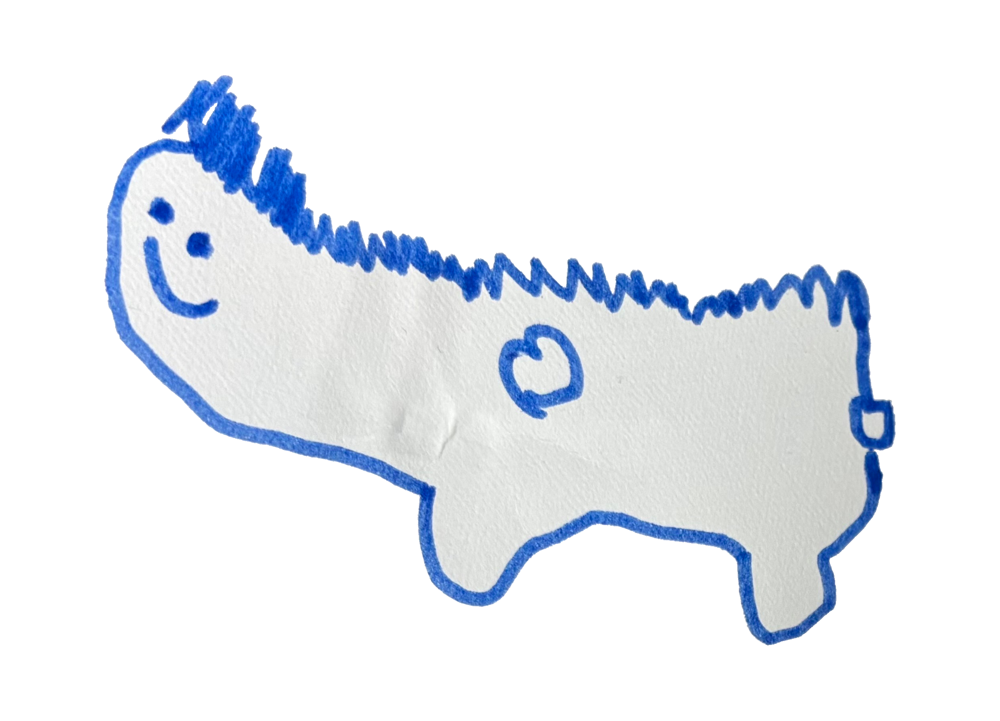

# ماذا أكتب في هذه المدونة؟

مرحباً!

اليوم أود التحدث عن سؤال بسيط ومألوف ولكنه يُطرح كثيراً: "ماذا تكتب في هذه المدونة؟"

قصة شائعة هي أن المدونات غالباً ما يُنظر إليها على أنها "مكان لنشر المعلومات المتخصصة". على سبيل المثال، يقول الناس أشياء مثل "إذا كانت مدونة تقنية، فيجب أن تكتب فقط عن التكنولوجيا بصراحة" أو "يجب فصل اليوميات عن العمل".

ولكن إذا قمت برسم الكثير من الخطوط هكذا، ألا يصبح الأمر خانقاً لكل من الكاتب والقارئ؟

في هذه المدونة، من المؤكد أن التكنولوجيا هي الموضوع الرئيسي. البرمجة والاكتشافات الصغيرة حول التطوير. أعتقد أن الأشخاص الذين يحبون هذا النوع من القصص سيستمتعون به.

ومع ذلك، هذا ليس كل شيء.

أكتب أيضاً شيئاً فشيئاً عن الاكتشافات اليومية الصغيرة والهوايات. على سبيل المثال، الأفكار التي تخطر ببالي أثناء المشي أو عن المانغا التي قرأتها مؤخراً. من المثير للاهتمام أن هذه الأشياء تكون مفيدة للآخرين بشكل غير متوقع.

قد يتساءل البعض، "هل من المقبول التحدث عن أشياء غير ذات صلة على الرغم من أنها مدونة تقنية؟" ولكن هذا هو بيت القصيد.

أعتقد أن العمل والهوايات والمشاكل اليومية كلها مترابطة. لذلك تتم كتابة هذه المدونة أيضاً في مثل هذا "الارتباط" و "التدفق".

لذا، إذا كان لديك أي أسئلة أو اهتمامات، فلا تتردد في التعليق. نرحب بأفكارك وانطباعاتك.

آمل أن تكون هذه المدونة مكاناً لمثل هذا التواصل المريح.
