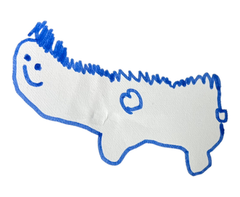

# このブログって何を書いてるの？

こんにちは！

今日は「このブログって何を書いてるの？」という、ちょっと素朴だけど、よく聞かれる質問についてお話ししようと思います。

よくある話ですが、ブログって「専門的な情報を発信する場」みたいに思われがちです。たとえば、「技術系なら技術だけを淡々と書くべきだ」とか、「日記は日記、仕事の話は仕事」って分けるべきだ、みたいなやつですね。

でも、そうやって線引きしすぎると、書く側も読む側もなんだか息苦しくなりませんか？

このブログでは、たしかに技術の話がメインです。プログラミングとか、開発周りのちょっとした発見とか。そういう話が好きな方には楽しんでもらえると思います。

とはいえ、それだけじゃないんです。

日常のちょっとした気づきとか、趣味の話とかも、ぽつぽつ書いてます。たとえば散歩中にふと考えたこととか、最近読んだ漫画の話とか。そういうのって、意外と誰かの役に立ったりするから面白いんですよね。

「技術ブログなのに関係ない話してもいいの？」と思う方もいるかもしれません。でも、そこがポイントです。

仕事も趣味も、日々の悩みも、すべてがつながってると思っていて。だからこのブログも、そういう「つながり」や「流れ」の中で書いています。

というわけで、もし何か気になることがあれば、気軽にコメントしてください。思ったこととか、ちょっとした感想でも大歓迎です。

このブログは、そんなゆるやかなコミュニケーションの場であれたらいいなと思っています。