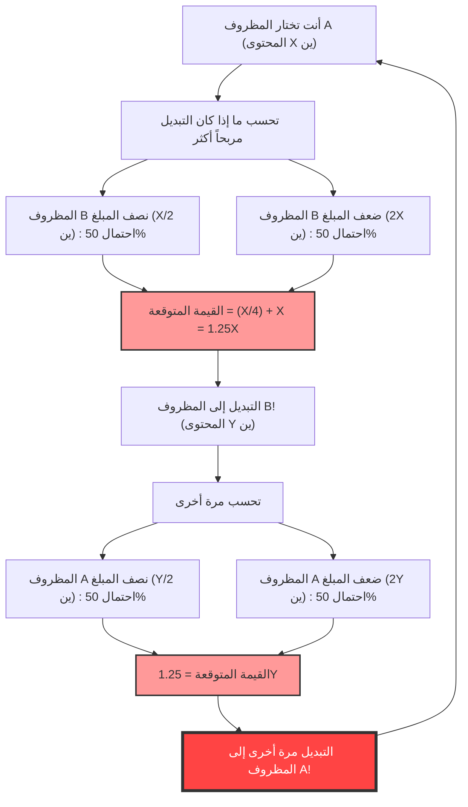
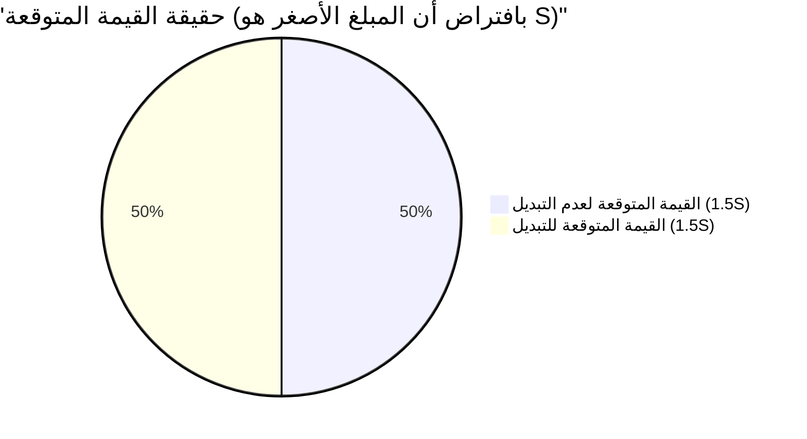

## 1. الخيار النهائي: هل يجب التبديل أم لا؟

أنت تقف في المرحلة النهائية من برنامج ألعاب. يوجد على الطاولة أمامك **مظروفان متطابقان تماماً (A و B)**.
قال المقدم:

> "أحد المظروفين يحتوي على **ضعف المبلغ** الموجود في المظروف الآخر. يرجى اختيار أحدهما."

بعد تردد، اخترت **المظروف A**.
في اللحظة التي حاولت فيها رؤية المحتوى، همس المقدم بوسوسة شيطانية:

> "الآن، **يمكنك تبديل** المظروف A بالمظروف B المتبقي. هل تريد التبديل؟"

الآن، هل يجب عليك تبديل المظروف؟

---

## 2. "الحلقة اللانهائية" التي يستنتجها حساب القيمة المتوقعة

دعونا نستخدم بعض التفكير الرياضي هنا.
لنفترض أن المبلغ الموجود في المظروف A الذي تحمله هو $X$ ين.
بناءً على القواعد، المبلغ في المظروف B هو إما "نصف $X$ ين ($\frac{X}{2}$)" أو "ضعف $X$ ين ($2X$)". احتمال كل منهما هو $\frac{1}{2}$ (50%).

لذا، دعونا نحسب **القيمة المتوقعة (متوسط المبلغ المتوقع) في حالة تبديل المظروف**.

$$ E = \frac{1}{2} \times \left(\frac{X}{2}\right) + \frac{1}{2} \times (2X) $$
$$ E = \frac{X}{4} + X = \frac{5}{4}X = 1.25X $$

لقد ظهرت نتيجة مذهلة.
بمجرد تبديل المظروف، تقفز القيمة المتوقعة من $X$ ين الأصلية لتصبح **$1.25$ ضعفاً** (زيادة بنسبة 25%).
نصل إلى استنتاج مفاده: "إذا فكرنا رياضياً، فمن المؤكد أن التبديل مربح أكثر!".

ولكن، هنا يحدث **انهيار للمنطق**.
لنفترض أنك بدّلت إلى المظروف B. ماذا لو سألك المقدم مباشرة بعد ذلك: "هل تريد العودة إلى A بعد كل شيء؟".
ستنطبق نفس المعادلة الحسابية تماماً، وهذه المرة سيكون الاستنتاج "التبديل من B إلى A سيزيد القيمة المتوقعة بمقدار 1.25 ضعفاً".

بمعنى آخر، **بمجرد الاستمرار في التبديل "من A إلى B" و "من B إلى A"، ستستمر القيمة المتوقعة النظرية في الزيادة إلى ما لا نهاية**. هذا يتناقض بوضوح مع الواقع (محتويات المظاريف ثابتة منذ البداية، ولا تزيد لمجرد أنك قمت بالتبديل).

لماذا أنتج حساب القيمة المتوقعة، الذي يبدو مثالياً للوهلة الأولى، مثل هذه المفارقة الغريبة؟

---

## 3. كشف الخدعة الرياضية: استبدال المتغيرات

يكمن فخ هذه المفارقة في **"كيفية استخدام المتغير العشوائي $X$"**.

في المعادلة السابقة، تعاملنا مع المبلغ $X$ في المظروف A على أنه **ثابت محدد**، وافترضنا أن المظروف B هو إما "$\frac{X}{2}$ أو $2X$".
ولكن، ما هو ثابت في الواقع هو **"مجموع المبالغ الموجودة في كلا المظروفين"**، أو **"المبلغ الأصغر"**.

لنفترض أن المبلغ الموجود في المظروف الذي يحتوي على الأقل هو $S$. إذاً، المظروف الذي يحتوي على الأكثر به مبلغ $2S$.
جميع سيناريوهات اللعبة تقتصر على النمطين التاليين فقط (باحتمال $\frac{1}{2}$ لكل منهما).

- **النمط 1:** المظروف A الذي اخترته هو الأصغر ($S$)، والمظروف B هو الأكبر ($2S$).
- **النمط 2:** المظروف A الذي اخترته هو الأكبر ($2S$)، والمظروف B هو الأصغر ($S$).

هنا، دعونا نحسب القيمة المتوقعة بشكل صحيح لكل من **"عدم التبديل"** و **"التبديل"**.

**القيمة المتوقعة في حالة عدم التبديل $E_{stay}$:**
$$ E_{stay} = \frac{1}{2} \times S + \frac{1}{2} \times 2S = \frac{3}{2}S = 1.5S $$

**القيمة المتوقعة في حالة التبديل $E_{switch}$:**
في النمط 1 ستحصل على $2S$، وفي النمط 2 ستحصل على $S$.
$$ E_{switch} = \frac{1}{2} \times 2S + \frac{1}{2} \times S = \frac{3}{2}S = 1.5S $$

$$ E_{stay} = E_{switch} $$

تطابقت القيمة المتوقعة تماماً!
في الحساب الخاطئ الأول، تم التعامل مع قيمتين مختلفتين على أنهما نفس المتغير $X$: في النمط 1 كان $X$ هو (في الواقع $S$) وفي النمط 2 كان $X$ هو (في الواقع $2S$). هذا أدى إلى خلق وهم بأن "التبديل سيزيد من القيمة المتوقعة".

---

## 4. ماذا لو فتحت المظروف؟

تبدو المفارقة محلولة بهذا. ومع ذلك، هناك مشكلة أعمق تنتظرنا.

ماذا لو **نظرت إلى محتويات المظروف A قبل تبديله**؟
فتحت المظروف A ووجدت بداخله **"10,000 ين"**.

في هذه اللحظة، يصبح $X = 10000$ قيمة محددة وثابتة.
يحتوي المظروف B إما على "5,000 ين" أو "20,000 ين".
ماذا سيحدث إذا طبقنا المعادلة الأولى هنا؟

$$ E_{switch} = \frac{1}{2} \times 5000 + \frac{1}{2} \times 20000 = 2500 + 10000 = 12500 $$

القيمة المتوقعة هي 12,500 ين. وهي بالتأكيد أعلى من الـ 10,000 ين الحالية.
علاوة على ذلك، وبما أن $X$ أصبح "ثابتاً ملموساً" وقدره 10,000 ين هذه المرة، فإن حجة "استبدال المتغيرات" السابقة لم تعد سارية.
إذاً، **هل التبديل مربح أكثر بالتأكيد** في هذه الحالة؟

### الدحض باستخدام الاستدلال البايزي: غياب "التوزيع المسبق"

رداً على ذلك، طرح علماء الرياضيات مفهوم **"التوزيع المسبق للمبالغ (الاحتمال المسبق)"**.
والسؤال هنا: هل يمكننا حقاً القول إن 5,000 ين و 20,000 ين موجودان باحتمال $\frac{1}{2}$ لكل منهما؟

على سبيل المثال، لنفترض أن ميزانية البرنامج تبلغ كحد أقصى 100 مليون ين. إذا فتحت المظروف A ووجدت "60 مليون ين"، فإن احتمال أن يحتوي المظروف B على "120 مليون ين" هو صفر (لأنه يتجاوز الميزانية). بمعنى آخر، كلما زاد المبلغ في المظروف A، قلّ احتمال أن يكون المظروف B "ضعف المبلغ"، وزاد احتمال أن يكون "نصفه".

بافتراض أي توزيع مسبق $P(x)$، وعند حساب القيمة المتوقعة باستخدام مبرهنة بايز، فقد ثبت رياضياً أنه **مهما كان التوزيع الاحتمالي واقعياً (بمجموع يساوي 1)، فإنه لا يوجد توزيع سحري يجعل "التبديل مربحاً أكثر" لجميع قيم $X$**.

---

## 5. فخ اللانهاية: الارتباط بمفارقة سانت بطرسبرغ

توجد حالة واحدة فقط يكون فيها "التبديل مربحاً أكثر لجميع قيم $X$".
هذه الحالة هي عندما تكون ميزانية البرنامج **لانهائية**، ويُفترض وجود "توزيع احتمالي غير قياسي (توزيع يكون مجموعه لانهائياً)" حيث تظهر جميع المبالغ (1 ين، 2 ين، 4 ين، 8 ين... إلى ما لا نهاية) بشكل متساوٍ.

ومع ذلك، لا توجد في العالم الحقيقي محطة تلفزيونية تمتلك أصولاً لانهائية.
هذا الخلل الناتج عن "القيمة المتوقعة اللانهائية" يشترك في جذور عميقة مع **مفارقة سانت بطرسبرغ** (وهي مسألة تتناول المبلغ الذي يمكن للشخص أن يدفعه في مقامرة ذات قيمة متوقعة لانهائية).

## 6. الخلاصة: رعب الاحتمالات والقيمة المتوقعة

على الرغم من أن "مفارقة المظروفين" تتكون فقط من عمليات ضرب وجمع بسيطة، إلا أنها تقدم لنا الدروس التالية:

1. **الأخطاء الناتجة عن الغموض في التعريف**: إذا لم توضح ما يشير إليه المتغير (ما إذا كان $X$ يشير دائماً إلى نفس المبلغ)، فإن المنطق سينهار بسهولة.
2. **وهم "انعدام المعلومات = احتمال 50%"**: الافتراض القائل "بما أنني لا أعرف فالاحتمال متساوٍ" (مبدأ السبب غير الكافي) يمكن أن يؤدي أحياناً إلى أخطاء حسابية قاتلة.
3. **صعوبة التعامل مع اللانهاية**: إدخال مفهوم "اللانهاية"، الذي لا يمكن تطبيقه في العالم الحقيقي، في المعادلات الحسابية سيؤدي إلى نتائج تتناقض مع الفطرة السليمة.

في المرة القادمة التي تعتقد فيها في حياتك أن "عشب الجار يبدو أكثر اخضراراً، وسيكون من المربح التبديل"، تذكر هذه المفارقة. ربما تم استبدال المتغيرات في معادلتك الحسابية دون أن تدرك.
