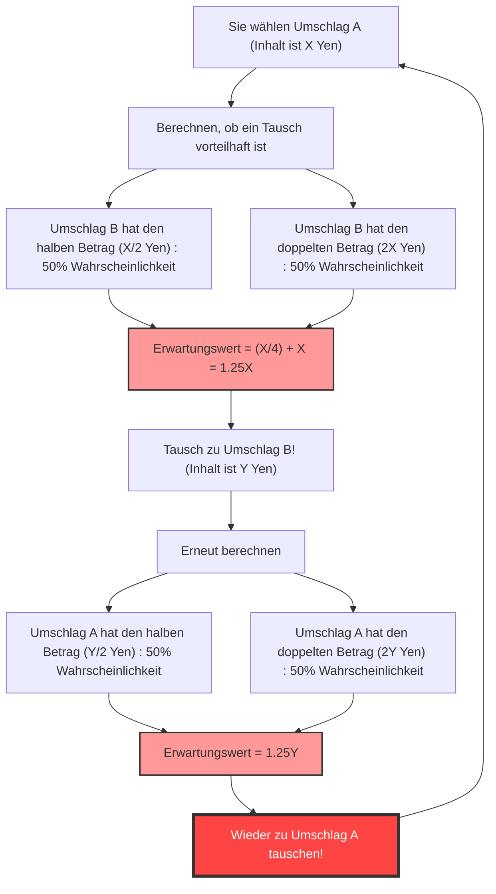
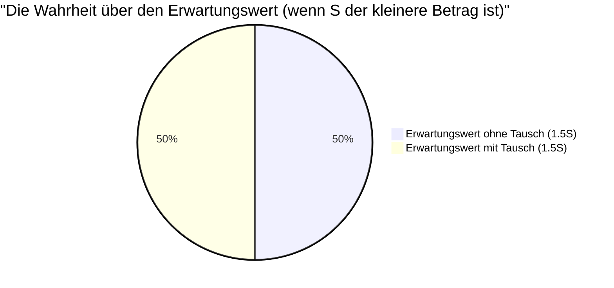

## 1. Die ultimative Wahl: Tauschen oder nicht tauschen?

Sie stehen in der Endrunde einer Spielshow. Auf dem Tisch vor Ihnen liegen **zwei identisch aussehende Umschläge (A und B)**.
Der Moderator sagt:

> "Ein Umschlag enthält **doppelt so viel Geld** wie der andere. Bitte wählen Sie einen."

Nach kurzem Zögern entscheiden Sie sich für **Umschlag A**.
Gerade als Sie hineinsehen wollen, flüstert der Moderator Ihnen verlockend zu:

> "Wenn Sie möchten, können Sie jetzt Ihren Umschlag A gegen den verbleibenden Umschlag B **eintauschen**. Möchten Sie tauschen?"

Sollten Sie die Umschläge nun tauschen?

---

## 2. Die "unendliche Schleife", die durch die Erwartungswertberechnung entsteht

Lassen Sie uns hier ein wenig mathematisch denken.
Angenommen, der Betrag in Ihrem Umschlag A ist $X$ Yen.
Nach den Regeln ist der Betrag in Umschlag B entweder "die Hälfte von $X$ Yen ($\frac{X}{2}$)" oder "das Doppelte von $X$ Yen ($2X$)". Die Wahrscheinlichkeit für beides beträgt jeweils $\frac{1}{2}$ (50%).

Lassen Sie uns nun den **Erwartungswert (den erwarteten durchschnittlichen Betrag), wenn Sie die Umschläge tauschen**, berechnen.

$$ E = \frac{1}{2} \times \left(\frac{X}{2}\right) + \frac{1}{2} \times (2X) $$
$$ E = \frac{X}{4} + X = \frac{5}{4}X = 1.25X $$

Ein erstaunliches Ergebnis.
Allein durch den Tausch der Umschläge springt der Erwartungswert vom ursprünglichen $X$ Yen auf das **1,25-fache** (eine Steigerung um 25%).
Die Schlussfolgerung lautet: "Mathematisch gesehen ist es definitiv vorteilhaft zu tauschen!"

Aber hier kommt es zu einem **logischen Zusammenbruch**.
Angenommen, Sie haben zu Umschlag B gewechselt. Was passiert, wenn der Moderator Sie unmittelbar danach fragt: "Möchten Sie vielleicht doch wieder zu A wechseln?"
Genau dieselbe Formel gilt, und diesmal bedeutet es: "Wenn Sie von B zu A wechseln, erhöht sich der Erwartungswert auf das 1,25-fache."

Das heißt, **wenn Sie einfach nur "von A zu B" und "von B zu A" hin und her tauschen, würde der theoretische Erwartungswert ins Unendliche steigen**. Dies widerspricht offensichtlich der Realität (der Inhalt der Umschläge ist von Anfang an festgelegt und vermehrt sich nicht durch den Tausch).

Warum hat diese scheinbar perfekte Berechnung des Erwartungswertes ein so seltsames Paradoxon hervorgebracht?

---

## 3. Den mathematischen Trick aufklären: Der Austausch von Variablen

Die Falle dieses Paradoxons liegt in der **"Verwendung der Zufallsvariablen $X$"**.

In der vorherigen Formel haben wir den Betrag $X$ in Umschlag A wie eine **feste Konstante** behandelt und angenommen, dass Umschlag B "$\frac{X}{2}$ oder $2X$".
Was jedoch tatsächlich feststeht, ist **"die Summe der Beträge in beiden Umschlägen"** oder **"der kleinere Betrag"**.

Nennen wir den Betrag im Umschlag mit dem kleineren Geldbetrag $S$. Dann enthält der Umschlag mit dem größeren Betrag $2S$.
Es gibt nur zwei mögliche Szenarien für das Spiel (jeweils mit einer Wahrscheinlichkeit von $\frac{1}{2}$).

- **Szenario 1:** Der von Ihnen gewählte Umschlag A ist der kleinere ($S$) und Umschlag B ist der größere ($2S$).
- **Szenario 2:** Der von Ihnen gewählte Umschlag A ist der größere ($2S$) und Umschlag B ist der kleinere ($S$).

Lassen Sie uns nun den Erwartungswert für das **"Nicht-Tauschen"** und das **"Tauschen"** korrekt berechnen.

**Erwartungswert bei Nicht-Tausch $E_{stay}$:**
$$ E_{stay} = \frac{1}{2} \times S + \frac{1}{2} \times 2S = \frac{3}{2}S = 1.5S $$

**Erwartungswert bei Tausch $E_{switch}$:**
In Szenario 1 erhalten Sie $2S$, und in Szenario 2 erhalten Sie $S$.
$$ E_{switch} = \frac{1}{2} \times 2S + \frac{1}{2} \times S = \frac{3}{2}S = 1.5S $$

$$ E_{stay} = E_{switch} $$

Die Erwartungswerte stimmen perfekt überein!
In der ersten falschen Berechnung haben wir **unterschiedliche Werte als dieselbe Variable $X$ behandelt** – nämlich $X$ in Szenario 1 (was eigentlich $S$ ist) und $X$ in Szenario 2 (was eigentlich $2S$ ist) –, was die Illusion erzeugte, dass "ein Tausch den Erwartungswert erhöht".

---

## 4. Was passiert, wenn Sie den Umschlag öffnen?

Das Paradoxon scheint hiermit gelöst zu sein. Es wartet jedoch noch ein tiefergehendes Problem.

Was wäre, wenn Sie **den Inhalt Ihres Umschlags A sehen, bevor Sie tauschen**?
Als Sie Umschlag A öffnen, befinden sich darin **"10.000 Yen"**.

In diesem Moment wird der Wert auf $X = 10000$ festgelegt.
Umschlag B enthält entweder "5.000 Yen" oder "20.000 Yen".
Was passiert, wenn wir hier die erste Formel anwenden?

$$ E_{switch} = \frac{1}{2} \times 5000 + \frac{1}{2} \times 20000 = 2500 + 10000 = 12500 $$

Der Erwartungswert beträgt 12.500 Yen. Er ist definitiv höher als die aktuellen 10.000 Yen.
Darüber hinaus ist der Gegenbeweis des "Austauschs von Variablen" nicht mehr gültig, da $X$ diesmal eine "spezifische Konstante" von 10.000 Yen ist.
Ist es unter diesen Umständen **absolut vorteilhafter zu tauschen**?

### Widerlegung durch Bayes-Schätzung: Die fehlende "A-priori-Verteilung"

Mathematiker haben daraufhin das Konzept der **"A-priori-Verteilung (A-priori-Wahrscheinlichkeit) des Geldbetrags"** eingeführt.
Es stellt sich die Frage: Können wir wirklich sagen, dass 5.000 Yen und 20.000 Yen mit einer Wahrscheinlichkeit von jeweils $\frac{1}{2}$ enthalten sind?

Angenommen, das maximale Budget der Sendung beträgt 100 Millionen Yen. Wenn Sie Umschlag A öffnen und "60 Millionen Yen" darin finden, ist die Wahrscheinlichkeit, dass Umschlag B "120 Millionen Yen" enthält, gleich null (da das Budget überschritten wäre). Mit anderen Worten: Je höher der Betrag in Umschlag A ist, desto geringer muss die Wahrscheinlichkeit sein, dass Umschlag B "doppelt" so viel enthält, und desto höher muss die Wahrscheinlichkeit sein, dass er "halb" so viel enthält.

Wenn wir den Erwartungswert unter Annahme einer beliebigen A-priori-Verteilung $P(x)$ und der Anwendung des Satzes von Bayes berechnen, ist mathematisch bewiesen, dass **für keine realistische Wahrscheinlichkeitsverteilung (deren Summe 1 ergibt) eine magische Verteilung existiert, bei der sich ein "Tausch für alle Beträge $X$ lohnt"**.

---

## 5. Die Falle der Unendlichkeit: Verbindung zum Sankt-Petersburg-Paradoxon

Es gibt nur einen einzigen Fall, in dem es vorteilhaft wäre, für "alle $X$" zu tauschen.
Dies ist nur dann der Fall, wenn das Budget der Sendung **unendlich** ist und wir eine "uneigentliche Wahrscheinlichkeitsverteilung (eine Verteilung, deren Summe unendlich ist)" annehmen, bei der alle Geldbeträge (1 Yen, 2 Yen, 4 Yen, 8 Yen... bis ins Unendliche) mit gleicher Wahrscheinlichkeit auftreten.

In der realen Welt gibt es jedoch keinen Fernsehsender mit unbegrenzten Mitteln.
Dieser durch einen "unendlichen Erwartungswert" verursachte Fehler ist tief verwurzelt mit dem **Sankt-Petersburg-Paradoxon** (dem Problem, wie viel eine Person für ein Glücksspiel mit einem unendlichen Erwartungswert bezahlen würde).

## 6. Fazit: Die Schrecken von Wahrscheinlichkeit und Erwartungswert

Obwohl das "Zwei-Umschläge-Paradoxon" nur aus einfachen Multiplikationen und Additionen besteht, lehrt es uns folgende Lektionen:

1. **Fehler, die durch unscharfe Definitionen entstehen**: Wenn nicht klar ist, worauf sich eine Variable bezieht (ob $X$ immer denselben Betrag bedeutet), bricht die Logik leicht zusammen.
2. **Die Illusion, dass "keine Information = 50% Wahrscheinlichkeit" bedeutet**: Die Prämisse "Ich weiß es nicht, also ist es halbe-halbe" (Prinzip des unzureichenden Grundes) führt manchmal zu fatalen Berechnungsfehlern.
3. **Die Schwierigkeit, mit der Unendlichkeit umzugehen**: Wenn das Konzept der "Unendlichkeit", das nicht auf die reale Welt angewendet werden kann, in Berechnungen eingeführt wird, führt dies zu Ergebnissen, die dem gesunden Menschenverstand widersprechen.

Wenn Sie das nächste Mal im Leben denken: "Das Gras des Nachbarn ist grüner, ein Tausch wäre vorteilhaft", erinnern Sie sich an dieses Paradoxon. Vielleicht sind in Ihrer Berechnung nur die Variablen ausgetauscht worden.
