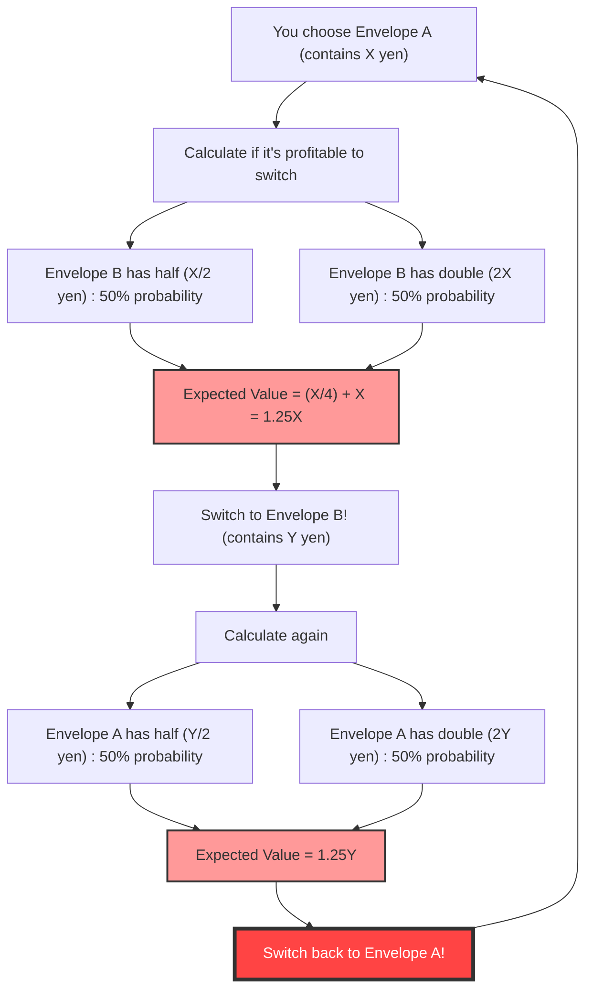
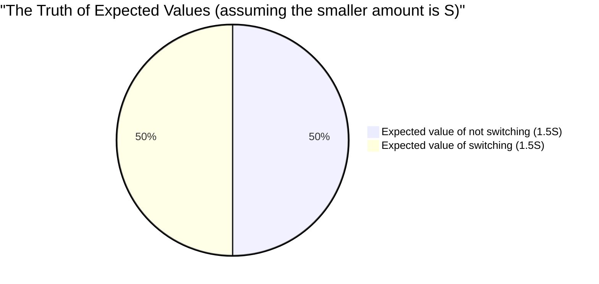

## 1. The Ultimate Choice: To Switch or Not to Switch?

You are standing on the final stage of a game show. On the table in front of you are **two identical-looking envelopes (A and B)**.
The host says to you:

> "One envelope contains **twice as much money** as the other. Please choose one."

After some hesitation, you choose **Envelope A**.
Just as you are about to look inside, the host whispers the devil's temptation:

> "You can **exchange** your Envelope A with the remaining Envelope B right now if you want. Would you like to switch?"

Now, should you switch your envelope?

---

## 2. The "Infinite Loop" Derived from Expected Value Calculations

Let's exercise some mathematical thinking here.
Suppose the amount in your Envelope A is $X$ yen.
According to the rules, the amount in Envelope B is either "half of $X$ yen ($\frac{X}{2}$)" or "twice $X$ yen ($2X$)". The probability for each is $\frac{1}{2}$ (50%).

Now, let's calculate the **expected value (the estimated average amount) if you switch envelopes**.

$$ E = \frac{1}{2} \times \left(\frac{X}{2}\right) + \frac{1}{2} \times (2X) $$
$$ E = \frac{X}{4} + X = \frac{5}{4}X = 1.25X $$

A surprising result emerges.
By simply switching envelopes, the expected value jumps to **$1.25$ times** (a 25% increase) the original $X$ yen.
The conclusion becomes, "If you think mathematically, it's definitely better to switch!"

However, a **collapse of logic** occurs here.
Suppose you switched to Envelope B. What happens if the host asks again right after, "Do you want to switch back to A after all?"
The exact same calculation formula applies, and this time it means "Switching from B to A will increase the expected value by 1.25 times."

In other words, **just by continuously switching "from A to B" and "from B to A", the theoretical expected value will keep increasing infinitely**. This clearly contradicts reality (the contents of the envelopes are fixed from the start and do not increase just because you switch them).

Why did a seemingly perfect expected value calculation produce such a strange paradox?

---

## 3. Demystifying the Mathematical Trick: The Swap of Variables

The trap of this paradox lies in **"how the random variable $X$ is used"**.

In the previous calculation formula, we treated the amount $X$ in Envelope A as a **fixed constant**, and assumed Envelope B is either "$\frac{X}{2}$ or $2X$".
However, what is actually fixed is the **"total amount of money in the two envelopes"**, or the **"smaller amount"**.

Let $S$ be the amount in the envelope with less money. Then, the envelope with more money contains $2S$.
There are only two possible scenarios for the entire game (the probability of each is $\frac{1}{2}$).

- **Pattern 1:** Envelope A you chose has the smaller amount ($S$), and Envelope B has the larger amount ($2S$)
- **Pattern 2:** Envelope A you chose has the larger amount ($2S$), and Envelope B has the smaller amount ($S$)

Now, let's correctly calculate the expected values for **"not switching"** and **"switching"** the envelopes.

**Expected value when not switching $E_{stay}$:**
$$ E_{stay} = \frac{1}{2} \times S + \frac{1}{2} \times 2S = \frac{3}{2}S = 1.5S $$

**Expected value when switching $E_{switch}$:**
You get $2S$ in Pattern 1, and $S$ in Pattern 2.
$$ E_{switch} = \frac{1}{2} \times 2S + \frac{1}{2} \times S = \frac{3}{2}S = 1.5S $$

$$ E_{stay} = E_{switch} $$

The expected values match perfectly!
In the first incorrect calculation, we treated the $X$ in Pattern 1 (which is actually $S$) and the $X$ in Pattern 2 (which is actually $2S$) as **different values using the same variable $X$**, which created the illusion that "switching increases the expected value."

---

## 4. What If You Open the Envelope?

The paradox seems to be resolved. However, a deeper problem awaits.

What if you **looked inside your Envelope A before exchanging envelopes**?
When you open Envelope A, you find **"10,000 yen"** inside.

At this moment, $X = 10000$ becomes a fixed value.
Envelope B contains either "5,000 yen" or "20,000 yen".
What happens if we apply the very first calculation formula here?

$$ E_{switch} = \frac{1}{2} \times 5000 + \frac{1}{2} \times 20000 = 2500 + 10000 = 12500 $$

The expected value is 12,500 yen. It is certainly higher than the current 10,000 yen.
Moreover, since $X$ is now a "specific constant" of 10,000 yen, the previous counterargument of the "swap of variables" no longer applies.
In this case, is it **absolutely better to switch**?

### The Disproof by Bayesian Inference: The Missing "Prior Distribution"

In response to this, mathematicians introduced the concept of the **"prior distribution of amounts (prior probability)"**.
The question is whether we can truly say that 5,000 yen and 20,000 yen are each inside with a $\frac{1}{2}$ probability.

For example, suppose the maximum budget for the show is 100 million yen. If you open Envelope A and find "60 million yen", the probability that Envelope B contains "120 million yen" is zero (because it's over budget). In other words, as the amount in Envelope A gets larger, the probability that Envelope B is "double" must decrease, and the probability that it is "half" must increase.

When calculating the expected value using Bayes' theorem assuming an arbitrary prior distribution $P(x)$, it has been mathematically proven that **under any realistic probability distribution (where the sum is 1), there is no magical distribution that makes it "better to switch" for all amounts of $X$**.

---

## 5. The Infinite Trap: Connection to the St. Petersburg Paradox

There is only one case where it is "better to switch for all $X$".
That is only if we assume the show's budget is **infinite** and all amounts (1 yen, 2 yen, 4 yen, 8 yen... up to infinity) appear uniformly—an "improper prior distribution" (a distribution whose sum is infinity).

However, in the real world, no television station has infinite assets.
The bug caused by this "infinite expected value" shares deep roots with the **St. Petersburg paradox** (the problem of how much a person would be willing to pay for a gamble with an infinite expected value).

## 6. Conclusion: The Terrors of Probability and Expected Value

Even though the "Two Envelopes Paradox" consists only of simple multiplication and addition, it teaches us the following lessons:

1. **Errors caused by ambiguity in definitions**: If you do not clarify what a variable refers to (whether $X$ always refers to the same amount), logic can easily collapse.
2. **The illusion of "no information = 50% probability"**: The assumption that "because we don't know, it must be fifty-fifty" (the principle of insufficient reason) can sometimes lead to fatal miscalculations.
3. **The difficulty of handling infinity**: Introducing the concept of "infinity," which cannot be applied to the real world, into calculation formulas produces results that defy common sense.

The next time in life you think, "The grass is greener on the other side, so it's better to switch," remember this paradox. In your calculation formula, the variables might just be getting swapped.
