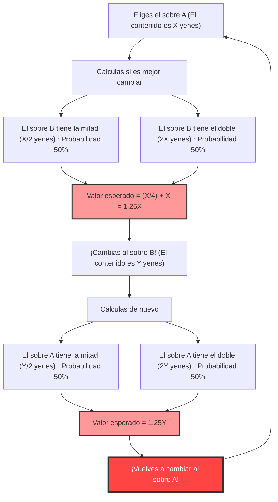
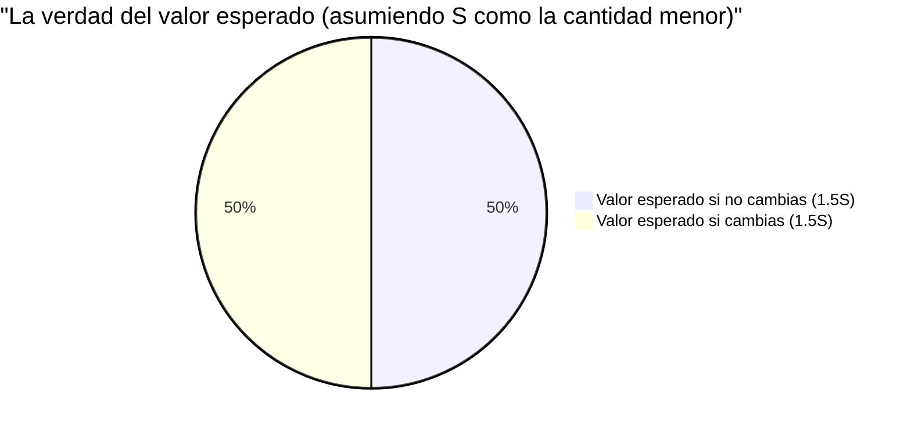

## 1. La decisión definitiva: ¿Cambiar o no cambiar?

Estás en la etapa final de un programa de juegos. En la mesa frente a ti hay **dos sobres (A y B)** que se ven exactamente iguales.
El presentador te dice:

> "Un sobre contiene el **doble de dinero** que el otro. Por favor, elige uno."

Después de dudar, eliges el **sobre A**.
Justo cuando estás a punto de ver lo que hay dentro, el presentador te susurra como un demonio.

> "Ahora mismo, puedes **cambiar** ese sobre A por el sobre B restante si quieres. ¿Lo cambias?"

Entonces, ¿deberías cambiar los sobres?

---

## 2. El "bucle infinito" que se deduce del cálculo del valor esperado

Aquí, pongamos en práctica un poco de pensamiento matemático.
Supongamos que la cantidad de dinero en tu sobre A es de $X$ yenes.
La cantidad en el sobre B, según las reglas, es "la mitad de $X$ yenes ($\frac{X}{2}$)" o "el doble de $X$ yenes ($2X$)". La probabilidad de cada uno es $\frac{1}{2}$ (50%).

Entonces, calculemos el **valor esperado (la cantidad promedio esperada) si cambias el sobre**.

$$ E = \frac{1}{2} \times \left(\frac{X}{2}\right) + \frac{1}{2} \times (2X) $$
$$ E = \frac{X}{4} + X = \frac{5}{4}X = 1.25X $$

El resultado es sorprendente.
Con solo cambiar el sobre, el valor esperado salta de los $X$ yenes originales a **$1.25$ veces** (un aumento del 25%).
La conclusión es: "¡Pensando matemáticamente, definitivamente es más rentable cambiar!".

Sin embargo, aquí ocurre un **colapso lógico**.
Supongamos que lo cambiaste por el sobre B. ¿Qué pasaría si, inmediatamente después, el presentador volviera a preguntar: "¿Quieres volver al A después de todo?"?
Se aplicará exactamente la misma fórmula, y esta vez será "cambiar de B a A aumentará el valor esperado 1,25 veces".

Es decir, **el valor esperado teórico seguirá aumentando infinitamente con solo seguir cambiando "de A a B" y "de B a A"**. Esto es claramente contradictorio con la realidad (el contenido del sobre está determinado desde el principio, y no aumentará solo porque lo cambies).

¿Por qué un cálculo del valor esperado que parece perfecto a primera vista crea una paradoja tan extraña?

---

## 3. Aclarando el truco matemático: el intercambio de variables

La trampa de esta paradoja reside en el **"uso de la variable aleatoria $X$"**.

En la fórmula anterior, tratamos la cantidad $X$ del sobre A como una **constante fija** y supusimos que el sobre B era "$\frac{X}{2}$ o $2X$".
Sin embargo, lo que originalmente está fijo es **"la suma de las cantidades en los dos sobres"**, o **"la cantidad menor"**.

Sea $S$ la cantidad en el sobre con menos dinero. Entonces, el sobre con más dinero contiene la cantidad de $2S$.
Hay solo dos patrones para todos los escenarios del juego (cada uno con una probabilidad de $\frac{1}{2}$).

- **Patrón 1:** El sobre A que elegiste es el que tiene menos ($S$) y el sobre B es el que tiene más ($2S$)
- **Patrón 2:** El sobre A que elegiste es el que tiene más ($2S$) y el sobre B es el que tiene menos ($S$)

Aquí calcularemos correctamente el valor esperado para **"cuando no cambias"** y **"cuando cambias"** el sobre.

**Valor esperado cuando no cambias $E_{stay}$:**
$$ E_{stay} = \frac{1}{2} \times S + \frac{1}{2} \times 2S = \frac{3}{2}S = 1.5S $$

**Valor esperado cuando cambias $E_{switch}$:**
En el patrón 1 obtienes $2S$, y en el patrón 2 obtienes $S$.
$$ E_{switch} = \frac{1}{2} \times 2S + \frac{1}{2} \times S = \frac{3}{2}S = 1.5S $$

$$ E_{stay} = E_{switch} $$

¡El valor esperado coincide perfectamente!
En el primer cálculo incorrecto, la ilusión de que "el valor esperado aumenta si cambias" fue creada por **tratar diferentes valores, el $X$ en el patrón 1 (en realidad $S$) y el $X$ en el patrón 2 (en realidad $2S$), como la misma variable $X$**.

---

## 4. ¿Qué pasa si ya has abierto el sobre?

La paradoja parece estar resuelta con esto. Sin embargo, nos espera un problema más profundo.

¿Qué pasaría si, **antes de cambiar de sobre, vieras lo que hay dentro de tu sobre A**?
Abres el sobre A y resulta que contiene **"10,000 yenes"**.

En este momento, se convierte en un valor confirmado de $X = 10000$.
El sobre B contiene "5,000 yenes" o "20,000 yenes".
¿Qué sucede si aplicamos la primera fórmula aquí?

$$ E_{switch} = \frac{1}{2} \times 5000 + \frac{1}{2} \times 20000 = 2500 + 10000 = 12500 $$

El valor esperado es de 12,500 yenes. Es indudablemente más alto que los 10,000 yenes actuales.
Además, esta vez $X$ es una "constante específica" de 10,000 yenes, por lo que el contraargumento de "intercambio de variables" de antes no es aplicable.
Siendo este el caso, **¿es absolutamente más rentable cambiar?**

### Refutación por inferencia bayesiana: Falta de "distribución a priori"

Frente a esto, los matemáticos introdujeron el concepto de **"distribución a priori (probabilidad a priori) de la cantidad de dinero"**.
La pregunta es si realmente podemos decir que los 5,000 yenes y los 20,000 yenes tienen cada uno una probabilidad de $\frac{1}{2}$ de estar dentro.

Por ejemplo, digamos que el presupuesto máximo del programa es de 100 millones de yenes. Si abres el sobre A y tiene "60 millones de yenes", la probabilidad de que el sobre B tenga "120 millones de yenes" es cero (porque supera el presupuesto). En otras palabras, cuanto mayor sea la cantidad en el sobre A, menor debería ser la probabilidad de que el sobre B tenga "el doble", y mayor debería ser la probabilidad de que tenga "la mitad".

Si calculamos el valor esperado usando el Teorema de Bayes asumiendo una distribución a priori arbitraria $P(x)$, se ha demostrado matemáticamente que **para cualquier distribución de probabilidad realista (cuya suma es 1), no existe una distribución mágica en la que "sea más rentable cambiar" para todas las cantidades $X$**.

---

## 5. La trampa del infinito: la conexión con la paradoja de San Petersburgo

Existe un único caso en el que "es más rentable cambiar para todas las cantidades $X$".
Eso es solo cuando el presupuesto del programa es **infinito** y asumimos una "distribución de probabilidad impropia (una distribución cuya suma es infinita)" en la que todas las cantidades (1 yen, 2 yenes, 4 yenes, 8 yenes... infinito) aparecen de manera uniforme.

Sin embargo, en el mundo real no existe una cadena de televisión con activos infinitos.
El error causado por este "valor esperado infinito" está profundamente arraigado en la **Paradoja de San Petersburgo** (el problema de cuánto estaría dispuesta a pagar una persona por una apuesta con un valor esperado infinito).

## 6. Resumen: Los peligros de la probabilidad y el valor esperado

"La paradoja de los dos sobres", a pesar de consistir únicamente en multiplicaciones y sumas simples, nos enseña las siguientes lecciones.

1. **Errores nacidos de definiciones ambiguas**: si no dejas claro a qué se refiere una variable (¿$X$ siempre se refiere a la misma cantidad?), la lógica colapsa fácilmente.
2. **La ilusión de que "sin información = probabilidad del 50%"**: la suposición de "no sé, así que será mitad y mitad" (el principio de razón insuficiente) a veces provoca errores de cálculo fatales.
3. **La dificultad de tratar con el infinito**: introducir el concepto de "infinito", que no se puede aplicar al mundo real, en fórmulas de cálculo produce resultados que van en contra del sentido común.

La próxima vez en la vida que pienses que "el césped del vecino se ve más verde y es mejor cambiar", recuerda esta paradoja. Es posible que solo se hayan intercambiado las variables en tu fórmula de cálculo.
