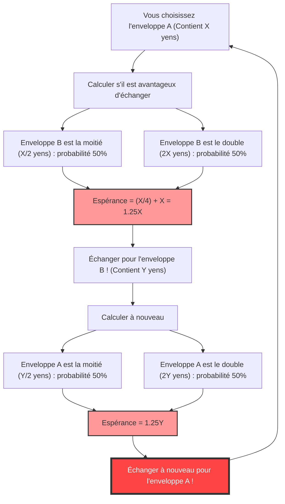
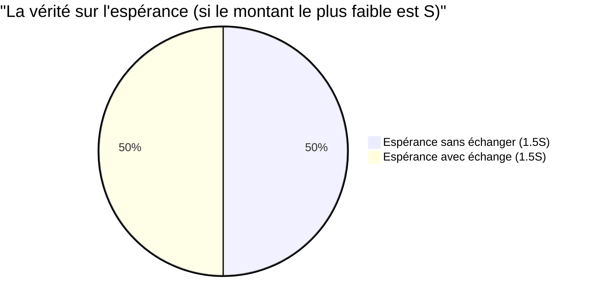

## 1. Le choix ultime : échanger ou ne pas échanger ?

Vous êtes à l'étape finale d'un jeu télévisé. Sur la table devant vous se trouvent **deux enveloppes (A et B)** d'apparence identique.
Le présentateur vous dit :

> « L'une des enveloppes contient le **double de l'argent** de l'autre. Veuillez en choisir une. »

Après avoir hésité, vous avez choisi **l'enveloppe A**.
Au moment où vous vous apprêtez à regarder à l'intérieur, le présentateur vous murmure une tentation diabolique :

> « Maintenant, si vous le souhaitez, **vous pouvez échanger** cette enveloppe A avec l'enveloppe B restante. Voulez-vous échanger ? »

Alors, devriez-vous échanger les enveloppes ?

---

## 2. La « boucle infinie » déduite par le calcul de l'espérance

Ici, exerçons un peu de réflexion mathématique.
Supposons que le montant contenu dans l'enveloppe A que vous possédez est de $X$ yens.
Le montant contenu dans l'enveloppe B est, selon les règles, soit « la moitié de $X$ yens ($\frac{X}{2}$) », soit « le double de $X$ yens ($2X$) ». La probabilité est de $\frac{1}{2}$ (50 %) pour chacun.

Calculons maintenant **l'espérance (le montant moyen attendu) si vous échangez les enveloppes**.

$$ E = \frac{1}{2} \times \left(\frac{X}{2}\right) + \frac{1}{2} \times (2X) $$
$$ E = \frac{X}{4} + X = \frac{5}{4}X = 1.25X $$

Un résultat surprenant est apparu.
Rien qu'en échangeant les enveloppes, l'espérance bondit à **$1.25$ fois** (une augmentation de 25 %) le montant initial $X$.
La conclusion est : « Mathématiquement parlant, il est absolument avantageux d'échanger ! »

Cependant, c'est ici que se produit **l'effondrement logique**.
Supposons que vous ayez échangé pour l'enveloppe B. Que se passerait-il si, juste après, le présentateur vous demandait à nouveau : « Voulez-vous finalement revenir à A ? »
La formule de calcul exacte s'applique de la même manière, et cette fois, la conclusion serait « l'espérance sera multipliée par 1.25 si vous passez de B à A ».

En d'autres termes, **rien qu'en continuant à échanger de « A vers B » puis de « B vers A », l'espérance théorique continuerait d'augmenter indéfiniment**. Cela contredit clairement la réalité (le contenu des enveloppes est déterminé dès le départ et n'augmente pas parce que vous les avez échangées).

Pourquoi un calcul d'espérance en apparence parfait a-t-il produit un paradoxe aussi étrange ?

---

## 3. Explication de l'astuce mathématique : la substitution de variables

Le piège de ce paradoxe réside dans **« l'utilisation de la variable aléatoire $X$ »**.

Dans la formule précédente, nous avons traité le montant $X$ de l'enveloppe A comme une **constante fixe**, et avons supposé que l'enveloppe B était « $\frac{X}{2}$ ou $2X$ ».
Cependant, ce qui est véritablement fixe est la **« somme des montants dans les deux enveloppes »**, ou encore le **« montant le plus faible »**.

Soit $S$ le montant dans l'enveloppe contenant le moins d'argent. Alors, l'enveloppe contenant le plus d'argent contient un montant de $2S$.
Il n'y a que les 2 scénarios suivants pour l'ensemble du jeu (avec une probabilité de $\frac{1}{2}$ chacun).

- **Scénario 1 :** L'enveloppe A que vous avez choisie contient le plus faible montant ($S$), et l'enveloppe B contient le montant le plus élevé ($2S$)
- **Scénario 2 :** L'enveloppe A que vous avez choisie contient le montant le plus élevé ($2S$), et l'enveloppe B contient le plus faible montant ($S$)

Maintenant, calculons correctement l'espérance pour les cas **« si vous n'échangez pas »** et **« si vous échangez »**.

**Espérance si vous n'échangez pas $E_{stay}$ :**
$$ E_{stay} = \frac{1}{2} \times S + \frac{1}{2} \times 2S = \frac{3}{2}S = 1.5S $$

**Espérance si vous échangez $E_{switch}$ :**
Dans le scénario 1, vous obtenez $2S$, et dans le scénario 2, vous obtenez $S$.
$$ E_{switch} = \frac{1}{2} \times 2S + \frac{1}{2} \times S = \frac{3}{2}S = 1.5S $$

$$ E_{stay} = E_{switch} $$

L'espérance concorde parfaitement !
Dans le premier calcul erroné, nous avons traité $X$ du scénario 1 (qui est en réalité $S$) et $X$ du scénario 2 (qui est en réalité $2S$) **comme s'il s'agissait de la même variable $X$, alors qu'ils ont des valeurs différentes**, ce qui a créé l'illusion que « l'espérance augmente si l'on échange ».

---

## 4. Que se passe-t-il si vous ouvrez l'enveloppe ?

Le paradoxe semble résolu. Cependant, un problème plus profond vous attend.

Que se passerait-il si, **avant d'échanger les enveloppes, vous regardiez à l'intérieur de votre enveloppe A** ?
En ouvrant l'enveloppe A, vous découvrez qu'elle contient **« 10 000 yens »**.

À cet instant, la valeur devient une certitude : $X = 10000$.
L'enveloppe B contient alors soit « 5 000 yens », soit « 20 000 yens ».
Que se passe-t-il si l'on applique la première formule de calcul ici ?

$$ E_{switch} = \frac{1}{2} \times 5000 + \frac{1}{2} \times 20000 = 2500 + 10000 = 12500 $$

L'espérance est de 12 500 yens. Elle est incontestablement supérieure aux 10 000 yens actuels.
De plus, cette fois-ci, $X$ étant une « constante spécifique » de 10 000 yens, la contre-argumentation de la « substitution de variables » ne tient plus.
Dans ce cas, est-il **absolument avantageux d'échanger** ?

### Réfutation par l'inférence bayésienne : l'absence de « distribution a priori »

Face à cela, les mathématiciens ont introduit le concept de **« distribution a priori des montants (probabilité a priori) »**.
Il s'agit de se demander : peut-on vraiment dire que 5 000 yens et 20 000 yens ont chacun une probabilité de $\frac{1}{2}$ de s'y trouver ?

Par exemple, supposons que le budget maximum du jeu soit de 100 millions de yens. Si vous ouvrez l'enveloppe A et y trouvez « 60 millions de yens », la probabilité que l'enveloppe B contienne « 120 millions de yens » est de zéro (car cela dépasse le budget). En d'autres termes, plus le montant de l'enveloppe A est élevé, plus la probabilité que l'enveloppe B contienne « le double » devrait diminuer, et la probabilité qu'elle contienne « la moitié » devrait augmenter.

En supposant une distribution a priori arbitraire $P(x)$, et en calculant l'espérance à l'aide du théorème de Bayes, il a été mathématiquement prouvé que **pour toute distribution de probabilité réaliste (dont la somme est égale à 1), il n'existe aucune distribution magique pour laquelle il est "plus avantageux d'échanger" pour tous les montants $X$**.

---

## 5. Le piège de l'infini : lien avec le paradoxe de Saint-Pétersbourg

Il n'existe qu'un seul cas où « il est avantageux d'échanger pour tous les $X$ ».
C'est uniquement lorsqu'on suppose une « distribution de probabilité impropre (une distribution dont la somme est infinie) » où le budget du jeu est **infini** et où tous les montants (1 yen, 2 yens, 4 yens, 8 yens... à l'infini) apparaissent de manière équiprobable.

Cependant, il n'existe aucune chaîne de télévision dotée d'actifs infinis dans le monde réel.
Ce bug provoqué par cette « espérance mathématique infinie » trouve ses racines profondément liées au **paradoxe de Saint-Pétersbourg** (le problème de savoir combien une personne serait prête à payer pour un pari ayant une espérance mathématique infinie).

## 6. Conclusion : la terreur des probabilités et de l'espérance

Bien que le « paradoxe des deux enveloppes » ne repose que sur de simples multiplications et additions, il nous livre les leçons suivantes :

1. **Les erreurs causées par l'ambiguïté des définitions** : Si l'on ne précise pas clairement ce que représente une variable (si $X$ indique toujours le même montant), la logique s'effondre facilement.
2. **L'illusion que "pas d'information = probabilité de 50%"** : L'hypothèse selon laquelle « puisque je ne sais pas, ce doit être du cinquante-cinquante » (le principe de raison insuffisante) conduit parfois à des erreurs de calcul fatales.
3. **La difficulté de manipuler l'infini** : Introduire dans une formule mathématique le concept d'« infini » qui ne peut être appliqué au monde réel produit des résultats contraires au bon sens.

La prochaine fois que vous penserez dans votre vie que « l'herbe est plus verte ailleurs, et qu'il est plus avantageux d'échanger », souvenez-vous de ce paradoxe. Il se peut que, dans votre équation, les variables aient simplement été substituées.
