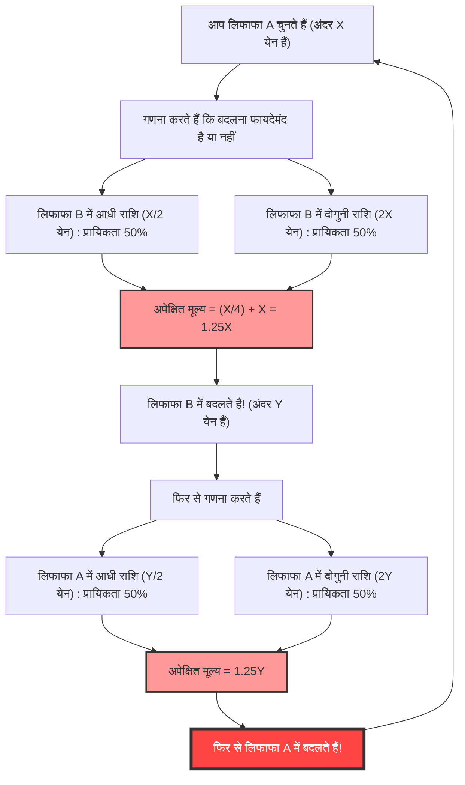
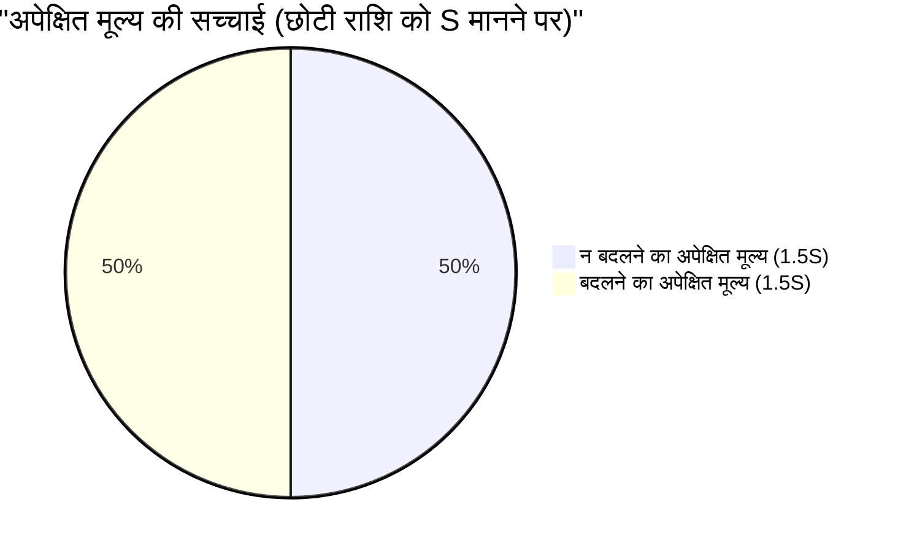

## 1. अंतिम विकल्प: बदलें या न बदलें?

आप एक गेम शो के अंतिम चरण में हैं। आपके सामने टेबल पर दो बिल्कुल एक जैसे दिखने वाले **लिफाफे (A और B)** रखे हैं।
होस्ट कहता है:

> "एक लिफाफे में दूसरे लिफाफे की तुलना में **दोगुना पैसा** है। कृपया किसी एक को चुनें।"

काफी सोचने के बाद, आप **लिफाफा A** चुनते हैं।
जैसे ही आप इसे खोलने वाले होते हैं, होस्ट एक शैतानी प्रस्ताव रखता है।

> "अगर आप चाहें, तो आप अपने लिफाफा A को बचे हुए लिफाफा B के साथ **बदल सकते हैं**। क्या आप बदलना चाहेंगे?"

तो, क्या आपको अपना लिफाफा बदलना चाहिए?

---

## 2. अपेक्षित मूल्य की गणना से उत्पन्न "अनंत लूप"

आइए यहाँ थोड़ा गणितीय रूप से सोचें।
मान लीजिए कि आपके लिफाफे A में मौजूद राशि $X$ येन है।
लिफाफे B में मौजूद राशि, नियम के अनुसार या तो "$X$ येन का आधा ($\frac{X}{2}$)" हो सकती है या "$X$ येन का दोगुना ($2X$)"। दोनों की प्रायिकता $\frac{1}{2}$ (50%) है।

तो, आइए **लिफाफा बदलने की स्थिति में अपेक्षित मूल्य (अनुमानित औसत राशि)** की गणना करें।

$$ E = \frac{1}{2} \times \left(\frac{X}{2}\right) + \frac{1}{2} \times (2X) $$
$$ E = \frac{X}{4} + X = \frac{5}{4}X = 1.25X $$

एक आश्चर्यजनक परिणाम सामने आता है।
सिर्फ लिफाफा बदलने से, अपेक्षित मूल्य मूल $X$ येन से बढ़कर **$1.25$ गुना** (25% अधिक) हो जाता है।
निष्कर्ष यह निकलता है कि "गणितीय रूप से सोचें, तो बदलना निश्चित रूप से फायदेमंद है!"

लेकिन, यहीं पर **तर्क का पतन** होता है।
मान लीजिए कि आप लिफाफा B में बदल लेते हैं। इसके तुरंत बाद, अगर होस्ट फिर से पूछे "क्या आप वापस A पर जाना चाहेंगे?" तो क्या होगा?
बिल्कुल यही समीकरण लागू होगा, और इस बार इसका मतलब होगा "अगर आप B से A में बदलते हैं, तो अपेक्षित मूल्य 1.25 गुना हो जाएगा।"

यानी, **केवल "A से B" और "B से A" में बदलते रहने से, सैद्धांतिक अपेक्षित मूल्य अनंत तक बढ़ता रहेगा**। यह स्पष्ट रूप से वास्तविकता का खंडन करता है (लिफाफों के अंदर की राशि शुरू से तय होती है, और यह बदलने से नहीं बढ़ती)।

आखिर क्यों एक पूरी तरह से सही दिखने वाली अपेक्षित मूल्य की गणना ने ऐसा अजीब विरोधाभास पैदा किया?

---

## 3. गणितीय चाल को समझना: चरों (variables) की अदला-बदली

इस विरोधाभास का जाल **"यादृच्छिक चर $X$ के उपयोग"** में निहित है।

पिछली गणना में, हमने लिफाफा A की राशि $X$ को एक **निश्चित स्थिरांक** के रूप में माना, और यह मान लिया कि लिफाफा B "$\frac{X}{2}$ या $2X$" है।
हालांकि, जो मूल रूप से निश्चित है वह **"दोनों लिफाफों में मौजूद राशि का योग"** है, या **"छोटी राशि"** है।

मान लीजिए कि छोटी राशि वाले लिफाफे में $S$ है। तो, बड़ी राशि वाले लिफाफे में $2S$ होगा।
खेल के कुल परिदृश्य केवल निम्नलिखित 2 पैटर्न हो सकते हैं (प्रत्येक की प्रायिकता $\frac{1}{2}$ है)।

- **पैटर्न 1:** आपके द्वारा चुना गया लिफाफा A छोटा वाला ($S$) है, और लिफाफा B बड़ा वाला ($2S$) है।
- **पैटर्न 2:** आपके द्वारा चुना गया लिफाफा A बड़ा वाला ($2S$) है, और लिफाफा B छोटा वाला ($S$) है।

यहाँ, हम **"न बदलने"** और **"बदलने"** की स्थितियों के लिए अपेक्षित मूल्य की सही गणना करते हैं।

**न बदलने की स्थिति में अपेक्षित मूल्य $E_{stay}$:**
$$ E_{stay} = \frac{1}{2} \times S + \frac{1}{2} \times 2S = \frac{3}{2}S = 1.5S $$

**बदलने की स्थिति में अपेक्षित मूल्य $E_{switch}$:**
पैटर्न 1 में आपको $2S$ मिलते हैं, और पैटर्न 2 में आपको $S$ मिलते हैं।
$$ E_{switch} = \frac{1}{2} \times 2S + \frac{1}{2} \times S = \frac{3}{2}S = 1.5S $$

$$ E_{stay} = E_{switch} $$

अपेक्षित मूल्य पूरी तरह से मेल खाते हैं!
पहली गलत गणना में, हमने पैटर्न 1 के समय के $X$ (जो वास्तव में $S$ है) और पैटर्न 2 के समय के $X$ (जो वास्तव में $2S$ है) जैसे **अलग-अलग मानों को एक ही चर $X$ के रूप में मान लिया था**, जिसके कारण "बदलने पर अपेक्षित मूल्य बढ़ता है" का भ्रम पैदा हुआ।

---

## 4. अगर आप लिफाफा खोल लें तो क्या होगा?

ऐसा लगता है कि विरोधाभास हल हो गया है। लेकिन, एक और गहरी समस्या इंतजार कर रही है।

क्या होगा अगर आप **लिफाफा बदलने से पहले, अपने लिफाफे A के अंदर देख लें**?
जब आप लिफाफा A खोलते हैं, तो उसमें **"10,000 येन"** होते हैं।

इस क्षण, यह $X = 10000$ का एक निश्चित मान बन जाता है।
लिफाफे B में या तो "5,000 येन" हैं या "20,000 येन"।
अगर हम यहां पहला समीकरण लागू करें तो क्या होगा?

$$ E_{switch} = \frac{1}{2} \times 5000 + \frac{1}{2} \times 20000 = 2500 + 10000 = 12500 $$

अपेक्षित मूल्य 12,500 येन है। यह वर्तमान 10,000 येन से निश्चित रूप से अधिक है।
इसके अलावा, चूंकि इस बार $X$ 10,000 येन का "विशिष्ट स्थिरांक" बन गया है, इसलिए पिछले "चरों की अदला-बदली" वाला प्रतिवाद काम नहीं करेगा।
तो क्या इसका मतलब यह है कि **बदलना निश्चित रूप से फायदेमंद है**?

### बेयसियन अनुमान द्वारा खंडन: "पूर्व वितरण (Prior Distribution)" का अभाव

गणितज्ञों ने इसके जवाब में **"राशि का पूर्व वितरण (पूर्व प्रायिकता)"** की अवधारणा पेश की।
सवाल यह है कि क्या हम वास्तव में कह सकते हैं कि 5,000 येन और 20,000 येन में से प्रत्येक के होने की प्रायिकता $\frac{1}{2}$ है?

उदाहरण के लिए, मान लीजिए कि शो का अधिकतम बजट 100 मिलियन येन है। यदि आप लिफाफा A खोलते हैं और उसमें "60 मिलियन येन" पाते हैं, तो लिफाफा B में "120 मिलियन येन" होने की प्रायिकता शून्य है (क्योंकि यह बजट से बाहर है)। दूसरे शब्दों में, लिफाफा A की राशि जितनी बड़ी होगी, लिफाफा B के "दोगुना" होने की प्रायिकता उतनी ही कम हो जाएगी, और इसके "आधा" होने की प्रायिकता बढ़ जानी चाहिए।

जब हम किसी यादृच्छिक पूर्व वितरण $P(x)$ को मानते हैं और बेयस प्रमेय का उपयोग करके अपेक्षित मूल्य की गणना करते हैं, तो यह गणितीय रूप से सिद्ध हो चुका है कि **चाहे कोई भी यथार्थवादी प्रायिकता वितरण (जिसका योग 1 हो) क्यों न हो, ऐसा कोई जादुई वितरण मौजूद नहीं है जहाँ सभी राशियों $X$ के लिए "बदलना फायदेमंद" हो**।

---

## 5. अनंत का जाल: सेंट पीटर्सबर्ग विरोधाभास (St. Petersburg paradox) से संबंध

केवल एक ही स्थिति मौजूद है जहाँ "सभी $X$ के लिए बदलना फायदेमंद" होता है।
यह केवल तब होता है जब हम मानते हैं कि शो का बजट **अनंत** है, और एक "अनुचित प्रायिकता वितरण (improper probability distribution, जिसका योग अनंत होता है)" है जहाँ सभी राशियाँ (1 येन, 2 येन, 4 येन, 8 येन... अनंत) समान रूप से दिखाई देती हैं।

हालांकि, वास्तविक दुनिया में अनंत संपत्ति वाला कोई टीवी स्टेशन नहीं है।
यह "अनंत अपेक्षित मूल्य" के कारण होने वाली त्रुटि, **सेंट पीटर्सबर्ग विरोधाभास** (एक ऐसी समस्या जिसमें अनंत अपेक्षित मूल्य वाले जुए के लिए कोई व्यक्ति कितना भुगतान कर सकता है) के साथ गहराई से जुड़ी हुई है।

## 6. निष्कर्ष: प्रायिकता और अपेक्षित मूल्य का डर

यद्यपि "दो लिफाफों का विरोधाभास" केवल सरल गुणा और जोड़ से बना है, यह हमें निम्नलिखित सबक सिखाता है:

1. **परिभाषा की अस्पष्टता से उत्पन्न त्रुटियां**: यदि यह स्पष्ट नहीं किया जाता है कि चर क्या दर्शाता है (क्या $X$ हमेशा एक ही राशि को दर्शाता है), तो तर्क आसानी से ढह जाता है।
2. **"कोई जानकारी नहीं = 50% प्रायिकता" का भ्रम**: यह धारणा कि "चूंकि हम नहीं जानते, इसलिए यह आधा-आधा होना चाहिए" (अपर्याप्त कारण का सिद्धांत) कभी-कभी घातक गणना त्रुटियों का कारण बन सकती है।
3. **अनंत को संभालने की कठिनाई**: जब "अनंत" की अवधारणा, जिसे वास्तविक दुनिया पर लागू नहीं किया जा सकता, गणना सूत्र में पेश की जाती है, तो यह सामान्य ज्ञान के विपरीत परिणाम उत्पन्न करती है।

अगली बार जीवन में जब आपको लगे कि "दूर के ढोल सुहावने लगते हैं, और चीजें बदलने में ही फायदा है", तो इस विरोधाभास को याद करें। हो सकता है कि आपके गणना सूत्र में चर आपस में बदल गए हों।
