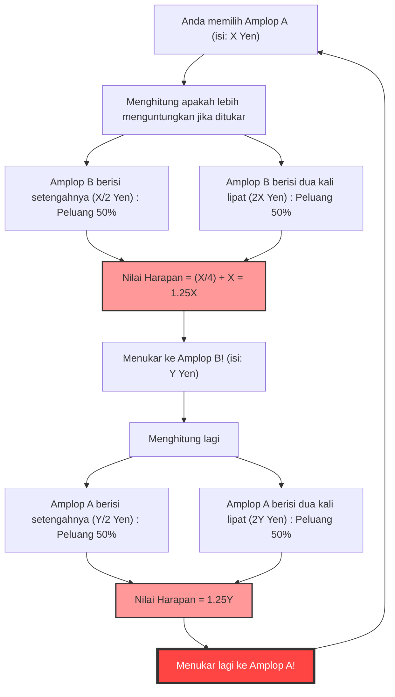
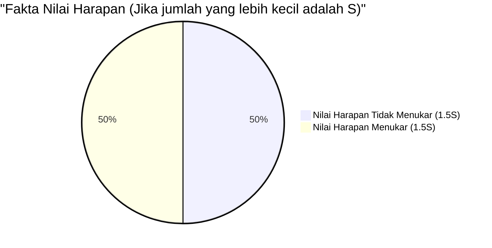

## 1. Pilihan Utama: Menukar atau Tidak Menukar?

Anda sedang berada di babak final sebuah acara permainan. Di atas meja di depan Anda, terdapat **dua amplop (A dan B)** yang terlihat sama persis.
Pembawa acara berkata:

> "Salah satu amplop berisi **uang dua kali lipat** dari amplop yang lain. Silakan pilih salah satu."

Setelah ragu-ragu, Anda memilih **Amplop A**.
Tepat saat Anda hendak melihat isinya, pembawa acara memberikan bisikan setan.

> "Sekarang, Anda **boleh menukar** Amplop A tersebut dengan Amplop B yang tersisa. Apakah Anda ingin menukarnya?"

Nah, haruskah Anda menukar amplop tersebut?

---

## 2. "Lingkaran Tak Terhingga" yang Dihasilkan oleh Perhitungan Nilai Harapan

Sekarang, mari kita gunakan sedikit pemikiran matematis.
Misalkan jumlah uang di dalam Amplop A yang Anda pegang adalah $X$ Yen.
Sesuai aturan, jumlah uang di Amplop B bisa jadi "setengah dari $X$ Yen ($\frac{X}{2}$)" atau "dua kali lipat dari $X$ Yen ($2X$)". Peluang masing-masing adalah $\frac{1}{2}$ (50%).

Sekarang, mari kita hitung **nilai harapan (rata-rata jumlah yang diharapkan) jika Anda menukar amplop**.

$$ E = \frac{1}{2} \times \left(\frac{X}{2}\right) + \frac{1}{2} \times (2X) $$
$$ E = \frac{X}{4} + X = \frac{5}{4}X = 1.25X $$

Hasil yang mengejutkan muncul.
Hanya dengan menukar amplop, nilai harapannya melonjak menjadi **$1.25$ kali lipat** (naik 25%) dari nilai awal $X$ Yen.
Kesimpulannya adalah, "Jika dipikirkan secara matematis, pasti lebih menguntungkan untuk menukar!"

Namun, di sinilah **runtuhnya logika** terjadi.
Misalkan Anda menukarnya dengan Amplop B. Tepat setelah itu, bagaimana jika pembawa acara bertanya lagi, "Apakah Anda ingin kembali ke A?"
Rumus perhitungan yang sama persis akan berlaku, dan kali ini menjadi "jika Anda menukar dari B ke A, nilai harapannya menjadi 1.25 kali lipat".

Dengan kata lain, **hanya dengan terus menukar dari "A ke B" dan "B ke A", nilai harapan teoretisnya akan terus meningkat tanpa batas**. Ini jelas bertentangan dengan kenyataan (isi amplop sudah ditentukan sejak awal, dan tidak akan bertambah hanya karena Anda menukarnya).

Mengapa perhitungan nilai harapan yang sekilas tampak sempurna ini bisa menghasilkan paradoks yang aneh seperti ini?

---

## 3. Mengungkap Trik Matematis: Pertukaran Variabel

Jebakan dari paradoks ini terletak pada **"cara menggunakan variabel acak $X$"**.

Pada rumus perhitungan sebelumnya, jumlah uang $X$ di Amplop A diperlakukan sebagai **konstanta tetap**, dan diasumsikan bahwa Amplop B berisi "$\frac{X}{2}$ atau $2X$".
Namun, yang sebenarnya tetap adalah **"total uang di dalam kedua amplop"**, atau **"jumlah uang yang lebih kecil"**.

Misalkan jumlah uang di amplop yang lebih kecil adalah $S$. Maka, amplop yang lebih besar berisi jumlah uang $2S$.
Seluruh skenario permainan hanya terdiri dari 2 pola berikut (peluang masing-masing adalah $\frac{1}{2}$).

- **Pola 1:** Amplop A yang Anda pilih adalah yang lebih kecil ($S$), dan Amplop B adalah yang lebih besar ($2S$)
- **Pola 2:** Amplop A yang Anda pilih adalah yang lebih besar ($2S$), dan Amplop B adalah yang lebih kecil ($S$)

Sekarang, mari kita hitung dengan benar nilai harapan jika **"tidak menukar"** dan **"menukar"** amplop.

**Nilai harapan jika tidak menukar $E_{stay}$:**
$$ E_{stay} = \frac{1}{2} \times S + \frac{1}{2} \times 2S = \frac{3}{2}S = 1.5S $$

**Nilai harapan jika menukar $E_{switch}$:**
Pada Pola 1 Anda mendapatkan $2S$, dan pada Pola 2 Anda mendapatkan $S$.
$$ E_{switch} = \frac{1}{2} \times 2S + \frac{1}{2} \times S = \frac{3}{2}S = 1.5S $$

$$ E_{stay} = E_{switch} $$

Luar biasa, nilai harapannya sama!
Pada perhitungan awal yang salah, nilai $X$ pada Pola 1 (sebenarnya $S$) dan nilai $X$ pada Pola 2 (sebenarnya $2S$), yang merupakan **nilai yang berbeda, diperlakukan sebagai variabel $X$ yang sama**, sehingga menciptakan ilusi bahwa "jika ditukar, nilai harapannya akan naik".

---

## 4. Apa yang Terjadi Jika Amplop Dibuka?

Paradoks ini tampaknya telah terpecahkan. Namun, masalah yang lebih dalam menanti.

Bagaimana jika Anda **melihat isi Amplop A Anda sebelum menukarnya**?
Saat Anda membuka Amplop A, di dalamnya terdapat **"10.000 Yen"**.

Pada momen ini, $X$ menjadi nilai pasti yaitu $10000$.
Di dalam Amplop B, terdapat "5.000 Yen" atau "20.000 Yen".
Apa yang terjadi jika kita menerapkan rumus perhitungan awal di sini?

$$ E_{switch} = \frac{1}{2} \times 5000 + \frac{1}{2} \times 20000 = 2500 + 10000 = 12500 $$

Nilai harapannya adalah 12.500 Yen. Jauh lebih tinggi daripada 10.000 Yen yang ada saat ini.
Apalagi, karena kali ini $X$ adalah "konstanta spesifik" sebesar 10.000 Yen, bantahan "pertukaran variabel" yang tadi tidak berlaku.
Jika begini, apakah **pasti lebih menguntungkan untuk menukar**?

### Sanggahan melalui Inferensi Bayes: Hilangnya "Distribusi Apriori"

Menanggapi hal ini, para matematikawan mengemukakan konsep **"distribusi apriori (probabilitas apriori) dari jumlah uang"**.
Pertanyaannya adalah: dapatkah dikatakan bahwa peluang masing-masing 5.000 Yen dan 20.000 Yen benar-benar ada di dalam sebesar $\frac{1}{2}$?

Sebagai contoh, misalkan anggaran maksimum acara tersebut adalah 100 juta Yen. Jika Anda membuka Amplop A dan terdapat "60 juta Yen", probabilitas Amplop B berisi "120 juta Yen" adalah nol (karena melebihi anggaran). Dengan kata lain, semakin besar jumlah di Amplop A, probabilitas Amplop B berisi "dua kali lipat" akan semakin menurun, dan probabilitas berisi "setengah" seharusnya semakin meningkat.

Jika kita mengasumsikan distribusi apriori $P(x)$ yang berubah-ubah, saat menghitung nilai harapan menggunakan Teorema Bayes, secara matematis telah dibuktikan bahwa **tidak ada distribusi ajaib yang membuat "menukar menjadi lebih menguntungkan" untuk semua nilai $X$, pada distribusi probabilitas realistis manapun (di mana jumlah totalnya adalah 1)**.

---

## 5. Jebakan Tak Terhingga: Hubungannya dengan Paradoks St. Petersburg

Satu-satunya kasus di mana "menukar menjadi lebih menguntungkan untuk semua nilai $X$" memang ada.
Itu hanya terjadi jika kita mengasumsikan anggaran acara adalah **tak terhingga**, dan ada "distribusi probabilitas tak wajar (distribusi di mana jumlah totalnya menjadi tak terhingga)" di mana semua jumlah uang (1 Yen, 2 Yen, 4 Yen, 8 Yen... tak terhingga) muncul secara merata.

Namun, tidak ada stasiun televisi di dunia nyata yang memiliki aset tak terhingga.
Bug yang disebabkan oleh "nilai harapan tak terhingga" ini berakar dalam pada **Paradoks St. Petersburg** (masalah tentang seberapa banyak seseorang bersedia membayar untuk perjudian dengan nilai harapan tak terhingga).

## 6. Kesimpulan: Kengerian Probabilitas dan Nilai Harapan

Meskipun "Paradoks Dua Amplop" hanya terdiri dari perkalian dan penjumlahan sederhana, paradoks ini memberikan kita pelajaran berikut:

1. **Kesalahan akibat Definisi yang Ambigu**: Jika Anda tidak memperjelas apa yang dirujuk oleh variabel (apakah $X$ selalu merujuk pada jumlah yang sama), logika akan mudah runtuh.
2. **Ilusi bahwa "Tidak Ada Informasi = Peluang 50%"**: Asumsi bahwa "karena kita tidak tahu, berarti peluangnya setengah-setengah" (Prinsip Alasan Tidak Cukup) terkadang menyebabkan kesalahan perhitungan yang fatal.
3. **Kesulitan dalam Menangani Tak Terhingga**: Memasukkan konsep "tak terhingga" yang tidak dapat diterapkan di dunia nyata ke dalam rumus perhitungan akan menghasilkan hasil yang bertentangan dengan akal sehat.

Lain kali dalam hidup saat Anda berpikir "rumput tetangga lebih hijau, dan lebih menguntungkan untuk menukar", ingatlah paradoks ini. Mungkin saja, variabel dalam rumus perhitungan Anda hanya tertukar.
