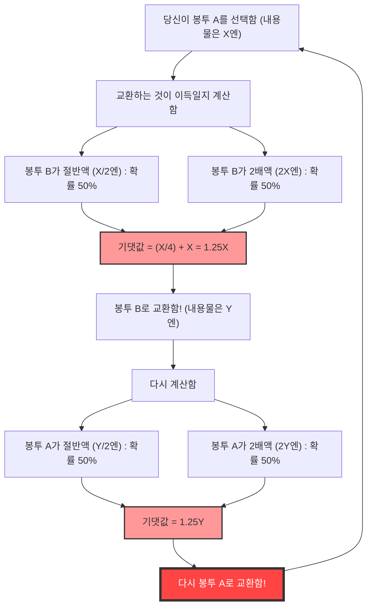
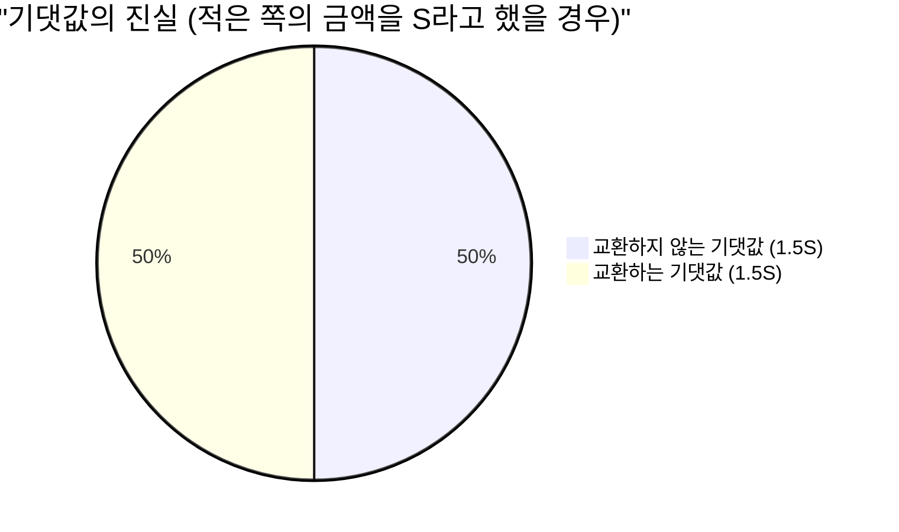

## 1. 궁극의 선택: 교환해야 할까, 말아야 할까?

당신은 게임 쇼의 최종 무대에 서 있습니다. 눈앞의 테이블에는 겉보기에 완전히 똑같은 **두 개의 봉투(A와 B)** 가 놓여 있습니다.
진행자는 이렇게 말했습니다.

> "한쪽 봉투에는 다른 쪽 봉투의 **2배의 돈**이 들어 있습니다. 둘 중 하나를 선택해 주세요."

당신은 고민 끝에 **봉투 A**를 선택했습니다.
내용물을 확인하려는 바로 그 순간, 진행자가 악마의 속삭임을 건넵니다.

> "지금이라면 그 봉투 A를 남아있는 봉투 B와 **교환해도 좋습니다**. 교환하시겠습니까?"

자, 당신은 봉투를 교환해야 할까요?

---

## 2. 기댓값 계산이 이끌어내는 '무한 루프'

여기서 조금 수학적인 사고를 발휘해 봅시다.
당신이 가지고 있는 봉투 A에 들어있는 금액을 $X$ 엔이라고 가정합니다.
봉투 B에 들어있는 금액은 규칙상 '$X$ 엔의 절반($\frac{X}{2}$)'이거나 '$X$ 엔의 2배($2X$)' 둘 중 하나입니다. 각각의 확률은 $\frac{1}{2}$(50%)씩입니다.

그럼, **봉투를 교환했을 경우의 기댓값(예상되는 평균적인 금액)** 을 계산해 봅시다.

$$ E = \frac{1}{2} \times \left(\frac{X}{2}\right) + \frac{1}{2} \times (2X) $$
$$ E = \frac{X}{4} + X = \frac{5}{4}X = 1.25X $$

놀라운 결과가 나왔습니다.
봉투를 교환하는 것만으로 기댓값이 원래의 $X$ 엔에서 **$1.25$ 배**(25% 상승)로 껑충 뛰는 것입니다.
"수학적으로 생각하면 무조건 교환하는 것이 이득이다!"라는 결론에 이르게 됩니다.

하지만 여기서 **논리의 붕괴**가 일어납니다.
만약 당신이 봉투 B로 교환했다고 합시다. 그 직후, 진행자가 다시 "역시 A로 다시 바꾸시겠습니까?"라고 묻는다면 어떻게 될까요?
완전히 똑같은 계산식이 성립되어 이번에는 "B에서 A로 교환하면 기댓값이 1.25배가 된다"는 결론이 나옵니다.

즉, **'A에서 B로', 'B에서 A로' 계속 교환하는 것만으로 이론상의 기댓값이 무한히 계속 늘어나게 되는 것**입니다. 이는 명백히 현실과 모순됩니다(봉투의 내용물은 처음부터 확정되어 있으며, 교환한다고 해서 늘어나는 것이 아닙니다).

왜 언뜻 보기에 완벽해 보이는 기댓값 계산이 이런 이상한 역설을 만들어낸 것일까요?

---

## 3. 수학적 트릭의 규명: 변수의 바꿔치기

이 역설의 함정은 **'확률변수 $X$ 의 사용법'**에 있습니다.

앞서 본 계산식에서는 봉투 A의 금액 $X$ 를 **고정된 상수**처럼 취급하고, 봉투 B가 '$\frac{X}{2}$ 또는 $2X$'일 것이라고 가정했습니다.
하지만 본래 고정되어 있는 것은 **'두 봉투에 들어있는 금액의 합계'** 또는 **'적은 쪽의 금액'**입니다.

적은 쪽 봉투에 들어있는 금액을 $S$ 라고 해봅시다. 그러면 많은 쪽 봉투에는 $2S$ 의 금액이 들어있습니다.
게임의 전체 시나리오는 다음의 2가지 패턴밖에 없습니다(확률은 각각 $\frac{1}{2}$).

- **패턴 1:** 당신이 선택한 봉투 A가 적은 쪽($S$)이고, 봉투 B가 많은 쪽($2S$)
- **패턴 2:** 당신이 선택한 봉투 A가 많은 쪽($2S$)이고, 봉투 B가 적은 쪽($S$)

여기서 봉투를 **'교환하지 않을 경우'**와 **'교환할 경우'**의 기댓값을 올바르게 계산해 보겠습니다.

**교환하지 않을 경우의 기댓값 $E_{stay}$:**
$$ E_{stay} = \frac{1}{2} \times S + \frac{1}{2} \times 2S = \frac{3}{2}S = 1.5S $$

**교환할 경우의 기댓값 $E_{switch}$:**
패턴 1일 때는 $2S$ 를 얻고, 패턴 2일 때는 $S$ 를 얻습니다.
$$ E_{switch} = \frac{1}{2} \times 2S + \frac{1}{2} \times S = \frac{3}{2}S = 1.5S $$

$$ E_{stay} = E_{switch} $$

놀랍게도 기댓값은 일치했습니다!
처음의 잘못된 계산에서는 패턴 1일 때의 $X$ (사실은 $S$)와 패턴 2일 때의 $X$ (사실은 $2S$)라는 **서로 다른 값을 같은 변수 $X$ 로 취급해 버렸기** 때문에 '교환하면 기댓값이 올라간다'는 환영이 생겨난 것입니다.

---

## 4. 봉투를 열어버린다면 어떻게 될까?

이로써 역설은 해결된 것처럼 보입니다. 하지만 더 깊은 문제가 기다리고 있습니다.

만약 당신이 **봉투를 교환하기 전에 자신의 봉투 A의 내용물을 봐 버렸다**고 한다면 어떨까요?
당신이 봉투 A를 열었더니 그 안에는 **'1만 엔'**이 들어 있었습니다.

이 순간, $X = 10000$ 이라는 확정된 값이 됩니다.
봉투 B에는 '5,000엔'이나 '20,000엔' 둘 중 하나가 들어있습니다.
여기서 처음의 계산식을 대입하면 어떻게 될까요?

$$ E_{switch} = \frac{1}{2} \times 5000 + \frac{1}{2} \times 20000 = 2500 + 10000 = 12500 $$

기댓값은 12,500엔. 현재의 10,000엔보다 확실히 높습니다.
게다가 이번에는 $X$ 가 10,000엔이라는 '구체적인 상수'가 되었기 때문에 앞서 말한 '변수의 바꿔치기'라는 반론이 통하지 않습니다.
그렇다면 **무조건 교환하는 것이 이득**인 것일까요?

### 베이즈 추정에 의한 반증: '사전 분포'의 누락

수학자들은 이에 대해 **'금액의 사전 분포(사전 확률)'**라는 개념을 꺼내 들었습니다.
5,000엔과 20,000엔이 정말로 각각 $\frac{1}{2}$ 의 확률로 들어있다고 말할 수 있을까? 라는 의문입니다.

예를 들어, 프로그램의 예산이 최대 1억 엔이라고 가정해 봅시다. 만약 당신이 봉투 A를 열어서 '6,000만 엔'이 들어있었다면, 봉투 B에 '1억 2,000만 엔'이 들어있을 확률은 0입니다(예산 초과이기 때문입니다). 즉, 봉투 A의 금액이 커지면 커질수록 봉투 B가 '2배'일 확률은 낮아지고 '절반'일 확률이 올라가야 하는 것입니다.

임의의 사전 분포 $P(x)$ 를 가정한 경우, 베이즈 정리를 이용해 기댓값을 계산하면 **그 어떤 현실적인(총합이 1이 되는) 확률 분포라 할지라도 모든 금액 $X$ 에 대해 '교환하는 것이 이득'이 되는 마법과 같은 분포는 존재하지 않는다**는 것이 수학적으로 증명되어 있습니다.

---

## 5. 무한의 함정: 상트페테르부르크의 역설과의 연결고리

유일하게 '모든 $X$ 에 대해 교환하는 것이 이득'이 되는 경우가 존재합니다.
그것은 프로그램의 예산이 **무한대**이며 모든 금액(1엔, 2엔, 4엔, 8엔……무한)이 균등하게 출현하는 '비정칙 확률 분포(총합이 무한대가 되는 분포)'를 가정했을 경우뿐입니다.

하지만 현실 세계에 무한한 자산을 가진 방송국은 존재하지 않습니다.
이 '무한대의 기댓값'이 일으키는 버그는 **상트페테르부르크의 역설**(무한한 기댓값을 가진 도박에 사람은 얼마까지 지불할 수 있는가 하는 문제)과 깊은 뿌리를 같이 하고 있습니다.

## 6. 요약: 확률과 기댓값의 무서움

'두 개의 봉투 역설'은 단순한 곱셈과 덧셈만으로 구성되어 있음에도 불구하고, 우리에게 다음과 같은 교훈을 줍니다.

1. **정의의 모호함이 낳는 오류**: 변수가 무엇을 가리키는지($X$ 가 항상 같은 금액을 가리키는지) 명확히 하지 않으면 논리는 쉽게 붕괴됩니다.
2. **'정보가 없다 = 확률 50%'라는 착각**: '모르니까 반반이겠지'라는 전제(이유 불충분의 원칙)는 때로 치명적인 계산 실수를 일으킵니다.
3. **무한을 다루는 것의 어려움**: 현실 세계에 적용할 수 없는 '무한'의 개념을 계산식에 도입하면 상식에 반하는 결과가 생겨납니다.

다음에 인생에서 '남의 떡이 더 커 보이고 교환하는 것이 이득이다'라고 생각될 때는 이 역설을 떠올려 보세요. 당신의 계산식 속에서 변수가 슬그머니 바뀌어 있을지도 모릅니다.
