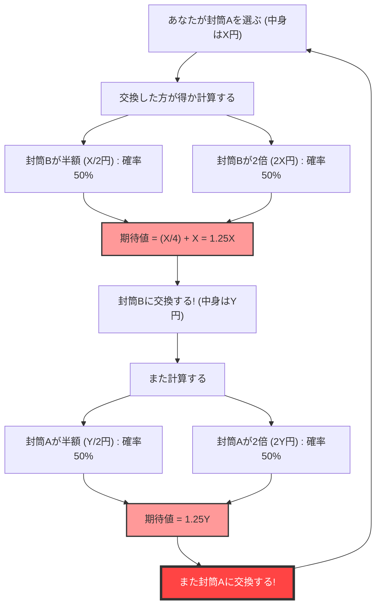
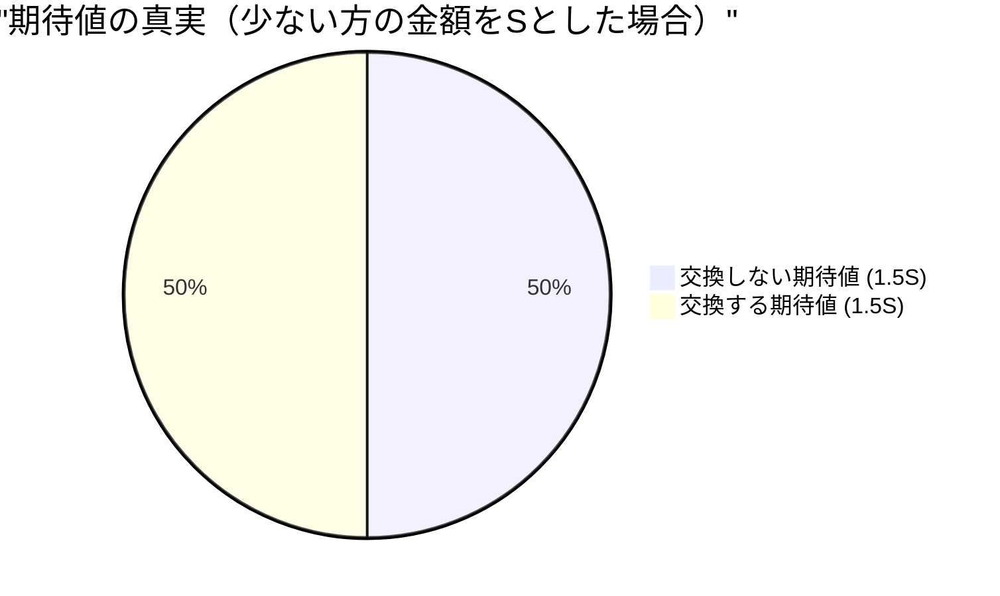

## 1. 究極の選択：交換すべきか、せざるべきか？

あなたはゲーム番組の最終ステージに立っています。目の前のテーブルには、見た目が全く同じ **2つの封筒（AとB）** が置かれています。
司会者はこう言いました。

> 「一方の封筒には、もう一方の封筒の **2倍のお金** が入っています。どちらか1つを選んでください。」

あなたは迷った末に、**封筒A** を選びました。
中身を見ようとしたその時、司会者が悪魔の囁きをします。

> 「今なら、その封筒Aを、残っている封筒Bと**交換してもいいですよ**。交換しますか？」

さて、あなたは封筒を交換するべきでしょうか？

---

## 2. 期待値計算が導き出す「無限のループ」

ここで、少し数学的な思考を働かせてみましょう。
あなたの持っている封筒Aに入っている金額を $X$ 円とします。
封筒Bに入っている金額は、ルール上「$X$ 円の半分（$\frac{X}{2}$）」か「$X$ 円の2倍（$2X$）」のどちらかです。それぞれ確率は $\frac{1}{2}$（50%）ずつです。

では、**封筒を交換した場合の期待値（見込まれる平均的な金額）** を計算してみましょう。

$$ E = \frac{1}{2} \times \left(\frac{X}{2}\right) + \frac{1}{2} \times (2X) $$
$$ E = \frac{X}{4} + X = \frac{5}{4}X = 1.25X $$

驚くべき結果が出ました。
封筒を交換するだけで、期待値が元の $X$ 円から **$1.25$ 倍**（25%アップ）に跳ね上がるのです。
「数学的に考えれば、絶対に交換した方が得だ！」という結論になります。

しかし、ここで**論理の崩壊**が起きます。
もしあなたが封筒Bに交換したとします。その直後に、司会者が再び「やっぱりAに戻しますか？」と聞いてきたらどうなるでしょう。
全く同じ計算式が成り立ち、今度は「BからAに交換すれば期待値が1.25倍になる」ことになります。

つまり、**「AからBへ」「BからAへ」と交換し続けるだけで、理論上の期待値が無限に増え続けてしまう**のです。これは明らかに現実と矛盾しています（封筒の中身は最初から確定しており、交換したからといって増えるわけではありません）。

なぜ、一見完璧に見える期待値の計算が、このようなおかしなパラドックスを生み出したのでしょうか？

---

## 3. 数学的トリックの解明：変数のすり替え

このパラドックスの罠は、**「確率変数 $X$ の使い方」**にあります。

先ほどの計算式では、封筒Aの金額 $X$ を**固定された定数**のように扱い、封筒Bが「$\frac{X}{2}$ または $2X$」であると仮定しました。
しかし、本来固定されているのは**「2つの封筒に入っている金額の合計」**、あるいは**「少ない方の金額」**なのです。

少ない方の封筒に入っている金額を $S$ としましょう。すると、多い方の封筒には $2S$ の金額が入っています。
ゲームの全シナリオは以下の2パターンしかありません（確率はそれぞれ $\frac{1}{2}$）。

- **パターン1：** あなたが選んだ封筒Aが少ない方 ($S$) で、封筒Bが多い方 ($2S$)
- **パターン2：** あなたが選んだ封筒Aが多い方 ($2S$) で、封筒Bが少ない方 ($S$)

ここで、封筒を**「交換しない場合」**と**「交換する場合」**の期待値を正しく計算してみます。

**交換しない場合の期待値 $E_{stay}$：**
$$ E_{stay} = \frac{1}{2} \times S + \frac{1}{2} \times 2S = \frac{3}{2}S = 1.5S $$

**交換する場合の期待値 $E_{switch}$：**
パターン1のときは $2S$ を得られ、パターン2のときは $S$ を得られます。
$$ E_{switch} = \frac{1}{2} \times 2S + \frac{1}{2} \times S = \frac{3}{2}S = 1.5S $$

$$ E_{stay} = E_{switch} $$

見事に期待値は一致しました！
最初の間違った計算では、パターン1のときの $X$ (実は $S$) と、パターン2のときの $X$ (実は $2S$) という**異なる値を同じ変数 $X$ として扱ってしまった**ため、「交換すれば期待値が上がる」という幻影が生まれてしまったのです。

---

## 4. 封筒を開けてしまったらどうなる？

パラドックスはこれで解決したように見えます。しかし、より深い問題が待ち受けています。

もしあなたが、**封筒を交換する前に、自分の封筒Aの中身を見てしまった**としたらどうでしょうか？
あなたが封筒Aを開けると、そこには **「1万円」** が入っていました。

この瞬間、$X = 10000$ という確定した値になります。
封筒Bには、「5,000円」か「20,000円」のどちらかが入っています。
ここで最初の計算式を当てはめるとどうなるでしょう。

$$ E_{switch} = \frac{1}{2} \times 5000 + \frac{1}{2} \times 20000 = 2500 + 10000 = 12500 $$

期待値は12,500円。現状の10,000円よりも確実に高いです。
しかも、今回は $X$ が10,000円という「具体的な定数」になっているため、先ほどの「変数のすり替え」の反論が通用しません。
これなら、**絶対に交換した方が得**なのでしょうか？

### ベイズ推定による反証：「事前分布」の欠落

数学者たちはこれに対し、**「金額の事前分布（事前確率）」**という概念を持ち出しました。
5,000円と20,000円が、本当にそれぞれ $\frac{1}{2}$ の確率で入っていると言えるのか？という疑問です。

たとえば、番組の予算が最大1億円だとします。もしあなたが封筒Aを開けて「6,000万円」が入っていたら、封筒Bに「1億2,000万円」が入っている確率はゼロです（予算オーバーだからです）。つまり、封筒Aの金額が大きくなればなるほど、封筒Bが「2倍」である確率は下がり、「半分」である確率が上がるはずなのです。

任意の事前分布 $P(x)$ を想定した場合、ベイズの定理を用いて期待値を計算すると、**どのような現実的な（総和が1になる）確率分布であっても、すべての金額 $X$ において「交換した方が得」になるような魔法の分布は存在しない**ことが数学的に証明されています。

---

## 5. 無限の罠：サンクトペテルブルクのパラドックスとの繋がり

唯一、「すべての $X$ において交換した方が得」となるケースが存在します。
それは、番組の予算が**無限大**であり、すべての金額（1円、2円、4円、8円……無限）が均等に出現するような「非正則な確率分布（総和が無限大になる分布）」を仮定した場合だけです。

しかし、現実世界には無限の資産を持つテレビ局は存在しません。
この「無限大の期待値」が引き起こすバグは、**サンクトペテルブルクのパラドックス**（無限の期待値を持つギャンブルに、人はいくらまで払えるかという問題）と深く根を同じくしています。

## 6. まとめ：確率と期待値の恐ろしさ

「2つの封筒のパラドックス」は、単純な掛け算と足し算だけで構成されているにもかかわらず、私たちに次のような教訓を与えます。

1. **定義の曖昧さが生むエラー**：変数が何を指しているのか（$X$ が常に同じ額を指しているのか）を明確にしないと、論理は簡単に崩壊します。
2. **「情報がない＝確率50%」という錯覚**：「わからないから半々だろう」という前提（理由不十分の原則）は、ときに致命的な計算ミスを引き起こします。
3. **無限の取り扱いの難しさ**：現実世界に適用できない「無限」の概念を計算式に持ち込むと、常識に反する結果が生まれます。

次に人生で「隣の芝生が青く見え、交換した方が得だ」と思ったときは、このパラドックスを思い出してください。あなたの計算式の中で、変数がすり替わっているだけかもしれません。
