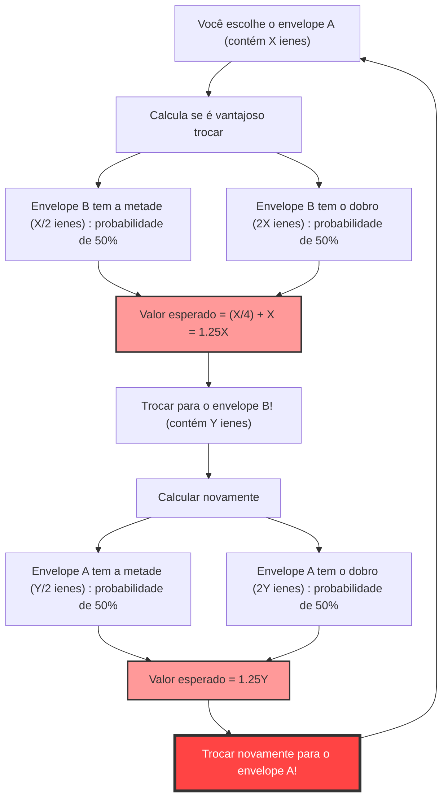
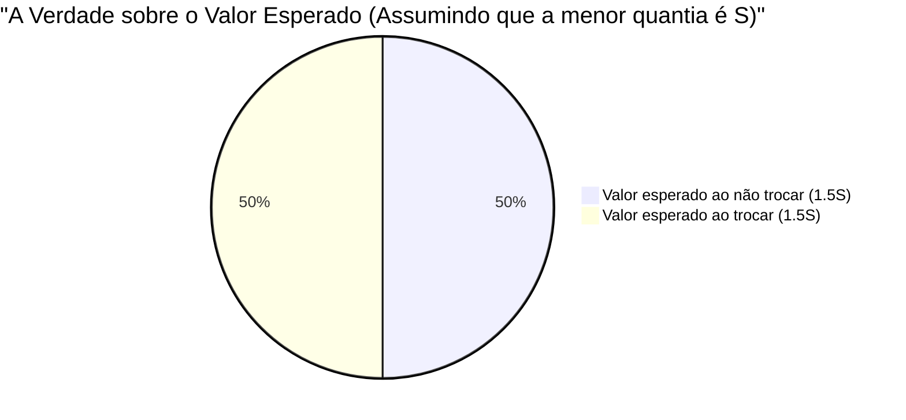

## 1. A Escolha Definitiva: Trocar ou não trocar?

Você está na fase final de um game show. Na mesa à sua frente estão **dois envelopes (A e B)** de aparência idêntica.
O apresentador diz:

> "Um dos envelopes contém o **dobro do dinheiro** do outro. Por favor, escolha um deles."

Depois de hesitar, você escolhe o **envelope A**.
Exatamente quando você está prestes a olhar o que tem dentro, o apresentador sussurra algo tentador:

> "Agora, se você quiser, **pode trocar** esse envelope A pelo envelope B que sobrou. Você quer trocar?"

E agora, você deveria trocar de envelope?

---

## 2. O "Loop Infinito" Derivado do Cálculo do Valor Esperado

Aqui, vamos aplicar um pouco de pensamento matemático.
Vamos assumir que a quantia no seu envelope A seja $X$ ienes.
A quantia no envelope B, de acordo com as regras, é "metade de $X$" ($\frac{X}{2}$) ou "o dobro de $X$" ($2X$). A probabilidade de cada um é de $\frac{1}{2}$ (50%).

Então, vamos calcular o **valor esperado (quantia média prevista) se você trocar os envelopes**.

$$ E = \frac{1}{2} \times \left(\frac{X}{2}\right) + \frac{1}{2} \times (2X) $$
$$ E = \frac{X}{4} + X = \frac{5}{4}X = 1.25X $$

Um resultado surpreendente apareceu.
Apenas trocando os envelopes, o valor esperado salta do original $X$ ienes para **$1.25$ vezes** (um aumento de 25%).
A conclusão seria: "Pensando matematicamente, é absolutamente mais vantajoso trocar!"

No entanto, é aqui que ocorre o **colapso lógico**.
Suponha que você trocou pelo envelope B. Logo depois, se o apresentador perguntasse de novo: "Gostaria de voltar para o A?", o que aconteceria?
A mesma equação se aplica, e desta vez "trocar do B para o A aumenta o valor esperado em 1.25 vezes".

Em outras palavras, **apenas por continuar trocando "de A para B" e "de B para A", o valor esperado teórico continuaria a crescer infinitamente**. Isso é claramente uma contradição com a realidade (o conteúdo dos envelopes está determinado desde o início, e trocar não o aumenta).

Por que um cálculo de valor esperado que parece perfeito criou um paradoxo tão estranho?

---

## 3. Desvendando o Truque Matemático: A Troca Oculta de Variáveis

A armadilha desse paradoxo reside na **"forma como a variável aleatória $X$ é usada"**.

Na equação anterior, tratamos a quantia $X$ do envelope A como se fosse uma **constante fixa**, e assumimos que o envelope B seria "$\frac{X}{2}$ ou $2X$".
No entanto, o que está originalmente fixado é o **"total de dinheiro contido nos dois envelopes"**, ou a **"menor quantia"**.

Vamos chamar a quantia no envelope com menos dinheiro de $S$. Então, o envelope com mais dinheiro tem $2S$.
O jogo inteiro só tem os seguintes dois cenários possíveis (cada um com probabilidade de $\frac{1}{2}$).

- **Cenário 1:** O envelope A que você escolheu é o menor ($S$), e o envelope B é o maior ($2S$)
- **Cenário 2:** O envelope A que você escolheu é o maior ($2S$), e o envelope B é o menor ($S$)

Agora, vamos calcular corretamente o valor esperado para quando você **"não troca"** e quando você **"troca"**.

**Valor esperado se não trocar $E_{stay}$:**
$$ E_{stay} = \frac{1}{2} \times S + \frac{1}{2} \times 2S = \frac{3}{2}S = 1.5S $$

**Valor esperado se trocar $E_{switch}$:**
No Cenário 1 você ganha $2S$, e no Cenário 2 você ganha $S$.
$$ E_{switch} = \frac{1}{2} \times 2S + \frac{1}{2} \times S = \frac{3}{2}S = 1.5S $$

$$ E_{stay} = E_{switch} $$

Lindamente, os valores esperados coincidem!
No primeiro cálculo incorreto, nós pegamos o valor $X$ do Cenário 1 (que na verdade é $S$) e o valor $X$ do Cenário 2 (que na verdade é $2S$) e **tratamos dois valores diferentes como se fossem a mesma variável $X$**, criando assim a ilusão de que "trocar aumenta o valor esperado".

---

## 4. E se você abrisse o envelope?

O paradoxo parece ter sido resolvido aqui. No entanto, um problema mais profundo nos aguarda.

O que aconteceria se você **olhasse o conteúdo do seu envelope A antes de trocar os envelopes**?
Quando você abre o envelope A, ele contém **"10.000 ienes"**.

Neste momento, há um valor fixo de $X = 10000$.
O envelope B contém ou "5.000 ienes" ou "20.000 ienes".
Se aplicarmos a primeira equação aqui, o que acontece?

$$ E_{switch} = \frac{1}{2} \times 5000 + \frac{1}{2} \times 20000 = 2500 + 10000 = 12500 $$

O valor esperado é de 12.500 ienes. É certamente maior do que os atuais 10.000 ienes.
Além disso, como desta vez $X$ é uma "constante específica" de 10.000 ienes, o argumento anterior de "troca de variáveis" não funciona.
Sendo assim, é **absolutamente mais vantajoso trocar**?

### Refutação por Inferência Bayesiana: A Omissão da "Distribuição a Priori"

Contra isso, os matemáticos trouxeram o conceito de **"distribuição a priori (probabilidade a priori) da quantia de dinheiro"**.
A dúvida é se podemos realmente dizer que os 5.000 ienes e 20.000 ienes estão cada um presentes com uma probabilidade de $\frac{1}{2}$.

Por exemplo, suponha que o orçamento do programa tenha um limite máximo de 100 milhões de ienes. Se você abrir o envelope A e encontrar "60 milhões de ienes", a probabilidade de o envelope B ter "120 milhões de ienes" é zero (pois excederia o orçamento). Em outras palavras, à medida que a quantia no envelope A aumenta, a probabilidade de o envelope B ser o "dobro" deve diminuir, e a probabilidade de ser a "metade" deve aumentar.

Se assumirmos qualquer distribuição a priori $P(x)$ e calcularmos o valor esperado usando o Teorema de Bayes, foi provado matematicamente que **não existe uma distribuição mágica onde "sempre é vantajoso trocar" para qualquer quantia $X$, seja qual for a distribuição de probabilidade realista (cuja soma seja 1) que você usar**.

---

## 5. A Armadilha do Infinito: Ligação com o Paradoxo de São Petersburgo

Existe apenas um caso onde "é mais vantajoso trocar para todos os $X$".
Isso só acontece se assumirmos que o orçamento do programa é **infinito**, e criarmos uma "distribuição de probabilidade imprópria (uma distribuição cuja soma é infinita)", onde todos os valores (1 iene, 2 ienes, 4 ienes, 8 ienes... infinito) aparecem de forma igual.

No entanto, nenhuma emissora de TV no mundo real tem ativos infinitos.
Esse erro causado pelo "valor esperado infinito" tem as mesmas raízes profundas do **Paradoxo de São Petersburgo** (o problema de quanto as pessoas estão dispostas a pagar por uma aposta com um valor esperado infinito).

## 6. Conclusão: O Terror da Probabilidade e do Valor Esperado

Apesar de ser composto apenas de multiplicações e adições simples, o "Paradoxo dos Dois Envelopes" nos ensina as seguintes lições:

1. **Erros causados pela ambiguidade das definições**: Se você não esclarecer o que as variáveis representam (se $X$ sempre aponta para a mesma quantia), a lógica pode entrar em colapso facilmente.
2. **A ilusão de que "Nenhuma informação = 50% de probabilidade"**: A premissa "Eu não sei, então deve ser meio a meio" (O Princípio da Razão Insuficiente) às vezes leva a erros de cálculo fatais.
3. **A dificuldade de lidar com o infinito**: Se você introduzir o conceito do "infinito" que não pode ser aplicado ao mundo real em suas equações matemáticas, resultados que desafiam o senso comum surgirão.

Da próxima vez na vida que você pensar "A grama do vizinho é mais verde e é vantajoso trocar", lembre-se deste paradoxo. Talvez você apenas tenha trocado as variáveis em sua própria equação.
