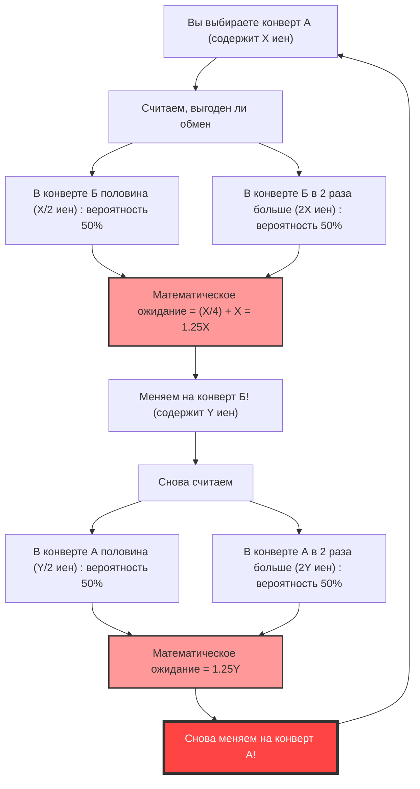
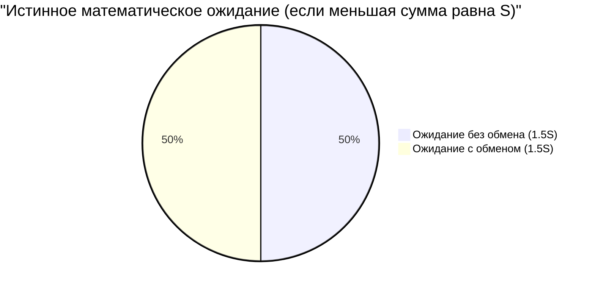

## 1. Главный выбор: менять или не менять?

Вы находитесь на финальном этапе телеигры. На столе перед вами лежат **два конверта (А и Б)**, которые выглядят абсолютно одинаково.
Ведущий говорит:

> "В одном из конвертов находится в **два раза больше денег**, чем в другом. Выберите один из них."

После некоторых колебаний вы выбрали **конверт А**.
И как раз в тот момент, когда вы собираетесь посмотреть его содержимое, ведущий искушающе шепчет:

> "Прямо сейчас вы можете **поменять** ваш конверт А на оставшийся конверт Б. Хотите поменяться?"

Итак, стоит ли вам менять конверты?

---

## 2. «Бесконечный цикл», порожденный вычислением математического ожидания

Давайте теперь задействуем немного математического мышления.
Пусть сумма денег в вашем конверте А равна $X$ иен.
Согласно правилам, сумма в конверте Б — это либо "половина от $X$ иен ($\frac{X}{2}$)", либо "в 2 раза больше $X$ иен ($2X$)". Вероятность каждого варианта составляет $\frac{1}{2}$ (50%).

Теперь давайте посчитаем **математическое ожидание (ожидаемую среднюю сумму) в случае обмена конвертами**.

$$ E = \frac{1}{2} \times \left(\frac{X}{2}\right) + \frac{1}{2} \times (2X) $$
$$ E = \frac{X}{4} + X = \frac{5}{4}X = 1.25X $$

Получился удивительный результат.
Просто поменяв конверты, математическое ожидание подскакивает с изначальных $X$ иен до **в $1.25$ раза** (увеличение на 25%).
Напрашивается вывод: "Если мыслить математически, менять конверт — безусловно выгодно!".

Однако здесь происходит **разрушение логики**.
Предположим, вы поменяли его на конверт Б. Что будет, если сразу после этого ведущий снова спросит: "Не хотите ли вернуться обратно к А?"
Сработает та же самая формула, и на этот раз окажется, что "при обмене Б на А ожидаемая сумма увеличится в 1,25 раза".

Другими словами, **просто продолжая обменивать "А на Б" и "Б на А", теоретическое математическое ожидание будет расти до бесконечности**. Это очевидным образом противоречит реальности (содержимое конвертов зафиксировано с самого начала, и оно не увеличивается от факта обмена).

Почему, казалось бы, идеальный расчет математического ожидания породил такой странный парадокс?

---

## 3. Разоблачение математического трюка: подмена переменных

Ловушка этого парадокса кроется в **«использовании случайной величины $X$»**.

В предыдущей формуле сумма $X$ в конверте А рассматривалась как **фиксированная константа**, и предполагалось, что в конверте Б находится либо «$\frac{X}{2}$», либо «$2X$».
Однако на самом деле фиксированными являются **«общая сумма денег в обоих конвертах»**, или же **«меньшая из двух сумм»**.

Пусть сумма в конверте с меньшим количеством денег равна $S$. Тогда в конверте с большим количеством денег находится сумма $2S$.
Существует только 2 возможных сценария игры (вероятность каждого $\frac{1}{2}$):

- **Сценарий 1:** Выбранный вами конверт А содержит меньшую сумму ($S$), а конверт Б — большую ($2S$).
- **Сценарий 2:** Выбранный вами конверт А содержит большую сумму ($2S$), а конверт Б — меньшую ($S$).

Теперь давайте правильно посчитаем математическое ожидание для случаев **«без обмена»** и **«с обменом»** конвертами.

**Математическое ожидание без обмена $E_{stay}$:**
$$ E_{stay} = \frac{1}{2} \times S + \frac{1}{2} \times 2S = \frac{3}{2}S = 1.5S $$

**Математическое ожидание с обменом $E_{switch}$:**
При сценарии 1 вы получите $2S$, а при сценарии 2 вы получите $S$.
$$ E_{switch} = \frac{1}{2} \times 2S + \frac{1}{2} \times S = \frac{3}{2}S = 1.5S $$

$$ E_{stay} = E_{switch} $$

Математические ожидания чудесным образом совпали!
В первом ошибочном расчете мы **рассматривали разные значения под одной и той же переменной $X$**: $X$ в сценарии 1 (на самом деле это $S$) и $X$ в сценарии 2 (на самом деле это $2S$). Из-за этого и возникла иллюзия того, что "обмен повышает математическое ожидание".

---

## 4. Что будет, если вы всё-таки откроете конверт?

Кажется, что парадокс разрешен. Но нас ждет еще более глубокая проблема.

Что, если **перед обменом вы посмотрели бы содержимое вашего конверта А**?
Вы открываете конверт А и видите в нем **«10 000 иен»**.

В этот момент $X = 10000$ становится зафиксированным значением.
В конверте Б находится либо «5 000 иен», либо «20 000 иен».
Что будет, если мы применим сюда нашу первоначальную формулу?

$$ E_{switch} = \frac{1}{2} \times 5000 + \frac{1}{2} \times 20000 = 2500 + 10000 = 12500 $$

Ожидаемая сумма — 12 500 иен. Это определенно больше ваших текущих 10 000 иен.
Более того, на этот раз $X$ является "конкретной константой" в 10 000 иен, поэтому предыдущий аргумент о "подмене переменных" больше не работает.
Означает ли это, что теперь **совершенно точно выгодно поменяться**?

### Опровержение с помощью байесовского вывода: отсутствие «априорного распределения»

В ответ на это математики предложили концепцию **«априорного распределения сумм (априорной вероятности)»**.
Вопрос в том: можем ли мы действительно утверждать, что 5 000 иен и 20 000 иен находятся там с вероятностью $\frac{1}{2}$ каждое?

Например, предположим, что бюджет телеигры составляет максимум 100 миллионов иен. Если вы откроете конверт А и обнаружите там «60 миллионов иен», вероятность того, что в конверте Б находится «120 миллионов иен», равна нулю (поскольку это превысит бюджет). Это означает, что чем больше сумма в конверте А, тем ниже вероятность того, что в конверте Б сумма "в два раза больше", и тем выше вероятность, что там "половина".

Если предположить произвольное априорное распределение $P(x)$ и посчитать математическое ожидание по теореме Байеса, то математически доказано, что **при любом реалистичном распределении вероятностей (сумма которых равна 1) не существует такого "магического" распределения, при котором "поменяться было бы выгодно" для любой суммы $X$**.

---

## 5. Ловушка бесконечности: связь с Санкт-Петербургским парадоксом

Существует лишь один единственный случай, когда "обмен выгоден при любых $X$".
Он возможен только при допущении, что бюджет телеигры **бесконечен**, и мы имеем дело с "несобственным распределением вероятностей" (распределением, сумма которого равна бесконечности), где любая сумма (1 иена, 2 иены, 4 иены, 8 иен... до бесконечности) может выпасть с одинаковой вероятностью.

Однако в реальном мире не существует телеканалов с бесконечными активами.
Этот сбой, вызванный "бесконечным математическим ожиданием", имеет глубокие общие корни с **Санкт-Петербургским парадоксом** (задачей о том, сколько человек готов заплатить за участие в игре с бесконечным математическим ожиданием выигрыша).

## 6. Заключение: коварство вероятности и математического ожидания

Несмотря на то, что "Парадокс двух конвертов" состоит из простейших умножений и сложений, он преподносит нам следующие уроки:

1. **Ошибки из-за неоднозначности определений**: если четко не определить, на что указывает переменная (указывает ли $X$ всегда на одну и ту же сумму), логика легко разрушится.
2. **Иллюзия «нет информации = вероятность 50%»**: предположение "если я не знаю, значит шансы 50 на 50" (принцип недостаточного основания) порой может привести к фатальным ошибкам в расчетах.
3. **Сложность работы с бесконечностью**: введение в расчеты концепции "бесконечности", неприменимой в реальном мире, приводит к результатам, противоречащим здравому смыслу.

В следующий раз, когда вам в жизни покажется, что "трава у соседа зеленее, и было бы выгоднее поменяться", вспомните этот парадокс. Возможно, в ваших расчетах просто произошла подмена переменных.
