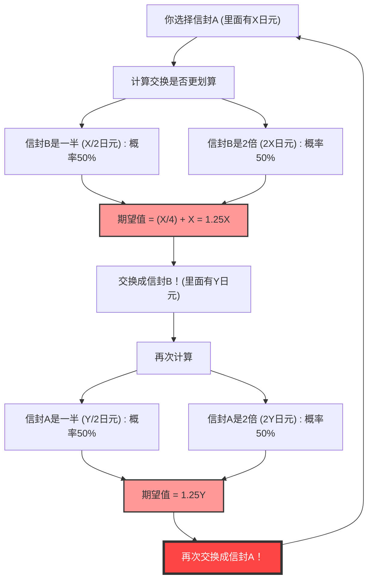
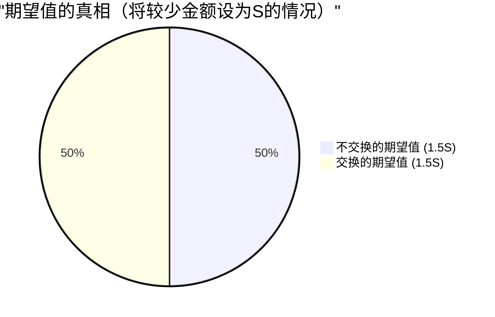

## 1. 终极选择：换还是不换？

你正站在一个游戏节目的最终关卡。面前的桌子上放着两个外观完全相同的**信封（A和B）**。
主持人这样说道：

> “其中一个信封里装着另一个信封**两倍的钱**。请选择其中一个。”

你犹豫再三，选择了**信封A**。
正当你准备看里面的东西时，主持人发出了恶魔般的低语：

> “现在的话，你可以把信封A和剩下的信封B**进行交换**。你要换吗？”

那么，你应该交换信封吗？

---

## 2. 期望值计算导出的“无限循环”

在这里，让我们稍微运用一下数学思维。
假设你持有的信封A中的金额为 $X$ 日元。
根据规则，信封B中的金额要么是“$X$ 日元的一半（$\frac{X}{2}$）”，要么是“$X$ 日元的两倍（$2X$）”。两者的概率各为 $\frac{1}{2}$（50%）。

那么，让我们来计算一下**交换信封情况下的期望值（预期平均金额）**。

$$ E = \frac{1}{2} \times \left(\frac{X}{2}\right) + \frac{1}{2} \times (2X) $$
$$ E = \frac{X}{4} + X = \frac{5}{4}X = 1.25X $$

得出了惊人的结果。
仅仅是通过交换信封，期望值就从原本的 $X$ 日元跃升到了 **$1.25$ 倍**（提升25%）。
结论就是“从数学角度来想，绝对是交换更划算！”。

然而，这里发生了**逻辑崩溃**。
假设你换成了信封B。紧接着，如果主持人再次问你“还是要换回A吗？”会怎么样呢？
完全相同的计算公式依然成立，这次会变成“从B换成A期望值会变成1.25倍”。

也就是说，**仅仅是不断地“从A换到B”、“从B换回A”，理论上的期望值就会无限增加**。这显然与现实相矛盾（信封里的内容从一开始就确定了，并不会因为交换而增加）。

为什么看似完美的期望值计算，会产生这种奇怪的悖论呢？

---

## 3. 解密数学戏法：变量的偷换

这个悖论的陷阱在于**“随机变量 $X$ 的使用方式”**。

在刚才的计算公式中，我们将信封A的金额 $X$ 视为**固定的常数**，并假设信封B是“$\frac{X}{2}$ 或 $2X$”。
然而，真正固定的应该是**“两个信封中装的金额总和”**，或者是**“较少的那个金额”**。

假设装有较少金额的信封里的金额为 $S$。那么，装有较多金额的信封里就有 $2S$ 的金额。
游戏的所有可能情况只有以下2种模式（概率各为 $\frac{1}{2}$）。

- **模式1：** 你选择的信封A是较少的那个 ($S$)，信封B是较多的那个 ($2S$)
- **模式2：** 你选择的信封A是较多的那个 ($2S$)，信封B是较少的那个 ($S$)

在这里，我们来正确计算一下**“不交换时”**和**“交换时”**的期望值。

**不交换时的期望值 $E_{stay}$：**
$$ E_{stay} = \frac{1}{2} \times S + \frac{1}{2} \times 2S = \frac{3}{2}S = 1.5S $$

**交换时的期望值 $E_{switch}$：**
在模式1的情况下可以得到 $2S$，在模式2的情况下可以得到 $S$。
$$ E_{switch} = \frac{1}{2} \times 2S + \frac{1}{2} \times S = \frac{3}{2}S = 1.5S $$

$$ E_{stay} = E_{switch} $$

期望值完美地一致了！
在最初错误的计算中，因为把模式1时的 $X$（实际上是 $S$）和模式2时的 $X$（实际上是 $2S$）这两个**不同的值当作了同一个变量 $X$ 来处理**，所以才产生了“交换期望值就会提高”的幻象。

---

## 4. 如果把信封打开了会怎么样？

悖论似乎到此就解决了。但是，更深层的问题还在后头。

如果你**在交换信封之前，看到了自己信封A里的内容**会怎么样呢？
当你打开信封A，发现里面装着**“1万日元”**。

这一瞬间，就有了 $X = 10000$ 这个确定的值。
信封B里装着的，要么是“5,000日元”，要么是“20,000日元”。
如果此时套用最初的计算公式会怎样呢？

$$ E_{switch} = \frac{1}{2} \times 5000 + \frac{1}{2} \times 20000 = 2500 + 10000 = 12500 $$

期望值是12,500日元。确实比现状的10,000日元要高。
而且，这次 $X$ 成为了10,000日元这个“具体的常数”，因此前面“偷换变量”的反驳就不适用了。
既然如此，**绝对是交换更划算**吗？

### 贝叶斯推断的反证：“先验分布”的缺失

对此，数学家们引出了**“金额的先验分布（先验概率）”**这个概念。
疑问就是，5,000日元和20,000日元，真的能说各有 $\frac{1}{2}$ 的概率在里面吗？

举例来说，假设节目的最大预算是1亿日元。如果你打开信封A发现里面有“6,000万日元”，那么信封B里有“1亿2,000万日元”的概率就是零（因为超出了预算）。也就是说，信封A的金额越大，信封B是“两倍”的概率就越低，是“一半”的概率就越高。

假设有任意的先验分布 $P(x)$，利用贝叶斯定理计算期望值，数学上已经证明了：**无论怎样现实的（总和为1的）概率分布，都不存在那种在所有金额 $X$ 下都“交换更划算”的魔法分布**。

---

## 5. 无限的陷阱：与圣彼得堡悖论的联系

唯一存在一种“在所有 $X$ 下交换都更划算”的情况。
那就是，只有在假设节目预算**无穷大**，且所有金额（1日元、2日元、4日元、8日元……无限）均匀出现的“反常概率分布（总和为无限大的分布）”时才会发生。

然而，现实世界中并不存在拥有无限资产的电视台。
这种“无限大期望值”引发的bug，与**圣彼得堡悖论**（面对期望值为无限大的赌博，人们愿意支付多少钱的问题）有着极深的渊源。

## 6. 总结：概率与期望值的可怕之处

尽管“双信封悖论”仅由简单的乘法和加法构成，它还是给了我们以下教训：

1. **定义模糊产生的错误**：如果不明确变量指的是什么（$X$ 是否总是指同一金额），逻辑很容易就会崩溃。
2. **“没有信息＝概率50%”的错觉**：“因为不知道所以应该是一半一半吧”的前提（理由不充分原则），有时会引发致命的计算错误。
3. **处理无限的困难**：将无法应用于现实世界的“无限”概念引入计算公式中，会产生违反常理的结果。

下次在人生中当你觉得“这山望着那山高，换一换会更好”时，请想起这个悖论。也许只是在你心中的计算公式里，变量被偷换了而已。
