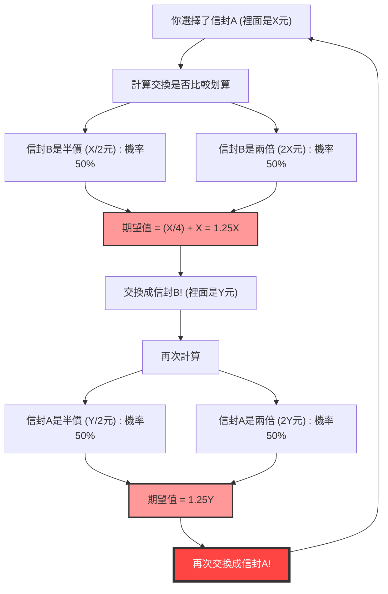
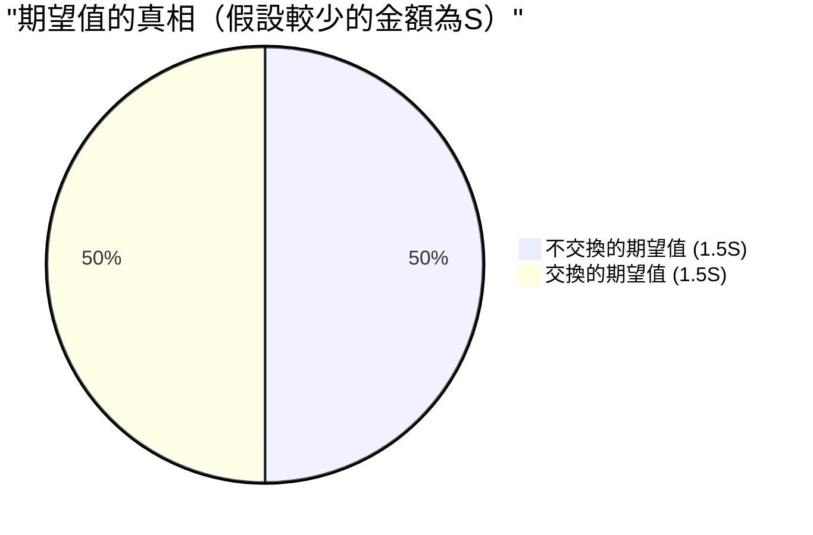

## 1. 終極的選擇：該交換，還是不該交換？

你正站在一個遊戲節目的最終關卡。眼前的桌子上放著兩個外觀完全相同的 **信封（A和B）**。
主持人這麼說：

> 「其中一個信封裡，裝有另一個信封 **兩倍的獎金**。請選擇其中一個。」

你猶豫了一下，選擇了 **信封A**。
正當你想看裡面的內容時，主持人卻像惡魔般在耳邊低語：

> 「現在的話，你可以把那個信封A，和剩下的信封B **進行交換喔**。你要交換嗎？」

那麼，你應該交換信封嗎？

---

## 2. 期望值計算導出的「無限迴圈」

在這裡，讓我們稍微運用一下數學思維。
假設你持有的信封A裡面的金額為 $X$ 元。
根據規則，信封B裡面的金額只有可能是「$X$ 元的一半（$\frac{X}{2}$）」或「$X$ 元的兩倍（$2X$）」。兩者的機率各為 $\frac{1}{2}$（50%）。

那麼，讓我們來計算一下 **交換信封時的期望值（預期平均金額）**。

$$ E = \frac{1}{2} \times \left(\frac{X}{2}\right) + \frac{1}{2} \times (2X) $$
$$ E = \frac{X}{4} + X = \frac{5}{4}X = 1.25X $$

得出了令人驚訝的結果。
只要交換信封，期望值就會從原本的 $X$ 元飆升到 **$1.25$ 倍**（增加25%）。
結論是：「從數學上來思考，交換絕對比較划算！」

但是，這裡發生了 **邏輯的崩潰**。
假設你換成了信封B。就在那之後，如果主持人又問：「要不要再換回A呢？」會發生什麼事？
完全相同的計算公式依然成立，這次變成了「如果從B換回A，期望值會變成1.25倍」。

也就是說，**只要不斷重複「從A換到B」、「從B換到A」，理論上的期望值就會無限增加**。這顯然與現實矛盾（信封裡的內容物從一開始就決定好了，並不會因為交換而增加）。

為什麼看似完美的期望值計算，會產生如此荒謬的悖論呢？

---

## 3. 數學把戲的解密：變數的偷換

這個悖論的陷阱在於 **「隨機變數 $X$ 的使用方式」**。

在剛才的計算公式中，我們把信封A的金額 $X$ 當成一個 **固定的常數** 來處理，並假設信封B是「$\frac{X}{2}$ 或 $2X$」。
然而，真正固定的是 **「兩個信封裡的金額總和」**，或者是 **「較少的那個金額」**。

假設裝有較少金額的信封裡有 $S$ 元。那麼，裝有較多金額的信封裡就有 $2S$ 元。
遊戲的所有情境只有以下兩種模式（機率各為 $\frac{1}{2}$）。

- **模式1：** 你選擇的信封A是較少的 ($S$)，信封B是較多的 ($2S$)
- **模式2：** 你選擇的信封A是較多的 ($2S$)，信封B是較少的 ($S$)

現在，讓我們正確地計算 **「不交換」** 和 **「交換」** 時的期望值。

**不交換時的期望值 $E_{stay}$：**
$$ E_{stay} = \frac{1}{2} \times S + \frac{1}{2} \times 2S = \frac{3}{2}S = 1.5S $$

**交換時的期望值 $E_{switch}$：**
在模式1的時候能得到 $2S$，在模式2的時候能得到 $S$。
$$ E_{switch} = \frac{1}{2} \times 2S + \frac{1}{2} \times S = \frac{3}{2}S = 1.5S $$

$$ E_{stay} = E_{switch} $$

期望值完美地一致了！
在最初錯誤的計算中，因為把模式1的 $X$（實際上是 $S$）和模式2的 $X$（實際上是 $2S$）這 **兩個不同的值當作了同一個變數 $X$ 來處理**，所以產生了「交換就能提升期望值」的幻覺。

---

## 4. 如果打開了信封會怎麼樣？

悖論看起來似乎已經解決了。但是，更深層的問題還在後頭。

如果你 **在交換信封之前，先看了自己信封A裡面的內容**，那會怎麼樣呢？
當你打開信封A，發現裡面裝著 **「10,000元」**。

在這個瞬間，$X = 10000$ 變成了一個確定的值。
信封B裡面裝的，不是「5,000元」就是「20,000元」。
如果套用最初的計算公式會變成怎樣呢？

$$ E_{switch} = \frac{1}{2} \times 5000 + \frac{1}{2} \times 20000 = 2500 + 10000 = 12500 $$

期望值是 12,500 元。絕對比現狀的 10,000 元還要高。
而且，這次 $X$ 已經變成了 10,000 元這個「具體的常數」，所以剛才「偷換變數」的反駁已經行不通了。
這樣的話，是不是 **絕對交換比較划算** 呢？

### 貝氏推論的有力反證：「事前分配」的缺失

針對這一點，數學家們提出了一個名為 **「金額的事前分配（事前機率）」** 的概念。
也就是「5,000元和20,000元，真的可以說是各有 $\frac{1}{2}$ 的機率在裡面嗎？」這樣的疑問。

舉例來說，假設節目的預算最高只有1億元。如果你打開信封A發現裡面有「6,000萬元」，那麼信封B裡有「1億2,000萬元」的機率就是零（因為超出了預算）。也就是說，信封A的金額越大，信封B為「兩倍」的機率就會下降，而為「一半」的機率則應該會上升。

假設存在任意的事前分配 $P(x)$，並使用貝氏定理來計算期望值，數學上已經證明：**在任何符合現實的（總和為1的）機率分配下，都不存在一種神奇的分配，能讓所有金額 $X$ 都符合「交換比較划算」的結果**。

---

## 5. 無限的陷阱：與聖彼得堡悖論的關聯

唯一能讓「在所有 $X$ 的情況下交換都比較划算」成立的情況只有一種。
那就是，假設節目的預算是 **無限大**，並且所有金額（1元、2元、4元、8元……無限）都以相等的機率出現，這種「非正則機率分配（總和為無限大的分配）」的假設。

然而，現實世界中並不存在擁有無限資產的電視台。
這種「無限大的期望值」所引發的 bug，與 **聖彼得堡悖論**（面對一個具有無限期望值的賭博，人們願意支付多少錢的問題）有著極深的同源性。

## 6. 總結：機率與期望值的可怕之處

「兩個信封悖論」雖然只由簡單的乘法和加法構成，卻帶給我們以下教訓：

1. **定義模糊所產生的錯誤**：如果不將變數所指代的東西（$X$ 是否總是代表相同金額）明確化，邏輯就會輕易崩潰。
2. **「沒有資訊＝機率50%」的錯覺**：基於「因為不知道所以各半吧」的前提（不充分理由原則），有時會導致致命的計算錯誤。
3. **處理無限的困難**：如果將不適用於現實世界的「無限」概念帶入計算公式，就會得出違反常理的結果。

下次當你在人生中覺得「外國的月亮比較圓，交換一定比較划算」的時候，請想起這個悖論。或許只是在你的計算公式中，變數被偷換了而已。
