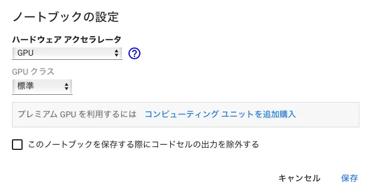
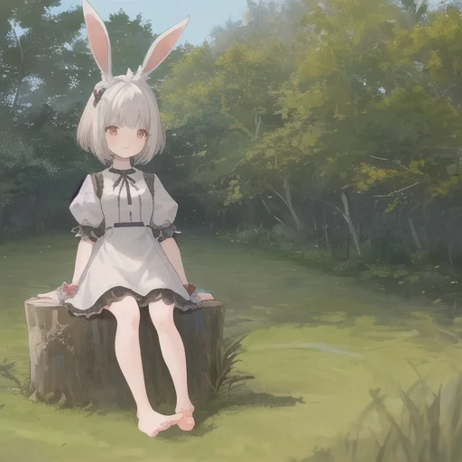
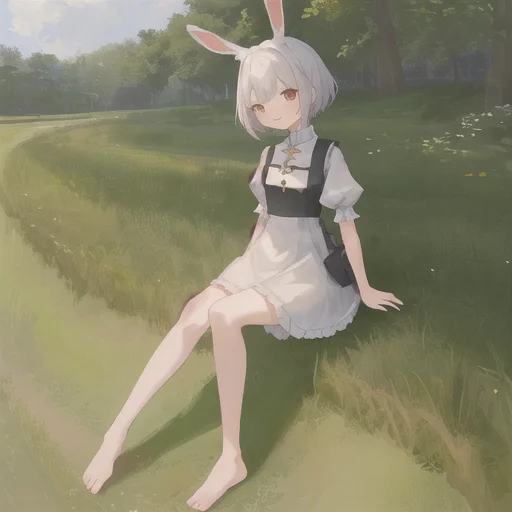
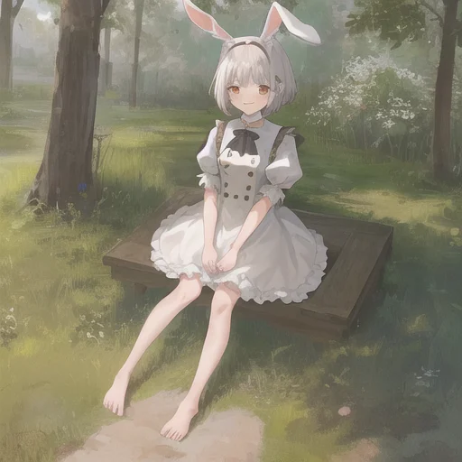

# Stable diffusion क्या है
Stable diffusion म्यूनिख विश्वविद्यालय, जर्मनी की एक शोध टीम द्वारा विकसित एक AI है, जो इनपुट टेक्स्ट जानकारी से इमेजेज जनरेट करता है।
विभिन्न इमेजेज पर ट्रेनिंग देकर, यह वास्तविक तस्वीरों से लेकर इलस्ट्रेशन्स तक विभिन्न प्रकार की इमेजेज जनरेट कर सकता है।

इस बार, मैं पेश करूंगा कि Stable diffusion के प्री-ट्रेंड डेटा का उपयोग करके इलस्ट्रेशन इमेजेज कैसे जनरेट करें।

# आपको क्या चाहिए

- Google अकाउंट

केवल यही

# जनरेशन प्रक्रिया

1. https://colab.research.google.com खोलें
2. ऊपर बाईं ओर `फ़ाइल` से `नई नोटबुक` चुनें
3. `संपादित करें` से `नोटबुक सेटिंग` चुनें
4. `हार्डवेयर एक्सेलेरेटर` को `GPU` में बदलें

5. नीचे दिए गए कोड को पेस्ट करें और चलाएं
```
!pip install diffusers==0.8.0 transformers
```
6. नीचे दिए गए कोड को पेस्ट करें और चलाएं
```
from diffusers import StableDiffusionPipeline
```
7. नीचे दिए गए कोड को पेस्ट करें और चलाएं
```
pipe = StableDiffusionPipeline.from_pretrained("gsdf/Counterfeit-V2.5")
pipe.to("cuda")
```
8. नीचे दिए गए कोड को पेस्ट करें और चलाएं
```
prompt = "((masterpiece,best quality)),1girl, solo, animal ears, rabbit, barefoot, knees up, dress, sitting, rabbit ears, short sleeves, looking at viewer, grass, short hair, smile, white hair, puffy sleeves, outdoors, puffy short sleeves, bangs, on ground, full body, animal, white dress, sunlight, brown eyes, dappled sunlight, day, depth of field"
n_prompt = "EasyNegative, extra fingers,fewer fingers"

image = pipe(prompt, negative_prompt = n_prompt).images[0]
image
```

यहाँ उपयोग किया गया `Prompt`, [https://huggingface.co/gsdf/Counterfeit-V2.5](https://huggingface.co/gsdf/Counterfeit-V2.5) के `Prompt` पर आधारित है।

## जनरेट किए गए परिणाम (कुछ)






## संदर्भ

- [https://huggingface.co/gsdf/Counterfeit-V2.5](https://huggingface.co/gsdf/Counterfeit-V2.5)
- [मैंने 15 मिनट में आर्टिफिशियल इंटेलिजेंस (AI) का उपयोग करके एक इमेज जनरेशन प्रोग्राम बनाया 【लाइव प्रोग्रामिंग】](https://www.youtube.com/watch?v=l8-fVSM2PVQ)
