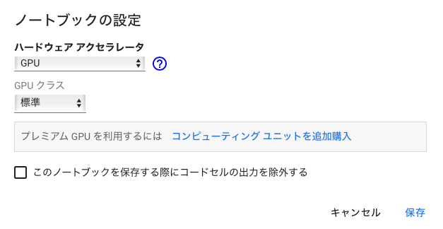
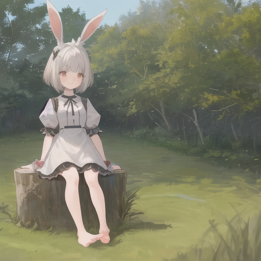
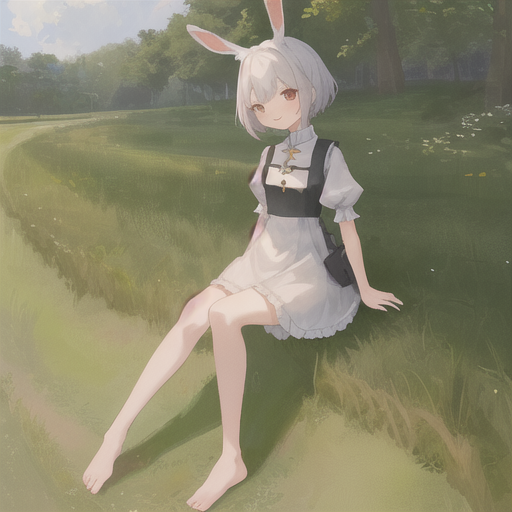
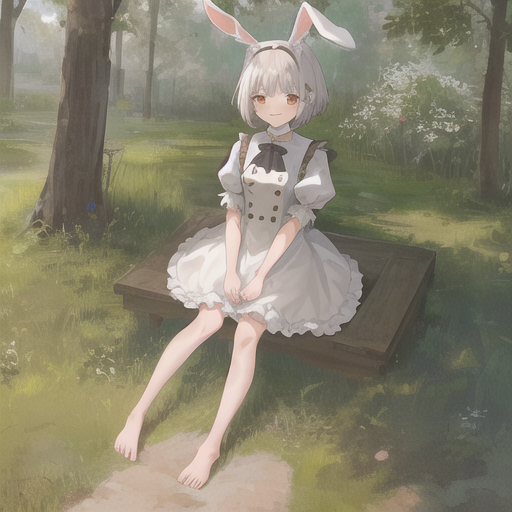

# 什么是 Stable Diffusion
Stable diffusion是由德国慕尼黑大学研究团队开发的，根据输入的文本信息生成图片的AI。
通过让其学习各种图片，它可以生成从写实到插画的各种图片。

这次，我将介绍如何使用Stable diffusion的预训练数据生成插画图片。

# 准备工作

- Google账号

只需要这个。

# 生成步骤

1. 打开 https://colab.research.google.com
2. 选择左上角`文件`中的`新建笔记本`
3. 选择`编辑`中的`笔记本设置`
4. 将`硬件加速器`更改为`GPU`

5. 粘贴并运行以下代码
```
!pip install diffusers==0.8.0 transformers
```
6. 粘贴并运行以下代码
```
from diffusers import StableDiffusionPipeline
```
7. 粘贴并运行以下代码
```
pipe = StableDiffusionPipeline.from_pretrained("gsdf/Counterfeit-V2.5")
pipe.to("cuda")
```
8. 粘贴并运行以下代码
```
prompt = "((masterpiece,best quality)),1girl, solo, animal ears, rabbit, barefoot, knees up, dress, sitting, rabbit ears, short sleeves, looking at viewer, grass, short hair, smile, white hair, puffy sleeves, outdoors, puffy short sleeves, bangs, on ground, full body, animal, white dress, sunlight, brown eyes, dappled sunlight, day, depth of field"
n_prompt = "EasyNegative, extra fingers,fewer fingers"

image = pipe(prompt, negative_prompt = n_prompt).images[0]
image
```

这里使用的`Prompt`参考了[https://huggingface.co/gsdf/Counterfeit-V2.5](https://huggingface.co/gsdf/Counterfeit-V2.5)的`Prompt`。

## 生成结果（部分）






## 参考

- [https://huggingface.co/gsdf/Counterfeit-V2.5](https://huggingface.co/gsdf/Counterfeit-V2.5)
- [花15分钟制作了使用人工智能（AI）的图片生成程序【实况编程】](https://www.youtube.com/watch?v=l8-fVSM2PVQ)
