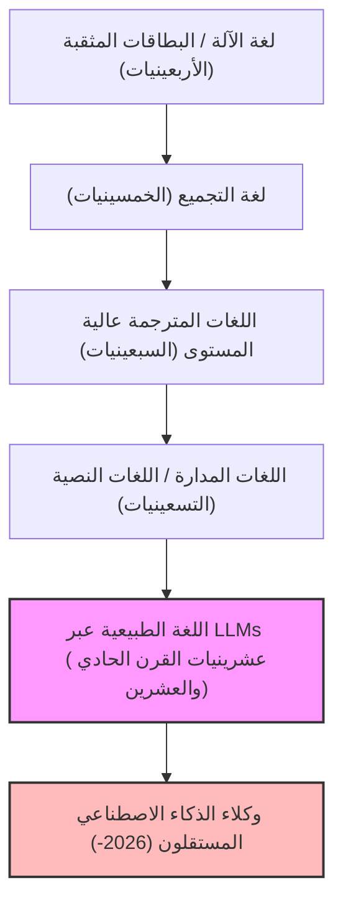
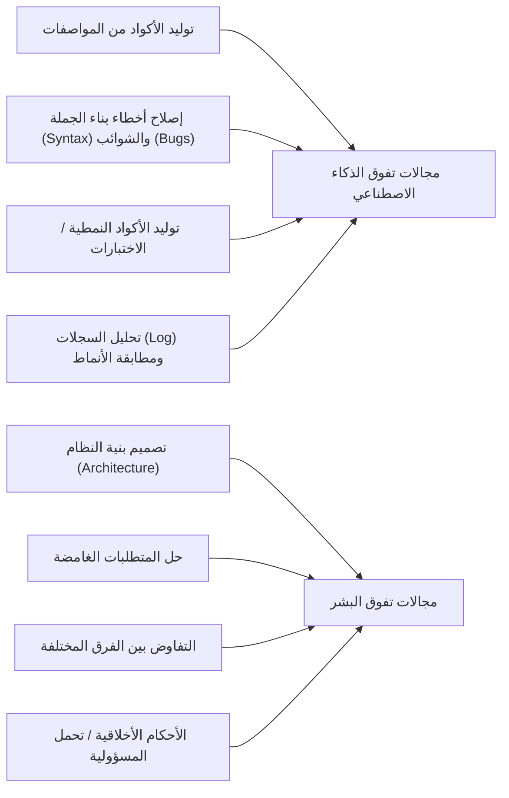
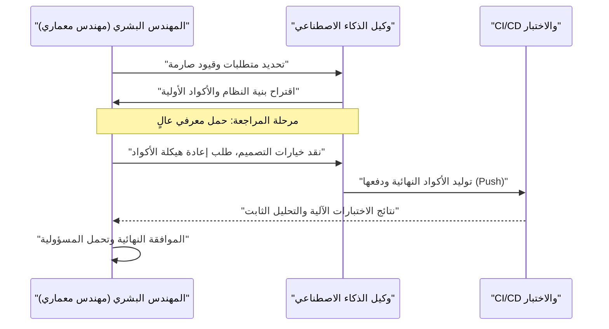

# كيف يجب أن ينجو المبرمجون في عصر الذكاء الاصطناعي؟ نهاية البرمجة وبداية فجر جديد لهندسة البرمجيات

اعتبارًا من عام 2026، يشهد مجال تطوير البرمجيات فترة من التغيير الجذري غير المسبوق. حتى سنوات قليلة مضت، كان مفهوم "الذكاء الاصطناعي يكتب التعليمات البرمجية" يقتصر على كونه أداة مساعدة للمبرمجين، مثل إنشاء الأكواد النمطية (boilerplate) أو الإكمال التلقائي للدوال. ولكن، مع التطور المذهل للنماذج اللغوية الكبيرة (LLMs)، انقلبت الأمور رأسًا على عقب. فالذكاء الاصطناعي الحديث ليس مجرد "آلة كاتبة ذكية"؛ بل تحول إلى "مهندس مبتدئ مستقل" قادر على بناء أنظمة كاملة بشكل لحظي ومستقل، من الواجهة الأمامية إلى منطق الواجهة الخلفية، وتصميم مخطط قاعدة البيانات، وحتى بناء خطوط أنابيب CI/CD، بمجرد تزويده بمستند متطلبات.

في مثل هذا العصر، كيف يمكننا نحن "المبرمجين" و"مهندسي البرمجيات" البقاء على قيد الحياة؟ مع الانكماش السريع للقيمة الاقتصادية لفعل "كتابة الأكواد" نفسه، فإن "المبرمج" الذي يعرف فقط بناء الجملة (الـ syntax) للغة برمجة معينة ويتقن واجهات برمجة التطبيقات (API) لإطار عمل محدد يتم إقصاؤه سريعًا من السوق.

في هذا المقال، سنقوم بدراسة استراتيجية بقاء المبرمجين في عصر الذكاء الاصطناعي بتفصيل كبير من منظور تقني، رياضي، وفلسفي. هذا ليس مجرد نقاش حول المسار المهني، بل هو إعادة تعريف لهندسة البرمجيات كعلم في حد ذاته.

---

## 1. تاريخ التجريد (Abstraction) وإعادة تعريف "البرمجة"

إذا نظرنا إلى تاريخ هندسة البرمجيات، سنجد أنه كان دائمًا تاريخًا من "التجريد". لقد سعينا دائمًا لبناء طبقات من أجل وصف الأنظمة المعقدة بلغة أقرب إلى لغة البشر.

كان علماء الكمبيوتر الأوائل يتفاعلون مع مفاتيح الأجهزة المادية مباشرة باستخدام البطاقات المثقبة، ويعطون التعليمات للكمبيوتر بلغة الآلة (سلسلة من الأصفار والآحاد). بعد ذلك، ظهرت لغة التجميع (Assembly)، والتي أتاحت للبشر التحكم في الأجهزة باستخدام اختصارات سهلة الفهم. ومع تقدم الزمن، ظهرت لغات عالية المستوى مثل C و Fortran، ونجحت في تغليف التفاصيل المعقدة للأجهزة مثل إدارة الذاكرة وسجلات وحدة المعالجة المركزية. ثم من خلال لغات حديثة مثل Java و Python و Ruby و TypeScript، أصبح بإمكان المبرمجين التركيز أكثر على "ما نريد أن يفعله الكمبيوتر (What)" بدلاً من "كيفية تشغيل الكمبيوتر (How)".

ظهور الذكاء الاصطناعي (LLM) هو التحول النموذجي الأحدث والأكبر في تاريخ التجريد هذا. إذا كان تطور لغات البرمجة بمثابة "إخفاء للأجهزة"، فإن تطور النماذج اللغوية الكبيرة هو "إخفاء لقواعد اللغة (syntax)".

لقد ولى العصر الذي كان يقلق فيه المطورون بشأن تسرب الذاكرة أثناء التعامل مع المؤشرات، أو كتابة مئات الأسطر من الأكواد النمطية لتحليل ملفات JSON. أصبح استخدام اللغة الطبيعية (مثل اليابانية أو الإنجليزية)، وهي اللغة الأكثر تجريدًا بالنسبة للبشر، لتعريف الأنظمة هو معيار "البرمجة" في عام 2026.

---

## 2. النموذج الرياضي للإنتاجية: ركوب موجة النمو الأُسي

دعونا نقيم التحسن في الإنتاجية الذي يجلبه الذكاء الاصطناعي كميًا باستخدام نموذج رياضي.
يمكن نمذجة الإنتاجية الفردية $P_{traditional}$ في تطوير البرمجيات التقليدية كمجموعة خطية من مستوى مهارة الفرد $S$، وخبرته في المجال $E$، وكفاءة الأدوات $T$.

$$ P_{traditional} = c_1 \cdot S + c_2 \cdot E + c_3 \cdot T $$

ومع ذلك، في التطوير الحديث باستخدام الذكاء الاصطناعي، تعمل قدرة الذكاء الاصطناعي $A(t)$ كـ "مضاعف قوي (Multiplier)" يضخم القدرة البشرية. نظرًا لأن قدرات الذكاء الاصطناعي تنمو بشكل أُسي مع مرور الوقت $t$ (نسخة الذكاء الاصطناعي من قانون مور)، يمكن التعبير عن الإنتاجية في عصر الذكاء الاصطناعي $P_{AI}(t)$ بالمعادلة التالية:

$$ P_{AI}(t) = \alpha \cdot S_{core} \cdot e^{\beta \cdot A(t)} $$

حيث تعني كل متغيرة ما يلي:
*   $\alpha$: معامل الإنتاجية البشرية الأساسي
*   $S_{core}$: "المهارات البشرية الأساسية" التي لا يمكن للذكاء الاصطناعي استبدالها (تصميم البنية، فهم متطلبات العمل، الأحكام الأخلاقية، إلخ)
*   $A(t)$: القدرة المطلقة لنموذج الذكاء الاصطناعي في الوقت $t$ (عدد المعلمات، نافذة السياق، القدرة على الاستدلال)
*   $\beta$: معامل يشير إلى مدى فعالية استخلاص الأدوات الخاصة بالذكاء الاصطناعي (جودة هندسة التلقين (Prompt Engineering) ومدى تطور سير العمل التعاوني مع الذكاء الاصطناعي)

الاستنتاج المهم الذي يمكن استخلاصه من هذه الصيغة هو أنه **في عالم تزداد فيه $A(t)$ بشكل أُسي، فإن المهارات التقليدية مثل سرعة الكتابة وحفظ لغات معينة سيكون لها تأثير ضئيل جدًا على الإنتاجية الإجمالية**. بدلاً من ذلك، يصبح المعامل $\beta$، الذي يُستغل لمواكبة النمو الأُسي للذكاء الاصطناعي، و $S_{core}$، وهو المجال الذي لا يمكن للذكاء الاصطناعي تغطيته، العاملين المهيمنين اللذين يحددان القيمة السوقية للمهندس.

---

## 3. احتمالية أتمتة المهام (Probability of Automation)

إذن، ما هي المهام التي سيتم أتمتتها، وما هي المهام التي ستبقى في أيدي البشر؟
يمكن صياغة احتمالية أن تتم أتمتة مهمة معينة $T$ بالكامل بواسطة الذكاء الاصطناعي $P_{auto}(T)$ على النحو التالي:

$$ P_{auto}(T) = 1 - \exp\left(-\lambda \cdot \frac{\text{Predictability}(T)}{\text{Complexity}(T) \times \text{Context Dependency}(T)}\right) $$

*   $\text{Predictability}(T)$: القدرة على التنبؤ بالمهمة (مدى وجود نمط في البيانات السابقة)
*   $\text{Complexity}(T)$: تعقيد المهمة
*   $\text{Context Dependency}(T)$: قوة "السياق الضمني (المعرفة الخاصة بالمجال أو العلاقات الإنسانية)" الذي تعتمد عليه المهمة
*   $\lambda$: معدل التقدم التكنولوجي للذكاء الاصطناعي

المهام التي تتميز بقدرة عالية على التنبؤ واعتماد منخفض على السياق، مثل كتابة عمليات التوجيه (routing) في واجهات برمجة التطبيقات (API) أو إنشاء شاشات CRUD بسيطة، سيكون لها $P_{auto} \approx 1$ وسيتم أتمتتها بالكامل تقريبًا. من ناحية أخرى، المهام التي تعتمد بشكل كبير على السياق، مثل "كيفية دمج الأنظمة القديمة مع الخدمات المصغرة الجديدة بأمان" أو "كيفية تصميم تدفق مصادقة يلبي متطلبات الإدارة القانونية دون الإضرار بتجربة المستخدم"، يصعب أتمتتها.

---

## 4. العودة من بناء الجملة (Syntax) إلى البنية (Architecture)

إن الفصل الواضح بين ما يجيده الذكاء الاصطناعي وما يجيده البشر هو شرط مطلق للبقاء.

يتفوق الذكاء الاصطناعي على البشر في "التحسين المحلي (Local Optimization)". لا يمكن للبشر التغلب عليه من حيث السرعة والدقة في كتابة دالة واحدة، أو فئة (class) واحدة، أو وحدة واحدة. ومع ذلك، فإن الذكاء الاصطناعي ضعيف جدًا عندما يتعلق الأمر بـ "التحسين الشامل (Global Optimization)" أو "فقدان السياق (Missing Context)".

يجب على مبرمجي المستقبل أن يحولوا دورهم من "عمال يكتبون الأكواد" إلى "مهندسين معماريين ينسقون (orchestrate) المكونات التي لا حصر لها التي ينتجها الذكاء الاصطناعي". النظر إلى النظام ككل، أين يمكن رسم حدود الخدمات المصغرة، وكيفية حل المفاضلة بين التوافر والاتساق في نظرية CAP بما يتماشى مع سياق العمل، وكيفية التحكم في الديون التقنية. هذه كلها مهام فكرية متقدمة لا يمكن أن يقوم بها إلا إنسان يفهم الصورة الكبيرة وأهداف العمل.

---

## 5. تحديد المتطلبات هو "هندسة التلقين (Prompt Engineering) الحقيقية"

غالبًا ما يُساء فهم مصطلح "هندسة التلقين" الذي نسمعه كثيرًا هذه الأيام على أنه "اختراق لخداع الذكاء الاصطناعي للحصول على المخرجات المطلوبة". ومع ذلك، فإن جوهر هندسة التلقين في تطوير البرمجيات هو بلا شك **"هندسة المتطلبات المتقدمة (Requirements Engineering)"**.

من أجل توجيه الذكاء الاصطناعي باللغة الطبيعية لإنتاج البرنامج المطلوب كما هو مخطط، يجب التعبير عن العناصر التالية بشكل دقيق:

1.  **الهدف (Why)**: لماذا هذه الميزة مطلوبة؟ ما هي القيمة التجارية؟
2.  **القيود (Constraints)**: متطلبات الأداء (زمن الوصول، الإنتاجية)، متطلبات الأمان، وقيود التكلفة.
3.  **الحالات الطرفية (Edge Cases)**: العمليات البديلة (fallback) عندما يقوم المستخدم بإدخال بيانات غير متوقعة.
4.  **الواجهات (Interfaces)**: مواصفات التكامل مع الأنظمة الحالية.

التعليمات الغامضة (prompts) ستؤدي فقط إلى بناء أنظمة غامضة وهشة. إن القدرة على الاستماع بعمق لمعرفة "ما يريده العميل حقًا"، وتنظيم المتطلبات المتناقضة، وإنشاء مستند مواصفات (prompt) خالٍ من العيوب المنطقية؛ هذه هي "مهارة البرمجة" الأقوى في عصر الذكاء الاصطناعي. سيقضي المبرمجون وقتًا أقل في مواجهة محررات الأكواد، ووقتًا أطول أمام Notion أو ملفات Markdown، لوصف الشكل الذي يجب أن يكون عليه النظام بدقة نصية.

---

## 6. التفوق الساحق لمعرفة المجال (Domain Knowledge)

نظرًا لأن الذكاء الاصطناعي يتعلم من الأكواد مفتوحة المصدر والوثائق العامة حول العالم، فهو على دراية واسعة بتقنيات الويب والخوارزميات العامة. لكن هناك بيانات لا يمكن للذكاء الاصطناعي الوصول إليها. وهي "قواعد العمل الخاصة بشركتك" و "المعرفة العميقة بمجال معين (مثل الطب، والتمويل، والتصنيع، وغيرها)".

على سبيل المثال، لنفترض أننا نطور نظام سجلات طبية إلكترونية في شركة طبية ناشئة. قد يعرف الذكاء الاصطناعي "كيفية إنشاء واجهة مستخدم (UI) جدولية باستخدام React" أو "هياكل البيانات العامة لـ HL7 FHIR". ومع ذلك، فإنه لم يتعلم المعرفة الضمنية مثل "في قسم معين من مستشفى أ، ما هو الترتيب الذي يجب أن يرى به الأطباء بيانات المرضى، وما هي واجهة المستخدم التي تقلل من مخاطر الأخطاء الطبية".

في عالم أصبحت فيه التكنولوجيا نفسها سلعة (commoditized)، تُخلق القيمة الحقيقية للمهندس عند تقاطع "التكنولوجيا" و"مجال العمل (business domain)". لن نعتمد فقط على المهارات التقنية، بل الأشخاص الذين يمتلكون معرفة متخصصة عميقة في مجالات معينة مثل الطب، أو التمويل، أو الخدمات اللوجستية، أو الترفيه، ويمكنهم استخدام أداة قوية مثل الذكاء الاصطناعي لحل المشكلات في تلك المجالات، هم الذين سيقودون السوق في المستقبل.

---

## 7. "مشكلة العربة" في تطوير البرمجيات: من يتحمل المسؤولية؟

مع تزايد اعتمادنا على الذكاء الاصطناعي، نواجه قضايا فلسفية وأخلاقية خطيرة. وهي مشكلة "تحديد المسؤولية" في هندسة البرمجيات.

إذا تسببت الأكواد التي أنشأها الذكاء الاصطناعي بشكل مستقل في خطأ فادح (bug) في بيئة الإنتاج، مما أدى إلى خسارة ملايين الدولارات للشركة، أو تسبب في عطل في نظام طبي يمس حياة الإنسان، فمن سيتحمل المسؤولية؟ هل الشركة التي طورت نموذج الذكاء الاصطناعي؟ أم المهندس الذي أدخل الموجه (prompt)؟ لا يمكننا "طرد" أو "اعتقال" الذكاء الاصطناعي.

إن دور "الإنسان" ككيان يتحمل "المسؤولية القانونية والأخلاقية (Accountability)" تجاه تأثير الأنظمة على المجتمع لن يختفي مهما تقدمت التكنولوجيا. في الواقع، كلما أصبحت عملية إنشاء الأكواد بمثابة صندوق أسود، زاد العبء الملقى على عاتق الإنسان ليتحمل مسؤولية كبيرة كـ "مانح الموافقة النهائية (Approver)" و"المشرف (Supervisor)" على النظام.

يجب على الإنسان التدقيق فيما إذا كانت البنية والأكواد التي يقدمها الذكاء الاصطناعي تلبي معايير الأمان، وليس بها مشاكل أخلاقية (مثل التحيز)، وتلتزم باللوائح والقوانين، ومن ثم إعطاء الموافقة النهائية. هذا الفعل المتمثل في "تحمل المسؤولية" نفسه سيصبح جزءًا مهمًا من عمل المهندس.

---

## 8. البرمجة الزوجية مع الذكاء الاصطناعي وإدارة الحمل المعرفي (Cognitive Load)

عند العمل مع الذكاء الاصطناعي، تتغير طبيعة "الحمل المعرفي (Cognitive Load)" البشري أيضًا. الحمل المعرفي لكتابة الكود من الصفر يختلف تمامًا عن الحمل المعرفي لـ "قراءة ومراجعة" مئات الأسطر من الأكواد المجهولة التي يولدها الذكاء الاصطناعي.

وفقًا لنظرية الحمل المعرفي في علم النفس، عند معالجة معلومات معقدة لا تتناسب مع المخططات الحالية (بنية المعرفة في أدمغتنا)، تنفد الذاكرة العاملة لدى الإنسان بسرعة. فالأكواد التي يولدها الذكاء الاصطناعي قد تحتوي أحيانًا على تحسينات متقدمة لا يمكن للبشر التفكير فيها، ولكنها في نفس الوقت قد تحتوي على "هلوسات (Hallucinations)" تتجاهل السياق.

لمنع ذلك، يجب وضع نظام لعملية المراجعة مع الذكاء الاصطناعي.

يحتاج البشر إلى صقل مهاراتهم إلى أقصى حد في "القراءة السريعة واكتشاف العيوب المنطقية بشكل فوري (Code Reading & Auditing)" أكثر من مهارة "الكتابة". تتزايد أهمية التطوير القائم على الاختبار (TDD) في عصر الذكاء الاصطناعي. قبل السماح للذكاء الاصطناعي بكتابة التعليمات البرمجية، سيصبح النهج السائد هو أن يكتب الإنسان أو ذكاء اصطناعي آخر أكواد اختبار صارمة، ويطلب من الذكاء الاصطناعي تعديل أكواده حتى ينجح في تلك الاختبارات.

---

## 9. استراتيجيات بقاء ملموسة: ما الذي يجب أن تتعلمه غدًا؟

بناءً على التحليل أعلاه، نقدم خطة عمل ملموسة للمبرمجين للبقاء على قيد الحياة في عصر الذكاء الاصطناعي.

1.  **أعد تعلم "أساسيات" التكنولوجيا بشكل كامل**: اترك كيفية استخدام أطر العمل (frameworks) للذكاء الاصطناعي. ولكن، لا غنى عن الفهم العميق لآليات نظام التشغيل (OS)، وبروتوكولات الشبكة (TCP/IP، HTTP/3)، والهياكل الداخلية لقواعد البيانات (B-Tree، مستويات عزل المعاملات)، وهياكل البيانات والخوارزميات. لكي تتمكن من الحكم على ما إذا كانت مخرجات الذكاء الاصطناعي صحيحة، فإن الأساس القوي في علوم الكمبيوتر أمر ضروري.
2.  **إتقان البنية السحابية (Cloud Architecture) والأنظمة الموزعة**: ركز على كيفية الجمع بين الموارد السحابية مثل AWS و GCP و Azure لبناء أنظمة قابلة للتوسع، بدلاً من التركيز على الأكواد الفردية. افهم مفهوم البنية التحتية ككود (IaC) مثل Terraform، وطور القدرة على تصميم النظام بأكمله ككود.
3.  **كن خبيرًا في مجال عملك (Business Domain)**: تعلم بعمق نماذج الأعمال، واللوائح القانونية، وسيكولوجية سلوك المستخدم في الصناعة التي تنتمي إليها. تجاوز حدود المهندس وامتلك منظورًا أقرب إلى مدير المنتج (PM).
4.  **اصقل مهارات التواصل والتيسير (Facilitation)**: عملية حل "الغموض" بين البشر وبناء التوافق هي عملية لا يمكن للذكاء الاصطناعي استبدالها. إن المهارات الشخصية (Soft skills) للتواصل مع أصحاب المصلحة واكتشاف التحديات الحقيقية ستصبح المهارات الأكثر قيمة.
5.  **استخدم الذكاء الاصطناعي كـ "زميل عمل" إلى أقصى حد**: لا تخف من تطور أدوات الذكاء الاصطناعي، بل استخدمها كأقوى أسلحتك. استخدم أحدث النماذج اللغوية الكبيرة (LLMs) ووكلاء البرمجة الذكية يوميًا، وقم ببناء "معرفة ضمنية" حول أين يفشل الذكاء الاصطناعي وكيفية ابتكار الموجهات (prompts) لاستخراج أفضل أداء منه.

---

## الخلاصة: لا تخف، بل اركب الموجة

أتمتة البرمجة بواسطة الذكاء الاصطناعي لا تعني "موت" مهنة المبرمج. بل إنها **"نهضة (Renaissance)"** تحررنا من "المهام غير الأساسية" في تطوير البرمجيات، مثل إصلاح الأخطاء المطبعية، واستكشاف أخطاء إعداد البيئة، وكتابة الأكواد النمطية المملة.

على مر التاريخ، عند ظهور أنوال النسيج الآلية، أو برامج الجداول الإلكترونية (مثل Excel)، ساد التشاؤم بأن الوظائف ستختفي. ولكن في الواقع، مع تحسن الإنتاجية بشكل كبير، تم خلق طلب جديد، وظهرت وظائف أكثر تقدماً. سيحدث الشيء نفسه في عالم البرمجيات. من خلال القدرة على "بناء الأنظمة بتكلفة منخفضة"، ستتغلغل البرمجيات في كل المجالات التي لم تكن مزودة بتكنولوجيا المعلومات من قبل بسبب التكلفة، وستتوسع التحديات (What) التي يجب على المهندسين حلها إلى ما لا نهاية.

تُتاح لنا نحن المبرمجين اليوم فرصة التطور من حرفيين يكتبون الأكواد إلى "قادة أوركسترا" يوجهون ذكاءً هائلاً متمثلاً في الذكاء الاصطناعي. بدلاً من البقاء على الشاطئ خوفًا من موجة التكنولوجيا، دعونا نركب هذه الموجة في وقت مبكر وننطلق في رحلة لإنشاء أنظمة أكبر وأكثر قيمة. إن عصر الذكاء الاصطناعي هو بالضبط العصر الذي تبدأ فيه "الهندسة" الحقيقية.
