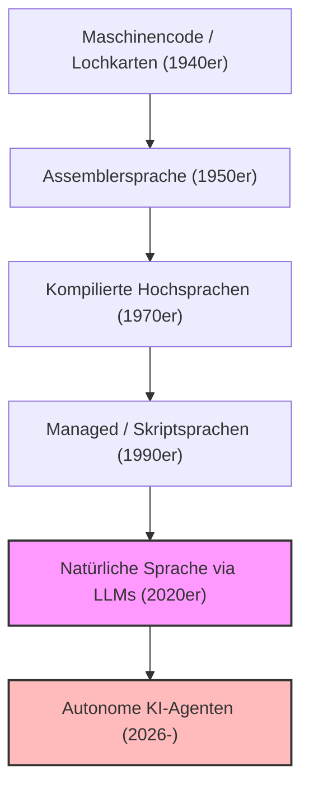
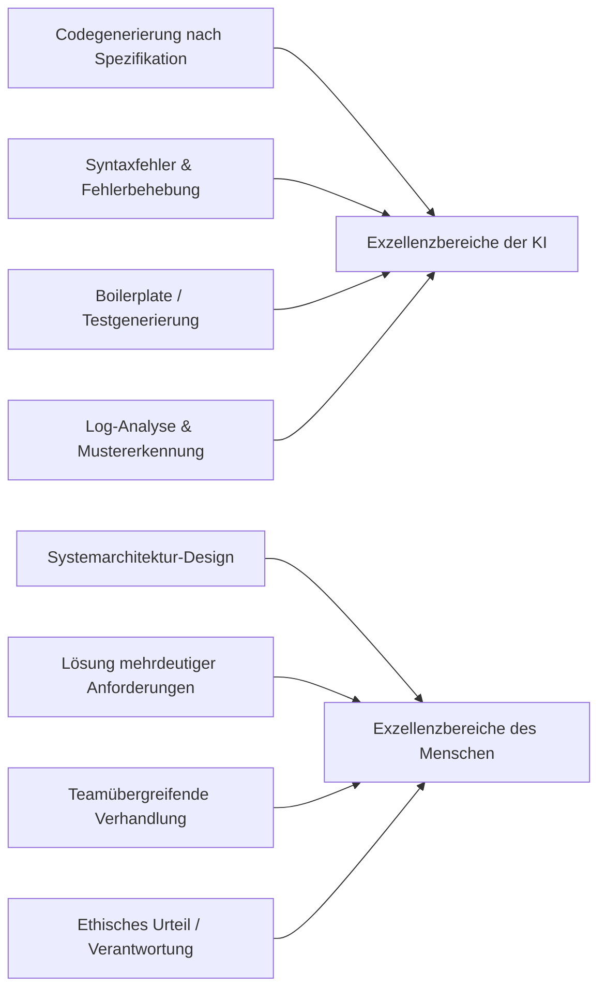
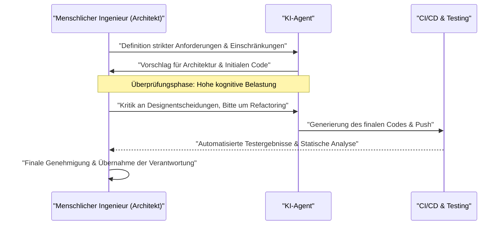

# Wie sollten Programmierer im KI-Zeitalter überleben? Das Ende des Codings und der Beginn eines neuen Engineerings

Im Jahr 2026 befindet sich die Softwareentwicklung in einer beispiellosen Phase des Umbruchs. Bis vor wenigen Jahren beschränkte sich das Konzept "KI schreibt Code" bestenfalls auf die Generierung von Boilerplate-Code (Standardcode) und die automatische Vervollständigung von Funktionen – als "Hilfswerkzeug" für Programmierer. Doch durch die erstaunliche Entwicklung von Large Language Models (LLMs) hat sich die Situation grundlegend geändert. Die moderne KI ist nicht mehr nur eine "schlaue Schreibmaschine", sondern hat sich zu einem "autonomen Junior-Engineer" entwickelt: Wenn man ihr ein Anforderungsdokument gibt, ist sie in der Lage, autonom und in Sekundenschnelle ein komplettes System aufzubauen – von der Frontend- und Backend-Logik über das Datenbankschema-Design bis hin zur Einrichtung von CI/CD-Pipelines.

Wie sollten wir "Programmierer" und "Software-Ingenieure" in einem solchen Zeitalter überleben? Während der wirtschaftliche Wert des bloßen "Code-Schreibens" rapide abnimmt, werden "Coder", die lediglich die Syntax einer bestimmten Programmiersprache kennen und mit der API eines bestimmten Frameworks vertraut sind, schnell vom Markt verdrängt.

In diesem Artikel werden wir die Überlebensstrategien für Programmierer im KI-Zeitalter aus technischen, mathematischen und philosophischen Perspektiven sehr detailliert untersuchen. Dies ist nicht nur eine Karrieredebatte, sondern eine Neudefinition der Disziplin des Software Engineerings selbst.

---

## 1. Die Geschichte der Abstraktion und die Neudefinition des "Programmierens"

Wenn wir auf die Geschichte des Software Engineerings zurückblicken, erkennen wir, dass es immer eine Geschichte der "Abstraktion" war. Wir haben stets Schichten (Layer) aufgebaut, um komplexere Systeme in einer menschenähnlicheren Sprache beschreiben zu können.

Frühe Informatiker verwendeten Lochkarten, um physische Hardware-Schalter direkt zu bedienen, und gaben dem Computer Anweisungen in Maschinensprache (einer Reihe von 0en und 1en). Später erschien die Assemblersprache, die es ermöglichte, Hardware mit menschenlesbaren Mnemonics zu steuern. Im Laufe der Zeit kamen höhere Programmiersprachen wie C und Fortran auf, denen es gelang, komplexe Hardware-Details wie Speicherverwaltung und CPU-Register zu kapseln. Moderne Sprachen wie Java, Python, Ruby und TypeScript ermöglichten es Programmierern schließlich, sich mehr darauf zu konzentrieren, "was der Computer tun soll (What)", anstatt "wie der Computer es tun soll (How)".

Das Aufkommen von KI (LLMs) ist der neueste und größte Paradigmenwechsel in dieser Geschichte der Abstraktion. Wenn die Evolution von Programmiersprachen das "Verbergen von Hardware" war, dann ist die Evolution von LLMs das "Verbergen von Syntax (Grammatik)".

Die Zeit, in der Entwickler sich um Speicherlecks sorgen, Zeiger manipulieren oder Hunderte von Zeilen Standardcode für das Parsen von JSON schreiben mussten, ist vorbei. Die Verwendung natürlicher Sprache (wie Deutsch oder Englisch) – der für die Menschheit am höchsten abstrahierten Sprache – zur Definition von Systemen ist zum Standard des "Programmierens" im Jahr 2026 geworden.

---

## 2. Das mathematische Modell der Produktivität: Auf der Welle des exponentiellen Wachstums reiten

Lassen Sie uns die durch KI bedingte Produktivitätssteigerung quantitativ anhand eines mathematischen Modells bewerten.
Die individuelle Produktivität in der traditionellen Softwareentwicklung $P_{traditional}$ konnte als lineare Kombination aus individuellem Qualifikationsniveau $S$, Domänenerfahrung $E$ und Werkzeugeffizienz $T$ modelliert werden.

$$ P_{traditional} = c_1 \cdot S + c_2 \cdot E + c_3 \cdot T $$

In der modernen, KI-gestützten Entwicklung wirkt die Fähigkeit der KI $A(t)$ jedoch als "starker Hebel (Multiplier)", der die menschlichen Fähigkeiten verstärkt. Da die Fähigkeiten der KI im Laufe der Zeit $t$ exponentiell wachsen (eine KI-Version des mooreschen Gesetzes), kann die Produktivität im KI-Zeitalter $P_{AI}(t)$ durch die folgende Gleichung dargestellt werden:

$$ P_{AI}(t) = \alpha \cdot S_{core} \cdot e^{\beta \cdot A(t)} $$

Hierbei haben die Variablen folgende Bedeutung:
*   $\alpha$: Basiskoeffizient der menschlichen Produktivität
*   $S_{core}$: "Menschliche Kernkompetenzen", die nicht durch KI ersetzt werden können (z.B. Architekturdesign, Verständnis von Geschäftsanforderungen, ethisches Urteilsvermögen)
*   $A(t)$: Absolute Leistungsfähigkeit des KI-Modells zum Zeitpunkt $t$ (Parameteranzahl, Kontextfenster, Schlussfolgerungsfähigkeit)
*   $\beta$: Ein Koeffizient, der angibt, wie effektiv KI-Werkzeuge genutzt werden können (Qualität des Prompt-Engineerings, Raffinesse des kollaborativen Workflows mit der KI)

Eine wichtige Erkenntnis aus dieser Formel ist: **In einer Welt, in der $A(t)$ exponentiell zunimmt, haben traditionelle Fähigkeiten wie bloße Tippgeschwindigkeit oder das Auswendiglernen einer bestimmten Sprache nur noch einen sehr geringen Einfluss auf die Gesamtproduktivität.** Stattdessen werden der Multiplikator $\beta$, um auf dem exponentiellen KI-Wachstum aufzubauen, und der von der KI nicht abdeckbare Bereich $S_{core}$ zu den dominierenden Faktoren, die den Marktwert eines Entwicklers bestimmen.

---

## 3. Wahrscheinlichkeit der Aufgabenautomatisierung (Probability of Automation)

Welche Aufgaben werden also automatisiert und welche bleiben in menschlicher Hand?
Die Wahrscheinlichkeit $P_{auto}(T)$, dass eine bestimmte Aufgabe $T$ vollständig von einer KI automatisiert wird, lässt sich wie folgt formulieren:

$$ P_{auto}(T) = 1 - \exp\left(-\lambda \cdot \frac{\text{Predictability}(T)}{\text{Complexity}(T) \times \text{Context Dependency}(T)}\right) $$

*   $\text{Predictability}(T)$: Vorhersehbarkeit der Aufgabe (wie viele Muster in historischen Daten vorhanden sind)
*   $\text{Complexity}(T)$: Komplexität der Aufgabe
*   $\text{Context Dependency}(T)$: Stärke des "impliziten Kontexts" (domänenspezifisches Wissen oder menschliche Beziehungen), von dem die Aufgabe abhängt
*   $\lambda$: Technologische Fortschrittsrate der KI

Aufgaben mit hoher Vorhersehbarkeit und geringer Kontextabhängigkeit, wie das Schreiben von API-Routings oder das Erstellen einfacher CRUD-Bildschirme, haben ein $P_{auto} \approx 1$ und werden fast vollständig automatisiert. Andererseits sind Aufgaben mit extrem hoher Kontextabhängigkeit schwer zu automatisieren, wie zum Beispiel "Wie integriert man ein bestehendes Legacy-System sicher mit neuen Microservices?" oder "Wie gestaltet man einen Authentifizierungsfluss, der die Anforderungen der Rechtsabteilung erfüllt, ohne die Benutzererfahrung zu beeinträchtigen?".

---

## 4. Rückkehr von der Syntax (Grammatik) zur Architektur (Struktur)

Eine klare Trennung zwischen dem, worin die KI gut ist, und dem, worin der Mensch gut ist, ist eine absolute Überlebensbedingung.

Die KI übertrifft den Menschen bei der "lokalen Optimierung". Wenn es um die Geschwindigkeit und Genauigkeit beim Schreiben einer einzigen Funktion, einer einzigen Klasse oder eines einzelnen Moduls geht, hat der Mensch keine Chance. Allerdings ist die KI sehr anfällig, wenn es um "globale Optimierung" oder "fehlenden Kontext (Missing Context)" geht.

Programmierer der Zukunft müssen ihre Rolle von "Code schreibenden Arbeitern" zu "Architekten, die unzählige von der KI generierte Komponenten orchestrieren" wandeln. Das gesamte System überblicken, entscheiden, wo die Grenzen von Microservices gezogen werden, wie der Kompromiss zwischen Verfügbarkeit und Konsistenz im CAP-Theorem im geschäftlichen Kontext gelöst wird, oder wie man technische Schulden kontrolliert: Dies sind hochgradig intellektuelle Aufgaben, die nur von Menschen ausgeführt werden können, die das Gesamtbild und die Geschäftsziele verstehen.

---

## 5. Anforderungsdefinition ist das "wahre Prompt-Engineering"

Der Begriff "Prompt-Engineering", den man in letzter Zeit oft hört, wird häufig fälschlicherweise als "Hack, um die KI auszutricksen und die gewünschte Ausgabe zu erhalten" missverstanden. Das Wesen des Prompt-Engineerings in der Softwareentwicklung ist jedoch zweifellos **"fortgeschrittene Anforderungsdefinition (Requirements Engineering)"**.

Um der KI Anweisungen in natürlicher Sprache zu geben und sie dazu zu bringen, genau die beabsichtigte Software auszugeben, müssen die folgenden Elemente strikt verbalisiert werden:

1.  **Zweck (Why)**: Warum wird diese Funktion benötigt? Was ist der geschäftliche Wert?
2.  **Einschränkungen (Constraints)**: Leistungsanforderungen (Latenz, Durchsatz), Sicherheitsanforderungen, Kostenbeschränkungen.
3.  **Sonderfälle (Edge Cases)**: Fallback-Verarbeitung, wenn der Benutzer unerwartete Eingaben vornimmt.
4.  **Schnittstellen (Interfaces)**: Spezifikationen für die Integration in bestehende Systeme.

Aus vagen Anweisungen (Prompts) entstehen nur vage und anfällige Systeme. Die Fähigkeit, "was der Kunde wirklich wollte" tiefgehend zu erfragen, widersprüchliche Anforderungen zu ordnen und eine logisch fehlerfreie Spezifikation (Prompt) zu erstellen – das ist die stärkste "Coding-Fähigkeit" im KI-Zeitalter. Programmierer werden mehr Zeit damit verbringen, vor Notion- oder Markdown-Dateien anstatt vor Code-Editoren zu sitzen, und in Textform präzise beschreiben, wie das System idealerweise sein sollte.

---

## 6. Die überwältigende Überlegenheit von Domänenwissen (Domain Knowledge)

Da die KI auf Open-Source-Code und öffentlichen Dokumenten aus der ganzen Welt trainiert wurde, ist sie mit allgemeinen Webtechnologien und Algorithmen bestens vertraut. Es gibt jedoch Daten, auf die die KI keinen Zugriff hat: "die spezifischen Geschäftsregeln Ihres Unternehmens" und "Domänenwissen, das tief in bestimmten Branchen (wie Medizin, Finanzen, Fertigung usw.) verwurzelt ist".

Angenommen, ein medizinisches Startup entwickelt ein System für elektronische Patientenakten. Die KI weiß "wie man mit React ein tabellarisches UI erstellt" oder "die allgemeine Datenstruktur von HL7 FHIR". Sie hat jedoch nicht das implizite Wissen darüber gelernt, "in welcher Reihenfolge Ärzte in einer bestimmten Fachabteilung von Krankenhaus A die Patientendaten einsehen und wie eine Benutzeroberfläche gestaltet sein muss, um das Risiko von medizinischen Fehlern zu minimieren".

In einer Welt, in der Technologie selbst zur Commodity (Massenware) wird, entsteht der wahre Wert eines Ingenieurs an der Schnittstelle von "Technologie" und "Business-Domäne". Nicht diejenigen, die nur mit technischem Können konkurrieren, werden den zukünftigen Markt anführen, sondern diejenigen, die über tiefes Fachwissen in einer bestimmten Domäne wie Medizin, Finanzen, Logistik oder Unterhaltung verfügen und deren Herausforderungen mit dem mächtigen Werkzeug der KI lösen können.

---

## 7. Das "Trolley-Problem" der Softwareentwicklung: Wer übernimmt die Verantwortung?

Mit zunehmender Abhängigkeit von KI stehen wir vor schwerwiegenden philosophischen und ethischen Problemen. Es geht um die Frage der "Verantwortung" in der Softwareentwicklung.

Wenn von einer KI autonom generierter Code in einer Produktionsumgebung einen schweren Bug verursacht und einem Unternehmen Verluste in Millionenhöhe beschert, oder wenn er in einem lebenswichtigen medizinischen System eine Fehlfunktion auslöst – wer übernimmt dann die Verantwortung? Das Unternehmen, das das KI-Modell entwickelt hat? Oder der Ingenieur, der den Prompt eingegeben hat? Man kann eine KI weder "entlassen" noch "verhaften".

Die Rolle des "Menschen" als Instanz, die die "rechtliche und ethische Verantwortung (Accountability)" für die Auswirkungen eines Systems auf die Gesellschaft übernimmt, wird niemals verschwinden, egal wie weit die Technologie fortschreitet. Im Gegenteil: Je mehr der Prozess der Codegenerierung zur Blackbox wird, desto größere Verantwortung trägt der Mensch als "letzter Genehmiger (Approver)" und "Überwacher (Supervisor)" für das System.

Die Überprüfung, ob die von der KI vorgeschlagene Architektur und der Code die Sicherheitsstandards erfüllen, ethisch unbedenklich sind (keine Verzerrungen/Bias enthalten) und die Compliance-Richtlinien einhalten, um letztendlich grünes Licht zu geben – dieser Akt des "Verantwortung-Übernehmens" selbst wird zu einem wichtigen Teil der Arbeit eines Ingenieurs.

---

## 8. KI-Pair-Programming und das Management der kognitiven Belastung (Cognitive Load)

In der Zusammenarbeit mit der KI verändert sich auch die Natur der "kognitiven Belastung" (Cognitive Load) des Menschen. Die kognitive Belastung beim Schreiben von Code von Grund auf ist völlig anders als die kognitive Belastung beim "Lesen und Überprüfen" von Hunderten Zeilen unbekannten, von einer KI generierten Codes.

Nach der Theorie der kognitiven Belastung aus der Psychologie erschöpft sich das Arbeitsgedächtnis des Menschen sehr schnell, wenn es komplexe Informationen verarbeiten muss, die nicht mit bestehenden Schemata (der Wissensstruktur im Kopf) übereinstimmen. Von KI generierter Code enthält manchmal hochgradige Optimierungen, auf die ein Mensch niemals kommen würde, kann aber gleichzeitig kontextignorierende "Halluzinationen" enthalten.

Um dies zu verhindern, muss der Überprüfungsprozess für die KI systematisiert werden.

Der Mensch muss seine Fähigkeiten im "schnellen Lesen und sofortigen Erkennen logischer Fehler (Code Reading & Auditing)" noch stärker perfektionieren als seine Fähigkeiten im "Schreiben". Die Bedeutung der testgetriebenen Entwicklung (TDD) nimmt im KI-Zeitalter noch weiter zu. Der Ansatz, bei dem ein Mensch oder eine andere KI strenge Testcodes schreibt, bevor die KI den eigentlichen Code schreiben darf, und die KI den Code so lange korrigieren lässt, bis er diese Tests besteht, wird sich durchsetzen.

---

## 9. Konkrete Überlebensstrategien: Was Sie ab morgen lernen sollten

Basierend auf der bisherigen Analyse präsentieren wir einen konkreten Aktionsplan, wie Programmierer im KI-Zeitalter überleben können.

1.  **Die "Grundlagen" der Technologie von Grund auf neu lernen**: Die Verwendung von Frameworks kann man der KI überlassen. Ein tiefgreifendes Verständnis der Funktionsweise von Betriebssystemen, Netzwerkprotokollen (TCP/IP, HTTP/3), internen Datenbankstrukturen (B-Tree, Transaktionsisolationsstufen) sowie Datenstrukturen und Algorithmen ist jedoch absolut notwendig. Ein solides Fundament in der Informatik ist unerlässlich, um zu beurteilen, ob die Ausgabe der KI korrekt ist.
2.  **Cloud-Architekturen und verteilte Systeme meistern**: Anstatt sich auf einzelnen Code zu konzentrieren, sollten Sie sich darauf fokussieren, wie Sie Cloud-Ressourcen wie AWS, GCP und Azure kombinieren können, um skalierbare Systeme aufzubauen. Verstehen Sie Konzepte von IaC (Infrastructure as Code) wie Terraform und entwickeln Sie die Fähigkeit, ganze Systeme als Code zu entwerfen.
3.  **Ein Experte für Geschäftsdomänen werden**: Lernen Sie das Geschäftsmodell, die rechtlichen Rahmenbedingungen und die Verhaltenspsychologie der Benutzer in Ihrer Branche intensiv kennen. Gehen Sie über die Grenzen eines Ingenieurs hinaus und nehmen Sie eine Perspektive ein, die der eines Produktmanagers (PM) nahekommt.
4.  **Kommunikations- und Moderationsfähigkeiten verbessern**: Der Prozess der Lösung von "Mehrdeutigkeiten" zwischen Menschen und der Konsensbildung kann nicht durch KI ersetzt werden. Soft Skills im Dialog mit Stakeholdern und zur Identifizierung der wahren Probleme werden zu den wertvollsten Fähigkeiten.
5.  **KI als "Kollegen" voll ausschöpfen**: Anstatt sich vor der Entwicklung von KI-Werkzeugen zu fürchten, nutzen Sie sie als Ihre stärkste Waffe. Verwenden Sie im Alltag die neuesten LLMs und KI-Coding-Agenten und sammeln Sie das "implizite Wissen" darüber, wo die KI scheitert und wie Sie Prompts gestalten müssen, um die beste Leistung aus ihr herauszuholen.

---

## Fazit: Keine Angst, reiten Sie die Welle

Die Automatisierung des Programmierens durch KI bedeutet nicht den "Tod" des Berufs des Programmierers. Vielmehr ist es eine **"Renaissance"**, die uns von der "unwesentlichen Arbeit" in der Softwareentwicklung befreit – wie dem Korrigieren von Tippfehlern, dem Beheben von Problemen bei der Einrichtung von Umgebungen und dem Schreiben langweiligen Boilerplate-Codes.

Historisch gesehen verbreitete sich Pessimismus über das Verschwinden von Arbeitsplätzen sowohl bei der Einführung des mechanischen Webstuhls als auch bei der Einführung von Tabellenkalkulationssoftware (Excel). In der Realität wurden jedoch durch die dramatische Steigerung der Produktivität neue Bedürfnisse geweckt und höherwertige Arbeitsplätze geschaffen. Dasselbe wird in der Welt der Software geschehen. Da Systeme "kostengünstiger erstellt werden können", wird Software in alle Bereiche vordringen, die bisher aufgrund von unzureichender Rentabilität nicht digitalisiert wurden. Die Probleme, die Ingenieure lösen müssen (What), werden sich ins Unendliche ausweiten.

Uns Programmierern bietet sich nun die Chance, uns von handwerklichen Code-Schreibern zu "Orchesterdirigenten" zu entwickeln, die die mächtige Intelligenz der KI leiten. Anstatt aus Angst vor der technologischen Welle am Ufer zu bleiben, sollten wir sie als Erste reiten und uns auf die Reise begeben, um größere und wertvollere Systeme zu erschaffen. Das KI-Zeitalter ist die Ära, in der "Engineering" im wahrsten Sinne des Wortes beginnt.
