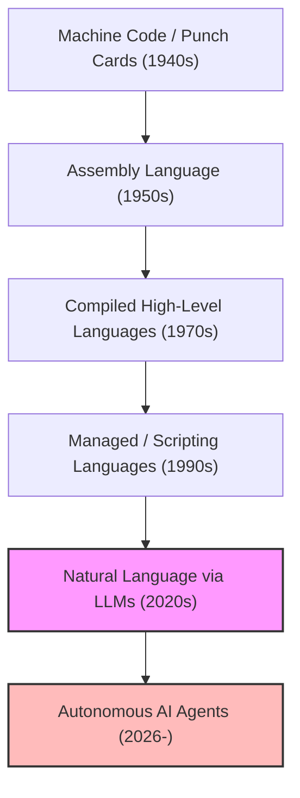
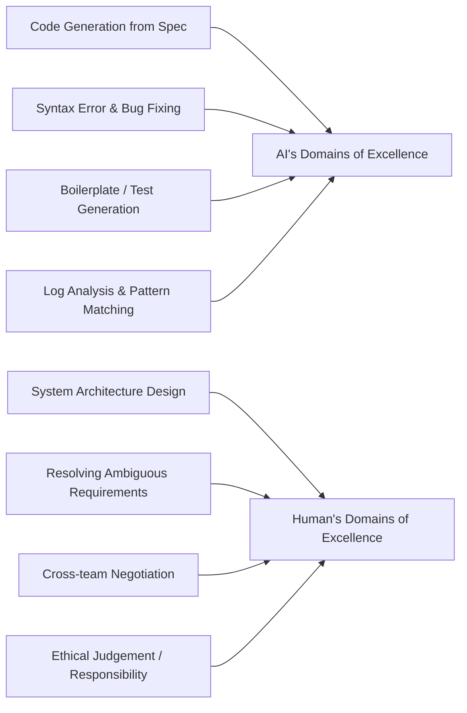
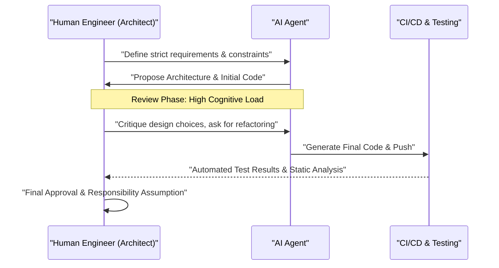

# How Should Programmers Survive in the AI Era? The End of Coding and the Dawn of a New Engineering

As of 2026, the field of software development is undergoing a period of unprecedented and dramatic change. Until just a few years ago, the concept of "AI writing code" was limited to the role of an "auxiliary tool" for programmers, such as generating boilerplate code or auto-completing functions at best. However, due to the astonishing evolution of Large Language Models (LLMs), the situation has been fundamentally overturned. Modern AI is not just a "smart typewriter," but has transformed into an "autonomous junior engineer" capable of autonomously assembling an entire system in an instant, from front-end to back-end logic, database schema design, and even building CI/CD pipelines, given a requirements definition document.

In such an era, how should we "programmers" or "software engineers" survive? As the economic value of the act of "writing code" itself rapidly deflates, a "coder" who merely knows the syntax of a specific programming language and is familiar with the APIs of a specific framework is rapidly being weeded out from the market.

In this article, we will examine the survival strategy for programmers in the AI era in extreme detail from technical, mathematical, and philosophical perspectives. This is not merely a career theory, but a redefinition of the academic discipline of software engineering itself.

---

## 1. The History of Abstraction and the Redefinition of "Programming"

Looking back at the history of software engineering, it is clear that it has always been a history of "Abstraction." We have constantly built layers to describe more complex systems in languages closer to human understanding.

Early computer scientists used punch cards to directly manipulate the physical switches of hardware, giving instructions to computers in machine language (a sequence of 0s and 1s). Later, assembly languages emerged, allowing humans to operate hardware using mnemonics that were easier to understand. As time progressed, high-level languages like C and Fortran appeared, successfully encapsulating complex hardware details such as memory management and CPU registers. With the subsequent emergence of modern languages like Java, Python, Ruby, and TypeScript, programmers could focus more on "What" they wanted the computer to do, rather than "How" to make the computer operate.

The advent of AI (LLMs) is the latest and greatest paradigm shift in this history of abstraction. If the evolution of programming languages was the "hiding of hardware," the evolution of LLMs is the "hiding of syntax."

The era where developers operated pointers while worrying about memory leaks, or wrote hundreds of lines of boilerplate code to parse JSON, is over. Using natural language (such as English or Japanese), the language with the highest level of abstraction for humanity, to define systems has become the standard of "programming" in 2026.

---

## 2. A Mathematical Model of Productivity: Riding the Wave of Exponential Growth

Let's quantitatively evaluate the productivity improvement brought about by AI using a mathematical model.
Individual productivity in traditional software development, $P_{traditional}$, could be modeled as a linear combination of an individual's skill level $S$, domain experience $E$, and tool efficiency $T$.

$$ P_{traditional} = c_1 \cdot S + c_2 \cdot E + c_3 \cdot T $$

However, in modern development utilizing AI, the capability of AI, $A(t)$, acts as a "powerful multiplier (Leverage)" that amplifies human capabilities. Because AI capabilities grow exponentially over time $t$ (an AI version of Moore's Law), productivity in the AI era, $P_{AI}(t)$, can be expressed by the following equation:

$$ P_{AI}(t) = \alpha \cdot S_{core} \cdot e^{\beta \cdot A(t)} $$

Here, each variable means the following:
*   $\alpha$: The baseline human productivity coefficient
*   $S_{core}$: "Core human skills" that cannot be replaced by AI (architecture design, understanding business requirements, ethical judgment, etc.)
*   $A(t)$: The absolute capability of the AI model at time $t$ (number of parameters, context window, reasoning ability)
*   $\beta$: A coefficient indicating how effectively AI tools can be utilized (the quality of prompt engineering and the refinement of collaborative workflows with AI)

The important insight derived from this formula is that **in a world where $A(t)$ increases exponentially, traditional skills such as mere typing speed or memorization of a specific language have extremely little impact on overall productivity.** Instead, the coefficient $\beta$ to multiply the exponential growth of AI, and $S_{core}$, which is the domain that AI cannot cover, become the dominant factors determining an engineer's market value.

---

## 3. Probability of Automation

So, what kind of tasks will be automated, and what tasks will remain in human hands?
The probability that a certain task $T$ will be completely automated by AI, $P_{auto}(T)$, can be formulated as follows:

$$ P_{auto}(T) = 1 - \exp\left(-\lambda \cdot \frac{\text{Predictability}(T)}{\text{Complexity}(T) \times \text{Context Dependency}(T)}\right) $$

*   $\text{Predictability}(T)$: The predictability of the task (how much of a pattern exists in past data)
*   $\text{Complexity}(T)$: The complexity of the task
*   $\text{Context Dependency}(T)$: The strength of "implicit context (domain-specific knowledge or human relationships)" that the task depends on
*   $\lambda$: The rate of technological advancement of AI

Tasks with high predictability and low context dependency, such as writing API routing logic or creating a simple CRUD screen, will have $P_{auto} \approx 1$ and be almost completely automated. On the other hand, tasks with extremely high context dependency, such as "how to safely integrate a new microservice with an existing legacy system" or "how to design an authentication flow that satisfies the legal department's requirements without compromising the user experience," are difficult to automate.

---

## 4. Return from Syntax to Architecture (Structure)

Clearly separating what AI is good at and what humans are good at is an absolute condition for survival.

AI surpasses humans in "local optimization." There is no way humans can compete with the speed and accuracy of writing a single function, a single class, or a single module. However, AI is extremely vulnerable to "global optimization" and "Missing Context."

Future programmers must change their roles from "workers who write code" to "architects who orchestrate the countless components generated by AI." Having a bird's-eye view of the entire system, where to draw microservice boundaries, how to resolve the trade-off between availability and consistency in the CAP theorem according to the business context, and how to control technical debt. These are highly intellectual tasks that can only be done by humans who understand the big picture and business goals.

---

## 5. Requirements Engineering is the "True Prompt Engineering"

The term "prompt engineering," which we hear a lot lately, is often misunderstood as a "hack to trick AI into getting the desired output." However, the essence of prompt engineering in software development is undeniably **"advanced Requirements Engineering."**

In order to give instructions to AI in natural language and have it output the intended software, the following elements must be strictly verbalized:

1.  **Purpose (Why)**: Why is this feature needed? What is the business value?
2.  **Constraints**: Performance requirements (latency, throughput), security requirements, cost constraints.
3.  **Edge Cases**: Fallback processing when the user provides unexpected input.
4.  **Interfaces**: Integration specifications with existing systems.

Vague instructions (prompts) can only produce vague and fragile systems. The ability to deeply interview "what the customer really wanted," sort out conflicting requirements, and create a logically sound specification document (prompt). This is the ultimate "coding skill" in the AI era. Programmers will spend more time facing Notion or Markdown files instead of code editors, elaborately describing what a system should look like in text.

---

## 6. The Overwhelming Advantage of Domain Knowledge

Because AI has trained on open-source code and public documents from around the world, it is well-versed in general web technologies and algorithms. However, there is data that AI cannot access. That is "your company's unique business rules" and "domain knowledge deeply rooted in a specific industry (medical, financial, manufacturing, etc.)."

For example, suppose you are developing an electronic medical record system at a medical startup. AI knows "how to create a tabular UI in React" and the "general data structure of HL7 FHIR." However, it has not learned the tacit knowledge of "in what order doctors at a specific department of Hospital A view patient data, and what kind of UI can minimize the risk of medical errors."

In a world where technology itself becomes commoditized (general-purpose), the true value of an engineer is born at the intersection of "technology" and "business domain." Rather than competing on technical skills alone, the market will be driven by those who possess deep expertise in a specific domain—such as medical, financial, logistics, or entertainment—and can solve the challenges of that domain using the powerful tool of AI.

---

## 7. The "Trolley Problem" of Software Development: Who Takes Responsibility?

As reliance on AI increases, we face serious philosophical and ethical issues. This is the problem of "where responsibility lies" in software engineering.

If the code autonomously generated by AI causes a serious bug in a production environment, resulting in hundreds of millions of yen in losses for a company, or causes a malfunction in a life-critical medical system, who will take the responsibility? The company that developed the AI model? Or the engineer who input the prompt? You cannot "fire" or "arrest" AI.

The role of "human" as the entity that assumes "Accountability (legal and ethical responsibility)" for the impact a system has on society will never disappear, no matter how much technology advances. Rather, as the code generation process becomes more black-boxed, humans will bear a heavier responsibility as the "Approver" and "Supervisor" of the system.

Auditing whether the architecture or code proposed by AI meets security standards, whether there are ethical issues (e.g., whether it contains bias), and whether it complies with regulations, and then giving the final GO sign. This act of "taking responsibility" itself will become an important part of an engineer's job.

---

## 8. AI Pair Programming and Cognitive Load Management

When working alongside AI, the nature of human "Cognitive Load" is also changing. The cognitive load of writing code from scratch is completely different from the cognitive load of "reading and reviewing" hundreds of lines of unknown code generated by AI.

According to cognitive load theory in psychology, human working memory is quickly depleted when processing complex information that does not match existing schemas (knowledge structures in the brain). While the code generated by AI sometimes contains advanced optimizations that humans might not think of, it can also contain "hallucinations" that ignore the context.

To prevent this, it is necessary to systematize the review process for AI.

More than the skill of "writing," humans need to push their skills of "Code Reading & Auditing (reading quickly and instantly spotting logical flaws)" to the limit. The importance of Test-Driven Development (TDD) has increased even further in the AI era. Before letting AI write code, the mainstream approach will be for a human or another AI to write strict test code, and then have AI modify the code until it passes those tests.

---

## 9. Concrete Survival Strategy: What You Should Learn Starting Tomorrow

Based on the analysis so far, here is a concrete action plan for programmers to survive in the AI era.

1.  **Thoroughly Relearn the "Fundamentals" of Technology**: You can leave the usage of frameworks to AI. However, a deep understanding of how OS works, network protocols (TCP/IP, HTTP/3), internal database structures (B-Tree, transaction isolation levels), and data structures and algorithms is absolutely necessary. To judge whether AI's output is correct, a solid foundation in computer science is indispensable.
2.  **Master Cloud Architecture and Distributed Systems**: Focus on how to combine cloud resources like AWS, GCP, and Azure to build scalable systems, rather than individual pieces of code. Understand the concept of IaC (Infrastructure as Code) such as Terraform, and cultivate the ability to design an entire system as code.
3.  **Become an Expert in a Business Domain**: Deeply study the business models, legal regulations, and behavioral psychology of the users in the industry you belong to. Go beyond the boundaries of an engineer and acquire a perspective closer to that of a Product Manager (PM).
4.  **Polish Communication and Facilitation Skills**: The process of resolving the "ambiguity" between humans and building consensus cannot be replaced by AI. Soft skills to communicate with stakeholders and discover real issues will become the most valuable skills.
5.  **Use AI to the Fullest as a "Colleague"**: Do not fear the evolution of AI tools, but utilize them as your most powerful weapons. Use the latest LLMs and AI coding agents on a daily basis to accumulate the "tacit knowledge" of where AI fails and how to tweak prompts to draw out the best performance.

---

## Conclusion: Do Not Fear, Ride the Wave

The automation of programming by AI does not mean the "death" of the programmer profession. Rather, it is a **"Renaissance"** that liberates us from the "non-essential labor" in software development, such as fixing typos, troubleshooting environment setups, and writing boring boilerplate.

Historically, when automated looms appeared, and when spreadsheet software (Excel) appeared, pessimism about jobs disappearing was rampant. However, the reality is that the dramatic increase in productivity created new demands, and more advanced jobs were born. The same thing will happen in the software world. By making it possible to "build systems cheaply," software will penetrate into every area that had not been IT-enabled before due to cost constraints, and the problems (What) that engineers should solve will expand infinitely.

We programmers are now given the chance to evolve from craftsmen who write code to "orchestra conductors" who direct the mighty intelligence of AI. Instead of staying on the shore out of fear of the technological wave, let's ride that wave early and set sail on a journey to create larger, more valuable systems. The AI era is the era when "engineering" in the truest sense begins.
