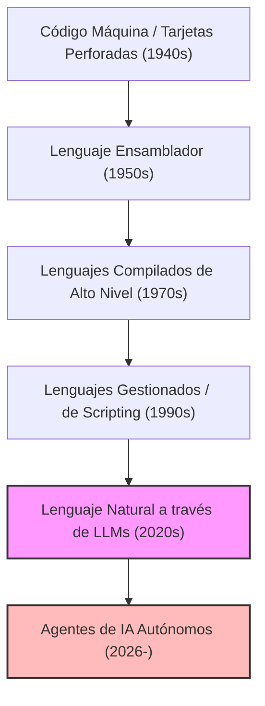
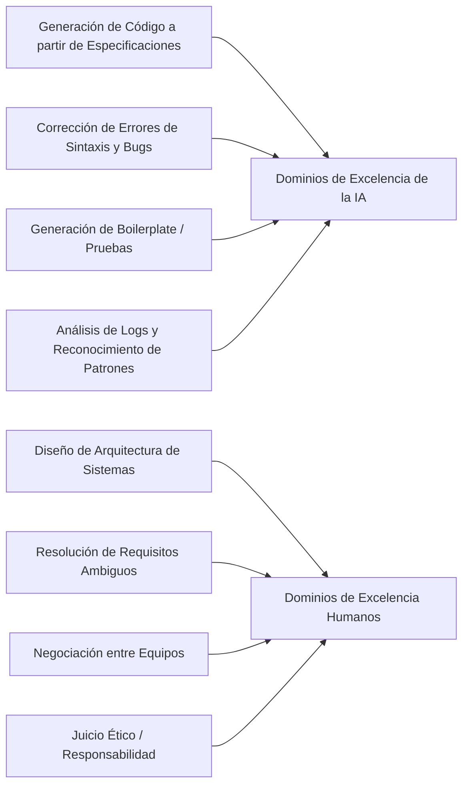
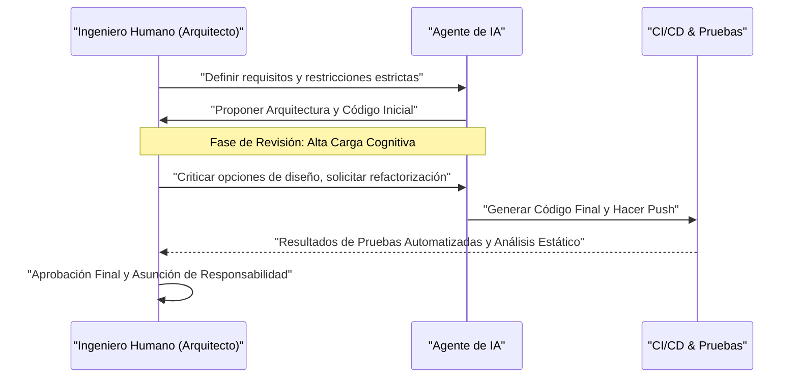

# ¿Cómo deberían sobrevivir los programadores en la era de la IA? El fin de la codificación y el amanecer de una nueva ingeniería

En la actualidad, en 2026, el campo del desarrollo de software se encuentra en un período de cambio sin precedentes. Hasta hace unos pocos años, el concepto de "la IA escribe código" se limitaba a su papel como "herramienta auxiliar" para los programadores, como la generación de código boilerplate (código repetitivo) y el autocompletado de funciones en el mejor de los casos. Sin embargo, con la asombrosa evolución de los grandes modelos de lenguaje (LLM), la situación ha dado un vuelco radical. La IA moderna no es simplemente una "máquina de escribir inteligente", sino que se ha transformado en un "ingeniero junior autónomo" con la capacidad de ensamblar instantánea y autónomamente sistemas completos, desde el frontend hasta la lógica del backend, el diseño del esquema de la base de datos e incluso la construcción de pipelines de CI/CD, con solo proporcionarle un documento de definición de requisitos.

En una era así, ¿cómo deberíamos sobrevivir nosotros los "programadores" e "ingenieros de software"? A medida que el valor económico del acto mismo de "escribir código" se deflacta rápidamente, los "codificadores" que simplemente conocen la sintaxis (gramática) de un lenguaje de programación específico y están familiarizados con las API de un framework en particular están siendo rápidamente eliminados del mercado.

En este artículo, analizaremos con extremo detalle las estrategias de supervivencia para los programadores en la era de la IA desde perspectivas técnicas, matemáticas y filosóficas. Esto no es solo una teoría sobre la carrera profesional, sino una redefinición de la disciplina de la ingeniería de software en sí misma.

---

## 1. La historia de la abstracción (Abstraction) y la redefinición de la "programación"

Al repasar la historia de la ingeniería de software, nos damos cuenta de que siempre ha sido una historia de "abstracción (Abstraction)". Siempre hemos construido capas para describir sistemas más complejos en un lenguaje más cercano al humano.

Los primeros científicos de la computación utilizaban tarjetas perforadas para manipular directamente los interruptores del hardware físico, dando instrucciones a las computadoras en código máquina (secuencias de 0 y 1). Más tarde, apareció el lenguaje ensamblador, que permitió operar el hardware con mnemónicos que los humanos podían entender fácilmente. A medida que avanzaba la época, surgieron lenguajes de alto nivel como C y Fortran, que lograron encapsular los detalles complejos del hardware, como la gestión de memoria y los registros de la CPU. Posteriormente, con los lenguajes modernos que aparecieron, como Java, Python, Ruby y TypeScript, los programadores pudieron concentrarse más en "qué queremos que haga la computadora (What)" en lugar de en "cómo hacer que la computadora funcione (How)".

La aparición de la IA (LLM) es el cambio de paradigma más reciente y más grande en esta historia de abstracción. Si la evolución de los lenguajes de programación fue la "ocultación del hardware", la evolución de los LLM es la "ocultación de la sintaxis (gramática)".

La era en la que los desarrolladores manipulaban punteros preocupándose por las fugas de memoria o escribían cientos de líneas de código repetitivo para el procesamiento de análisis de JSON ha terminado. El estándar de "programación" en 2026 es definir sistemas utilizando el lenguaje natural (japonés, inglés, español, etc.), el lenguaje con el nivel más alto de abstracción para la humanidad.

---

## 2. Modelo matemático de la productividad: Surfeando la ola del crecimiento exponencial

Evaluemos cuantitativamente el aumento de productividad que aporta la IA utilizando un modelo matemático.
La productividad individual $P_{traditional}$ en el desarrollo de software tradicional podría modelarse como una combinación lineal del nivel de habilidad individual $S$, la experiencia en el dominio $E$ y la eficiencia de las herramientas $T$.

$$ P_{traditional} = c_1 \cdot S + c_2 \cdot E + c_3 \cdot T $$

Sin embargo, en el desarrollo moderno impulsado por IA, la capacidad de la IA $A(t)$ actúa como un "poderoso multiplicador (Multiplier)" que amplifica la capacidad humana. Dado que las capacidades de la IA crecen exponencialmente (la versión de IA de la Ley de Moore) a lo largo del tiempo $t$, la productividad en la era de la IA $P_{AI}(t)$ se puede expresar mediante la siguiente ecuación:

$$ P_{AI}(t) = \alpha \cdot S_{core} \cdot e^{\beta \cdot A(t)} $$

Aquí, cada variable significa lo siguiente:
*   $\alpha$: Coeficiente base de productividad humana
*   $S_{core}$: Las "habilidades centrales humanas" no reemplazables por la IA (diseño de arquitectura, comprensión de requisitos de negocio, juicio ético, etc.)
*   $A(t)$: Capacidad absoluta de los modelos de IA (recuento de parámetros, ventana de contexto, capacidad de razonamiento) en el momento $t$
*   $\beta$: Coeficiente que indica la eficacia con la que se pueden aprovechar las herramientas de IA (calidad de la ingeniería de prompts o sofisticación de los flujos de trabajo colaborativos con la IA)

La visión clave derivada de esta fórmula es que **en un mundo donde $A(t)$ aumenta exponencialmente, el impacto de las habilidades tradicionales, como la velocidad de escritura pura o la memorización de un lenguaje específico, en la productividad general se vuelve minúsculo**. En cambio, el coeficiente $\beta$ para aprovechar el crecimiento exponencial de la IA, y $S_{core}$, el área que la IA no puede cubrir, se convierten en los factores dominantes que determinan el valor de mercado de un ingeniero.

---

## 3. Probabilidad de automatización de tareas (Probability of Automation)

Entonces, ¿qué tipo de tareas se automatizarán y qué tipo de tareas quedarán en manos de los humanos?
La probabilidad $P_{auto}(T)$ de que una tarea determinada $T$ sea completamente automatizada por IA se puede formular de la siguiente manera:

$$ P_{auto}(T) = 1 - \exp\left(-\lambda \cdot \frac{\text{Predictability}(T)}{\text{Complexity}(T) \times \text{Context Dependency}(T)}\right) $$

*   $\text{Predictability}(T)$: Previsibilidad de la tarea (cuántos patrones existen en los datos históricos)
*   $\text{Complexity}(T)$: Complejidad de la tarea
*   $\text{Context Dependency}(T)$: La fuerza del "contexto implícito (conocimiento específico del dominio o relaciones humanas)" del que depende la tarea
*   $\lambda$: Tasa de progreso tecnológico de la IA

Las tareas que son altamente predecibles y poco dependientes del contexto, como escribir el procesamiento de enrutamiento de una API o crear una pantalla CRUD simple, tienen un $P_{auto} \approx 1$ y estarán casi completamente automatizadas. Por otro lado, las tareas con una dependencia del contexto extremadamente alta, como "¿cómo integramos de manera segura los sistemas heredados existentes con los nuevos microservicios?" o "¿cómo diseñamos un flujo de autenticación que satisfaga las demandas del departamento legal sin comprometer la experiencia del usuario?", son difíciles de automatizar.

---

## 4. Retorno de la sintaxis (gramática) a la arquitectura (estructura)

Separar claramente en qué es buena la IA y en qué son buenos los humanos es un requisito absoluto para la supervivencia.

La IA supera a los humanos en la "optimización local". Los humanos no tienen ninguna posibilidad contra la velocidad y precisión con la que se escribe una sola función, una sola clase o un solo módulo. Sin embargo, la IA es muy vulnerable a la "optimización global" y al "contexto faltante (Missing Context)".

Los programadores del futuro deben cambiar su papel de "trabajadores que escriben código" a "arquitectos que orquestan innumerables componentes generados por IA". Tener una visión general del sistema completo, dónde trazar los límites de los microservicios, cómo resolver el compromiso entre disponibilidad y consistencia en el Teorema CAP para adaptarlo al contexto del negocio, y cómo controlar la deuda técnica. Estos son trabajos intelectuales de alto nivel que solo pueden ser realizados por humanos que comprenden el panorama general y los objetivos del negocio.

---

## 5. La definición de requisitos es la "verdadera ingeniería de prompts"

El término "ingeniería de prompts", que escuchamos a menudo últimamente, se malinterpreta con frecuencia como "un truco para engañar a la IA y obtener el resultado deseado". Sin embargo, la esencia de la ingeniería de prompts en el desarrollo de software es, sin lugar a dudas, **la "ingeniería de requisitos avanzada (Requirements Engineering)"**.

Para dar instrucciones a la IA en lenguaje natural y hacer que genere el software deseado, los siguientes elementos deben ser estrictamente articulados:

1.  **Propósito (Why)**: ¿Por qué se necesita esta característica? ¿Cuál es el valor empresarial?
2.  **Restricciones (Constraints)**: Requisitos de rendimiento (latencia, rendimiento), requisitos de seguridad, restricciones de costos.
3.  **Casos Extremos (Edge Cases)**: Procesamiento alternativo (fallback) para cuando el usuario proporciona una entrada inesperada.
4.  **Interfaces (Interfaces)**: Especificaciones de integración con los sistemas existentes.

Las instrucciones vagas (prompts) solo generarán sistemas vagos y frágiles. La capacidad de escuchar profundamente para descubrir "lo que el cliente realmente quería", organizar requisitos contradictorios y crear especificaciones lógicamente consistentes (prompts). Esta es la "habilidad de codificación" más poderosa en la era de la IA. Los programadores pasarán cada vez más tiempo enfrentándose a archivos de Notion o Markdown en lugar de editores de código, describiendo con precisión cómo debería ser el sistema mediante texto.

---

## 6. La ventaja abrumadora del conocimiento del dominio (Domain Knowledge)

Dado que la IA se ha entrenado en código fuente abierto y documentos públicos de todo el mundo, está bien versada en tecnologías y algoritmos web generales. Sin embargo, hay datos a los que la IA no puede acceder. Esas son las "reglas de negocio específicas de tu empresa" y el "conocimiento del dominio profundamente arraigado en una industria específica (médica, financiera, manufacturera, etc.)".

Por ejemplo, supongamos que estás desarrollando un sistema de historia clínica electrónica en una startup médica. La IA sabe "cómo crear una interfaz de usuario tabular en React" y "la estructura de datos general de HL7 FHIR". Sin embargo, no ha aprendido el conocimiento tácito de "en un departamento médico específico del Hospital A, en qué orden ven los médicos los datos de los pacientes, y qué tipo de interfaz de usuario minimizaría el riesgo de errores médicos".

En un mundo donde la tecnología misma se mercantiliza (se convierte en un bien de consumo común), el verdadero valor de los ingenieros nace en la intersección de la "tecnología" y el "dominio de negocio". En lugar de competir solo con la destreza técnica, los individuos que posean una profunda experiencia en un dominio específico, como la medicina, las finanzas, la logística o el entretenimiento, y que puedan resolver los problemas de ese dominio utilizando la poderosa herramienta de la IA, liderarán el mercado del futuro.

---

## 7. El "Problema del Tranvía" en el desarrollo de software: ¿Quién asume la responsabilidad?

A medida que aumenta nuestra dependencia de la IA, nos enfrentamos a graves problemas filosóficos y éticos. Este es el problema de "dónde recae la responsabilidad" en la ingeniería de software.

Si el código generado de forma autónoma por la IA causa un error grave en un entorno de producción, lo que resulta en millones de dólares en pérdidas para una empresa, o si causa un mal funcionamiento en un sistema médico que afecta vidas humanas, ¿quién asume la responsabilidad? ¿La empresa que desarrolló el modelo de IA? ¿O el ingeniero que ingresó el prompt? No se puede "despedir" ni "arrestar" a la IA.

No importa cuánto avance la tecnología, el papel de los "humanos" como el sujeto que asume la "responsabilidad legal y ética (Accountability)" por el impacto que los sistemas tienen en la sociedad no desaparecerá. De hecho, cuanto más se convierta el proceso de generación de código en una caja negra, mayor será la pesada responsabilidad de los humanos como "aprobadores finales (Approvers)" y "supervisores (Supervisors)" de los sistemas.

Auditar si la arquitectura y el código propuestos por la IA cumplen con los estándares de seguridad, no tienen problemas éticos (están libres de sesgos) y cumplen con las normativas, y luego dar la luz verde final. El acto de "asumir la responsabilidad" en sí mismo se convierte en una parte importante del trabajo del ingeniero.

---

## 8. Programación en parejas con IA y gestión de la carga cognitiva (Cognitive Load)

A medida que trabajamos junto a la IA, la naturaleza de la "carga cognitiva (Cognitive Load)" humana también está cambiando. La carga cognitiva al escribir código desde cero es completamente diferente de la carga cognitiva al "leer y revisar" cientos de líneas de código desconocido generado por la IA.

Según la teoría de la carga cognitiva en psicología, cuando se procesa información compleja que no coincide con los esquemas existentes (estructuras de conocimiento en la mente), la memoria de trabajo humana se agota rápidamente. El código generado por IA a veces contiene optimizaciones avanzadas que a un humano no se le ocurrirían, mientras que otras veces contiene "alucinaciones (hallucinations)" que ignoran el contexto.

Para evitar esto, es necesario sistematizar el proceso de revisión de la IA.

Los humanos necesitan perfeccionar al máximo la habilidad de "lectura rápida y detección instantánea de fallas lógicas (Code Reading & Auditing)" incluso más que la habilidad de "escribir". La importancia del Desarrollo Guiado por Pruebas (TDD) es aún mayor en la era de la IA. El enfoque principal será que un humano u otra IA escriba código de prueba estricto antes de dejar que la IA escriba el código, y luego haga que la IA corrija el código hasta que pase las pruebas.

---

## 9. Estrategia de supervivencia concreta: Qué aprender a partir de mañana

Basado en el análisis realizado hasta ahora, presento un plan de acción concreto para que los programadores sobrevivan a la era de la IA.

1.  **Reaprender a fondo los "fundamentos" de la tecnología**: Puedes dejar cómo usar frameworks a la IA. Sin embargo, un profundo conocimiento de cómo funcionan los sistemas operativos, los protocolos de red (TCP/IP, HTTP/3), la estructura interna de las bases de datos (B-Tree, niveles de aislamiento de transacciones), las estructuras de datos y algoritmos es absolutamente necesario. Para juzgar si el resultado de la IA es correcto, es indispensable una base sólida en ciencias de la computación.
2.  **Dominar la arquitectura en la nube y los sistemas distribuidos**: Concéntrate en cómo combinar recursos en la nube como AWS, GCP y Azure para construir sistemas escalables, en lugar de código individual. Comprende el concepto de IaC (Infrastructure as Code) como Terraform y cultiva la capacidad de diseñar todo el sistema como código.
3.  **Conviértete en un experto en tu dominio de negocio**: Aprende profundamente el modelo de negocio, las regulaciones legales y la psicología del comportamiento del usuario de la industria a la que perteneces. Ve más allá de los límites de un ingeniero y ten una perspectiva más cercana a la de un Product Manager (PM).
4.  **Perfecciona las habilidades de comunicación y facilitación**: El proceso de resolver la "ambigüedad" entre humanos y lograr consensos no puede ser reemplazado por la IA. Las habilidades blandas de interactuar con las partes interesadas y descubrir los verdaderos problemas serán las habilidades más valiosas.
5.  **Usa la IA al máximo como un "colega"**: En lugar de temer a la evolución de las herramientas de IA, utilízalas como tu arma más poderosa. Utiliza rutinariamente los últimos LLMs y agentes de codificación de IA para acumular el "conocimiento tácito" de dónde falla la IA y cómo ajustar los prompts para extraer el máximo rendimiento.

---

## Conclusión: No temas, surfea la ola

La automatización de la programación por parte de la IA no significa la "muerte" de la profesión de programador. Más bien, es un **"Renacimiento"** que nos libera del "trabajo no esencial" en el desarrollo de software, como la corrección de errores tipográficos, la solución de problemas de configuración del entorno y la escritura de aburrido código repetitivo (boilerplate).

A lo largo de la historia, cuando apareció el telar automático o cuando apareció el software de hojas de cálculo (Excel), se extendió el pesimismo de que los trabajos desaparecerían. Sin embargo, la realidad es que a medida que la productividad mejoró drásticamente, se creó nueva demanda y nacieron trabajos más sofisticados. Lo mismo sucederá en el mundo del software. A medida que se vuelva posible "construir sistemas a bajo costo", el software penetrará en todas las áreas que antes no estaban informatizadas debido a los altos costos, y los problemas (What) que los ingenieros tendrán que resolver se expandirán infinitamente.

A nosotros, los programadores, se nos da ahora la oportunidad de evolucionar de artesanos que escriben código a "directores de orquesta" que comandan la poderosa inteligencia de la IA. En lugar de quedarnos en la orilla temerosos de la ola tecnológica, vamos a montarla rápidamente y zarpar hacia un viaje para crear sistemas más grandes y valiosos. La era de la IA es exactamente la era en la que comienza la "ingeniería" en su verdadero sentido.
