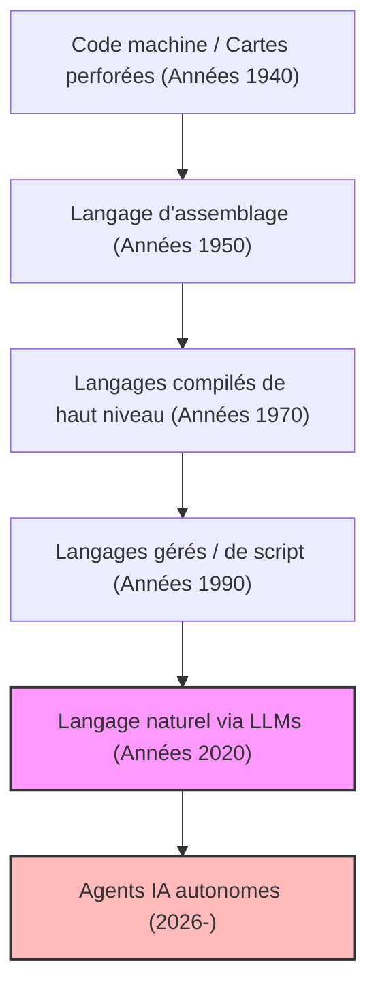
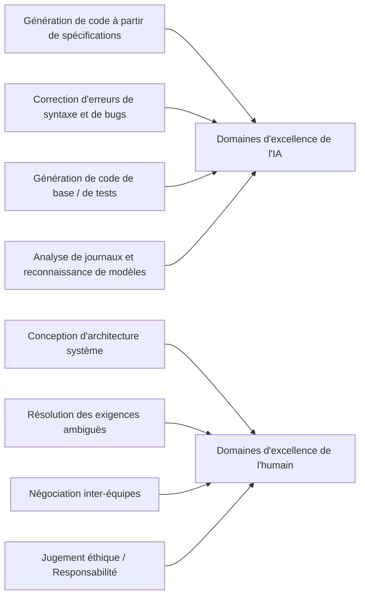
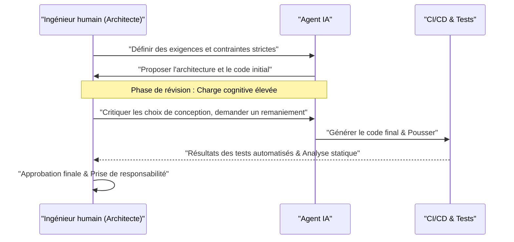

# Comment les programmeurs devraient-ils survivre à l’ère de l'IA ? La fin du codage et l'aube d'une nouvelle ingénierie

En 2026, le domaine du développement logiciel traverse une période de bouleversements sans précédent. Il y a quelques années à peine, le concept d'"IA qui écrit du code" se limitait tout au plus à générer du code passe-partout (boilerplate) ou à l'autocomplétion de fonctions, agissant comme un simple "outil d'assistance" pour les programmeurs. Cependant, avec l'évolution phénoménale des grands modèles de langage (LLM), la situation s'est fondamentalement inversée. L'IA moderne n'est plus une simple "machine à écrire intelligente". Si on lui fournit un document de définition des exigences, elle s'est transformée en un "ingénieur junior autonome" capable d'assembler instantanément et de manière autonome l'ensemble d'un système, allant du front-end à la logique back-end, la conception du schéma de la base de données, et même la construction de pipelines CI/CD.

Dans une telle époque, comment nous, "programmeurs" et "ingénieurs logiciels", devons-nous survivre ? Alors que la valeur économique de l'acte même d'"écrire du code" se dégonfle rapidement, les "codeurs" qui ne connaissent que la syntaxe d'un langage de programmation spécifique et maîtrisent l'API d'un framework particulier sont rapidement éliminés du marché.

Dans cet article, nous examinerons en détail les stratégies de survie des programmeurs à l'ère de l'IA sous des angles techniques, mathématiques et philosophiques. Il ne s'agit pas d'une simple théorie de carrière, mais d'une redéfinition de la discipline de l'ingénierie logicielle elle-même.

---

## 1. L'histoire de l'abstraction (Abstraction) et la redéfinition de la "programmation"

Si l'on regarde l'histoire de l'ingénierie logicielle, on se rend compte qu'elle a toujours été l'histoire de l'"abstraction" (Abstraction). Nous avons constamment construit des couches pour décrire des systèmes plus complexes dans un langage plus proche de l'homme.

Les premiers informaticiens manipulaient directement les commutateurs matériels physiques à l'aide de cartes perforées et donnaient des instructions aux ordinateurs en langage machine (une séquence de 0 et de 1). Par la suite, le langage d'assemblage est apparu, permettant de contrôler le matériel avec des mnémoniques facilement compréhensibles par les humains. Au fur et à mesure que l'époque avançait, des langages de haut niveau tels que C et Fortran ont fait leur apparition, réussissant à encapsuler des détails matériels complexes tels que la gestion de la mémoire et les registres du CPU. Par la suite, avec des langages modernes comme Java, Python, Ruby et TypeScript, les programmeurs ont pu se concentrer davantage sur "ce qu'ils veulent que l'ordinateur fasse (What)" plutôt que sur "comment faire fonctionner l'ordinateur (How)".

L'émergence de l'IA (LLM) est le dernier et le plus grand changement de paradigme de cette histoire de l'abstraction. Si l'évolution des langages de programmation était de "masquer le matériel", l'évolution du LLM est de "masquer la syntaxe".

L'époque où les développeurs manipulaient des pointeurs en s'inquiétant des fuites de mémoire ou écrivaient des centaines de lignes de code de base pour analyser du JSON est révolue. Définir des systèmes en utilisant le langage naturel (japonais, anglais, ou français), qui est le langage le plus abstrait pour l'humanité, est devenu le standard de la "programmation" en 2026.

---

## 2. Modèle mathématique de la productivité : Surfer sur la vague de la croissance exponentielle

Évaluons quantitativement l'amélioration de la productivité apportée par l'IA à l'aide d'un modèle mathématique.
La productivité individuelle dans le développement logiciel traditionnel, $P_{traditional}$, pouvait être modélisée comme une combinaison linéaire du niveau de compétence de l'individu $S$, de l'expérience du domaine $E$ et de l'efficacité des outils $T$.

$$ P_{traditional} = c_1 \cdot S + c_2 \cdot E + c_3 \cdot T $$

Cependant, dans le développement moderne utilisant l'IA, la capacité de l'IA $A(t)$ agit comme un "puissant levier" (Multiplier) qui amplifie les capacités humaines. Comme la capacité de l'IA croît de manière exponentielle avec le temps $t$ (la version IA de la loi de Moore), la productivité à l'ère de l'IA $P_{AI}(t)$ peut s'exprimer par l'équation suivante :

$$ P_{AI}(t) = \alpha \cdot S_{core} \cdot e^{\beta \cdot A(t)} $$

Ici, chaque variable signifie ce qui suit :
*   $\alpha$ : Coefficient de productivité humaine de base
*   $S_{core}$ : "Compétences fondamentales humaines" non remplaçables par l'IA (conception d'architecture, compréhension des exigences métier, jugement éthique, etc.)
*   $A(t)$ : Capacité absolue du modèle d'IA au temps $t$ (nombre de paramètres, fenêtre de contexte, capacité de raisonnement)
*   $\beta$ : Coefficient indiquant l'efficacité avec laquelle les outils d'IA peuvent être exploités (qualité de l'ingénierie des prompts et sophistication du flux de travail collaboratif avec l'IA)

La conclusion clé tirée de cette formule est que **dans un monde où $A(t)$ augmente de manière exponentielle, les compétences traditionnelles telles que la simple vitesse de frappe ou la mémorisation d'un langage spécifique ont un impact extrêmement faible sur la productivité globale**. Au lieu de cela, le coefficient $\beta$ pour tirer parti de la croissance exponentielle de l'IA, et $S_{core}$, qui est le domaine que l'IA ne peut pas couvrir, deviennent les facteurs dominants qui déterminent la valeur marchande d'un ingénieur.

---

## 3. Probabilité d'automatisation des tâches (Probability of Automation)

Alors, quelles tâches seront automatisées et quelles tâches resteront entre les mains de l'homme ?
La probabilité $P_{auto}(T)$ qu'une tâche donnée $T$ soit entièrement automatisée par l'IA peut être formulée comme suit :

$$ P_{auto}(T) = 1 - \exp\left(-\lambda \cdot \frac{\text{Predictability}(T)}{\text{Complexity}(T) \times \text{Context Dependency}(T)}\right) $$

*   $\text{Predictability}(T)$ : Prévisibilité de la tâche (dans quelle mesure des modèles existent dans les données passées)
*   $\text{Complexity}(T)$ : Complexité de la tâche
*   $\text{Context Dependency}(T)$ : Force du "contexte implicite" (connaissances spécifiques au domaine ou relations humaines) dont dépend la tâche
*   $\lambda$ : Taux de progrès technologique de l'IA

Les tâches présentant une prévisibilité élevée et une faible dépendance au contexte, telles que l'écriture du routage d'une API ou la création d'un simple écran CRUD, auront $P_{auto} \approx 1$ et seront presque entièrement automatisées. En revanche, les tâches avec une dépendance extrêmement élevée au contexte, telles que "Comment intégrer en toute sécurité des systèmes existants avec de nouveaux microservices" ou "Comment concevoir un flux d'authentification qui satisfait aux exigences du département juridique sans compromettre l'expérience utilisateur", sont difficiles à automatiser.

---

## 4. Retour de la syntaxe à l'architecture (Structure)

Séparer clairement ce en quoi l'IA excelle de ce en quoi les humains excellent est une condition absolue de survie.

L'IA surpasse les humains dans l'"optimisation locale". Les humains n'ont aucune chance de rivaliser en matière de vitesse et de précision pour écrire une fonction, une classe ou un module unique. Cependant, l'IA est très vulnérable face à l'"optimisation globale" et au "contexte manquant" (Missing Context).

Les programmeurs de demain doivent changer de rôle, passant de "travailleurs qui écrivent du code" à "architectes qui orchestrent d'innombrables composants générés par l'IA". Avoir une vue d'ensemble de tout le système, décider où tracer les frontières des microservices, comment résoudre le compromis entre disponibilité et cohérence dans le théorème CAP en fonction du contexte commercial, comment contrôler la dette technique. Il s'agit d'un travail intellectuel de haut niveau que seuls des humains comprenant la vision globale et les objectifs commerciaux peuvent accomplir.

---

## 5. La définition des exigences est la "véritable ingénierie des prompts"

L'expression "ingénierie des prompts" que l'on entend souvent ces derniers temps est souvent confondue avec un "astuce pour tromper l'IA afin d'obtenir la sortie souhaitée". Cependant, l'essence de l'ingénierie des prompts dans le développement logiciel est sans aucun doute **"l'ingénierie avancée des exigences" (Requirements Engineering)**.

Afin de donner des instructions à l'IA en langage naturel et de lui faire produire le logiciel prévu, les éléments suivants doivent être strictement verbalisés :

1.  **Objectif (Why)** : Pourquoi cette fonctionnalité est-elle nécessaire ? Quelle est sa valeur commerciale ?
2.  **Contraintes (Constraints)** : Exigences de performance (latence, débit), exigences de sécurité, contraintes de coût.
3.  **Cas limites (Edge Cases)** : Traitements de secours lorsque l'utilisateur fournit une entrée inattendue.
4.  **Interfaces (Interfaces)** : Spécifications d'intégration avec les systèmes existants.

Des instructions vagues (prompts) ne peuvent donner naissance qu'à des systèmes vagues et fragiles. La capacité à écouter profondément "ce que le client voulait vraiment", à organiser des exigences contradictoires et à créer des spécifications (prompts) sans failles logiques. C'est là la compétence de "codage" la plus puissante à l'ère de l'IA. Les programmeurs passeront de plus en plus de temps face à Notion ou à des fichiers Markdown plutôt qu'à des éditeurs de code, décrivant avec précision ce que devrait être le système sous forme de texte.

---

## 6. L'avantage écrasant de la connaissance du domaine (Domain Knowledge)

L'IA ayant été formée sur des codes open source et des documents publics du monde entier, elle connaît bien les technologies Web et les algorithmes généraux. Cependant, il y a des données auxquelles l'IA n'a pas accès. Ce sont les "règles commerciales spécifiques à votre entreprise" et les "connaissances du domaine profondément enracinées dans un secteur particulier (médical, financier, manufacturier, etc.)".

Par exemple, supposons que vous développiez un système de dossiers médicaux électroniques dans une startup médicale. L'IA sait "comment créer une interface utilisateur de tableau avec React" ou "la structure de données générale de HL7 FHIR". Cependant, elle n'a pas appris les connaissances tacites telles que "Dans un service spécifique de l'hôpital A, dans quel ordre les médecins consultent-ils les données des patients, et quel type d'interface utilisateur minimiserait le risque d'erreur médicale ?".

Dans un monde où la technologie elle-même se banalise (commoditisation), la véritable valeur d'un ingénieur naît à l'intersection de la "technologie" et du "domaine commercial". Ce ne sont pas ceux qui se battent uniquement avec leurs compétences techniques, mais les talents qui possèdent une expertise approfondie dans un domaine spécifique, tel que la médecine, la finance, la logistique ou le divertissement, et qui peuvent résoudre les problèmes de ce domaine à l'aide de l'outil puissant qu'est l'IA, qui dirigeront le marché de demain.

---

## 7. Le "problème du tramway" du développement logiciel : Qui prend la responsabilité ?

À mesure que la dépendance à l'IA augmente, nous sommes confrontés à d'importants problèmes philosophiques et éthiques. C'est la question de la "localisation de la responsabilité" dans l'ingénierie logicielle.

Si un code généré de manière autonome par l'IA provoque un bug grave dans un environnement de production, entraînant des centaines de millions de pertes pour une entreprise, ou s'il provoque un dysfonctionnement dans un système médical qui met des vies en danger, qui en prendra la responsabilité ? L'entreprise qui a développé le modèle d'IA ? Ou l'ingénieur qui a saisi le prompt ? On ne peut pas "licencier" ou "arrêter" une IA.

Le rôle de l'"humain" en tant que sujet assumant la "responsabilité légale et éthique (Accountability)" de l'impact du système sur la société ne disparaîtra pas, peu importe l'avancée de la technologie. Au contraire, plus le processus de génération de code devient une boîte noire, plus l'homme assumera la lourde responsabilité d'"approbateur final (Approver)" et de "superviseur (Supervisor)" du système.

Auditer si l'architecture ou le code proposé par l'IA répond aux normes de sécurité, s'il n'y a pas de problème éthique (s'il n'inclut pas de biais), s'il respecte la conformité, et donner le feu vert final. L'acte même de "prendre la responsabilité" deviendra une partie importante du travail d'un ingénieur.

---

## 8. Programmation en binôme avec l'IA et gestion de la charge cognitive (Cognitive Load)

En travaillant avec l'IA, la nature de la "charge cognitive (Cognitive Load)" humaine évolue également. La charge cognitive lors de l'écriture de code à partir de zéro et la charge cognitive lors de la "lecture et de la révision" de centaines de lignes de code inconnu généré par l'IA sont complètement différentes.

Selon la théorie de la charge cognitive en psychologie, la mémoire de travail humaine s'épuise rapidement lors du traitement d'informations complexes qui ne correspondent pas aux schémas existants (structures de connaissances dans le cerveau). Le code généré par l'IA contient parfois des optimisations très avancées auxquelles les humains ne penseraient pas, mais il peut aussi contenir des "hallucinations" ignorant le contexte.

Pour éviter cela, il est nécessaire de systématiser le processus de révision de l'IA.

L'homme doit perfectionner à l'extrême sa compétence à "lire rapidement et repérer instantanément les défauts logiques (Code Reading & Auditing)", bien plus que sa compétence à "écrire". L'importance du développement piloté par les tests (TDD) s'accroît encore à l'ère de l'IA. Avant de laisser l'IA écrire le code, l'approche dominante sera qu'un humain ou une autre IA écrive d'abord un code de test rigoureux, et oblige l'IA à corriger le code jusqu'à ce qu'il réussisse ce test.

---

## 9. Stratégies de survie spécifiques : Que devrions-nous apprendre dès demain ?

Sur la base de l'analyse qui précède, nous présentons un plan d'action spécifique pour permettre aux programmeurs de survivre à l'ère de l'IA.

1.  **Réapprendre minutieusement les "bases" de la technologie** : On peut laisser à l'IA le soin de savoir comment utiliser les frameworks. Cependant, une compréhension approfondie du fonctionnement des systèmes d'exploitation, des protocoles réseau (TCP/IP, HTTP/3), de la structure interne des bases de données (B-Tree, niveaux d'isolement des transactions), des structures de données et des algorithmes est absolument nécessaire. Des bases solides en informatique sont indispensables pour juger si la sortie de l'IA est correcte.
2.  **Maîtriser l'architecture cloud et les systèmes distribués** : Plutôt que de se concentrer sur des codes individuels, il faut se concentrer sur la manière de combiner les ressources cloud telles qu'AWS, GCP et Azure pour construire des systèmes évolutifs. Comprendre les concepts d'IaC (Infrastructure as Code) tels que Terraform, et cultiver la capacité de concevoir des systèmes entiers sous forme de code.
3.  **Devenir un expert du domaine d'activité** : Apprendre profondément le modèle commercial, les réglementations légales et la psychologie comportementale des utilisateurs du secteur auquel on appartient. Dépasser le cadre d'un ingénieur et adopter une perspective proche de celle d'un chef de produit (PM).
4.  **Affiner ses compétences en communication et en facilitation** : Le processus de résolution de l'"ambiguïté" entre les humains et de formation d'un consensus ne peut être remplacé par l'IA. Les compétences interpersonnelles pour dialoguer avec les parties prenantes et découvrir les véritables problèmes deviendront les compétences les plus précieuses.
5.  **Utiliser pleinement l'IA comme un "collègue"** : Au lieu de craindre l'évolution des outils d'IA, les utiliser comme l'arme la plus puissante. Utiliser quotidiennement les LLM les plus récents et les agents de codage de l'IA, et accumuler des "connaissances tacites" sur les endroits où l'IA échoue et comment ajuster les prompts pour en tirer les meilleures performances.

---

## Conclusion : N'ayez pas peur, surfez sur la vague

L'automatisation de la programmation par l'IA ne signifie pas la "mort" du métier de programmeur. C'est plutôt une **"Renaissance"** qui nous libère du "travail non essentiel" dans le développement logiciel, comme la correction de fautes de frappe, la résolution de problèmes de configuration d'environnement ou l'écriture de code de base fastidieux.

Au cours de l'histoire, que ce soit lors de l'apparition des métiers à tisser automatiques ou des tableurs (Excel), le pessimisme quant à la disparition des emplois a toujours été répandu. Cependant, la réalité est qu'une amélioration spectaculaire de la productivité a créé de nouvelles demandes, donnant naissance à des emplois plus avancés. La même chose se produira dans le monde du logiciel. Le fait de pouvoir "créer des systèmes à bas prix" permettra aux logiciels de pénétrer tous les domaines qui n'avaient pas encore été informatisés en raison des coûts, et les problèmes que les ingénieurs devront résoudre (What) s'étendront à l'infini.

Aujourd'hui, nous, programmeurs, avons l'opportunité d'évoluer, passant du statut d'artisan écrivant du code à celui de "chef d'orchestre" dirigeant l'intelligence colossale qu'est l'IA. Au lieu de rester sur le rivage par peur de la vague technologique, surfons sur cette vague le plus tôt possible, et embarquons pour un voyage visant à créer des systèmes plus grands et plus précieux. L'ère de l'IA est véritablement l'ère où commence la véritable "ingénierie".
