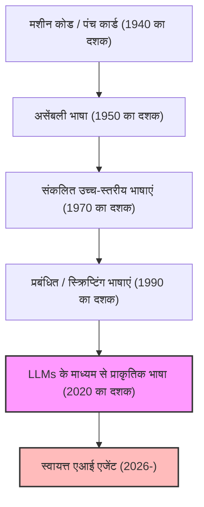
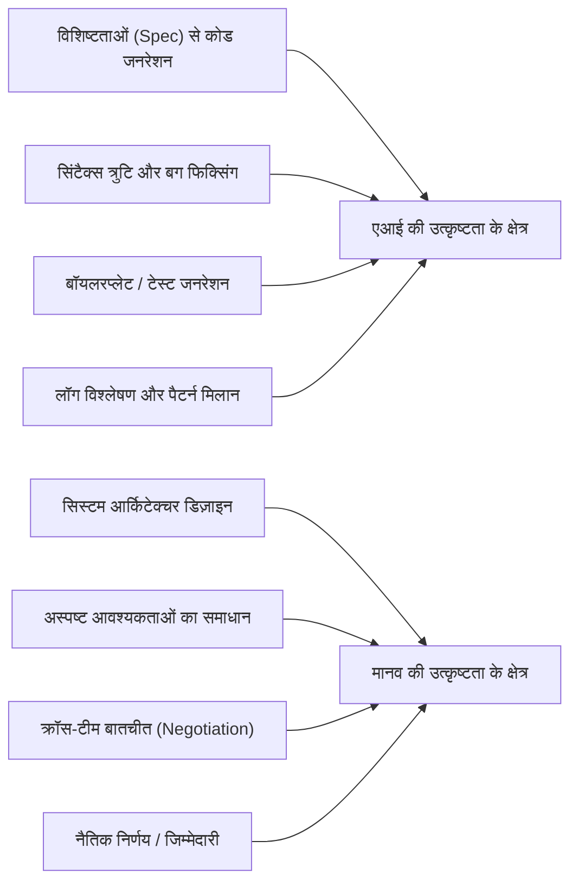
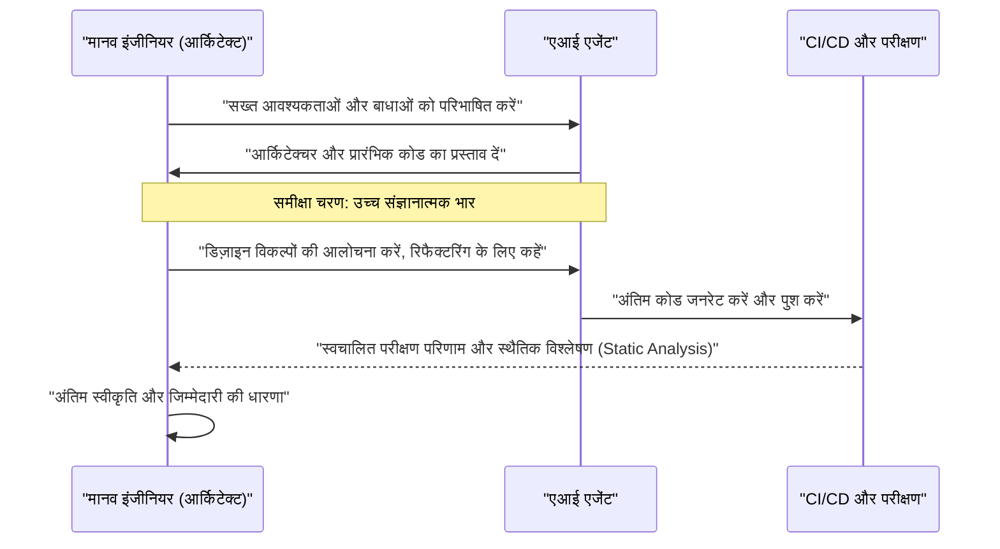

# एआई युग में प्रोग्रामर कैसे जीवित रहें? कोडिंग का अंत और एक नई इंजीनियरिंग की शुरुआत

2026 तक, सॉफ्टवेयर विकास का क्षेत्र एक अभूतपूर्व उथल-पुथल के दौर से गुजर रहा है। कुछ साल पहले तक, "एआई द्वारा कोड लिखना" की अवधारणा केवल बॉयलरप्लेट (मानक कोड) उत्पन्न करने और फ़ंक्शन स्वतः-पूर्णता जैसे प्रोग्रामर के लिए "सहायक उपकरण" की भूमिका तक सीमित थी। हालाँकि, लार्ज लैंग्वेज मॉडल (LLM) के उल्लेखनीय विकास ने स्थिति को पूरी तरह से बदल दिया है। आधुनिक एआई केवल एक "स्मार्ट टाइपराइटर" नहीं है; यह एक "स्वायत्त जूनियर इंजीनियर" में बदल गया है, जिसके पास आवश्यकताओं का दस्तावेज़ दिए जाने पर फ्रंटएंड से लेकर बैकएंड लॉजिक, डेटाबेस स्कीमा डिज़ाइन और यहां तक कि CI/CD पाइपलाइन बनाने तक पूरे सिस्टम को तुरंत और स्वायत्त रूप से बनाने की क्षमता है।

ऐसे युग में, हम "प्रोग्रामर" और "सॉफ्टवेयर इंजीनियरों" को कैसे जीवित रहना चाहिए? चूँकि "कोड लिखने" के कार्य का आर्थिक मूल्य तेज़ी से घट रहा है, केवल "कोडर" जो किसी विशिष्ट प्रोग्रामिंग भाषा के सिंटैक्स (व्याकरण) को जानते हैं और किसी विशिष्ट फ्रेमवर्क के एपीआई (API) से परिचित हैं, उन्हें बाज़ार से तेज़ी से बाहर किया जा रहा है।

इस लेख में, हम एआई युग में प्रोग्रामर की उत्तरजीविता रणनीतियों की तकनीकी, गणितीय और दार्शनिक दृष्टिकोण से अत्यंत विस्तार से जांच करेंगे। यह केवल एक करियर सिद्धांत नहीं है, बल्कि सॉफ्टवेयर इंजीनियरिंग के अनुशासन की ही एक नई परिभाषा है।

---

## 1. अमूर्तता (Abstraction) का इतिहास और "प्रोग्रामिंग" की नई परिभाषा

सॉफ्टवेयर इंजीनियरिंग के इतिहास पर नज़र डालने से पता चलता है कि यह हमेशा "अमूर्तता (Abstraction)" का इतिहास रहा है। हमने हमेशा अधिक मानव-समान भाषाओं के साथ अधिक जटिल प्रणालियों का वर्णन करने के लिए परतें (layers) बनाई हैं।

शुरुआती कंप्यूटर वैज्ञानिकों ने पंच कार्डों का उपयोग करके भौतिक हार्डवेयर स्विच को सीधे संचालित किया और मशीन भाषा (0 और 1 की श्रृंखला) में कंप्यूटर को निर्देश दिए। बाद में, असेंबली भाषाएं (Assembly languages) आईं, जिससे मनुष्यों के लिए आसानी से समझ में आने वाले निमोनिक्स के साथ हार्डवेयर को संचालित करना संभव हो गया। जैसे-जैसे समय आगे बढ़ा, सी (C) और फोरट्रान (Fortran) जैसी उच्च-स्तरीय भाषाएं उभरीं, जो मेमोरी प्रबंधन और सीपीयू रजिस्टर जैसे हार्डवेयर के जटिल विवरणों को समाहित (encapsulate) करने में सफल रहीं। इसके बाद, जावा (Java), पायथन (Python), रूबी (Ruby), और टाइपस्क्रिप्ट (TypeScript) जैसी आधुनिक भाषाओं के आगमन ने प्रोग्रामरों को इस बात पर ध्यान केंद्रित करने में सक्षम बनाया कि "कंप्यूटर से क्या करवाना है (What)" न कि "कंप्यूटर को कैसे चलाना है (How)"।

एआई (LLM) का आगमन अमूर्तता के इस इतिहास में नवीनतम और सबसे बड़ा प्रतिमान बदलाव (paradigm shift) है। यदि प्रोग्रामिंग भाषाओं का विकास "हार्डवेयर को छिपाना" था, तो LLM का विकास "सिंटैक्स (व्याकरण) को छिपाना" है।

अब वह समय समाप्त हो गया है जब डेवलपर्स मेमोरी लीक की चिंता करते हुए पॉइंटर्स को संचालित करते थे, या JSON पार्सिंग के लिए सैकड़ों लाइनों का बॉयलरप्लेट कोड लिखते थे। प्राकृतिक भाषा (जैसे जापानी, अंग्रेजी या हिंदी) का उपयोग करके सिस्टम को परिभाषित करना, जो मानव जाति के लिए सबसे अमूर्त भाषा है, 2026 में "प्रोग्रामिंग" का मानक बन गया है।

---

## 2. उत्पादकता का गणितीय मॉडल: घातीय वृद्धि (Exponential Growth) की लहर पर सवार होना

आइए गणितीय मॉडल का उपयोग करके एआई द्वारा लाई गई उत्पादकता में सुधार का मात्रात्मक मूल्यांकन करें।
पारंपरिक सॉफ्टवेयर विकास में व्यक्तिगत उत्पादकता $P_{traditional}$ को व्यक्तिगत कौशल स्तर $S$, डोमेन अनुभव $E$, और उपकरण दक्षता $T$ के रैखिक संयोजन (linear combination) के रूप में तैयार किया जा सकता है।

$$ P_{traditional} = c_1 \cdot S + c_2 \cdot E + c_3 \cdot T $$

हालाँकि, एआई का लाभ उठाने वाले आधुनिक विकास में, एआई की क्षमता $A(t)$ एक "शक्तिशाली उत्तोलन (Multiplier)" के रूप में कार्य करती है जो मानवीय क्षमताओं को बढ़ाती है। चूँकि एआई की क्षमता समय $t$ के साथ तेजी से (मूर के नियम का एआई संस्करण) बढ़ती है, इसलिए एआई युग में उत्पादकता $P_{AI}(t)$ को निम्नलिखित समीकरण द्वारा व्यक्त किया जा सकता है:

$$ P_{AI}(t) = \alpha \cdot S_{core} \cdot e^{\beta \cdot A(t)} $$

यहाँ प्रत्येक चर का अर्थ निम्नलिखित है:
*   $\alpha$: आधारभूत मानव उत्पादकता गुणांक
*   $S_{core}$: "मानवीय मुख्य कौशल" जिन्हें एआई द्वारा प्रतिस्थापित नहीं किया जा सकता (आर्किटेक्चर डिज़ाइन, व्यावसायिक आवश्यकताओं की समझ, नैतिक निर्णय आदि)
*   $A(t)$: समय $t$ पर एआई मॉडल की पूर्ण क्षमता (पैरामीटर की संख्या, संदर्भ विंडो, तर्क क्षमता)
*   $\beta$: एक गुणांक जो दर्शाता है कि एआई उपकरणों का कितनी प्रभावी ढंग से उपयोग किया जा सकता है (प्रॉम्प्ट इंजीनियरिंग की गुणवत्ता और एआई के साथ सहयोगी वर्कफ़्लो का परिष्कार)

इस समीकरण से प्राप्त होने वाली महत्वपूर्ण अंतर्दृष्टि यह है कि **एक ऐसी दुनिया में जहां $A(t)$ घातीय रूप से (exponentially) बढ़ता है, टाइपिंग की गति या किसी विशिष्ट भाषा को याद रखने जैसे पारंपरिक कौशल का समग्र उत्पादकता पर बहुत कम प्रभाव पड़ेगा**। इसके बजाय, घातीय एआई वृद्धि का लाभ उठाने के लिए गुणांक $\beta$ और $S_{core}$, जो कि वह क्षेत्र है जिसे एआई कवर नहीं कर सकता, इंजीनियरों के बाजार मूल्य को निर्धारित करने वाले प्रमुख कारक बन जाएंगे।

---

## 3. कार्यों के स्वचालन की संभावना (Probability of Automation)

तो, किन कार्यों को स्वचालित किया जाएगा और कौन से कार्य मानवीय हाथों में रहेंगे?
किसी कार्य $T$ के एआई द्वारा पूरी तरह से स्वचालित होने की संभावना $P_{auto}(T)$ को इस प्रकार तैयार किया जा सकता है:

$$ P_{auto}(T) = 1 - \exp\left(-\lambda \cdot \frac{\text{Predictability}(T)}{\text{Complexity}(T) \times \text{Context Dependency}(T)}\right) $$

*   $\text{Predictability}(T)$: कार्य की पूर्वानुमेयता (Predictability) (अतीत के डेटा में कितने पैटर्न मौजूद हैं)
*   $\text{Complexity}(T)$: कार्य की जटिलता (Complexity)
*   $\text{Context Dependency}(T)$: "निहित संदर्भ (Implicit context)" (डोमेन-विशिष्ट ज्ञान या मानवीय संबंधों) की मजबूती जिस पर कार्य निर्भर करता है
*   $\lambda$: एआई की तकनीकी प्रगति की दर

एपीआई (API) रूटिंग प्रोसेसिंग लिखना या एक साधारण CRUD स्क्रीन बनाना जैसे अत्यधिक अनुमानित और कम संदर्भ-निर्भर कार्य $P_{auto} \approx 1$ के करीब होंगे, और लगभग पूरी तरह से स्वचालित हो जाएंगे। दूसरी ओर, अत्यधिक संदर्भ-निर्भर कार्य जैसे कि "मौजूदा लेगेसी सिस्टम (legacy systems) और नई माइक्रोसर्विसेज को सुरक्षित रूप से कैसे एकीकृत किया जाए" या "कानूनी विभाग की आवश्यकताओं को पूरा करते हुए उपयोगकर्ता अनुभव से समझौता किए बिना प्रमाणीकरण (authentication) प्रवाह को कैसे डिज़ाइन किया जाए" स्वचालित करना मुश्किल है।

---

## 4. सिंटैक्स (व्याकरण) से आर्किटेक्चर (संरचना) की ओर वापसी

एआई किसमें अच्छा है और इंसान किसमें अच्छे हैं, इसके बीच स्पष्ट अलगाव अस्तित्व की एक पूर्ण शर्त बन गई है।

एआई "स्थानीय अनुकूलन (Local Optimization)" में मनुष्यों से बेहतर प्रदर्शन करता है। किसी एकल फ़ंक्शन, क्लास या मॉड्यूल को लिखने की गति और सटीकता में मनुष्य के जीतने की कोई संभावना नहीं है। हालाँकि, एआई "वैश्विक अनुकूलन (Global Optimization)" और "संदर्भ की कमी (Missing Context)" के प्रति अत्यधिक संवेदनशील और कमजोर है।

भविष्य के प्रोग्रामरों को अपनी भूमिका "कोड लिखने वाले मजदूरों" से "एआई-जनित अनगिनत घटकों (components) को व्यवस्थित (orchestrate) करने वाले आर्किटेक्ट्स" में बदलनी होगी। पूरे सिस्टम का समग्र अवलोकन करना, माइक्रोसर्विस की सीमाएँ कहाँ खींचनी हैं, व्यवसाय के संदर्भ में सीएपी (CAP) प्रमेय में उपलब्धता (availability) और स्थिरता (consistency) के बीच व्यापार-बंद (trade-off) को कैसे हल करना है, और तकनीकी ऋण (technical debt) को कैसे नियंत्रित करना है; ये उच्च-स्तरीय बौद्धिक कार्य हैं जो केवल वे इंसान ही कर सकते हैं जो समग्र तस्वीर और व्यावसायिक लक्ष्यों को समझते हैं।

---

## 5. आवश्यकता विश्लेषण (Requirements Definition) ही "सच्ची प्रॉम्प्ट इंजीनियरिंग" है

हाल ही में अक्सर सुना जाने वाला शब्द "प्रॉम्प्ट इंजीनियरिंग" अक्सर "वांछित आउटपुट प्राप्त करने के लिए एआई को धोखा देने वाले हैक" के रूप में गलत समझा जाता है। हालाँकि, सॉफ्टवेयर विकास में प्रॉम्प्ट इंजीनियरिंग का सार निस्संदेह **"उन्नत आवश्यकता इंजीनियरिंग (Advanced Requirements Engineering)"** है।

प्राकृतिक भाषा में एआई को निर्देश देने और उससे इच्छित सॉफ़्टवेयर का आउटपुट प्राप्त करने के लिए, निम्नलिखित तत्वों को सख्ती से शब्दों में व्यक्त किया जाना चाहिए:

1.  **उद्देश्य (Why)**: इस सुविधा की आवश्यकता क्यों है? इसका व्यावसायिक मूल्य क्या है?
2.  **बाधाएँ (Constraints)**: प्रदर्शन आवश्यकताएँ (विलंबता/Latency, थ्रूपुट), सुरक्षा आवश्यकताएँ, लागत बाधाएँ।
3.  **एज केस (Edge Cases)**: यदि उपयोगकर्ता अप्रत्याशित इनपुट प्रदान करता है तो फ़ॉलबैक (fallback) प्रक्रिया।
4.  **इंटरफ़ेस (Interfaces)**: मौजूदा प्रणालियों के साथ एकीकरण विनिर्देश।

अस्पष्ट निर्देशों (प्रॉम्प्ट्स) से केवल अस्पष्ट और कमजोर सिस्टम ही उत्पन्न होंगे। "ग्राहक वास्तव में क्या चाहता था" इसे गहराई से सुनने, परस्पर विरोधी आवश्यकताओं को सुलझाने और बिना किसी तार्किक त्रुटि के विनिर्देश (प्रॉम्प्ट) बनाने की क्षमता। एआई युग में यह सबसे मजबूत "कोडिंग कौशल" है। प्रोग्रामर कोड एडिटर के बजाय नोशन (Notion) या मार्कडाउन (Markdown) फाइलों के सामने अधिक समय बिताएंगे, सिस्टम को जैसा होना चाहिए उसका पाठ (text) में सटीक वर्णन करेंगे।

---

## 6. डोमेन ज्ञान (Domain Knowledge) का अत्यधिक लाभ

चूंकि एआई ने दुनिया भर के ओपन-सोर्स कोड और सार्वजनिक दस्तावेजों से सीखा है, यह सामान्य वेब प्रौद्योगिकियों और एल्गोरिदम से अच्छी तरह वाकिफ है। हालाँकि, कुछ ऐसा डेटा है जिस तक एआई नहीं पहुँच सकता। वह है "आपकी कंपनी के विशिष्ट व्यावसायिक नियम" और "विशिष्ट उद्योगों (जैसे कि चिकित्सा, वित्त, विनिर्माण आदि) में गहराई से निहित डोमेन ज्ञान"।

उदाहरण के लिए, मान लें कि आप एक मेडिकल स्टार्टअप में इलेक्ट्रॉनिक मेडिकल रिकॉर्ड सिस्टम विकसित कर रहे हैं। एआई जानता है कि "रिएक्ट (React) के साथ टेबल यूआई (UI) कैसे बनाया जाए" या "HL7 FHIR की सामान्य डेटा संरचना क्या है"। हालाँकि, इसने इस निहित ज्ञान को नहीं सीखा है कि "अस्पताल ए के एक विशिष्ट क्लिनिकल विभाग में, डॉक्टर किस क्रम में रोगी डेटा देखते हैं, और किस प्रकार का यूआई चिकित्सा त्रुटियों के जोखिम को कम कर सकता है।"

ऐसी दुनिया में जहां प्रौद्योगिकी स्वयं कमोडिटीकृत (सामान्यकृत) हो रही है, एक इंजीनियर का वास्तविक मूल्य "प्रौद्योगिकी" और "बिजनेस डोमेन" के चौराहे पर पैदा होता है। भविष्य के बाजार का नेतृत्व वे लोग करेंगे जो न केवल तकनीकी कौशल के आधार पर प्रतिस्पर्धा करते हैं, बल्कि चिकित्सा, वित्त, रसद या मनोरंजन जैसे विशिष्ट डोमेन में गहरी विशेषज्ञता रखते हैं और एआई जैसे शक्तिशाली उपकरणों का उपयोग करके उस डोमेन की समस्याओं को हल कर सकते हैं।

---

## 7. सॉफ्टवेयर विकास की "ट्रॉली समस्या (Trolley Problem)": जिम्मेदारी कौन लेगा?

जैसे-जैसे एआई पर हमारी निर्भरता बढ़ती है, हम एक प्रमुख दार्शनिक और नैतिक समस्या का सामना करते हैं। यह सॉफ्टवेयर इंजीनियरिंग में "जिम्मेदारी के स्थान (Accountability)" की समस्या है।

यदि एआई द्वारा स्वायत्त रूप से उत्पन्न कोड उत्पादन (production) वातावरण में एक गंभीर बग का कारण बनता है, जिससे किसी कंपनी को करोड़ों का नुकसान होता है, या जीवन-रक्षक चिकित्सा प्रणाली में खराबी आती है, तो जिम्मेदारी कौन लेगा? एआई मॉडल विकसित करने वाली कंपनी? या वह इंजीनियर जिसने प्रॉम्प्ट दर्ज किया था? एआई को "बर्खास्त" या "गिरफ्तार" नहीं किया जा सकता है।

प्रणालियों द्वारा समाज पर पड़ने वाले प्रभाव के लिए "कानूनी और नैतिक जिम्मेदारी (Accountability)" लेने वाली इकाई के रूप में "मनुष्य" की भूमिका कभी समाप्त नहीं होगी, चाहे तकनीक कितनी भी उन्नत क्यों न हो जाए। वास्तव में, कोड जनरेशन प्रक्रिया जितनी अधिक ब्लैक बॉक्स बन जाती है, इंसान सिस्टम के लिए "अंतिम अनुमोदनकर्ता (Approver)" और "पर्यवेक्षक (Supervisor)" के रूप में उतनी ही भारी जिम्मेदारी निभाएगा।

एआई द्वारा प्रस्तुत आर्किटेक्चर और कोड का ऑडिट करना कि क्या वे सुरक्षा मानकों को पूरा करते हैं, क्या वे नैतिक रूप से सही हैं (कोई पूर्वाग्रह नहीं है), क्या वे अनुपालन (compliance) का पालन करते हैं, और अंतिम हरी झंडी देना। "जिम्मेदारी लेने" का यह कार्य ही इंजीनियर की नौकरी का एक महत्वपूर्ण हिस्सा बन जाएगा।

---

## 8. एआई पेयर प्रोग्रामिंग और संज्ञानात्मक भार (Cognitive Load) का प्रबंधन

एआई के साथ काम करते समय, मानव "संज्ञानात्मक भार (Cognitive Load)" की प्रकृति भी बदल रही है। खरोंच (scratch) से कोड लिखने का संज्ञानात्मक भार और एआई द्वारा उत्पन्न सैकड़ों लाइनों के अज्ञात कोड को "पढ़ने और समीक्षा करने" का संज्ञानात्मक भार पूरी तरह से अलग है।

मनोविज्ञान के संज्ञानात्मक भार सिद्धांत (Cognitive Load Theory) के अनुसार, जब मानव मौजूदा स्कीमा (मस्तिष्क में ज्ञान संरचनाओं) के अनुरूप न होने वाली जटिल जानकारी को संसाधित करता है तो उसकी वर्किंग मेमोरी जल्दी समाप्त हो जाती है। एआई-जनित कोड में कभी-कभी ऐसे उच्च-स्तरीय अनुकूलन (optimizations) शामिल होते हैं जिनके बारे में मनुष्य सोच भी नहीं सकते, जबकि दूसरी ओर, इसमें संदर्भ को अनदेखा करने वाले "मतिभ्रम (Hallucinations)" भी शामिल हो सकते हैं।

इसे रोकने के लिए, एआई के लिए समीक्षा प्रक्रिया को व्यवस्थित (systematize) करना आवश्यक है।

मनुष्यों को "लिखने" के कौशल से अधिक "तेजी से पढ़ने और तार्किक दोषों को तुरंत पहचानने (Code Reading & Auditing)" के कौशल को चरम सीमा तक बढ़ाने की आवश्यकता है। एआई युग में टेस्ट-ड्रिवन डेवलपमेंट (TDD) का महत्व और भी बढ़ गया है। मुख्य दृष्टिकोण यह होगा कि एआई को कोड लिखने देने से पहले मनुष्य या कोई अन्य एआई सख्त परीक्षण कोड (test code) लिखे, और जब तक एआई उन परीक्षणों को पास नहीं कर लेता तब तक उसे कोड को संशोधित करने के लिए कहा जाए।

---

## 9. विशिष्ट उत्तरजीविता रणनीति: कल से क्या सीखना चाहिए?

अब तक के विश्लेषण के आधार पर, हम प्रोग्रामरों के लिए एआई युग में जीवित रहने की एक विशिष्ट कार्य योजना प्रस्तुत कर रहे हैं:

1.  **तकनीकी "मूल बातों" को अच्छी तरह से फिर से सीखें**: फ्रेमवर्क के उपयोग को एआई पर छोड़ा जा सकता है। हालाँकि, ओएस (OS) तंत्र, नेटवर्क प्रोटोकॉल (TCP/IP, HTTP/3), डेटाबेस आंतरिक संरचनाओं (B-Tree, लेनदेन अलगाव स्तर), और डेटा संरचनाओं और एल्गोरिदम की गहरी समझ बिल्कुल आवश्यक है। एआई का आउटपुट सही है या नहीं, यह तय करने के लिए कंप्यूटर विज्ञान की एक ठोस नींव अपरिहार्य है।
2.  **क्लाउड आर्किटेक्चर और वितरित प्रणालियों (Distributed Systems) में महारत हासिल करें**: व्यक्तिगत कोड के बजाय इस बात पर ध्यान दें कि स्केलेबल सिस्टम बनाने के लिए एडब्ल्यूएस (AWS), जीसीपी (GCP), या एज़्योर (Azure) जैसे क्लाउड संसाधनों को कैसे संयोजित किया जाए। टेराफॉर्म (Terraform) जैसी IaC (Infrastructure as Code) अवधारणाओं को समझें और पूरे सिस्टम को कोड के रूप में डिज़ाइन करने की क्षमता विकसित करें।
3.  **बिजनेस डोमेन विशेषज्ञ बनें**: अपने उद्योग के बिजनेस मॉडल, कानूनी नियमों और उपयोगकर्ता के व्यवहार मनोविज्ञान का गहराई से अध्ययन करें। एक इंजीनियर की सीमाओं से आगे बढ़ें और एक उत्पाद प्रबंधक (PM) के करीब का दृष्टिकोण रखें।
4.  **संचार और सुविधा (Facilitation) कौशल को निखारें**: मनुष्यों के बीच "अस्पष्टता" को हल करने और आम सहमति बनाने की प्रक्रिया को एआई द्वारा प्रतिस्थापित नहीं किया जा सकता है। हितधारकों (stakeholders) के साथ बातचीत करने और वास्तविक समस्याओं को खोजने का सॉफ्ट कौशल (soft skill) सबसे मूल्यवान कौशल बन जाएगा।
5.  **एआई का "सहकर्मी" के रूप में पूरी तरह से उपयोग करें**: एआई टूल के विकास से डरने के बजाय, उन्हें सबसे शक्तिशाली हथियार के रूप में उपयोग करें। दैनिक आधार पर नवीनतम LLMs और एआई कोडिंग एजेंटों का उपयोग करें और "निहित ज्ञान" जमा करें कि एआई कहाँ विफल होता है और बेहतरीन प्रदर्शन प्राप्त करने के लिए प्रॉम्प्ट्स को कैसे तैयार किया जाए।

---

## निष्कर्ष: डरें नहीं, लहर की सवारी करें

एआई द्वारा प्रोग्रामिंग का स्वचालन (Automation) प्रोग्रामर के पेशे की "मृत्यु" का संकेत नहीं है। इसके बजाय, यह एक **"पुनर्जागरण (Renaissance)"** है जो हमें सॉफ्टवेयर विकास में "गैर-आवश्यक कार्यों" जैसे टाइपो को ठीक करने, पर्यावरण सेटअप का निवारण (troubleshooting) करने और उबाऊ बॉयलरप्लेट कोड लिखने से मुक्त करेगा।

इतिहास में, जब स्वचालित करघों (automated looms) का आविष्कार हुआ या जब स्प्रेडशीट सॉफ़्टवेयर (एक्सेल) सामने आया, तो यह निराशावाद फैल गया कि नौकरियाँ गायब हो जाएंगी। लेकिन वास्तविकता यह थी कि उत्पादकता में नाटकीय रूप से वृद्धि होने से नई माँग पैदा हुई और अधिक उन्नत नौकरियाँ पैदा हुईं। ऐसा ही सॉफ्टवेयर की दुनिया में भी होगा। जैसे-जैसे "सिस्टम बनाना सस्ता" होगा, सॉफ्टवेयर हर उस क्षेत्र में प्रवेश करेगा जो पहले लागत के कारण आईटी-सक्षम नहीं था, और इंजीनियरों द्वारा हल की जाने वाली समस्याओं (What) का असीमित रूप से विस्तार होगा।

हम प्रोग्रामरों को अब कोड लिखने वाले कारीगरों से एक शक्तिशाली बुद्धि, एआई, को निर्देशित करने वाले "ऑर्केस्ट्रा कंडक्टर" में विकसित होने का अवसर दिया जा रहा है। प्रौद्योगिकी की लहर से डरकर किनारे पर रहने के बजाय, आइए जल्दी से लहर की सवारी करें और बड़ी व अधिक मूल्यवान प्रणालियाँ बनाने की यात्रा पर निकल पड़ें। एआई युग वह युग है जहाँ सही मायनों में "इंजीनियरिंग" की शुरुआत होती है।
