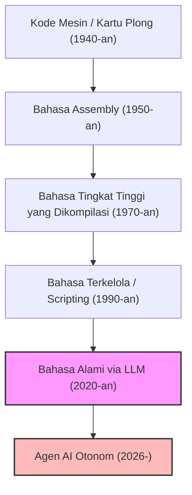
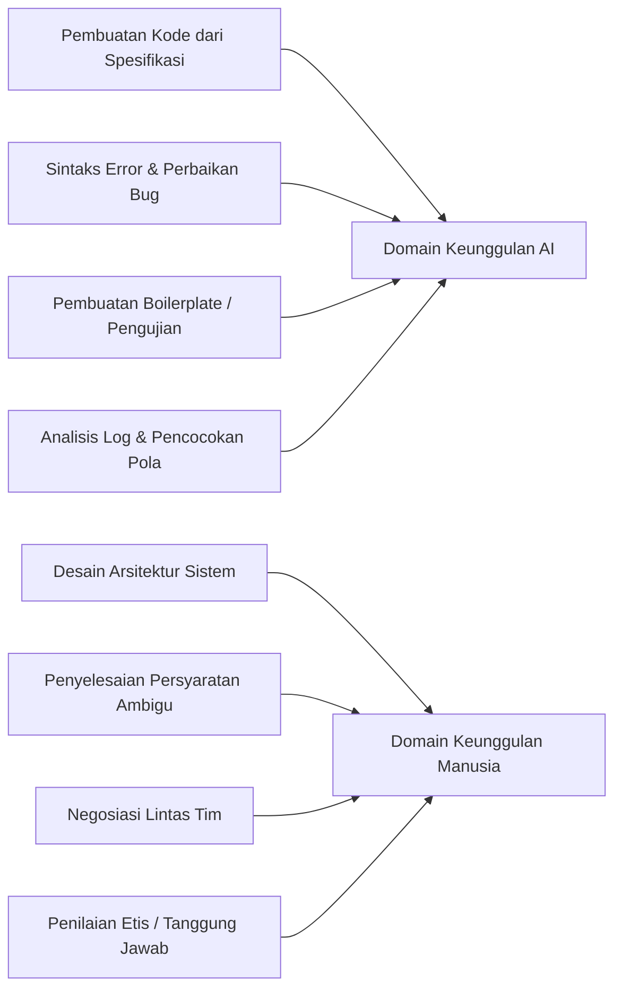
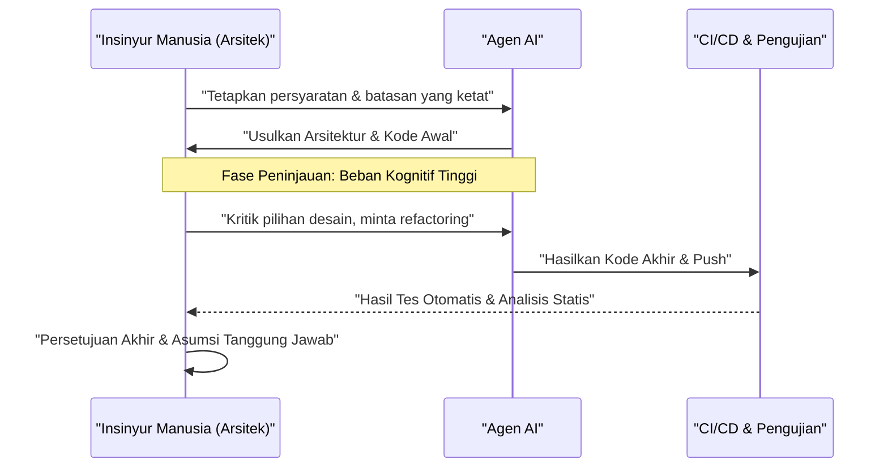

# Bagaimana Programmer Harus Bertahan di Era AI? Akhir dari Coding dan Awal dari Era Baru Rekayasa Perangkat Lunak

Pada tahun 2026, lanskap pengembangan perangkat lunak sedang mengalami periode perubahan dramatis yang belum pernah terjadi sebelumnya. Hanya beberapa tahun yang lalu, konsep "AI menulis kode" hanya sebatas peran sebagai "alat bantu" bagi programmer, seperti membuat boilerplate (kode standar) atau penyelesaian fungsi otomatis (auto-complete). Namun, berkat evolusi luar biasa dari Large Language Models (LLM), situasi ini telah berubah secara mendasar. AI modern bukan lagi sekadar "mesin ketik yang pintar". Jika diberikan dokumen definisi persyaratan (requirements), ia telah bertransformasi menjadi "insinyur junior otonom" yang memiliki kemampuan untuk merakit seluruh sistem—mulai dari logika front-end dan back-end, desain skema database, hingga membangun pipeline CI/CD—secara instan dan mandiri.

Di era seperti ini, bagaimana kita, para "programmer" dan "insinyur perangkat lunak" (software engineers), harus bertahan? Seiring dengan nilai ekonomi dari tindakan "menulis kode" itu sendiri yang mengalami deflasi secara cepat, seorang "coder" yang hanya mengetahui sintaks bahasa pemrograman tertentu dan API dari framework tertentu sedang dengan cepat tersingkir dari pasar.

Dalam artikel ini, kita akan membahas strategi bertahan hidup bagi programmer di era AI secara sangat mendetail, dari sudut pandang teknis, matematis, dan filosofis. Ini bukan sekadar diskusi tentang karier, melainkan redefinisi dari disiplin ilmu rekayasa perangkat lunak (software engineering) itu sendiri.

---

## 1. Sejarah Abstraksi (Abstraction) dan Redefinisi "Pemrograman"

Jika kita melihat kembali sejarah rekayasa perangkat lunak, kita dapat melihat bahwa itu selalu merupakan sejarah "abstraksi" (Abstraction). Kita selalu membangun lapisan-lapisan (layers) untuk mendeskripsikan sistem yang lebih kompleks dalam bahasa yang lebih dekat dengan manusia.

Para ilmuwan komputer awal menggunakan kartu plong (punch cards) untuk memanipulasi sakelar perangkat keras fisik secara langsung, memberikan instruksi kepada komputer dalam bahasa mesin (deretan 0 dan 1). Kemudian, bahasa assembly (Assembly Language) muncul, memungkinkan manusia mengendalikan perangkat keras menggunakan mnemonik yang lebih mudah dipahami. Seiring berjalannya waktu, bahasa tingkat tinggi seperti bahasa C dan Fortran diperkenalkan, berhasil mengenkapsulasi detail perangkat keras yang kompleks seperti manajemen memori dan register CPU. Bahasa-bahasa modern yang muncul selanjutnya, seperti Java, Python, Ruby, dan TypeScript, memungkinkan programmer untuk lebih fokus pada "apa yang ingin dilakukan komputer (What)" daripada "bagaimana cara menggerakkan komputer (How)".

Kemunculan AI (LLM) adalah pergeseran paradigma terbaru dan terbesar dalam sejarah abstraksi ini. Jika evolusi bahasa pemrograman adalah tentang "menyembunyikan perangkat keras", maka evolusi LLM adalah tentang "menyembunyikan sintaks (tata bahasa)".

Masa di mana para pengembang (developer) mengkhawatirkan kebocoran memori sambil memanipulasi pointer, atau menulis ratusan baris kode standar hanya untuk melakukan parsing JSON, kini telah berakhir. Menggunakan bahasa alami (seperti bahasa Indonesia atau Inggris)—bahasa dengan tingkat abstraksi tertinggi bagi umat manusia—untuk mendefinisikan sebuah sistem telah menjadi standar "pemrograman" di tahun 2026.

---

## 2. Model Matematis dari Produktivitas: Mengendarai Gelombang Pertumbuhan Eksponensial

Mari kita evaluasi peningkatan produktivitas yang dibawa oleh AI secara kuantitatif menggunakan model matematis.
Dalam pengembangan perangkat lunak tradisional, produktivitas individu $P_{traditional}$ dapat dimodelkan sebagai kombinasi linear dari tingkat keterampilan individu $S$, pengalaman domain $E$, dan efisiensi alat $T$.

$$ P_{traditional} = c_1 \cdot S + c_2 \cdot E + c_3 \cdot T $$

Namun, dalam pengembangan modern yang memanfaatkan AI, kemampuan AI $A(t)$ berfungsi sebagai "pengganda (Multiplier) yang kuat" yang memperkuat kemampuan manusia. Karena kemampuan AI tumbuh secara eksponensial seiring waktu $t$ (versi AI dari Hukum Moore), produktivitas di era AI $P_{AI}(t)$ dapat diekspresikan dengan persamaan berikut:

$$ P_{AI}(t) = \alpha \cdot S_{core} \cdot e^{\beta \cdot A(t)} $$

Di mana masing-masing variabel berarti sebagai berikut:
*   $\alpha$: Koefisien produktivitas manusia dasar (baseline)
*   $S_{core}$: "Keterampilan inti manusia" yang tidak dapat digantikan oleh AI (desain arsitektur, pemahaman tentang kebutuhan bisnis, penilaian etis, dll.)
*   $A(t)$: Kemampuan absolut dari model AI pada waktu $t$ (jumlah parameter, jendela konteks (context window), kemampuan penalaran)
*   $\beta$: Koefisien yang menunjukkan seberapa efektif seseorang dapat memanfaatkan alat AI (kualitas prompt engineering dan tingkat kemahiran alur kerja kolaboratif dengan AI)

Wawasan penting yang dapat ditarik dari persamaan ini adalah bahwa **di dunia di mana $A(t)$ meningkat secara eksponensial, keterampilan tradisional seperti kecepatan mengetik atau menghafal bahasa tertentu akan memiliki dampak yang sangat kecil terhadap produktivitas keseluruhan**. Sebaliknya, koefisien $\beta$ yang mengalikan pertumbuhan eksponensial AI dan $S_{core}$, yaitu area yang tidak dapat dicakup oleh AI, akan menjadi faktor dominan yang menentukan nilai pasar seorang insinyur.

---

## 3. Probabilitas Otomatisasi Tugas (Probability of Automation)

Lalu, tugas seperti apa yang akan diotomatisasi, dan tugas apa yang akan tetap berada di tangan manusia?
Probabilitas bahwa suatu tugas $T$ akan sepenuhnya diotomatisasi oleh AI, dilambangkan sebagai $P_{auto}(T)$, dapat dirumuskan sebagai berikut:

$$ P_{auto}(T) = 1 - \exp\left(-\lambda \cdot \frac{\text{Predictability}(T)}{\text{Complexity}(T) \times \text{Context Dependency}(T)}\right) $$

*   $\text{Predictability}(T)$: Keterprediksian suatu tugas (seberapa banyak pola yang ada dalam data historis)
*   $\text{Complexity}(T)$: Kompleksitas tugas tersebut
*   $\text{Context Dependency}(T)$: Kekuatan "konteks implisit (pengetahuan khusus domain dan hubungan antarmanusia)" yang menjadi sandaran tugas tersebut
*   $\lambda$: Tingkat kemajuan teknologi AI

Tugas-tugas yang memiliki tingkat keterprediksian tinggi dan ketergantungan konteks yang rendah, seperti menulis logika perutean (routing) API atau membuat layar CRUD sederhana, akan memiliki nilai $P_{auto} \approx 1$ dan hampir sepenuhnya otomatis. Di sisi lain, tugas-tugas dengan ketergantungan konteks yang sangat tinggi, seperti "bagaimana mengintegrasikan sistem warisan (legacy) yang ada secara aman dengan layanan mikro (microservices) baru" atau "bagaimana merancang alur autentikasi yang memenuhi persyaratan departemen hukum tanpa mengorbankan pengalaman pengguna (user experience)", akan sulit untuk diotomatisasi.

---

## 4. Kembali dari Sintaks (Tata Bahasa) ke Arsitektur (Struktur)

Memisahkan dengan jelas apa yang menjadi keahlian AI dan apa yang menjadi keunggulan manusia adalah syarat mutlak untuk bertahan hidup.

AI telah mengungguli manusia dalam "optimasi lokal". Manusia tidak memiliki peluang untuk menang dalam hal kecepatan dan akurasi saat menulis satu fungsi, satu kelas, atau satu modul saja. Namun, AI sangat rentan terhadap "optimasi global" atau dalam situasi di mana terdapat "konteks yang hilang" (Missing Context).

Programmer masa depan harus mengubah peran mereka dari "pekerja yang menulis kode" menjadi "arsitek yang mengorkestrasi komponen yang tak terhitung jumlahnya yang dihasilkan oleh AI". Mengawasi keseluruhan sistem, memutuskan di mana harus menarik batas-batas layanan mikro (microservices), bagaimana menyelesaikan pertukaran (trade-offs) antara ketersediaan dan konsistensi dalam Teorema CAP sejalan dengan konteks bisnis, dan bagaimana mengendalikan utang teknis. Ini adalah tugas-tugas intelektual tingkat tinggi yang hanya bisa dilakukan oleh manusia yang memahami gambaran besar dan tujuan bisnis.

---

## 5. Definisi Persyaratan adalah "Prompt Engineering Sejati"

Istilah "prompt engineering" yang sering kita dengar akhir-akhir ini sering disalahpahami sebagai "trik/hack untuk mengelabui AI demi mendapatkan keluaran yang diinginkan". Akan tetapi, esensi dari prompt engineering dalam pengembangan perangkat lunak tak terbantahkan adalah **"Rekayasa Persyaratan Tingkat Lanjut" (Requirements Engineering)**.

Untuk memberikan instruksi kepada AI dalam bahasa alami agar menghasilkan perangkat lunak yang sesuai dengan yang diharapkan, elemen-elemen berikut ini harus diartikulasikan secara tegas:

1.  **Tujuan (Why)**: Mengapa fitur ini dibutuhkan? Apa nilai bisnisnya?
2.  **Batasan (Constraints)**: Persyaratan kinerja (latensi, throughput), persyaratan keamanan, dan batasan biaya.
3.  **Kasus Tepi (Edge Cases)**: Proses fallback jika pengguna memasukkan input yang tidak terduga.
4.  **Antarmuka (Interfaces)**: Spesifikasi integrasi dengan sistem yang sudah ada.

Instruksi (prompt) yang ambigu hanya akan menghasilkan sistem yang ambigu dan rapuh. Kemampuan untuk mewawancarai secara mendalam apa "yang benar-benar diinginkan pelanggan", menata persyaratan yang saling bertentangan, dan membuat spesifikasi (prompt) tanpa cacat logis. Inilah "keterampilan coding" terkuat di era AI. Programmer tidak akan lagi banyak menghabiskan waktu menghadapi editor kode, melainkan Notion atau file Markdown, menghabiskan lebih banyak waktu untuk mendeskripsikan secara presisi bentuk ideal dari sebuah sistem dalam bentuk teks.

---

## 6. Keunggulan Mutlak dari Pengetahuan Domain (Domain Knowledge)

Karena AI telah dilatih dengan kode sumber terbuka (open-source) dan dokumen publik dari seluruh dunia, ia sangat mahir dalam teknologi web dan algoritma umum. Namun, ada data yang tidak bisa diakses oleh AI. Itu adalah "aturan bisnis spesifik perusahaan Anda" dan "pengetahuan domain yang berakar dalam pada industri tertentu (seperti medis, keuangan, manufaktur, dll.)".

Sebagai contoh, misalkan ada sebuah startup medis yang sedang mengembangkan sistem rekam medis elektronik. AI mengetahui "cara membuat tabel UI di React" dan "struktur data umum HL7 FHIR". Namun, AI belum mempelajari pengetahuan implisit mengenai "di departemen klinis tertentu di Rumah Sakit A, dalam urutan apa dokter melihat data pasien, dan antarmuka pengguna (UI) seperti apa yang akan meminimalkan risiko kesalahan medis".

Di dunia di mana teknologi itu sendiri sedang mengalami komoditisasi, nilai sejati seorang insinyur lahir di persimpangan antara "teknologi" dan "domain bisnis". Alih-alih hanya bersaing berdasarkan keterampilan teknis, mereka yang memiliki keahlian mendalam di domain tertentu seperti medis, keuangan, logistik, atau hiburan, dan mampu memecahkan masalah dalam domain tersebut menggunakan alat canggih bernama AI, adalah talenta yang akan memimpin pasar masa depan.

---

## 7. "Masalah Troli" dalam Pengembangan Perangkat Lunak: Siapa yang Bertanggung Jawab?

Seiring dengan meningkatnya ketergantungan kita pada AI, kita menghadapi masalah filosofis dan etis yang besar. Ini adalah masalah "di mana letak tanggung jawab (Accountability)" dalam rekayasa perangkat lunak.

Jika kode yang dihasilkan secara mandiri oleh AI menyebabkan bug kritis di lingkungan produksi (production), menyebabkan kerugian miliaran rupiah bagi perusahaan, atau menyebabkan malfungsi dalam sistem medis yang mempertaruhkan nyawa, siapa yang bertanggung jawab? Apakah perusahaan yang mengembangkan model AI tersebut? Atau insinyur yang memasukkan prompt? AI tidak bisa "dipecat" atau "ditangkap".

Peran "manusia" sebagai entitas yang memikul "tanggung jawab hukum dan etis (Accountability)" atas dampak sistem terhadap masyarakat tidak akan pernah hilang, tidak peduli seberapa majunya teknologi. Sebaliknya, semakin proses pembuatan kode menjadi kotak hitam (black box), semakin besar beban tanggung jawab manusia sebagai "pemberi persetujuan akhir (Approver)" dan "pengawas (Supervisor)" atas sistem tersebut.

Mengaudit apakah arsitektur dan kode yang diusulkan oleh AI memenuhi standar keamanan, tidak memiliki masalah etika (seperti bias), dan mematuhi kepatuhan (compliance), serta memberikan lampu hijau terakhir. Tindakan "memikul tanggung jawab" ini sendiri menjadi bagian integral dari pekerjaan seorang insinyur.

---

## 8. Pemrograman Berpasangan dengan AI (AI Pair Programming) dan Manajemen Beban Kognitif (Cognitive Load)

Bekerja dengan AI juga mengubah sifat "Beban Kognitif" (Cognitive Load) pada manusia. Beban kognitif ketika menulis kode dari awal benar-benar berbeda dengan beban kognitif ketika "membaca dan meninjau" ratusan baris kode tak dikenal yang dihasilkan oleh AI.

Menurut Teori Beban Kognitif dalam psikologi, memori kerja (working memory) manusia akan cepat habis ketika memproses informasi kompleks yang tidak sesuai dengan skema (struktur pengetahuan dalam pikiran) yang sudah ada. Kode yang dihasilkan AI kadang-kadang menyertakan pengoptimalan canggih yang mungkin tidak dipikirkan oleh manusia, namun di sisi lain, dapat juga menyertakan "halusinasi (hallucinations)" yang mengabaikan konteks.

Untuk mencegah hal ini, proses peninjauan (review) terhadap AI harus disistematisasikan.

Lebih dari sekadar keterampilan "menulis", manusia perlu memaksimalkan keterampilan "membaca cepat dan melihat cacat logis secara instan (Code Reading & Auditing)". Pentingnya Test-Driven Development (TDD) akan semakin besar di era AI. Pendekatan yang menjadi arus utama adalah pendekatan di mana manusia atau AI lain menulis kode pengujian yang ketat sebelum membiarkan AI menulis kode implementasi, dan kemudian memaksa AI untuk memodifikasi kode sampai lolos pengujian tersebut.

---

## 9. Strategi Bertahan Hidup Konkret: Apa yang Harus Dipelajari Mulai Besok?

Berdasarkan analisis yang telah kita bahas sejauh ini, kami menyajikan rencana aksi konkret bagi programmer untuk bertahan hidup di era AI:

1.  **Mempelajari Kembali "Dasar-Dasar" Teknologi Secara Menyeluruh**: Biarkan AI menangani cara menggunakan framework. Namun, pemahaman mendalam tentang cara kerja sistem operasi (OS), protokol jaringan (TCP/IP, HTTP/3), struktur internal database (B-Tree, tingkat isolasi transaksi), serta struktur data dan algoritma, sangatlah mutlak. Fondasi ilmu komputer yang kokoh sangat penting untuk menilai apakah keluaran dari AI sudah benar.
2.  **Kuasai Arsitektur Cloud dan Sistem Terdistribusi**: Fokus bukan pada kode individual, melainkan pada bagaimana menggabungkan sumber daya cloud seperti AWS, GCP, dan Azure untuk membangun sistem yang dapat diskalakan (scalable). Pahami konsep Infrastructure as Code (IaC) seperti Terraform, dan kembangkan kemampuan untuk mendesain keseluruhan sistem sebagai sebuah kode.
3.  **Menjadi Pakar di Domain Bisnis**: Pelajari lebih dalam model bisnis, kerangka regulasi, dan psikologi perilaku pengguna di industri tempat Anda berada. Melampaui batas sebagai seorang insinyur dan milikilah perspektif yang mirip dengan Product Manager (PM).
4.  **Pertajam Keterampilan Komunikasi dan Fasilitasi**: Proses penyelesaian "ambiguitas" antara manusia ke manusia dan membangun konsensus tidak dapat digantikan oleh AI. Keterampilan lunak (soft skills) untuk berkomunikasi dengan pemangku kepentingan (stakeholders) dan menemukan masalah yang sesungguhnya akan menjadi keterampilan yang paling berharga.
5.  **Manfaatkan AI Sebagai "Rekan Kerja" Sepenuhnya**: Alih-alih takut akan evolusi alat AI, gunakanlah itu sebagai senjata terkuat Anda. Gunakan LLM terbaru dan agen coding AI setiap hari, lalu kumpulkan "pengetahuan implisit" tentang di mana AI akan gagal dan bagaimana mengubah prompt Anda untuk mengeluarkan kinerja terbaik.

---

## Kesimpulan: Jangan Takut, Kendarailah Gelombang Ini

Otomatisasi pemrograman oleh AI bukanlah "kematian" bagi profesi programmer. Sebaliknya, ini adalah sebuah **"Renaisans" (Kebangkitan)** yang membebaskan kita dari "pekerjaan yang tidak esensial" dalam pengembangan perangkat lunak—seperti memperbaiki kesalahan ketik (typo), memecahkan masalah konfigurasi lingkungan, dan menulis kode boilerplate yang membosankan.

Sepanjang sejarah, munculnya alat tenun otomatis atau perangkat lunak spreadsheet (seperti Excel) juga selalu diiringi dengan pesimisme bahwa pekerjaan akan hilang. Namun, kenyataannya adalah bahwa produktivitas yang meningkat tajam menciptakan permintaan baru, dan pekerjaan yang lebih canggih pun bermunculan. Hal yang sama akan terjadi di dunia perangkat lunak. Karena kita bisa "membangun sistem dengan harga murah", perangkat lunak akan menembus setiap bidang yang sebelumnya belum ter-IT-kan karena kendala biaya, dan masalah (What) yang perlu dipecahkan oleh insinyur akan meluas tanpa batas.

Kita para programmer saat ini diberi kesempatan untuk berevolusi dari sekadar pengrajin yang menulis kode, menjadi "konduktor orkestra" yang mengarahkan kecerdasan AI yang tangguh. Alih-alih takut pada gelombang teknologi dan tetap berada di pantai, marilah kita segera mengendarai gelombang tersebut dan memulai perjalanan untuk menciptakan sistem yang lebih besar dan jauh lebih berharga. Era AI ini adalah era di mana "Rekayasa (Engineering)" dalam arti yang sebenarnya akan dimulai.
