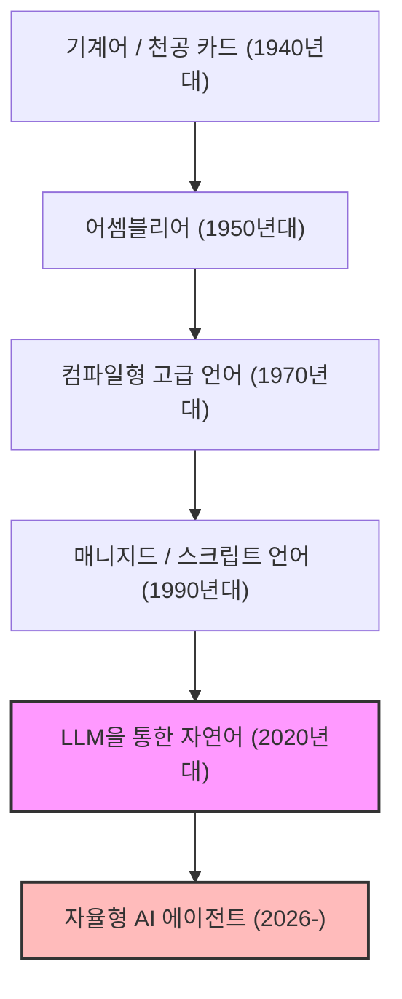
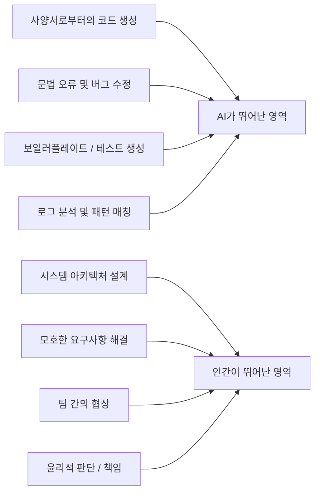
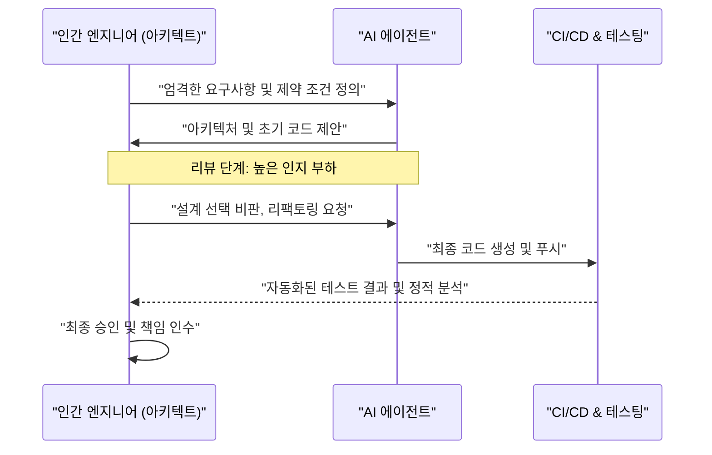

# AI 시대의 프로그래머는 어떻게 살아남아야 하는가? 코딩의 종말과 새로운 엔지니어링의 서막

2026년 현재, 소프트웨어 개발 현장은 그 어느 때보다 격변기를 맞이하고 있다. 불과 몇 년 전만 해도 'AI가 코드를 작성한다'는 개념은 기껏해야 보일러플레이트(상용구 코드) 생성이나 함수의 자동 완성 같은 프로그래머의 '보조 도구' 역할에 머물러 있었다. 하지만 대규모 언어 모델(LLM)의 경이적인 진화로 인해 상황은 근본적으로 뒤집혔다. 현대의 AI는 단순한 '똑똑한 타자기'가 아니라, 요구사항 정의서를 주면 프론트엔드부터 백엔드의 로직, 데이터베이스의 스키마 설계, 심지어 CI/CD 파이프라인 구축에 이르기까지 시스템 전체를 순식간에, 그리고 자율적으로 조립하는 능력을 갖춘 '자율형 주니어 엔지니어'로 변모했다.

이러한 시대에 우리 '프로그래머'나 '소프트웨어 엔지니어'는 어떻게 살아남아야 할까? '코드를 작성한다'는 행위 자체의 경제적 가치가 급속히 디플레이션되는 가운데, 단지 특정 프로그래밍 언어의 문법(신택스)을 알고 특정 프레임워크의 API에 정통할 뿐인 '코더'는 급속히 시장에서 도태되고 있다.

본고에서는 AI 시대에 프로그래머의 생존 전략에 대해 기술적, 수학적, 그리고 철학적 관점에서 극히 상세하게 고찰해 본다. 이는 단순한 커리어론이 아니라, 소프트웨어 엔지니어링이라는 학문 자체의 재정의이다.

---

## 1. 추상화(Abstraction)의 역사와 '프로그래밍'의 재정의

소프트웨어 엔지니어링의 역사를 되돌아보면, 그것은 항상 '추상화(Abstraction)'의 역사였음을 알 수 있다. 우리는 항상 더 인간에 가까운 언어로 더 복잡한 시스템을 기술하기 위한 레이어를 구축해 왔다.

초기 컴퓨터 과학자들은 천공 카드를 사용하여 물리적인 하드웨어의 스위치를 직접 조작하고 기계어(0과 1의 나열)로 컴퓨터에 지시를 내렸다. 그 후 어셈블리어(Assembly Language)가 등장하여 인간이 이해하기 쉬운 니모닉(Mnemonic)으로 하드웨어를 조작할 수 있게 되었다. 시대가 더 지나 C언어나 Fortran 같은 고급 언어가 등장하여 메모리 관리나 CPU의 레지스터와 같은 하드웨어의 복잡한 세부 사항을 캡슐화하는 데 성공했다. 이어서 등장한 Java, Python, Ruby, TypeScript 등의 모던한 언어로 인해 프로그래머는 '컴퓨터를 어떻게 움직일 것인가(How)'가 아니라 '컴퓨터에게 무엇을 시킬 것인가(What)'에 더욱 집중할 수 있게 되었다.

AI(LLM)의 등장은 이 추상화의 역사에 있어서 가장 최신이자 최대의 패러다임 시프트이다. 프로그래밍 언어의 진화가 '하드웨어의 은닉'이었다고 한다면, LLM의 진화는 '신택스(문법)의 은닉'이다.

더 이상 개발자가 메모리 누수를 걱정하며 포인터를 조작하거나, JSON 파싱 처리를 위한 정형 코드를 수백 줄씩 쓰는 시대는 끝났다. 자연어(한국어나 영어)라는, 인류에게 가장 추상도가 높은 언어를 사용하여 시스템을 정의하는 것이 2026년의 '프로그래밍' 표준이 되었다.

---

## 2. 생산성의 수학적 모델: 기하급수적 성장의 파도에 올라타라

AI가 가져오는 생산성의 향상을 수학적 모델을 사용하여 정량적으로 평가해 보자.
기존 소프트웨어 개발에서 개인의 생산성 $P_{traditional}$은 개인의 스킬 수준 $S$, 도메인 경험 $E$, 그리고 도구의 효율성 $T$의 선형적인 조합으로 모델링할 수 있었다.

$$ P_{traditional} = c_1 \cdot S + c_2 \cdot E + c_3 \cdot T $$

하지만 AI를 활용한 현대의 개발에 있어서는, AI의 능력 $A(t)$가 인간의 능력을 증폭시키는 '강력한 레버리지(Multiplier)'로서 작용한다. AI의 능력은 시간의 경과 $t$와 함께 기하급수적으로 성장(무어의 법칙의 AI 버전)하기 때문에, AI 시대의 생산성 $P_{AI}(t)$는 다음과 같은 방정식으로 나타낼 수 있다.

$$ P_{AI}(t) = \alpha \cdot S_{core} \cdot e^{\beta \cdot A(t)} $$

여기서 각 변수는 다음을 의미한다.
*   $\alpha$: 기초가 되는 인간의 생산성 계수
*   $S_{core}$: AI로 대체되지 않는 '인간의 핵심 스킬'(아키텍처 설계, 비즈니스 요구사항 이해, 윤리적 판단 등)
*   $A(t)$: 시간 $t$에서의 AI 모델의 절대적인 능력(파라미터 수, 컨텍스트 창, 추론 능력)
*   $\beta$: AI 도구를 얼마나 효과적으로 이끌어낼 수 있는가(프롬프트 엔지니어링의 질이나 AI와의 협업 워크플로우의 세련도)를 나타내는 계수

이 수식에서 도출되는 중요한 통찰은, **$A(t)$가 기하급수적으로 증대하는 세계에서는 단순한 타이핑 속도나 특정 언어의 암기 같은 기존의 스킬이 전체 생산성에 미치는 영향이 극히 작아진다**는 것이다. 대신, 기하급수적인 AI 성장에 편승하기 위한 계수 $\beta$와 AI가 커버할 수 없는 영역인 $S_{core}$가 엔지니어의 시장 가치를 결정짓는 지배적인 요인이 된다.

---

## 3. 작업의 자동화 확률(Probability of Automation)

그렇다면 어떤 작업이 자동화되고 어떤 작업이 인간의 손에 남게 될 것인가?
어떤 작업 $T$가 AI에 의해 완전히 자동화될 확률 $P_{auto}(T)$는 다음과 같이 정식화할 수 있다.

$$ P_{auto}(T) = 1 - \exp\left(-\lambda \cdot \frac{\text{Predictability}(T)}{\text{Complexity}(T) \times \text{Context Dependency}(T)}\right) $$

*   $\text{Predictability}(T)$: 작업의 예측 가능성(과거의 데이터에 패턴이 얼마나 존재하는가)
*   $\text{Complexity}(T)$: 작업의 복잡성
*   $\text{Context Dependency}(T)$: 작업이 의존하는 '암묵적인 컨텍스트(도메인 고유의 지식이나 인간관계)'의 강도
*   $\lambda$: AI의 기술 진보율

API 라우팅 처리를 작성하거나 단순한 CRUD 화면을 만드는 등의 예측 가능성이 높고 컨텍스트 의존성이 낮은 작업은 $P_{auto} \approx 1$이 되어 거의 완전히 자동화된다. 반면, '기존의 레거시 시스템과 새로운 마이크로서비스를 어떻게 안전하게 통합할 것인가'나 '법무 부서의 요구를 충족하면서도 사용자 경험을 해치지 않는 인증 플로우를 어떻게 설계할 것인가'와 같이 컨텍스트 의존성이 극히 높은 작업은 자동화하기 어렵다.

---

## 4. 신택스(문법)에서 아키텍처(구조)로의 회귀

AI가 잘하는 것과 인간이 잘하는 것을 명확하게 분리하는 것이 생존의 절대 조건이 된다.

AI는 '국소적인 최적화'에 있어 인간을 능가한다. 하나의 함수, 하나의 클래스, 또는 단일 모듈을 기술하는 속도와 정확성에 있어서 인간은 승산이 없다. 하지만 AI는 '전역적인 최적화'나 '컨텍스트의 결여(Missing Context)'에 대해서는 매우 취약하다.

앞으로의 프로그래머는 '코드를 작성하는 노동자'에서 'AI가 생성한 무수한 컴포넌트를 오케스트레이션하는 아키텍트'로 역할을 바꿔야 한다. 시스템 전체를 조감하고, 마이크로서비스의 경계를 어디에 그을지, CAP 정리에서의 가용성과 일관성의 트레이드오프를 비즈니스 문맥에 맞춰 어떻게 해결할지, 기술 부채를 어떻게 제어할지. 이들은 전체 그림과 비즈니스 목표를 이해하고 있는 인간만이 할 수 있는 고도의 지적 작업이다.

---

## 5. 요구사항 정의야말로 '진정한 프롬프트 엔지니어링'이다

최근 자주 듣는 '프롬프트 엔지니어링'이라는 말은 종종 'AI를 속여 원하는 출력을 얻어내기 위한 핵(hack)'처럼 오해받곤 한다. 하지만 소프트웨어 개발에서의 프롬프트 엔지니어링의 본질은 틀림없는 **'고도의 요구사항 정의(Requirements Engineering)'**이다.

자연어로 AI에게 지시를 내리고 의도한 대로 소프트웨어를 출력하게 만들기 위해서는 다음과 같은 요소들을 엄밀하게 언어화해야 한다.

1.  **목적(Why)**: 왜 이 기능이 필요한가. 비즈니스적 가치는 무엇인가.
2.  **제약 조건(Constraints)**: 성능 요구사항(레이턴시, 처리량), 보안 요구사항, 비용 제약.
3.  **엣지 케이스(Edge Cases)**: 사용자가 예기치 않은 입력을 했을 경우의 폴백(Fallback) 처리.
4.  **인터페이스(Interfaces)**: 기존 시스템과의 연동 사양.

모호한 지시(프롬프트)에서는 모호하고 취약한 시스템밖에 나오지 않는다. '고객이 진정으로 원했던 것'을 깊이 청취하고, 모순되는 요구사항을 정리하며, 논리적인 파탄이 없는 사양서(프롬프트)를 작성하는 능력. 이것이야말로 AI 시대의 최강의 '코딩 스킬'이다. 프로그래머는 코드 에디터가 아닌 Notion이나 Markdown 파일을 마주하고 시스템의 이상적인 모습을 텍스트로 정교하게 기술하는 시간이 늘어날 것이다.

---

## 6. 도메인 지식(Domain Knowledge)의 압도적 우위성

AI는 전 세계의 오픈 소스 코드나 공개 문서를 학습하고 있기 때문에 일반적인 웹 기술이나 알고리즘에는 정통하다. 하지만 AI가 접근할 수 없는 데이터가 있다. 그것은 '여러분의 회사 고유의 비즈니스 규칙'이며, '특정 업계(의료, 금융, 제조 등)에 깊이 뿌리내린 도메인 지식'이다.

예를 들어, 어떤 의료계 스타트업에서 전자 의무 기록 시스템을 개발하고 있다고 하자. AI는 'React로 표 형식의 UI를 만드는 방법'이나 'HL7 FHIR의 일반적인 데이터 구조'는 알고 있다. 하지만 'A병원의 특정 진료과에서 의사가 어떤 순서로 환자의 데이터를 열람하고, 어떤 UI여야 의료 실수의 위험을 최소화할 수 있는가'라는 암묵지까지는 학습하지 못했다.

기술 자체가 코모디티화(범용화)되는 세계에서 엔지니어의 진정한 가치는 '테크놀로지'와 '비즈니스 도메인'의 교차점에서 태어난다. 기술력만으로 승부하는 것이 아니라 의료, 금융, 물류, 엔터테인먼트 등 특정 도메인에 대한 깊은 전문 지식을 가지고, 그 도메인의 과제를 AI라는 강력한 도구를 사용하여 해결할 수 있는 인재가 앞으로의 시장을 견인해 나갈 것이다.

---

## 7. 소프트웨어 개발의 '트롤리 딜레마': 누가 책임을 질 것인가

AI에 대한 의존도가 높아짐에 따라 우리는 중대한 철학적, 윤리적 문제에 직면하게 된다. 소프트웨어 엔지니어링에서의 '책임의 소재'라는 문제이다.

만약 AI가 자율적으로 생성한 코드가 프로덕션 환경에서 심각한 버그를 일으켜 기업에 수억 원의 손실을 입히거나, 인명과 관련된 의료 시스템에서 오작동을 일으켰을 경우, 누가 그 책임을 질 것인가? AI 모델을 개발한 기업인가? 아니면 프롬프트를 입력한 엔지니어인가? AI를 '해고'하거나 '체포'할 수는 없다.

시스템이 사회에 미치는 영향에 대한 '법적, 윤리적 책임(Accountability)'을 떠맡는 주체로서의 '인간'의 역할은 기술이 아무리 진화하더라도 소멸하지 않는다. 오히려 코드의 생성 프로세스가 블랙박스화될수록 인간은 시스템에 대한 '최종 승인자(Approver)' 및 '감독자(Supervisor)'로서 무거운 책임을 지게 된다.

AI가 제시한 아키텍처나 코드가 보안 기준을 충족하는지, 윤리적으로 문제가 없는지(편향이 포함되어 있지 않은지), 컴플라이언스를 준수하고 있는지를 감사하고 최종적인 GO 사인을 내린다. 이 '책임을 지는' 행위 자체가 엔지니어의 중요한 업무 중 일부가 된다.

---

## 8. AI 페어 프로그래밍과 인지 부하(Cognitive Load) 관리

AI와 함께 일함에 있어 인간의 '인지 부하(Cognitive Load)'의 성질도 변화하고 있다. 제로에서 코드를 작성할 때의 인지 부하와, AI가 생성한 수백 줄의 미지의 코드를 '읽고 리뷰하는' 때의 인지 부하는 전혀 다르다.

심리학의 인지 부하 이론에 따르면, 기존의 스키마(머릿속의 지식 구조)와 일치하지 않는 복잡한 정보를 처리할 때 인간의 작업 기억(Working Memory)은 금세 고갈된다. AI가 생성한 코드는 때로 인간이 생각하지 못한 고도의 최적화를 포함하고 있는 반면, 컨텍스트를 무시한 '환각(Hallucination)'을 포함하고 있을 때도 있다.

이를 방지하기 위해서는 AI에 대한 리뷰 프로세스를 시스템화할 필요가 있다.

인간은 '작성하는' 스킬 이상으로, '속독하고 논리적 결함을 순식간에 간파하는(Code Reading & Auditing)' 스킬을 극한까지 끌어올려야 한다. 테스트 주도 개발(TDD)의 중요성은 AI 시대에 더욱 커지고 있다. AI에게 코드를 작성하게 하기 전에 인간 또는 다른 AI가 엄밀한 테스트 코드를 작성하고, 그 테스트를 통과할 때까지 AI에게 코드를 수정하게 하는 접근법이 주류가 될 것이다.

---

## 9. 구체적인 생존 전략: 내일부터 무엇을 배워야 하는가

지금까지의 분석을 바탕으로, 프로그래머가 AI 시대를 살아남기 위한 구체적인 액션 플랜을 제시한다.

1.  **기술의 '기초'를 철저하게 다시 배운다**: 프레임워크의 사용법은 AI에게 맡기면 된다. 하지만 OS의 원리, 네트워크 프로토콜(TCP/IP, HTTP/3), 데이터베이스의 내부 구조(B-Tree, 트랜잭션 격리 수준), 자료 구조와 알고리즘에 대한 깊은 이해는 절대적으로 필요하다. AI의 출력이 올바른지 판단하기 위해서는 컴퓨터 과학의 확고한 기초가 필수적이다.
2.  **클라우드 아키텍처와 분산 시스템을 마스터한다**: 개별 코드가 아니라 AWS, GCP, Azure 같은 클라우드 리소스를 어떻게 조합하여 확장 가능한 시스템을 구축할 것인가에 주력한다. Terraform 등 IaC(Infrastructure as Code)의 개념을 이해하고 시스템 전체를 코드로 설계하는 능력을 기른다.
3.  **비즈니스 도메인의 전문가가 된다**: 자신이 속한 업계의 비즈니스 모델, 법적 규제, 사용자의 행동 심리를 깊이 배운다. 엔지니어의 틀을 넘어 프로덕트 매니저(PM)에 가까운 시각을 가져야 한다.
4.  **커뮤니케이션과 퍼실리테이션 스킬을 연마한다**: 인간과 인간 사이에 있는 '모호함'을 해결하고 합의를 도출하는 프로세스는 AI가 대체할 수 없다. 이해관계자와 대화하고 진정한 과제를 발견하는 소프트 스킬은 가장 가치 있는 스킬이 될 것이다.
5.  **AI를 '동료'로 철저히 활용한다**: AI 도구의 진화를 두려워할 것이 아니라 가장 강력한 무기로 활용한다. 최신 LLM이나 AI 코딩 에이전트를 일상적으로 사용하고, AI가 어디에서 실패하는지, 프롬프트를 어떻게 고안해야 최고의 퍼포먼스를 끌어낼 수 있는지에 대한 '암묵지'를 축적한다.

---

## 결론: 두려워하지 말고 파도에 올라타라

AI에 의한 프로그래밍의 자동화는 프로그래머라는 직업의 '죽음'을 의미하는 것이 아니다. 오히려 오타 수정이나 환경 구축의 트러블 슈팅, 지루한 보일러플레이트 작성과 같은 소프트웨어 개발에서의 '본질적이지 않은 노동'으로부터 우리를 해방시켜 주는 **'르네상스(문예 부흥)'**이다.

역사상 자동 방직기가 등장했을 때도, 스프레드시트(Excel)가 등장했을 때도 일자리가 소멸할 것이라는 비관론이 만연했다. 하지만 현실은 생산성이 비약적으로 향상됨으로써 새로운 수요가 창출되었고, 더 고도화된 일자리가 생겨났다. 소프트웨어 세계에서도 같은 일이 일어날 것이다. '저렴하게 시스템을 만들 수 있게' 됨으로써, 지금까지 비용이 맞지 않아 IT화되지 않았던 모든 영역에 소프트웨어가 침투하고 엔지니어가 해결해야 할 과제(What)는 무한히 넓어질 것이다.

우리 프로그래머는 지금, 코드를 작성하는 장인에서 AI라는 강대한 지능을 지휘하는 '오케스트라의 지휘자'로 진화할 기회를 부여받고 있다. 기술의 파도에 겁을 먹고 물가에 머무를 것이 아니라, 그 파도에 누구보다 먼저 올라타 더 크고 가치 있는 시스템을 창조하는 여행으로 노를 저어 나가자. AI 시대야말로 진정한 의미에서의 '엔지니어링'이 시작되는 시대인 것이다.
