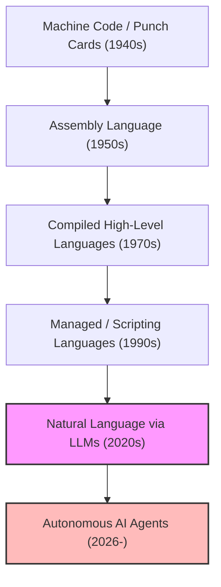
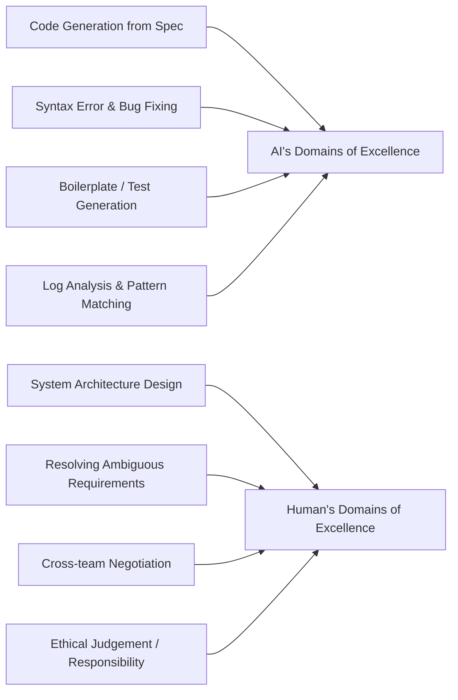
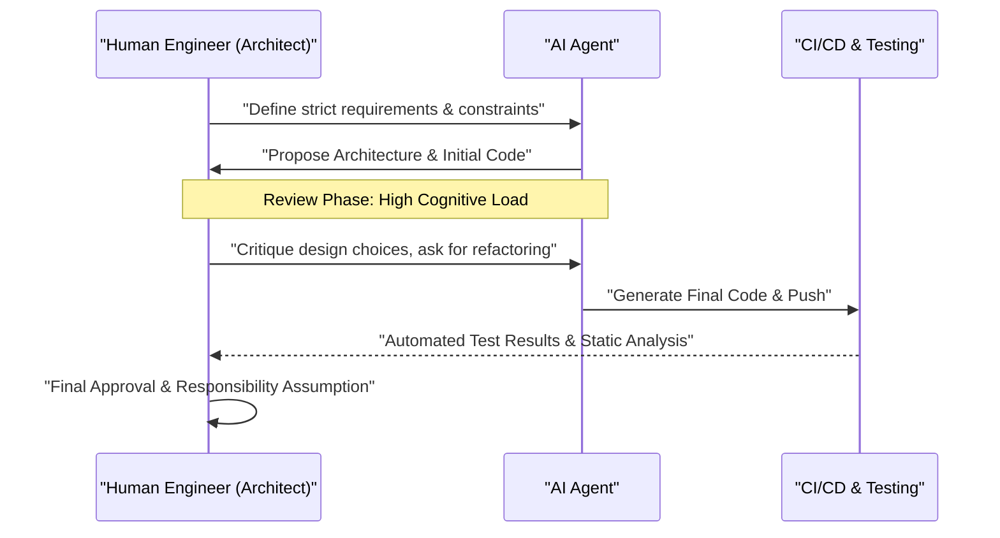

# AI時代のプログラマーはどう生き残るべきか？コーディングの終焉と新たなエンジニアリングの幕開け

2026年現在、ソフトウェア開発の現場はかつてないほどの激変期にある。ほんの数年前まで、「AIがコードを書く」という概念は、せいぜいボイラープレート（定型コード）の生成や関数の自動補完といった、プログラマーの「補助ツール」としての役割に留まっていた。しかし、大規模言語モデル（LLM）の驚異的な進化により、事態は根本から覆った。現代のAIは単なる「賢いタイプライター」ではなく、要件定義書を与えれば、フロントエンドからバックエンドのロジック、データベースのスキーマ設計、さらにはCI/CDパイプラインの構築に至るまで、システム全体を瞬時に、かつ自律的に組み上げる能力を持つ「自律型ジュニア・エンジニア」へと変貌を遂げている。

このような時代において、我々「プログラマー」や「ソフトウェアエンジニア」はどのように生き残るべきだろうか？「コードを書く」という行為自体の経済的価値が急速にデフレ化していく中で、ただ特定のプログラミング言語の文法（シンタックス）を知り、特定のフレームワークのAPIに精通しているだけの「コーダー」は、急速に市場から淘汰されつつある。

本稿では、AI時代におけるプログラマーの生存戦略について、技術的、数学的、そして哲学的な視点から極めて詳細に考察していく。これは単なるキャリア論ではなく、ソフトウェアエンジニアリングという学問そのものの再定義である。

---

## 1. 抽象化（Abstraction）の歴史と「プログラミング」の再定義

ソフトウェアエンジニアリングの歴史を振り返ると、それは常に「抽象化（Abstraction）」の歴史であったことがわかる。我々は常に、より人間に近い言語で、より複雑なシステムを記述するためのレイヤーを構築してきた。

初期の計算機科学者は、パンチカードを用いて物理的なハードウェアのスイッチを直接操作し、マシン語（0と1の羅列）で計算機に指示を与えていた。その後、アセンブリ言語が登場し、人間が理解しやすいニーモニックでハードウェアを操作できるようになった。さらに時代が進むと、C言語やFortranといった高級言語が登場し、メモリ管理やCPUのレジスタといったハードウェアの複雑な詳細をカプセル化することに成功した。続いて登場したJava, Python, Ruby, TypeScriptなどのモダンな言語により、プログラマーは「計算機をどう動かすか（How）」ではなく、「何を計算機にさせたいか（What）」により集中できるようになった。

AI（LLM）の登場は、この抽象化の歴史における最新にして最大のパラダイムシフトである。プログラミング言語の進化が「ハードウェアの隠蔽」であったとすれば、LLMの進化は「シンタックス（文法）の隠蔽」である。

もはや、開発者がメモリリークを心配しながらポインタを操作したり、JSONのパース処理のための定型コードを何百行も書いたりする時代は終わった。自然言語（日本語や英語）という、人類にとって最も抽象度の高い言語を用いてシステムを定義することが、2026年における「プログラミング」のスタンダードとなっている。

---

## 2. 生産性の数学的モデル：指数関数的成長の波に乗る

AIがもたらす生産性の向上を、数学的なモデルを用いて定量的に評価してみよう。
従来のソフトウェア開発における個人の生産性 $P_{traditional}$ は、個人のスキルレベル $S$、ドメイン経験 $E$、そしてツールの効率 $T$ の線形な組み合わせとしてモデル化できた。

$$ P_{traditional} = c_1 \cdot S + c_2 \cdot E + c_3 \cdot T $$

しかし、AIを活用した現代の開発においては、AIの能力 $A(t)$ が人間の能力を増幅する「強力なレバレッジ（Multiplier）」として働く。AIの能力は時間の経過 $t$ と共に指数関数的に成長（ムーアの法則のAI版）するため、AI時代の生産性 $P_{AI}(t)$ は以下のような方程式で表すことができる。

$$ P_{AI}(t) = \alpha \cdot S_{core} \cdot e^{\beta \cdot A(t)} $$

ここで各変数は以下を意味する。
*   $\alpha$: 基底となる人間の生産性係数
*   $S_{core}$: AIに代替されない「人間のコアスキル」（アーキテクチャ設計、ビジネス要件の理解、倫理的判断など）
*   $A(t)$: 時刻 $t$ におけるAIモデルの絶対的な能力（パラメータ数、コンテキストウィンドウ、推論能力）
*   $\beta$: AIツールをどれだけ効果的に引き出せるか（プロンプトエンジニアリングの質や、AIとの協調ワークフローの洗練度）を示す係数

この数式から導き出される重要な洞察は、**$A(t)$ が指数関数的に増大する世界においては、単なるタイピング速度や特定言語の暗記といった従来型のスキルは、全体の生産性に与える影響が極めて小さくなる**ということだ。代わりに、指数関数的なAIの成長に乗じるための係数 $\beta$ と、AIがカバーできない領域である $S_{core}$ が、エンジニアの市場価値を決定づける支配的な要因となる。

---

## 3. タスクの自動化確率（Probability of Automation）

では、どのようなタスクが自動化され、どのようなタスクが人間の手に残るのだろうか？
あるタスク $T$ がAIによって完全に自動化される確率 $P_{auto}(T)$ は、次のように定式化できる。

$$ P_{auto}(T) = 1 - \exp\left(-\lambda \cdot \frac{\text{Predictability}(T)}{\text{Complexity}(T) \times \text{Context Dependency}(T)}\right) $$

*   $\text{Predictability}(T)$: タスクの予測可能性（過去のデータにどれだけパターンが存在するか）
*   $\text{Complexity}(T)$: タスクの複雑性
*   $\text{Context Dependency}(T)$: タスクが依存する「暗黙のコンテキスト（ドメイン固有の知識や人間関係）」の強さ
*   $\lambda$: AIの技術進歩率

APIのルーティング処理を書く、単純なCRUD画面を作る、といった予測可能性が高くコンテキスト依存性が低いタスクは、$P_{auto} \approx 1$ となり、ほぼ完全に自動化される。一方で、「既存のレガシーシステムと新しいマイクロサービスをどう安全に統合するか」「法務部門の要求を満たしつつ、ユーザー体験を損なわない認証フローをどう設計するか」といった、コンテキスト依存性が極めて高いタスクは自動化が難しい。

---

## 4. シンタックス（文法）からアーキテクチャ（構造）への回帰

AIが得意なことと、人間が得意なことを明確に分離することが生存の絶対条件となる。

AIは「局所的な最適化」において人間を凌駕している。1つの関数、1つのクラス、あるいは単一のモジュールを記述する速度と正確性において、人間に勝ち目はない。しかし、AIは「大域的な最適化」や「コンテキストの欠落（Missing Context）」に対しては非常に脆弱である。

これからのプログラマーは「コードを書く労働者」から、「AIが生成した無数のコンポーネントをオーケストレーションするアーキテクト」へと役割を変えなければならない。システム全体を俯瞰し、マイクロサービス境界をどこに引くか、CAP定理における可用性と一貫性のトレードオフをどうビジネスの文脈に合わせて解決するか、技術的負債をどうコントロールするか。これらは、全体像とビジネスゴールを理解している人間にしかできない高度な知的作業である。

---

## 5. 要件定義こそが「真のプロンプトエンジニアリング」である

最近よく耳にする「プロンプトエンジニアリング」という言葉は、しばしば「AIを騙して狙った出力を得るためのハック」のように誤解されがちである。しかし、ソフトウェア開発におけるプロンプトエンジニアリングの本質は、紛れもなく**「高度な要件定義（Requirements Engineering）」**である。

自然言語でAIに指示を出し、意図した通りのソフトウェアを出力させるためには、以下のような要素を厳密に言語化しなければならない。

1.  **目的（Why）**: なぜこの機能が必要なのか。ビジネス上の価値は何か。
2.  **制約条件（Constraints）**: パフォーマンスの要件（レイテンシ、スループット）、セキュリティ要件、コスト制約。
3.  **エッジケース（Edge Cases）**: ユーザーが予期せぬ入力を行った場合のフォールバック処理。
4.  **インターフェース（Interfaces）**: 既存システムとの連携仕様。

曖昧な指示（プロンプト）からは、曖昧で脆弱なシステムしか生まれない。「顧客が本当に欲しかったもの」を深くヒアリングし、矛盾する要件を整理し、論理的な破綻のない仕様書（プロンプト）を作成する能力。これこそが、AI時代における最強の「コーディングスキル」である。プログラマーはコードエディタではなく、NotionやMarkdownファイルに向き合い、システムのあるべき姿をテキストで精緻に記述する時間が増えていく。

---

## 6. ドメイン知識（Domain Knowledge）の圧倒的優位性

AIは世界中のオープンソースコードや公開ドキュメントを学習しているため、一般的なWeb技術やアルゴリズムには精通している。しかし、AIがアクセスできないデータがある。それは「あなたの会社固有のビジネスルール」であり、「特定の業界（医療、金融、製造など）に深く根付いたドメイン知識」である。

例えば、ある医療系スタートアップで電子カルテシステムを開発しているとする。AIは「Reactで表組みのUIを作る方法」や「HL7 FHIRの一般的なデータ構造」は知っている。しかし、「A病院の特定の診療科において、医師がどのような順番で患者のデータを閲覧し、どのようなUIであれば医療ミスのリスクを最小化できるか」という暗黙知までは学習していない。

技術そのものがコモディティ化（汎用品化）する世界において、エンジニアの真の価値は「テクノロジー」と「ビジネス・ドメイン」の交差点に生まれる。技術力だけで勝負するのではなく、医療、金融、物流、エンタメなど、特定のドメインにおける深い専門知識を持ち、そのドメインの課題をAIという強力なツールを使って解決できる人材が、これからの市場を牽引していく。

---

## 7. ソフトウェア開発の「トロッコ問題」：誰が責任を取るのか

AIへの依存度が高まるにつれ、我々は重大な哲学・倫理的問題に直面する。ソフトウェアエンジニアリングにおける「責任の所在」という問題である。

もし、AIが自律的に生成したコードが本番環境で深刻なバグを引き起こし、企業に数億円の損失を与えたり、人命に関わる医療システムで誤動作を起こしたりした場合、誰がその責任を取るのか？AIモデルを開発した企業か？それとも、プロンプトを入力したエンジニアか？AIを「解雇」したり「逮捕」したりすることはできない。

システムが社会に与える影響に対する「法的・倫理的責任（Accountability）」を引き受ける主体としての「人間」の役割は、どれほど技術が進化したとしても消滅することはない。むしろ、コードの生成プロセスがブラックボックス化するほど、人間はシステムに対する「最終承認者（Approver）」および「監督者（Supervisor）」としての重い責任を負うことになる。

AIが提示したアーキテクチャやコードが、セキュリティ基準を満たしているか、倫理的に問題がないか（バイアスが含まれていないか）、コンプライアンスを遵守しているかを監査し、最終的なGOサインを出す。この「責任を負う」という行為自体が、エンジニアの重要な仕事の一部となる。

---

## 8. AIペアプログラミングと認知負荷（Cognitive Load）のマネジメント

AIと共に働く上で、人間の「認知負荷（Cognitive Load）」の性質も変化している。ゼロからコードを書く際の認知負荷と、AIが生成した数百行の未知のコードを「読んでレビューする」際の認知負荷は全く異なる。

心理学の認知負荷理論によれば、既存のスキーマ（頭の中の知識構造）に合致しない複雑な情報を処理する際、人間のワーキングメモリはすぐに枯渇する。AIが生成したコードは、時に人間が思いつかないような高度な最適化を含んでいる一方で、コンテキストを無視した「幻覚（ハルシネーション）」を含んでいることもある。

これを防ぐためには、AIに対するレビュープロセスをシステム化する必要がある。

人間は「書く」スキル以上に、「速読し、論理的欠陥を瞬時に見抜く（Code Reading & Auditing）」スキルを極限まで高める必要がある。テスト駆動開発（TDD）の重要性はAI時代においてさらに増している。AIにコードを書かせる前に、人間または別のAIが厳密なテストコードを書き、そのテストを通過するまでAIにコードを修正させるというアプローチが主流になる。

---

## 9. 具体的な生存戦略：明日から何を学ぶべきか

ここまでの分析を踏まえ、プログラマーがAI時代を生き残るための具体的なアクションプランを提示する。

1.  **技術の「基礎」を徹底的に学び直す**: フレームワークの使い方はAIに任せればよい。しかし、OSの仕組み、ネットワークプロトコル（TCP/IP, HTTP/3）、データベースの内部構造（B-Tree, トランザクション分離レベル）、データ構造とアルゴリズムに関する深い理解は絶対に必要である。AIの出力が正しいかを判断するためには、コンピュータサイエンスの確固たる基礎が不可欠である。
2.  **クラウド・アーキテクチャと分散システムをマスターする**: 個別のコードではなく、AWS, GCP, Azureといったクラウドリソースをどのように組み合わせてスケーラブルなシステムを構築するかに注力する。TerraformなどのIaC（Infrastructure as Code）の概念を理解し、システム全体をコードとして設計する能力を養う。
3.  **ビジネスドメインの専門家になる**: 自分が所属する業界のビジネスモデル、法規制、ユーザーの行動心理を深く学ぶ。エンジニアの枠を超え、プロダクトマネージャー（PM）に近い視点を持つこと。
4.  **コミュニケーションとファシリテーションのスキルを磨く**: 人間と人間の間にある「曖昧さ」を解決し、合意形成を行うプロセスはAIには代替できない。ステークホルダーと対話し、真の課題を発見するソフトスキルは、最も価値の高いスキルとなる。
5.  **AIを「同僚」として使い倒す**: AIツールの進化を恐れるのではなく、最も強力な武器として活用する。最新のLLMやAIコーディングエージェントを日常的に使い、どこでAIが失敗するか、どうプロンプトを工夫すれば最高のパフォーマンスを引き出せるかという「暗黙知」を蓄積する。

---

## 結論：恐れるな、波を乗りこなせ

AIによるプログラミングの自動化は、プログラマーという職業の「死」を意味するものではない。むしろ、タイポの修正や環境構築のトラブルシューティング、退屈なボイラープレートの記述といった、ソフトウェア開発における「本質的でない労働」から我々を解放してくれる**「ルネサンス（文芸復興）」**である。

歴史上、自動織機が登場したときも、表計算ソフト（Excel）が登場したときも、仕事が消滅するという悲観論が蔓延した。しかし現実は、生産性が飛躍的に向上したことで新たな需要が創出され、より高度な仕事が生まれてきた。ソフトウェアの世界でも同じことが起きる。「安価にシステムを作れる」ようになることで、これまでコストが見合わずにIT化されてこなかったあらゆる領域にソフトウェアが浸透し、エンジニアが解決すべき課題（What）は無限に広がっていく。

我々プログラマーは今、コードを書く職人から、AIという強大な知能を指揮する「オーケストラの指揮者」へと進化するチャンスを与えられている。技術の波に怯えて岸辺に留まるのではなく、その波をいち早く乗りこなし、より大きく、より価値のあるシステムを創造する旅へと漕ぎ出そう。AI時代こそが、真の意味での「エンジニアリング」が始まる時代なのである。
