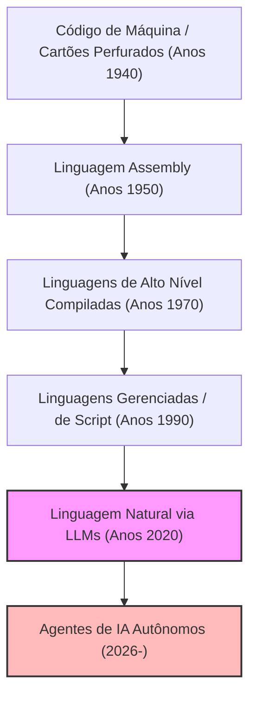
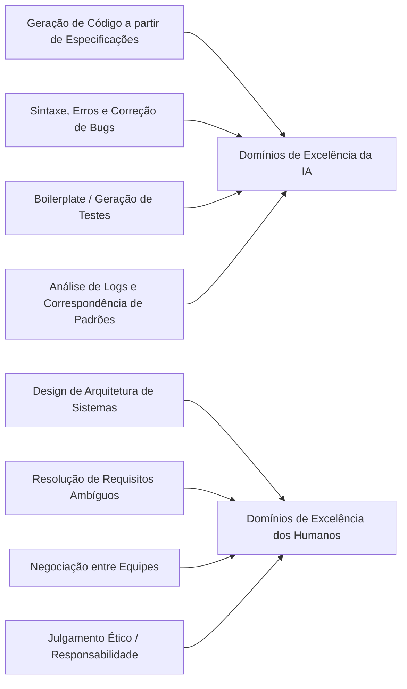
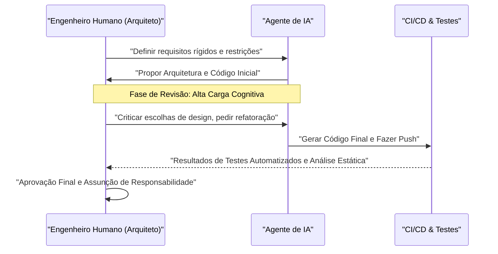

# Como os Programadores Devem Sobreviver na Era da IA? O Fim da Codificação e o Alvorecer da Nova Engenharia

Em 2026, o cenário de desenvolvimento de software está passando por um período de convulsão sem precedentes. Até poucos anos atrás, o conceito de "IA que escreve código" não passava de uma "ferramenta auxiliar" para programadores, limitada a coisas como a geração de código boilerplate (código padronizado) e autocompletar funções. No entanto, com a evolução surpreendente dos Grandes Modelos de Linguagem (LLMs), a situação virou de cabeça para baixo. A IA moderna não é mais apenas uma "máquina de escrever inteligente". Se você lhe der um documento de requisitos, ela se transforma em um "engenheiro júnior autônomo", capaz de construir de forma instantânea e autônoma todo o sistema, desde a lógica de front-end até o back-end, design de esquema de banco de dados e até a construção de pipelines CI/CD.

Nesta era, como nós, "programadores" e "engenheiros de software", devemos sobreviver? À medida que o valor econômico do próprio ato de "escrever código" se deflaciona rapidamente, os "codificadores" que apenas conhecem a sintaxe (gramática) de uma linguagem de programação específica e estão familiarizados com a API de um framework específico estão rapidamente sendo eliminados do mercado.

Neste artigo, examinaremos as estratégias de sobrevivência dos programadores na era da IA ​​com grandes detalhes, a partir de perspectivas técnicas, matemáticas e filosóficas. Esta não é apenas uma teoria de carreira, mas uma redefinição da própria disciplina da engenharia de software.

---

## 1. A História da Abstração (Abstraction) e a Redefinição da "Programação"

Olhando para a história da engenharia de software, podemos ver que sempre foi uma história de "Abstração (Abstraction)". Sempre construímos camadas para descrever sistemas cada vez mais complexos em uma linguagem mais próxima dos humanos.

Os primeiros cientistas da computação usavam cartões perfurados para operar diretamente interruptores de hardware físico e davam instruções aos computadores em linguagem de máquina (sequências de 0 e 1). Mais tarde, surgiu a linguagem Assembly, permitindo que os humanos operassem o hardware com mnemônicos fáceis de entender. Conforme o tempo avançou, linguagens de alto nível, como C e Fortran, surgiram e conseguiram encapsular detalhes complexos de hardware, como gerenciamento de memória e registradores de CPU. Com as linguagens modernas subsequentes, como Java, Python, Ruby e TypeScript, os programadores puderam se concentrar mais no "o que queremos que o computador faça (What)" em vez de "como fazer o computador funcionar (How)".

O advento da IA ​​(LLM) é a maior e mais recente mudança de paradigma nesta história de abstração. Se a evolução das linguagens de programação foi a "ocultação do hardware", a evolução dos LLMs é a "ocultação da sintaxe (gramática)".

Acabou a era em que os desenvolvedores se preocupavam com vazamentos de memória manipulando ponteiros ou escrevendo centenas de linhas de código padronizado para análise de JSON. Usar a linguagem natural (português ou inglês), a linguagem de maior nível de abstração para a humanidade, para definir sistemas se tornou o padrão para "programação" em 2026.

---

## 2. O Modelo Matemático da Produtividade: Surfando na Onda do Crescimento Exponencial

Vamos avaliar quantitativamente as melhorias de produtividade trazidas pela IA usando um modelo matemático.
A produtividade individual $P_{traditional}$ no desenvolvimento de software tradicional poderia ser modelada como uma combinação linear do nível de habilidade individual $S$, experiência de domínio $E$ e eficiência da ferramenta $T$.

$$ P_{traditional} = c_1 \cdot S + c_2 \cdot E + c_3 \cdot T $$

No entanto, no desenvolvimento moderno usando IA, a capacidade da IA $A(t)$ atua como uma "poderosa alavancagem (Multiplier)" que amplifica as capacidades humanas. Como as capacidades da IA ​​crescem exponencialmente ao longo do tempo $t$ (versão IA da Lei de Moore), a produtividade $P_{AI}(t)$ na era da IA ​​pode ser expressa pela seguinte equação.

$$ P_{AI}(t) = \alpha \cdot S_{core} \cdot e^{\beta \cdot A(t)} $$

Aqui, cada variável significa o seguinte:
*   $\alpha$: Coeficiente base de produtividade humana
*   $S_{core}$: "Habilidades humanas essenciais" que não são substituídas pela IA (design de arquitetura, compreensão de requisitos de negócios, julgamento ético, etc.)
*   $A(t)$: Capacidade absoluta do modelo de IA no tempo $t$ (contagem de parâmetros, janela de contexto, capacidade de raciocínio)
*   $\beta$: Coeficiente indicando a eficácia com que você pode extrair as ferramentas de IA (qualidade da engenharia de prompt e sofisticação do fluxo de trabalho colaborativo com a IA)

Um insight importante derivado desta fórmula é que, **em um mundo onde $A(t)$ cresce exponencialmente, habilidades tradicionais como mera velocidade de digitação e memorização de uma linguagem específica têm muito pouco impacto na produtividade geral.** Em vez disso, o coeficiente $\beta$ para surfar no crescimento exponencial da IA e a área não coberta pela IA, $S_{core}$, tornam-se os fatores dominantes que determinam o valor de mercado do engenheiro.

---

## 3. A Probabilidade de Automação de Tarefas (Probability of Automation)

Então, quais tarefas serão automatizadas e quais ficarão nas mãos de humanos?
A probabilidade $P_{auto}(T)$ de que uma determinada tarefa $T$ seja totalmente automatizada pela IA pode ser formulada da seguinte forma.

$$ P_{auto}(T) = 1 - \exp\left(-\lambda \cdot \frac{\text{Predictability}(T)}{\text{Complexity}(T) \times \text{Context Dependency}(T)}\right) $$

*   $\text{Predictability}(T)$: Previsibilidade da tarefa (quanta padronização existe nos dados anteriores)
*   $\text{Complexity}(T)$: Complexidade da tarefa
*   $\text{Context Dependency}(T)$: Força do "contexto implícito (conhecimento específico de domínio e relacionamentos humanos)" do qual a tarefa depende
*   $\lambda$: Taxa de avanço tecnológico da IA

Tarefas com alta previsibilidade e baixa dependência de contexto, como escrever o processamento de roteamento para uma API ou criar uma tela CRUD simples, se tornam $P_{auto} \approx 1$ e serão quase completamente automatizadas. Por outro lado, tarefas altamente dependentes do contexto, como "como integrar sistemas legados existentes com novos microsserviços de forma segura" ou "como projetar um fluxo de autenticação que satisfaça os requisitos do departamento jurídico sem comprometer a experiência do usuário", são difíceis de automatizar.

---

## 4. Retorno da Sintaxe (Gramática) à Arquitetura (Estrutura)

Separar claramente o que a IA faz bem e o que os humanos fazem bem é um requisito absoluto para a sobrevivência.

A IA supera os humanos na "otimização local". Nenhuma mente humana pode superar a velocidade e a precisão da IA para escrever uma função, classe ou módulo único. No entanto, a IA é extremamente vulnerável a "otimizações globais" ou "contexto ausente (Missing Context)".

Os programadores do futuro devem mudar seus papéis de "trabalhadores que escrevem código" para "arquitetos que orquestram os inúmeros componentes gerados pela IA". Observar o sistema como um todo, onde traçar limites de microsserviços, como resolver o trade-off entre disponibilidade e consistência no teorema CAP de acordo com o contexto de negócios, e como controlar a dívida técnica. Estas são tarefas intelectuais avançadas que apenas humanos, que compreendem o quadro geral e os objetivos de negócios, podem realizar.

---

## 5. A Engenharia de Requisitos é a "Verdadeira Engenharia de Prompt"

O termo "Engenharia de Prompt", que ouvimos com frequência recentemente, é muitas vezes mal compreendido como "um truque para enganar a IA e obter a saída desejada". No entanto, a essência da engenharia de prompt no desenvolvimento de software é inegavelmente a **"Engenharia de Requisitos Avançada (Requirements Engineering)"**.

Para instruir a IA em linguagem natural e fazê-la produzir o software pretendido, os seguintes elementos devem ser verbalizados de forma rigorosa:

1.  **Propósito (Why)**: Por que essa funcionalidade é necessária? Qual é o valor para o negócio?
2.  **Restrições (Constraints)**: Requisitos de desempenho (latência, rendimento), requisitos de segurança, restrições de custo.
3.  **Casos Extremos (Edge Cases)**: Processamento de fallback (alternativo) quando o usuário faz uma entrada inesperada.
4.  **Interfaces (Interfaces)**: Especificações de integração com sistemas existentes.

A partir de instruções (prompts) ambíguas, apenas sistemas ambíguos e frágeis nascerão. A capacidade de entrevistar profundamente sobre "o que o cliente realmente queria", organizar requisitos contraditórios e criar especificações (prompts) lógicas e perfeitas. Essa é a habilidade de codificação mais forte na era da IA. Os programadores passarão menos tempo no editor de código e mais tempo de frente para o Notion ou arquivos Markdown, descrevendo detalhadamente como o sistema deve ser em texto.

---

## 6. A Vantagem Esmagadora do Conhecimento de Domínio (Domain Knowledge)

Como a IA aprende a partir do código de código aberto e da documentação pública do mundo todo, ela é bem versada em tecnologias e algoritmos web gerais. No entanto, há dados que a IA não pode acessar. Estas são as "regras de negócios específicas da sua empresa" e o "conhecimento de domínio profundamente enraizado em um setor específico (médico, financeiro, manufatura, etc.)".

Por exemplo, suponha que você esteja desenvolvendo um sistema de prontuário eletrônico em uma startup médica. A IA sabe "como construir uma interface de tabela com React" e a "estrutura de dados geral do HL7 FHIR". No entanto, ela não aprendeu o conhecimento tácito, como "em qual departamento específico do Hospital A, em que ordem os médicos visualizam os dados dos pacientes e que tipo de interface de usuário pode minimizar o risco de erros médicos".

Em um mundo onde a tecnologia em si está se tornando uma commodity (produto padronizado), o verdadeiro valor de um engenheiro está na interseção entre a "tecnologia" e o "domínio de negócios". Não se trata mais apenas de competir com a proficiência técnica, mas o talento que tem conhecimento especializado profundo em um domínio específico, como médico, financeiro, logística ou entretenimento, e que pode resolver problemas naquele domínio usando a poderosa ferramenta da IA, irá liderar o mercado no futuro.

---

## 7. O "Problema do Bonde" no Desenvolvimento de Software: Quem assume a responsabilidade?

À medida que nossa dependência da IA aumenta, enfrentamos problemas filosóficos e éticos sérios. É a questão da "onde reside a responsabilidade" na engenharia de software.

Se o código gerado autonomamente pela IA causar um bug grave no ambiente de produção, resultando em centenas de milhões de dólares de perdas para a empresa, ou causar o mau funcionamento de um sistema médico com risco de morte, quem assumirá a responsabilidade por isso? A empresa que desenvolveu o modelo de IA? Ou o engenheiro que inseriu o prompt? Não se pode "demitir" ou "prender" a IA.

Não importa o quanto a tecnologia avance, o papel do "humano" como sujeito de assumir a "Responsabilidade (Accountability)" legal e ética pelo impacto que o sistema tem na sociedade não desaparecerá. Em vez disso, quanto mais o processo de geração de código se tornar uma caixa-preta, maior será a responsabilidade dos humanos como "Aprovadores finais (Approver)" e "Supervisores (Supervisor)" do sistema.

Auditar se a arquitetura e o código propostos pela IA atendem aos padrões de segurança, se não têm problemas éticos (se há viés incluído) e se cumprem com o compliance, e dar a aprovação final. Esse ato de "assumir a responsabilidade" em si se tornará uma parte importante do trabalho de um engenheiro.

---

## 8. O Pareamento de Programação com a IA e o Gerenciamento da Carga Cognitiva (Cognitive Load)

Ao trabalhar com a IA, a natureza da nossa "Carga Cognitiva (Cognitive Load)" também muda. A carga cognitiva ao escrever código do zero e a carga cognitiva ao ler e analisar centenas de linhas de código desconhecido gerado pela IA são completamente diferentes.

De acordo com a teoria da carga cognitiva em psicologia, ao processar informações complexas que não correspondem aos esquemas existentes (a estrutura de conhecimento no cérebro), a memória de trabalho humana se esgota rapidamente. O código gerado pela IA às vezes contém otimizações sofisticadas que os humanos não conseguiriam imaginar, e às vezes contém "Alucinações (Hallucinations)" que ignoram o contexto.

Para evitar isso, é necessário sistematizar o processo de revisão para a IA.

Os humanos precisam maximizar não as habilidades de "escrever", mas as habilidades de "ler rapidamente e detectar falhas lógicas instantaneamente (Code Reading & Auditing)". A importância do Desenvolvimento Orientado a Testes (TDD) está aumentando ainda mais na era da IA. A abordagem padrão se tornará aquela em que um humano ou outra IA escreve um código de teste rigoroso antes de deixar a IA escrever o código, e fazer a IA modificar o código até que passe nesses testes.

---

## 9. Estratégia Específica de Sobrevivência: O que você deve aprender a partir de amanhã

Com base na análise até este ponto, propomos um plano de ação concreto para que os programadores sobrevivam à era da IA.

1.  **Reaprender minuciosamente as "bases" da tecnologia**: Você pode deixar o uso de frameworks para a IA. No entanto, é absolutamente necessário um entendimento profundo de como os sistemas operacionais funcionam, protocolos de rede (TCP/IP, HTTP/3), estrutura interna de bancos de dados (B-Tree, níveis de isolamento de transações), estruturas de dados e algoritmos. Uma base sólida de ciência da computação é essencial para julgar se o resultado da IA ​​está correto.
2.  **Dominar a Arquitetura de Nuvem e os Sistemas Distribuídos**: Em vez de códigos individuais, concentre-se em como combinar recursos de nuvem como AWS, GCP e Azure para criar sistemas escaláveis. Entenda conceitos de IaC (Infrastructure as Code) como Terraform, e cultive a capacidade de projetar todo o sistema como código.
3.  **Tornar-se um especialista em domínio de negócios**: Estude profundamente o modelo de negócios da indústria à qual pertence, os regulamentos legais e a psicologia comportamental do usuário. Vá além dos limites de um engenheiro e tenha uma perspectiva mais próxima de um Gerente de Produto (PM).
4.  **Polir as habilidades de comunicação e facilitação**: O processo de resolução da "ambiguidade" que existe entre humanos para alcançar um consenso não pode ser substituído pela IA. As soft skills (habilidades interpessoais) para se comunicar com as partes interessadas (stakeholders) e descobrir desafios genuínos se tornarão a habilidade de maior valor.
5.  **Utilizar a IA ao máximo como um "colega"**: Não tenha medo da evolução das ferramentas de IA, use-as como sua arma mais poderosa. Use LLMs modernos ou agentes de codificação baseados em IA diariamente e acumule "conhecimento tácito" de onde a IA falha e como criar prompts para obter o melhor desempenho.

---

## Conclusão: Não tenha medo, surfe na onda

A automação da programação pela IA não significa a "morte" da profissão de programador. Em vez disso, é uma **"Renascença (Renascimento Cultural)"** que nos liberta do "trabalho não essencial" no desenvolvimento de software, como corrigir erros de digitação, solucionar problemas de construção de ambiente ou escrever códigos boilerplate entediantes.

Historicamente, seja com o advento do tear mecânico ou do software de planilha (Excel), espalhou-se o pessimismo de que os empregos desapareceriam. Mas a realidade é que o aumento drástico na produtividade criou uma nova demanda e levou a trabalhos de nível superior. A mesma coisa vai acontecer no mundo do software. À medida que se torna possível "construir sistemas de forma barata", o software permeará em todas as áreas que não foram transformadas em TI devido à falta de custo-benefício até o momento, e os problemas que os engenheiros devem resolver (What) se expandirão infinitamente.

A nós programadores, está sendo dada a chance de evoluirmos de artesãos que escrevem código para "maestros de uma orquestra" que comandam a poderosa inteligência que é a IA. Em vez de ficar morrendo de medo das ondas de tecnologia e permanecer na costa, vamos surfar nessa onda cedo e zarpar para uma jornada de criar sistemas ainda maiores e mais valiosos. A era da IA é a era em que a "Engenharia" em seu verdadeiro sentido irá começar.
