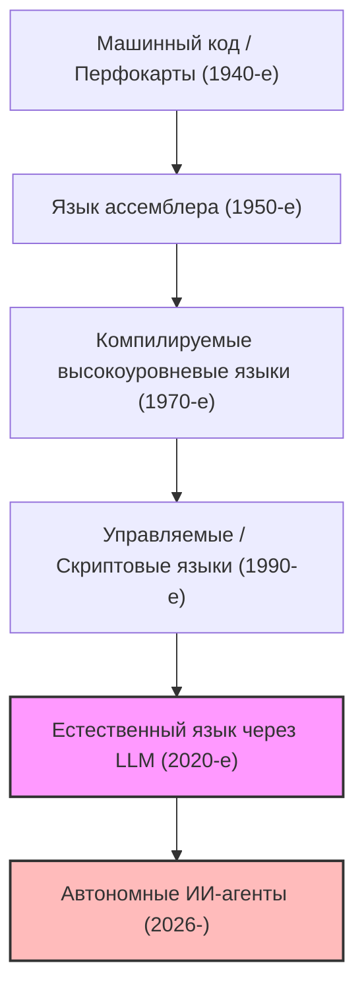
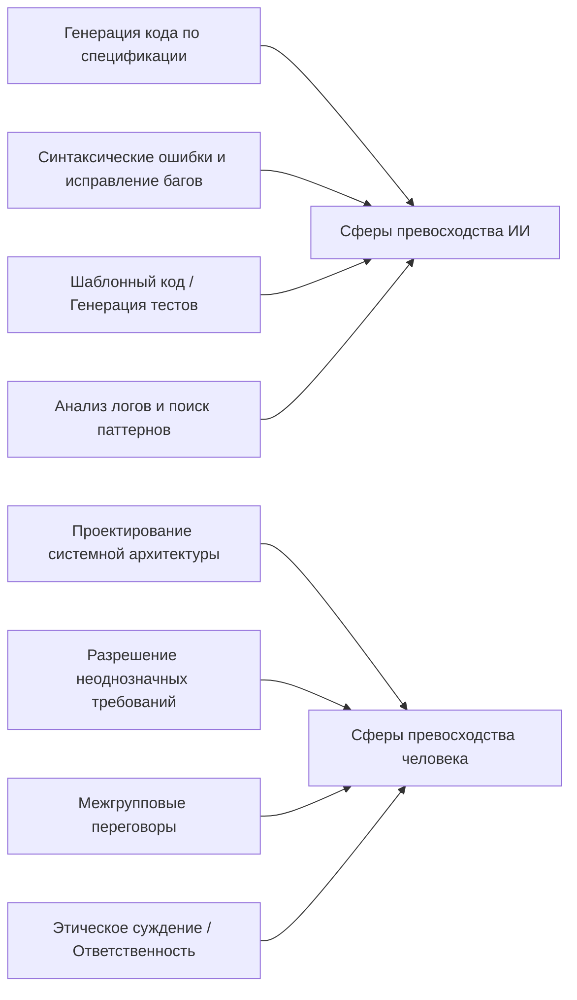
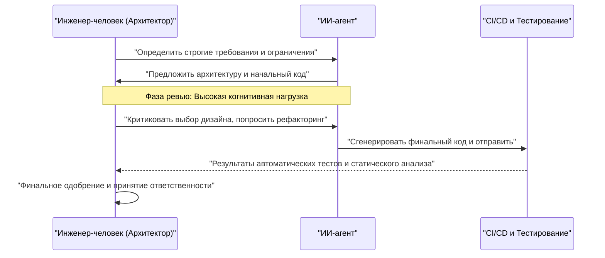

# Как программистам выжить в эпоху ИИ? Конец кодинга и рассвет новой инженерии

По состоянию на 2026 год сфера разработки программного обеспечения переживает период беспрецедентных потрясений. Всего несколько лет назад концепция «ИИ пишет код» сводилась, в лучшем случае, к роли «вспомогательного инструмента» программиста: генерации шаблонного кода (boilerplate) и автодополнению функций. Однако благодаря ошеломляющей эволюции больших языковых моделей (LLM) ситуация в корне изменилась. Современный ИИ — это не просто «умная пишущая машинка». Стоит лишь дать ему спецификацию требований, и он превращается в «автономного младшего инженера», способного мгновенно и самостоятельно собрать всю систему: от фронтенда до бэкенд-логики, проектирования схемы базы данных и даже настройки пайплайна CI/CD.

Как же в такую эпоху выжить нам, «программистам» и «инженерам-программистам»? В то время как экономическая ценность самого процесса «написания кода» стремительно падает, «кодеры», знающие лишь синтаксис конкретного языка программирования и хорошо разбирающиеся в API определенного фреймворка, быстро вытесняются с рынка.

В этой статье мы подробно рассмотрим стратегии выживания программистов в эпоху ИИ с технической, математической и философской точек зрения. Это не просто рассуждения о карьере, а переосмысление программной инженерии как дисциплины.

---

## 1. История абстракции (Abstraction) и переосмысление «программирования»

Оглядываясь на историю программной инженерии, можно заметить, что это всегда была история «абстракции». Мы постоянно создавали слои, чтобы описывать всё более сложные системы на языке, всё более близком к человеческому.

Первые специалисты в области вычислительной техники с помощью перфокарт напрямую переключали физические тумблеры оборудования, отдавая компьютеру команды в машинном коде (последовательностях 0 и 1). Затем появился язык ассемблера, позволивший управлять оборудованием с помощью понятной человеку мнемоники. С течением времени появились высокоуровневые языки, такие как C и Fortran, которые успешно инкапсулировали сложные детали оборудования: управление памятью и регистры CPU. Появление современных языков, таких как Java, Python, Ruby и TypeScript, позволило программистам сосредоточиться не на том, «как заставить компьютер работать (How)», а на том, «что мы хотим, чтобы компьютер сделал (What)».

Появление ИИ (LLM) является новейшим и величайшим сдвигом парадигмы в этой истории абстракции. Если эволюция языков программирования заключалась в «сокрытии оборудования», то эволюция LLM — это «сокрытие синтаксиса (грамматики)».

Эпоха, когда разработчики беспокоились об утечках памяти, управляя указателями, или писали сотни строк шаблонного кода для парсинга JSON, подошла к концу. Определение систем с использованием естественного языка (японского, английского и др.), как наиболее высокоуровневой абстракции для человечества, стало стандартом «программирования» в 2026 году.

---

## 2. Математическая модель продуктивности: на гребне волны экспоненциального роста

Давайте количественно оценим рост продуктивности, обусловленный ИИ, с помощью математической модели.
Личную продуктивность $P_{traditional}$ в традиционной разработке программного обеспечения можно было смоделировать как линейную комбинацию уровня индивидуальных навыков $S$, опыта в предметной области $E$ и эффективности инструментов $T$.

$$ P_{traditional} = c_1 \cdot S + c_2 \cdot E + c_3 \cdot T $$

Однако в современной разработке с использованием ИИ возможности ИИ $A(t)$ действуют как «мощный рычаг (Multiplier)», усиливающий способности человека. Поскольку возможности ИИ растут экспоненциально с течением времени $t$ (версия закона Мура для ИИ), продуктивность в эпоху ИИ $P_{AI}(t)$ может быть выражена следующим уравнением:

$$ P_{AI}(t) = \alpha \cdot S_{core} \cdot e^{\beta \cdot A(t)} $$

Где каждая переменная означает следующее:
*   $\alpha$: Базовый коэффициент продуктивности человека
*   $S_{core}$: «Ключевые человеческие навыки», которые не может заменить ИИ (проектирование архитектуры, понимание бизнес-требований, этические суждения и т. д.)
*   $A(t)$: Абсолютные возможности модели ИИ в момент времени $t$ (количество параметров, размер контекстного окна, способность к рассуждениям)
*   $\beta$: Коэффициент, показывающий, насколько эффективно используются инструменты ИИ (качество промпт-инжиниринга и продуманность совместных рабочих процессов с ИИ)

Важный вывод из этой формулы заключается в том, что **в мире, где $A(t)$ растет экспоненциально, традиционные навыки, такие как скорость печати или заучивание конкретного языка, оказывают крайне незначительное влияние на общую продуктивность**. Вместо этого коэффициент $\beta$, позволяющий оседлать экспоненциальный рост ИИ, и $S_{core}$, представляющий собой область, недоступную ИИ, становятся доминирующими факторами, определяющими рыночную стоимость инженера.

---

## 3. Вероятность автоматизации задач (Probability of Automation)

Итак, какие задачи будут автоматизированы, а какие останутся в руках человека?
Вероятность $P_{auto}(T)$ того, что задача $T$ будет полностью автоматизирована ИИ, может быть сформулирована следующим образом:

$$ P_{auto}(T) = 1 - \exp\left(-\lambda \cdot \frac{\text{Predictability}(T)}{\text{Complexity}(T) \times \text{Context Dependency}(T)}\right) $$

*   $\text{Predictability}(T)$: Предсказуемость задачи (насколько очевидны паттерны в исторических данных)
*   $\text{Complexity}(T)$: Сложность задачи
*   $\text{Context Dependency}(T)$: Сила «неявного контекста» (знаний, специфичных для предметной области, или человеческих отношений), от которого зависит задача
*   $\lambda$: Скорость технического прогресса ИИ

Задачи с высокой предсказуемостью и низкой зависимостью от контекста, такие как написание обработки маршрутизации API или создание простого экрана CRUD, будут иметь $P_{auto} \approx 1$ и автоматизируются почти полностью. С другой стороны, автоматизировать задачи с чрезвычайно высокой зависимостью от контекста, такие как «как безопасно интегрировать устаревшие системы (legacy) с новыми микросервисами» или «как спроектировать процесс аутентификации, который удовлетворяет требованиям юридического отдела, не портя пользовательский опыт», крайне сложно.

---

## 4. Возврат от синтаксиса (грамматики) к архитектуре (структуре)

Четкое разделение того, в чем хорош ИИ, и того, в чем силен человек, является абсолютным условием для выживания.

ИИ превосходит человека в «локальной оптимизации». У человека нет шансов в скорости и точности написания одной функции, одного класса или одного модуля. Однако ИИ крайне уязвим перед «глобальной оптимизацией» и «отсутствием контекста (Missing Context)».

Отныне программисты должны сменить свою роль с «рабочих, пишущих код» на «архитекторов, оркеструющих бесчисленные компоненты, сгенерированные ИИ». Способность окинуть взглядом систему в целом, определить, где провести границы микросервисов, как разрешить компромисс между доступностью и согласованностью (теорема CAP) в бизнес-контексте, и как управлять техническим долгом — всё это высокоинтеллектуальная работа, которую может выполнять только человек, понимающий общую картину и бизнес-цели.

---

## 5. Определение требований — это и есть «истинный промпт-инжиниринг»

Термин «промпт-инжиниринг», который так часто звучит в последнее время, нередко ошибочно воспринимается как «хак для обмана ИИ с целью получения желаемого результата». Однако суть промпт-инжиниринга в разработке программного обеспечения, несомненно, заключается в **«продвинутом определении требований (Requirements Engineering)»**.

Чтобы дать ИИ инструкции на естественном языке и получить именно то программное обеспечение, которое было задумано, необходимо строго вербализовать следующие элементы:

1.  **Цель (Why)**: Зачем нужна эта функция. Какова ее бизнес-ценность.
2.  **Ограничения (Constraints)**: Требования к производительности (задержка, пропускная способность), требования к безопасности, ограничения по стоимости.
3.  **Пограничные случаи (Edge Cases)**: Резервная логика (fallback) на случай неожиданного ввода пользователя.
4.  **Интерфейсы (Interfaces)**: Спецификации интеграции с существующими системами.

Из расплывчатых инструкций (промптов) рождаются только расплывчатые и хрупкие системы. Способность глубоко выяснять, «что на самом деле хотел клиент», разрешать противоречивые требования и создавать спецификации (промпты) без логических изъянов — это и есть самый сильный «навык кодинга» в эпоху ИИ. Программисты будут проводить всё больше времени не в редакторах кода, а в Notion или Markdown-файлах, тщательно описывая идеальное состояние системы текстом.

---

## 6. Подавляющее преимущество предметных знаний (Domain Knowledge)

Поскольку ИИ обучается на открытом исходном коде и публичной документации со всего мира, он хорошо разбирается в общих веб-технологиях и алгоритмах. Однако есть данные, к которым у ИИ нет доступа. Это «уникальные бизнес-правила вашей компании» и «глубоко укоренившиеся знания предметной области (домена), специфичные для конкретной отрасли (медицина, финансы, производство и т. д.)».

Например, предположим, что медицинский стартап разрабатывает систему электронных медицинских карт. ИИ знает, «как создать табличный интерфейс в React» или «общую структуру данных HL7 FHIR». Однако он не знает таких неявных вещей, как «в определенном отделении больницы А, в каком порядке врач просматривает данные пациента и какой пользовательский интерфейс сведет к минимуму риск врачебной ошибки».

В мире, где сами технологии становятся коммодити (товаром широкого потребления), истинная ценность инженера рождается на пересечении «технологий» и «бизнес-домена». Рынок будущего возглавят не те, кто конкурирует только за счет технических навыков, а те, кто обладает глубокими экспертными знаниями в конкретной предметной области (медицина, финансы, логистика, развлечения и др.) и может решать её проблемы, используя ИИ как мощный инструмент.

---

## 7. «Проблема вагонетки» в разработке ПО: кто несет ответственность?

По мере роста нашей зависимости от ИИ мы сталкиваемся с серьезной философской и этической проблемой — проблемой «локализации ответственности» в программной инженерии.

Если код, автономно сгенерированный ИИ, вызовет серьезный баг в продакшене, который принесет компании убытки в миллионы долларов, или приведет к сбою в медицинской системе, от которой зависят жизни людей, кто будет нести ответственность? Компания, разработавшая модель ИИ? Или инженер, который ввел промпт? ИИ нельзя «уволить» или «арестовать».

Роль «человека» как субъекта, берущего на себя «юридическую и этическую ответственность (Accountability)» за влияние системы на общество, не исчезнет, как бы ни развивались технологии. Напротив, чем более непрозрачным (black box) становится процесс генерации кода, тем большую ответственность несет человек как «финальный утверждающий (Approver)» и «контролер (Supervisor)» системы.

Аудит предложенной ИИ архитектуры и кода на соответствие стандартам безопасности, отсутствие этических проблем (таких как предвзятость), соблюдение нормативных требований (комплаенс) и, наконец, выдача окончательного разрешения. Сам акт «принятия ответственности» становится важной частью работы инженера.

---

## 8. Парное программирование с ИИ и управление когнитивной нагрузкой (Cognitive Load)

При работе с ИИ природа «когнитивной нагрузки (Cognitive Load)» человека также меняется. Когнитивная нагрузка при написании кода с нуля и когнитивная нагрузка при «чтении и ревью» сотен строк неизвестного кода, сгенерированного ИИ, — это совершенно разные вещи.

Согласно психологической теории когнитивной нагрузки, когда мы обрабатываем сложную информацию, которая не соответствует нашим существующим схемам (структурам знаний в голове), наша рабочая память быстро истощается. Код, сгенерированный ИИ, иногда содержит продвинутые оптимизации, до которых человек мог бы не додуматься, но при этом может содержать «галлюцинации», игнорирующие контекст.

Чтобы предотвратить это, необходимо систематизировать процесс ревью для ИИ.

Людям необходимо развивать навыки «скорочтения и мгновенного выявления логических ошибок (Code Reading & Auditing)» в еще большей степени, чем навыки «написания». Важность разработки через тестирование (TDD) в эпоху ИИ возрастает еще больше. До того, как позволить ИИ писать код, преобладающим подходом станет тот, при котором человек или другой ИИ пишет строгие тестовые сценарии, а затем заставляет ИИ исправлять код до тех пор, пока он не пройдет эти тесты.

---

## 9. Конкретные стратегии выживания: что изучать завтра

Основываясь на проведенном выше анализе, предлагаем конкретный план действий для выживания программистов в эпоху ИИ.

1.  **Тщательно изучите «основы» технологий**: Использование фреймворков можно доверить ИИ. Однако глубокое понимание устройства ОС, сетевых протоколов (TCP/IP, HTTP/3), внутреннего устройства баз данных (B-Tree, уровни изоляции транзакций), а также структур данных и алгоритмов является абсолютно необходимым. Прочный фундамент компьютерных наук (Computer Science) жизненно важен для того, чтобы судить о правильности результатов ИИ.
2.  **Освойте облачную архитектуру и распределенные системы**: Сосредоточьтесь не на написании отдельных кусков кода, а на том, как комбинировать облачные ресурсы AWS, GCP или Azure для создания масштабируемых систем. Поймите концепцию IaC (Infrastructure as Code), например Terraform, и развивайте способность проектировать всю систему в виде кода.
3.  **Станьте экспертом в бизнес-домене**: Глубоко изучите бизнес-модель, нормативно-правовую базу и психологию поведения пользователей в вашей отрасли. Выходите за рамки обычного инженера и стремитесь к взгляду, близкому к продакт-менеджеру (PM).
4.  **Оттачивайте навыки коммуникации и фасилитации**: Процесс разрешения «неоднозначностей» между людьми и достижения консенсуса не может быть заменен ИИ. Soft skills (гибкие навыки), необходимые для общения со стейкхолдерами и выявления истинных проблем, станут самыми ценными.
5.  **Используйте ИИ как своего «коллегу»**: Не бойтесь эволюции инструментов ИИ, а используйте их как свое самое мощное оружие. Ежедневно применяйте новейшие LLM и ИИ-агенты для кодинга, накапливая «неявные знания» о том, где ИИ ошибается и как нужно изменить промпт, чтобы добиться от него максимальной эффективности.

---

## Заключение: не бойтесь, оседлайте волну

Автоматизация программирования с помощью ИИ не означает «смерть» профессии программиста. Скорее, это **«Ренессанс (возрождение)»**, который освобождает нас от «несущественного труда» в разработке ПО: исправления опечаток, устранения проблем при настройке окружения или написания скучного шаблонного кода.

Исторически сложилось так, что с появлением автоматических ткацких станков или электронных таблиц (Excel) преобладал пессимизм по поводу исчезновения рабочих мест. Но в реальности резкий скачок продуктивности создал новый спрос и привел к появлению более продвинутой работы. То же самое произойдет и в мире программного обеспечения. По мере того, как «создавать системы становится дешевле», ПО будет проникать во все те области, которые раньше не были автоматизированы из-за нерентабельности, и количество проблем (What), которые должны решать инженеры, будет расширяться бесконечно.

Сегодня мы, программисты, получили шанс эволюционировать от ремесленников, пишущих код, до «дирижеров оркестра», управляющих мощным интеллектом ИИ. Вместо того чтобы со страхом перед технологической волной оставаться на берегу, давайте как можно скорее оседлаем эту волну и отправимся в путешествие за созданием всё более масштабных и ценных систем. Эпоха ИИ — это время, когда начинается истинная «инженерия».
