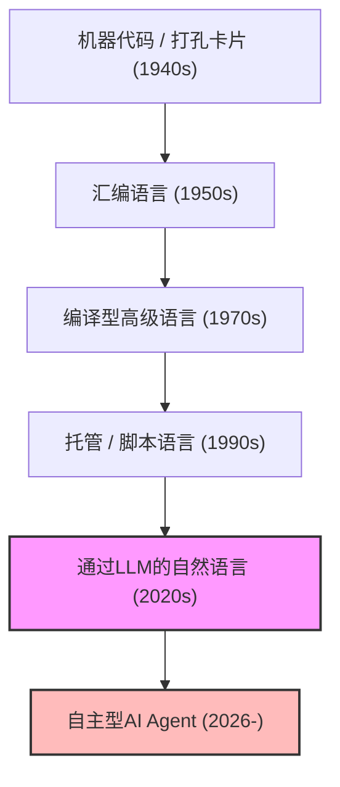
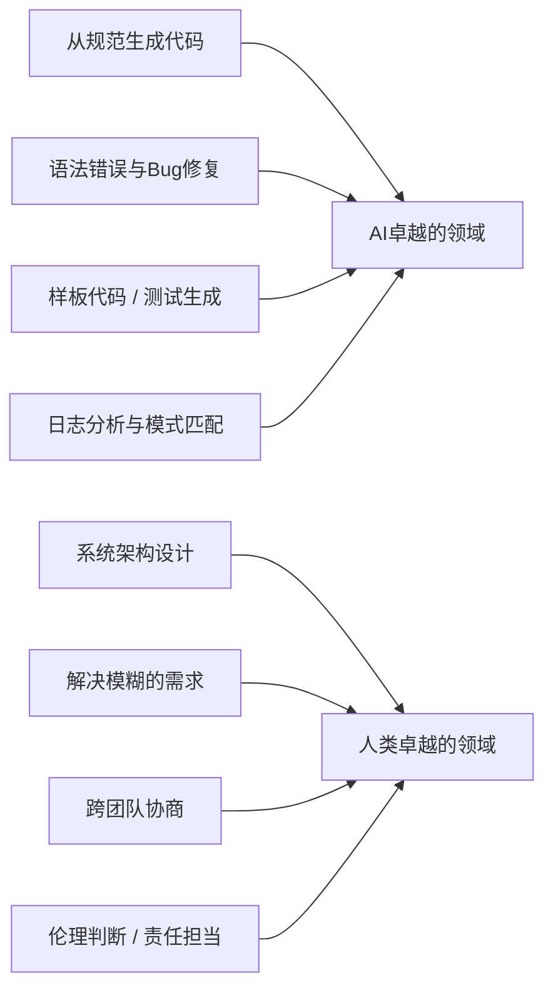
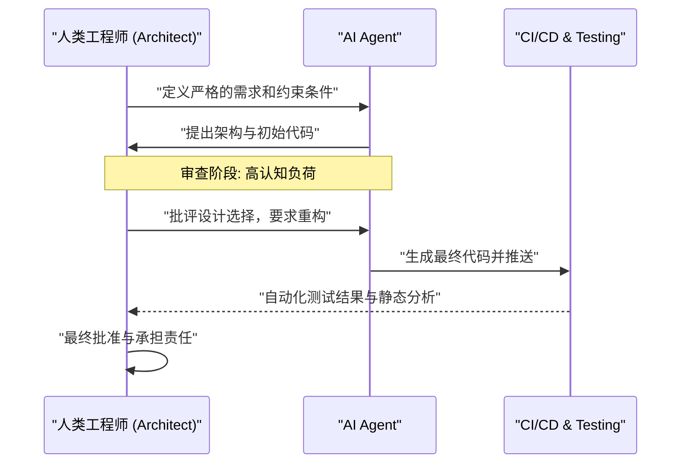

# AI时代的程序员该如何生存？编码的终结与新工程学的开端

2026年现在，软件开发领域正处于前所未有的剧变期。就在几年前，“AI写代码”的概念顶多还停留在生成样板代码（Boilerplate）或函数自动补全等作为程序员“辅助工具”的角色。然而，随着大型语言模型（LLM）的惊人进化，情况发生了根本性的颠覆。现代的AI不仅仅是一台“聪明的打字机”，只要提供需求定义文档，从前端到后端逻辑、数据库的Schema设计，甚至到CI/CD流水线的构建，它都已经蜕变成为能够在瞬间自主组建整个系统的“自主型初级工程师”。

在这样的时代，我们“程序员”或“软件工程师”该如何生存下来？在“写代码”这一行为本身的经济价值正在急剧通货紧缩的过程中，仅仅了解特定编程语言的语法（Syntax）、熟悉特定框架API的“编码员（Coder）”，正迅速被市场淘汰。

本文将从技术、数学以及哲学的角度，极其详细地探讨AI时代下程序员的生存策略。这不仅是单纯的职业发展论，更是对软件工程这门学问本身的重新定义。

---

## 1. 抽象化（Abstraction）的历史与“编程”的重新定义

回顾软件工程的历史，我们可以发现这始终是一部“抽象化（Abstraction）”的历史。我们总是致力于构建能用更接近人类的语言来描述更复杂系统的分层（Layer）。

早期的计算机科学家使用打孔卡片直接操作物理硬件的开关，用机器代码（0和1的排列）给计算机下达指令。之后汇编语言登场，人类开始能够用容易理解的助记符来操作硬件。随着时代的发展，C语言、Fortran等高级语言出现，成功地将内存管理、CPU寄存器等硬件的复杂细节封装了起来。紧接着Java、Python、Ruby、TypeScript等现代语言的问世，让程序员能够将精力更多地集中在“想让计算机做什么（What）”上，而不是“如何让计算机运行（How）”。

AI（LLM）的出现，是这部抽象化历史中最新也是最大的一次范式转移。如果说编程语言的进化是“硬件的隐藏”，那么LLM的进化就是“语法（Syntax）的隐藏”。

开发者一边担心内存泄漏一边操作指针，或者为了解析JSON而写上百行样板代码的时代已经结束了。使用人类抽象度最高的自然语言（如中文或英文等）来定义系统，已经成为2026年“编程”的标准。

---

## 2. 生产力的数学模型：顺应指数级增长的浪潮

让我们尝试用数学模型来定量评估AI带来的生产力提升。
传统软件开发中个人的生产力 $P_{traditional}$，可以被建模为个人技能水平 $S$、领域经验 $E$ 以及工具效率 $T$ 的线性组合。

$$ P_{traditional} = c_1 \cdot S + c_2 \cdot E + c_3 \cdot T $$

然而，在利用AI的现代开发中，AI的能力 $A(t)$ 成为放大人类能力的“强大杠杆（Multiplier）”。由于AI的能力会随着时间 $t$ 的推移呈指数级增长（AI版的摩尔定律），因此AI时代的生产力 $P_{AI}(t)$ 可以用以下方程式来表示。

$$ P_{AI}(t) = \alpha \cdot S_{core} \cdot e^{\beta \cdot A(t)} $$

这里各变量的含义如下：
*   $\alpha$: 基准的人类生产力系数
*   $S_{core}$: 不会被AI替代的“人类核心技能”（架构设计、对业务需求的理解、伦理判断等）
*   $A(t)$: 在时刻 $t$ 时AI模型的绝对能力（参数量、上下文窗口、推理能力）
*   $\beta$: 表示能多大程度有效地发挥AI工具潜力的系数（提示词工程的质量、与AI协同工作流的熟练度）

从这个公式中推导出的重要见解是，**在 $A(t)$ 呈指数级增长的世界里，单纯的打字速度或对特定语言的死记硬背等传统技能，对整体生产力的影响将变得极小**。取而代之的是，能够乘上AI指数级增长浪潮的系数 $\beta$，以及AI无法覆盖的领域 $S_{core}$，将成为决定工程师市场价值的主导因素。

---

## 3. 任务的自动化概率（Probability of Automation）

那么，哪些任务会被自动化，哪些任务会保留在人类手中呢？
某项任务 $T$ 被AI完全自动化的概率 $P_{auto}(T)$，可以这样公式化：

$$ P_{auto}(T) = 1 - \exp\left(-\lambda \cdot \frac{\text{Predictability}(T)}{\text{Complexity}(T) \times \text{Context Dependency}(T)}\right) $$

*   $\text{Predictability}(T)$: 任务的可预测性（过去的数据中存在多少规律）
*   $\text{Complexity}(T)$: 任务的复杂性
*   $\text{Context Dependency}(T)$: 任务所依赖的“隐式上下文（领域特定知识或人际关系）”的强度
*   $\lambda$: AI的技术进步率

编写API的路由处理、制作简单的CRUD页面等可预测性高且上下文依赖性低的任务，$P_{auto} \approx 1$，将几乎被完全自动化。另一方面，“如何将现有的遗留系统与新的微服务安全集成”、“如何在满足法务部门要求的同时，设计出不损害用户体验的认证流程”等上下文依赖性极高的任务则很难被自动化。

---

## 4. 从语法（Syntax）向架构（结构）的回归

明确区分AI擅长的事与人类擅长的事，是生存的绝对条件。

AI在“局部优化”方面已经超越了人类。在编写一个函数、一个类或单个模块的速度与准确性上，人类毫无胜算。但是，AI面对“全局优化”或“上下文缺失（Missing Context）”时却非常脆弱。

未来的程序员必须将角色从“写代码的劳动者”转变为“编排AI生成的无数组件的架构师”。俯瞰整个系统，在哪里划定微服务边界？如何根据业务背景解决CAP定理中可用性与一致性的权衡？如何控制技术债务？这些都是只有理解全貌和业务目标的人类才能胜任的高级脑力劳动。

---

## 5. 需求定义才是“真正的提示词工程”

最近常听到的“提示词工程”一词，经常被误解为“为了欺骗AI以获得目标输出的Hack技巧”。但是，软件开发中的提示词工程的本质，毫无疑问就是**“高级需求定义（Requirements Engineering）”**。

为了用自然语言向AI下达指令并让其输出意图中的软件，必须严格地将以下要素语言化：

1.  **目的（Why）**: 为什么需要这个功能。业务价值是什么。
2.  **约束条件（Constraints）**: 性能要求（延迟、吞吐量）、安全要求、成本限制。
3.  **边缘情况（Edge Cases）**: 当用户输入意外内容时的回退处理。
4.  **接口（Interfaces）**: 与现有系统的集成规范。

模糊的指令（提示词）只能产生模糊且脆弱的系统。深入听取“客户真正想要的东西”，整理相互矛盾的需求，编写没有逻辑漏洞的规范文档（提示词）的能力。这才是AI时代最强的“编码技能”。程序员将不再整天面对代码编辑器，而是花更多时间面对Notion或Markdown文件，用文本精细地描述系统应有的样子。

---

## 6. 领域知识（Domain Knowledge）的绝对优势

因为AI学习了全世界的开源代码和公开文档，所以它对一般的Web技术和算法了如指掌。但是，有些数据是AI无法访问的。那就是“你公司特有的业务规则”，以及“深深扎根于特定行业（医疗、金融、制造等）的领域知识”。

例如，假设在一家医疗初创公司开发电子病历系统。AI知道“如何用React制作表格UI”以及“HL7 FHIR的一般数据结构”。但是，它并没有学习到诸如“在A医院的特定科室，医生应该按什么顺序查阅患者数据，采用什么样的UI才能将医疗失误的风险降至最低”这类隐性知识。

在技术本身日益商品化（通用化）的世界里，工程师真正的价值诞生于“技术”与“业务领域”的交叉点。不仅仅拼技术能力，而是要在医疗、金融、物流、娱乐等特定领域拥有深厚的专业知识，并能利用AI这一强大的工具解决该领域课题的人才，将引领未来的市场。

---

## 7. 软件开发的“电车难题”：谁来承担责任

随着对AI依赖度的增加，我们将面临重大的哲学与伦理问题。那就是软件工程中“责任归属”的问题。

如果AI自主生成的代码在生产环境中引发严重Bug，给企业造成数亿的损失，或者在关乎人命的医疗系统中发生故障，谁来为此承担责任？是开发AI模型的企业吗？还是输入提示词的工程师？我们无法“解雇”或“逮捕”AI。

无论技术如何进步，人类作为承担系统对社会影响的“法律与伦理责任（Accountability）”主体的角色都不会消失。反而，代码生成过程越是黑盒化，人类作为系统的“最终批准者（Approver）”及“监督者（Supervisor）”所承担的责任就越重。

审计AI提出的架构或代码是否满足安全标准、是否存在伦理问题（是否包含偏见）、是否遵守合规性，并下达最终的许可。这个“承担责任”的行为本身，将成为工程师的重要工作之一。

---

## 8. AI结对编程与认知负荷（Cognitive Load）的管理

在与AI共事的过程中，人类的“认知负荷（Cognitive Load）”的性质也在发生变化。从零开始写代码时的认知负荷，与“阅读并审查”AI生成的数百行未知代码时的认知负荷是截然不同的。

根据心理学的认知负荷理论，在处理不符合现有图式（大脑中的知识结构）的复杂信息时，人类的工作记忆会迅速耗尽。AI生成的代码有时会包含人类想不到的高级优化，但另一方面，也可能包含无视上下文的“幻觉（Hallucination）”。

为了防止这种情况，必须将对AI的审查过程系统化。

人类需要将“快速阅读并瞬间看穿逻辑缺陷（Code Reading & Auditing）”的技能提升到极致，这比“写”的技能更重要。在AI时代，测试驱动开发（TDD）的重要性进一步凸显。主流的方法将变成：在让AI写代码之前，先由人类或另一个AI编写严格的测试代码，然后让AI不断修改代码直到通过这些测试。

---

## 9. 具体的生存策略：从明天起该学些什么

基于以上的分析，我们提出程序员在AI时代生存的具体行动计划。

1.  **彻底重新学习技术的“基础”**: 框架的使用方法交给AI即可。但是，对操作系统的机制、网络协议（TCP/IP, HTTP/3）、数据库的内部结构（B-Tree, 事务隔离级别）、数据结构与算法的深刻理解是绝对必要的。为了判断AI的输出是否正确，坚实的计算机科学基础不可或缺。
2.  **掌握云架构与分布式系统**: 不要将精力放在个别代码上，而应专注于如何组合AWS、GCP、Azure等云资源来构建可扩展的系统。理解Terraform等IaC（基础设施即代码）的概念，培养将整个系统作为代码进行设计的能力。
3.  **成为业务领域的专家**: 深入学习自己所在行业的商业模式、法律法规以及用户的行为心理。要超越工程师的局限，具备接近产品经理（PM）的视角。
4.  **磨炼沟通与引导的技能**: 解决人与人之间的“模糊性”并达成共识的过程，是AI无法替代的。与利益相关者对话，发现真正课题的软技能，将成为最有价值的技能。
5.  **将AI作为“同事”充分利用**: 不要害怕AI工具的进化，而要将其作为最强大的武器来利用。在日常工作中频繁使用最新的LLM和AI编程代理，积累关于“AI在哪里会失败”、“如何调整提示词才能发挥其最佳性能”的“隐性知识”。

---

## 结论：不要畏惧，去驾驭这股浪潮

AI带来的编程自动化并不意味着程序员这个职业的“死亡”。相反，这更像是一场**“文艺复兴”**，它将我们从修复拼写错误、排查环境配置故障、编写枯燥的样板代码等软件开发中“非本质的劳动”里解放出来。

在历史上，无论是自动织布机出现时，还是电子表格软件（Excel）出现时，关于工作会消失的悲观论调都曾蔓延。然而现实是，生产力的飞跃式提升创造了新的需求，孕育出了更高级的工作。在软件世界中，同样的事情正在发生。由于“能够廉价地构建系统”，软件将渗透到那些过去因成本不划算而未能数字化的各个领域，工程师需要解决的课题（What）将变得无限广阔。

如今的程序员们正被赋予一个将自己从写代码的工匠，进化为指挥AI这一强大智能的“管弦乐队指挥家”的机会。不要在技术浪潮面前因恐惧而停留在岸边，让我们及早驾驭这股浪潮，扬帆起航，踏上创造更宏大、更有价值的系统的旅程吧。正是因为身处AI时代，真正意义上的“工程学”才刚刚拉开帷幕。
