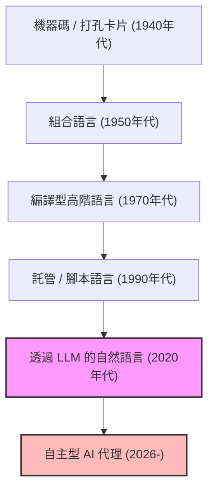
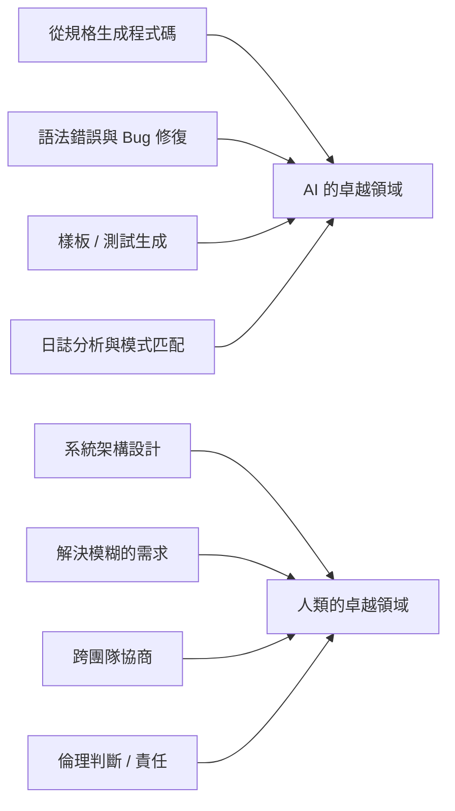
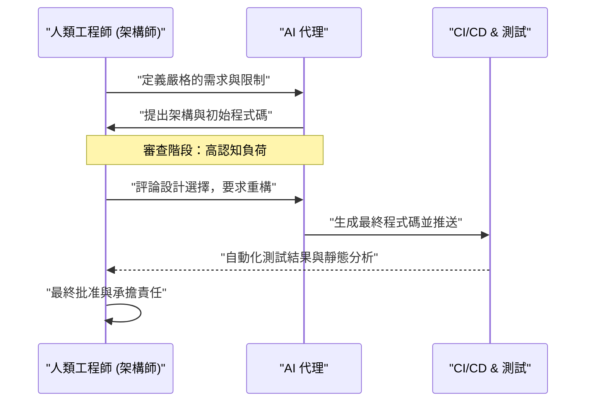

# AI時代的程式設計師該如何生存？寫程式的終結與新工程學的開端

2026年的今天，軟體開發的現場正處於前所未有的劇變期。就在幾年前，「AI 寫程式」的概念充其量只停留在生成樣板程式碼（Boilerplate）或自動補全函式等程式設計師的「輔助工具」角色。然而，隨著大型語言模型（LLM）的驚人進化，情況發生了根本性的翻轉。現代的 AI 已不再只是個「聰明的打字機」，只要提供需求定義文件，它就能化身為「自主型初階工程師」，具備瞬間且自主地將從前端到後端邏輯、資料庫結構設計，甚至是建構 CI/CD 管線等整個系統組合起來的能力。

在這樣的時代，我們「程式設計師」或「軟體工程師」該如何生存？在「寫程式」這個行為本身的經濟價值正迅速通貨緊縮的當下，只懂得特定程式語言語法（Syntax）、熟悉特定框架 API 的「寫碼工（Coder）」，正快速地被市場淘汰。

本文將從技術、數學以及哲學的觀點，極為詳細地探討 AI 時代程式設計師的生存策略。這不僅僅是單純的職涯論，而是對軟體工程這門學問本身的重新定義。

---

## 1. 抽象化（Abstraction）的歷史與「程式設計」的重新定義

回顧軟體工程的歷史，可以發現它始終是一部「抽象化（Abstraction）」的歷史。我們一直都在建構能用更接近人類的語言，來描述更複雜系統的抽象層。

早期的計算機科學家使用打孔卡片直接操作實體硬體的開關，以機器語言（0和1的排列）向電腦下達指令。之後，組合語言出現了，讓人們可以用較易理解的助記符號（Mnemonic）來操作硬體。隨著時代進步，C 語言、Fortran 等高階語言問世，成功封裝了記憶體管理或 CPU 暫存器等硬體複雜的細節。接著出現的 Java, Python, Ruby, TypeScript 等現代語言，讓程式設計師不再需要專注於「如何讓電腦運作（How）」，而能更專注於「想讓電腦做什麼（What）」。

AI（LLM）的出現，是這段抽象化歷史中最新、也是最大的一次典範轉移。如果說程式語言的進化是「隱藏硬體」，那麼 LLM 的進化就是「隱藏語法（Syntax）」。

開發者需要一邊擔心記憶體流失一邊操作指標，或是為了解析 JSON 而寫幾百行樣板程式碼的時代已經結束了。使用自然語言（中文或英文）這種對人類來說抽象度最高的語言來定義系統，已成為 2026 年「程式設計」的標準。

---

## 2. 生產力的數學模型：乘上指數型成長的浪潮

讓我們用數學模型來量化評估 AI 帶來的生產力提升。
傳統軟體開發中，個人的生產力 $P_{traditional}$ 可以被模型化為個人技能水準 $S$、領域經驗 $E$ 以及工具效率 $T$ 的線性組合。

$$ P_{traditional} = c_1 \cdot S + c_2 \cdot E + c_3 \cdot T $$

然而，在活用 AI 的現代開發中，AI 的能力 $A(t)$ 成為了放大人類能力的「強大槓桿（Multiplier）」。由於 AI 的能力會隨著時間 $t$ 呈指數型成長（AI 版的摩爾定律），因此 AI 時代的生產力 $P_{AI}(t)$ 可以用以下方程式來表示：

$$ P_{AI}(t) = \alpha \cdot S_{core} \cdot e^{\beta \cdot A(t)} $$

這裡的各個變數代表以下意義：
*   $\alpha$: 基礎的人類生產力係數
*   $S_{core}$: 無法被 AI 取代的「人類核心技能」（架構設計、對商業需求的理解、倫理判斷等）
*   $A(t)$: 時間 $t$ 時 AI 模型的絕對能力（參數數量、上下文視窗、推論能力）
*   $\beta$: 展現能多有效發揮 AI 工具的係數（提示工程的品質，或與 AI 協作流程的完善程度）

從這個公式推導出的一個重要洞察是，**在 $A(t)$ 呈指數型增加的世界中，單純的打字速度或背誦特定語言等傳統型技能，對整體生產力的影響將變得極小。** 取而代之的是，用來乘上指數型 AI 成長的係數 $\beta$，以及涵蓋 AI 無法觸及領域的 $S_{core}$，將成為決定工程師市場價值的決定性因素。

---

## 3. 任務的自動化機率（Probability of Automation）

那麼，哪些任務將被自動化，又有哪些任務會保留在人類手中呢？
某個任務 $T$ 被 AI 完全自動化的機率 $P_{auto}(T)$，可以用以下公式定義：

$$ P_{auto}(T) = 1 - \exp\left(-\lambda \cdot \frac{\text{Predictability}(T)}{\text{Complexity}(T) \times \text{Context Dependency}(T)}\right) $$

*   $\text{Predictability}(T)$: 任務的可預測性（過去的資料中存在多少模式）
*   $\text{Complexity}(T)$: 任務的複雜性
*   $\text{Context Dependency}(T)$: 任務所依賴的「隱含上下文（領域特有知識或人際關係）」的強度
*   $\lambda$: AI 的技術進步率

像是撰寫 API 的路由處理、製作簡單的 CRUD 畫面等，可預測性高且上下文依賴性低的任務，$P_{auto} \approx 1$，將幾乎完全被自動化。另一方面，「如何安全地整合現有遺留系統與新的微服務」、「如何設計一個既滿足法務部門要求又不損害使用者體驗的驗證流程」這類上下文依賴性極高的任務，則難以被自動化。

---

## 4. 從語法（Syntax）回歸到架構（Architecture）

明確劃分 AI 擅長的事物與人類擅長的事物，是生存的絕對條件。

AI 在「局部最佳化」方面已凌駕人類。在撰寫單一函式、單一類別或單一模組的速度和準確性上，人類毫無勝算。然而，AI 對於「全域最佳化」或「上下文缺失（Missing Context）」卻非常脆弱。

未來的程式設計師必須將角色從「寫程式的勞工」，轉變為「協調編排 AI 生成的無數元件的架構師」。俯瞰整個系統，微服務的邊界該畫在哪裡、如何配合商業語境來解決 CAP 定理中可用性與一致性的權衡、如何控制技術債。這些都是只有理解全貌與商業目標的人類才能勝任的高階智力工作。

---

## 5. 需求定義才是「真正的提示工程（Prompt Engineering）」

最近常聽到的「提示工程」一詞，往往被誤解為「欺騙 AI 以獲得預期輸出的駭客技巧」。然而，軟體開發中提示工程的本質，毫無疑問是**「高階的需求定義（Requirements Engineering）」**。

為了用自然語言對 AI 下達指令，並讓它輸出如預期的軟體，必須嚴密地將以下要素文字化：

1.  **目的（Why）**: 為什麼需要這個功能？商業價值是什麼？
2.  **限制條件（Constraints）**: 效能需求（延遲、吞吐量）、安全性需求、成本限制。
3.  **邊緣案例（Edge Cases）**: 使用者輸入預期外內容時的回退（Fallback）處理。
4.  **介面（Interfaces）**: 與現有系統的整合規格。

模糊的指令（提示）只能孕育出模糊且脆弱的系統。深入訪談「客戶真正想要的東西」、整理相互矛盾的需求，並製作出邏輯上毫無破綻的規格書（提示）的能力。這才是 AI 時代最強的「寫碼技能」。程式設計師面對的將不再是程式碼編輯器，而是 Notion 或 Markdown 檔案，花費在用文字精準描述系統應有樣貌的時間將會增加。

---

## 6. 領域知識（Domain Knowledge）的壓倒性優勢

由於 AI 已經學習了全世界的開源程式碼與公開文件，因此對一般的 Web 技術與演算法非常熟悉。然而，有些資料是 AI 無法存取的。那就是「你公司特有的商業規則」，以及「深植於特定業界（醫療、金融、製造等）的領域知識」。

舉例來說，假設某家醫療新創公司正在開發電子病歷系統。AI 知道「如何用 React 製作表格 UI」或「HL7 FHIR 的一般資料結構」。但是，它並沒有學習到「在 A 醫院的特定看診科別中，醫師以什麼順序瀏覽患者資料，以及什麼樣的 UI 才能將醫療疏失的風險降到最低」這種隱性知識。

在技術本身逐漸商品化（大眾化）的世界中，工程師的真正價值將誕生於「科技」與「商業領域」的交會處。不再只靠技術能力一決勝負，而是擁有醫療、金融、物流、娛樂等特定領域的深厚專業知識，並能使用 AI 這個強大工具來解決該領域課題的人才，將引領未來的市場。

---

## 7. 軟體開發的「電車難題」：誰來負責？

隨著對 AI 的依賴度升高，我們將面臨重大的哲學與倫理問題。也就是軟體工程中「責任歸屬」的問題。

如果 AI 自主生成的程式碼在正式環境中引發嚴重的 Bug，導致企業損失數億元，或者在攸關人命的醫療系統中發生故障，該由誰來承擔責任？是開發 AI 模型的企業嗎？還是輸入提示的工程師？我們無法將 AI「解僱」或「逮捕」。

作為承擔系統對社會造成影響之「法律與倫理責任（Accountability）」的主體，「人類」的角色無論技術如何進步都不會消失。倒不如說，程式碼生成過程越是黑箱化，人類作為系統「最終批准者（Approver）」與「監督者（Supervisor）」所背負的責任就越重。

審核 AI 提出的架構或程式碼是否符合安全標準、是否存在倫理問題（是否包含偏見）、是否遵守合規性，並給出最終的通行許可。這種「承擔責任」的行為本身，將成為工程師重要工作的一部分。

---

## 8. AI 結對程式設計與認知負荷（Cognitive Load）的管理

在與 AI 共事的過程中，人類「認知負荷（Cognitive Load）」的性質也正在改變。從零開始寫程式時的認知負荷，與「閱讀並審查」AI 生成的數百行未知程式碼時的認知負荷是完全不同的。

根據心理學的認知負荷理論，在處理不符合現有基模（腦海中的知識結構）的複雜資訊時，人類的工作記憶會很快耗盡。AI 生成的程式碼，有時包含了人類想不到的高階最佳化，但同時也可能包含無視上下文的「幻覺（Hallucination）」。

為了防止這種情況，必須將對 AI 的審查流程系統化。

人類必須將「快速閱讀，並瞬間看穿邏輯缺陷（Code Reading & Auditing）」的技能提升到極致，這甚至比「撰寫」技能更重要。測試驅動開發（TDD）的重要性在 AI 時代更加倍增。在讓 AI 寫程式之前，由人類或另一個 AI 寫出嚴謹的測試程式碼，並讓 AI 不斷修改程式碼直到通過測試，這種方法將成為主流。

---

## 9. 具體的生存策略：從明天開始該學什麼？

基於以上的分析，在此提出程式設計師在 AI 時代生存的具體行動計畫：

1.  **徹底重新學習技術的「基礎」**: 框架的用法交給 AI 就好。但是，對作業系統的運作原理、網路協定（TCP/IP, HTTP/3）、資料庫的內部結構（B-Tree, 交易隔離等級）、資料結構與演算法的深入理解是絕對必要的。為了判斷 AI 的輸出是否正確，堅實的計算機科學基礎不可或缺。
2.  **精通雲端架構與分散式系統**: 不要只關注個別程式碼，而是專注於如何組合 AWS, GCP, Azure 等雲端資源來建構可擴展的系統。理解 Terraform 等 IaC（Infrastructure as Code）的概念，培養將整個系統設計為程式碼的能力。
3.  **成為商業領域的專家**: 深入學習自己所屬產業的商業模式、法律法規、使用者的行為心理。跨越工程師的框架，具備接近產品經理（PM）的視角。
4.  **磨練溝通與引導（Facilitation）的技巧**: 解決人與人之間的「模糊性」並達成共識的過程，是 AI 無法取代的。與利害關係人對話、發現真正課題的軟實力，將成為最有價值的技能。
5.  **把 AI 當作「同事」徹底利用**: 不要害怕 AI 工具的進化，而是將其作為最強大的武器來運用。在日常中頻繁使用最新的 LLM 或 AI 寫碼代理，累積「AI 在哪裡會失敗、如何調整提示才能發揮最高效能」的「隱性知識」。

---

## 結論：不要害怕，駕馭浪潮吧

AI 帶來的程式設計自動化，並不代表程式設計師這個職業的「死亡」。相反地，它是一場將我們從修復錯字、排除環境建構問題、撰寫無聊樣板程式碼等軟體開發中「非本質的勞動」解放出來的**「文藝復興」**。

歷史上，自動織布機出現時、試算表軟體（Excel）出現時，也曾蔓延著工作將會消失的悲觀論調。但現實是，隨著生產力的飛躍性提升，創造了新的需求，並誕生了更高階的工作。軟體世界也將發生同樣的事。因為「能以低廉成本打造系統」，軟體將滲透到過去因成本考量而無法資訊化的所有領域，工程師需要解決的課題（What）將無限擴張。

我們程式設計師現在正獲得一個機會，從寫程式的工匠，進化為指揮 AI 這個強大智慧的「交響樂團指揮家」。與其畏懼科技的浪潮而停留在岸邊，不如儘早駕馭這股浪潮，啟程前往創造更大、更有價值系統的旅程。AI 時代，正是真正意義上的「工程學」展開的時代。
