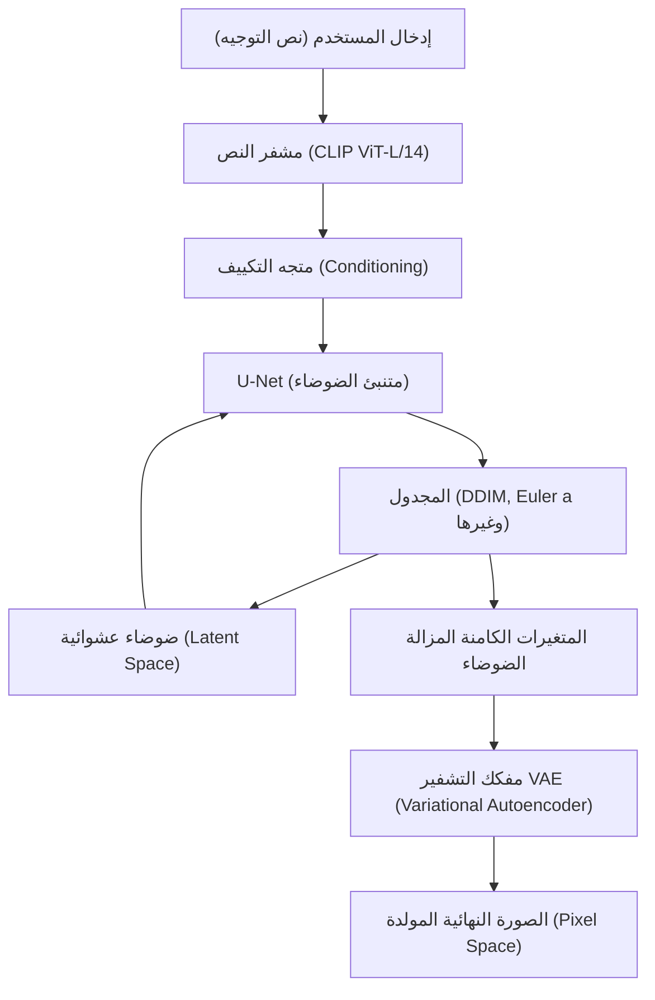
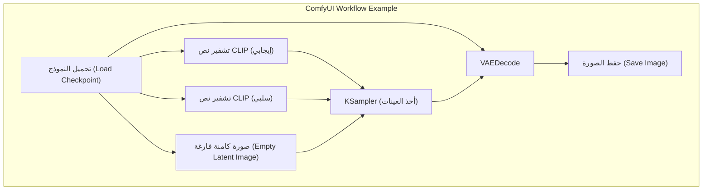

## 1. مقدمة: لماذا يجب توليد الصور بالذكاء الاصطناعي في بيئة محلية؟

شهدت تقنية توليد الصور بالذكاء الاصطناعي تطوراً هائلاً انطلاقاً من جعل Stable Diffusion مفتوح المصدر. حالياً، أصبحت الخدمات التجارية السحابية مثل Midjourney و DALL-E 3 و Adobe Firefly قوية جداً وسهلة الاستخدام. ومع ذلك، فإن هذه الخدمات تعاني من بعض العيوب مثل قيود المحتوى المولد بسبب شروط الاستخدام (مثل فلاتر NSFW)، والتكاليف المستمرة الناتجة عن الاشتراكات، بالإضافة إلى عدم القدرة على التحكم الدقيق في عملية التوليد.

إن بناء أدوات توليد الصور بالذكاء الاصطناعي في بيئة محلية (على حاسوبك الشخصي) يوفر مزايا هائلة كما يلي:

1. **حرية كاملة وتوليد غير محدود**: لا توجد قيود على عدد الصور المولدة أو تكاليف إضافية، ويمكنك توليد عدد لا نهائي من الصور طالما تسمح مواردك المحلية بذلك.
2. **قابلية تخصيص عالية**: يمكن التحكم الدقيق في التكوين وإعادة إنشاء شخصيات أو أساليب رسم معينة باستخدام LoRA (Low-Rank Adaptation) و ControlNet.
3. **الخصوصية والأمان**: نظراً لعدم إرسال البيانات إلى السحابة، فهو مثالي لأعمال التصميم عالية السرية والمشاريع الشخصية.
4. **الاعتماد الفوري لأحدث التقنيات**: يمكنك تجربة أحدث النماذج والإضافات التي يتم الإعلان عنها يومياً في مجتمع المصادر المفتوحة في وقت مبكر.

في هذا الدليل، وعلى افتراض استخدام بيئة Windows، سنقوم بشرح شامل يتجاوز 10,000 حرف لكيفية إعداد ثلاث بيئات رئيسية حالية لتوليد الصور بالذكاء الاصطناعي (AUTOMATIC1111 Stable Diffusion WebUI، و ComfyUI، و Fooocus)، بدءاً من الخلفية الرياضية الأساسية، وصولاً إلى تقنيات تحسين VRAM.

---

## 2. الخلفية الرياضية وهيكلية نماذج الانتشار (Diffusion Model)

من المفيد جداً فهم كيفية عمل **نماذج الانتشار الكامنة (Latent Diffusion Model: LDM)** مثل Stable Diffusion من أجل إعداد البيئة المحلية وضبط المعلمات بشكل صحيح.

### 2.1 عملية إضافة الضوضاء (Forward Process) وعملية الإزالة (Reverse Process)

تتكون المبادئ الأساسية لنموذج الانتشار من "Forward Process" الذي يضيف ضوضاء غاوسية تدريجياً إلى البيانات الأصلية (الصورة) حتى تتحول إلى ضوضاء كاملة، و "Reverse Process" الذي يستعيد الصورة الأصلية من تلك الضوضاء.

يتم تعريف Forward Process كسلسلة ماركوف، ويتم التعبير عن الحالة $x_t$ في الخطوة $t$ بالمعادلة التالية:

$$ q(x_t | x_{t-1}) = \mathcal{N}(x_t; \sqrt{1 - \beta_t} x_{t-1}, \beta_t I) $$

باستخدام خدعة إعادة المعلمة (Reparameterization trick)، يمكن حساب الحالة في أي خطوة $t$ مباشرة من الحالة الأولية $x_0$.

$$ x_t = \sqrt{\bar{\alpha}_t} x_0 + \sqrt{1 - \bar{\alpha}_t} \epsilon $$

هنا، $\alpha_t = 1 - \beta_t$، و $\bar{\alpha}_t = \prod_{s=1}^t \alpha_s$، و $\epsilon \sim \mathcal{N}(0, I)$ هي ضوضاء تم أخذ عينات منها من التوزيع الطبيعي القياسي.

في مرحلة توليد الصور، وهي Reverse Process، يتم استخدام شبكة عصبية (U-Net) $\epsilon_\theta$ للتنبؤ بالضوضاء المضافة وإزالتها. وتكون دالة الخسارة ببساطة كما يلي:

$$ L_{simple} = \mathbb{E}_{x_0, \epsilon \sim \mathcal{N}(0, I), t} \left[ || \epsilon - \epsilon_\theta(\sqrt{\bar{\alpha}_t} x_0 + \sqrt{1 - \bar{\alpha}_t} \epsilon, t) ||^2 \right] $$

### 2.2 تقليل العبء الحسابي من خلال الفضاء الكامن (Latent Space)

إذا تم إجراء إزالة الضوضاء مباشرة في فضاء البكسل (Pixel Space)، فإن العبء الحسابي سيزداد بشكل تربيعي مع دقة الصورة، مما يجعله عملية ثقيلة جداً. يستخدم Stable Diffusion **الترميز التلقائي المتغير (VAE - Variational Autoencoder)** لتحويل الصورة إلى "فضاء كامن" (Latent Space) مضغوط قبل معالجتها.

يقوم المشفر $E$ بضغط صورة بدقة $H \times W \times 3$ إلى $z \in \mathbb{R}^{H/8 \times W/8 \times 4}$. نظراً لأن البعد المكاني يصبح الثمن، فإن العبء الحسابي لآلية الانتباه الذاتي (Self-Attention) يصبح $\mathcal{O}((\frac{H \times W}{64})^2)$، مما يؤدي إلى تحسن هائل في الأداء. بعد التوليد، يقوم مفكك التشفير $D$ باستعادة الصورة إلى فضاء البكسل كـ $\tilde{x} = D(z)$.

### 2.3 هيكلية نظام Stable Diffusion

يوضح مخطط Mermaid التالي عملية التوليد الشاملة في Stable Diffusion (توليد الصور من النص: txt2img).



---

## 3. تحليل شامل لمتطلبات الأجهزة

في توليد الصور بالذكاء الاصطناعي محلياً، يعد اختيار الأجهزة الأمر الأكثر أهمية.

### 3.1 وحدة معالجة الرسومات (GPU)
إنها قلب معالجة الذكاء الاصطناعي. عند تشغيل Stable Diffusion في بيئة Windows، تعتبر وحدات معالجة الرسومات من NVIDIA هي المعيار الفعلي. على الرغم من أنه من الممكن تشغيله على AMD Radeon باستخدام ROCm، بالنظر إلى صعوبة إعداد البيئة على Windows واعتماد العديد من الإضافات على CUDA (بنية الحوسبة المتوازية من NVIDIA)، فليس من المبالغة القول إن NVIDIA هي الخيار الوحيد.

*   **الحد الأدنى للمتطلبات**: VRAM بسعة 6GB (مثل GTX 1060 6GB / RTX 2060). *لكن سيكون هناك قيود كبيرة على الدقة والميزات.*
*   **المتطلبات الموصى بها**: VRAM بسعة 12GB (مثل RTX 3060 12GB / RTX 4070). هذا هو الحد الفاصل لتشغيل نماذج SDXL بسلاسة.
*   **المتطلبات المثالية**: VRAM بسعة 16GB إلى 24GB (RTX 4080 / RTX 3090 / RTX 4090). هذا ضروري لتوليد صور عالية الدقة، والاستخدام المتزامن لـ ControlNet المعقدة، وتدريب النماذج محلياً (مثل LoRA).

### 3.2 الذاكرة (RAM) ومساحة التخزين
*   **RAM (ذاكرة الوصول العشوائي)**: يوصى بشدة باستخدام 32GB أو أكثر. عند نقل النماذج (التي يتراوح حجمها من عدة غيغابايت إلى عشرات الغيغابايت) من مساحة التخزين إلى VRAM، يتم استخدام ذاكرة النظام RAM مؤقتاً. إذا كانت الذاكرة غير كافية، سيتم استخدام ملفات المبادلة (Page files)، مما يؤدي إلى انخفاض حاد في السرعة.
*   **مساحة التخزين**: من الضروري استخدام NVMe M.2 SSD. تبلغ سعة نماذج الذكاء الاصطناعي الحالية (Checkpoints) حوالي 2GB إلى 7GB لكل منها. إذا استخدمت محرك أقراص صلبة HDD، فقد يستغرق تحميل النموذج وحده عدة دقائق، وهو أمر غير عملي.

---

## 4. إعداد البرامج الأساسية (إصدار Windows)

قبل تثبيت الأداة نفسها، سنقوم بإعداد البرامج الأساسية المطلوبة.

### 4.1 تثبيت Python
تتم كتابة معظم أدوات الذكاء الاصطناعي بلغة Python. سنقوم بتثبيت **Python 3.10.6**، والذي يتمتع بأعلى توافق مع Stable Diffusion WebUI وما شابه (الإصدارات الأحدث قد تتسبب في كسر التبعيات مثل PyTorch).

1.  قم بتنزيل `python-3.10.6-amd64.exe` من أرشيف Python الرسمي.
2.  عند تشغيل المثبت، تأكد من وضع علامة على **"Add Python 3.10 to PATH"** الموجودة في الأسفل.
3.  في شاشة اكتمال التثبيت، انقر على **"Disable path length limit"** (تعطيل حد طول المسار). (هام: إذا لم تقم بإلغاء قيود مسار Windows المكونة من 260 حرفاً، ستحدث أخطاء في مكتبات التبعية العميقة).

### 4.2 تثبيت Git for Windows
أنت بحاجة إلى Git للحصول على التعليمات البرمجية المصدرية والنماذج من GitHub.
1.  قم بتنزيل المثبت من الموقع الرسمي لـ Git for Windows، وقم بتثبيته باستخدام الإعدادات الافتراضية.

### 4.3 إعداد CUDA Toolkit و cuDNN
نظراً لأن أحدث إصدارات PyTorch تقوم بتضمين وتنزيل ثنائيات CUDA الضرورية أثناء التثبيت، لم يعد من الضروري تثبيت CUDA Toolkit على النظام بأكمله. ومع ذلك، إذا كنت تستخدم إضافات مخصصة (مثل بناء TensorRT أو xFormers)، فمن المستحسن تثبيت **CUDA Toolkit 11.8** أو **12.1** (حسب إصدار PyTorch المستخدم) من موقع NVIDIA الرسمي.

---

## 5. خطوات بناء الواجهات الأمامية الثلاث الكبرى

سنشرح كيفية بناء أدوات توليد الصور بالذكاء الاصطناعي الثلاثة السائدة حالياً. استخدم الأداة المناسبة وفقاً لأهدافك ومهاراتك.

### 5.1 بناء AUTOMATIC1111 Stable Diffusion WebUI
هي الأداة الأكثر عراقة، وغنية بالإضافات، وتعد أداة شاملة تتيح إجراء تعديلات دقيقة على المعلمات.

**خطوات التثبيت:**
1.  افتح موجه الأوامر في أي دليل (مثال: `C:\work\ai`).
2.  قم بتنفيذ الأمر التالي لاستنساخ المستودع:
    ```cmd
    git clone https://github.com/AUTOMATIC1111/stable-diffusion-webui.git
    ```
3.  انقر بزر الماوس الأيمن على `webui-user.bat` في الدليل المستنسخ وافتحه في وضع التحرير.
4.  لتحسين الأداء، قم بضبط وسيطات التشغيل `COMMANDLINE_ARGS` كما يلي:
    ```bat
    set COMMANDLINE_ARGS=--xformers --opt-sdp-attention --theme dark
    ```
5.  انقر نقراً مزدوجاً على `webui-user.bat` لتشغيله. في المرة الأولى، قد يستغرق الأمر عدة دقائق حسب بيئتك، حيث يتم تنزيل مكتبات ضخمة مثل PyTorch.
6.  عند الانتهاء، ستظهر رسالة `Running on local URL: http://127.0.0.1:7860`، يمكنك الوصول إليها عبر المتصفح.

### 5.2 بناء ComfyUI ومزايا الاعتماد على العقد (Node-based)
ComfyUI هي واجهة مستخدم تربط عملية التوليد بصرياً من خلال كتل تسمى "عقد" (Node-based). إدارة VRAM فيها ممتازة جداً، وغالباً ما تعمل في بيئات قد تواجه فيها AUTOMATIC1111 نقصاً في الذاكرة.



**خطوات التثبيت:**
1.  قم بتنزيل ملف 7z لإصدار Windows Standalone من صفحة إصدارات GitHub الرسمية لـ ComfyUI.
2.  قم بفك ضغطه، وقم بتشغيل `run_nvidia_gpu.bat` الموجود بداخله لبدء التشغيل (لا يتطلب إعداداً لأنه إصدار محمول يتضمن Python).
3.  **تثبيت ComfyUI Manager**: ضروري لإدارة الإضافات. افتح موجه الأوامر في دليل `ComfyUI/custom_nodes/`، وقم بتنفيذ ما يلي:
    ```cmd
    git clone https://github.com/ltdrdata/ComfyUI-Manager.git
    ```
    عند إعادة التشغيل، سيظهر زر "Manager" في أسفل يمين واجهة المستخدم، ومن هنا يمكنك تثبيت العديد من العقد المخصصة.

### 5.3 بناء Fooocus: توليد صور عالية الجودة للمبتدئين
Fooocus هي واجهة مستخدم تم تصميمها بهدف "إنتاج صور مذهلة حتى مع مطالبات قصيرة" مثل Midjourney. تم ضبطها خصيصاً لنماذج SDXL، وتقوم تلقائياً بتوسيع المطالبات بناءً على GPT-2 وتنفيذ خطوط أنابيب معقدة داخلياً.

**خطوات التثبيت:**
1.  قم بتنزيل حزمة إصدار Windows من GitHub الرسمي لـ Fooocus وقم بفك ضغطها.
2.  قم بتشغيل `run.bat`. سيتم تنزيل نماذج SDXL ممتازة مثل Juggernaut XL تلقائياً، وستكون جاهزاً للبدء في توليد صور عالية الجودة على الفور.
3.  من خلال وضع علامة على "Advanced" (متقدم)، يمكنك أيضاً استخدام الميزات المتقدمة مثل Image Prompt (موجه الصورة) و Inpainting.

---

## 6. فهم إدارة النماذج وهيكل البيانات

تعتمد جودة توليد الصور بالذكاء الاصطناعي بشكل كامل على النموذج (البيانات المدربة) المستخدم.

### 6.1 نقاط التحقق (Checkpoints - النماذج الأساسية)
هي النماذج الرئيسية التي تشكل جوهر توليد الصور. في الماضي، كانت صيغة `.ckpt` (تنسيق Pickle) هي السائدة، ولكنها كانت تحتوي على ثغرة تسمح بتنفيذ تعليمات Python عشوائية (Arbitrary Code Execution). حالياً، أصبحت صيغة **`.safetensors`** هي المعيار، حيث تضمن الأمان وتتيح تحميل البيانات من القرص إلى الذاكرة دون نسخ (mmap). لا تقم أبداً بتنزيل ملفات `.ckpt` مجهولة المصدر.

### 6.2 السلوك الرياضي لـ LoRA (التكيف منخفض الرتبة - Low-Rank Adaptation)
LoRA هي تقنية تتجنب الموارد الحسابية الهائلة المطلوبة للضبط الدقيق للنموذج الكامل (Fine-tuning)، وتسمح بتعلم إضافي لشخصيات أو أساليب رسم معينة.

بدلاً من التحديث المباشر لمصفوفة الوزن $W_0 \in \mathbb{R}^{d \times k}$ التي تحتوي على مليارات المعلمات، يقدم LoRA مصفوفتين منخفضتي الرتبة $A \in \mathbb{R}^{r \times k}$ و $B \in \mathbb{R}^{d \times r}$ (حيث تكون الرتبة $r \ll \min(d, k)$). يتم حساب الوزن الجديد على النحو التالي:

$$ W = W_0 + \Delta W = W_0 + B A $$

ونتيجة لذلك، ينخفض عدد المعلمات التي يتم تعلمها وحفظها بشكل كبير من $d \times k$ إلى $r \times (d + k)$، مما يتيح تطبيق أساليب قوية باستخدام ملفات خفيفة الوزن لا تتجاوز بضع مئات من الميغابايت.

### 6.3 الترميز التلقائي المتغير (VAE - Variational Autoencoder)
كما ذكرنا سابقاً، هذا هو النموذج الذي يحول بين الفضاء الكامن وفضاء البكسل. في نماذج الرسوم المتحركة (الأنمي)، إذا لم يتم إعداد VAE بشكل صحيح، قد يتم إخراج صور باهتة وذات تباين منخفض، تُعرف بـ "الصور النائمة". قم بوضع VAE مخصص للأنمي مثل `kl-f8-anime2.ckpt` في مجلد `models/VAE` وتطبيقه.

### 6.4 مثال على هيكل الدليل (AUTOMATIC1111)
```text
stable-diffusion-webui/
├── models/
│   ├── Stable-diffusion/  <-- وضع Checkpoints (.safetensors) هنا
│   ├── Lora/              <-- وضع نماذج LoRA هنا
│   ├── VAE/               <-- وضع نماذج VAE هنا
│   └── ControlNet/        <-- وضع نماذج ControlNet هنا
├── embeddings/            <-- وضع Textual Inversion (ملفات PT) هنا
├── extensions/            <-- الإضافات المستنسخة عبر Git
└── webui-user.bat         <-- ملف دفعي للتشغيل
```

---

## 7. تحسين VRAM وضبط الأداء

هذه تقنيات لتجنب "نقص VRAM (CUDA Out Of Memory)"، والذي يعد العائق الأكبر في التوليد المحلي، وزيادة سرعة التوليد إلى أقصى حد.

### 7.1 تحسين آلية الانتباه (xFormers / SDP Attention)
يتم استهلاك معظم العمليات الحسابية في Stable Diffusion في Cross-Attention داخل U-Net. نظراً لأن حساب الانتباه الافتراضي يستهلك قدراً كبيراً من الذاكرة، يتم تحسينه باستخدام النهج التالي:

*   **xFormers (`--xformers`)**: تطبيق انتباه فعال من حيث الذاكرة طورته شركة Meta. يقلل بشكل كبير من استهلاك VRAM ويحسن السرعة، ولكنه يتميز بـ "إنتاج صور مختلفة قليلاً حتى مع نفس قيمة البذرة (Seed)" بسبب عدم الحتمية في الحساب.
*   **SDP Attention (`--opt-sdp-attention`)**: Scaled Dot Product Attention المضمن بشكل قياسي في PyTorch 2.0. يتميز بنفس سرعة وتأثير تقليل VRAM مثل xFormers، مع ميزة وجود تبعيات أقل. هناك أيضاً متغيرات مثل `--opt-sub-quad-attention` التي لا تعاني من عدم الحتمية.

### 7.2 خيارات التشغيل لتوفير VRAM
*   `--medvram`: للبيئات ذات VRAM تتراوح بين 6GB إلى 8GB. يقوم بتقسيم معالجة U-Net وتوفير الذاكرة، لكن السرعة تنخفض قليلاً.
*   `--lowvram`: للبيئات ذات VRAM 4GB أو أقل. نظراً لأنه ينقل الوحدات داخل وخارج VRAM بشكل متكرر، فإن السرعة تنخفض بشكل حاد ولكن يمكن تشغيله بالقوة.
*   `--medvram-sdxl`: علامة مفيدة جداً تطبق MedVRAM فقط عند استخدام نماذج SDXL.

### 7.3 تسريع فائق السرعة باستخدام TensorRT
**TensorRT** هو إطار عمل للاستفادة القصوى من نوى Tensor في وحدات معالجة الرسومات NVIDIA.
يقوم بتجميع U-Net الخاص بـ Stable Diffusion كمحرك مخصص لوحدة معالجة الرسومات المستخدمة (ملف `.trt`). يستغرق التجميع عشرات الدقائق، وهناك عيوب تتمثل في ثبات الدقة وحجم الدفعة (يمكن استخدام Dynamic Shape ولكن تنخفض الكفاءة)، إلا أن سرعة التوليد تقفز لتصبح **من 1.5 إلى أكثر من ضعفين**. إنها أقوى طريقة تحسين للاستخدام التجاري الذي يتطلب توليد عدد كبير من الصور بنفس الدقة.

### 7.4 Tiled VAE / Tiled Diffusion
عند توليد أو رفع دقة صور عالية الجودة (مثل 4K)، تستنفد عملية فك التشفير في VAE كل مساحة VRAM دفعة واحدة. لمنع ذلك، من الضروري استخدام إضافات (Multidiffusion / Tiled VAE) تقوم بتقسيم الصورة إلى بلاطات (على سبيل المثال، $512 \times 512$) ومعالجتها، ثم دمجها في النهاية.

---

## 8. تقنية التحكم المتقدمة: ControlNet

باستخدام المطالبات النصية فقط، من المستحيل تحديد وضعيات الشخصيات، والمنظور المعقد، والحركات الدقيقة لأطراف الأصابع. لحل هذه المشكلة تم ابتكار **ControlNet**.

تمتلك ControlNet هيكلية تثبت أوزان نموذج Stable Diffusion المدرب وتنسخ هيكل المشفر، مع إدخال "Zero-convolutions" (طبقات التفافية تمت تهيئة أوزانها بالصفر). وهذا يسمح بتوفير شروط إضافية دون تدمير قدرات التوليد الأصلية.

**أبرز المعالجات المسبقة والنماذج:**
*   **OpenPose**: يستخرج هيكل الشخص (مواضع المفاصل) ويولد صورة بنفس الوضعية تماماً.
*   **Canny**: يقوم باكتشاف الحواف، ويعتمد على الرسم الخطي للتلوين أو تحويله إلى صورة واقعية.
*   **Depth**: يولد خريطة عمق (Depth Map)، وينتج صورة تحافظ على العلاقات المكانية الأمامية والخلفية.
*   **Lineart**: يتفوق على Canny في استخراج الرسومات الخطية بأسلوب الأنمي.

من خلال تطبيق عدة ControlNet معاً في وقت واحد (Multi-ControlNet)، يصبح من الممكن إنتاج "صورة بوضعية محددة مع منظور خلفية محدد" بشكل مؤكد.

---

## 9. استكشاف الأخطاء وإصلاحها (الأسئلة الشائعة)

إليك الأخطاء الشائعة وحلولها أثناء بناء وتشغيل البيئة المحلية.

### سؤال 1: يتوقف التوليد وتظهر رسالة خطأ `CUDA out of memory.`
**جواب 1:** هناك نقص في VRAM. قم بتقليل دقة التوليد، أو تعيين حجم الدفعة إلى 1. أيضاً في حالة استخدام A1111، أضف `--xformers` و `--medvram` إلى `webui-user.bat` وأعد التشغيل. إذا كنت ترغب في استخدام رفع الدقة (Hires. fix)، فاستخدم ترقيات من عائلة ESRGAN مثل R-ESRGAN بدلاً من عائلة Latent لتقليل استهلاك VRAM.

### سؤال 2: الصور المولدة سوداء تماماً أو مليئة بالضوضاء.
**جواب 2:** هذه ظاهرة تحدث عندما تظهر قيم NaN (Not a Number) أثناء الحساب وينهار الموتر (Tensor). يرجى اتخاذ الخطوات التالية:
1.  أضف `--no-half-vae` إلى خيارات التشغيل لجعل VAE يحسب بدقة أحادية (FP32) فقط.
2.  أضف `--disable-nan-check` إلى خيارات التشغيل (هذا ليس حلاً جذرياً).
3.  قد لا يكون حساب FP16 مناسباً للنموذج المستخدم (خاصة عائلة SD 2.1)، لذا جرب وضع الدقة الكاملة.

### سؤال 3: تظهر أخطاء Python أو Git عند تشغيل `webui-user.bat`.
**جواب 3:** يُشتبه في وجود عدم توافق في مكتبات التبعية. قم بحذف مجلد `venv` داخل دليل WebUI بالكامل، ثم قم بتشغيل `webui-user.bat` مرة أخرى. سيتم إعادة بناء البيئة الافتراضية في حالة نظيفة (سيحدث إعادة تنزيل لعدة غيغابايت).

### سؤال 4: قمت بتنزيل نموذج (Safetensors) ولكنه لا يظهر في القائمة.
**جواب 4:** بعد وضعه في مجلد `models/Stable-diffusion`، انقر على زر "تحديث (Refresh)" المجاور للقائمة المنسدلة لاختيار Checkpoint على واجهة المستخدم. إذا قمت بوضعه في مجلد فرعي، فتحقق من صحة الامتداد.

---

## 10. خاتمة: مستقبل توليد الصور بالذكاء الاصطناعي وتفوق البيئة المحلية

تستمر حركة توليد الصور بالذكاء الاصطناعي مفتوحة المصدر، التي بدأت مع Stable Diffusion، في التطور نحو بنيات الجيل التالي مثل SDXL و Stable Diffusion 3 و Flux.1. لقد تضخم عدد معلمات النماذج من مليارات إلى عشرات المليارات، وفي المستقبل سيكون هناك طلب أكبر على بيئات وحدات معالجة الرسومات بذاكرة VRAM بسعة 24GB أو أكثر.

ومع ذلك، فإن تقنيات التحسين المحلية مثل TensorRT وتقنيات التكميم (Quantization) و GGUF تعمل أيضاً على تسريع وتيرة تطورها، ويتشكل نظام بيئي يسمح بالاستدلال الكافي حتى على الأجهزة المخصصة للمستهلكين العاديين.

إن فهم إعداد بيئة CUDA، وتحسين VRAM، وخطوط الأنابيب مثل ComfyUI المشروحة في هذا الدليل، ستشكل معرفة أساسية عالمية تظل صالحة بغض النظر عن كيفية تغير اتجاهات تكنولوجيا الذكاء الاصطناعي. نأمل أن يتم إطلاق العنان لإبداعك إلى أقصى حد في بيئة محلية خالية من القيود.
