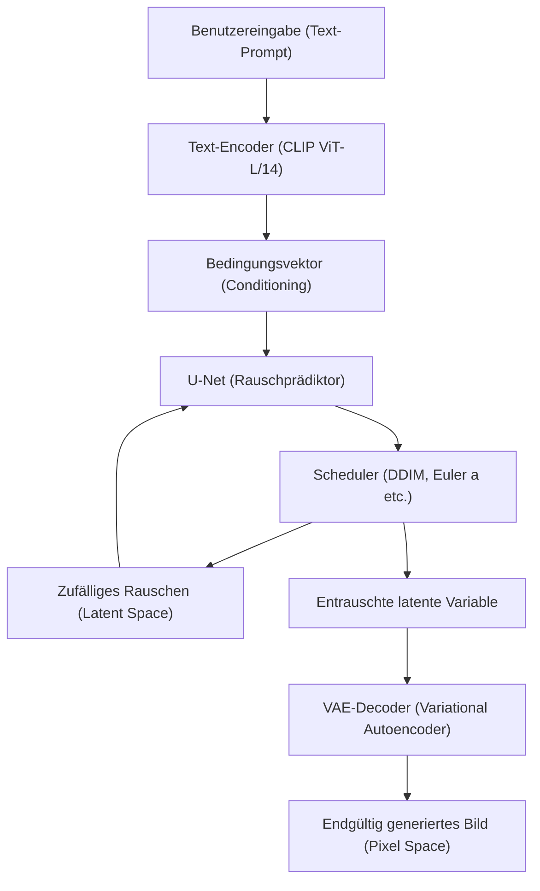
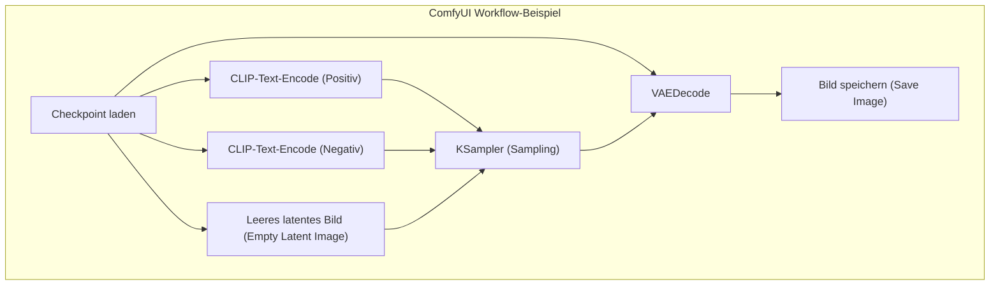

## 1. Einführung: Warum KI-Bildgenerierung in einer lokalen Umgebung durchführen?

Die Technologie der KI-Bildgenerierung hat seit der Open-Source-Veröffentlichung von Stable Diffusion eine explosive Entwicklung durchgemacht. Derzeit sind Cloud-basierte kommerzielle Dienste wie Midjourney, DALL-E 3 und Adobe Firefly ebenfalls sehr leistungsstark und benutzerfreundlich geworden. Diese Dienste haben jedoch Nachteile wie Einschränkungen bei den generierten Inhalten durch Nutzungsbedingungen (z. B. NSFW-Filter), laufende Kosten durch Abonnements und die Unmöglichkeit, den Generierungsprozess detailliert zu steuern.

Der Aufbau eines KI-Bildgenerierungs-Tools in einer lokalen Umgebung (auf dem eigenen PC) bietet die folgenden überwältigenden Vorteile:

1. **Völlige Freiheit und unbegrenzte Generierung**: Es gibt keine Beschränkungen der Anzahl der generierten Bilder oder zusätzliche Kosten. Solange die lokalen Ressourcen es zulassen, können unbegrenzt Bilder generiert werden.
2. **Hohe Anpassbarkeit**: Eine detaillierte Kompositionssteuerung sowie die Reproduktion bestimmter Charaktere oder Kunststile sind durch die Verwendung von LoRA (Low-Rank Adaptation) und ControlNet möglich.
3. **Datenschutz und Sicherheit**: Da keine Daten in die Cloud gesendet werden, ist es ideal für vertrauliche Designaufgaben oder persönliche Projekte.
4. **Sofortige Einführung der neuesten Technologien**: Sie können die neuesten Modelle und Erweiterungen, die täglich in der Open-Source-Community veröffentlicht werden, sofort ausprobieren.

Dieses Handbuch setzt eine Windows-Umgebung voraus und erklärt ausführlich auf über 10.000 Zeichen den Aufbau der drei derzeit gängigen KI-Bildgenerierungsumgebungen (AUTOMATIC1111 Stable Diffusion WebUI, ComfyUI, Fooocus), die zugrunde liegenden mathematischen Hintergründe und sogar Methoden zur VRAM-Optimierung.

---

## 2. Mathematischer Hintergrund und Architektur von Diffusionsmodellen (Diffusion Model)

Um eine lokale Umgebung aufzubauen und die Parameter entsprechend einzustellen, ist es sehr hilfreich zu verstehen, wie **Latente Diffusionsmodelle (Latent Diffusion Model: LDM)** wie Stable Diffusion funktionieren.

### 2.1 Rauschzugabeprozess (Forward Process) und Entfernungsprozess (Reverse Process)

Das Grundprinzip von Diffusionsmodellen besteht aus einem "Forward Process", bei dem den Originaldaten (Bildern) schrittweise Gaußsches Rauschen hinzugefügt wird, um sie schließlich in vollständiges Rauschen zu verwandeln, und einem "Reverse Process", bei dem das Originalbild aus diesem Rauschen wiederhergestellt wird.

Der Forward Process wird als Markov-Kette definiert, und der Zustand $x_t$ im Schritt $t$ wird durch die folgende Gleichung ausgedrückt:

$$ q(x_t | x_{t-1}) = \mathcal{N}(x_t; \sqrt{1 - \beta_t} x_{t-1}, \beta_t I) $$

Indem man den Umparametrisierungs-Trick (Reparameterization trick) anwendet, kann der Zustand in einem beliebigen Schritt $t$ direkt aus dem Anfangszustand $x_0$ berechnet werden.

$$ x_t = \sqrt{\bar{\alpha}_t} x_0 + \sqrt{1 - \bar{\alpha}_t} \epsilon $$

Hierbei ist $\alpha_t = 1 - \beta_t$, $\bar{\alpha}_t = \prod_{s=1}^t \alpha_s$, und $\epsilon \sim \mathcal{N}(0, I)$ ist das aus der Standardnormalverteilung gesampelte Rauschen.

Im Reverse Process, der Bildgenerierungsphase, wird ein neuronales Netzwerk (U-Net) $\epsilon_\theta$ verwendet, um das hinzugefügte Rauschen vorherzusagen und zu entfernen. Die Verlustfunktion lässt sich einfach wie folgt darstellen:

$$ L_{simple} = \mathbb{E}_{x_0, \epsilon \sim \mathcal{N}(0, I), t} \left[ || \epsilon - \epsilon_\theta(\sqrt{\bar{\alpha}_t} x_0 + \sqrt{1 - \bar{\alpha}_t} \epsilon, t) ||^2 \right] $$

### 2.2 Reduzierung des Rechenaufwands durch den Latent Space (Latenten Raum)

Wenn die Rauschentfernung direkt im Pixelraum (Pixel Space) durchgeführt wird, steigt der Rechenaufwand quadratisch mit der Bildauflösung, was zu einem extrem rechenintensiven Prozess führt. Stable Diffusion verarbeitet die Bilder, indem es sie mit einem **VAE (Variational Autoencoder)** in einen komprimierten "Latenten Raum (Latent Space)" umwandelt.

Der Encoder $E$ komprimiert ein Bild mit der Auflösung $H \times W \times 3$ zu $z \in \mathbb{R}^{H/8 \times W/8 \times 4}$. Da die räumlichen Dimensionen auf ein Achtel reduziert werden, beträgt der Rechenaufwand des Selbstaufmerksamkeitsmechanismus (Self-Attention) $\mathcal{O}((\frac{H \times W}{64})^2)$, was zu einer drastischen Leistungssteigerung führt. Nach der Generierung wird das Bild vom Decoder $D$ als $\tilde{x} = D(z)$ wieder in den Pixelraum zurückgewandelt.

### 2.3 Systemarchitektur von Stable Diffusion

Das folgende Mermaid-Diagramm zeigt den gesamten Generierungsprozess (Bildgenerierung aus Text: txt2img) von Stable Diffusion.



---

## 3. Gründliche Analyse der Hardwareanforderungen

Bei der lokalen KI-Bildgenerierung ist die Auswahl der Hardware von größter Bedeutung.

### 3.1 GPU (Grafikkarte)
Das Herzstück der KI-Verarbeitung. Um Stable Diffusion in einer Windows-Umgebung auszuführen, sind GPUs von NVIDIA der De-facto-Standard. Obwohl es möglich ist, AMD-Radeon-Karten mit ROCm zu betreiben, ist es aufgrund der Schwierigkeit der Einrichtung unter Windows und der Tatsache, dass viele Erweiterungen auf CUDA (NVIDIAs paralleler Rechenarchitektur) angewiesen sind, keine Übertreibung zu sagen, dass NVIDIA die einzige sinnvolle Wahl ist.

*   **Mindestanforderung**: 6GB VRAM (GTX 1060 6GB / RTX 2060 etc.). *Hinweis: Hierbei gibt es jedoch große Einschränkungen bei Auflösung und Funktionen.*
*   **Empfohlene Anforderung**: 12GB VRAM (RTX 3060 12GB / RTX 4070 etc.). Dies ist die Grenze, um SDXL-Modelle komfortabel auszuführen.
*   **Ideale Anforderung**: 16GB bis 24GB VRAM (RTX 4080 / RTX 3090 / RTX 4090). Erforderlich für die Generierung mit hoher Auflösung, die gleichzeitige Verwendung komplexer ControlNets und das lokale Training von Modellen (LoRA etc.).

### 3.2 Arbeitsspeicher (RAM) und Speicher
*   **RAM**: 32 GB oder mehr werden dringend empfohlen. Beim Übertragen von Modellen (mehrere GB bis zu Dutzenden von GB) vom Speicher in den VRAM wird vorübergehend der System-RAM verwendet. Ein Mangel an RAM führt zur Nutzung der Auslagerungsdatei, was einen fatalen Geschwindigkeitsverlust nach sich zieht.
*   **Speicher**: Eine NVMe M.2 SSD ist unerlässlich. Aktuelle KI-Modelle (Checkpoints) haben eine Größe von 2 GB bis 7 GB pro Stück. Die Verwendung einer HDD ist unpraktisch, da allein das Laden des Modells mehrere Minuten dauern würde.

---

## 4. Einrichtung der Basis-Software (Windows-Edition)

Bevor wir die eigentlichen Tools installieren, bereiten wir die erforderliche Basis-Software vor.

### 4.1 Installation von Python
Der Großteil der KI-Tools ist in Python geschrieben. Wir installieren **Python 3.10.6**, das die höchste Kompatibilität mit Tools wie der Stable Diffusion WebUI aufweist (bei neueren Versionen können Abhängigkeiten wie PyTorch beschädigt werden).

1.  Laden Sie die Datei `python-3.10.6-amd64.exe` aus dem offiziellen Python-Archiv herunter.
2.  Aktivieren Sie beim Starten des Installationsprogramms unbedingt das Häkchen bei **"Add Python 3.10 to PATH"** ganz unten.
3.  Klicken Sie auf dem Bildschirm zur Bestätigung der Installation auf **"Disable path length limit"** (Wichtig: Wenn die Pfadlängenbegrenzung von 260 Zeichen in Windows nicht aufgehoben wird, treten Fehler in Abhängigkeitsbibliotheken mit tiefer Hierarchie auf).

### 4.2 Installation von Git for Windows
Git wird benötigt, um Quellcode und Modelle von GitHub abzurufen.
1.  Laden Sie das Installationsprogramm von der offiziellen Git for Windows-Website herunter und installieren Sie es mit allen Standardeinstellungen.

### 4.3 Einrichtung von CUDA Toolkit und cuDNN
Da das neueste PyTorch bei der Installation die erforderlichen CUDA-Binärdateien herunterlädt und einschließt, ist es nicht mehr zwingend erforderlich, das CUDA Toolkit systemweit zu installieren. Wenn Sie jedoch benutzerdefinierte Erweiterungen (wie das Kompilieren von TensorRT oder xFormers) verwenden, wird empfohlen, **CUDA Toolkit 11.8** oder **12.1** (passend zum verwendeten PyTorch) von der offiziellen NVIDIA-Website zu installieren.

---

## 5. Verfahren zum Aufbau der drei großen Frontends

Wir erklären, wie man die drei derzeit gängigsten KI-Bildgenerierungs-Tools einrichtet. Bitte wählen Sie je nach Ziel und Fähigkeiten das passende Tool aus.

### 5.1 Aufbau von AUTOMATIC1111 Stable Diffusion WebUI
Es ist das älteste Tool, hat eine Fülle von Erweiterungen und ist ein Allzweckwerkzeug, das feine Parameteranpassungen ermöglicht.

**Installationsschritte:**
1.  Öffnen Sie die Eingabeaufforderung in einem beliebigen Verzeichnis (z. B. `C:\work\ai`).
2.  Führen Sie den folgenden Befehl aus, um das Repository zu klonen.
    ```cmd
    git clone https://github.com/AUTOMATIC1111/stable-diffusion-webui.git
    ```
3.  Klicken Sie mit der rechten Maustaste auf die Datei `webui-user.bat` im geklonten Verzeichnis und öffnen Sie sie im Bearbeitungsmodus.
4.  Um die Leistung zu verbessern, stellen Sie das Startargument `COMMANDLINE_ARGS` wie folgt ein.
    ```bat
    set COMMANDLINE_ARGS=--xformers --opt-sdp-attention --theme dark
    ```
5.  Doppelklicken Sie auf `webui-user.bat`, um es auszuführen. Beim ersten Mal werden riesige Bibliotheken wie PyTorch heruntergeladen, was je nach Umgebung mehrere zehn Minuten dauern kann.
6.  Wenn es abgeschlossen ist, wird `Running on local URL: http://127.0.0.1:7860` angezeigt. Greifen Sie über den Browser darauf zu.

### 5.2 Aufbau von ComfyUI und die Vorteile der knotenbasierten Oberfläche
ComfyUI ist eine knotenbasierte (Node-based) Benutzeroberfläche, bei der der Generierungsprozess visuell durch Blöcke, sogenannte "Nodes", miteinander verbunden wird. Die VRAM-Verwaltung ist extrem hervorragend, und es funktioniert oft in Umgebungen, in denen AUTOMATIC1111 aufgrund von Speichermangel abstürzen würde.



**Installationsschritte:**
1.  Laden Sie die 7z-Datei der Windows Standalone-Version von der offiziellen ComfyUI GitHub-Release-Seite herunter.
2.  Entpacken Sie sie und führen Sie einfach `run_nvidia_gpu.bat` im Ordner aus, um es zu starten (da es sich um eine portable Version mit integriertem Python handelt, ist keine Einrichtung erforderlich).
3.  **Installation des ComfyUI Managers**: Dies ist unerlässlich für die Verwaltung von Erweiterungen. Öffnen Sie die Eingabeaufforderung im Verzeichnis `ComfyUI/custom_nodes/` und führen Sie Folgendes aus.
    ```cmd
    git clone https://github.com/ltdrdata/ComfyUI-Manager.git
    ```
    Nach einem Neustart erscheint unten rechts auf der Benutzeroberfläche eine "Manager"-Schaltfläche, über die Sie verschiedene benutzerdefinierte Knoten installieren können.

### 5.3 Aufbau von Fooocus: Hochwertige Generierung für Anfänger
Fooocus ist eine Benutzeroberfläche, die mit dem Ziel entwickelt wurde, "mit kurzen Prompts überwältigend schöne Bilder auszugeben", ähnlich wie Midjourney. Sie ist speziell auf SDXL-Modelle abgestimmt und führt intern automatisch komplexe Pipelines wie GPT-2-basierte Prompt-Erweiterungen durch.

**Installationsschritte:**
1.  Laden Sie das Windows-Release-Paket vom offiziellen Fooocus-GitHub herunter und entpacken Sie es.
2.  Führen Sie `run.bat` aus. Hervorragende SDXL-Modelle wie Juggernaut XL werden automatisch heruntergeladen, und Sie sind sofort bereit für die Erstellung hochauflösender Bilder.
3.  Durch Aktivieren von "Advanced" (Erweitert) stehen auch fortgeschrittene Funktionen wie Image Prompts (Bild-Prompts) und Inpainting zur Verfügung.

---

## 6. Modellverwaltung und Verständnis der Datenstruktur

Die Qualität der KI-Bildgenerierung hängt vollständig vom verwendeten Modell (den trainierten Daten) ab.

### 6.1 Checkpoints (Base Models)
Dies sind die Hauptmodelle, die den Kern der Bildgenerierung bilden. Früher war das Format `.ckpt` (Pickle-Format) vorherrschend, das jedoch eine Schwachstelle enthielt, die die Ausführung von beliebigem Python-Code ermöglichte (Arbitrary Code Execution). Heutzutage ist das **`.safetensors`**-Format der Standard, da es Sicherheit gewährleistet und Zero-Copy-Loading (mmap) von der Festplatte in den Speicher ermöglicht. Laden Sie niemals `.ckpt`-Dateien aus unbekannten Quellen herunter.

### 6.2 Das mathematische Verhalten von LoRA (Low-Rank Adaptation)
LoRA ist eine Technik, die das Hinzufügen bestimmter Charaktere oder Kunststile ermöglicht, ohne die immensen Rechenressourcen für die Feinabstimmung (Fine-Tuning) des vollständigen Modells zu benötigen.

Anstatt die Gewichtsmatrix $W_0 \in \mathbb{R}^{d \times k}$ mit Milliarden von Parametern direkt zu aktualisieren, führt LoRA zwei Matrizen von niedrigem Rang (Low-Rank) ein: $A \in \mathbb{R}^{r \times k}$ und $B \in \mathbb{R}^{d \times r}$ (wobei der Rang $r \ll \min(d, k)$ ist). Die neuen Gewichte werden wie folgt berechnet:

$$ W = W_0 + \Delta W = W_0 + B A $$

Dadurch wird die Anzahl der Parameter zum Trainieren und Speichern drastisch von $d \times k$ auf $r \times (d + k)$ reduziert, was die Anwendung leistungsstarker Stile mit leichten Dateien von nur wenigen Hundert Megabyte ermöglicht.

### 6.3 VAE (Variational Autoencoder)
Wie bereits erwähnt, ist dies ein Modell zur Umwandlung zwischen dem latenten Raum und dem Pixelraum. Bei Modellen im Anime-Stil kann es vorkommen, dass bei ungeeigneten VAE-Einstellungen Bilder erzeugt werden, die insgesamt weißlich wirken und wenig Kontrast aufweisen ("schläfrige Bilder"). Platzieren Sie ein Anime-spezifisches VAE wie `kl-f8-anime2.ckpt` im Ordner `models/VAE`, um es anzuwenden.

### 6.4 Beispiel für eine Verzeichnisstruktur (AUTOMATIC1111)
```text
stable-diffusion-webui/
├── models/
│   ├── Stable-diffusion/  <-- Hier werden Checkpoints (.safetensors) platziert
│   ├── Lora/              <-- Hier werden LoRA-Modelle platziert
│   ├── VAE/               <-- Hier werden VAE-Modelle platziert
│   └── ControlNet/        <-- Hier werden Modelle für ControlNet platziert
├── embeddings/            <-- Hier werden Textual Inversion (PT-Dateien) platziert
├── extensions/            <-- Hier werden über Git Clone abgerufene Erweiterungen platziert
└── webui-user.bat         <-- Batch-Datei zum Starten
```

---

## 7. VRAM-Optimierung und Performance-Tuning

Hier sind die Techniken, um das größte Hindernis der lokalen Generierung, den "VRAM-Mangel (CUDA Out Of Memory)", zu vermeiden und die Generierungsgeschwindigkeit zu maximieren.

### 7.1 Optimierung des Attention-Mechanismus (xFormers / SDP Attention)
Der Großteil der Berechnungen bei Stable Diffusion wird auf die Cross-Attention im U-Net verwendet. Da die standardmäßige Attention-Berechnung viel Speicher verbraucht, optimieren wir sie mit den folgenden Ansätzen.

*   **xFormers (`--xformers`)**: Eine speichereffiziente Implementierung der Attention (Memory Efficient Attention), die von Meta entwickelt wurde. Sie reduziert den VRAM-Verbrauch erheblich und verbessert die Geschwindigkeit. Sie hat jedoch die Eigenschaft, aufgrund von Nicht-Determinismus bei Berechnungen "subtil unterschiedliche Bilder selbst mit genau demselben Seed-Wert" zu erzeugen.
*   **SDP Attention (`--opt-sdp-attention`)**: Scaled Dot Product Attention, das standardmäßig seit PyTorch 2.0 enthalten ist. Es hat die gleiche Geschwindigkeit und VRAM-Reduzierung wie xFormers, bietet jedoch den Vorteil von weniger Abhängigkeiten. Es gibt auch Variationen ohne Nicht-Determinismus wie `--opt-sub-quad-attention`.

### 7.2 Startoptionen zum Sparen von VRAM
*   `--medvram`: Für Umgebungen mit 6 GB bis 8 GB VRAM. Das U-Net wird aufgeteilt und verarbeitet, was Speicherplatz spart, aber die Geschwindigkeit leicht verringert.
*   `--lowvram`: Für Umgebungen mit 4 GB VRAM oder weniger. Module werden häufig in den und aus dem VRAM verschoben, wodurch die Geschwindigkeit drastisch sinkt, aber es kann dadurch zwingend ausgeführt werden.
*   `--medvram-sdxl`: Ein sehr nützliches Flag, das MedVRAM nur anwendet, wenn SDXL-Modelle verwendet werden.

### 7.3 Ultra-Beschleunigung mit TensorRT
Ein Framework zur maximalen Ausnutzung der Tensor-Kerne von NVIDIA-GPUs ist **TensorRT**.
Das U-Net von Stable Diffusion wird als dedizierte Engine (`.trt`-Datei) für die von Ihnen verwendete GPU kompiliert. Das Kompilieren dauert mehrere zehn Minuten, und es gibt den Nachteil, dass die Auflösung und die Batchgröße fest codiert sind (Dynamic Shape ist ebenfalls möglich, verringert jedoch die Effizienz). Allerdings springt die Generierungsgeschwindigkeit um das **1,5-fache bis 2-fache oder mehr** in die Höhe. Es ist die beste Optimierungsmethode für geschäftliche Zwecke, bei denen eine große Anzahl von Bildern in derselben Auflösung generiert wird.

### 7.4 Tiled VAE / Tiled Diffusion
Beim Generieren oder Hochskalieren hochauflösender Bilder (wie 4K) wird der VRAM beim VAE-Dekodierungsprozess auf einmal aufgebraucht. Um dies zu verhindern, ist eine Erweiterung (Multidiffusion / Tiled VAE) unerlässlich, die das Bild bei der Verarbeitung in Kacheln unterteilt (z. B. $512 \times 512$ auf einmal) und diese am Ende wieder zusammensetzt.

---

## 8. Fortgeschrittene Steuerungstechniken: ControlNet

Es ist unmöglich, Posen von Charakteren, komplexe Perspektiven oder feine Fingerbewegungen nur mit Text-Prompts zu spezifizieren. **ControlNet** ist die Lösung dafür.

ControlNet kopiert die Struktur des Encoders, während die Gewichte des vortrainierten Stable Diffusion-Modells beibehalten werden, und fügt "Zero-convolutions" (Faltungsschichten, deren Gewichte auf null initialisiert sind) in die Architektur ein. Dies ermöglicht eine zusätzliche Bedingung, ohne die ursprünglichen Generierungsfähigkeiten zu zerstören.

**Typische Präprozessoren und Modelle:**
*   **OpenPose**: Extrahiert das Skelett (Gelenkpositionen) einer Person und erzeugt ein Bild in exakt derselben Pose.
*   **Canny**: Führt eine Kantenerkennung durch und führt die Farbgebung oder Fotorealismus basierend auf Strichzeichnungen aus.
*   **Depth**: Erzeugt eine Tiefenkarte (Depth Map) und generiert Bilder, die die räumlichen Zusammenhänge von Vorne und Hinten beibehalten.
*   **Lineart**: Eignet sich besser für anime-ähnliche Strichzeichnungen als Canny.

Durch die gleichzeitige Anwendung mehrerer dieser ControlNets (Multi-ControlNet) ist es möglich, zuverlässig "Bilder mit der spezifizierten Pose und der Perspektive des spezifizierten Hintergrunds" auszugeben.

---

## 9. Fehlerbehebung (FAQ)

Dies sind häufig auftretende Fehler beim Aufbau und Betrieb einer lokalen Umgebung sowie deren Lösungen.

### Q1. Die Generierung stoppt mit der Fehlermeldung `CUDA out of memory.`.
**A1:** Der VRAM ist unzureichend. Verringern Sie die Generierungsauflösung oder setzen Sie die Batchgröße auf 1. Fügen Sie außerdem bei A1111 `--xformers` und `--medvram` zu Ihrer `webui-user.bat` hinzu und starten Sie sie neu. Wenn Sie hochauflösende Bilder erstellen (Hires. fix), können Sie den VRAM-Verbrauch senken, indem Sie einen ESRGAN-basierten Upscaler wie R-ESRGAN anstelle von Latent-basierten verwenden.

### Q2. Das generierte Bild ist komplett schwarz oder voller Rauschen.
**A2:** Dies ist ein Phänomen, bei dem während der Berechnung ein NaN-Wert (Not a Number) auftritt und der Tensor zusammenbricht. Ergreifen Sie folgende Maßnahmen:
1. Fügen Sie `--no-half-vae` zu den Startoptionen hinzu, damit nur das VAE mit einfacher Genauigkeit (FP32) berechnet wird.
2. Fügen Sie `--disable-nan-check` zu den Startoptionen hinzu (dies ist keine grundlegende Lösung).
3. Da Berechnungen in FP16 möglicherweise nicht für das verwendete Modell (insbesondere für die SD 2.1-Serie) geeignet sind, versuchen Sie den Modus für volle Genauigkeit.

### Q3. Python-Fehler oder Git-Fehler treten auf, wenn `webui-user.bat` gestartet wird.
**A3:** Wahrscheinlich liegen Inkonsistenzen bei den Abhängigkeitsbibliotheken vor. Löschen Sie den Ordner `venv` im WebUI-Verzeichnis vollständig und führen Sie `webui-user.bat` erneut aus. Die virtuelle Umgebung wird von Grund auf neu erstellt (dies führt zum erneuten Herunterladen von mehreren GB).

### Q4. Modelle (Safetensors) wurden heruntergeladen, werden aber nicht in der Liste angezeigt.
**A4:** Vergewissern Sie sich, dass Sie sie im Ordner `models/Stable-diffusion` abgelegt haben, und klicken Sie auf der Benutzeroberfläche neben dem Dropdown-Menü für die Checkpoint-Auswahl auf die Schaltfläche "Refresh (Aktualisieren)". Wenn Sie die Dateien in einem Unterordner abgelegt haben, prüfen Sie, ob die Dateierweiterung korrekt ist.

---

## 10. Fazit: Die Zukunft der KI-Bildgenerierung und der Vorteil lokaler Umgebungen

Die Open-Source-Bewegung für die KI-Bildgenerierung, die mit Stable Diffusion begann, entwickelt sich zu Architekturen der nächsten Generation wie SDXL, Stable Diffusion 3 und Flux.1 weiter. Die Anzahl der Parameter der Modelle wächst in den Milliarden- und Zehnmilliardenbereich, und in Zukunft wird der Bedarf an GPU-Umgebungen mit mehr als 24 GB VRAM wahrscheinlich steigen.

Lokale Optimierungstechnologien wie TensorRT, Quantisierungstechniken (Quantization) und GGUF beschleunigen sich jedoch gleichermaßen, und es bildet sich ein Ökosystem heraus, in dem eine ausreichende Inferenz sogar auf Hardware für den allgemeinen Verbraucher möglich wird.

Die Einrichtung von CUDA-Umgebungen, die VRAM-Optimierung und das Verständnis von Pipelines wie ComfyUI, die in diesem Handbuch erläutert werden, bilden universelles Grundlagenwissen, das nützlich bleibt, egal wie sich KI-Technologie-Trends verändern. Wir hoffen, dass Ihre Kreativität in einer grenzenlosen lokalen Umgebung voll zur Geltung kommt.
