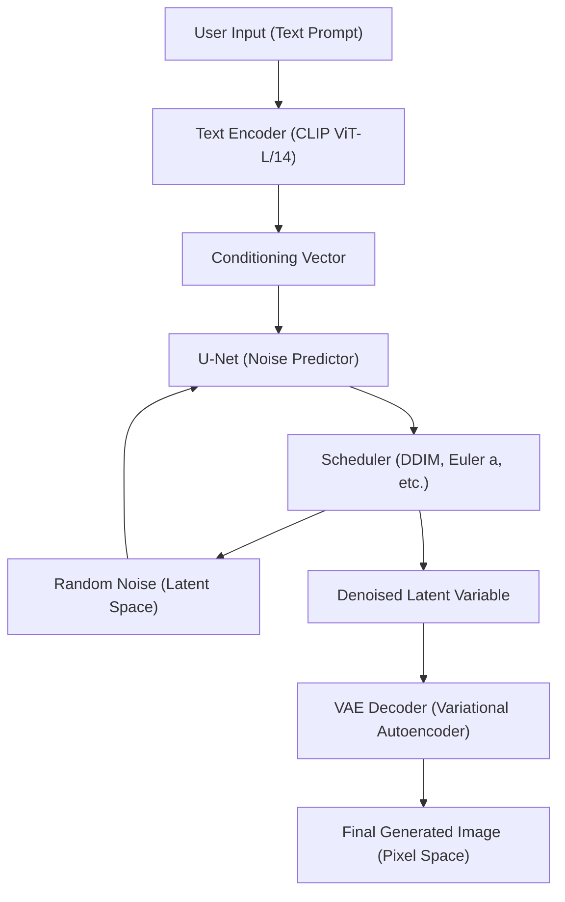
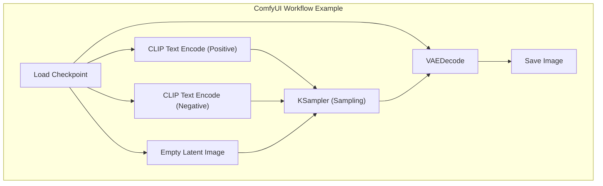

## 1. Introduction: Why perform AI image generation in a local environment?

AI image generation technology has achieved explosive evolution, starting with the open-sourcing of Stable Diffusion. Currently, cloud-based commercial services like Midjourney, DALL-E 3, and Adobe Firefly are also extremely powerful and easy to use. However, these services have disadvantages such as restrictions on generated content due to terms of service (e.g., NSFW filters), ongoing subscription costs, and the inability to control the detailed generation process.

Building AI image generation tools in a local environment (your own PC) has the following overwhelming advantages:

1. **Complete freedom and unlimited generation**: There are no limits on the number of images generated or additional costs. You can generate images infinitely as long as local resources allow.
2. **High customizability**: Detailed composition control and reproduction of specific characters or art styles are possible using LoRA (Low-Rank Adaptation) and ControlNet.
3. **Privacy and security**: Since data is not sent to the cloud, it is ideal for highly confidential design work or personal projects.
4. **Immediate adoption of the latest technology**: You can quickly try out the latest models and extensions announced daily by the open-source community.

Assuming a Windows environment, this manual will thoroughly explain in over 10,000 characters the setup methods for the currently mainstream three AI image generation environments (AUTOMATIC1111 Stable Diffusion WebUI, ComfyUI, Fooocus), their underlying mathematical background, and even VRAM optimization techniques.

---

## 2. Mathematical Background and Architecture of Diffusion Models

To build a local environment and appropriately configure parameters, it is highly beneficial to understand how **Latent Diffusion Models (LDM)** like Stable Diffusion work.

### 2.1 Forward Process and Reverse Process

The basic principle of diffusion models consists of a "Forward Process" that incrementally adds Gaussian noise to the original data (image) until it eventually becomes complete noise, and a "Reverse Process" that restores the original image from that noise.

The Forward Process is defined as a Markov chain, and the state $x_t$ at step $t$ is expressed by the following equation:

$$ q(x_t | x_{t-1}) = \mathcal{N}(x_t; \sqrt{1 - \beta_t} x_{t-1}, \beta_t I) $$

By using the reparameterization trick, the state at any arbitrary step $t$ can be calculated directly from the initial state $x_0$:

$$ x_t = \sqrt{\bar{\alpha}_t} x_0 + \sqrt{1 - \bar{\alpha}_t} \epsilon $$

Here, $\alpha_t = 1 - \beta_t$, $\bar{\alpha}_t = \prod_{s=1}^t \alpha_s$, and $\epsilon \sim \mathcal{N}(0, I)$ is the noise sampled from the standard normal distribution.

In the Reverse Process, which is the image generation phase, a neural network (U-Net) $\epsilon_\theta$ is used to predict and remove the added noise. The loss function is simply as follows:

$$ L_{simple} = \mathbb{E}_{x_0, \epsilon \sim \mathcal{N}(0, I), t} \left[ || \epsilon - \epsilon_\theta(\sqrt{\bar{\alpha}_t} x_0 + \sqrt{1 - \bar{\alpha}_t} \epsilon, t) ||^2 \right] $$

### 2.2 Computational Complexity Reduction via Latent Space

Directly performing denoising in the Pixel Space is an extremely heavy process because the computational complexity increases quadratically with the image resolution. Stable Diffusion uses a **VAE (Variational Autoencoder)** to transform the image into a compressed "Latent Space" before processing.

The encoder $E$ compresses an image of resolution $H \times W \times 3$ into $z \in \mathbb{R}^{H/8 \times W/8 \times 4}$. Since the spatial dimensions are reduced to one-eighth, the computational complexity of the Self-Attention mechanism becomes $\mathcal{O}((\frac{H \times W}{64})^2)$, bringing dramatic performance improvements. After generation, it is restored to the pixel space as $\tilde{x} = D(z)$ by the decoder $D$.

### 2.3 Stable Diffusion System Architecture

The following Mermaid diagram illustrates the overall generation process of Stable Diffusion (text-to-image generation: txt2img).



---

## 3. Thorough Breakdown of Hardware Requirements

In local AI image generation, hardware selection is the most important factor.

### 3.1 GPU (Graphics Board)
The heart of AI processing. When running Stable Diffusion in a Windows environment, an NVIDIA GPU is the de facto standard. While it is possible to run it on AMD Radeon using ROCm, considering the difficulty of setting up the environment on Windows and the fact that many extensions rely on CUDA (NVIDIA's parallel computing architecture), it's no exaggeration to say that NVIDIA is the only choice.

*   **Minimum Requirements**: 6GB VRAM (GTX 1060 6GB / RTX 2060, etc.). *Note: Major limitations will occur regarding resolution and features.*
*   **Recommended Requirements**: 12GB VRAM (RTX 3060 12GB / RTX 4070, etc.). This is the baseline for running SDXL models comfortably.
*   **Ideal Requirements**: 16GB - 24GB VRAM (RTX 4080 / RTX 3090 / RTX 4090). Required for high-resolution generation, simultaneous use of complex ControlNets, and local model training (LoRA, etc.).

### 3.2 Memory (RAM) and Storage
*   **RAM**: 32GB or more is strongly recommended. When transferring models (several GB to tens of GB) from storage to VRAM, system RAM is temporarily used. If RAM is insufficient, the page file will be used, causing a fatal drop in speed.
*   **Storage**: An NVMe M.2 SSD is mandatory. Recent AI models (Checkpoints) are 2GB to 7GB each in size. If an HDD is used, simply loading a model will take several minutes, making it impractical.

---

## 4. Basic Software Setup (Windows Edition)

Before installing the main tools, prepare the necessary basic software.

### 4.1 Installing Python
Most AI tools are written in Python. Install **Python 3.10.6**, which has the highest compatibility with Stable Diffusion WebUI and others (newer versions may break dependencies like PyTorch).

1.  Download `python-3.10.6-amd64.exe` from the official Python archive.
2.  When starting the installer, make absolutely sure to check **"Add Python 3.10 to PATH"** at the bottom.
3.  On the installation completion screen, click **"Disable path length limit"** (Important: If you do not disable the Windows 260-character path limit, errors will occur with deeply nested dependency libraries).

### 4.2 Installing Git for Windows
Git is required to fetch source code and models from GitHub.
1.  Download the installer from the official Git for Windows website and install it using all default settings.

### 4.3 CUDA Toolkit and cuDNN Configuration
Since the latest PyTorch bundles and downloads the necessary CUDA binaries during installation, it is no longer mandatory to install the CUDA Toolkit system-wide. However, if you plan to use custom extensions (like building TensorRT or xFormers), it is recommended to install **CUDA Toolkit 11.8** or **12.1** (matching the PyTorch version you use) from the official NVIDIA website.

---

## 5. Setup Procedures for the Top 3 Frontends

Here are the setup procedures for the currently mainstream three AI image generation tools. Use them according to your purpose and skills.

### 5.1 Setting up AUTOMATIC1111 Stable Diffusion WebUI
This is the most established, versatile tool with abundant extensions and fine parameter adjustments.

**Installation Procedure:**
1.  Open a Command Prompt in a directory of your choice (e.g., `C:\work\ai`).
2.  Run the following command to clone the repository:
    ```cmd
    git clone https://github.com/AUTOMATIC1111/stable-diffusion-webui.git
    ```
3.  Right-click `webui-user.bat` inside the cloned directory and open it in edit mode.
4.  To improve performance, set the launch arguments `COMMANDLINE_ARGS` as follows:
    ```bat
    set COMMANDLINE_ARGS=--xformers --opt-sdp-attention --theme dark
    ```
5.  Double-click `webui-user.bat` to run it. The first launch will download massive libraries like PyTorch, which may take several tens of minutes depending on your environment.
6.  Once completed, `Running on local URL: http://127.0.0.1:7860` will be displayed, so access it via your web browser.

### 5.2 Setting up ComfyUI and the Advantages of Node-Based UI
ComfyUI is a visually connected, Node-based UI where the generation process is linked by blocks called "nodes". Its VRAM management is extremely excellent, and it often runs even in environments where AUTOMATIC1111 would run out of memory.



**Installation Procedure:**
1.  Download the Windows Standalone 7z file from the ComfyUI official GitHub releases page.
2.  Extract it, and simply run `run_nvidia_gpu.bat` inside to launch it (no setup is required as it is a portable version including Python).
3.  **Introducing ComfyUI Manager**: Essential for managing extensions. Open a Command Prompt in the `ComfyUI/custom_nodes/` directory and execute the following:
    ```cmd
    git clone https://github.com/ltdrdata/ComfyUI-Manager.git
    ```
    After restarting, a "Manager" button will appear in the bottom right of the UI, allowing you to install various custom nodes from there.

### 5.3 Setting up Fooocus: High-Quality Generation for Beginners
Fooocus is a UI created with the goal of "producing overwhelmingly beautiful images even with short prompts," similar to Midjourney. It is specifically tuned for SDXL models and automatically performs GPT-2 based prompt expansion and complex pipelines internally.

**Installation Procedure:**
1.  Download the Windows release pack from the Fooocus official GitHub and extract it.
2.  Run `run.bat`. Excellent SDXL models like Juggernaut XL will be downloaded automatically, placing it in a state where high-quality generation can begin immediately.
3.  By checking "Advanced", you can also use advanced features like Image Prompt and Inpainting.

---

## 6. Model Management and Understanding Data Structures

The quality of AI image generation depends entirely on the model (pre-trained data) used.

### 6.1 Checkpoints (Base Models)
These are the core main models for image generation. In the past, `.ckpt` (Pickle format) was the mainstream, but it contained vulnerabilities that allowed arbitrary Python code execution (Arbitrary Code Execution). Currently, the **`.safetensors`** format, which ensures security and enables zero-copy loading (mmap) from disk to memory, is the standard. Never download `.ckpt` files of unknown origin.

### 6.2 Mathematical Behavior of LoRA (Low-Rank Adaptation)
LoRA is a technology that adds training for specific characters or art styles while avoiding the massive computational resources required for full model fine-tuning.

Instead of directly updating the weight matrix $W_0 \in \mathbb{R}^{d \times k}$ with billions of parameters, LoRA introduces two low-rank matrices $A \in \mathbb{R}^{r \times k}$ and $B \in \mathbb{R}^{d \times r}$ (rank $r \ll \min(d, k)$). The new weights are calculated as follows:

$$ W = W_0 + \Delta W = W_0 + B A $$

As a result, the number of parameters to be trained and saved drastically decreases from $d \times k$ to $r \times (d + k)$, allowing powerful style application with lightweight files of a few hundred megabytes.

### 6.3 VAE (Variational Autoencoder)
As mentioned earlier, this is a model that converts between the latent space and the pixel space. In anime-style models, if the VAE is not set correctly, the output may result in a overall whitish, low-contrast "sleepy image". Place an anime-specialized VAE, such as `kl-f8-anime2.ckpt`, in the `models/VAE` folder and apply it.

### 6.4 Directory Structure Example (AUTOMATIC1111)
```text
stable-diffusion-webui/
├── models/
│   ├── Stable-diffusion/  <-- Place Checkpoints (.safetensors) here
│   ├── Lora/              <-- Place LoRA models here
│   ├── VAE/               <-- Place VAE models here
│   └── ControlNet/        <-- Place ControlNet models here
├── embeddings/            <-- Place Textual Inversion (PT files) here
├── extensions/            <-- Git Cloned extension groups
└── webui-user.bat         <-- Launch batch file
```

---

## 7. VRAM Optimization and Performance Tuning

Techniques to avoid the biggest hurdle of local generation, "VRAM shortage (CUDA Out Of Memory)," and to push generation speed to the limit.

### 7.1 Attention Mechanism Optimization (xFormers / SDP Attention)
Most of Stable Diffusion's computation is spent on Cross-Attention within the U-Net. Since the default Attention calculation consumes a lot of memory, it is optimized with the following approaches.

*   **xFormers (`--xformers`)**: A memory-efficient Attention implementation developed by Meta. It significantly reduces VRAM consumption and improves speed, but due to the non-determinism of calculations, it has the characteristic of "producing slightly different images even with exactly the same seed value".
*   **SDP Attention (`--opt-sdp-attention`)**: Scaled Dot Product Attention incorporated as standard from PyTorch 2.0. It has the advantage of having fewer dependencies while providing speed and VRAM reduction effects equivalent to xFormers. There are also variations like `--opt-sub-quad-attention` that do not have non-determinism.

### 7.2 VRAM Saving Launch Options
*   `--medvram`: For environments with 6GB to 8GB of VRAM. It divides the U-Net for processing and saves memory, but the speed slightly decreases.
*   `--lowvram`: For environments with 4GB of VRAM or less. Because it moves modules in and out of VRAM finely, the speed drastically decreases, but it allows for forced execution.
*   `--medvram-sdxl`: An extremely useful flag that applies MedVRAM only when using SDXL models.

### 7.3 Ultra-Acceleration via TensorRT
**TensorRT** is a framework for utilizing the Tensor Cores of NVIDIA GPUs to their utmost limit.
It compiles the Stable Diffusion U-Net into a dedicated engine (`.trt` file) for the GPU being used. Compilation takes several tens of minutes, and there are disadvantages such as fixed resolution and batch sizes (Dynamic Shape is possible but efficiency drops), but the generation speed jumps by **1.5 to over 2 times**. It is the ultimate optimization method for business purposes where massive amounts of images at the same resolution are generated.

### 7.4 Tiled VAE / Tiled Diffusion
When generating or upscaling high-resolution images (such as 4K), VRAM will immediately dry up during the VAE decoding process. To prevent this, extensions (Multidiffusion / Tiled VAE) that process the image by dividing it into tiles (e.g., $512 \times 512$ at a time) and merging them at the end are essential.

---

## 8. Advanced Control Technology: ControlNet

With text prompts alone, it is impossible to specify a character's pose, complex perspective, or fine movements of fingertips. **ControlNet** solves this.

ControlNet has an architecture that fixes the weights of the pre-trained Stable Diffusion model, copies the encoder structure, and inserts "Zero-convolutions" (convolutional layers initialized with zero weights). This allows for additional conditioning to be applied without destroying the original generation capabilities.

**Typical Preprocessors and Models:**
*   **OpenPose**: Extracts human skeletons (joint positions) and generates images with exactly the same pose.
*   **Canny**: Performs edge detection and applies coloring or photorealism based on line art.
*   **Depth**: Generates a Depth Map and creates images that maintain spatial front-to-back relationships.
*   **Lineart**: Superior to Canny for anime-style line art extraction.

By simultaneously applying multiple of these ControlNets (Multi-ControlNet), it becomes possible to reliably output "an image with a specified pose and a specified background perspective".

---

## 9. Troubleshooting (FAQ)

Frequently occurring errors in local environment setup and operation, along with their solutions.

### Q1. Generation stops with the error `CUDA out of memory.`
**A1:** You are out of VRAM. Please lower the generation resolution or set the batch size to 1. Also, for A1111, add `--xformers` and `--medvram` to `webui-user.bat` and restart. When performing high-resolution upscaling (Hires. fix), using an ESRGAN-type Upscaler like R-ESRGAN instead of a Latent-type one will suppress VRAM consumption.

### Q2. The generated image is completely black or full of noise.
**A2:** This is a phenomenon where NaN (Not a Number) values occur during calculation, causing the tensors to collapse. Take the following actions:
1. Add `--no-half-vae` to the launch options to make only the VAE calculate in single precision (FP32).
2. Add `--disable-nan-check` to the launch options (this is not a fundamental solution).
3. The model you are using (especially the SD 2.1 series) may not be suitable for FP16 calculation, so try full precision mode.

### Q3. Python or Git errors appear when starting `webui-user.bat`.
**A3:** Inconsistencies in dependency libraries are suspected. Completely delete the `venv` folder within the WebUI directory, and run `webui-user.bat` again. The virtual environment will be rebuilt in a clean state (this will involve re-downloading several gigabytes).

### Q4. I downloaded a model (Safetensors) but it doesn't appear in the list.
**A4:** After placing it in the `models/Stable-diffusion` folder, press the "Refresh" button next to the Checkpoint selection dropdown on the UI. If you have placed it in a subfolder, verify that the file extension is not incorrect.

---

## 10. Conclusion: The Future of AI Image Generation and the Superiority of Local Environments

The open-source AI image generation movement that began with Stable Diffusion continues to evolve into next-generation architectures like SDXL, and Stable Diffusion 3 or Flux.1. The number of parameters in models has grown immensely from billions to tens of billions, and moving forward, GPU environments with 24GB of VRAM or more will become increasingly necessary.

However, local optimization technologies such as TensorRT, Quantization, and GGUF are also accelerating their speed of evolution, and an ecosystem is forming where sufficient inference becomes possible even on hardware for general consumers.

The CUDA environment setup, VRAM optimization, and pipeline understanding of ComfyUI and others explained in this manual serve as a universal foundation of knowledge that will remain relevant regardless of how AI technology trends change. We hope that your creativity is maximized in a local environment free of limitations.
