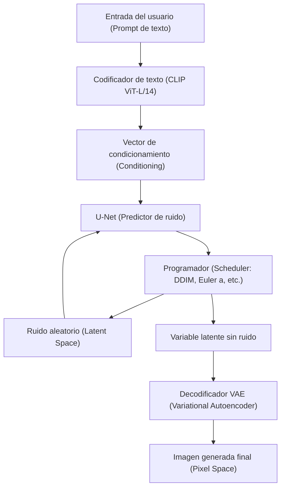
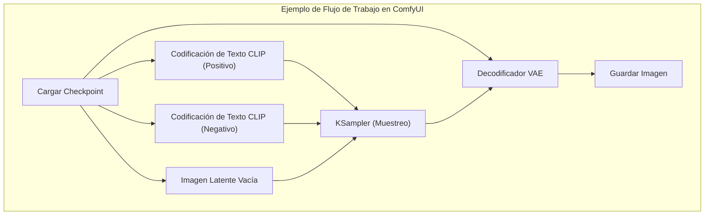

## 1. Introducción: ¿Por qué generar imágenes por IA en un entorno local?

La tecnología de generación de imágenes por IA ha experimentado una evolución explosiva desde que Stable Diffusion se convirtió en código abierto. Actualmente, los servicios comerciales basados en la nube como Midjourney, DALL-E 3 y Adobe Firefly también son muy potentes y fáciles de usar. Sin embargo, estos servicios tienen desventajas como restricciones en el contenido generado debido a los términos de servicio (por ejemplo, filtros NSFW), costos continuos debido a las suscripciones y la imposibilidad de controlar el proceso de generación en detalle.

Construir una herramienta de generación de imágenes por IA en un entorno local (su propio PC) tiene las siguientes ventajas abrumadoras:

1. **Libertad completa y generación ilimitada**: No hay límite en el número de imágenes generadas ni costos adicionales, y puede generar infinitas imágenes siempre que sus recursos locales lo permitan.
2. **Alta personalización**: Es posible el control detallado de la composición y la reproducción de personajes o estilos artísticos específicos mediante el uso de LoRA (Low-Rank Adaptation) y ControlNet.
3. **Privacidad y seguridad**: Como los datos no se envían a la nube, es ideal para tareas de diseño altamente confidenciales o proyectos personales.
4. **Introducción inmediata de las últimas tecnologías**: Puede probar los últimos modelos y extensiones que la comunidad de código abierto publica diariamente.

Este manual asume un entorno de Windows y explicará a fondo (con un volumen de más de 10,000 caracteres) desde cómo construir los tres principales entornos de generación de imágenes por IA (AUTOMATIC1111 Stable Diffusion WebUI, ComfyUI, Fooocus), hasta los antecedentes matemáticos fundamentales e incluso métodos de optimización de VRAM.

---

## 2. Antecedentes matemáticos y arquitectura del modelo de difusión (Diffusion Model)

Para construir un entorno local y configurar los parámetros adecuadamente, es muy útil comprender cómo funcionan los **modelos de difusión latente (Latent Diffusion Model: LDM)** como Stable Diffusion.

### 2.1 Proceso de adición de ruido (Forward Process) y proceso de eliminación (Reverse Process)

El principio básico del modelo de difusión consiste en un "Forward Process" que agrega ruido gaussiano gradualmente a los datos originales (imagen) hasta convertirlo en ruido completo, y un "Reverse Process" que restaura la imagen original a partir de ese ruido.

El Forward Process se define como una cadena de Markov, y el estado $x_t$ en el paso $t$ se expresa mediante la siguiente ecuación:

$$ q(x_t | x_{t-1}) = \mathcal{N}(x_t; \sqrt{1 - \beta_t} x_{t-1}, \beta_t I) $$

Utilizando el truco de reparametrización (Reparameterization trick), se puede calcular el estado de cualquier paso $t$ directamente desde el estado inicial $x_0$.

$$ x_t = \sqrt{\bar{\alpha}_t} x_0 + \sqrt{1 - \bar{\alpha}_t} \epsilon $$

Aquí, $\alpha_t = 1 - \beta_t$, $\bar{\alpha}_t = \prod_{s=1}^t \alpha_s$, y $\epsilon \sim \mathcal{N}(0, I)$ es ruido muestreado de una distribución normal estándar.

En el Reverse Process, que es la fase de generación de imágenes, se utiliza una red neuronal (U-Net) $\epsilon_\theta$ para predecir y eliminar el ruido agregado. La función de pérdida (loss function) es simplemente la siguiente:

$$ L_{simple} = \mathbb{E}_{x_0, \epsilon \sim \mathcal{N}(0, I), t} \left[ || \epsilon - \epsilon_\theta(\sqrt{\bar{\alpha}_t} x_0 + \sqrt{1 - \bar{\alpha}_t} \epsilon, t) ||^2 \right] $$

### 2.2 Reducción del costo computacional mediante el espacio latente (Latent Space)

Si la eliminación de ruido se realiza directamente en el espacio de píxeles (Pixel Space), la cantidad de cálculos aumenta cuadráticamente con la resolución de la imagen, lo que lo convierte en un proceso muy pesado. Stable Diffusion utiliza un **VAE (Variational Autoencoder)** para convertir la imagen en un "espacio latente (Latent Space)" comprimido antes de procesarla.

El codificador $E$ comprime una imagen con resolución $H \times W \times 3$ en $z \in \mathbb{R}^{H/8 \times W/8 \times 4}$. Como la dimensión espacial se reduce a un octavo, el costo computacional del mecanismo de autoatención (Self-Attention) pasa a ser $\mathcal{O}((\frac{H \times W}{64})^2)$, lo que supone una mejora espectacular del rendimiento. Después de la generación, el decodificador $D$ restaura la imagen al espacio de píxeles como $\tilde{x} = D(z)$.

### 2.3 Arquitectura del sistema de Stable Diffusion

El siguiente diagrama de Mermaid muestra el proceso general de generación de Stable Diffusion (generación de imágenes a partir de texto: txt2img).



---

## 3. Análisis exhaustivo de los requisitos de hardware

En la generación de imágenes por IA en local, la selección del hardware es lo más importante.

### 3.1 GPU (Tarjeta gráfica)
Es el corazón del procesamiento de IA. Al ejecutar Stable Diffusion en un entorno Windows, las GPU de NVIDIA son el estándar de facto. Aunque es posible ejecutarlo en Radeon de AMD utilizando ROCm, considerando la dificultad de configurar el entorno en Windows y que muchas extensiones dependen de CUDA (la arquitectura de computación paralela de NVIDIA), se puede decir que NVIDIA es la única opción viable.

*   **Requisitos mínimos**: VRAM de 6GB (GTX 1060 6GB / RTX 2060, etc.). *Sin embargo, habrá grandes restricciones en la resolución y las funciones.*
*   **Requisitos recomendados**: VRAM de 12GB (RTX 3060 12GB / RTX 4070, etc.). Es la línea base para ejecutar modelos SDXL cómodamente.
*   **Requisitos ideales**: VRAM de 16GB a 24GB (RTX 4080 / RTX 3090 / RTX 4090). Necesario para la generación de alta resolución, uso simultáneo de ControlNet complejos y entrenamiento de modelos locales (LoRA, etc.).

### 3.2 Memoria (RAM) y Almacenamiento
*   **RAM**: Se recomiendan encarecidamente 32GB o más. Al transferir modelos (desde varios GB hasta decenas de GB) del almacenamiento a la VRAM, se utiliza temporalmente la memoria RAM del sistema. Si falta RAM, se utilizará el archivo de paginación (page file), lo que provocará una caída fatal en la velocidad.
*   **Almacenamiento**: Un SSD NVMe M.2 es obligatorio. Los modelos de IA recientes (Checkpoints) tienen una capacidad de entre 2GB y 7GB cada uno. Si se utiliza un HDD, solo la carga del modelo tardará varios minutos, lo cual no es práctico.

---

## 4. Configuración del software base (Edición Windows)

Antes de instalar las herramientas principales, prepararemos el software base necesario.

### 4.1 Instalación de Python
La mayoría de las herramientas de IA están escritas en Python. Instalaremos **Python 3.10.6**, que tiene la mayor compatibilidad con Stable Diffusion WebUI y otros (las versiones demasiado nuevas pueden romper dependencias como PyTorch).

1.  Descargue `python-3.10.6-amd64.exe` desde el archivo oficial de Python.
2.  Al iniciar el instalador, asegúrese de marcar la casilla **"Add Python 3.10 to PATH"** en la parte inferior.
3.  En la pantalla de finalización de la instalación, haga clic en **"Disable path length limit"** (Desactivar límite de longitud de ruta). (Importante: si no se desactiva el límite de ruta de 260 caracteres de Windows, se producirán errores en bibliotecas dependientes de jerarquías profundas).

### 4.2 Instalación de Git for Windows
Git es necesario para obtener el código fuente y los modelos desde GitHub.
1.  Descargue el instalador desde el sitio oficial de Git for Windows e instálelo con todas las configuraciones predeterminadas.

### 4.3 Configuración de CUDA Toolkit y cuDNN
Como el PyTorch más reciente descarga los binarios de CUDA necesarios durante la instalación, ya no es obligatorio instalar el CUDA Toolkit en todo el sistema. Sin embargo, si planea usar extensiones personalizadas (compilación de TensorRT o xFormers), se recomienda instalar **CUDA Toolkit 11.8** o **12.1** (según el PyTorch a utilizar) desde el sitio oficial de NVIDIA.

---

## 5. Procedimiento de construcción de los 3 grandes frontends

Explicaremos cómo construir las tres principales herramientas de generación de imágenes por IA en la actualidad. Úselas de acuerdo con su propósito y habilidades.

### 5.1 Construcción de AUTOMATIC1111 Stable Diffusion WebUI
Es la herramienta más versátil, con la historia más larga, abundantes extensiones y ajustes finos de parámetros.

**Procedimiento de instalación:**
1.  Abra el símbolo del sistema en cualquier directorio (por ejemplo, `C:\work\ai`).
2.  Ejecute el siguiente comando para clonar el repositorio:
    ```cmd
    git clone https://github.com/AUTOMATIC1111/stable-diffusion-webui.git
    ```
3.  Haga clic derecho en `webui-user.bat` dentro del directorio clonado y ábralo en modo de edición.
4.  Para mejorar el rendimiento, configure los argumentos de inicio `COMMANDLINE_ARGS` de la siguiente manera:
    ```bat
    set COMMANDLINE_ARGS=--xformers --opt-sdp-attention --theme dark
    ```
5.  Haga doble clic en `webui-user.bat` para ejecutarlo. La primera vez, se descargarán bibliotecas enormes como PyTorch, por lo que puede tardar varias decenas de minutos según su entorno.
6.  Cuando finalice, se mostrará `Running on local URL: http://127.0.0.1:7860`, y podrá acceder a él a través de su navegador.

### 5.2 Construcción de ComfyUI y las ventajas del uso de nodos
ComfyUI es una interfaz basada en nodos (Node-based) que conecta visualmente el proceso de generación mediante bloques llamados "nodos". Su gestión de la VRAM es excelente y, a menudo, funciona en entornos donde AUTOMATIC1111 se quedaría sin memoria.



**Procedimiento de instalación:**
1.  Descargue el archivo 7z de la versión Windows Standalone desde la página oficial de lanzamientos de GitHub de ComfyUI.
2.  Descomprímalo y simplemente ejecute `run_nvidia_gpu.bat` dentro (no requiere configuración porque es una versión portátil con Python incluido).
3.  **Instalación de ComfyUI Manager**: Esencial para gestionar extensiones. Abra el símbolo del sistema en el directorio `ComfyUI/custom_nodes/` y ejecute lo siguiente:
    ```cmd
    git clone https://github.com/ltdrdata/ComfyUI-Manager.git
    ```
    Al reiniciar, aparecerá el botón "Manager" en la parte inferior derecha de la interfaz, desde donde podrá instalar varios nodos personalizados.

### 5.3 Construcción de Fooocus: Alta calidad para principiantes
Fooocus es una interfaz diseñada con el objetivo de "obtener imágenes abrumadoramente hermosas incluso con prompts cortos", al estilo de Midjourney. Está optimizada específicamente para modelos SDXL y realiza internamente la expansión de prompts basada en GPT-2 y complejos pipelines (procesos automáticos).

**Procedimiento de instalación:**
1.  Descargue y descomprima el paquete de lanzamiento para Windows desde el GitHub oficial de Fooocus.
2.  Ejecute `run.bat`. Se descargarán automáticamente excelentes modelos SDXL como Juggernaut XL, y estará listo para comenzar la generación de alta calidad de inmediato.
3.  Marcando la casilla "Advanced", también podrá utilizar funciones avanzadas como Image Prompt (Prompt de imagen) o Inpainting.

---

## 6. Gestión de modelos y comprensión de la estructura de datos

La calidad de la generación de imágenes por IA depende completamente del modelo (datos entrenados) que se utilice.

### 6.1 Checkpoints (Modelos Base)
Es el modelo principal, el núcleo de la generación de imágenes. Anteriormente, el formato `.ckpt` (formato Pickle) era el predominante, pero contenía vulnerabilidades de ejecución de código arbitrario (Arbitrary Code Execution), ya que permitía ejecutar cualquier código Python. Actualmente, el formato **`.safetensors`** es el estándar, ya que garantiza la seguridad y permite cargas sin copia (mmap) desde el disco a la memoria. Nunca descargue archivos `.ckpt` de origen desconocido.

### 6.2 Comportamiento matemático de LoRA (Low-Rank Adaptation)
LoRA es una técnica para evitar el enorme costo computacional necesario para el ajuste fino de un modelo completo (fine-tuning) y añadir el aprendizaje de un personaje o estilo específico.

En lugar de actualizar directamente la matriz de pesos $W_0 \in \mathbb{R}^{d \times k}$ con miles de millones de parámetros, LoRA introduce dos matrices de rango bajo $A \in \mathbb{R}^{r \times k}$ y $B \in \mathbb{R}^{d \times r}$ (rango $r \ll \min(d, k)$). El nuevo peso se calcula de la siguiente manera:

$$ W = W_0 + \Delta W = W_0 + B A $$

Gracias a esto, la cantidad de parámetros a entrenar y guardar se reduce drásticamente de $d \times k$ a $r \times (d + k)$, permitiendo la aplicación de estilos potentes con archivos ligeros de solo unos cientos de MB.

### 6.3 VAE (Variational Autoencoder)
Como se mencionó anteriormente, es el modelo que transforma entre el espacio latente y el espacio de píxeles. En los modelos de estilo anime, si no se configura el VAE adecuadamente, la salida puede resultar en "imágenes apagadas", con aspecto blanquecino y bajo contraste. Se debe colocar y aplicar un VAE especializado en anime, como `kl-f8-anime2.ckpt`, en la carpeta `models/VAE`.

### 6.4 Ejemplo de estructura de directorios (AUTOMATIC1111)
```text
stable-diffusion-webui/
├── models/
│   ├── Stable-diffusion/  <-- Coloque aquí los Checkpoints (.safetensors)
│   ├── Lora/              <-- Coloque aquí los modelos LoRA
│   ├── VAE/               <-- Coloque aquí los modelos VAE
│   └── ControlNet/        <-- Coloque aquí los modelos para ControlNet
├── embeddings/            <-- Coloque aquí los Textual Inversion (archivos PT)
├── extensions/            <-- Extensiones clonadas desde Git
└── webui-user.bat         <-- Archivo batch de inicio
```

---

## 7. Optimización de VRAM y ajuste de rendimiento

Técnicas para superar la mayor barrera de la generación local, la "falta de VRAM (CUDA Out Of Memory)", y maximizar la velocidad de generación.

### 7.1 Optimización del mecanismo de Atención (xFormers / SDP Attention)
La mayor parte de los cálculos de Stable Diffusion se invierten en la Cross-Attention dentro de U-Net. Como el cálculo de Atención predeterminado consume mucha memoria, se optimiza mediante los siguientes enfoques:

*   **xFormers (`--xformers`)**: Una implementación de Atención eficiente en memoria (Memory Efficient Attention) desarrollada por Meta. Reduce drásticamente el consumo de VRAM y mejora la velocidad, pero tiene la característica de que debido al no determinismo en los cálculos "genera imágenes ligeramente diferentes incluso con exactamente el mismo valor de semilla (seed)".
*   **SDP Attention (`--opt-sdp-attention`)**: Scaled Dot Product Attention, incorporado de forma estándar desde PyTorch 2.0. Tiene el mismo efecto de reducción de VRAM y velocidad que xFormers, con la ventaja de tener menos dependencias. También hay variaciones sin no determinismo como `--opt-sub-quad-attention`.

### 7.2 Opciones de inicio para ahorrar VRAM
*   `--medvram`: Para entornos con 6GB a 8GB de VRAM. Ahorra memoria procesando el U-Net en partes, pero la velocidad disminuye un poco.
*   `--lowvram`: Para entornos con 4GB de VRAM o menos. Intercambia módulos constantemente con la VRAM, lo que reduce drásticamente la velocidad pero permite la ejecución forzada.
*   `--medvram-sdxl`: Una bandera muy útil que aplica MedVRAM solo cuando se usan modelos SDXL.

### 7.3 Ultra aceleración con TensorRT
**TensorRT** es un framework (marco de trabajo) para aprovechar al máximo los Tensor Cores de las GPU NVIDIA.
Se compila el U-Net de Stable Diffusion como un motor dedicado (archivo `.trt`) para la GPU en uso. La compilación lleva varias decenas de minutos y tiene la desventaja de fijar la resolución y el tamaño del lote (Dynamic Shape es posible pero reduce la eficiencia), pero la velocidad de generación aumenta **entre 1.5 y más de 2 veces**. Es la mejor técnica de optimización para usos profesionales donde se generan grandes cantidades de imágenes de la misma resolución.

### 7.4 Tiled VAE / Tiled Diffusion
Al generar o escalar imágenes de alta resolución (como 4K), la VRAM se agota de inmediato durante el proceso de decodificación del VAE. Para evitar esto, es indispensable utilizar una extensión (Multidiffusion / Tiled VAE) que divida la imagen en cuadrículas (por ejemplo, fragmentos de $512 \times 512$), las procese por separado y finalmente las combine.

---

## 8. Tecnología de control avanzado: ControlNet

Con solo prompts de texto, es imposible especificar la pose de un personaje, perspectivas complejas o los movimientos detallados de las yemas de los dedos. Quien resuelve esto es **ControlNet**.

ControlNet mantiene fijos los pesos del modelo de Stable Diffusion entrenado, copia la estructura del codificador e intercala "Zero-convolutions (capas de convolución inicializadas con pesos en cero)". Esto permite agregar condicionamientos adicionales sin destruir la capacidad de generación original.

**Preprocesadores y modelos representativos:**
*   **OpenPose**: Extrae el esqueleto humano (posiciones de las articulaciones) y genera una imagen con exactamente la misma pose.
*   **Canny**: Detecta los bordes y colorea o convierte en imagen realista basándose en el dibujo lineal (lineart).
*   **Depth**: Genera un mapa de profundidad (Depth Map) y produce una imagen manteniendo las relaciones espaciales de adelante hacia atrás.
*   **Lineart**: Es superior a Canny en la extracción de líneas para estilos de anime.

Al aplicar múltiples ControlNets al mismo tiempo (Multi-ControlNet), es posible generar con certeza "imágenes con la pose especificada y la perspectiva del fondo especificada".

---

## 9. Solución de problemas (FAQ)

Errores frecuentes y sus soluciones en la construcción y operación de entornos locales.

### Q1. La generación se detiene con el error `CUDA out of memory.`.
**A1:** Falta VRAM. Baje la resolución de generación o establezca el tamaño del lote (batch size) a 1. Además, en el caso de A1111, agregue `--xformers` y `--medvram` en `webui-user.bat` y reinicie. Al realizar mejoras de alta resolución (Hires. fix), si usa un escalador de la familia ESRGAN como R-ESRGAN en lugar de un escalador Latent, puede reducir el consumo de VRAM.

### Q2. La imagen generada sale completamente negra o llena de ruido.
**A2:** Es un fenómeno donde los tensores colapsan debido a la aparición de valores NaN (Not a Number) durante el cálculo. Realice las siguientes acciones:
1. Agregue la opción de inicio `--no-half-vae` para que solo el VAE calcule en precisión simple (FP32).
2. Agregue la opción de inicio `--disable-nan-check` (no es una solución de raíz).
3. Es posible que los cálculos en FP16 no sean adecuados para el modelo que está utilizando (especialmente en la serie SD 2.1), así que pruebe el modo de precisión completa.

### Q3. Se produce un error de Python o Git al iniciar `webui-user.bat`.
**A3:** Se sospecha una inconsistencia en las bibliotecas dependientes. Elimine por completo la carpeta `venv` dentro del directorio WebUI y vuelva a ejecutar `webui-user.bat`. El entorno virtual se reconstruirá desde cero (lo que provocará que se vuelvan a descargar varios GB).

### Q4. Descargué un modelo (Safetensors) pero no aparece en la lista.
**A4:** Asegúrese de colocarlo en la carpeta `models/Stable-diffusion` y presione el botón "Refresh" (Actualizar) junto al menú desplegable de selección de Checkpoint en la interfaz de usuario. Si lo colocó en una subcarpeta, verifique que la extensión sea correcta.

---

## 10. Conclusión: El futuro de la generación de imágenes por IA y la superioridad del entorno local

El movimiento de generación de imágenes por IA de código abierto, que comenzó con Stable Diffusion, continúa evolucionando hacia arquitecturas de próxima generación como SDXL, Stable Diffusion 3 y Flux.1. La cantidad de parámetros de los modelos se está volviendo enorme, pasando de miles de millones a decenas de miles de millones, por lo que en el futuro los entornos de GPU con más de 24 GB de VRAM serán aún más solicitados.

Sin embargo, tecnologías de optimización local como TensorRT, cuantización (Quantization) y GGUF también están acelerando su evolución a la misma velocidad, y se está formando un ecosistema donde la inferencia suficiente es posible incluso con hardware para consumidores en general.

La construcción del entorno CUDA, la optimización de la VRAM y la comprensión de canales de procesamiento (pipelines) como ComfyUI explicados en este manual se convertirán en conocimientos básicos universales que serán útiles independientemente de cómo cambien las tendencias tecnológicas de la IA. Esperamos que su creatividad se exprese al máximo en un entorno local sin restricciones.
