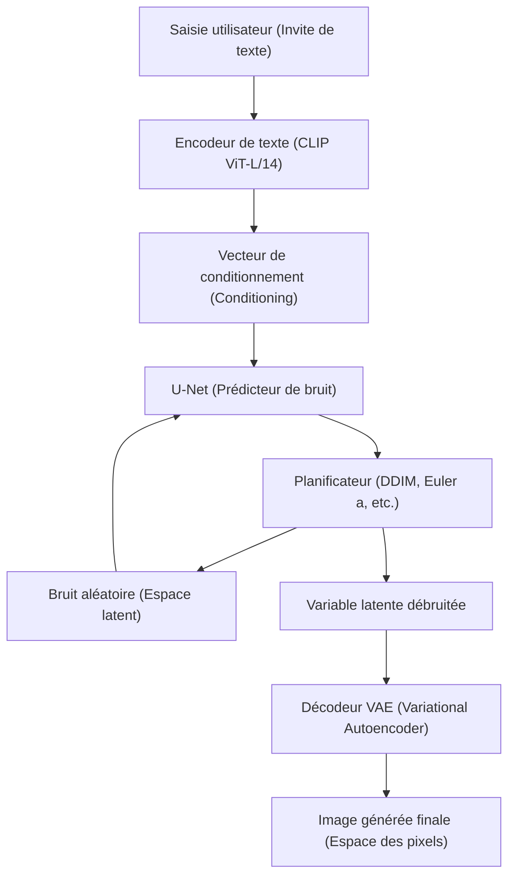
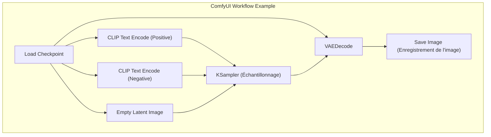

## 1. Introduction : Pourquoi générer des images par IA dans un environnement local ?

La technologie de génération d'images par IA a connu une évolution explosive depuis la mise en open source de Stable Diffusion. Actuellement, les services commerciaux basés sur le cloud tels que Midjourney, DALL-E 3 et Adobe Firefly sont également devenus extrêmement puissants et faciles à utiliser. Cependant, ces services présentent des inconvénients tels que les restrictions de contenu généré par les conditions d'utilisation (filtres NSFW, etc.), les coûts continus dus aux abonnements et l'impossibilité de contrôler en détail le processus de génération.

Configurer un outil de génération d'images par IA dans un environnement local (votre propre PC) présente les avantages majeurs suivants :

1. **Liberté totale et génération illimitée** : Il n'y a pas de limites au nombre d'images générées ni de coûts supplémentaires, et vous pouvez générer des images à l'infini tant que vos ressources locales le permettent.
2. **Haut niveau de personnalisation** : Il est possible de contrôler précisément la composition à l'aide de LoRA (Low-Rank Adaptation) ou ControlNet, et de reproduire des personnages ou des styles artistiques spécifiques.
3. **Confidentialité et sécurité** : Aucune donnée n'étant envoyée sur le cloud, c'est idéal pour les travaux de conception hautement confidentiels ou les projets personnels.
4. **Adoption immédiate des dernières technologies** : Vous pouvez être parmi les premiers à essayer les derniers modèles et extensions publiés quotidiennement par la communauté open source.

Ce manuel, basé sur un environnement Windows, explique en détail (avec plus de 10 000 caractères) comment configurer les trois environnements de génération d'images par IA actuellement dominants (AUTOMATIC1111 Stable Diffusion WebUI, ComfyUI, Fooocus), ainsi que les bases mathématiques sous-jacentes et les méthodes d'optimisation de la VRAM.

---

## 2. Contexte mathématique et architecture des modèles de diffusion (Diffusion Model)

Pour configurer un environnement local et définir correctement les paramètres, il est très utile de comprendre comment fonctionnent les **modèles de diffusion latente (Latent Diffusion Model : LDM)** tels que Stable Diffusion.

### 2.1 Processus d'ajout de bruit (Forward Process) et processus de suppression (Reverse Process)

Le principe fondamental des modèles de diffusion consiste en un « Forward Process » où un bruit gaussien est ajouté progressivement aux données d'origine (image) pour finalement devenir un bruit complet, et un « Reverse Process » qui restaure l'image d'origine à partir de ce bruit.

Le Forward Process est défini comme une chaîne de Markov, et l'état $x_t$ à l'étape $t$ est exprimé par l'équation suivante :

$$ q(x_t | x_{t-1}) = \mathcal{N}(x_t; \sqrt{1 - \beta_t} x_{t-1}, \beta_t I) $$

En utilisant l'astuce de reparamétrisation (Reparameterization trick), l'état à n'importe quelle étape $t$ peut être calculé directement à partir de l'état initial $x_0$ :

$$ x_t = \sqrt{\bar{\alpha}_t} x_0 + \sqrt{1 - \bar{\alpha}_t} \epsilon $$

Ici, $\alpha_t = 1 - \beta_t$, $\bar{\alpha}_t = \prod_{s=1}^t \alpha_s$, et $\epsilon \sim \mathcal{N}(0, I)$ est le bruit échantillonné à partir d'une distribution normale standard.

Dans le Reverse Process, qui est la phase de génération d'images, le réseau neuronal (U-Net) $\epsilon_\theta$ est utilisé pour prédire et supprimer le bruit ajouté. La fonction de perte est simplement la suivante :

$$ L_{simple} = \mathbb{E}_{x_0, \epsilon \sim \mathcal{N}(0, I), t} \left[ || \epsilon - \epsilon_\theta(\sqrt{\bar{\alpha}_t} x_0 + \sqrt{1 - \bar{\alpha}_t} \epsilon, t) ||^2 \right] $$

### 2.2 Réduction des calculs grâce à l'espace latent (Latent Space)

Si la suppression du bruit est effectuée directement dans l'espace des pixels (Pixel Space), la quantité de calcul augmente au carré par rapport à la résolution de l'image, ce qui en fait un processus très lourd. Stable Diffusion utilise un **VAE (Variational Autoencoder)** pour convertir l'image compressée dans un « espace latent (Latent Space) » avant de la traiter.

L'encodeur $E$ compresse une image de résolution $H \times W \times 3$ en $z \in \mathbb{R}^{H/8 \times W/8 \times 4}$. Les dimensions spatiales étant divisées par 8, la complexité de calcul du mécanisme d'auto-attention (Self-Attention) devient $\mathcal{O}((\frac{H \times W}{64})^2)$, ce qui entraîne une amélioration spectaculaire des performances. Après la génération, le décodeur $D$ restaure l'image dans l'espace des pixels en tant que $\tilde{x} = D(z)$.

### 2.3 Architecture du système de Stable Diffusion

Le diagramme Mermaid ci-dessous montre le processus de génération global de Stable Diffusion (génération d'images à partir de texte : txt2img).



---

## 3. Analyse approfondie des exigences matérielles

Le choix du matériel est primordial pour la génération d'images par IA en local.

### 3.1 GPU (Carte graphique)
C'est le cœur du traitement de l'IA. Pour exécuter Stable Diffusion dans un environnement Windows, les GPU NVIDIA sont le standard de facto. Bien qu'il soit possible d'utiliser les cartes Radeon d'AMD via ROCm, compte tenu de la difficulté de configuration sur Windows et du fait que de nombreuses extensions dépendent de CUDA (l'architecture de calcul parallèle de NVIDIA), on peut affirmer sans exagérer que NVIDIA est le seul choix viable.

*   **Exigences minimales** : VRAM 6 Go (GTX 1060 6 Go / RTX 2060, etc.). ※Cependant, il y aura d'importantes restrictions de résolution et de fonctionnalités.
*   **Exigences recommandées** : VRAM 12 Go (RTX 3060 12 Go / RTX 4070, etc.). C'est la limite minimale pour faire fonctionner confortablement les modèles SDXL.
*   **Exigences idéales** : VRAM 16 Go à 24 Go (RTX 4080 / RTX 3090 / RTX 4090). Nécessaire pour la génération en haute résolution, l'utilisation simultanée de ControlNet complexes ou l'apprentissage de modèles locaux (LoRA, etc.).

### 3.2 Mémoire (RAM) et stockage
*   **RAM** : 32 Go ou plus sont fortement recommandés. Lors du transfert du modèle (plusieurs Go à plusieurs dizaines de Go) du stockage vers la VRAM, la RAM système est temporairement utilisée. Un manque de RAM entraînera l'utilisation du fichier d'échange, provoquant une baisse de vitesse fatale.
*   **Stockage** : Un SSD NVMe M.2 est indispensable. Les modèles d'IA récents (Checkpoints) ont une taille de 2 Go à 7 Go chacun. Utiliser un disque dur (HDD) rendrait le système inutilisable car le seul chargement d'un modèle prendrait plusieurs minutes.

---

## 4. Configuration des logiciels de base (Version Windows)

Avant d'installer les outils principaux, nous devons préparer les logiciels de base nécessaires.

### 4.1 Installation de Python
La plupart des outils d'IA sont écrits en Python. Installez **Python 3.10.6**, qui offre la plus grande compatibilité avec Stable Diffusion WebUI (des versions trop récentes risquent de briser les dépendances telles que PyTorch).

1.  Téléchargez `python-3.10.6-amd64.exe` depuis les archives officielles de Python.
2.  Lors du lancement du programme d'installation, assurez-vous de cocher la case **"Add Python 3.10 to PATH"** située tout en bas.
3.  Sur l'écran de fin d'installation, cliquez sur **"Disable path length limit"** (Désactiver la limite de longueur de chemin). (Important : si vous ne désactivez pas la limite de 260 caractères pour les chemins sous Windows, des erreurs se produiront avec les bibliothèques de dépendances situées dans des répertoires profonds).

### 4.2 Installation de Git pour Windows
Git est nécessaire pour obtenir le code source et les modèles depuis GitHub.
1.  Téléchargez le programme d'installation depuis le site officiel de Git for Windows et installez-le en conservant tous les paramètres par défaut.

### 4.3 Configuration de CUDA Toolkit et cuDNN
Les versions récentes de PyTorch téléchargent les binaires CUDA nécessaires lors de l'installation, il n'est donc plus obligatoire d'installer le CUDA Toolkit sur l'ensemble du système. Cependant, si vous utilisez des extensions personnalisées (compilation de TensorRT ou xFormers), il est recommandé d'installer **CUDA Toolkit 11.8** ou **12.1** (selon le PyTorch utilisé) depuis le site officiel de NVIDIA.

---

## 5. Procédure de configuration des 3 principaux front-ends

Nous expliquerons ici comment configurer les trois outils de génération d'images par IA actuellement dominants. Choisissez celui qui convient le mieux à vos objectifs et compétences.

### 5.1 Configuration de AUTOMATIC1111 Stable Diffusion WebUI
L'outil le plus ancien et le plus polyvalent, doté de nombreuses extensions et permettant des réglages très précis.

**Procédure d'installation :**
1.  Ouvrez l'invite de commandes dans le répertoire de votre choix (par exemple : `C:\work\ai`).
2.  Exécutez la commande suivante pour cloner le dépôt :
    ```cmd
    git clone https://github.com/AUTOMATIC1111/stable-diffusion-webui.git
    ```
3.  Faites un clic droit sur `webui-user.bat` dans le répertoire cloné et ouvrez-le en mode édition.
4.  Pour améliorer les performances, configurez l'argument de lancement `COMMANDLINE_ARGS` comme suit :
    ```bat
    set COMMANDLINE_ARGS=--xformers --opt-sdp-attention --theme dark
    ```
5.  Double-cliquez sur `webui-user.bat` pour l'exécuter. Lors du premier lancement, le téléchargement de bibliothèques volumineuses comme PyTorch peut prendre plusieurs dizaines de minutes selon votre environnement.
6.  Une fois terminé, le message `Running on local URL: http://127.0.0.1:7860` s'affichera, vous pourrez alors y accéder via votre navigateur.

### 5.2 Configuration de ComfyUI et avantages de l'approche nodale
ComfyUI est une interface basée sur des nœuds (Node-based), où le processus de génération est connecté visuellement via des blocs. La gestion de la VRAM est excellente, et il fonctionne souvent sur des environnements où AUTOMATIC1111 serait à court de mémoire.



**Procédure d'installation :**
1.  Téléchargez le fichier 7z de la version Windows Standalone depuis la page officielle des versions GitHub de ComfyUI.
2.  Décompressez-le et exécutez simplement `run_nvidia_gpu.bat` à l'intérieur pour le lancer (aucun réglage n'est nécessaire car il s'agit d'une version portable incluant Python).
3.  **Installation de ComfyUI Manager** : Indispensable pour gérer les extensions. Ouvrez l'invite de commandes dans le répertoire `ComfyUI/custom_nodes/` et exécutez :
    ```cmd
    git clone https://github.com/ltdrdata/ComfyUI-Manager.git
    ```
    Après le redémarrage, un bouton "Manager" apparaîtra en bas à droite de l'interface, vous permettant d'installer divers nœuds personnalisés.

### 5.3 Configuration de Fooocus : Génération haute qualité pour les débutants
Fooocus est une interface conçue dans le but de produire « des images incroyablement belles, même avec des invites très courtes », à la manière de Midjourney. Il est spécialement optimisé pour le modèle SDXL et effectue automatiquement en interne des extensions d'invites basées sur GPT-2 et des pipelines complexes.

**Procédure d'installation :**
1.  Téléchargez le pack de publication Windows depuis le GitHub officiel de Fooocus et décompressez-le.
2.  Exécutez `run.bat`. Les excellents modèles SDXL comme Juggernaut XL seront automatiquement téléchargés, et vous pourrez immédiatement commencer à générer des images de haute qualité.
3.  En cochant "Advanced", vous aurez également accès à des fonctionnalités avancées telles que l'Image Prompt (Invite d'image) et l'Inpainting.

---

## 6. Gestion des modèles et compréhension de la structure des données

La qualité de la génération d'images par IA dépend entièrement des modèles (données pré-entraînées) utilisés.

### 6.1 Checkpoints (Modèles de base)
Ce sont les modèles principaux qui constituent le cœur de la génération d'images. Autrefois, le format `.ckpt` (format Pickle) était dominant, mais il présentait une vulnérabilité d'exécution de code arbitraire (Arbitrary Code Execution). Aujourd'hui, le format **`.safetensors`** est devenu le standard, car il garantit la sécurité et permet un chargement sans copie (zero-copy load / mmap) du disque vers la mémoire. Ne téléchargez jamais de fichiers `.ckpt` d'origine douteuse.

### 6.2 Comportement mathématique de LoRA (Low-Rank Adaptation)
LoRA est une technologie qui permet d'ajouter l'apprentissage de personnages ou de styles artistiques spécifiques en évitant les immenses ressources de calcul requises pour un ajustement fin complet (fine-tuning) du modèle.

Au lieu de mettre à jour directement la matrice de poids $W_0 \in \mathbb{R}^{d \times k}$ qui contient des milliards de paramètres, LoRA introduit deux matrices de rang inférieur $A \in \mathbb{R}^{r \times k}$ et $B \in \mathbb{R}^{d \times r}$ (avec un rang $r \ll \min(d, k)$). Les nouveaux poids sont calculés comme suit :

$$ W = W_0 + \Delta W = W_0 + B A $$

Grâce à cela, le nombre de paramètres à entraîner et à sauvegarder chute considérablement de $d \times k$ à $r \times (d + k)$, permettant des applications de style puissantes avec des fichiers légers de quelques centaines de Mo.

### 6.3 VAE (Variational Autoencoder)
Comme mentionné précédemment, c'est le modèle qui convertit entre l'espace latent et l'espace des pixels. Avec les modèles de style anime, si le VAE n'est pas correctement configuré, vous risquez d'obtenir des « images ternes », généralement blanchâtres et avec un faible contraste. Placez un VAE spécifique à l'anime comme `kl-f8-anime2.ckpt` dans le dossier `models/VAE` pour l'appliquer.

### 6.4 Exemple de structure de répertoire (AUTOMATIC1111)
```text
stable-diffusion-webui/
├── models/
│   ├── Stable-diffusion/  <-- Placez ici les Checkpoints (.safetensors)
│   ├── Lora/              <-- Placez ici les modèles LoRA
│   ├── VAE/               <-- Placez ici les modèles VAE
│   └── ControlNet/        <-- Placez ici les modèles pour ControlNet
├── embeddings/            <-- Placez ici l'inversion textuelle (fichiers PT)
├── extensions/            <-- Extensions clonées via Git
└── webui-user.bat         <-- Fichier batch pour le lancement
```

---

## 7. Optimisation de la VRAM et réglage des performances

Voici les techniques pour contourner le plus grand obstacle de la génération locale, le « manque de VRAM (CUDA Out Of Memory) », et pousser la vitesse de génération à son maximum.

### 7.1 Optimisation du mécanisme d'Attention (xFormers / SDP Attention)
La majeure partie des calculs de Stable Diffusion est consacrée au Cross-Attention au sein de U-Net. Le calcul d'Attention par défaut consommant beaucoup de mémoire, il peut être optimisé avec les approches suivantes.

*   **xFormers (`--xformers`)** : Implémentation d'Attention économe en mémoire développée par Meta (Memory Efficient Attention). Elle réduit considérablement l'utilisation de la VRAM et améliore la vitesse, mais en raison du non-déterminisme des calculs, elle a la particularité de produire des images « légèrement différentes même avec exactement la même valeur de graine (seed) ».
*   **SDP Attention (`--opt-sdp-attention`)** : Scaled Dot Product Attention, inclus par défaut depuis PyTorch 2.0. Il offre les mêmes avantages en matière de vitesse et d'économie de VRAM que xFormers, tout en ayant moins de dépendances. Il existe également des variantes sans non-déterminisme telles que `--opt-sub-quad-attention`.

### 7.2 Options de lancement pour économiser la VRAM
*   `--medvram` : Pour les environnements avec 6 Go à 8 Go de VRAM. Divise le traitement de U-Net pour économiser de la mémoire, mais la vitesse diminue légèrement.
*   `--lowvram` : Pour les environnements avec 4 Go de VRAM ou moins. Déplace constamment les modules dans et hors de la VRAM, ce qui réduit considérablement la vitesse mais permet de forcer l'exécution.
*   `--medvram-sdxl` : Un indicateur (flag) très utile qui n'applique MedVRAM que lors de l'utilisation des modèles SDXL.

### 7.3 Accélération extrême avec TensorRT
Le framework conçu pour tirer pleinement parti des cœurs Tensor des GPU NVIDIA est **TensorRT**.
Il compile le U-Net de Stable Diffusion en tant que moteur dédié (fichiers `.trt`) pour le GPU utilisé. La compilation prend plusieurs dizaines de minutes et présente l'inconvénient de fixer la résolution et la taille du lot (Dynamic Shape est possible, mais l'efficacité diminue), mais la vitesse de génération bondit de **1,5 à plus de 2 fois**. C'est la méthode d'optimisation la plus performante pour les applications professionnelles générant massivement des images de même résolution.

### 7.4 Tiled VAE / Tiled Diffusion
Lors de la génération ou de la mise à l'échelle (upscale) d'images haute résolution (comme la 4K), le processus de décodage du VAE épuise rapidement la VRAM. Pour éviter cela, il est indispensable d'utiliser des extensions (Multidiffusion / Tiled VAE) qui divisent l'image en tuiles (par exemple, des carrés de $512 \times 512$) pour le traitement avant de les combiner à la fin.

---

## 8. Technologie de contrôle avancée : ControlNet

Avec de simples invites de texte, il est impossible de spécifier la pose d'un personnage, une perspective complexe ou les mouvements subtils des doigts. **ControlNet** résout ce problème.

ControlNet a une architecture qui maintient fixes les poids du modèle pré-entraîné de Stable Diffusion, tout en copiant la structure de l'encodeur et en y insérant des « Zero-convolutions » (couches de convolution dont les poids sont initialisés à zéro). Cela permet d'ajouter un conditionnement supplémentaire sans détruire la capacité de génération d'origine.

**Préprocesseurs et modèles représentatifs :**
*   **OpenPose** : Extrait le squelette humain (positions des articulations) et génère une image avec exactement la même pose.
*   **Canny** : Effectue une détection des contours (bords) et colorise ou rend réaliste une image en se basant sur le dessin au trait.
*   **Depth** : Génère une carte de profondeur (Depth Map) et produit une image conservant la relation spatiale de profondeur.
*   **Lineart** : Mieux adapté que Canny pour l'extraction de dessins au trait de style anime.

En appliquant plusieurs de ces ControlNet simultanément (Multi-ControlNet), il devient possible de produire de manière fiable une image « avec une pose spécifiée et la perspective d'arrière-plan indiquée ».

---

## 9. Dépannage (FAQ)

Erreurs fréquentes et solutions lors de la configuration et de l'utilisation d'un environnement local.

### Q1. La génération s'arrête avec l'erreur `CUDA out of memory.`
**R1 :** Votre VRAM est insuffisante. Baissez la résolution de génération ou réduisez la taille du lot (batch size) à 1. De plus, pour A1111, ajoutez `--xformers` et `--medvram` dans `webui-user.bat` puis redémarrez. Si vous augmentez la résolution (Hires. fix), utiliser un Upscaler de la famille ESRGAN (comme R-ESRGAN) plutôt qu'un système Latent permettra de réduire la consommation de VRAM.

### Q2. L'image générée est complètement noire ou pleine de bruit.
**R2 :** C'est un phénomène où une valeur NaN (Not a Number) se produit pendant le calcul, entraînant l'effondrement des tenseurs. Appliquez les solutions suivantes :
1. Ajoutez `--no-half-vae` aux options de lancement pour obliger le VAE à calculer uniquement en simple précision (FP32).
2. Ajoutez `--disable-nan-check` aux options de lancement (ce n'est pas une solution fondamentale).
3. Le calcul en FP16 peut ne pas être adapté au modèle utilisé (en particulier la série SD 2.1), essayez donc le mode pleine précision.

### Q3. Des erreurs Python ou Git se produisent au lancement de `webui-user.bat`.
**R3 :** Il y a probablement une incohérence dans les bibliothèques de dépendances. Supprimez complètement le dossier `venv` situé dans le répertoire de WebUI, puis exécutez à nouveau `webui-user.bat`. L'environnement virtuel sera reconstruit proprement (un re-téléchargement de plusieurs Go sera nécessaire).

### Q4. J'ai téléchargé un modèle (Safetensors) mais il n'apparaît pas dans la liste.
**R4 :** Vérifiez qu'il est bien placé dans le dossier `models/Stable-diffusion`, puis appuyez sur le bouton « Actualiser » à côté de la liste déroulante de sélection des Checkpoints dans l'interface. Si vous l'avez placé dans un sous-dossier, vérifiez que l'extension du fichier est correcte.

---

## 10. En conclusion : L'avenir de la génération d'images par IA et la supériorité des environnements locaux

Le mouvement de la génération d'images par IA open source, qui a commencé avec Stable Diffusion, continue d'évoluer vers des architectures de nouvelle génération telles que SDXL, puis Stable Diffusion 3 et Flux.1. Le nombre de paramètres des modèles est devenu gigantesque, passant de quelques milliards à plusieurs dizaines de milliards, ce qui nécessitera de plus en plus des environnements GPU avec 24 Go de VRAM ou plus à l'avenir.

Cependant, les technologies d'optimisation locales telles que TensorRT, les techniques de quantification (Quantization) et GGUF évoluent tout aussi rapidement, créant un écosystème où une inférence adéquate sera possible même sur du matériel grand public standard.

La configuration de l'environnement CUDA, l'optimisation de la VRAM et la compréhension des pipelines tels que ComfyUI, abordés dans ce manuel, constituent des connaissances de base universelles qui resteront pertinentes, quelles que soient les tendances technologiques de l'IA. Nous espérons que votre créativité pourra s'exprimer pleinement et sans limites dans votre propre environnement local.
