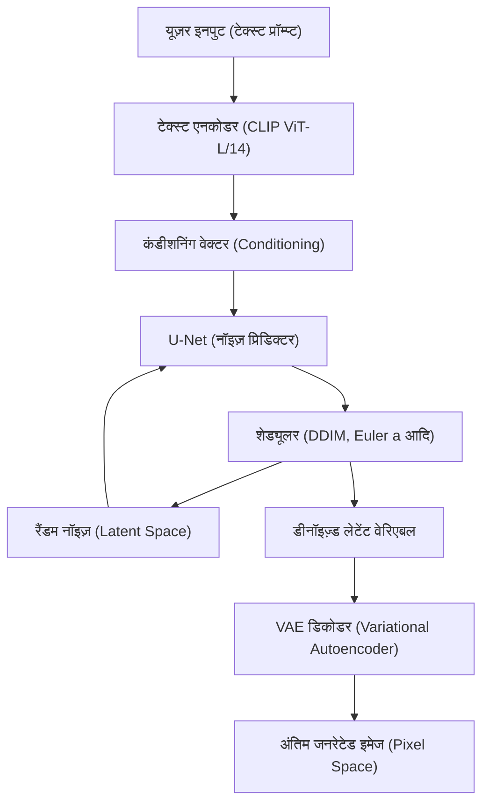
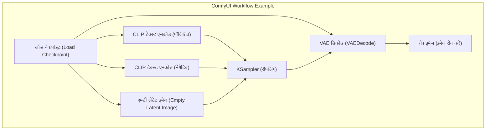

## 1. प्रस्तावना: लोकल एनवायरनमेंट में एआई इमेज जनरेशन क्यों करें?

एआई इमेज जनरेशन तकनीक ने Stable Diffusion के ओपन-सोर्स होने के साथ एक विस्फोटक विकास देखा है। वर्तमान में, Midjourney, DALL-E 3, और Adobe Firefly जैसी क्लाउड-आधारित कमर्शियल सर्विस भी बहुत शक्तिशाली और उपयोग में आसान हो गई हैं। हालाँकि, उन सेवाओं में उपयोग की शर्तों के कारण जनरेट किए गए कंटेंट पर प्रतिबंध (NSFW फ़िल्टर आदि), सब्सक्रिप्शन के कारण निरंतर लागत, और विस्तृत जनरेशन प्रक्रिया को नियंत्रित करने में असमर्थता जैसे नुकसान हैं।

लोकल एनवायरनमेंट (अपने पीसी) में एआई इमेज जनरेशन टूल स्थापित करने के निम्नलिखित जबरदस्त फायदे हैं:

1. **पूर्ण स्वतंत्रता और असीमित जनरेशन**: जनरेट की जाने वाली इमेजेज की संख्या पर कोई प्रतिबंध या अतिरिक्त लागत नहीं है, और जब तक लोकल संसाधन अनुमति देते हैं, आप असीमित इमेजेज जनरेट कर सकते हैं।
2. **उच्च कस्टमाइज़ेबिलिटी**: LoRA (Low-Rank Adaptation) और ControlNet का उपयोग करके विस्तृत संरचना नियंत्रण, और विशिष्ट पात्रों और कला शैलियों का पुनरुत्पादन संभव है।
3. **प्राइवेसी और सिक्योरिटी**: चूँकि डेटा क्लाउड पर नहीं भेजा जाता है, इसलिए यह अत्यधिक गोपनीय डिज़ाइन कार्य और व्यक्तिगत प्रोजेक्ट्स के लिए एकदम सही है।
4. **नवीनतम तकनीक को तुरंत लागू करना**: आप ओपन-सोर्स कम्युनिटी द्वारा प्रतिदिन जारी किए जाने वाले नवीनतम मॉडल और एक्सटेंशन को तुरंत आज़मा सकते हैं।

यह मैनुअल विंडोज़ एनवायरनमेंट को आधार मानकर, 10,000 से अधिक शब्दों की मात्रा में, वर्तमान में मुख्यधारा के तीन एआई इमेज जनरेशन एनवायरनमेंट (AUTOMATIC1111 Stable Diffusion WebUI, ComfyUI, Fooocus) को सेटअप करने की विधियों से लेकर, आधारभूत गणितीय पृष्ठभूमि, और यहाँ तक कि VRAM ऑप्टिमाइज़ेशन तकनीकों तक सब कुछ विस्तार से समझाता है।

---

## 2. डिफ़्यूज़न मॉडल (Diffusion Model) की गणितीय पृष्ठभूमि और आर्किटेक्चर

लोकल एनवायरनमेंट को सेटअप करने और पैरामीटर्स को ठीक से कॉन्फ़िगर करने के लिए, यह समझना बहुत फायदेमंद है कि Stable Diffusion जैसे **लेटेंट डिफ़्यूज़न मॉडल (Latent Diffusion Model: LDM)** कैसे काम करते हैं।

### 2.1 नॉइज़ एडिशन प्रोसेस (Forward Process) और रिमूवल प्रोसेस (Reverse Process)

डिफ़्यूज़न मॉडल का मूल सिद्धांत यह है कि यह मूल डेटा (इमेज) में धीरे-धीरे गॉसियन नॉइज़ जोड़ता है, जिससे अंततः यह पूरी तरह से नॉइज़ बन जाता है ("Forward Process"), और फिर उस नॉइज़ से मूल इमेज को रीस्टोर करता है ("Reverse Process")।

Forward Process को मार्कोव चेन के रूप में परिभाषित किया गया है, और स्टेप $t$ पर स्थिति $x_t$ को निम्नलिखित समीकरण द्वारा दर्शाया गया है:

$$ q(x_t | x_{t-1}) = \mathcal{N}(x_t; \sqrt{1 - \beta_t} x_{t-1}, \beta_t I) $$

रीपैरामीटराइजेशन ट्रिक (Reparameterization trick) का उपयोग करके, प्रारंभिक स्थिति $x_0$ से किसी भी स्टेप $t$ की स्थिति की सीधे गणना की जा सकती है।

$$ x_t = \sqrt{\bar{\alpha}_t} x_0 + \sqrt{1 - \bar{\alpha}_t} \epsilon $$

जहाँ, $\alpha_t = 1 - \beta_t$, $\bar{\alpha}_t = \prod_{s=1}^t \alpha_s$ है, और $\epsilon \sim \mathcal{N}(0, I)$ स्टैंडर्ड नॉर्मल डिस्ट्रीब्यूशन से सैंपल किया गया नॉइज़ है।

इमेज जनरेशन फेज़, यानी Reverse Process में, न्यूरल नेटवर्क (U-Net) $\epsilon_\theta$ का उपयोग करके जोड़े गए नॉइज़ की भविष्यवाणी की जाती है और उसे हटा दिया जाता है। लॉस फंक्शन (Loss function) बस इस प्रकार है:

$$ L_{simple} = \mathbb{E}_{x_0, \epsilon \sim \mathcal{N}(0, I), t} \left[ || \epsilon - \epsilon_\theta(\sqrt{\bar{\alpha}_t} x_0 + \sqrt{1 - \bar{\alpha}_t} \epsilon, t) ||^2 \right] $$

### 2.2 लेटेंट स्पेस (Latent Space) द्वारा कम्प्यूटेशनल लोड में कमी

यदि पिक्सेल स्पेस (Pixel Space) में सीधे नॉइज़ रिमूवल किया जाता है, तो इमेज के रेज़ोल्यूशन के वर्ग के अनुपात में कम्प्यूटेशनल लोड बढ़ जाता है, जिससे यह बहुत भारी प्रक्रिया बन जाती है। Stable Diffusion, इमेजेज को कम्प्रेस्ड "लेटेंट स्पेस (Latent Space)" में बदलने के लिए **VAE (Variational Autoencoder)** का उपयोग करता है और फिर उन्हें प्रोसेस करता है।

एनकोडर $E$, $H \times W \times 3$ के रेज़ोल्यूशन वाली इमेज को $z \in \mathbb{R}^{H/8 \times W/8 \times 4}$ में कम्प्रेस करता है। चूँकि स्थानिक आयाम (spatial dimensions) 1/8 हो जाते हैं, इसलिए सेल्फ-अटेंशन (Self-Attention) की गणना मात्रा $\mathcal{O}((\frac{H \times W}{64})^2)$ हो जाती है, जिससे प्रदर्शन में भारी सुधार होता है। जनरेशन के बाद, डिकोडर $D$ इसे $\tilde{x} = D(z)$ के रूप में पिक्सेल स्पेस में रीस्टोर करता है।

### 2.3 Stable Diffusion का सिस्टम आर्किटेक्चर

नीचे दिया गया Mermaid डायग्राम Stable Diffusion की समग्र जनरेशन प्रक्रिया (टेक्स्ट से इमेज जनरेशन: txt2img) को दर्शाता है।



---

## 3. हार्डवेयर आवश्यकताओं का विस्तृत विश्लेषण

लोकल एआई इमेज जनरेशन में, हार्डवेयर का चयन सबसे महत्वपूर्ण है।

### 3.1 GPU (ग्राफ़िक्स कार्ड)
यह एआई प्रोसेसिंग का दिल है। विंडोज़ एनवायरनमेंट पर Stable Diffusion चलाने के लिए, NVIDIA GPU वास्तविक मानक (de facto standard) हैं। हालाँकि AMD Radeon को ROCm का उपयोग करके चलाना संभव है, लेकिन विंडोज़ पर एनवायरनमेंट सेटअप करने की कठिनाई और इस तथ्य को देखते हुए कि कई एक्सटेंशन CUDA (NVIDIA का पैरेलल कंप्यूटिंग आर्किटेक्चर) पर निर्भर हैं, यह कहना अतिशयोक्ति नहीं होगी कि NVIDIA एकमात्र विकल्प है।

*   **न्यूनतम आवश्यकताएँ**: VRAM 6GB (GTX 1060 6GB / RTX 2060 आदि)। *हालाँकि, रेज़ोल्यूशन और फीचर्स पर महत्वपूर्ण प्रतिबंध होंगे।
*   **अनुशंसित आवश्यकताएँ**: VRAM 12GB (RTX 3060 12GB / RTX 4070 आदि)। यह SDXL मॉडल को आराम से चलाने के लिए बॉर्डरलाइन है।
*   **आदर्श आवश्यकताएँ**: VRAM 16GB〜24GB (RTX 4080 / RTX 3090 / RTX 4090)। यह हाई-रेज़ोल्यूशन जनरेशन, जटिल ControlNet के एक साथ उपयोग, और लोकल मॉडल ट्रेनिंग (LoRA आदि) के लिए आवश्यक है।

### 3.2 मेमोरी (RAM) और स्टोरेज
*   **RAM**: 32GB या उससे अधिक की दृढ़ता से अनुशंसा की जाती है। स्टोरेज से VRAM में मॉडल (कई GB से लेकर कई दसियों GB तक) ट्रांसफर करते समय, यह अस्थायी रूप से सिस्टम RAM का उपयोग करता है। यदि RAM अपर्याप्त है, तो पेज फ़ाइल का उपयोग किया जाएगा, जिससे स्पीड में भारी गिरावट आएगी।
*   **स्टोरेज**: NVMe M.2 SSD आवश्यक है। आज के एआई मॉडल (Checkpoints) प्रत्येक 2GB से 7GB आकार के होते हैं। यदि आप HDD का उपयोग करते हैं, तो मॉडल को लोड करने में ही कई मिनट लगेंगे, जो व्यावहारिक नहीं है।

---

## 4. बेस सॉफ़्टवेयर सेटअप (विंडोज़ संस्करण)

टूल को ही इंस्टॉल करने से पहले, आवश्यक बेस सॉफ़्टवेयर तैयार करें।

### 4.1 Python इंस्टॉलेशन
अधिकांश एआई टूल्स Python में लिखे गए हैं। **Python 3.10.6** इंस्टॉल करें, जिसकी Stable Diffusion WebUI आदि के साथ उच्चतम कम्पैटिबिलिटी है (बहुत नए वर्ज़न PyTorch जैसी निर्भरताओं को तोड़ सकते हैं)।

1.  Python के आधिकारिक आर्काइव से `python-3.10.6-amd64.exe` डाउनलोड करें।
2.  इंस्टॉलर शुरू करते समय, सबसे नीचे **"Add Python 3.10 to PATH"** को चेक करना सुनिश्चित करें।
3.  इंस्टॉलेशन पूरा होने वाली स्क्रीन पर, **"Disable path length limit"** (पाथ की लंबाई की सीमा अक्षम करें) पर क्लिक करें (महत्वपूर्ण: यदि आप विंडोज़ की 260-कैरेक्टर पाथ सीमा को नहीं हटाते हैं, तो गहरे स्तर की निर्भरता लाइब्रेरी में एरर उत्पन्न होंगी)।

### 4.2 Git for Windows इंस्टॉलेशन
GitHub से सोर्स कोड और मॉडल प्राप्त करने के लिए Git आवश्यक है।
1.  Git for Windows की आधिकारिक वेबसाइट से इंस्टॉलर डाउनलोड करें और इसे सभी डिफ़ॉल्ट सेटिंग्स के साथ इंस्टॉल करें।

### 4.3 CUDA Toolkit और cuDNN सेटअप
चूँकि नवीनतम PyTorch इंस्टॉलेशन के दौरान आवश्यक CUDA बाइनरी को शामिल करता है और डाउनलोड करता है, इसलिए अब पूरे सिस्टम में CUDA Toolkit इंस्टॉल करना अनिवार्य नहीं है। हालाँकि, यदि आप कस्टम एक्सटेंशन (TensorRT या xFormers बिल्ड) का उपयोग करते हैं, तो यह अनुशंसा की जाती है कि आप NVIDIA के आधिकारिक स्रोत से **CUDA Toolkit 11.8** या **12.1** (आपके द्वारा उपयोग किए जा रहे PyTorch के अनुसार) इंस्टॉल करें।

---

## 5. 3 प्रमुख फ्रंट-एंड के लिए सेटअप प्रक्रिया

यहाँ वर्तमान में मुख्यधारा के तीन एआई इमेज जनरेशन टूल्स के सेटअप की विधि बताई गई ডান है। कृपया अपने उद्देश्य और कौशल के अनुसार इनका उपयोग करें।

### 5.1 AUTOMATIC1111 Stable Diffusion WebUI सेटअप
यह सबसे पुराना, समृद्ध एक्सटेंशन वाला, और एक बहुमुखी टूल है जो बारीक पैरामीटर एडजस्टमेंट की अनुमति देता है।

**इंस्टॉलेशन प्रक्रिया:**
1.  किसी भी डायरेक्टरी (उदा: `C:\work\ai`) में कमांड प्रॉम्प्ट खोलें।
2.  रिपॉजिटरी को क्लोन करने के लिए निम्नलिखित कमांड चलाएँ:
    ```cmd
    git clone https://github.com/AUTOMATIC1111/stable-diffusion-webui.git
    ```
3.  क्लोन की गई डायरेक्टरी में `webui-user.bat` पर राइट-क्लिक करें और इसे एडिट मोड में खोलें।
4.  प्रदर्शन को बेहतर बनाने के लिए, स्टार्टअप आर्गुमेंट्स `COMMANDLINE_ARGS` को इस प्रकार सेट करें:
    ```bat
    set COMMANDLINE_ARGS=--xformers --opt-sdp-attention --theme dark
    ```
5.  रन करने के लिए `webui-user.bat` पर डबल-क्लिक करें। पहली बार, PyTorch जैसी विशाल लाइब्रेरी डाउनलोड की जाएंगी, इसलिए आपके एनवायरनमेंट के आधार पर इसमें कई मिनट लग सकते हैं।
6.  पूरा होने पर, `Running on local URL: http://127.0.0.1:7860` प्रदर्शित होगा, इसलिए इसे अपने ब्राउज़र में एक्सेस करें।

### 5.2 ComfyUI सेटअप और नोड-बेस्ड होने के फायदे
ComfyUI एक UI है जो जनरेशन प्रक्रिया को "नोड्स" नामक ब्लॉक्स (Node-based) का उपयोग करके दृष्टिगत रूप से जोड़ता है। VRAM प्रबंधन में यह अत्यंत उत्कृष्ट है, और अक्सर उन एनवायरनमेंट में काम करता है जहाँ AUTOMATIC1111 में मेमोरी की कमी हो सकती है।



**इंस्टॉलेशन प्रक्रिया:**
1.  ComfyUI के आधिकारिक GitHub रिलीज़ पेज से विंडोज़ स्टैंडअलोन वर्ज़न की 7z फ़ाइल डाउनलोड करें।
2.  इसे अनज़िप करें और अंदर मौजूद `run_nvidia_gpu.bat` को रन करें (यह एक पाइथन-शामिल पोर्टेबल वर्ज़न है, इसलिए किसी सेटअप की आवश्यकता नहीं है)।
3.  **ComfyUI Manager इंस्टॉल करना**: यह एक्सटेंशन को मैनेज करने के लिए आवश्यक है। `ComfyUI/custom_nodes/` डायरेक्टरी में कमांड प्रॉम्प्ट खोलें और निम्नलिखित कमांड चलाएँ:
    ```cmd
    git clone https://github.com/ltdrdata/ComfyUI-Manager.git
    ```
    रीस्टार्ट करने पर, UI के निचले दाएँ कोने में एक "Manager" बटन दिखाई देगा, और आप यहाँ से विभिन्न कस्टम नोड्स इंस्टॉल कर सकेंगे।

### 5.3 Fooocus सेटअप: शुरुआती लोगों के लिए हाई-क्वालिटी जनरेशन
Fooocus एक UI है जिसे Midjourney की तरह "छोटे प्रॉम्प्ट्स के साथ भी आश्चर्यजनक रूप से सुंदर इमेजेज जनरेट करने" के उद्देश्य से बनाया गया है। इसे विशेष रूप से SDXL मॉडल के लिए ट्यून किया गया है और यह आंतरिक रूप से GPT-2-आधारित प्रॉम्प्ट एक्सटेंशन और जटिल पाइपलाइनों को स्वचालित रूप से निष्पादित करता है।

**इंस्टॉलेशन प्रक्रिया:**
1.  Fooocus के आधिकारिक GitHub से विंडोज़ रिलीज़ पैक डाउनलोड करें और इसे अनज़िप करें।
2.  `run.bat` को रन करें। Juggernaut XL जैसे बेहतरीन SDXL मॉडल अपने आप डाउनलोड हो जाएंगे, और यह तुरंत हाई-क्वालिटी इमेजेज जनरेट करने के लिए तैयार हो जाएगा।
3.  "Advanced" बॉक्स को चेक करके, आप इमेज प्रॉम्प्ट (Image Prompt) और इनपेंटिंग (Inpainting) जैसे एडवांस्ड फीचर्स का भी उपयोग कर सकते हैं।

---

## 6. मॉडल मैनेजमेंट और डेटा संरचना को समझना

एआई इमेज जनरेशन की गुणवत्ता पूरी तरह से इस्तेमाल किए गए मॉडल (प्रशिक्षित डेटा) पर निर्भर करती है।

### 6.1 Checkpoints (Base Models)
यह इमेज जनरेशन का मुख्य मॉडल (कोर) है। अतीत में, `.ckpt` (Pickle फॉर्मेट) मुख्यधारा था, लेकिन इसमें एक भेद्यता (Arbitrary Code Execution) थी जो मनमाने Python कोड को निष्पादित कर सकती थी। आज, **`.safetensors`** फॉर्मेट मानक है, जो सुरक्षा की गारंटी देता है और डिस्क से मेमोरी (mmap) तक ज़ीरो-कॉपी लोड को सक्षम करता है। कभी भी अज्ञात मूल की `.ckpt` फ़ाइलों को डाउनलोड न करें।

### 6.2 LoRA (Low-Rank Adaptation) का गणितीय व्यवहार
LoRA एक ऐसी तकनीक है जो फुल मॉडल के फाइन-ट्यूनिंग के लिए आवश्यक विशाल कम्प्यूटेशनल संसाधनों से बचती है, और विशिष्ट पात्रों या कला शैलियों की अतिरिक्त ट्रेनिंग की अनुमति देती है।

अरबों पैरामीटर्स वाले वेट मैट्रिक्स $W_0 \in \mathbb{R}^{d \times k}$ को सीधे अपडेट करने के बजाय, LoRA दो लो-रैंक मैट्रिक्स $A \in \mathbb{R}^{r \times k}$ और $B \in \mathbb{R}^{d \times r}$ पेश करता है (रैंक $r \ll \min(d, k)$)। नए वेट की गणना इस प्रकार की जाती है:

$$ W = W_0 + \Delta W = W_0 + B A $$

यह प्रशिक्षित और सहेजे जाने वाले पैरामीटर्स की संख्या को $d \times k$ से $r \times (d + k)$ तक काफी कम कर देता है, जिससे कुछ सौ MB की हल्की फ़ाइल के साथ शक्तिशाली स्टाइल एप्लीकेशन सक्षम हो जाता है।

### 6.3 VAE (Variational Autoencoder)
जैसा कि पहले बताया गया है, यह एक मॉडल है जो लेटेंट स्पेस और पिक्सेल स्पेस के बीच कन्वर्ट करता है। एनीमे-स्टाइल मॉडल में, यदि VAE ठीक से सेट नहीं किया गया है, तो यह समग्र सफेदी और कम कंट्रास्ट के साथ एक "नींद वाली इमेज (sleepy image)" आउटपुट कर सकता है। `kl-f8-anime2.ckpt` जैसे एनीमे-विशिष्ट VAE को `models/VAE` फ़ोल्डर में रखकर लागू करें।

### 6.4 डायरेक्टरी संरचना का उदाहरण (AUTOMATIC1111)
```text
stable-diffusion-webui/
├── models/
│   ├── Stable-diffusion/  <-- Checkpoints (.safetensors) को यहाँ रखें
│   ├── Lora/              <-- LoRA मॉडल को यहाँ रखें
│   ├── VAE/               <-- VAE मॉडल को यहाँ रखें
│   └── ControlNet/        <-- ControlNet मॉडल को यहाँ रखें
├── embeddings/            <-- Textual Inversion (PT फ़ाइल) को यहाँ रखें
├── extensions/            <-- Git क्लोन किए गए एक्सटेंशन
└── webui-user.bat         <-- स्टार्टअप बैच फ़ाइल
```

---

## 7. VRAM ऑप्टिमाइज़ेशन और परफॉरमेंस ट्यूनिंग

ये तकनीकें लोकल जनरेशन की सबसे बड़ी बाधा, "अपर्याप्त VRAM (CUDA Out Of Memory)" से बचने और जनरेशन स्पीड को अधिकतम करने के लिए हैं।

### 7.1 अटेंशन (Attention) मैकेनिज्म का ऑप्टिमाइज़ेशन (xFormers / SDP Attention)
Stable Diffusion की अधिकांश गणनाएँ U-Net के भीतर क्रॉस-अटेंशन (Cross-Attention) पर खर्च होती हैं। चूँकि डिफ़ॉल्ट अटेंशन गणना में बड़ी मात्रा में मेमोरी की खपत होती है, इसलिए इसे निम्नलिखित दृष्टिकोणों का उपयोग करके ऑप्टिमाइज़ किया जाता है:

*   **xFormers (`--xformers`)**: Meta द्वारा विकसित एक मेमोरी-कुशल अटेंशन इम्प्लीमेंटेशन (Memory Efficient Attention)। यह VRAM की खपत को काफी कम करता है और गति में सुधार करता है, लेकिन कम्प्यूटेशनल नॉन-डिटरमिनिज्म के कारण, इसमें यह विशेषता है कि "बिल्कुल समान सीड वैल्यू के साथ भी थोड़ी अलग इमेजेज उत्पन्न होती हैं।"
*   **SDP Attention (`--opt-sdp-attention`)**: PyTorch 2.0 से स्टैंडर्ड के रूप में शामिल Scaled Dot Product Attention। इसका फायदा यह है कि इसमें कम निर्भरताएँ हैं, जबकि यह xFormers के समान गति और VRAM कमी प्रभाव प्रदान करता है। `--opt-sub-quad-attention` जैसी भिन्नताएँ भी हैं, जिनमें नॉन-डिटरमिनिज्म नहीं है।

### 7.2 VRAM सेविंग स्टार्टअप विकल्प
*   `--medvram`: 6GB से 8GB VRAM वाले एनवायरनमेंट के लिए। यह U-Net को विभाजित करता है और प्रोसेस करता है, जिससे मेमोरी की बचत होती है लेकिन गति थोड़ी कम हो जाती है।
*   `--lowvram`: 4GB या उससे कम VRAM वाले एनवायरनमेंट के लिए। यह बार-बार VRAM में मॉड्यूल को लोड और अनलोड करता है, इसलिए गति काफी कम हो जाती है लेकिन यह इसे जबरन चलाने की अनुमति देता है।
*   `--medvram-sdxl`: यह एक बहुत ही उपयोगी फ्लैग है जो केवल SDXL मॉडल का उपयोग करते समय MedVRAM लागू करता है।

### 7.3 TensorRT द्वारा सुपर-एक्सेलरेशन
**TensorRT** NVIDIA GPU के टेंसर कोर (Tensor Cores) का अधिकतम उपयोग करने के लिए एक फ्रेमवर्क है।
यह Stable Diffusion के U-Net को आपके द्वारा उपयोग किए जा रहे GPU के लिए एक समर्पित इंजन (`.trt` फ़ाइल) के रूप में कंपाइल करता है। यद्यपि इसका नुकसान यह है कि कंपाइलेशन में कई दसियों मिनट लगते हैं, और रेज़ोल्यूशन और बैच का आकार तय हो जाता है (Dynamic Shape भी संभव है लेकिन दक्षता कम हो जाती है), जनरेशन गति **1.5 से 2 गुना या अधिक** तक बढ़ जाती है। समान रेज़ोल्यूशन की बड़ी मात्रा में इमेजेज उत्पन्न करने वाले व्यावसायिक अनुप्रयोगों के लिए यह सबसे शक्तिशाली ऑप्टिमाइज़ेशन विधि है।

### 7.4 Tiled VAE / Tiled Diffusion
हाई-रेज़ोल्यूशन (जैसे 4K) इमेजेज को जनरेट या अपस्केल करते समय, VAE डिकोडिंग प्रक्रिया अचानक VRAM को समाप्त कर देती है। इसे रोकने के लिए, इमेजेज को टाइल्स (उदाहरण के लिए, $512 \times 512$ प्रत्येक) में विभाजित करने, उन्हें प्रोसेस करने और फिर उन्हें अंत में जोड़ने वाला ডান एक्सटेंशन (Multidiffusion / Tiled VAE) आवश्यक है।

---

## 8. एडवांस्ड कंट्रोल टेक्नोलॉजी: ControlNet

केवल टेक्स्ट प्रॉम्प्ट्स के साथ, किसी पात्र की मुद्रा, जटिल दृष्टिकोण, या उंगलियों की बारीक गतिविधियों को निर्दिष्ट करना असंभव है। इसे हल करने का तरीका **ControlNet** है।

ControlNet में एक आर्किटेक्चर है जहाँ यह प्रशिक्षित Stable Diffusion मॉडल के वेट को स्थिर (fixed) रखता है, एनकोडर की संरचना की प्रतिलिपि बनाता है, और "Zero-convolutions" (शून्य वेट के साथ इनिशियलाइज़ की गई कनवोल्यूशनल लेयर्स) सम्मिलित करता है। यह मूल जनरेशन क्षमता को नष्ट किए बिना अतिरिक्त कंडीशनिंग को लागू करने की अनुमति देता है।

**विशिष्ट प्रीप्रोसेसर और मॉडल:**
*   **OpenPose**: मानव कंकाल (जोड़ों की स्थिति) निकालता है और बिल्कुल उसी मुद्रा में इमेजेज उत्पन्न करता है।
*   **Canny**: एज डिटेक्शन (edge detection) करता है, और लाइन आर्ट के आधार पर रंग भरता है या उसे यथार्थवादी (photorealistic) बनाता है।
*   **Depth**: एक डेप्थ मैप (Depth Map) उत्पन्न करता है, जिससे स्थानिक गहराई (spatial depth) बनाए रखते हुए इमेजेज जनरेट होती हैं।
*   **Lineart**: Canny की तुलना में एनीमे-शैली के लाइन आर्ट निकालने में बेहतर है।

एक ही समय में कई ControlNet (Multi-ControlNet) लागू करके, "निर्दिष्ट मुद्रा और निर्दिष्ट पृष्ठभूमि परिप्रेक्ष्य वाली इमेज" मज़बूती से आउटपुट करना संभव हो जाता है।

---

## 9. समस्या निवारण (FAQ)

यहाँ लोकल एनवायरनमेंट को सेटअप करने और संचालित करने में अक्सर होने वाली एरर्स और उनके समाधान दिए गए हैं।

### प्रश्न 1. जनरेशन एक एरर के साथ रुक जाता है: `CUDA out of memory.`
**उत्तर 1:** VRAM अपर्याप्त है। जनरेशन रेज़ोल्यूशन कम करें या बैच का आकार 1 पर सेट करें। साथ ही, A1111 के मामले में, `webui-user.bat` में `--xformers` और `--medvram` जोड़ें और रीस्टार्ट करें। हाई-रेज़ोल्यूशन (Hires. fix) करते समय, लेटेंट-आधारित (Latent-based) के बजाय R-ESRGAN जैसे ESRGAN-आधारित अपस्केलर का उपयोग करने से VRAM की खपत को कम किया जा सकता है।

### प्रश्न 2. जनरेट की गई इमेज पूरी तरह से काली या शोर (noise) से भरी हुई है।
**उत्तर 2:** यह एक ऐसी घटना है जहाँ गणना के दौरान NaN (Not a Number) मान उत्पन्न होते हैं और टेंसर (tensor) टूट जाता है। कृपया निम्नलिखित उपाय करें:
1. स्टार्टअप विकल्पों में `--no-half-vae` जोड़ें ताकि केवल VAE की गणना सिंगल प्रिसिजन (FP32) में की जा सके।
2. स्टार्टअप विकल्पों में `--disable-nan-check` जोड़ें (यह कोई मूल समाधान नहीं है)।
3. आपके द्वारा उपयोग किए जा रहे मॉडल (विशेष रूप से SD 2.1 श्रृंखला) के लिए FP16 गणना उपयुक्त नहीं हो सकती है, इसलिए फुल प्रिसिजन मोड आज़माएँ।

### प्रश्न 3. `webui-user.bat` शुरू करते समय Python एरर या Git एरर आती है।
**उत्तर 3:** निर्भरता पुस्तकालयों (dependency libraries) में विसंगतियों का संदेह है। WebUI डायरेक्टरी के अंदर `venv` फ़ोल्डर को पूरी तरह से हटा दें और फिर से `webui-user.bat` चलाएँ। वर्चुअल एनवायरनमेंट एक साफ स्थिति में फिर से बनाया जाएगा (कई GB का पुनः डाउनलोड होगा)।

### प्रश्न 4. मैंने एक मॉडल (Safetensors) डाउनलोड किया है लेकिन वह सूची में दिखाई नहीं दे रहा है।
**उत्तर 4:** इसे `models/Stable-diffusion` फ़ोल्डर में रखने के बाद, UI पर चेकपॉइंट सिलेक्शन ड्रॉप-डाउन के बगल में स्थित "रिफ्रेश (Update)" बटन दबाएँ। यदि आपने इसे सबफ़ोल्डर में रखा है, तो जाँचें कि एक्सटेंशन गलत तो नहीं है।

---

## 10. निष्कर्ष: एआई इमेज जनरेशन का भविष्य और लोकल एनवायरनमेंट का लाभ

Stable Diffusion से शुरू हुआ ओपन-सोर्स एआई इमेज जनरेशन आंदोलन विकसित होता जा रहा है, SDXL, और Stable Diffusion 3 और Flux.1 जैसे अगली पीढ़ी के आर्किटेक्चर की ओर बढ़ रहा है। मॉडलों के पैरामीटर्स की संख्या अरबों से बढ़कर दसियों अरबों के वर्ग में विशाल होती जा रही है, और भविष्य में 24GB या उससे अधिक VRAM वाले GPU एनवायरनमेंट की और अधिक मांग होगी।

हालाँकि, TensorRT, क्वांटिज़ेशन तकनीक (Quantization), और GGUF जैसी लोकल ऑप्टिमाइज़ेशन तकनीकें भी तेज़ी से विकसित हो रही हैं, और एक ऐसा इकोसिस्टम बन रहा है जो आम उपभोक्ता के हार्डवेयर पर भी पर्याप्त अनुमान (inference) की अनुमति देता है।

इस मैनुअल में समझाए गए CUDA एनवायरनमेंट का सेटअप, VRAM का ऑप्टिमाइज़ेशन, और ComfyUI जैसी पाइपलाइनों की समझ सार्वभौमिक मूलभूत ज्ञान है जो एआई तकनीकी रुझान बदलने पर भी लागू होगा। हमें उम्मीद है कि आपकी रचनात्मकता बिना किसी प्रतिबंध के लोकल एनवायरनमेंट में अपने अधिकतम स्तर तक पहुँच जाएगी।
