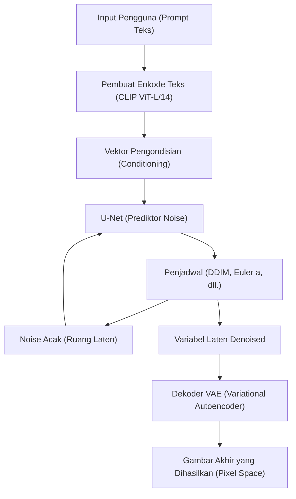
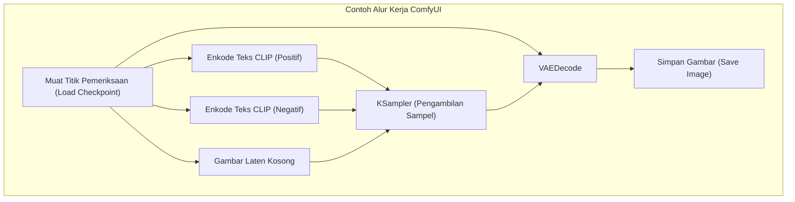

## 1. Pendahuluan: Mengapa membuat gambar AI di lingkungan lokal?

Teknologi pembuatan gambar AI telah mengalami evolusi eksplosif, dimulai dengan sumber terbuka Stable Diffusion. Saat ini, layanan komersial berbasis cloud seperti Midjourney, DALL-E 3, dan Adobe Firefly juga sangat kuat dan mudah digunakan. Namun, layanan tersebut memiliki kelemahan seperti pembatasan konten yang dihasilkan karena persyaratan layanan (filter NSFW, dll.), biaya berkelanjutan karena langganan, dan ketidakmampuan untuk mengontrol proses pembuatan secara mendetail.

Membangun alat pembuatan gambar AI di lingkungan lokal (PC Anda sendiri) memiliki keuntungan luar biasa berikut:

1. **Kebebasan Penuh dan Pembuatan Tanpa Batas**: Anda dapat menghasilkan gambar tanpa batas selama sumber daya lokal Anda memungkinkan, tanpa batasan jumlah yang dihasilkan atau biaya tambahan.
2. **Kustomisasi Tingkat Lanjut**: Kontrol komposisi terperinci serta reproduksi karakter atau gaya seni tertentu dimungkinkan menggunakan LoRA (Low-Rank Adaptation) atau ControlNet.
3. **Privasi dan Keamanan**: Karena tidak ada data yang dikirim ke cloud, ini sangat ideal untuk pekerjaan desain yang sangat rahasia atau proyek pribadi.
4. **Penerapan Teknologi Terbaru Secara Instan**: Anda dapat dengan cepat menguji model terbaru dan ekstensi yang dirilis setiap hari oleh komunitas sumber terbuka.

Panduan ini berasumsi menggunakan lingkungan Windows dan menjelaskan secara menyeluruh cara membangun tiga lingkungan pembuatan gambar AI utama saat ini (AUTOMATIC1111 Stable Diffusion WebUI, ComfyUI, dan Fooocus), serta latar belakang matematika yang mendasarinya dan bahkan metode pengoptimalan VRAM, dengan volume melebihi 10.000 karakter (dalam bahasa Jepang).

---

## 2. Latar Belakang Matematika dan Arsitektur Model Difusi (Diffusion Model)

Untuk membangun lingkungan lokal dan mengatur parameter dengan tepat, sangat bermanfaat untuk memahami bagaimana **Latent Diffusion Model (LDM)** seperti Stable Diffusion berfungsi.

### 2.1 Proses Penambahan Noise (Forward Process) dan Proses Penghapusan Noise (Reverse Process)

Prinsip dasar model difusi terdiri dari "Forward Process", yang secara bertahap menambahkan Gaussian noise ke data asli (gambar) hingga akhirnya menjadi noise murni, dan "Reverse Process", yang memulihkan gambar asli dari noise tersebut.

Forward Process didefinisikan sebagai rantai Markov, dan status $x_t$ pada langkah $t$ dinyatakan dengan persamaan berikut:

$$ q(x_t | x_{t-1}) = \mathcal{N}(x_t; \sqrt{1 - \beta_t} x_{t-1}, \beta_t I) $$

Dengan menggunakan trik reparameterisasi (Reparameterization trick), kita dapat menghitung status langkah $t$ mana pun langsung dari status awal $x_0$.

$$ x_t = \sqrt{\bar{\alpha}_t} x_0 + \sqrt{1 - \bar{\alpha}_t} \epsilon $$

Di sini, $\alpha_t = 1 - \beta_t$, $\bar{\alpha}_t = \prod_{s=1}^t \alpha_s$, dan $\epsilon \sim \mathcal{N}(0, I)$ adalah noise yang diambil sampelnya dari distribusi normal standar.

Dalam Reverse Process, yang merupakan fase pembuatan gambar, jaringan saraf (U-Net) $\epsilon_\theta$ digunakan untuk memprediksi dan menghapus noise yang ditambahkan. Fungsi kerugian (loss function) secara sederhana adalah sebagai berikut:

$$ L_{simple} = \mathbb{E}_{x_0, \epsilon \sim \mathcal{N}(0, I), t} \left[ || \epsilon - \epsilon_\theta(\sqrt{\bar{\alpha}_t} x_0 + \sqrt{1 - \bar{\alpha}_t} \epsilon, t) ||^2 \right] $$

### 2.2 Pengurangan Kompleksitas Komputasi melalui Ruang Laten (Latent Space)

Melakukan penghapusan noise langsung di Pixel Space akan menjadi proses yang sangat berat karena komputasi meningkat secara kuadrat terhadap resolusi gambar. Stable Diffusion menggunakan **VAE (Variational Autoencoder)** untuk mengubah gambar menjadi "Ruang Laten" (Latent Space) terkompresi sebelum memprosesnya.

Encoder $E$ mengompresi gambar dengan resolusi $H \times W \times 3$ menjadi $z \in \mathbb{R}^{H/8 \times W/8 \times 4}$. Karena dimensi spasial dikurangi menjadi seperdelapan, komputasi mekanisme perhatian diri (Self-Attention) menjadi $\mathcal{O}((\frac{H \times W}{64})^2)$, menghasilkan peningkatan kinerja yang dramatis. Setelah pembuatan, itu dipulihkan ke Pixel Space oleh decoder $D$ sebagai $\tilde{x} = D(z)$.

### 2.3 Arsitektur Sistem Stable Diffusion

Diagram Mermaid berikut menunjukkan keseluruhan proses pembuatan (pembuatan gambar dari teks: txt2img) dari Stable Diffusion.



---

## 3. Penjelasan Menyeluruh tentang Persyaratan Perangkat Keras

Dalam pembuatan gambar AI lokal, pemilihan perangkat keras adalah yang paling penting.

### 3.1 GPU (Kartu Grafis)
Inti dari pemrosesan AI. Untuk menjalankan Stable Diffusion di lingkungan Windows, GPU buatan NVIDIA adalah standar de facto. Dimungkinkan untuk menjalankannya pada AMD Radeon menggunakan ROCm, tetapi mengingat kesulitan pengaturan lingkungan pada Windows dan banyak ekstensi bergantung pada CUDA (arsitektur komputasi paralel NVIDIA), tidak berlebihan untuk mengatakan NVIDIA adalah satu-satunya pilihan.

*   **Persyaratan Minimum**: VRAM 6GB (seperti GTX 1060 6GB / RTX 2060). ※Namun, akan ada batasan besar pada resolusi dan fungsi.
*   **Persyaratan yang Disarankan**: VRAM 12GB (seperti RTX 3060 12GB / RTX 4070). Ini adalah batas minimum untuk menjalankan model SDXL dengan nyaman.
*   **Persyaratan Ideal**: VRAM 16GB~24GB (RTX 4080 / RTX 3090 / RTX 4090). Diperlukan untuk pembuatan resolusi tinggi, penggunaan bersamaan ControlNet yang kompleks, dan pelatihan model lokal (LoRA, dll.).

### 3.2 Memori (RAM) dan Penyimpanan
*   **RAM**: Sangat disarankan 32GB atau lebih. RAM sistem sementara digunakan saat mentransfer model (dari beberapa GB ke puluhan GB) dari penyimpanan ke VRAM. Jika RAM tidak mencukupi, file halaman (page file) akan digunakan, yang menyebabkan penurunan kecepatan yang fatal.
*   **Penyimpanan**: SSD NVMe M.2 sangat diperlukan. Model AI terbaru (Checkpoints) berukuran antara 2GB dan 7GB masing-masing. Jika Anda menggunakan HDD, memuat model saja bisa memakan waktu beberapa menit, membuatnya tidak praktis.

---

## 4. Penyiapan Perangkat Lunak Dasar (Edisi Windows)

Sebelum menginstal alat itu sendiri, siapkan perangkat lunak dasar yang diperlukan.

### 4.1 Menginstal Python
Sebagian besar alat AI ditulis dalam Python. Instal **Python 3.10.6**, yang memiliki kompatibilitas tertinggi dengan Stable Diffusion WebUI, dll. (versi yang terlalu baru dapat merusak dependensi seperti PyTorch).

1.  Unduh `python-3.10.6-amd64.exe` dari arsip resmi Python.
2.  Saat meluncurkan penginstal, pastikan untuk mencentang **"Add Python 3.10 to PATH"** di bagian bawah.
3.  Pada layar penyelesaian penginstalan, klik **"Disable path length limit"** (Penting: Jika Anda tidak menghapus batasan jalur 260 karakter di Windows, kesalahan akan terjadi pada pustaka dependensi berlapis dalam).

### 4.2 Menginstal Git untuk Windows
Git diperlukan untuk mengambil kode sumber dan model dari GitHub.
1.  Unduh penginstal dari situs web resmi Git untuk Windows dan instal menggunakan semua pengaturan default.

### 4.3 Mengonfigurasi CUDA Toolkit dan cuDNN
Karena versi terbaru PyTorch telah menyertakan dan mengunduh binari CUDA yang diperlukan selama penginstalan, tidak lagi wajib untuk menginstal CUDA Toolkit di seluruh sistem. Namun, jika Anda menggunakan ekstensi khusus (membuat TensorRT atau xFormers), disarankan untuk menginstal **CUDA Toolkit 11.8** atau **12.1** (cocokkan dengan PyTorch yang digunakan) dari situs resmi NVIDIA.

---

## 5. Prosedur Pembangunan 3 Frontend Utama

Kami akan menjelaskan cara membangun tiga alat pembuatan gambar AI utama saat ini. Silakan gunakan sesuai dengan tujuan dan tingkat keahlian Anda.

### 5.1 Membangun AUTOMATIC1111 Stable Diffusion WebUI
Ini adalah alat serbaguna dengan sejarah terpanjang, ekstensi yang melimpah, dan kemampuan penyesuaian parameter yang terperinci.

**Langkah Instalasi:**
1.  Buka Command Prompt di direktori yang Anda inginkan (misalnya, `C:\work\ai`).
2.  Jalankan perintah berikut untuk mengkloning repositori.
    ```cmd
    git clone https://github.com/AUTOMATIC1111/stable-diffusion-webui.git
    ```
3.  Klik kanan pada `webui-user.bat` di direktori yang dikloning, lalu buka dalam mode edit.
4.  Untuk meningkatkan kinerja, atur argumen baris perintah `COMMANDLINE_ARGS` sebagai berikut.
    ```bat
    set COMMANDLINE_ARGS=--xformers --opt-sdp-attention --theme dark
    ```
5.  Klik ganda `webui-user.bat` untuk menjalankannya. Untuk pertama kalinya, perpustakaan besar seperti PyTorch akan diunduh, yang mungkin memakan waktu puluhan menit tergantung pada lingkungan Anda.
6.  Setelah selesai, `Running on local URL: http://127.0.0.1:7860` akan ditampilkan, jadi akseslah menggunakan browser Anda.

### 5.2 Membangun ComfyUI dan Manfaat Berbasis Node
ComfyUI adalah antarmuka tempat proses pembuatan digabungkan secara visual (berbasis Node) dengan balok yang disebut "node". Manajemen VRAM-nya sangat luar biasa, dan sering kali dapat berjalan di lingkungan yang kehabisan memori dengan AUTOMATIC1111.



**Langkah Instalasi:**
1.  Unduh file 7z Standalone Windows dari halaman rilis GitHub resmi ComfyUI.
2.  Ekstrak file dan jalankan `run_nvidia_gpu.bat` di dalamnya (karena ini adalah versi portabel dengan Python bawaan, tidak diperlukan konfigurasi).
3.  **Memperkenalkan ComfyUI Manager**: Wajib untuk mengelola ekstensi. Buka Command Prompt di direktori `ComfyUI/custom_nodes/` dan jalankan yang berikut ini:
    ```cmd
    git clone https://github.com/ltdrdata/ComfyUI-Manager.git
    ```
    Setelah memulai ulang, tombol "Manager" akan muncul di kanan bawah UI, memungkinkan Anda menginstal berbagai node kustom dari sini.

### 5.3 Membangun Fooocus: Pembuatan Berkualitas Tinggi untuk Pemula
Fooocus dirancang dengan tujuan "menghasilkan gambar yang sangat indah bahkan dengan petunjuk pendek," seperti Midjourney. Ini disetel khusus untuk model SDXL, dan secara otomatis melakukan ekstensi prompt berbasis GPT-2 dan saluran kompleks secara internal.

**Langkah Instalasi:**
1.  Unduh dan ekstrak paket rilis Windows dari GitHub Fooocus resmi.
2.  Jalankan `run.bat`. Model SDXL yang sangat baik seperti Juggernaut XL akan diunduh secara otomatis, dan segera siap untuk memulai pembuatan gambar berkualitas tinggi.
3.  Dengan mencentang "Advanced", Anda juga dapat menggunakan fitur lanjutan seperti Image Prompt dan Inpainting.

---

## 6. Manajemen Model dan Pemahaman Struktur Data

Kualitas pembuatan gambar AI sepenuhnya bergantung pada model (data terlatih) yang digunakan.

### 6.1 Checkpoints (Model Dasar)
Ini adalah model utama di inti pembuatan gambar. Sebelumnya, format `.ckpt` (format Pickle) adalah yang utama, tetapi format ini memiliki kerentanan yang dapat mengeksekusi kode Python sembarang (Arbitrary Code Execution). Saat ini, format **`.safetensors`** adalah standar, yang aman dan memungkinkan pemuatan salinan nol (zero-copy load/mmap) dari disk ke memori. Jangan pernah mengunduh file `.ckpt` dari sumber yang tidak dikenal.

### 6.2 Perilaku Matematis LoRA (Low-Rank Adaptation)
LoRA adalah teknologi yang memungkinkan pembelajaran tambahan gaya seni atau karakter tertentu, menghindari komputasi besar yang diperlukan untuk fine-tuning model penuh.

Alih-alih secara langsung memperbarui matriks bobot $W_0 \in \mathbb{R}^{d \times k}$ yang memiliki miliaran parameter, LoRA memperkenalkan dua matriks peringkat rendah $A \in \mathbb{R}^{r \times k}$ dan $B \in \mathbb{R}^{d \times r}$ (peringkat $r \ll \min(d, k)$). Bobot baru dihitung sebagai berikut:

$$ W = W_0 + \Delta W = W_0 + B A $$

Ini secara drastis mengurangi jumlah parameter yang akan dilatih dan disimpan dari $d \times k$ menjadi $r \times (d + k)$, memungkinkan penerapan gaya yang kuat dengan file ringan berukuran beberapa ratus MB.

### 6.3 VAE (Variational Autoencoder)
Seperti disebutkan sebelumnya, ini adalah model yang mengubah ruang laten dan ruang piksel. Dalam model gaya anime, jika VAE tidak diatur dengan benar, hasil output mungkin "kusam" secara keseluruhan dengan warna putih dan kontras rendah. Tempatkan VAE khusus anime, seperti `kl-f8-anime2.ckpt`, di folder `models/VAE` untuk menerapkannya.

### 6.4 Contoh Struktur Direktori (AUTOMATIC1111)
```text
stable-diffusion-webui/
├── models/
│   ├── Stable-diffusion/  <-- Tempat Checkpoints (.safetensors)
│   ├── Lora/              <-- Tempat Model LoRA
│   ├── VAE/               <-- Tempat Model VAE
│   └── ControlNet/        <-- Tempat Model ControlNet
├── embeddings/            <-- Tempat Textual Inversion (file PT)
├── extensions/            <-- Ekstensi hasil Git Clone
└── webui-user.bat         <-- File batch peluncuran
```

---

## 7. Pengoptimalan VRAM dan Penyesuaian Kinerja

Berikut adalah teknik untuk menghindari "Kehabisan VRAM (CUDA Out Of Memory)", hambatan terbesar dalam pembuatan lokal, dan memaksimalkan kecepatan pembuatan hingga batas ekstrem.

### 7.1 Optimalisasi Mekanisme Perhatian (xFormers / SDP Attention)
Sebagian besar komputasi Stable Diffusion dihabiskan untuk Cross-Attention di dalam U-Net. Karena komputasi Attention default menghabiskan banyak memori, optimalkan dengan pendekatan berikut.

*   **xFormers (`--xformers`)**: Implementasi Attention hemat memori (Memory Efficient Attention) yang dikembangkan oleh Meta. Ini secara signifikan mengurangi konsumsi VRAM dan meningkatkan kecepatan, tetapi karena sifat komputasi non-deterministik, gambar yang "sedikit berbeda dapat dihasilkan meskipun nilai benih (seed) persis sama".
*   **SDP Attention (`--opt-sdp-attention`)**: Scaled Dot Product Attention menjadi standar sejak PyTorch 2.0. Ini memiliki pengurangan VRAM dan efek kecepatan yang setara dengan xFormers sambil memiliki lebih sedikit dependensi. Ada juga variasi seperti `--opt-sub-quad-attention` yang tidak memiliki non-determinisme.

### 7.2 Opsi Peluncuran Penghemat VRAM
*   `--medvram`: Untuk lingkungan dengan VRAM 6GB~8GB. Ini membagi U-Net menjadi beberapa bagian untuk diproses, menghemat memori tetapi sedikit menurunkan kecepatan.
*   `--lowvram`: Untuk lingkungan dengan VRAM 4GB atau kurang. Karena modul masuk dan keluar VRAM secara terperinci, kecepatan sangat menurun tetapi dapat dijalankan secara paksa.
*   `--medvram-sdxl`: Tanda (flag) yang sangat berguna yang menerapkan MedVRAM hanya saat menggunakan model SDXL.

### 7.3 Akselerasi Ultra-Cepat dengan TensorRT
**TensorRT** adalah framework untuk memaksimalkan penggunaan inti tensor pada GPU NVIDIA.
Ini mengompilasi U-Net Stable Diffusion menjadi mesin khusus (file `.trt`) untuk GPU yang Anda gunakan. Kompilasi memakan waktu puluhan menit, dan ukuran batch serta resolusi tetap (Bentuk Dinamis atau Dynamic Shape dimungkinkan tetapi efisiensinya menurun), tetapi kecepatan pembuatan melonjak **1,5 hingga lebih dari 2 kali lipat**. Ini adalah metode optimasi terkuat untuk penggunaan bisnis yang menghasilkan sejumlah besar gambar dengan resolusi yang sama.

### 7.4 Tiled VAE / Tiled Diffusion
Saat menghasilkan atau meningkatkan skala (upscale) gambar beresolusi tinggi (seperti 4K), VRAM akan langsung habis oleh proses dekode VAE. Untuk mencegah hal ini, diperlukan ekstensi (Multidiffusion / Tiled VAE) yang membagi gambar menjadi kotak (misalnya, $512 \times 512$ masing-masing) untuk diproses, lalu menggabungkannya di akhir.

---

## 8. Teknologi Kontrol Lanjutan: ControlNet

Tidak mungkin untuk menentukan pose karakter, perspektif kompleks, atau gerakan halus ujung jari hanya dengan prompt teks. Ini diselesaikan dengan **ControlNet**.

ControlNet memiliki arsitektur di mana bobot model Stable Diffusion terlatih tetap (di-freeze), salinan struktur encoder dibuat, dan "Zero-convolutions (lapisan konvolusi diinisialisasi dengan bobot nol)" disisipkan di antaranya. Hal ini memungkinkan pengondisian tambahan tanpa merusak kemampuan pembuatan asli.

**Prapemroses (Preprocessors) dan model umum:**
*   **OpenPose**: Mengekstrak kerangka manusia (posisi sendi) dan menghasilkan gambar dengan pose yang persis sama.
*   **Canny**: Melakukan deteksi tepi (edge detection) dan melakukan pewarnaan atau fotorealisme berdasarkan seni garis (line art).
*   **Depth**: Menghasilkan peta kedalaman (Depth Map) dan menghasilkan gambar yang mempertahankan hubungan spasial depan-belakang.
*   **Lineart**: Lebih baik dalam mengekstraksi seni garis bergaya anime daripada Canny.

Dengan menerapkan beberapa ControlNet ini secara bersamaan (Multi-ControlNet), menjadi mungkin untuk menghasilkan gambar secara andal "dengan pose yang ditentukan dan perspektif latar belakang yang ditentukan."

---

## 9. Pemecahan Masalah (FAQ)

Berikut adalah kesalahan umum dan solusinya selama pembangunan dan pengoperasian lingkungan lokal.

### Q1. Pembuatan berhenti dengan kesalahan `CUDA out of memory.`
**A1:** VRAM tidak mencukupi. Kurangi resolusi pembuatan atau atur ukuran batch menjadi 1. Selain itu, untuk A1111, tambahkan `--xformers` dan `--medvram` ke `webui-user.bat` lalu mulai ulang. Jika melakukan peningkatan resolusi (Hires. fix), penggunaan sistem ESRGAN seperti R-ESRGAN untuk Upscaler alih-alih sistem Latent akan mengurangi konsumsi VRAM.

### Q2. Gambar yang dihasilkan menjadi hitam pekat atau penuh noise.
**A2:** Ini adalah fenomena di mana nilai NaN (Not a Number) terjadi selama perhitungan dan tensor menjadi kolaps. Ambil langkah berikut:
1. Tambahkan `--no-half-vae` ke opsi peluncuran untuk membuat perhitungan VAE hanya dengan presisi tunggal (FP32).
2. Tambahkan `--disable-nan-check` ke opsi peluncuran (bukan solusi fundamental).
3. Karena perhitungan dalam FP16 mungkin tidak cocok untuk model yang digunakan (terutama seri SD 2.1), cobalah mode presisi penuh.

### Q3. Kesalahan Python atau Git muncul saat menjalankan `webui-user.bat`.
**A3:** Ketidakkonsistenan pustaka dependen dicurigai. Hapus folder `venv` sepenuhnya di dalam direktori WebUI, lalu jalankan kembali `webui-user.bat`. Lingkungan virtual akan dibangun kembali dalam keadaan bersih (akan terjadi pengunduhan ulang beberapa GB).

### Q4. Model (Safetensors) telah diunduh tetapi tidak muncul dalam daftar.
**A4:** Pastikan file tersebut ditempatkan di folder `models/Stable-diffusion`, lalu tekan tombol "Refresh" di sebelah menu dropdown pemilihan Checkpoint di UI. Jika Anda menempatkannya di subfolder, pastikan ekstensi filenya benar.

---

## 10. Kesimpulan: Masa Depan Pembuatan Gambar AI dan Keunggulan Lingkungan Lokal

Gerakan pembuatan gambar AI sumber terbuka, yang dimulai dengan Stable Diffusion, terus berkembang menjadi SDXL dan arsitektur generasi mendatang seperti Stable Diffusion 3 dan Flux.1. Jumlah parameter model telah berkembang pesat dari miliaran menjadi puluhan miliar, dan di masa depan, lingkungan GPU dengan VRAM 24GB atau lebih akan semakin dibutuhkan.

Namun, teknologi optimalisasi lokal seperti TensorRT, kuantisasi (Quantization), dan GGUF juga mempercepat evolusi mereka, membentuk ekosistem yang memungkinkan inferensi yang memadai bahkan pada perangkat keras untuk konsumen umum.

Penyiapan lingkungan CUDA, optimalisasi VRAM, dan pemahaman pipeline seperti ComfyUI yang dijelaskan dalam panduan ini adalah fondasi universal yang akan berlaku tidak peduli bagaimana tren teknologi AI berubah. Kami berharap kreativitas Anda akan dimaksimalkan dalam lingkungan lokal yang tak terbatas.
