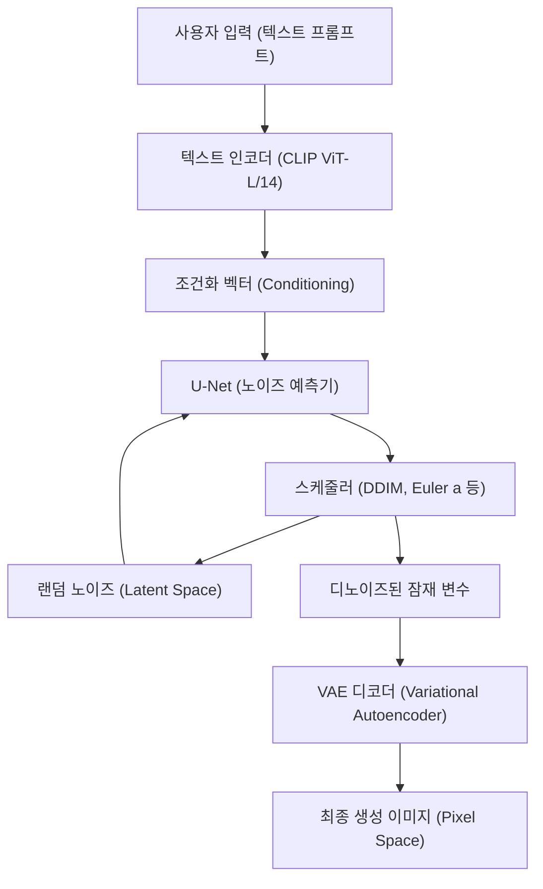
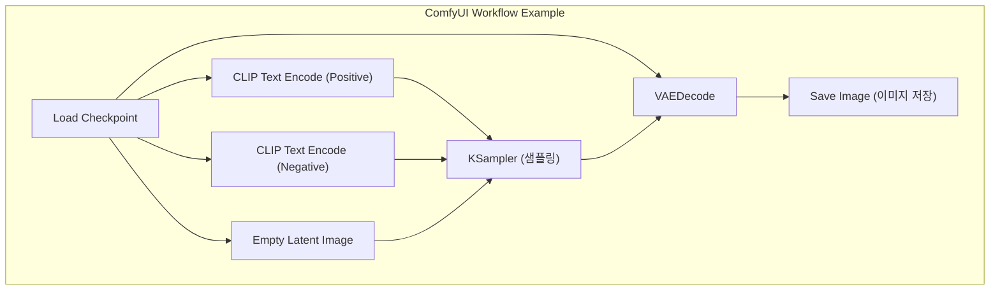

## 1. 시작하며: 왜 로컬 환경에서 AI 이미지 생성을 해야 하는가?

AI 이미지 생성 기술은 Stable Diffusion의 오픈소스화를 시작으로 폭발적인 진화를 거듭하고 있습니다. 현재 Midjourney나 DALL-E 3, Adobe Firefly와 같은 클라우드 기반의 상용 서비스도 매우 강력하고 사용하기 쉬워졌습니다. 하지만 이러한 서비스에는 이용 약관에 따른 생성 콘텐츠 제한(NSFW 필터 등), 구독에 의한 지속적인 비용, 그리고 상세한 생성 프로세스의 제어가 불가능하다는 단점이 존재합니다.

로컬 환경(자신의 PC)에서 AI 이미지 생성 툴을 구축하는 것에는 다음과 같은 압도적인 장점이 있습니다.

1. **완전한 자유와 무제한 생성**: 생성 매수의 제한이나 추가 비용이 없으며, 로컬 리소스가 허용하는 한 무한으로 이미지를 생성할 수 있습니다.
2. **고도의 커스터마이징**: LoRA(Low-Rank Adaptation)나 ControlNet을 이용한 상세한 구도 제어, 특정 캐릭터나 화풍의 재현이 가능합니다.
3. **프라이버시와 보안**: 클라우드에 데이터를 전송하지 않기 때문에, 기밀성이 높은 디자인 업무나 개인적인 프로젝트에 최적입니다.
4. **최신 기술의 즉각적인 도입**: 오픈소스 커뮤니티에서 매일 발표되는 최신 모델이나 확장 기능을 가장 먼저 테스트해 볼 수 있습니다.

본 매뉴얼에서는 Windows 환경을 전제로, 현재 주류가 되고 있는 3가지 AI 이미지 생성 환경(AUTOMATIC1111 Stable Diffusion WebUI, ComfyUI, Fooocus)의 구축 방법부터, 기반이 되는 수학적 배경, 나아가 VRAM 최적화 방법까지 10,000자가 넘는 분량으로 철저하게 해설합니다.

---

## 2. 확산 모델(Diffusion Model)의 수학적 배경과 아키텍처

로컬 환경을 구축하고 파라미터를 적절히 설정하기 위해서는, Stable Diffusion 등의 **잠재 확산 모델(Latent Diffusion Model: LDM)**이 어떻게 작동하고 있는지를 이해하는 것이 매우 유익합니다.

### 2.1 노이즈 추가 프로세스(Forward Process)와 제거 프로세스(Reverse Process)

확산 모델의 기본 원리는, 원본 데이터(이미지)에 단계적으로 가우스 노이즈를 더해 최종적으로 완전한 노이즈로 만드는 'Forward Process'와, 그 노이즈로부터 원본 이미지를 복원하는 'Reverse Process'로 구성됩니다.

Forward Process는 마르코프 연쇄로 정의되며, 단계 $t$에서의 상태 $x_t$는 다음 수식으로 표현됩니다.

$$ q(x_t | x_{t-1}) = \mathcal{N}(x_t; \sqrt{1 - \beta_t} x_{t-1}, \beta_t I) $$

여기에 재매개변수화 트릭(Reparameterization trick)을 사용함으로써, 임의의 단계 $t$의 상태를 초기 상태 $x_0$로부터 직접 계산할 수 있습니다.

$$ x_t = \sqrt{\bar{\alpha}_t} x_0 + \sqrt{1 - \bar{\alpha}_t} \epsilon $$

여기서 $\alpha_t = 1 - \beta_t$, $\bar{\alpha}_t = \prod_{s=1}^t \alpha_s$ 이며, $\epsilon \sim \mathcal{N}(0, I)$ 는 표준 정규 분포에서 샘플링된 노이즈입니다.

이미지 생성 단계인 Reverse Process에서는 신경망(U-Net) $\epsilon_\theta$ 를 사용하여 더해진 노이즈를 예측하고 제거합니다. 손실 함수는 간단하게 다음과 같습니다.

$$ L_{simple} = \mathbb{E}_{x_0, \epsilon \sim \mathcal{N}(0, I), t} \left[ || \epsilon - \epsilon_\theta(\sqrt{\bar{\alpha}_t} x_0 + \sqrt{1 - \bar{\alpha}_t} \epsilon, t) ||^2 \right] $$

### 2.2 Latent Space(잠재 공간)를 통한 계산량 감소

픽셀 공간(Pixel Space)에서 직접 노이즈 제거를 수행하면, 계산량이 이미지의 해상도에 대해 제곱으로 증가하므로 매우 무거운 처리가 됩니다. Stable Diffusion은 **VAE(Variational Autoencoder)**를 사용하여 이미지를 압축된 '잠재 공간(Latent Space)'으로 변환한 후 처리를 진행합니다.

인코더 $E$는 해상도 $H \times W \times 3$의 이미지를 $z \in \mathbb{R}^{H/8 \times W/8 \times 4}$ 로 압축합니다. 공간 차원이 8분의 1로 줄어들기 때문에, 자기 주의 메커니즘(Self-Attention)의 계산량은 $\mathcal{O}((\frac{H \times W}{64})^2)$ 가 되어 극적인 성능 향상을 가져옵니다. 생성 후에는 디코더 $D$에 의해 $\tilde{x} = D(z)$ 로 픽셀 공간으로 복원됩니다.

### 2.3 Stable Diffusion의 시스템 아키텍처

다음 Mermaid 다이어그램은 Stable Diffusion의 전체적인 생성 프로세스(텍스트에서 이미지 생성: txt2img)를 보여줍니다.



---

## 3. 하드웨어 요구 사항 철저 해부

로컬 AI 이미지 생성에서 하드웨어 선택은 가장 중요합니다.

### 3.1 GPU(그래픽 보드)
AI 처리의 심장부입니다. Windows 환경에서 Stable Diffusion을 구동할 경우, NVIDIA의 GPU가 사실상의 표준(디팩토 스탠다드)입니다. AMD의 Radeon으로도 ROCm을 이용해 구동하는 것은 가능하지만, Windows 상에서의 환경 구축 난이도나 많은 확장 기능이 CUDA(NVIDIA의 병렬 컴퓨팅 아키텍처)에 의존하고 있다는 점을 고려하면 NVIDIA 이외의 선택지는 없다고 해도 과언이 아닙니다.

*   **최소 사양**: VRAM 6GB (GTX 1060 6GB / RTX 2060 등). ※단, 해상도나 기능에 큰 제한이 생깁니다.
*   **권장 사양**: VRAM 12GB (RTX 3060 12GB / RTX 4070 등). SDXL 모델을 쾌적하게 구동하기 위한 마지노선입니다.
*   **이상적인 사양**: VRAM 16GB~24GB (RTX 4080 / RTX 3090 / RTX 4090). 고해상도 생성, 복잡한 ControlNet의 동시 사용, 로컬에서의 모델 학습(LoRA 등)을 수행할 경우 필요합니다.

### 3.2 메모리(RAM)와 스토리지
*   **RAM**: 32GB 이상을 강력히 권장합니다. 모델(수 GB~수십 GB)을 스토리지에서 VRAM으로 전송할 때, 일시적으로 시스템 RAM을 사용합니다. RAM이 부족하면 페이지 파일이 사용되어 치명적인 속도 저하를 초래합니다.
*   **스토리지**: NVMe M.2 SSD가 필수입니다. 최근의 AI 모델(Checkpoints)은 하나당 2GB~7GB의 용량을 차지합니다. HDD를 사용하면 모델을 불러오는 데만 몇 분이 걸리므로 실용적이지 않습니다.

---

## 4. 기반 소프트웨어 설정 (Windows 편)

툴 본체를 설치하기 전에 필요한 기반 소프트웨어를 준비합니다.

### 4.1 Python 설치
AI 툴의 대부분은 Python으로 작성되어 있습니다. Stable Diffusion WebUI 등과 호환성이 가장 높은 **Python 3.10.6**을 설치합니다(너무 최신 버전을 사용할 경우 PyTorch 등의 의존성이 깨질 수 있습니다).

1.  Python 공식 아카이브에서 `python-3.10.6-amd64.exe`를 다운로드합니다.
2.  인스톨러 실행 시, 맨 아래에 있는 **"Add Python 3.10 to PATH"**에 반드시 체크합니다.
3.  설치 완료 화면에서 **"Disable path length limit"**(경로 길이 제한 비활성화)를 클릭합니다(중요: Windows의 260자 경로 제한을 해제하지 않으면 깊은 계층의 의존 라이브러리에서 오류가 발생합니다).

### 4.2 Git for Windows 설치
GitHub에서 소스 코드나 모델을 가져오기 위해 Git이 필요합니다.
1.  Git for Windows 공식 사이트에서 인스톨러를 다운로드하고, 모두 기본 설정으로 설치합니다.

### 4.3 CUDA Toolkit 및 cuDNN 설정
최신 PyTorch는 설치 시 필요한 CUDA 바이너리를 내포하여 다운로드하므로, 시스템 전체에 CUDA Toolkit을 설치하는 것은 필수가 아니게 되었습니다. 하지만 사용자 정의 확장 기능(TensorRT나 xFormers의 빌드)을 사용할 경우에는 NVIDIA 공식에서 **CUDA Toolkit 11.8** 또는 **12.1**(사용하는 PyTorch에 맞춤)을 설치해 두는 것을 권장합니다.

---

## 5. 3대 프론트엔드 구축 절차

현재 주류가 되고 있는 3가지 AI 이미지 생성 툴의 구축 방법을 해설합니다. 목적이나 기술에 맞춰 선택해 사용하세요.

### 5.1 AUTOMATIC1111 Stable Diffusion WebUI 구축
가장 역사가 깊고, 확장 기능이 풍부하며, 세밀한 파라미터 조정이 가능한 만능 툴입니다.

**설치 절차:**
1.  원하는 디렉토리(예: `C:\work\ai`)에서 명령 프롬프트를 엽니다.
2.  다음 명령어를 실행하여 리포지토리를 클론합니다.
    ```cmd
    git clone https://github.com/AUTOMATIC1111/stable-diffusion-webui.git
    ```
3.  클론된 디렉토리 내의 `webui-user.bat`을 우클릭하여 편집 모드로 엽니다.
4.  성능을 향상시키기 위해 시작 인수 `COMMANDLINE_ARGS`를 다음과 같이 설정합니다.
    ```bat
    set COMMANDLINE_ARGS=--xformers --opt-sdp-attention --theme dark
    ```
5.  `webui-user.bat`을 더블 클릭하여 실행합니다. 첫 실행 시에는 PyTorch 등 거대한 라이브러리가 다운로드되므로, 환경에 따라 수십 분이 소요됩니다.
6.  완료되면 `Running on local URL: http://127.0.0.1:7860` 이라고 표시되므로 브라우저로 접속합니다.

### 5.2 ComfyUI 구축과 노드 기반의 장점
ComfyUI는 생성 프로세스를 '노드'라고 불리는 블록으로 시각적으로 연결하는(Node-based) UI입니다. VRAM 관리가 매우 뛰어나, AUTOMATIC1111에서는 메모리 부족이 발생하는 환경에서도 작동하는 경우가 많습니다.



**설치 절차:**
1.  ComfyUI의 공식 GitHub 릴리스 페이지에서 Windows Standalone 버전의 7z 파일을 다운로드합니다.
2.  압축을 풀고, 그 안에 있는 `run_nvidia_gpu.bat`을 실행하기만 하면 구동됩니다(Python을 내포한 포터블 버전이므로 설정 불필요).
3.  **ComfyUI Manager 도입**: 확장 기능 관리에 필수입니다. `ComfyUI/custom_nodes/` 디렉토리에서 명령 프롬프트를 열고 다음을 실행합니다.
    ```cmd
    git clone https://github.com/ltdrdata/ComfyUI-Manager.git
    ```
    재시작하면 UI 우측 하단에 'Manager' 버튼이 나타나며, 여기서 다양한 커스텀 노드를 설치할 수 있게 됩니다.

### 5.3 Fooocus 구축: 초보자를 위한 고화질 생성
Fooocus는 Midjourney처럼 '짧은 프롬프트로도 압도적으로 아름다운 이미지가 나오는' 것을 목표로 만들어진 UI입니다. SDXL 모델 전용으로 튜닝되어 있으며, 내부적으로 GPT-2 기반의 프롬프트 확장이나 복잡한 파이프라인을 자동으로 처리합니다.

**설치 절차:**
1.  Fooocus 공식 GitHub에서 Windows용 릴리스 팩을 다운로드하고 압축을 풉니다.
2.  `run.bat`을 실행합니다. 자동으로 Juggernaut XL 등 우수한 SDXL 모델이 다운로드되며, 즉시 고화질 생성을 시작할 수 있는 상태가 됩니다.
3.  'Advanced'에 체크하면 Image Prompt(이미지 프롬프트)나 Inpainting 등의 고급 기능도 사용할 수 있습니다.

---

## 6. 모델 관리와 데이터 구조의 이해

AI 이미지 생성의 품질은 사용하는 모델(학습된 데이터)에 전적으로 의존합니다.

### 6.1 Checkpoints (Base Models)
이미지 생성의 핵심이 되는 메인 모델입니다. 예전에는 `.ckpt`(Pickle 형식)가 주류였으나, 이는 임의의 Python 코드를 실행 가능한 취약성(Arbitrary Code Execution)을 포함하고 있었습니다. 현재는 보안이 보장되고 디스크에서 메모리로의 제로 카피 로드(mmap)가 가능한 **`.safetensors`** 형식이 표준이 되었습니다. 절대 출처를 알 수 없는 `.ckpt` 파일은 다운로드하지 마세요.

### 6.2 LoRA (Low-Rank Adaptation)의 수학적 작동
LoRA는 전체 모델의 미세 조정(파인 튜닝)에 필요한 방대한 계산 자원을 회피하고, 특정 캐릭터나 화풍을 추가 학습시키는 기술입니다.

수십억 개의 파라미터를 가진 가중치 행렬 $W_0 \in \mathbb{R}^{d \times k}$ 를 직접 업데이트하는 대신, LoRA에서는 두 개의 낮은 랭크 행렬 $A \in \mathbb{R}^{r \times k}$ 와 $B \in \mathbb{R}^{d \times r}$ 를 도입합니다(랭크 $r \ll \min(d, k)$). 새로운 가중치는 다음과 같이 계산됩니다.

$$ W = W_0 + \Delta W = W_0 + B A $$

이를 통해 학습·저장하는 파라미터 수가 $d \times k$ 에서 $r \times (d + k)$ 로 급감하며, 수백 MB의 가벼운 파일로 강력한 스타일 적용이 가능해집니다.

### 6.3 VAE (Variational Autoencoder)
앞서 언급했듯이, 잠재 공간과 픽셀 공간을 변환하는 모델입니다. 애니메이션 계열 모델에서는 VAE를 적절하게 설정하지 않으면 전체적으로 뽀얗고 대비가 낮은 '흐리멍덩한 이미지'가 출력될 수 있습니다. `kl-f8-anime2.ckpt` 등 애니메이션 특화 VAE를 `models/VAE` 폴더에 배치하여 적용합니다.

### 6.4 디렉토리 구조 예시 (AUTOMATIC1111)
```text
stable-diffusion-webui/
├── models/
│   ├── Stable-diffusion/  <-- Checkpoints (.safetensors) 를 배치
│   ├── Lora/              <-- LoRA 모델을 배치
│   ├── VAE/               <-- VAE 모델을 배치
│   └── ControlNet/        <-- ControlNet 용 모델을 배치
├── embeddings/            <-- Textual Inversion (PT 파일) 을 배치
├── extensions/            <-- Git Clone한 확장 기능들
└── webui-user.bat         <-- 구동용 배치 파일
```

---

## 7. VRAM 최적화와 성능 튜닝

로컬 생성의 가장 큰 벽인 'VRAM 부족(CUDA Out Of Memory)'을 피하고, 생성 속도를 극한까지 끌어올리기 위한 기술입니다.

### 7.1 Attention 메커니즘 최적화 (xFormers / SDP Attention)
Stable Diffusion 계산의 대부분은 U-Net 내의 Cross-Attention에 소비됩니다. 기본 Attention 계산은 메모리 소비가 크기 때문에 다음 접근법으로 최적화합니다.

*   **xFormers (`--xformers`)**: Meta가 개발한 메모리 효율이 좋은 Attention 구현체(Memory Efficient Attention). VRAM 소비를 대폭 줄이고 속도도 향상되지만, 계산의 비결정성으로 인해 '완전히 같은 시드 값이라도 미묘하게 다른 이미지가 나온다'는 특징이 있습니다.
*   **SDP Attention (`--opt-sdp-attention`)**: PyTorch 2.0부터 기본 탑재된 Scaled Dot Product Attention. xFormers와 동등한 속도 및 VRAM 절감 효과를 가지면서도 의존성이 적다는 것이 장점입니다. 비결정성이 없는 `--opt-sub-quad-attention` 등의 변형도 있습니다.

### 7.2 VRAM 절약 시작 옵션
*   `--medvram`: VRAM이 6GB~8GB인 환경 대상. U-Net을 분할하여 처리하여 메모리를 절약하지만 속도는 다소 저하됩니다.
*   `--lowvram`: VRAM이 4GB 이하인 환경 대상. 모듈을 잘게 VRAM에 넣고 빼기 때문에 속도는 급감하지만 강제적으로 구동할 수 있습니다.
*   `--medvram-sdxl`: SDXL 모델 사용 시에만 MedVRAM을 적용하는 매우 편리한 플래그입니다.

### 7.3 TensorRT를 통한 초고속화
NVIDIA GPU의 텐서 코어를 극한까지 활용하기 위한 프레임워크가 **TensorRT**입니다.
Stable Diffusion의 U-Net을 사용 중인 GPU 전용 엔진(`.trt` 파일)으로 컴파일합니다. 컴파일에는 수십 분의 시간이 걸리며, 해상도나 배치 크기가 고정된다는(Dynamic Shape도 가능하지만 효율이 떨어짐) 단점이 있지만, 생성 속도가 **1.5배~2배 이상**으로 치솟습니다. 같은 해상도의 이미지를 대량으로 생성하는 업무 용도에 있어서 최강의 최적화 기법입니다.

### 7.4 Tiled VAE / Tiled Diffusion
고해상도(4K 등)의 이미지를 생성·업스케일링할 때, VAE의 디코드 처리에서 단숨에 VRAM이 고갈됩니다. 이를 방지하기 위해, 이미지를 타일 모양(예: $512 \times 512$ 씩)으로 분할하여 처리하고 마지막에 결합하는 확장 기능(Multidiffusion / Tiled VAE)이 필수적입니다.

---

## 8. 고급 제어 기술: ControlNet

텍스트 프롬프트만으로는 캐릭터의 포즈나 복잡한 퍼스펙티브, 손가락 끝의 미세한 움직임을 지정하는 것이 불가능합니다. 이를 해결하는 것이 **ControlNet**입니다.

ControlNet은 학습된 Stable Diffusion 모델의 가중치를 고정한 채로 인코더 구조를 복사하여 'Zero-convolutions(가중치가 0으로 초기화된 합성곱 계층)'을 끼워 넣는 아키텍처를 가집니다. 이를 통해 원래의 생성 능력을 파괴하지 않고 추가적인 조건화를 수행할 수 있습니다.

**대표적인 전처리기와 모델:**
*   **OpenPose**: 인물의 골격(관절 위치)을 추출하여 완전히 같은 포즈의 이미지를 생성합니다.
*   **Canny**: 에지(윤곽선) 감지를 수행하여 선화를 바탕으로 채색이나 실사화를 진행합니다.
*   **Depth**: 심도 맵(Depth Map)을 생성하여 공간적인 전후 관계를 유지한 이미지를 생성합니다.
*   **Lineart**: Canny보다 애니메이션 스타일의 선화 추출에 뛰어납니다.

이러한 ControlNet을 여러 개 동시에 적용하는 것(Multi-ControlNet)으로, '지정한 포즈로, 지정한 배경 퍼스펙티브를 가진 이미지'를 확실하게 출력하는 것이 가능해집니다.

---

## 9. 트러블슈팅 (FAQ)

로컬 환경 구축·운영 시 빈번하게 발생하는 오류와 그 해결책입니다.

### Q1. `CUDA out of memory.` 라는 에러가 발생하며 생성이 멈춥니다.
**A1:** VRAM이 부족합니다. 생성 해상도를 낮추거나 배치 크기를 1로 설정하세요. 또한, A1111의 경우에는 `webui-user.bat`에 `--xformers`와 `--medvram`을 추가하여 재시작해 보세요. 고해상도화(Hires. fix)를 수행할 경우, Upscaler로 Latent 계열이 아닌 R-ESRGAN 등의 ESRGAN 계열을 사용하면 VRAM 소비를 줄일 수 있습니다.

### Q2. 생성된 이미지가 새까맣거나 노이즈 투성이가 됩니다.
**A2:** 계산 중에 NaN(Not a Number) 값이 발생하여 텐서가 붕괴되는 현상입니다. 다음 조치를 취해 보세요.
1. 시작 옵션에 `--no-half-vae`를 추가하여 VAE만 단정밀도(FP32)로 계산하게 한다.
2. 시작 옵션에 `--disable-nan-check`를 추가한다(근본적인 해결책은 아닙니다).
3. 사용하는 모델(특히 SD 2.1 계열)이 FP16 계산에 적합하지 않을 수 있으므로 전체 정밀도 모드를 시도해 본다.

### Q3. `webui-user.bat` 실행 시 Python 에러나 Git 에러가 납니다.
**A3:** 의존 라이브러리의 불일치가 의심됩니다. WebUI 디렉토리 내의 `venv` 폴더를 완전히 삭제하고, 다시 `webui-user.bat`을 실행해 보세요. 가상 환경이 깔끔한 상태로 재구축됩니다(수 GB의 재다운로드가 발생합니다).

### Q4. 모델(Safetensors)을 다운로드했는데 목록에 표시되지 않습니다.
**A4:** `models/Stable-diffusion` 폴더에 배치한 후, UI 상의 Checkpoint 선택 드롭다운 옆에 있는 '새로고침' 버튼을 누르세요. 하위 폴더에 넣은 경우 확장자가 올바른지 확인하세요.

---

## 10. 맺음말: AI 이미지 생성의 미래와 로컬 환경의 우위성

Stable Diffusion에서 시작된 오픈소스 AI 이미지 생성의 움직임은 SDXL, 그리고 Stable Diffusion 3나 Flux.1과 같은 차세대 아키텍처로 진화를 거듭하고 있습니다. 모델의 파라미터 수는 수십억에서 백억 개 수준으로 거대해지고 있으며, 앞으로는 VRAM 24GB 이상의 GPU 환경이 더욱 요구될 것입니다.

하지만 TensorRT나 양자화 기술(Quantization), GGUF 등의 로컬 최적화 기술 역시 빠르게 발전하고 있어, 일반 소비자용 하드웨어에서도 충분한 추론이 가능해지는 생태계가 형성되고 있습니다.

본 매뉴얼에서 해설한 CUDA 환경 구축, VRAM 최적화, 그리고 ComfyUI 등의 파이프라인에 대한 이해는, AI 기술 트렌드가 어떻게 변화하더라도 통용되는 보편적인 기반 지식이 될 것입니다. 여러분의 창의력이 제한 없는 로컬 환경에서 최대한으로 발휘되기를 바랍니다.
