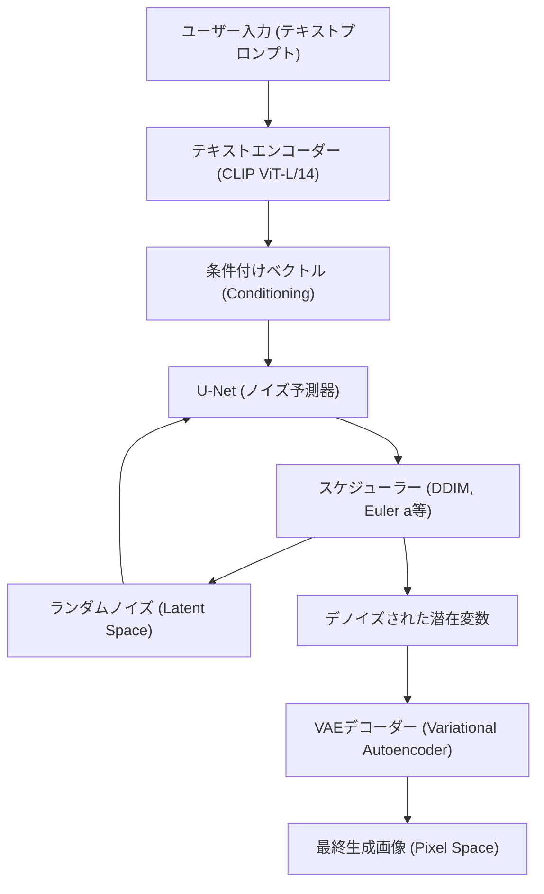
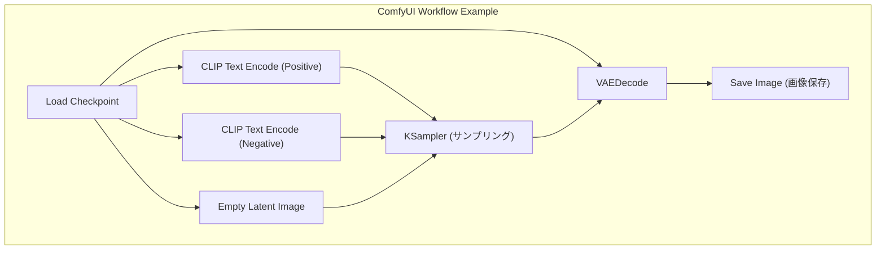

## 1. はじめに：なぜローカル環境でAI画像生成を行うのか？

AI画像生成技術は、Stable Diffusionのオープンソース化を皮切りに爆発的な進化を遂げています。現在、MidjourneyやDALL-E 3、Adobe Fireflyといったクラウドベースの商用サービスも非常に強力で使いやすいものになっています。しかし、それらのサービスには利用規約による生成コンテンツの制限（NSFWフィルターなど）、サブスクリプションによる継続的なコスト、そして詳細な生成プロセスの制御ができないというデメリットが存在します。

ローカル環境（自身のPC）でAI画像生成ツールを構築することには、以下のような圧倒的なメリットがあります。

1. **完全な自由と無制限の生成**: 生成枚数の制限や追加コストがなく、ローカルリソースが許す限り無限に画像を生成できます。
2. **高度なカスタマイズ性**: LoRA（Low-Rank Adaptation）やControlNetを利用した詳細な構図制御、特定のキャラクターや画風の再現が可能です。
3. **プライバシーとセキュリティ**: クラウドにデータを送信しないため、機密性の高いデザイン業務や個人的なプロジェクトに最適です。
4. **最新技術の即時導入**: オープンソースコミュニティで日々発表される最新のモデルや拡張機能をいち早く試すことができます。

本マニュアルでは、Windows環境を前提とし、現在主流となっている3つのAI画像生成環境（AUTOMATIC1111 Stable Diffusion WebUI、ComfyUI、Fooocus）の構築方法から、基盤となる数学的背景、さらにはVRAMの最適化手法までを10,000文字を超えるボリュームで徹底的に解説します。

---

## 2. 拡散モデル（Diffusion Model）の数学的背景とアーキテクチャ

ローカル環境を構築し、パラメータを適切に設定するためには、Stable Diffusionなどの**潜在拡散モデル（Latent Diffusion Model: LDM）**がどのように機能しているかを理解することが非常に有益です。

### 2.1 ノイズ付加プロセス（Forward Process）と除去プロセス（Reverse Process）

拡散モデルの基本原理は、元のデータ（画像）に対して段階的にガウスノイズを加え、最終的に完全なノイズにする「Forward Process」と、そのノイズから元の画像を復元する「Reverse Process」から成り立ちます。

Forward Process はマルコフ連鎖として定義され、ステップ $t$ における状態 $x_t$ は以下の式で表されます。

$$ q(x_t | x_{t-1}) = \mathcal{N}(x_t; \sqrt{1 - \beta_t} x_{t-1}, \beta_t I) $$

これを再パラメータ化トリック（Reparameterization trick）を用いることで、任意のステップ $t$ の状態を初期状態 $x_0$ から直接計算することができます。

$$ x_t = \sqrt{\bar{\alpha}_t} x_0 + \sqrt{1 - \bar{\alpha}_t} \epsilon $$

ここで、$\alpha_t = 1 - \beta_t$、$\bar{\alpha}_t = \prod_{s=1}^t \alpha_s$ であり、$\epsilon \sim \mathcal{N}(0, I)$ は標準正規分布からサンプリングされたノイズです。

画像生成フェーズである Reverse Process では、ニューラルネットワーク（U-Net）$\epsilon_\theta$ を用いて、加えられたノイズを予測し除去します。損失関数はシンプルに以下のようになります。

$$ L_{simple} = \mathbb{E}_{x_0, \epsilon \sim \mathcal{N}(0, I), t} \left[ || \epsilon - \epsilon_\theta(\sqrt{\bar{\alpha}_t} x_0 + \sqrt{1 - \bar{\alpha}_t} \epsilon, t) ||^2 \right] $$

### 2.2 Latent Space（潜在空間）による計算量削減

ピクセル空間（Pixel Space）で直接ノイズ除去を行うと、計算量が画像の解像度に対して二乗で増加するため、非常に重い処理となります。Stable Diffusionは、**VAE（Variational Autoencoder）**を用いて画像を圧縮された「潜在空間（Latent Space）」に変換してから処理を行います。

エンコーダー $E$ は、解像度 $H \times W \times 3$ の画像を $z \in \mathbb{R}^{H/8 \times W/8 \times 4}$ に圧縮します。空間次元が8分の1になるため、自己注意機構（Self-Attention）の計算量は $\mathcal{O}((\frac{H \times W}{64})^2)$ となり、劇的なパフォーマンス向上をもたらします。生成後はデコーダー $D$ によって $\tilde{x} = D(z)$ としてピクセル空間に復元されます。

### 2.3 Stable Diffusionのシステムアーキテクチャ

以下のMermaid図は、Stable Diffusionの全体的な生成プロセス（テキストからの画像生成：txt2img）を示しています。



---

## 3. ハードウェア要件の徹底解剖

ローカルAI画像生成において、ハードウェアの選定は最も重要です。

### 3.1 GPU（グラフィックボード）
AI処理の心臓部です。Windows環境でStable Diffusionを動かす場合、NVIDIA製のGPUが事実上の標準（デファクトスタンダード）です。AMDのRadeonでもROCmを利用して動かすことは可能ですが、Windows上での環境構築の難易度や、多くの拡張機能がCUDA（NVIDIAの並列コンピューティングアーキテクチャ）に依存していることを考慮すると、NVIDIA一択と言っても過言ではありません。

*   **最低要件**: VRAM 6GB（GTX 1060 6GB / RTX 2060 など）。※ただし解像度や機能に大きな制限が出ます。
*   **推奨要件**: VRAM 12GB（RTX 3060 12GB / RTX 4070 など）。SDXLモデルを快適に動かすためのボーダーラインです。
*   **理想要件**: VRAM 16GB〜24GB（RTX 4080 / RTX 3090 / RTX 4090）。高解像度生成、複雑なControlNetの同時使用、ローカルでのモデル学習（LoRA等）を行う場合に必要です。

### 3.2 メモリ（RAM）とストレージ
*   **RAM**: 32GB以上を強く推奨します。モデル（数GB〜数十GB）をストレージからVRAMへ転送する際、一時的にシステムRAMを使用します。RAMが不足するとページファイルが使用され、致命的な速度低下を招きます。
*   **ストレージ**: NVMe M.2 SSDが必須です。昨今のAIモデル（Checkpoints）は1つあたり2GB〜7GBの容量があります。HDDを使用すると、モデルの読み込みだけで数分かかるため、実用的ではありません。

---

## 4. 基盤ソフトウェアのセットアップ (Windows編)

ツール本体をインストールする前に、必要な基盤ソフトウェアを整えます。

### 4.1 Python のインストール
AIツールの大部分はPythonで記述されています。Stable Diffusion WebUIなどとの互換性が最も高い **Python 3.10.6** をインストールします（新しすぎるバージョンではPyTorch等の依存関係が壊れる可能性があります）。

1.  Python公式アーカイブから `python-3.10.6-amd64.exe` をダウンロードします。
2.  インストーラー起動時、一番下にある **"Add Python 3.10 to PATH"** に必ずチェックを入れます。
3.  インストール完了画面で **"Disable path length limit"**（パス長の制限を無効化）をクリックします（重要：Windowsの260文字パス制限を解除しないと、深い階層の依存ライブラリでエラーが起きます）。

### 4.2 Git for Windows のインストール
GitHubからソースコードやモデルを取得するためにGitが必要です。
1.  Git for Windows公式サイトからインストーラーをダウンロードし、すべてデフォルトの設定でインストールします。

### 4.3 CUDA Toolkit と cuDNN の設定
最新のPyTorchはインストール時に必要なCUDAバイナリを内包してダウンロードするため、システム全体にCUDA Toolkitを入れることは必須ではなくなりました。しかし、カスタム拡張機能（TensorRTやxFormersのビルド）を利用する場合は、NVIDIA公式から **CUDA Toolkit 11.8** または **12.1**（使用するPyTorchに合わせる）をインストールしておくことを推奨します。

---

## 5. 3大フロントエンドの構築手順

現在主流となっている3つのAI画像生成ツールの構築方法を解説します。目的やスキルに合わせて使い分けてください。

### 5.1 AUTOMATIC1111 Stable Diffusion WebUI の構築
最も歴史があり、拡張機能が豊富で、細かなパラメータ調整が可能な万能ツールです。

**インストール手順:**
1.  任意のディレクトリ（例：`C:\work\ai`）でコマンドプロンプトを開きます。
2.  以下のコマンドを実行してリポジトリをクローンします。
    ```cmd
    git clone https://github.com/AUTOMATIC1111/stable-diffusion-webui.git
    ```
3.  クローンされたディレクトリ内の `webui-user.bat` を右クリックし、編集モードで開きます。
4.  パフォーマンスを向上させるため、起動引数 `COMMANDLINE_ARGS` を以下のように設定します。
    ```bat
    set COMMANDLINE_ARGS=--xformers --opt-sdp-attention --theme dark
    ```
5.  `webui-user.bat` をダブルクリックして実行します。初回はPyTorch等の巨大なライブラリがダウンロードされるため、環境によっては数十分かかります。
6.  完了すると `Running on local URL: http://127.0.0.1:7860` と表示されるので、ブラウザでアクセスします。

### 5.2 ComfyUI の構築とノードベースの利点
ComfyUIは、生成プロセスを「ノード」と呼ばれるブロックで視覚的に繋ぎ合わせる（Node-based）UIです。VRAMの管理が極めて優秀で、AUTOMATIC1111ではメモリ不足になるような環境でも動作することが多いです。



**インストール手順:**
1.  ComfyUIの公式GitHubリリースページから、Windows Standalone版の7zファイルをダウンロードします。
2.  解凍し、中にある `run_nvidia_gpu.bat` を実行するだけで起動します（Python内包ポータブル版のため設定不要）。
3.  **ComfyUI Managerの導入**: 拡張機能の管理に必須です。`ComfyUI/custom_nodes/` ディレクトリでコマンドプロンプトを開き、以下を実行します。
    ```cmd
    git clone https://github.com/ltdrdata/ComfyUI-Manager.git
    ```
    再起動するとUI右下に「Manager」ボタンが出現し、ここから様々なカスタムノードをインストール可能になります。

### 5.3 Fooocus の構築：初心者向けの高画質生成
Fooocusは、Midjourneyのような「短いプロンプトでも圧倒的に美しい画像が出る」ことを目指して作られたUIです。SDXLモデル専用にチューニングされており、内部でGPT-2ベースのプロンプト拡張や複雑なパイプラインを自動で行います。

**インストール手順:**
1.  Fooocus公式GitHubからWindows用リリースパックをダウンロードし解凍します。
2.  `run.bat` を実行します。自動的にJuggernaut XLなどの優秀なSDXLモデルがダウンロードされ、即座に高画質生成が開始できる状態になります。
3.  「Advanced」にチェックを入れることで、Image Prompt（画像プロンプト）やInpaintingなどの高度な機能も利用可能です。

---

## 6. モデル管理とデータ構造の理解

AI画像生成の品質は、使用するモデル（学習済みデータ）に完全に依存します。

### 6.1 Checkpoints (Base Models)
画像生成の核となるメインモデルです。以前は `.ckpt`（Pickle形式）が主流でしたが、これは任意のPythonコードを実行可能な脆弱性（Arbitrary Code Execution）を含んでいました。現在では、セキュリティが担保され、ディスクからメモリへのゼロコピーロード（mmap）が可能な **`.safetensors`** 形式が標準となっています。絶対に素性の知れない `.ckpt` ファイルはダウンロードしないでください。

### 6.2 LoRA (Low-Rank Adaptation) の数学的挙動
LoRAは、フルモデルの微調整（ファインチューニング）に必要な膨大な計算資源を回避し、特定のキャラクターや画風を追加学習させる技術です。

数十億のパラメータを持つ重み行列 $W_0 \in \mathbb{R}^{d \times k}$ を直接更新する代わりに、LoRAでは2つの低ランク行列 $A \in \mathbb{R}^{r \times k}$ と $B \in \mathbb{R}^{d \times r}$ を導入します（ランク $r \ll \min(d, k)$）。新しい重みは以下のように計算されます。

$$ W = W_0 + \Delta W = W_0 + B A $$

これにより、学習・保存するパラメータ数が $d \times k$ から $r \times (d + k)$ に激減し、数百MBの軽量なファイルで強力なスタイル適用が可能になります。

### 6.3 VAE (Variational Autoencoder)
前述の通り、潜在空間とピクセル空間を変換するモデルです。アニメ系モデルでは、VAEを適切に設定しないと全体的に白っぽく、コントラストの低い「眠い画像」が出力されることがあります。`kl-f8-anime2.ckpt` などのアニメ特化VAEを `models/VAE` フォルダに配置して適用します。

### 6.4 ディレクトリ構造の例 (AUTOMATIC1111)
```text
stable-diffusion-webui/
├── models/
│   ├── Stable-diffusion/  <-- Checkpoints (.safetensors) を配置
│   ├── Lora/              <-- LoRA モデルを配置
│   ├── VAE/               <-- VAE モデルを配置
│   └── ControlNet/        <-- ControlNet 用モデルを配置
├── embeddings/            <-- Textual Inversion (PTファイル) を配置
├── extensions/            <-- Git Cloneした拡張機能群
└── webui-user.bat         <-- 起動用バッチファイル
```

---

## 7. VRAM最適化とパフォーマンスチューニング

ローカル生成最大の壁である「VRAM不足（CUDA Out Of Memory）」を回避し、生成速度を極限まで引き上げるための技術です。

### 7.1 Attention機構の最適化（xFormers / SDP Attention）
Stable Diffusionの計算の大部分は、U-Net内のCross-Attentionに費やされます。デフォルトのAttention計算はメモリ消費が大きいため、以下のアプローチで最適化します。

*   **xFormers (`--xformers`)**: Metaが開発したメモリ効率の良いAttention実装（Memory Efficient Attention）。VRAM消費を大幅に削減し、速度も向上しますが、計算の非決定性により「全く同じシード値でも微妙に異なる画像が出る」という特徴があります。
*   **SDP Attention (`--opt-sdp-attention`)**: PyTorch 2.0から標準搭載されたScaled Dot Product Attention。xFormersと同等の速度とVRAM削減効果を持ちながら、依存関係が少ないのが利点です。非決定性がない `--opt-sub-quad-attention` などのバリエーションもあります。

### 7.2 VRAM節約起動オプション
*   `--medvram`: VRAMが6GB〜8GBの環境向け。U-Netを分割して処理し、メモリを節約しますが速度はやや低下します。
*   `--lowvram`: VRAMが4GB以下の環境向け。モジュールを細かくVRAMに出し入れするため、速度は激減しますが強制的に動かすことができます。
*   `--medvram-sdxl`: SDXLモデル使用時のみMedVRAMを適用する非常に便利なフラグです。

### 7.3 TensorRTによる超高速化
NVIDIA GPUのテンソルコアを極限まで活用するためのフレームワークが **TensorRT** です。
Stable DiffusionのU-Netを、使用しているGPU専用のエンジン（`.trt` ファイル）としてコンパイルします。コンパイルには数十分の時間がかかり、解像度やバッチサイズが固定される（Dynamic Shapeも可能ですが効率が落ちる）というデメリットがありますが、生成速度が **1.5倍〜2倍以上** に跳ね上がります。同じ解像度の画像を大量に生成する業務用途において最強の最適化手法です。

### 7.4 Tiled VAE / Tiled Diffusion
高解像度（4Kなど）の画像を生成・アップスケールする際、VAEのデコード処理で一気にVRAMが枯渇します。これを防ぐために、画像をタイル状（例えば $512 \times 512$ ずつ）に分割して処理し、最後に結合する拡張機能（Multidiffusion / Tiled VAE）が必須となります。

---

## 8. 高度な制御技術：ControlNet

テキストプロンプトだけでは、キャラクターのポーズや複雑なパース、指先の細かな動きを指定することは不可能です。これを解決するのが **ControlNet** です。

ControlNetは、学習済みのStable Diffusionモデルの重みを固定したまま、エンコーダーの構造をコピーして「Zero-convolutions（重みがゼロで初期化された畳み込み層）」を挟み込むアーキテクチャを持ちます。これにより、元の生成能力を破壊することなく、追加の条件付けを行うことができます。

**代表的なプリプロセッサとモデル:**
*   **OpenPose**: 人物の骨格（関節位置）を抽出し、全く同じポーズの画像を生成します。
*   **Canny**: エッジ検出を行い、線画をベースに色塗りや実写化を行います。
*   **Depth**: 深度マップ（Depth Map）を生成し、空間的な前後関係を維持した画像を生成します。
*   **Lineart**: Cannyよりもアニメ調の線画抽出に優れています。

これらのControlNetを複数同時に適用する（Multi-ControlNet）ことで、「指定したポーズで、指定した背景のパースを持った画像」を確実に出力することが可能になります。

---

## 9. トラブルシューティング（FAQ）

ローカル環境構築・運用において頻発するエラーとその解決策です。

### Q1. `CUDA out of memory.` というエラーが出て生成が止まる。
**A1:** VRAMが不足しています。生成解像度を下げるか、バッチサイズを1にしてください。また、A1111の場合は `webui-user.bat` に `--xformers` と `--medvram` を追加して再起動してください。高解像度化（Hires. fix）を行う場合は、UpscalerにLatent系ではなくR-ESRGAN等のESRGAN系を使用するとVRAM消費を抑えられます。

### Q2. 生成された画像が真っ黒、またはノイズだらけになる。
**A2:** 計算中にNaN（Not a Number）値が発生し、テンソルが崩壊している現象です。以下の対処を行ってください。
1. 起動オプションに `--no-half-vae` を追加し、VAEのみ単精度（FP32）で計算させる。
2. 起動オプションに `--disable-nan-check` を追加する（根本解決ではありません）。
3. 使用しているモデル（特にSD 2.1系）に対してFP16での計算が適していない可能性があるため、フル精度モードを試す。

### Q3. `webui-user.bat` 起動時にPythonエラーやGitエラーが出る。
**A3:** 依存ライブラリの不整合が疑われます。WebUIディレクトリ内の `venv` フォルダを完全に削除し、再度 `webui-user.bat` を実行してください。仮想環境がクリーンな状態で再構築されます（数GBの再ダウンロードが発生します）。

### Q4. モデル（Safetensors）をダウンロードしたが一覧に表示されない。
**A4:** `models/Stable-diffusion` フォルダに配置した上で、UI上のCheckpoint選択ドロップダウンの横にある「リフレッシュ（更新）」ボタンを押してください。サブフォルダに入れている場合は、拡張子が間違っていないか確認してください。

---

## 10. 結びとして：AI画像生成の未来とローカル環境の優位性

Stable Diffusionから始まったオープンソースAI画像生成のムーブメントは、SDXL、そしてStable Diffusion 3やFlux.1といった次世代アーキテクチャへと進化を続けています。モデルのパラメータ数は数十億から百億クラスへと巨大化しており、今後はVRAM 24GB以上のGPU環境がさらに求められるようになるでしょう。

しかし、TensorRTや量子化技術（Quantization）、GGUFなどのローカル最適化技術も同様に進化のスピードを速めており、一般コンシューマー向けのハードウェアでも十分な推論が可能になるエコシステムが形成されつつあります。

本マニュアルで解説したCUDA環境の構築、VRAMの最適化、そしてComfyUIなどのパイプライン理解は、AIの技術トレンドがどのように変化しても通用する普遍的な基盤知識となります。皆様のクリエイティビティが、制限のないローカル環境で最大限に発揮されることを願っています。
