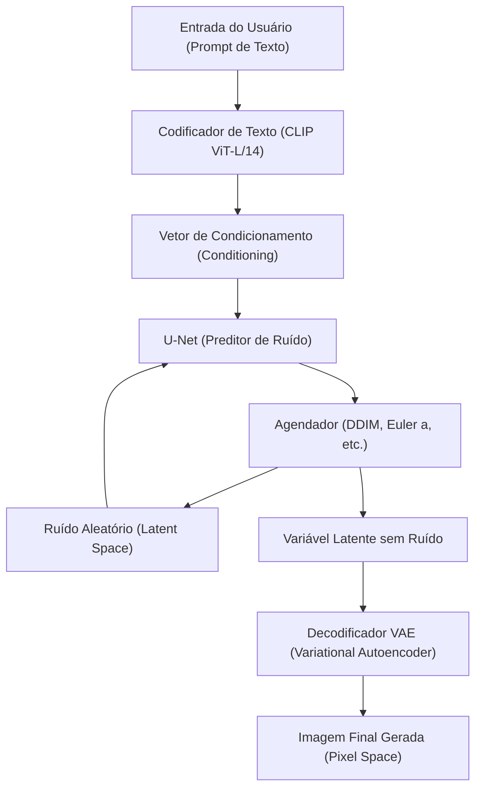
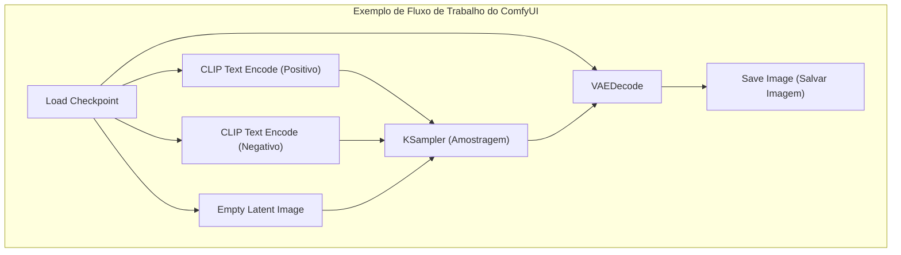

## 1. Introdução: Por que gerar imagens por IA em um ambiente local?

A tecnologia de geração de imagens por IA teve uma evolução explosiva desde que o Stable Diffusion se tornou código aberto. Atualmente, serviços comerciais baseados em nuvem como Midjourney, DALL-E 3 e Adobe Firefly também são muito poderosos e fáceis de usar. No entanto, esses serviços apresentam desvantagens, como restrições no conteúdo gerado pelos termos de serviço (filtros NSFW, etc.), custos contínuos de assinatura e a incapacidade de controlar o processo de geração detalhadamente.

Construir ferramentas de geração de imagens por IA em um ambiente local (seu próprio PC) tem vantagens esmagadoras, como as seguintes:

1. **Liberdade total e geração ilimitada**: Não há limite de imagens geradas nem custos adicionais, e você pode gerar imagens infinitamente, desde que os recursos locais permitam.
2. **Alta capacidade de personalização**: É possível obter um controle detalhado da composição, além da reprodução de personagens ou estilos de arte específicos usando LoRA (Low-Rank Adaptation) e ControlNet.
3. **Privacidade e segurança**: Como os dados não são enviados para a nuvem, é ideal para trabalhos de design altamente confidenciais e projetos pessoais.
4. **Adoção imediata de novas tecnologias**: Você pode ser o primeiro a testar os modelos e extensões mais recentes lançados diariamente pela comunidade de código aberto.

Neste manual, presumindo um ambiente Windows, explicaremos de forma minuciosa, em mais de 10.000 caracteres, os métodos de configuração dos 3 principais ambientes de geração de imagens por IA atuais (AUTOMATIC1111 Stable Diffusion WebUI, ComfyUI, Fooocus), o contexto matemático subjacente e até os métodos de otimização de VRAM.

---

## 2. Contexto Matemático e Arquitetura do Modelo de Difusão (Diffusion Model)

Para construir um ambiente local e configurar parâmetros adequadamente, é muito útil entender como os **Modelos de Difusão Latente (Latent Diffusion Models: LDM)**, como o Stable Diffusion, funcionam.

### 2.1 Processo de Adição de Ruído (Forward Process) e Processo de Remoção (Reverse Process)

O princípio básico do modelo de difusão consiste no "Forward Process", que adiciona gradualmente ruído gaussiano aos dados originais (imagem) até transformá-los completamente em ruído, e o "Reverse Process", que restaura a imagem original a partir desse ruído.

O Forward Process é definido como uma cadeia de Markov, e o estado $x_t$ no passo $t$ é expresso pela seguinte fórmula.

$$ q(x_t | x_{t-1}) = \mathcal{N}(x_t; \sqrt{1 - \beta_t} x_{t-1}, \beta_t I) $$

Ao utilizar o truque de reparametrização (Reparameterization trick), o estado em qualquer passo $t$ pode ser calculado diretamente a partir do estado inicial $x_0$.

$$ x_t = \sqrt{\bar{\alpha}_t} x_0 + \sqrt{1 - \bar{\alpha}_t} \epsilon $$

Aqui, $\alpha_t = 1 - \beta_t$, $\bar{\alpha}_t = \prod_{s=1}^t \alpha_s$, e $\epsilon \sim \mathcal{N}(0, I)$ é o ruído amostrado a partir de uma distribuição normal padrão.

Na fase de geração de imagens (Reverse Process), uma rede neural (U-Net) $\epsilon_\theta$ é usada para prever e remover o ruído adicionado. A função de perda é simplesmente definida da seguinte forma.

$$ L_{simple} = \mathbb{E}_{x_0, \epsilon \sim \mathcal{N}(0, I), t} \left[ || \epsilon - \epsilon_\theta(\sqrt{\bar{\alpha}_t} x_0 + \sqrt{1 - \bar{\alpha}_t} \epsilon, t) ||^2 \right] $$

### 2.2 Redução da Complexidade Computacional através do Espaço Latente (Latent Space)

Remover o ruído diretamente no espaço de pixels (Pixel Space) aumenta a quantidade de cálculos de forma quadrática em relação à resolução da imagem, tornando o processo muito pesado. O Stable Diffusion utiliza um **VAE (Variational Autoencoder)** para converter e comprimir a imagem em um "espaço latente" (Latent Space) antes de processá-la.

O codificador $E$ comprime a imagem de resolução $H \times W \times 3$ em $z \in \mathbb{R}^{H/8 \times W/8 \times 4}$. Como as dimensões espaciais se tornam 1/8, a complexidade computacional do mecanismo de autoatenção (Self-Attention) passa a ser $\mathcal{O}((\frac{H \times W}{64})^2)$, trazendo uma melhoria drástica no desempenho. Após a geração, a imagem é restaurada ao espaço de pixels pelo decodificador $D$ como $\tilde{x} = D(z)$.

### 2.3 Arquitetura de Sistema do Stable Diffusion

O diagrama Mermaid abaixo ilustra o processo geral de geração do Stable Diffusion (geração de imagem a partir de texto: txt2img).



---

## 3. Análise Profunda dos Requisitos de Hardware

Na geração local de imagens por IA, a escolha do hardware é a mais importante.

### 3.1 GPU (Placa de Vídeo)
É o coração do processamento de IA. Para rodar o Stable Diffusion num ambiente Windows, a GPU da NVIDIA é o padrão de fato. É possível rodar em uma AMD Radeon usando ROCm, mas considerando a dificuldade de configurar o ambiente no Windows e o fato de que muitas extensões dependem do CUDA (arquitetura de computação paralela da NVIDIA), não é exagero dizer que a NVIDIA é a única escolha viável.

*   **Requisito Mínimo**: VRAM 6GB (GTX 1060 6GB / RTX 2060, etc.). ※No entanto, haverá grandes limitações na resolução e funções.
*   **Requisito Recomendado**: VRAM 12GB (RTX 3060 12GB / RTX 4070, etc.). É a linha de base para rodar confortavelmente os modelos SDXL.
*   **Requisito Ideal**: VRAM 16GB〜24GB (RTX 4080 / RTX 3090 / RTX 4090). Necessário para geração de alta resolução, uso simultâneo de ControlNets complexos e treinamento de modelos locais (LoRA, etc.).

### 3.2 Memória (RAM) e Armazenamento
*   **RAM**: Recomenda-se fortemente 32GB ou mais. Ao transferir modelos (de vários GB a dezenas de GB) do armazenamento para a VRAM, o sistema usa RAM temporariamente. A falta de RAM faz com que o arquivo de paginação seja usado, resultando numa queda fatal na velocidade.
*   **Armazenamento**: Um SSD NVMe M.2 é obrigatório. Os modelos recentes de IA (Checkpoints) têm uma capacidade de 2GB a 7GB cada. Se você usar um HDD, só o carregamento do modelo demorará vários minutos, tornando o uso impraticável.

---

## 4. Configuração do Software Base (Para Windows)

Antes de instalar as próprias ferramentas, configuraremos o software base necessário.

### 4.1 Instalação do Python
A grande maioria das ferramentas de IA é escrita em Python. Instalaremos o **Python 3.10.6**, que tem a maior compatibilidade com o Stable Diffusion WebUI, etc. (uma versão muito nova pode quebrar as dependências do PyTorch e outros).

1.  Baixe o `python-3.10.6-amd64.exe` no repositório oficial do Python.
2.  Ao iniciar o instalador, certifique-se de marcar a caixa **"Add Python 3.10 to PATH"** na parte inferior.
3.  Na tela de conclusão da instalação, clique em **"Disable path length limit"** (desativar limite de comprimento do caminho). (Importante: Se você não remover a limitação de caminho de 260 caracteres do Windows, ocorrerão erros nas bibliotecas de dependência em níveis mais profundos).

### 4.2 Instalação do Git for Windows
O Git é necessário para baixar códigos-fonte e modelos do GitHub.
1.  Baixe o instalador no site oficial do Git for Windows e instale com todas as configurações padrão.

### 4.3 Configuração do CUDA Toolkit e cuDNN
Como o PyTorch mais recente já inclui os binários CUDA necessários no momento da instalação, não é mais obrigatório instalar o CUDA Toolkit em todo o sistema. No entanto, se você for usar extensões personalizadas (como compilar TensorRT ou xFormers), é recomendado instalar o **CUDA Toolkit 11.8** ou **12.1** (compatível com o PyTorch que você usar) através do site oficial da NVIDIA.

---

## 5. Procedimentos de Construção dos 3 Grandes Frontends

Explicaremos os métodos de configuração das três ferramentas de geração de imagens por IA mais comuns atualmente. Escolha a mais adequada de acordo com seus objetivos e habilidades.

### 5.1 Construção do AUTOMATIC1111 Stable Diffusion WebUI
É a ferramenta mais antiga, versátil, com muitas extensões e ajustes de parâmetros detalhados disponíveis.

**Procedimento de Instalação:**
1.  Abra o Prompt de Comando no diretório desejado (ex: `C:\work\ai`).
2.  Execute o seguinte comando para clonar o repositório.
    ```cmd
    git clone https://github.com/AUTOMATIC1111/stable-diffusion-webui.git
    ```
3.  Clique com o botão direito em `webui-user.bat` dentro do diretório clonado e abra-o no modo de edição.
4.  Para melhorar o desempenho, defina os argumentos de inicialização `COMMANDLINE_ARGS` da seguinte forma.
    ```bat
    set COMMANDLINE_ARGS=--xformers --opt-sdp-attention --theme dark
    ```
5.  Dê um duplo clique no `webui-user.bat` para executá-lo. Bibliotecas gigantes como o PyTorch serão baixadas na primeira vez, o que pode levar dezenas de minutos, dependendo do ambiente.
6.  Quando a mensagem `Running on local URL: http://127.0.0.1:7860` for exibida, acesse através do seu navegador.

### 5.2 Construção do ComfyUI e as Vantagens do Sistema Baseado em Nós
O ComfyUI é uma interface de usuário visual (Node-based) que une visualmente o processo de geração através de blocos chamados "nós". O gerenciamento da VRAM é excelente e, muitas vezes, funciona em ambientes onde o AUTOMATIC1111 ficaria sem memória.



**Procedimento de Instalação:**
1.  Baixe o arquivo 7z da versão Windows Standalone na página oficial de lançamentos do GitHub do ComfyUI.
2.  Descompacte-o e simplesmente execute `run_nvidia_gpu.bat` (é uma versão portátil com Python incluso, sem necessidade de configuração).
3.  **Instalação do ComfyUI Manager**: É essencial para gerenciar extensões. Abra o Prompt de Comando no diretório `ComfyUI/custom_nodes/` e execute o seguinte.
    ```cmd
    git clone https://github.com/ltdrdata/ComfyUI-Manager.git
    ```
    Ao reiniciar, um botão "Manager" aparecerá no canto inferior direito da UI, a partir do qual você pode instalar vários nós personalizados.

### 5.3 Construção do Fooocus: Geração de Alta Qualidade para Iniciantes
O Fooocus é uma interface de usuário desenvolvida com o objetivo de gerar imagens incrivelmente bonitas com comandos curtos, semelhante ao Midjourney. É ajustado especificamente para modelos SDXL, realizando automaticamente expansão de prompts baseada em GPT-2 e pipelines complexos internamente.

**Procedimento de Instalação:**
1.  Baixe o pacote de lançamento para Windows do GitHub oficial do Fooocus e descompacte-o.
2.  Execute `run.bat`. Excelentes modelos SDXL, como o Juggernaut XL, serão baixados automaticamente, e o sistema estará pronto para gerar imagens de alta qualidade instantaneamente.
3.  Ao marcar "Advanced" (Avançado), você também pode usar recursos avançados, como Prompt de Imagem (Image Prompt) e Inpainting.

---

## 6. Gerenciamento de Modelos e Entendimento da Estrutura de Dados

A qualidade da imagem gerada por IA depende inteiramente dos modelos (dados treinados) usados.

### 6.1 Checkpoints (Modelos Base)
O modelo principal no coração da geração de imagens. Antigamente, o formato `.ckpt` (Pickle) era o mais comum, mas continha vulnerabilidades que permitiam a execução de código Python arbitrário (Arbitrary Code Execution). Atualmente, o formato **`.safetensors`** é o padrão, pois garante a segurança e permite o carregamento por cópia zero (mmap) do disco para a memória. Nunca baixe arquivos `.ckpt` de origem desconhecida.

### 6.2 O Comportamento Matemático do LoRA (Low-Rank Adaptation)
O LoRA é uma tecnologia que permite o treinamento adicional de personagens ou estilos específicos, evitando os enormes recursos de computação necessários para o ajuste fino de todo o modelo.

Em vez de atualizar diretamente a matriz de pesos com bilhões de parâmetros $W_0 \in \mathbb{R}^{d \times k}$, o LoRA introduz duas matrizes de baixa ordem $A \in \mathbb{R}^{r \times k}$ e $B \in \mathbb{R}^{d \times r}$ (onde a ordem $r \ll \min(d, k)$). Os novos pesos são calculados da seguinte maneira:

$$ W = W_0 + \Delta W = W_0 + B A $$

Com isso, o número de parâmetros para treinar e salvar cai drasticamente de $d \times k$ para $r \times (d + k)$, permitindo forte aplicação de estilos usando arquivos leves de algumas centenas de MB.

### 6.3 VAE (Variational Autoencoder)
Como mencionado anteriormente, é um modelo para converter entre o espaço latente e o espaço de pixels. Com modelos estilo anime, se o VAE não for definido adequadamente, a imagem resultante pode ficar com uma aparência esbranquiçada, um aspecto "sonolento" e baixo contraste. Coloque um VAE especializado em animes, como `kl-f8-anime2.ckpt`, na pasta `models/VAE` e aplique.

### 6.4 Exemplo de Estrutura de Diretório (AUTOMATIC1111)
```text
stable-diffusion-webui/
├── models/
│   ├── Stable-diffusion/  <-- Coloque Checkpoints (.safetensors) aqui
│   ├── Lora/              <-- Coloque modelos LoRA aqui
│   ├── VAE/               <-- Coloque modelos VAE aqui
│   └── ControlNet/        <-- Coloque modelos ControlNet aqui
├── embeddings/            <-- Coloque Inversão Textual (Textual Inversion, arquivos PT) aqui
├── extensions/            <-- Extensões clonadas via Git
└── webui-user.bat         <-- Arquivo em lote para inicialização
```

---

## 7. Otimização de VRAM e Ajuste de Desempenho

Essas são as técnicas para evitar a barreira de "Falta de VRAM" (CUDA Out Of Memory), a maior parede da geração local, e maximizar as velocidades de geração ao máximo.

### 7.1 Otimização do Mecanismo de Atenção (xFormers / SDP Attention)
A maior parte dos cálculos no Stable Diffusion é gasta no Cross-Attention dentro da U-Net. O cálculo de Attention padrão consome muita memória, então otimizaremos usando as abordagens a seguir.

*   **xFormers (`--xformers`)**: Uma implementação da Meta de atenção eficiente em memória (Memory Efficient Attention). Reduz consideravelmente o consumo da VRAM e melhora a velocidade, mas introduz um comportamento não determinístico onde "imagens levemente diferentes são geradas mesmo com a semente exata".
*   **SDP Attention (`--opt-sdp-attention`)**: Scaled Dot Product Attention padrão a partir do PyTorch 2.0. Tem redução de consumo de VRAM e velocidade comparáveis ao xFormers, com a vantagem de ter menos dependências. Há variações, como `--opt-sub-quad-attention`, que evitam a não determinância.

### 7.2 Opções de Inicialização para Economizar VRAM
*   `--medvram`: Para ambientes com 6GB a 8GB de VRAM. Divide a U-Net em partes e as processa, o que economiza memória mas reduz levemente a velocidade.
*   `--lowvram`: Para ambientes com 4GB ou menos de VRAM. Traz e tira pequenos módulos da VRAM, o que derruba consideravelmente a velocidade, mas força a operação.
*   `--medvram-sdxl`: É uma flag extremamente útil que aplica o MedVRAM somente quando os modelos SDXL estão em uso.

### 7.3 Ultra Aceleração através do TensorRT
Um framework da NVIDIA feito para maximizar a utilização dos Tensor Cores em GPUs NVIDIA é o **TensorRT**.
O U-Net do Stable Diffusion é compilado como um motor (arquivo `.trt`) dedicado especificamente à GPU em uso. Embora a compilação leve vários minutos e traga a desvantagem de prender a resolução e os tamanhos de lote (Dynamic Shape é possível, mas com perda de eficiência), a velocidade de geração salta de **1.5 a 2 vezes ou mais**. É a melhor técnica de otimização para uso comercial, onde muitas imagens com a mesma resolução são geradas.

### 7.4 Tiled VAE / Tiled Diffusion
Na geração ou redimensionamento de imagens em alta resolução (como 4K), o processamento de decodificação no VAE causa esgotamento instantâneo da VRAM. Para impedir que isso aconteça, é necessária uma extensão (Multidiffusion / Tiled VAE) que divida e processe a imagem como blocos (por exemplo, processando peças de $512 \times 512$ por vez) e depois as unifique no fim.

---

## 8. Tecnologia de Controle Avançada: ControlNet

Usar apenas um prompt de texto não permite especificar posições de personagens, perspectivas complexas, ou os movimentos finos das pontas dos dedos. Quem resolve isso é o **ControlNet**.

O ControlNet fixa os pesos dos modelos Stable Diffusion pré-treinados, copia a estrutura do codificador e adota uma arquitetura baseada na injeção de "Zero-convolutions (camadas de convolução com pesos inicializados em zero)". Assim, permite um condicionamento extra sem destruir a capacidade nativa de gerar os elementos da imagem.

**Modelos e Pré-processadores Típicos:**
*   **OpenPose**: Extrai a estrutura óssea de humanos (posições articulares) e gera a imagem com exatamente a mesma postura.
*   **Canny**: Executa a detecção de bordas usando delineamento de linhas e pinta cores ou faz fotorrealismo partindo da arte linear.
*   **Depth**: Cria um mapa de profundidade (Depth Map) e produz uma imagem preservando a relação tridimensional do fundo ao primeiro plano.
*   **Lineart**: Extrai a arte em linhas com mais precisão do que o Canny num estilo mais focado em animes.

Aplicando vários desses ControlNets simultaneamente (Multi-ControlNet), torna-se possível extrair com firmeza "uma imagem com uma postura especificada e com a perspectiva de fundo especificada".

---

## 9. Solução de Problemas (FAQ)

Estes são erros frequentes e suas soluções relacionadas com as configurações do ambiente e uso.

### Q1. A geração para com o erro `CUDA out of memory.`
**A1:** Sua VRAM é insuficiente. Baixe a resolução da imagem, ou use o tamanho do lote para 1. Além disso, para A1111, tente editar seu `webui-user.bat` para adicionar `--xformers` e `--medvram` e reinicie. Caso queira melhorar a resolução (Hires. fix), prefira usar uma classe baseada em ESRGAN em Upscaler, e não baseada em Latent (como os R-ESRGAN, etc.) para reduzir consumo da VRAM.

### Q2. A imagem criada está toda preta ou com falhas de ruído total.
**A2:** Esse é um cenário causado pelos cálculos gerando o estado de valor NaN (Not a Number) onde o tensor se colapsa. Trate-o tomando as seguintes precauções:
1. Adicione a opção `--no-half-vae` ao boot limitando a computação do VAE à precisão única do flutuante (FP32).
2. Adicione a opção `--disable-nan-check` ao boot (Nota: esta não é a solução primordial).
3. Se os modelos em processamento (especialmente baseados em SD 2.1) tiverem dificuldade com FP16, tente mudar para full-precision.

### Q3. Falhas envolvendo Git ou Python ocorrem ao acionar `webui-user.bat`.
**A3:** Há suspeita de conflito envolvendo dependências das bibliotecas. Exclua do seu diretório WebUI a pasta `venv` completamente e torne a correr o arquivo `webui-user.bat`. Isso recriará do zero seu ambiente de dependências (alguns gigabytes de download novamente).

### Q4. Eu baixei os modelos (.safetensors) e eles não aparecem na minha lista de checkpoints.
**A4:** Após colocar seus arquivos no local exigido `models/Stable-diffusion`, toque o botão de atualizar (ícone recarregar circular) localizado na frente do dropdown de Checkpoint do Web UI. Se seus modelos estão em subpastas, verifique novamente a extensão do arquivo para certificar-se de que nada difere.

---

## 10. Conclusão: O Futuro da Geração de Imagens de IA e os Benefícios do Local

O movimento de geração de imagens de IA baseada em open source, que teve largada a partir do Stable Diffusion, continua a florescer em arquiteturas de próximas gerações como o SDXL, e Stable Diffusion 3 ou Flux.1. Como os parâmetros contidos nesses modelos aumentaram a ordem de bilhões à ordem de dezenas de bilhões, os futuros hardwares tenderão a exigir, ainda mais, placas de vídeo a partir de 24GB de VRAM.

No entanto, o progresso tecnológico nas adaptações do funcionamento local, usando processamento em Quantização (Quantization), o uso do formato GGUF ou os recursos avançados baseados em TensorRT continuam sua aceleração exponencial e já formam ecossistemas para rodar inferências até mesmo nos computadores voltados à massa.

As compreensões baseadas neste manual sobre configurações baseadas em CUDA, técnicas de minimização do consumo do VRAM e abordagens aos pipelines presentes no ComfyUI, consistirão sempre num alicerce que perdurará por todas as mudanças presentes nas inovações de IA. Torcemos para que este manual garanta que sua criatividade floresça com restrições mínimas ao extrair o melhor possível do seu sistema local.
