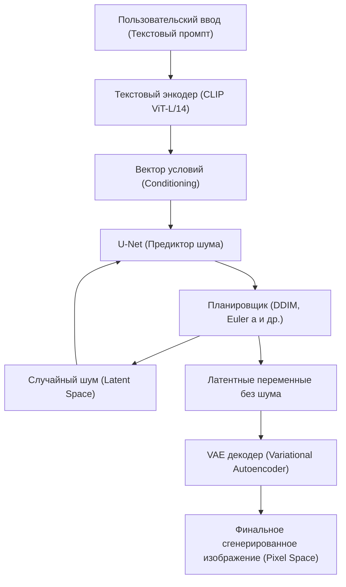
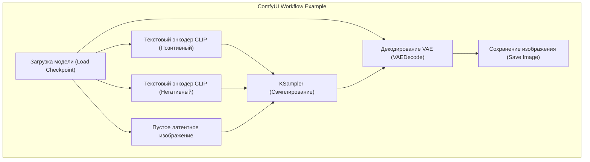

## 1. Введение: Почему стоит генерировать ИИ-изображения в локальной среде?

Технологии генерации ИИ-изображений претерпели взрывную эволюцию, начавшуюся с открытия исходного кода Stable Diffusion. В настоящее время облачные коммерческие сервисы, такие как Midjourney, DALL-E 3 и Adobe Firefly, также являются очень мощными и удобными в использовании. Однако у этих сервисов есть такие недостатки, как ограничения на генерируемый контент в соответствии с условиями использования (например, NSFW-фильтры), постоянные расходы из-за подписок, а также невозможность детального контроля процесса генерации.

Настройка инструмента для генерации ИИ-изображений в локальной среде (на собственном ПК) дает следующие огромные преимущества:

1. **Полная свобода и безграничная генерация**: Отсутствие ограничений на количество генерируемых изображений и дополнительных затрат. Вы можете генерировать изображения бесконечно, пока позволяют локальные ресурсы.
2. **Высокая степень настройки**: Возможность детального управления композицией с помощью LoRA (Low-Rank Adaptation) и ControlNet, а также точного воспроизведения определенных персонажей или художественных стилей.
3. **Конфиденциальность и безопасность**: Поскольку данные не отправляются в облако, это идеально подходит для высококонфиденциальных задач дизайна или личных проектов.
4. **Мгновенное внедрение новейших технологий**: Возможность первыми тестировать новейшие модели и расширения, которые ежедневно выпускаются сообществом open-source.

В этом руководстве, предполагающем использование среды Windows, мы подробно, объемом более 10 000 символов, рассмотрим процесс настройки трех основных современных сред генерации ИИ-изображений (AUTOMATIC1111 Stable Diffusion WebUI, ComfyUI, Fooocus), математические основы, а также методы оптимизации VRAM.

---

## 2. Математические основы и архитектура диффузионных моделей (Diffusion Model)

Для настройки локальной среды и правильной установки параметров очень полезно понимать, как работают **латентные диффузионные модели (Latent Diffusion Model: LDM)**, такие как Stable Diffusion.

### 2.1 Процесс добавления шума (Forward Process) и процесс удаления шума (Reverse Process)

Основной принцип диффузионных моделей состоит из "Forward Process", при котором к исходным данным (изображению) поэтапно добавляется гауссов шум, в конечном итоге превращая его в полный шум, и "Reverse Process", который восстанавливает исходное изображение из этого шума.

Forward Process определяется как марковская цепь, где состояние $x_t$ на шаге $t$ выражается следующим уравнением:

$$ q(x_t | x_{t-1}) = \mathcal{N}(x_t; \sqrt{1 - \beta_t} x_{t-1}, \beta_t I) $$

Используя трюк репараметризации (Reparameterization trick), состояние на любом шаге $t$ можно вычислить напрямую из начального состояния $x_0$:

$$ x_t = \sqrt{\bar{\alpha}_t} x_0 + \sqrt{1 - \bar{\alpha}_t} \epsilon $$

Где $\alpha_t = 1 - \beta_t$, $\bar{\alpha}_t = \prod_{s=1}^t \alpha_s$, а $\epsilon \sim \mathcal{N}(0, I)$ — шум, сэмплированный из стандартного нормального распределения.

В фазе генерации изображения (Reverse Process) используется нейронная сеть (U-Net) $\epsilon_\theta$ для предсказания и удаления добавленного шума. Функция потерь выглядит просто:

$$ L_{simple} = \mathbb{E}_{x_0, \epsilon \sim \mathcal{N}(0, I), t} \left[ || \epsilon - \epsilon_\theta(\sqrt{\bar{\alpha}_t} x_0 + \sqrt{1 - \bar{\alpha}_t} \epsilon, t) ||^2 \right] $$

### 2.2 Сокращение вычислительных затрат с помощью латентного пространства (Latent Space)

Прямое удаление шума в пиксельном пространстве (Pixel Space) является очень ресурсоемкой задачей, поскольку объем вычислений увеличивается пропорционально квадрату разрешения изображения. Stable Diffusion использует **VAE (Variational Autoencoder)** для преобразования изображений в сжатое «латентное пространство» (Latent Space) перед их обработкой.

Энкодер $E$ сжимает изображение с разрешением $H \times W \times 3$ до $z \in \mathbb{R}^{H/8 \times W/8 \times 4}$. Поскольку пространственные размеры уменьшаются в 8 раз, объем вычислений для механизма внутреннего внимания (Self-Attention) становится $\mathcal{O}((\frac{H \times W}{64})^2)$, что приводит к резкому повышению производительности. После генерации декодер $D$ восстанавливает изображение обратно в пиксельное пространство как $\tilde{x} = D(z)$.

### 2.3 Системная архитектура Stable Diffusion

Следующая Mermaid-диаграмма иллюстрирует общий процесс генерации в Stable Diffusion (генерация изображения из текста: txt2img).



---

## 3. Подробный разбор требований к аппаратному обеспечению

При локальной генерации ИИ-изображений выбор оборудования имеет первостепенное значение.

### 3.1 GPU (Видеокарта)
Это сердце обработки ИИ. Для запуска Stable Diffusion в среде Windows видеокарты от NVIDIA являются фактическим стандартом. Хотя можно использовать AMD Radeon с помощью ROCm, учитывая сложность настройки в Windows и тот факт, что многие расширения зависят от CUDA (архитектура параллельных вычислений NVIDIA), не будет преувеличением сказать, что NVIDIA — единственный разумный выбор.

*   **Минимальные требования**: VRAM 6GB (например, GTX 1060 6GB / RTX 2060). ※Однако будут серьезные ограничения по разрешению и функциональности.
*   **Рекомендуемые требования**: VRAM 12GB (например, RTX 3060 12GB / RTX 4070). Это пограничный уровень для комфортной работы с моделями SDXL.
*   **Идеальные требования**: VRAM от 16GB до 24GB (RTX 4080 / RTX 3090 / RTX 4090). Необходимо для генерации в высоком разрешении, одновременного использования сложных ControlNet и локального обучения моделей (например, LoRA).

### 3.2 Память (RAM) и хранилище
*   **RAM**: Настоятельно рекомендуется 32GB или больше. При переносе моделей (размером от нескольких гигабайт до десятков гигабайт) из хранилища в VRAM временно используется системная оперативная память. Нехватка RAM приведет к использованию файла подкачки и фатальному снижению скорости.
*   **Хранилище**: Наличие NVMe M.2 SSD обязательно. Современные ИИ-модели (Checkpoints) весят от 2GB до 7GB каждая. Использование HDD непрактично, так как только загрузка модели может занимать несколько минут.

---

## 4. Настройка базового программного обеспечения (для Windows)

Перед установкой самих инструментов необходимо подготовить базовое программное обеспечение.

### 4.1 Установка Python
Большинство инструментов ИИ написаны на Python. Установите **Python 3.10.6**, который имеет наилучшую совместимость со Stable Diffusion WebUI и другими (слишком новые версии могут сломать зависимости, такие как PyTorch).

1.  Скачайте `python-3.10.6-amd64.exe` из официального архива Python.
2.  При запуске установщика обязательно отметьте галочкой **"Add Python 3.10 to PATH"** в самом низу.
3.  На экране завершения установки нажмите **"Disable path length limit"** (Отключить ограничение длины пути). (Важно: если не снять ограничение Windows на пути в 260 символов, возникнут ошибки с глубоко вложенными библиотеками зависимостей).

### 4.2 Установка Git for Windows
Git необходим для получения исходного кода и моделей с GitHub.
1.  Скачайте установщик с официального сайта Git for Windows и установите его со всеми настройками по умолчанию.

### 4.3 Настройка CUDA Toolkit и cuDNN
Поскольку современный PyTorch при установке загружает необходимые бинарные файлы CUDA, установка CUDA Toolkit в масштабах всей системы больше не является обязательной. Однако при использовании пользовательских расширений (сборка TensorRT или xFormers) рекомендуется установить **CUDA Toolkit 11.8** или **12.1** (в зависимости от используемого PyTorch) с официального сайта NVIDIA.

---

## 5. Процедуры настройки трех основных фронтендов

Здесь описаны методы настройки трех основных инструментов генерации ИИ-изображений, популярных в настоящее время. Выбирайте в зависимости от ваших целей и навыков.

### 5.1 Настройка AUTOMATIC1111 Stable Diffusion WebUI
Это самый старый, универсальный инструмент с множеством расширений, позволяющий детально настраивать параметры.

**Процедура установки:**
1.  Откройте командную строку в нужной директории (например, `C:\work\ai`).
2.  Выполните следующую команду для клонирования репозитория:
    ```cmd
    git clone https://github.com/AUTOMATIC1111/stable-diffusion-webui.git
    ```
3.  Щелкните правой кнопкой мыши файл `webui-user.bat` внутри клонированной директории и откройте его в режиме редактирования.
4.  Для повышения производительности установите аргументы запуска `COMMANDLINE_ARGS` следующим образом:
    ```bat
    set COMMANDLINE_ARGS=--xformers --opt-sdp-attention --theme dark
    ```
5.  Дважды щелкните `webui-user.bat` для запуска. При первом запуске будут загружены огромные библиотеки, такие как PyTorch, что может занять десятки минут в зависимости от вашей среды.
6.  По завершении появится сообщение `Running on local URL: http://127.0.0.1:7860`, после чего можно получить доступ через браузер.

### 5.2 Настройка ComfyUI и преимущества нодовой системы
ComfyUI — это пользовательский интерфейс, в котором процесс генерации визуально соединяется блоками, называемыми "нодами" (Node-based). Управление VRAM здесь превосходное, и он часто работает в средах, где AUTOMATIC1111 сталкивается с нехваткой памяти.



**Процедура установки:**
1.  Скачайте файл 7z для Windows Standalone со страницы релизов официального GitHub-репозитория ComfyUI.
2.  Распакуйте его и просто запустите `run_nvidia_gpu.bat` (дополнительная настройка не требуется, так как это портативная версия со встроенным Python).
3.  **Установка ComfyUI Manager**: Обязателен для управления расширениями. Откройте командную строку в директории `ComfyUI/custom_nodes/` и выполните следующее:
    ```cmd
    git clone https://github.com/ltdrdata/ComfyUI-Manager.git
    ```
    После перезапуска в правом нижнем углу интерфейса появится кнопка «Manager», откуда можно устанавливать различные пользовательские ноды (custom nodes).

### 5.3 Настройка Fooocus: Высококачественная генерация для начинающих
Fooocus — это интерфейс, созданный с целью "получать потрясающе красивые изображения даже с короткими промптами", подобно Midjourney. Он настроен специально для моделей SDXL и автоматически выполняет расширение промптов на базе GPT-2 и сложные конвейеры (pipelines) под капотом.

**Процедура установки:**
1.  Скачайте и распакуйте пакет релиза для Windows с официального GitHub-репозитория Fooocus.
2.  Запустите `run.bat`. Отличные модели SDXL, такие как Juggernaut XL, будут загружены автоматически, и вы сразу будете готовы к началу высококачественной генерации.
3.  Поставив галочку «Advanced» (Дополнительно), вы можете использовать продвинутые функции, такие как Image Prompt (Изображение-промпт) и Inpainting (Закрашивание).

---

## 6. Управление моделями и понимание структуры данных

Качество ИИ-генерации изображений полностью зависит от используемых моделей (обученных данных).

### 6.1 Checkpoints (Базовые модели)
Это основные модели, которые являются ядром генерации изображений. В прошлом формат `.ckpt` (формат Pickle) был мейнстримом, но он содержал уязвимость, позволяющую выполнять произвольный код Python (Arbitrary Code Execution). В настоящее время стандартом является формат **`.safetensors`**, который гарантирует безопасность и позволяет выполнять загрузку с диска в память без копирования (mmap). Ни в коем случае не скачивайте файлы `.ckpt` неизвестного происхождения.

### 6.2 Математическое поведение LoRA (Low-Rank Adaptation)
LoRA — это технология, которая избегает огромных вычислительных ресурсов, необходимых для тонкой настройки (fine-tuning) полной модели, и позволяет дополнительно обучать конкретных персонажей или стили искусства.

Вместо того чтобы напрямую обновлять матрицу весов $W_0 \in \mathbb{R}^{d \times k}$ с миллиардами параметров, LoRA вводит две матрицы низкого ранга $A \in \mathbb{R}^{r \times k}$ и $B \in \mathbb{R}^{d \times r}$ (где ранг $r \ll \min(d, k)$). Новые веса вычисляются следующим образом:

$$ W = W_0 + \Delta W = W_0 + B A $$

Это кардинально сокращает количество параметров для обучения и сохранения с $d \times k$ до $r \times (d + k)$, позволяя применять мощные стили с помощью легких файлов размером в несколько сотен мегабайт.

### 6.3 VAE (Variational Autoencoder)
Как упоминалось ранее, это модель, которая преобразует между латентным пространством и пиксельным пространством. Если в моделях аниме-стиля неправильно настроить VAE, выходные изображения могут быть белесыми, с низким контрастом и «тусклыми». Разместите VAE, специализированный для аниме (например, `kl-f8-anime2.ckpt`), в папку `models/VAE` и примените его.

### 6.4 Пример структуры каталогов (AUTOMATIC1111)
```text
stable-diffusion-webui/
├── models/
│   ├── Stable-diffusion/  <-- Размещайте здесь Checkpoints (.safetensors)
│   ├── Lora/              <-- Размещайте здесь модели LoRA
│   ├── VAE/               <-- Размещайте здесь модели VAE
│   └── ControlNet/        <-- Размещайте здесь модели ControlNet
├── embeddings/            <-- Размещайте здесь Textual Inversion (файлы PT)
├── extensions/            <-- Расширения, клонированные через Git
└── webui-user.bat         <-- Пакетный файл для запуска
```

---

## 7. Оптимизация VRAM и настройка производительности

Методы для предотвращения "Нехватки VRAM" (CUDA Out Of Memory), самого большого препятствия в локальной генерации, и максимизации скорости генерации.

### 7.1 Оптимизация механизма Attention (xFormers / SDP Attention)
Большая часть вычислений Stable Diffusion тратится на Cross-Attention внутри U-Net. Поскольку расчет внимания по умолчанию потребляет много памяти, мы оптимизируем его с помощью следующих подходов:

*   **xFormers (`--xformers`)**: Реализация Attention с эффективным использованием памяти (Memory Efficient Attention), разработанная Meta. Она значительно снижает потребление VRAM и повышает скорость, но из-за недетерминированности вычислений имеет особенность, при которой "даже при совершенно одинаковом значении seed генерируются слегка отличающиеся изображения".
*   **SDP Attention (`--opt-sdp-attention`)**: Scaled Dot Product Attention, встроенный по умолчанию начиная с PyTorch 2.0. Он имеет тот же эффект скорости и уменьшения VRAM, что и xFormers, с преимуществом в виде меньшего количества зависимостей. Существуют также вариации без недетерминированности, такие как `--opt-sub-quad-attention`.

### 7.2 Параметры запуска для экономии VRAM
*   `--medvram`: Для сред с VRAM от 6GB до 8GB. Он обрабатывает U-Net по частям, экономя память, но скорость немного снижается.
*   `--lowvram`: Для сред с VRAM 4GB или меньше. Скорость резко падает, так как модули часто загружаются и выгружаются из VRAM, но это позволяет принудительно запустить процесс.
*   `--medvram-sdxl`: Очень удобный флаг, который применяет MedVRAM только при использовании моделей SDXL.

### 7.3 Сверхбыстрое ускорение с помощью TensorRT
**TensorRT** — это фреймворк для максимального использования тензорных ядер графических процессоров NVIDIA.
Он компилирует U-Net Stable Diffusion в выделенный движок (файл `.trt`) для используемого вами GPU. Компиляция занимает десятки минут и имеет недостаток в виде фиксированного разрешения и размера пакета (Dynamic Shape возможен, но эффективность падает), но скорость генерации подскакивает в **1.5-2 раза и более**. Это лучший метод оптимизации для бизнес-сценариев, где генерируется большое количество изображений с одинаковым разрешением.

### 7.4 Tiled VAE / Tiled Diffusion
При генерации или апскейлинге изображений высокого разрешения (например, 4K) VRAM моментально исчерпывается в процессе декодирования VAE. Чтобы предотвратить это, необходимо расширение (Multidiffusion / Tiled VAE), которое делит изображение на фрагменты (например, по $512 \times 512$), обрабатывает их, а затем объединяет.

---

## 8. Передовые методы управления: ControlNet

Невозможно задать позы персонажей, сложную перспективу или тонкие движения пальцев только с помощью текстового промпта. Эту проблему решает **ControlNet**.

ControlNet имеет архитектуру, которая фиксирует веса обученной модели Stable Diffusion, копирует структуру энкодера и вставляет "Zero-convolutions" (сверточные слои, веса которых инициализированы нулями). Это позволяет добавлять дополнительные условия без разрушения исходной генеративной способности.

**Типичные препроцессоры и модели:**
*   **OpenPose**: Извлекает скелет (положение суставов) человека и генерирует изображение в точно такой же позе.
*   **Canny**: Выполняет обнаружение краев (edge detection) и использует штриховые рисунки (line art) в качестве основы для раскрашивания или создания фотореалистичных изображений.
*   **Depth**: Генерирует карту глубины (Depth Map) для создания изображений с сохранением пространственных отношений спереди и сзади.
*   **Lineart**: Превосходит Canny в извлечении контуров (штриховых рисунков) в стиле аниме.

Применяя несколько ControlNet одновременно (Multi-ControlNet), можно надежно получать изображения типа "с заданной позой и заданной перспективой фона".

---

## 9. Устранение неполадок (FAQ)

Ошибки, которые часто возникают при настройке и работе в локальной среде, и пути их решения.

### В1. Генерация останавливается с ошибкой `CUDA out of memory.`
**О1:** Недостаточно VRAM. Уменьшите разрешение генерации или установите размер пакета (batch size) равным 1. Также для A1111 добавьте `--xformers` и `--medvram` в файл `webui-user.bat` и перезапустите. При апскейлинге (Hires. fix) используйте для Upscaler семейство ESRGAN, например R-ESRGAN, вместо латентных апскейлеров, чтобы снизить потребление VRAM.

### В2. Сгенерированное изображение полностью черное или заполнено шумом.
**О2:** Это явление, когда значения NaN (Not a Number) возникают во время вычислений, и тензор разрушается. Выполните следующие действия:
1. Добавьте опцию запуска `--no-half-vae`, чтобы вычислять только VAE с одинарной точностью (FP32).
2. Добавьте опцию запуска `--disable-nan-check` (это не фундаментальное решение).
3. Используемая модель (особенно серии SD 2.1) может быть не приспособлена к вычислениям FP16, поэтому попробуйте режим полной точности.

### В3. При запуске `webui-user.bat` возникают ошибки Python или Git.
**О3:** Подозревается несоответствие библиотек зависимостей. Полностью удалите папку `venv` в директории WebUI и снова запустите `webui-user.bat`. Виртуальная среда будет перестроена начисто (потребуется повторная загрузка нескольких гигабайт).

### В4. Я скачал модель (Safetensors), но она не отображается в списке.
**О4:** Убедитесь, что вы поместили ее в папку `models/Stable-diffusion`, а затем нажмите кнопку "Обновить" (Refresh) рядом с выпадающим списком выбора Checkpoint в интерфейсе. Если вы положили ее во вложенную папку, убедитесь, что расширение файла указано правильно.

---

## 10. В заключение: Будущее генерации ИИ-изображений и превосходство локальных сред

Движение генерации ИИ-изображений с открытым исходным кодом, начавшееся со Stable Diffusion, продолжает развиваться с архитектурами следующего поколения, такими как SDXL, Stable Diffusion 3 и Flux.1. Количество параметров моделей выросло с миллиардов до десятков миллиардов, и в будущем потребность в графических процессорах с 24GB VRAM и более только возрастет.

Однако технологии локальной оптимизации, такие как TensorRT, технологии квантования (Quantization) и GGUF, также ускоряют свой темп развития, и формируется экосистема, которая сделает достаточный вывод (inference) возможным даже на оборудовании для обычных потребителей.

Настройка среды CUDA, оптимизация VRAM и понимание конвейеров, таких как ComfyUI, рассмотренные в этом руководстве, станут универсальными базовыми знаниями, которые останутся актуальными независимо от того, как изменятся технологические тенденции ИИ. Мы надеемся, что ваши творческие способности будут максимально реализованы в локальной среде без каких-либо ограничений.
