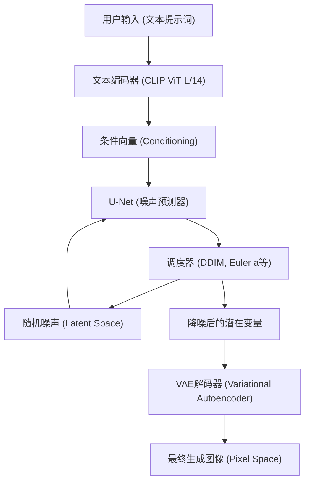
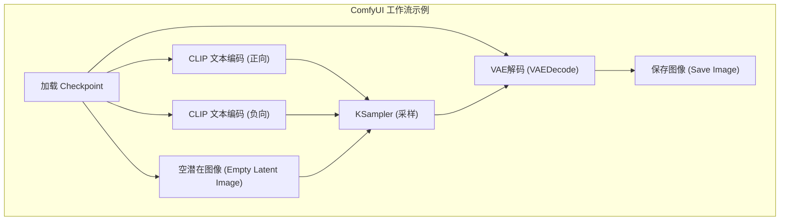

## 1. 引言：为何要在本地环境进行AI图像生成？

AI图像生成技术以Stable Diffusion的开源为契机，取得了爆发式的进化。目前，Midjourney、DALL-E 3以及Adobe Firefly等基于云端的商业服务也非常强大且易于使用。然而，这些服务存在一些缺点，例如服务条款对生成内容的限制（如NSFW过滤器等）、订阅带来的持续成本，以及无法对生成过程进行精确控制。

在本地环境（个人电脑）中搭建AI图像生成工具具有以下压倒性的优势：

1. **完全的自由与无限制的生成**：没有生成数量的限制或额外成本，只要本地资源允许，就可以无限量地生成图像。
2. **高度的可定制性**：利用LoRA（Low-Rank Adaptation）和ControlNet可以实现精细的构图控制，以及特定角色或画风的重现。
3. **隐私与安全性**：因为不会将数据发送到云端，非常适合机密性高的设计工作或个人项目。
4. **即刻引入最新技术**：可以第一时间尝试开源社区每天发布的最新模型和扩展功能。

本指南以Windows环境为前提，针对目前主流的三种AI图像生成环境（AUTOMATIC1111 Stable Diffusion WebUI、ComfyUI、Fooocus），从搭建方法到基础的数学背景，甚至是VRAM的优化方法，将以超过一万字的篇幅进行彻底的讲解。

---

## 2. 扩散模型（Diffusion Model）的数学背景与架构

为了搭建本地环境并适当调整参数，理解Stable Diffusion等**潜在扩散模型（Latent Diffusion Model: LDM）**是如何运作的将会非常有帮助。

### 2.1 添加噪声过程（Forward Process）与去除噪声过程（Reverse Process）

扩散模型的基本原理分为“Forward Process”和“Reverse Process”，前者对原始数据（图像）逐步添加高斯噪声，最终使其完全变为噪声；后者则从该噪声中恢复出原始图像。

Forward Process被定义为马尔可夫链，步骤 $t$ 的状态 $x_t$ 用以下公式表示：

$$ q(x_t | x_{t-1}) = \mathcal{N}(x_t; \sqrt{1 - \beta_t} x_{t-1}, \beta_t I) $$

通过使用重参数化技巧（Reparameterization trick），可以直接从初始状态 $x_0$ 计算出任意步骤 $t$ 的状态：

$$ x_t = \sqrt{\bar{\alpha}_t} x_0 + \sqrt{1 - \bar{\alpha}_t} \epsilon $$

这里，$\alpha_t = 1 - \beta_t$，$\bar{\alpha}_t = \prod_{s=1}^t \alpha_s$，而 $\epsilon \sim \mathcal{N}(0, I)$ 是从标准正态分布中采样的噪声。

在作为图像生成阶段的 Reverse Process 中，使用神经网络（U-Net）$\epsilon_\theta$ 来预测并去除所添加的噪声。损失函数可以简单地表示如下：

$$ L_{simple} = \mathbb{E}_{x_0, \epsilon \sim \mathcal{N}(0, I), t} \left[ || \epsilon - \epsilon_\theta(\sqrt{\bar{\alpha}_t} x_0 + \sqrt{1 - \bar{\alpha}_t} \epsilon, t) ||^2 \right] $$

### 2.2 通过 Latent Space（潜在空间）减少计算量

如果在像素空间（Pixel Space）直接进行降噪处理，计算量将随着图像分辨率的平方而增加，处理过程会非常沉重。Stable Diffusion 使用 **VAE（Variational Autoencoder）** 将图像压缩转换到“潜在空间（Latent Space）”后再进行处理。

编码器 $E$ 将分辨率为 $H \times W \times 3$ 的图像压缩为 $z \in \mathbb{R}^{H/8 \times W/8 \times 4}$。由于空间维度变为了八分之一，自注意力机制（Self-Attention）的计算量变为 $\mathcal{O}((\frac{H \times W}{64})^2)$，这带来了性能的戏剧性提升。生成后，解码器 $D$ 通过 $\tilde{x} = D(z)$ 将其恢复到像素空间。

### 2.3 Stable Diffusion 的系统架构

以下 Mermaid 图展示了 Stable Diffusion 的整体生成过程（文本生成图像：txt2img）。



---

## 3. 硬件要求彻底剖析

在本地进行AI图像生成时，硬件的选择是最为重要的一环。

### 3.1 GPU（显卡）
这是AI处理的心脏部位。如果在Windows环境下运行Stable Diffusion，NVIDIA显卡是事实上的标准（De facto standard）。虽然AMD的Radeon也可以通过ROCm来运行，但考虑到在Windows上搭建环境的难度，以及众多扩展功能依赖于CUDA（NVIDIA的并行计算架构），可以说NVIDIA是唯一合理的选择。

*   **最低配置要求**：VRAM 6GB（GTX 1060 6GB / RTX 2060 等）。※但在分辨率和功能上会受到很大限制。
*   **推荐配置要求**：VRAM 12GB（RTX 3060 12GB / RTX 4070 等）。这是能够流畅运行SDXL模型的底线。
*   **理想配置要求**：VRAM 16GB〜24GB（RTX 4080 / RTX 3090 / RTX 4090）。在进行高分辨率生成、同时使用复杂的ControlNet，或在本地进行模型训练（如LoRA等）时是必须的。

### 3.2 内存（RAM）与存储设备
*   **RAM**：强烈建议 32GB 以上。在将模型（几GB到几十GB）从存储设备传输到VRAM时，会临时使用系统RAM。如果RAM不足，就会使用分页文件，导致速度发生致命的下降。
*   **存储设备**：NVMe M.2 SSD是必须的。近期的AI模型（Checkpoints）每个都有2GB到7GB的容量。如果使用HDD，光是加载模型就需要耗费几分钟，完全不实用。

---

## 4. 基础软件的安装与设置 (Windows篇)

在安装工具主体之前，我们需要先准备好所需的基础软件。

### 4.1 安装 Python
绝大部分AI工具都是用Python编写的。请安装与Stable Diffusion WebUI等兼容性最好的 **Python 3.10.6**（版本过新可能会导致PyTorch等依赖关系出现问题）。

1.  从Python官方文档中下载 `python-3.10.6-amd64.exe`。
2.  启动安装程序时，请务必勾选底部的 **"Add Python 3.10 to PATH"**。
3.  在安装完成界面，点击 **"Disable path length limit"**（解除路径长度限制）（重要：如果不解除Windows的260个字符的路径限制，在深层结构的依赖库中会发生错误）。

### 4.2 安装 Git for Windows
需要Git来从GitHub获取源代码和模型。
1.  从Git for Windows官网下载安装程序，并使用所有默认设置进行安装。

### 4.3 设置 CUDA Toolkit 和 cuDNN
由于最新的PyTorch在安装时会自动内嵌并下载所需的CUDA二进制文件，因此不再需要强制在整个系统中安装CUDA Toolkit。然而，如果打算使用自定义扩展功能（如编译TensorRT或xFormers），则建议从NVIDIA官网安装 **CUDA Toolkit 11.8** 或 **12.1**（请与使用的PyTorch版本保持一致）。

---

## 5. 三大前端界面的搭建步骤

下面讲解目前主流的三种AI图像生成工具的搭建方法。请根据自己的目的和技能水平选择使用。

### 5.1 搭建 AUTOMATIC1111 Stable Diffusion WebUI
这是历史最悠久、扩展功能最丰富、可以进行精细参数调整的全能型工具。

**安装步骤：**
1.  在任意目录（例如：`C:\work\ai`）下打开命令提示符。
2.  执行以下命令来克隆仓库。
    ```cmd
    git clone https://github.com/AUTOMATIC1111/stable-diffusion-webui.git
    ```
3.  右键点击克隆下来的目录中的 `webui-user.bat`，并在编辑模式下打开。
4.  为了提升性能，将启动参数 `COMMANDLINE_ARGS` 设置如下：
    ```bat
    set COMMANDLINE_ARGS=--xformers --opt-sdp-attention --theme dark
    ```
5.  双击运行 `webui-user.bat`。由于首次启动会下载PyTorch等巨大的依赖库，根据网络环境可能需要几十分钟。
6.  完成后如果显示 `Running on local URL: http://127.0.0.1:7860`，即可在浏览器中访问。

### 5.2 搭建 ComfyUI 及其节点化优势
ComfyUI 是一种通过被称为“节点”的模块将生成过程在视觉上连接起来的（Node-based）用户界面。它对VRAM的管理极其出色，经常能在AUTOMATIC1111会提示内存不足的环境下顺利运行。



**安装步骤：**
1.  从ComfyUI的官方GitHub发布页面下载Windows Standalone版本的7z压缩包。
2.  解压缩后，只需运行其中的 `run_nvidia_gpu.bat` 即可启动（这是内置了Python的便携版，因此无需额外设置）。
3.  **引入 ComfyUI Manager**：这是管理扩展功能所必需的。在 `ComfyUI/custom_nodes/` 目录下打开命令提示符，执行以下命令：
    ```cmd
    git clone https://github.com/ltdrdata/ComfyUI-Manager.git
    ```
    重启后，界面右下角会出现“Manager”按钮，可以通过这里安装各种自定义节点。

### 5.3 搭建 Fooocus：面向初学者的高画质生成工具
Fooocus 旨在实现类似 Midjourney 那样“仅凭简短提示词也能生成极具美感的图像”的目标。它专门针对 SDXL 模型进行了优化，并在内部自动处理基于 GPT-2 的提示词扩展以及复杂的生成管线。

**安装步骤：**
1.  从Fooocus官方GitHub下载Windows用发布包并解压。
2.  运行 `run.bat`。它会自动下载Juggernaut XL等优秀的SDXL模型，随后立刻进入可以开始高画质生成的状态。
3.  勾选“Advanced”后，还可以使用图像提示词（Image Prompt）和局部重绘（Inpainting）等高级功能。

---

## 6. 模型管理与数据结构理解

AI图像生成的质量完全取决于所使用的模型（训练好的数据）。

### 6.1 Checkpoints (Base Models)
这是图像生成核心的主模型。过去主流是 `.ckpt`（Pickle格式），但这种格式存在能够执行任意Python代码的安全漏洞（Arbitrary Code Execution）。目前，能够确保安全性并且支持从硬盘到内存的零拷贝加载（mmap）的 **`.safetensors`** 格式已成为标准。绝对不要下载来历不明的 `.ckpt` 文件。

### 6.2 LoRA (Low-Rank Adaptation) 的数学行为
LoRA 是一种用来避免对完整模型进行微调（Fine-tuning）所需的庞大计算资源，仅对特定角色或画风进行追加学习的技术。

LoRA 并不直接更新拥有数十亿参数的权重矩阵 $W_0 \in \mathbb{R}^{d \times k}$，而是引入了两个低秩矩阵 $A \in \mathbb{R}^{r \times k}$ 和 $B \in \mathbb{R}^{d \times r}$（其秩 $r \ll \min(d, k)$）。新的权重通过以下公式计算：

$$ W = W_0 + \Delta W = W_0 + B A $$

由此，需要训练和保存的参数量从 $d \times k$ 锐减到了 $r \times (d + k)$，通过几百MB的轻量级文件就能实现强大的风格应用。

### 6.3 VAE (Variational Autoencoder)
如前所述，它是用来在潜在空间和像素空间之间进行转换的模型。在动漫系模型中，如果没有正确设置VAE，可能会输出整体发白、对比度较低的“灰蒙蒙的图像”。将 `kl-f8-anime2.ckpt` 等动漫专用VAE放入 `models/VAE` 文件夹中并加以应用。

### 6.4 目录结构示例 (AUTOMATIC1111)
```text
stable-diffusion-webui/
├── models/
│   ├── Stable-diffusion/  <-- 放置 Checkpoints (.safetensors)
│   ├── Lora/              <-- 放置 LoRA 模型
│   ├── VAE/               <-- 放置 VAE 模型
│   └── ControlNet/        <-- 放置 ControlNet 用模型
├── embeddings/            <-- 放置 Textual Inversion (PT文件)
├── extensions/            <-- Git Clone 下载的扩展功能群
└── webui-user.bat         <-- 启动用批处理文件
```

---

## 7. VRAM优化与性能调优

这是为了避开本地生成的最大障碍“VRAM不足（CUDA Out Of Memory）”，并将生成速度提升至极限的技术。

### 7.1 注意力机制（Attention）优化（xFormers / SDP Attention）
Stable Diffusion 的大部分计算都花在了 U-Net 内的 Cross-Attention 上。由于默认的 Attention 计算非常消耗内存，可以采用以下方法进行优化：

*   **xFormers (`--xformers`)**：Meta 开发的高效内存 Attention 实现（Memory Efficient Attention）。大幅减少VRAM消耗，并提高速度，但由于计算的非确定性，具有“即使种子值完全相同，生成的图像也会有微妙差异”的特点。
*   **SDP Attention (`--opt-sdp-attention`)**：从 PyTorch 2.0 开始作为标准搭载的 Scaled Dot Product Attention。它具备与 xFormers 相当的速度和节省 VRAM 的效果，同时优点是依赖项较少。也有消除非确定性的变体，如 `--opt-sub-quad-attention`。

### 7.2 节省VRAM的启动选项
*   `--medvram`：适用于VRAM在6GB〜8GB的环境。通过分割U-Net的处理来节省内存，但速度会略有下降。
*   `--lowvram`：适用于VRAM在4GB以下的环境。由于频繁在VRAM中读写模块，速度会大幅下降，但能强制其运行。
*   `--medvram-sdxl`：这是一个非常方便的标志，仅在使用SDXL模型时应用MedVRAM。

### 7.3 使用 TensorRT 实现超高速化
用来将 NVIDIA 显卡的 Tensor Core 性能发挥到极致的框架就是 **TensorRT**。
将 Stable Diffusion 的 U-Net 编译为所使用 GPU 专用的引擎（`.trt` 文件）。编译需要几十分钟的时间，且具有分辨率和批处理大小被固定（虽然也可以使用 Dynamic Shape，但效率会下降）的缺点，但生成速度会飙升至 **1.5倍〜2倍以上**。在需要大量生成相同分辨率图像的业务应用中，这是最强的优化方法。

### 7.4 Tiled VAE / Tiled Diffusion
在生成或放大高分辨率（如4K）图像时，VAE的解码处理会瞬间耗尽VRAM。为了防止这种情况，必须使用能够将图像分割成平铺的区块（例如每块 $512 \times 512$）进行处理并在最后合并的扩展功能（Multidiffusion / Tiled VAE）。

---

## 8. 高级控制技术：ControlNet

仅仅依靠文本提示词是不可能指定角色的姿势、复杂的透视以及指尖细微动作的。解决这个问题的正是 **ControlNet**。

ControlNet 具有这样一种架构：在保持预训练的 Stable Diffusion 模型权重固定的前提下，复制编码器的结构，并在其中插入“零卷积（Zero-convolutions，权重初始化为零的卷积层）”。通过这种方式，可以在不破坏原有生成能力的基础上，进行额外的条件控制。

**代表性的预处理器和模型：**
*   **OpenPose**：提取人物的骨骼（关节位置），生成姿势完全相同的图像。
*   **Canny**：进行边缘检测，以线稿为基础进行上色或写实化。
*   **Depth**：生成深度图（Depth Map），生成维持空间前后关系的图像。
*   **Lineart**：比 Canny 更擅长提取动漫风格的线条。

通过同时应用多个这些 ControlNet（Multi-ControlNet），能够确保输出“带有指定姿势以及指定背景透视的图像”。

---

## 9. 故障排除（FAQ）

这里列出了在搭建和运行本地环境时频繁发生的错误及其解决方案。

### Q1. 提示 `CUDA out of memory.` 错误并停止生成。
**A1：** 显存（VRAM）不足。请降低生成分辨率，或者将批处理大小（Batch size）设为1。此外，如果是 A1111，请在 `webui-user.bat` 中添加 `--xformers` 和 `--medvram` 然后重启。如果在进行高分辨率修复（Hires. fix），Upscaler请避免使用Latent系，而改用R-ESRGAN等ESRGAN系模型，这样可以抑制VRAM的消耗。

### Q2. 生成的图像全黑，或者满是噪点。
**A2：** 这是在计算过程中产生了NaN（Not a Number）值，导致张量崩溃的现象。请采取以下措施：
1. 在启动选项中加入 `--no-half-vae`，让VAE强制只使用单精度（FP32）进行计算。
2. 在启动选项中加入 `--disable-nan-check`（这不是根本的解决方法）。
3. 使用的模型（特别是 SD 2.1 系）可能不适合用FP16进行计算，请尝试全精度模式。

### Q3. 启动 `webui-user.bat` 时出现 Python 错误或 Git 错误。
**A3：** 怀疑是依赖库存在不兼容。请彻底删除 WebUI 目录下的 `venv` 文件夹，然后再次执行 `webui-user.bat`。虚拟环境将在干净的状态下重新构建（会产生几GB的重新下载）。

### Q4. 下载了模型（Safetensors）但在列表中不显示。
**A4：** 请确保将其放置在 `models/Stable-diffusion` 文件夹中，然后点击 UI 上 Checkpoint 选择下拉框旁边的“刷新”按钮。如果是放在子文件夹内，请检查文件扩展名是否正确。

---

## 10. 结语：AI图像生成的未来与本地环境的优势

以 Stable Diffusion 为开端的开源 AI 图像生成运动，正持续向 SDXL，以及 Stable Diffusion 3、Flux.1 等次世代架构进化。模型的参数量已经从数十亿扩大到了百亿级别，未来对 24GB 以上 VRAM 的 GPU 环境的需求将进一步增加。

然而，TensorRT 以及量化技术（Quantization）、GGUF 等本地优化技术也在同样加快其进化的步伐，一个即使在面向普通消费者的硬件上也能进行充分推理的生态系统正在形成。

本指南中所讲解的 CUDA 环境的搭建、VRAM 的优化以及对 ComfyUI 等管线的理解，无论 AI 的技术趋势如何变化，都将成为通用的基础知识。希望大家的创造力能在没有限制的本地环境中得到最大程度的发挥。
