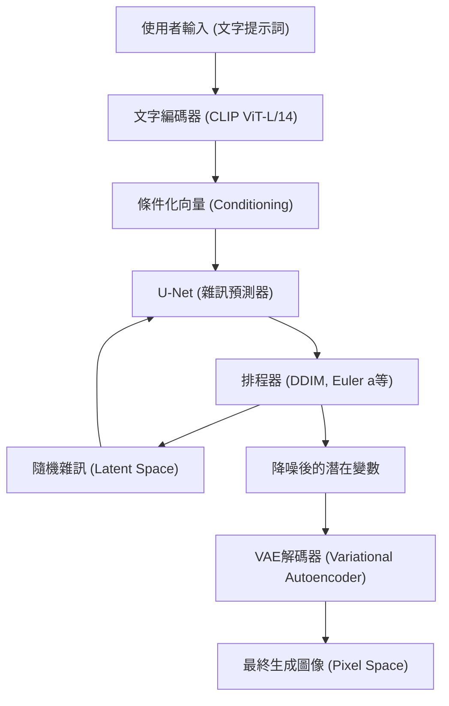
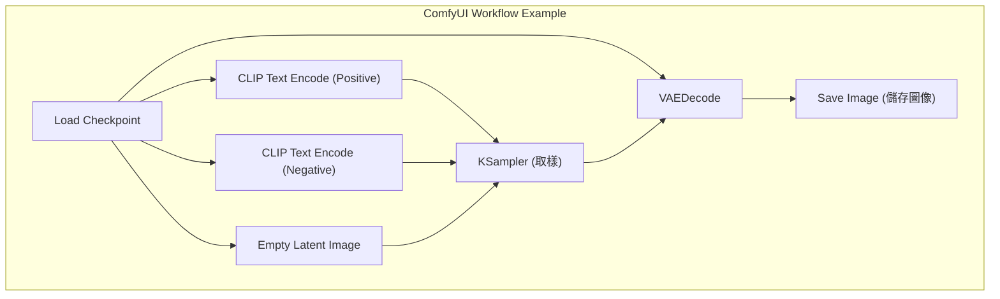

## 1. 前言：為什麼要在本機環境進行AI圖像生成？

AI圖像生成技術以Stable Diffusion的開源為開端，實現了爆發性的進化。目前，Midjourney、DALL-E 3、Adobe Firefly等雲端商用服務也變得非常強大且易於使用。然而，這些服務存在著因使用條款對生成內容的限制（如NSFW過濾器）、訂閱制帶來的持續成本，以及無法詳細控制生成過程等缺點。

在本機環境（自己的PC）建置AI圖像生成工具，具有以下壓倒性的優勢。

1. **完全的自由與無限制的生成**：沒有生成數量的限制或額外成本，只要本機資源允許，就能無限量地生成圖像。
2. **高度的可客製化性**：利用LoRA（Low-Rank Adaptation）或ControlNet可進行詳細的構圖控制，並重現特定的角色或畫風。
3. **隱私與安全性**：因為不會將資料傳送到雲端，最適合機密性高的設計業務或個人專案。
4. **即時導入最新技術**：可以搶先體驗開源社群每天發表的最新模型與擴充功能。

本手冊以Windows環境為前提，從目前主流的3個AI圖像生成環境（AUTOMATIC1111 Stable Diffusion WebUI、ComfyUI、Fooocus）的建置方法，到作為基礎的數學背景，乃至於VRAM的最佳化手法，以超過10,000字的篇幅為您進行徹底解說。

---

## 2. 擴散模型（Diffusion Model）的數學背景與架構

為了建置本機環境並適當地設定參數，理解如Stable Diffusion等**潛在擴散模型（Latent Diffusion Model: LDM）**是如何運作的，將會非常有幫助。

### 2.1 雜訊添加過程（Forward Process）與去除過程（Reverse Process）

擴散模型的基本原理，是由對原始資料（圖像）階段性地加入高斯雜訊，最終使其變成完全雜訊的「Forward Process」，以及從該雜訊復原出原始圖像的「Reverse Process」所組成。

Forward Process 被定義為馬可夫鏈，在步驟 $t$ 的狀態 $x_t$ 可以用以下公式表示：

$$ q(x_t | x_{t-1}) = \mathcal{N}(x_t; \sqrt{1 - \beta_t} x_{t-1}, \beta_t I) $$

透過使用重參數化技巧（Reparameterization trick），可以直接從初始狀態 $x_0$ 計算出任意步驟 $t$ 的狀態。

$$ x_t = \sqrt{\bar{\alpha}_t} x_0 + \sqrt{1 - \bar{\alpha}_t} \epsilon $$

這裡 $\alpha_t = 1 - \beta_t$、$\bar{\alpha}_t = \prod_{s=1}^t \alpha_s$，且 $\epsilon \sim \mathcal{N}(0, I)$ 是從標準常態分佈中抽樣出的雜訊。

在作為圖像生成階段的 Reverse Process 中，會使用神經網路（U-Net）$\epsilon_\theta$ 來預測並去除被加入的雜訊。損失函數會簡化成如下形式：

$$ L_{simple} = \mathbb{E}_{x_0, \epsilon \sim \mathcal{N}(0, I), t} \left[ || \epsilon - \epsilon_\theta(\sqrt{\bar{\alpha}_t} x_0 + \sqrt{1 - \bar{\alpha}_t} \epsilon, t) ||^2 \right] $$

### 2.2 透過 Latent Space（潛在空間）減少運算量

如果在像素空間（Pixel Space）中直接進行雜訊去除，運算量會隨著圖像解析度的平方而增加，因此會變成非常繁重的處理。Stable Diffusion 則是使用**VAE（變分自編碼器：Variational Autoencoder）**，將圖像轉換成被壓縮的「潛在空間（Latent Space）」後再進行處理。

編碼器 $E$ 會將解析度為 $H \times W \times 3$ 的圖像壓縮為 $z \in \mathbb{R}^{H/8 \times W/8 \times 4}$。由於空間維度變成了八分之一，自注意力機制（Self-Attention）的運算量變成了 $\mathcal{O}((\frac{H \times W}{64})^2)$，帶來了戲劇性的效能提升。生成後則會藉由解碼器 $D$ 以 $\tilde{x} = D(z)$ 的方式復原回像素空間。

### 2.3 Stable Diffusion 的系統架構

以下的 Mermaid 圖表展示了 Stable Diffusion 整體的生成過程（從文字生成圖像：txt2img）。



---

## 3. 硬體需求徹底剖析

在本機AI圖像生成中，硬體的選擇是最重要的。

### 3.1 GPU（顯示卡）
這是AI處理的心臟部位。如果在Windows環境下運行Stable Diffusion，NVIDIA製的GPU是事實上的標準（De facto standard）。雖然使用AMD的Radeon也可以透過ROCm來運行，但考量到在Windows上建置環境的難易度，以及許多擴充功能都依賴於CUDA（NVIDIA的平行運算架構），可以毫不誇張地說NVIDIA是唯一選擇。

*   **最低需求**：VRAM 6GB（如 GTX 1060 6GB / RTX 2060 等）。※但在解析度與功能上會有很大限制。
*   **推薦需求**：VRAM 12GB（如 RTX 3060 12GB / RTX 4070 等）。這是能流暢運行 SDXL 模型的底線。
*   **理想需求**：VRAM 16GB〜24GB（RTX 4080 / RTX 3090 / RTX 4090）。在進行高解析度生成、同時使用複雜的 ControlNet，或是在本機進行模型訓練（如 LoRA 等）時會需要。

### 3.2 記憶體（RAM）與儲存空間
*   **RAM**：強烈建議32GB以上。將模型（數GB至數十GB）從儲存空間傳輸到VRAM時，會暫時使用系統RAM。如果RAM不足，系統會使用分頁檔，導致致命的速度下降。
*   **儲存空間**：必備NVMe M.2 SSD。現今的AI模型（Checkpoints）每一個容量都在2GB到7GB左右。如果使用HDD，光是讀取模型就會花上數分鐘，因此並不實用。

---

## 4. 基礎軟體設定 (Windows篇)

在安裝工具本體之前，先準備好所需的基礎軟體。

### 4.1 Python 的安裝
大部分的AI工具都是用Python撰寫的。請安裝與Stable Diffusion WebUI等相容性最高的 **Python 3.10.6**（如果版本太新，可能會導致PyTorch等依賴關係損壞）。

1.  從 Python 官方檔案庫下載 `python-3.10.6-amd64.exe`。
2.  啟動安裝程式時，務必勾選最下方的 **"Add Python 3.10 to PATH"**。
3.  在安裝完成畫面中點擊 **"Disable path length limit"**（停用路徑長度限制）。（重要：如果不解除 Windows 的 260 個字元路徑限制，在較深層的依賴函式庫中會發生錯誤）。

### 4.2 Git for Windows 的安裝
為了從 GitHub 取得原始碼或模型，會需要 Git。
1.  從 Git for Windows 官方網站下載安裝程式，並以全部預設的設定進行安裝。

### 4.3 CUDA Toolkit 與 cuDNN 的設定
由於最新的 PyTorch 在安裝時會內含下載所需的 CUDA 二進位檔案，因此不再必須於整個系統中安裝 CUDA Toolkit。然而，如果要利用自訂擴充功能（如 TensorRT 或 xFormers 的建置），建議從 NVIDIA 官方安裝 **CUDA Toolkit 11.8** 或 **12.1**（配合所使用的 PyTorch 版本）。

---

## 5. 3大前端建置步驟

以下解說目前主流的三個AI圖像生成工具的建置方法。請依照目的與技能來選擇使用。

### 5.1 AUTOMATIC1111 Stable Diffusion WebUI 的建置
這是歷史最悠久、擴充功能最豐富，且能夠進行細微參數調整的萬能工具。

**安裝步驟：**
1.  在任意目錄（例如：`C:\work\ai`）下開啟命令提示字元。
2.  執行以下命令來複製（Clone）儲存庫：
    ```cmd
    git clone https://github.com/AUTOMATIC1111/stable-diffusion-webui.git
    ```
3.  在複製下來的目錄中，對 `webui-user.bat` 點擊右鍵，並以編輯模式開啟。
4.  為了提升效能，將啟動引數 `COMMANDLINE_ARGS` 設定如下：
    ```bat
    set COMMANDLINE_ARGS=--xformers --opt-sdp-attention --theme dark
    ```
5.  連按兩下 `webui-user.bat` 來執行。由於首次執行會下載 PyTorch 等巨大的函式庫，根據環境不同可能會需要數十分鐘。
6.  完成後會顯示 `Running on local URL: http://127.0.0.1:7860`，接著請用瀏覽器進行存取。

### 5.2 ComfyUI 的建置與節點式架構的優勢
ComfyUI 是一種將生成過程透過被稱為「節點」的區塊視覺化連接起來的（Node-based）UI。它對 VRAM 的管理極其優秀，經常能在 AUTOMATIC1111 會發生記憶體不足的環境下順利運行。



**安裝步驟：**
1.  從 ComfyUI 的官方 GitHub 發布頁面，下載 Windows Standalone 版的 7z 檔案。
2.  解壓縮後，只要執行裡面的 `run_nvidia_gpu.bat` 即可啟動（因為是內含 Python 的可攜式版本，所以不需設定）。
3.  **導入 ComfyUI Manager**：這是管理擴充功能的必備工具。在 `ComfyUI/custom_nodes/` 目錄下開啟命令提示字元，並執行以下命令：
    ```cmd
    git clone https://github.com/ltdrdata/ComfyUI-Manager.git
    ```
    重新啟動後，UI 右下角會出現「Manager」按鈕，從這裡就可以安裝各種自訂節點。

### 5.3 Fooocus 的建置：適合初學者的高畫質生成
Fooocus 是一個為了達成如同 Midjourney 般「即使提示詞很短，也能產出壓倒性美麗的圖像」為目標而打造的 UI。它是專門針對 SDXL 模型進行調校的，會在內部自動執行基於 GPT-2 的提示詞擴充與複雜的管線處理。

**安裝步驟：**
1.  從 Fooocus 官方 GitHub 下載 Windows 用的發布包並解壓縮。
2.  執行 `run.bat`。系統會自動下載如 Juggernaut XL 等優秀的 SDXL 模型，並立刻進入可開始高畫質生成的狀態。
3.  只要勾選「Advanced」，就可以使用 Image Prompt（圖像提示詞）或 Inpainting（局部重繪）等進階功能。

---

## 6. 模型管理與資料結構的理解

AI圖像生成的品質，完全取決於所使用的模型（已訓練好的資料）。

### 6.1 Checkpoints (Base Models)
這是做為圖像生成核心的主模型。以前主要使用 `.ckpt`（Pickle格式），但這包含了能夠執行任意 Python 程式碼的漏洞（任意程式碼執行：Arbitrary Code Execution）。現在則是以能確保安全性，且允許從磁碟零拷貝載入（mmap）到記憶體中的 **`.safetensors`** 格式為標準。請絕對不要下載來歷不明的 `.ckpt` 檔案。

### 6.2 LoRA (Low-Rank Adaptation) 的數學行為
LoRA 是一項可以避開對完整模型進行微調（Fine-tuning）所需龐大運算資源，針對特定角色或畫風進行額外訓練的技術。

與其直接更新擁有數十億參數的權重矩陣 $W_0 \in \mathbb{R}^{d \times k}$，LoRA 引入了兩個低秩矩陣 $A \in \mathbb{R}^{r \times k}$ 和 $B \in \mathbb{R}^{d \times r}$（秩 $r \ll \min(d, k)$）。新的權重計算方式如下：

$$ W = W_0 + \Delta W = W_0 + B A $$

這使得需要訓練與保存的參數數量從 $d \times k$ 銳減至 $r \times (d + k)$，只需幾百MB的輕量化檔案就能進行強大的風格套用。

### 6.3 VAE (Variational Autoencoder)
如前所述，這是在潛在空間與像素空間之間進行轉換的模型。在動漫系模型中，如果沒有正確設定 VAE，可能會輸出整體偏白、對比度較低、看起來霧濛濛的圖像。請將如 `kl-f8-anime2.ckpt` 等動漫專用 VAE 放置於 `models/VAE` 資料夾中並加以套用。

### 6.4 目錄結構範例 (AUTOMATIC1111)
```text
stable-diffusion-webui/
├── models/
│   ├── Stable-diffusion/  <-- 放置 Checkpoints (.safetensors)
│   ├── Lora/              <-- 放置 LoRA 模型
│   ├── VAE/               <-- 放置 VAE 模型
│   └── ControlNet/        <-- 放置 ControlNet 用模型
├── embeddings/            <-- 放置 Textual Inversion (PT檔案)
├── extensions/            <-- Git Clone下來的擴充功能群
└── webui-user.bat         <-- 啟動用批次檔
```

---

## 7. VRAM最佳化與效能調校

這是用來迴避本機生成時最大障礙「VRAM不足（CUDA Out Of Memory）」，並將生成速度提升到極限的技術。

### 7.1 Attention 機制的最佳化（xFormers / SDP Attention）
Stable Diffusion 的運算大部分都花在 U-Net 內的 Cross-Attention。由於預設的 Attention 運算會消耗大量記憶體，可以透過以下方法進行最佳化。

*   **xFormers (`--xformers`)**：Meta 開發的高記憶體效率 Attention 實作（Memory Efficient Attention）。它能大幅減少 VRAM 消耗並提升速度，但由於運算的非決定性，具有「即使給定完全相同的種子值（Seed），也會生成出微妙不同的圖像」的特徵。
*   **SDP Attention (`--opt-sdp-attention`)**：從 PyTorch 2.0 開始標配的 Scaled Dot Product Attention。擁有與 xFormers 同等的速度與 VRAM 減少效果，且優點是依賴關係較少。也有如 `--opt-sub-quad-attention` 等沒有非決定性的變體。

### 7.2 節省 VRAM 的啟動選項
*   `--medvram`：針對 VRAM 在 6GB〜8GB 的環境。會將 U-Net 分割處理來節省記憶體，但速度會稍微下降。
*   `--lowvram`：針對 VRAM 在 4GB 以下的環境。會頻繁地將模組移入和移出 VRAM，因此速度會急遽下降，但能強制運行。
*   `--medvram-sdxl`：只有在使用 SDXL 模型時才會套用 MedVRAM，是一個非常方便的旗標。

### 7.3 透過 TensorRT 達成超高速化
將 NVIDIA GPU 的 Tensor 核心發揮到極限的框架就是 **TensorRT**。
它能將 Stable Diffusion 的 U-Net 編譯成專屬目前使用 GPU 的引擎（`.trt` 檔案）。雖然編譯需要花上數十分鐘，且具有解析度與批次大小會被固定住的缺點（雖然也支援 Dynamic Shape 但效率會下降），但生成速度會暴增至 **1.5倍〜2倍以上**。在需要大量生成相同解析度圖像的業務用途中，這是最強的最佳化手法。

### 7.4 Tiled VAE / Tiled Diffusion
在生成或放大至高解析度（如 4K）圖像時，VAE 的解碼處理會瞬間耗盡 VRAM。為了防止這個情況，必須使用能將圖像分割成拼貼狀（例如每塊 $512 \times 512$）進行處理，最後再合併起來的擴充功能（Multidiffusion / Tiled VAE）。

---

## 8. 進階控制技術：ControlNet

光靠文字提示詞，是無法指定角色的姿勢、複雜的透視角度，或指尖細微的動作。用來解決這個問題的就是 **ControlNet**。

ControlNet 的架構是保持已經訓練好的 Stable Diffusion 模型的權重固定不變，複製編碼器的結構，並在其中插入「Zero-convolutions（權重初始化為零的卷積層）」。這樣一來，就能在不破壞原本生成能力的情況下，進行額外的條件控制。

**具代表性的預處理器與模型：**
*   **OpenPose**：提取人物骨架（關節位置），生成姿勢完全相同的圖像。
*   **Canny**：進行邊緣偵測，以線稿為基礎進行上色或寫實化。
*   **Depth**：生成深度圖（Depth Map），產生維持空間前後關係的圖像。
*   **Lineart**：在提取動漫風格的線稿方面，表現比 Canny 更好。

透過同時套用多個上述的 ControlNet（Multi-ControlNet），就能確實輸出「符合指定姿勢，且帶有指定背景透視的圖像」。

---

## 9. 疑難排解（FAQ）

以下是本機環境建置與運行時頻繁出現的錯誤及其解決方案。

### Q1. 出現 `CUDA out of memory.` 的錯誤且生成停止。
**A1：** VRAM 不足。請降低生成解析度，或將批次大小（Batch size）設為 1。另外，如果是 A1111，請在 `webui-user.bat` 中加入 `--xformers` 與 `--medvram` 後重新啟動。如果進行高解析度化（Hires. fix），在放大演算法（Upscaler）使用如 R-ESRGAN 等 ESRGAN 系統而非 Latent 系統，可以抑制 VRAM 的消耗。

### Q2. 生成出來的圖像全黑，或是充滿雜訊。
**A2：** 這是在運算過程中產生了 NaN（Not a Number）值，導致張量（Tensor）崩壞的現象。請進行以下處理：
1. 在啟動選項中加入 `--no-half-vae`，讓 VAE 單獨以單精度（FP32）進行運算。
2. 在啟動選項中加入 `--disable-nan-check`（這不是根本的解決方案）。
3. 由於所使用的模型（特別是 SD 2.1 系列）可能不適合使用 FP16 進行運算，請嘗試使用全精度模式。

### Q3. 啟মাদের啟動 `webui-user.bat` 時出現 Python 錯誤或 Git 錯誤。
**A3：** 懷疑是依賴函式庫不一致。請將 WebUI 目錄內的 `venv` 資料夾完全刪除，然後再次執行 `webui-user.bat`。這會在乾淨的狀態下重建虛擬環境（會需要重新下載數GB的資料）。

### Q4. 下載了模型（Safetensors）卻沒有顯示在列表中。
**A4：** 請確保將其放置在 `models/Stable-diffusion` 資料夾內，並按下 UI 上 Checkpoint 選擇下拉選單旁邊的「重新整理（更新）」按鈕。如果將其放在子資料夾中，請確認副檔名是否正確。

---

## 10. 結語：AI圖像生成的未來與本機環境的優勢

從 Stable Diffusion 開始的開源 AI 圖像生成運動，正持續向 SDXL，以及 Stable Diffusion 3、Flux.1 等次世代架構進化。模型的參數數量已從數十億巨大化至百億等級，未來對於具備 24GB 以上 VRAM 的 GPU 環境的需求將會更加迫切。

然而，TensorRT、量化技術（Quantization）、GGUF等本機最佳化技術也同樣在加快進化速度，一個能讓一般消費者級別的硬體也能進行充分推論的生態系統正在形成中。

本手冊所解說的 CUDA 環境建置、VRAM 的最佳化，以及對 ComfyUI 等管線的理解，將成為無論 AI 技術趨勢如何變化都能適用的普遍基礎知識。希望大家的創造力，都能在毫無限制的本機環境中發揮到極致。
