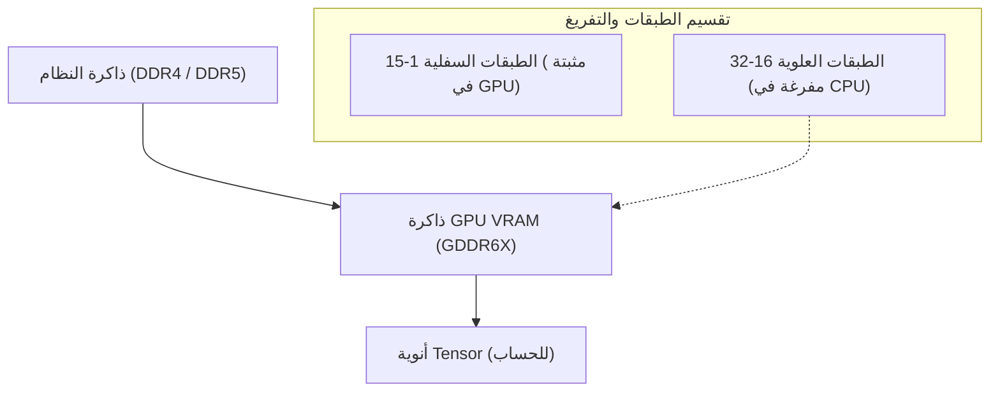
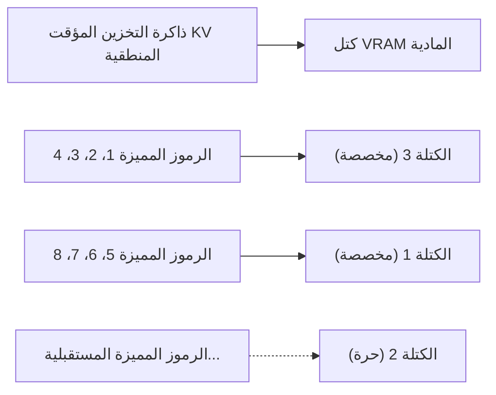
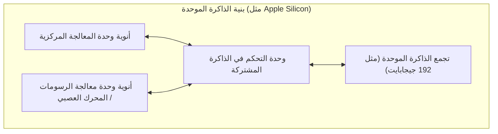
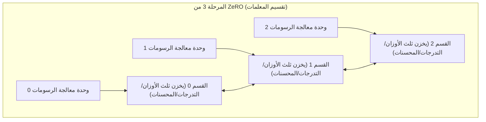

# مقدمة: تطوير الذكاء الاصطناعي و"جدار VRAM"

في السنوات الأخيرة، شهدت تقنيات الذكاء الاصطناعي التوليدي مثل النماذج اللغوية الكبيرة (LLMs) ونماذج الانتشار (Diffusion Models) تطوراً سريعاً. ومع ذلك، عندما يحاول العديد من المطورين والباحثين تدريب (الضبط الدقيق) أو تنفيذ الاستنتاج (Inference) لهذه النماذج المتطورة للذكاء الاصطناعي في بيئة محلية، فإنهم يواجهون عائقاً مادياً كبيراً وهو **"نقص ذاكرة GPU (VRAM)"**.

حتى وحدات معالجة الرسومات المخصصة للمستهلكين المتطورة مثل NVIDIA GeForce RTX 4090 تحتوي على ذاكرة VRAM بحد أقصى 24 جيجابايت، ومن المستحيل تماماً تحميل نموذج ضخم مثل Llama 3 70B كما هو. وحدات معالجة الرسومات المخصصة لمراكز البيانات مثل H100 (80 غيغابايت) و B200 (192 غيغابايت) باهظة الثمن للغاية، وليست شيئًا يمكن للأفراد أو الفرق الصغيرة استخدامه بسهولة. إذا لم تتمكن من اختراق "جدار VRAM (The Wall of VRAM)" هذا، فلن تتمكن حتى من لمس أحدث النماذج.

تشرح هذه المقالة بعمق التقنيات المتقدمة من كل من الاستنتاج والتدريب لكسر هذا القيد المادي المتمثل في حدود VRAM من خلال ابتكارات في بنية البرامج والأجهزة. دعونا نتعمق مع المعادلات الرياضية والرسوم البيانية لتوضيح تفريغ وحدة المعالجة المركزية (CPU Offloading)، وتحسين ذاكرة التخزين المؤقت KV، ونقاط فحص التدرج (Gradient Checkpointing)، وحتى أحدث بنى الذاكرة الموحدة (Unified Memory). بقراءة هذه المقالة، ستفهم بعمق سلوك VRAM وتكتسب المعرفة العملية للتعامل مع النماذج الضخمة بموارد محدودة.

---

# 1. تشريح استهلاك ذاكرة VRAM لنماذج الذكاء الاصطناعي (الاستنتاج والتدريب)

الخطوة الأولى لحل نقص VRAM هي الفهم الدقيق لـ "ما الذي" يستهلك "كم" من الذاكرة من منظور دقيق (Micro). بدلاً من التعامل معه كصندوق أسود، إذا تمكنا من تقديره بدقة باستخدام المعادلات الرياضية، فيمكننا اختيار طريقة التحسين المناسبة.

## 1.1 حساب الذاكرة لمعلمات النموذج (الأوزان)

يتم تحديد كمية الذاكرة الأساسية التي تستهلكها المعلمات (الأوزان) التي يتكون منها نموذج الذكاء الاصطناعي من خلال العدد الإجمالي للمعلمات في النموذج ونوع البيانات (الدقة: Precision) المستخدمة لتمثيلها.

فيما يلي أنواع البيانات المستخدمة بشكل شائع في التعلم العميق وعدد البايتات لكل معلمة ($B$):
- **FP32 (رقم الفاصلة العائمة أحادي الدقة):** 4 بايت (الدقة القياسية للتدريب)
- **FP16 / BF16 (رقم الفاصلة العائمة نصف الدقة):** 2 بايت (للاستنتاج العام والتدريب بدقة مختلطة)
- **INT8 (عدد صحيح 8 بت):** 1 بايت (النماذج المكممة)
- **INT4 (تكميم عدد صحيح 4 بت):** 0.5 بايت (تكميم شديد مثل GPTQ و AWQ و GGUF)

بافتراض أن إجمالي عدد المعلمات للنموذج هو $P$، فإن كمية الذاكرة الأساسية $M_{weights}$ التي تشغلها الأوزان نفسها يُعبر عنها بالمعادلة التالية:

$$ M_{weights} = P \times B $$

على سبيل المثال، إذا قمت بتحميل نموذج "Llama 3 8B" (حوالي 8 مليار معلمة) الذي أصدرته Meta بتنسيق FP16 (نصف الدقة)، فسيكون الحساب كالتالي:

$$ M_{weights} = 8,000,000,000 \times 2 \text{ bytes} \approx 16,000,000,000 \text{ bytes} \approx 16 \text{ GB} $$

بمعنى آخر، مجرد تحميل أوزان النموذج على وحدة معالجة الرسومات (GPU) يستهلك 16 جيجابايت من VRAM. في RTX 3060 (12 جيجابايت)، سيحدث خطأ نفاد الذاكرة (OOM) في هذه المرحلة. ومع ذلك، إذا قمت بتكميم النموذج إلى INT4، فسيصبح $8 \times 0.5 = 4 \text{ GB}$، وسيكون تحميله سهلاً.

## 1.2 استهلاك الذاكرة أثناء الاستنتاج: زيادة ذاكرة التخزين المؤقت KV

في استنتاج LLM (خاصةً توليد النص الانحداري التلقائي)، ما يضغط بشكل كبير على VRAM بقدر الأوزان أو أكثر هو **ذاكرة التخزين المؤقت KV (Key-Value Cache)**.
في بنية Transformer، من أجل منع إعادة حساب معلومات الرموز المميزة التي تم إنشاؤها ومعالجتها في الماضي، يستمر التخزين المؤقت لموترات المفتاح (Key) والقيمة (Value) في كل طبقة انتباه (Attention layer) في VRAM. يؤدي هذا إلى تحسين سرعة الحساب (Compute)، ولكن مع زيادة طول السياق (طول موجه الإدخال + طول التوليد)، ينفجر استهلاك الذاكرة بشكل خطي.

يتم حساب كمية ذاكرة التخزين المؤقت KV $M_{kv\_token}$ المستهلكة عند معالجة رمز مميز واحد بدقة بناءً على بنية النموذج بالمعادلة التالية:

$$ M_{kv\_token} = 2 \times N_{layers} \times N_{heads\_kv} \times D_{head} \times B $$

هنا، كل متغير له المعنى التالي:
- $2$ : لوجود موترين للمفتاح (Key) والقيمة (Value)
- $N_{layers}$ : عدد طبقات (Layers) الـ Transformer
- $N_{heads\_kv}$ : عدد رؤوس انتباه KV (في حالة GQA: Grouped Query Attention سيكون أقل من عدد الرؤوس العادية)
- $D_{head}$ : أبعاد كل رأس (عادةً، أبعاد الطبقة المخفية $D_{model} / N_{heads}$)
- $B$ : عدد البايتات لنوع البيانات (2 في حالة FP16)

الكمية الإجمالية لذاكرة التخزين المؤقت KV $M_{kv\_total}$ هي ناتج ضرب هذا في طول التسلسل ($L_{seq}$) وحجم الدفعة ($BatchSize$).

$$ M_{kv\_total} = M_{kv\_token} \times L_{seq} \times BatchSize $$

**مثال محدد: في حالة Llama 2 7B**
- $N_{layers} = 32$
- $N_{heads\_kv} = 32$ (في حالة MHA)
- $D_{head} = 128$
- FP16 ($B=2$)
- حجم الدفعة 1، طول التسلسل 8192 (سياق 8K)

$$ M_{kv\_total} = 2 \times 32 \times 32 \times 128 \times 2 \times 8192 \times 1 = 4,294,967,296 \text{ bytes} \approx 4 \text{ GB} $$

إذا تم تمديد السياق إلى 32K (32768 رمز مميز)، فإن ذاكرة التخزين المؤقت KV وحدها تستهلك حوالي 16 جيجابايت. إذا تمت زيادة حجم الدفعة إلى 4، فسيصبح 64 جيجابايت. التحدي الكبير أثناء الاستنتاج هو أنه سيتطلب VRAM أضخم بكثير من حجم النموذج نفسه.

## 1.3 استهلاك الذاكرة أثناء التدريب: المحسنات والتدرجات وعمليات التنشيط

مقارنةً بوقت الاستنتاج، يستهلك تدريب النموذج (التدريب المسبق والضبط الدقيق) ذاكرة VRAM أكثر بكثير. هذا لأنه ليس فقط التمرير الأمامي (Forward pass) البسيط ضروريًا، ولكن من الضروري أيضًا الاحتفاظ بالمعلومات من أجل الانتشار الخلفي (Backpropagation). تتكون الذاكرة أثناء التدريب بشكل أساسي من العناصر الأربعة التالية:

1. **أوزان النموذج (Model Weights):** كما هو الحال في الاستنتاج، ولكن في التدريب ذي الدقة المختلطة، قد يتم الاحتفاظ بكل من FP16 و FP32 (الأوزان الرئيسية).
2. **التدرجات (Gradients):** التدرجات لكل معلمة محسوبة في الانتشار الخلفي. 2 بايت لكل معلمة لـ FP16.
3. **حالات المحسن (Optimizer States):** تحتفظ المحسنات المتقدمة مثل AdamW بالعزم الأول (Momentum) والعزم الثاني (Variance) لكل معلمة. للحفاظ على استقرار التدريب، يتم الاحتفاظ بها عادةً في FP32 (4 بايت). هذا يعني أن العزمين يستهلكان $4 + 4 = 8$ بايت/معلمة.
4. **عمليات التنشيط (Activations):** لحساب التدرج للانتشار الخلفي، يجب الاحتفاظ بمخرجات (الحالات الوسيطة) لكل طبقة أثناء التمرير الأمامي في الذاكرة. هذا يعتمد بشكل كبير على حجم الدفعة وطول التسلسل ويصبح ضخماً للغاية.

باختصار، في التدريب ذي الدقة المختلطة (Mixed Precision Training) باستخدام محسن Adam القياسي، هناك حاجة إلى **حوالي 16 إلى 20 بايت** (4 للأوزان الرئيسية + 2 لوزن FP16 + 2 للتدرج + 8 للمحسن + α) من الذاكرة لكل معلمة.

$$ M_{train\_param} \approx P \times 16 \text{ bytes} $$

لتدريب نموذج 7B (7 مليار معلمة)، فإنه يستهلك $7B \times 16 = 112 \text{ GB}$ للمعلمات فقط، بالإضافة إلى عمليات التنشيط، مما يعني أنه سيحتاج إلى أكثر من 140 جيجابايت من VRAM. لتنفيذ هذا على 24 جيجابايت VRAM، فإن تقنيات التحسين القوية الموضحة في الفصول التالية لا غنى عنها.

---

# 2. تقنيات توفير VRAM أثناء الاستنتاج

كمقاربات لتشغيل نماذج ضخمة أثناء الاستنتاج، تم تطوير العديد من تقنيات البرمجيات التي تتجاوز حدود الأجهزة.

## 2.1 تفريغ وحدة المعالجة المركزية (CPU Offloading) وتقسيم الطبقات

عندما لا يتناسب نموذج ضخم مع وحدة أو أكثر من وحدات GPU، فإن تقنية وضع جزء من النموذج في ذاكرة النظام (CPU RAM) ونقله إلى GPU فقط عند الحاجة أثناء الحساب تسمى **تفريغ وحدة المعالجة المركزية (CPU Offloading)**. أدوات مثل `llama.cpp` و `Accelerate` من Hugging Face تدعم هذه الوظيفة.



**الآلية والتحديات:**
نظراً لأن نماذج Transformer لها بنية تتراكم فيها الطبقات (Layers) بشكل متسلسل، فإن حساب الطبقة التالية لا يبدأ حتى يكتمل حساب طبقة معينة. مستفيدين من ذلك، يتم الاحتفاظ (تثبيت) بالطبقات التي تتناسب مع وحدة معالجة الرسومات (مثال: الطبقات من 1 إلى 15) في VRAM، ويتم وضع الطبقات المتبقية (من 16 إلى 32) في ذاكرة وصول عشوائي (CPU RAM) ذات سعة كبيرة ولكن بطيئة. أثناء الاستنتاج، عندما يكتمل الحساب حتى الطبقة 15، يتم نقل (نسخ) أوزان الطبقة 16 من وحدة المعالجة المركزية إلى وحدة معالجة الرسومات عبر ناقل PCIe، ويتم إجراء الحساب على وحدة معالجة الرسومات.

ومع ذلك، يصبح **عرض النطاق الترددي لـ PCIe (Bandwidth) عنق زجاجة شديد**. يبلغ الحد الأقصى النظري لعرض النطاق الترددي لـ PCIe 4.0 x16 حوالي 32 جيجابايت/ثانية (في اتجاه واحد)، ولكن مقارنة بعرض النطاق الترددي الداخلي لـ VRAM لأحدث وحدات معالجة الرسومات (على سبيل المثال، GDDR6X في RTX 4090 هو 1008 جيجابايت/ثانية، و HBM3 في H100 هو 3 تيرابايت/ثانية أو أكثر)، فهو أبطأ بمرتبتين من الحجم، لذلك إذا تم استخدام تفريغ CPU بكثرة، فستنخفض سرعة الاستنتاج (Tokens per Second) بشكل كبير.
لتقليل تدهور السرعة إلى الحد الأدنى، تتمثل النقطة العملية في تحميل أكبر عدد ممكن من الطبقات على وحدة معالجة الرسومات (زيادة طبقات GPU) وتقليل الطبقات المفرغة إلى الحد الأدنى.

## 2.2 تكميم ذاكرة التخزين المؤقت KV و PagedAttention

بالنسبة لذاكرة التخزين المؤقت KV، والتي تعد السبب الرئيسي لاستهلاك VRAM أثناء الاستنتاج، يتم أيضاً استخدام نوعين من التحسينات القوية.

**1. تكميم ذاكرة التخزين المؤقت KV (KV Cache Quantization):**
هذه تقنية لا تكمم أوزان النموذج فحسب، بل تُكمم أيضاً ذاكرة التخزين المؤقت KV التي يتم إنشاؤها ديناميكياً أثناء التنفيذ إلى INT8 أو INT4 أو حتى FP8 وحفظها في VRAM. هذا يقلل من حجم ذاكرة التخزين المؤقت KV بمقدار النصف إلى الربع. تدمج محركات الاستنتاج الحديثة (vLLM و llama.cpp) هذه الميزة، مما يحقق وفورات كبيرة في VRAM مع تقليل تدهور الدقة إلى الحد الأدنى.

**2. PagedAttention:**
يتم تطبيق مفهوم "الترحيل" (Paging) في الذاكرة الافتراضية لنظام التشغيل على ذاكرة التخزين المؤقت KV، وهو ما يُعرف باسم **PagedAttention** والذي تم تقديمه في محرك الاستنتاج vLLM. في محركات الاستنتاج التقليدية، يتم حجز (Pre-allocation) مناطق VRAM متجاورة مسبقاً وفقاً لأقصى طول تسلسل محدد. لذلك، إذا كان الإدخال الفعلي قصيراً، فسيحدث تجزئة (Fragmentation) وإهدار للذاكرة غير المستخدمة، وقد يتم إهدار أكثر من 60٪ من VRAM.

يقسم PagedAttention ذاكرة التخزين المؤقت KV إلى كتل (صفحات) ذات حجم ثابت ويسمح بتوزيعها وتخزينها في مساحة ذاكرة فعلية غير متجاورة. يتيح ذلك تقليل إهدار الذاكرة إلى الصفر تقريباً (يقتصر على التجزئة الداخلية فقط)، ويمكن زيادة حجم الدفعة بشكل كبير باستخدام نفس سعة VRAM.



## 2.3 FlashAttention: كسر تعقيد الذاكرة في حساب الانتباه

ينجم نقص VRAM ليس فقط عن كمية الذاكرة لتخزين البيانات، ولكن أيضاً عن نقص "مساحة العمل المؤقتة" أثناء الحساب. تحتاج آلية الانتباه الذاتي (Self-Attention) في Transformer القياسي إلى تجسيد (Materialize) مصفوفة انتباه ضخمة بحجم $N \times N$ لطول التسلسل $N$ على VRAM. هذا يؤدي إلى تعقيد في الذاكرة قدره $O(N^2)$، وهو السبب الرئيسي لـ OOM في السياقات الطويلة.

تم حل هذه المشكلة بواسطة **FlashAttention** (و FlashAttention-2, 3).
FlashAttention عبارة عن خوارزمية تدرك بنية أجهزة GPU (الهيكل الهرمي لـ HBM الضخم ولكن البطيء، و SRAM الصغير جداً ولكنه فائق السرعة). باستخدام تقنية تسمى التجانب (Tiling)، يتم تحميل البيانات في SRAM كتلة بكتلة ويتم إكمال حساب الانتباه هناك، متجنباً تماماً عملية كتابة مصفوفة $N \times N$ إلى HBM (VRAM).

ونتيجة لذلك، انخفض تعقيد الذاكرة لطبقة الانتباه بشكل كبير من $O(N^2)$ إلى $O(N)$ (يتناسب مع طول التسلسل)، وتخفف بشكل كبير قيود طول السياق.

## 2.4 ظهور الذاكرة الموحدة (Unified Memory) و Apple Silicon

تتعامل بنية أجهزة الكمبيوتر التي تتبنى **بنية الذاكرة الموحدة (Unified Memory Architecture: UMA)**، مثل Apple Silicon (سلسلة M1/M2/M3/M4 بإصدارات Max أو Ultra) وبعض أحدث وحدات APU (مثل AMD Strix Point)، مع هذه المشكلة من الجذور.

في هذه البنى، تشترك وحدة المعالجة المركزية (CPU) ووحدة معالجة الرسومات (GPU) الموجودة على اللوحة الأم في نفس الذاكرة الفعلية تماماً (على سبيل المثال، LPDDR5 حتى 192 جيجابايت). لذلك، لا يوجد مفهوم "النقل البطيء للبيانات من وحدة المعالجة المركزية إلى وحدة معالجة الرسومات عبر PCIe" من الناحية المادية.



الميزة الأكبر لهذه البنية هي عدم وجود جدار VRAM واضح، ويمكن استخدام منطقة ذاكرة النظام بأكملها تقريباً كما هي لتحميل LLMs الضخمة. مع Mac Studio بذاكرة موحدة تبلغ 192 جيجابايت، يمكن تحميل نماذج ضخمة من فئة 70B أو أكبر (مثل Grok-1) على جهاز واحد بدون تكميم واستنتاجها بسرعة. يصل النطاق الترددي للوصول إلى الذاكرة إلى 800 جيجابايت/ثانية في M2 Ultra، وهو ما يضاهي سرعة وحدات معالجة الرسومات المنفصلة للمستهلكين. إنه نهج قوي للغاية يحل معضلة "سعة الذاكرة" و "عرض النطاق الترددي" على مستوى الأجهزة.

---

# 3. تقنيات توفير VRAM أثناء التدريب (الضبط الدقيق)

هناك أيضاً العديد من الاختراقات في وقت التدريب (Training)، والذي يتطلب ذاكرة VRAM أكثر من الاستنتاج. لإجراء ضبط دقيق بموارد محدودة، من الضروري دمج التقنيات التالية.

## 3.1 نقاط فحص التدرج (Gradient Checkpointing)

في الانتشار الخلفي (Backpropagation) للتعلم العميق، لحساب التدرجات، يجب الاحتفاظ بالمخرجات الوسيطة (Activations) لجميع الطبقات في التمرير الأمامي (Forward pass) في الذاكرة. مع زيادة طول التسلسل أو حجم الدفعة، تبدأ ذاكرة التنشيط هذه في السيطرة على VRAM.

تعد **نقاط فحص التدرج (Gradient Checkpointing / Activation Recomputation)** تقنية عبقرية تستخدم المقايضة بين سعة الذاكرة ووقت الحساب (Compute).
بدلاً من حفظ جميع المخرجات الوسيطة في الذاكرة، فإنه يحفظ فقط مخرجات طبقات معينة (نقاط الفحص). عندما تكون القيمة الوسيطة التي لم يتم تعيين نقطة فحص لها مطلوبة أثناء الانتشار الخلفي، فإنه **يعيد حساب التمرير الأمامي (إعادة الحساب) من أقرب نقطة فحص محفوظة لاستعادة القيمة**.

يزداد مقدار الحساب بحوالي 20 إلى 30٪، ويصبح إجمالي وقت التدريب أطول، ولكن يمكن تقليل استهلاك VRAM بسبب عمليات التنشيط بشكل كبير من $O(N)$ ($N$ هو عدد الطبقات) إلى $O(\sqrt{N})$. في التدريب النموذجي واسع النطاق اليوم، يعد هذا إعداداً أساسياً لدرجة أنه لا يمكن البدء بدونه.

## 3.2 LoRA و QLoRA (التكيف منخفض الرتبة)

البطل الذي حل مشكلة نقص VRAM من جذورها هو **LoRA**، وهو ممثل لـ PEFT (الضبط الدقيق الفعال من حيث المعلمات Parameter-Efficient Fine-Tuning).

يتم تجميد (Frozen) مصفوفة الأوزان الضخمة الأصلية للنموذج $W_0 \in \mathbb{R}^{d \times k}$، ولا يتم تدريبها. بدلاً من ذلك، يتم تقديم مصفوفتين صغيرتين جداً منخفضتي الرتبة $A \in \mathbb{R}^{r \times k}$ و $B \in \mathbb{R}^{d \times r}$ بشكل متوازٍ، ويتم تدريب $A$ و $B$ فقط. (حيث تكون الرتبة $r$ قيمة صغيرة جداً بحيث $r \ll d, k$).

$$ W_{adapted} = W_0 + \Delta W = W_0 + B A $$

نتيجة لذلك، يصبح عدد المعلمات التي سيتم تدريبها أقل من 1٪ (وأحياناً أقل من 0.1٪) من الأصل، وبناءً على ذلك، تنخفض "التدرجات" و "حالات المحسن" التي كانت تلتهم الذاكرة إلى أقل من 1٪.

علاوة على ذلك، فإن **QLoRA (Quantized LoRA)** يأخذ هذا إلى أقصى حد.
في QLoRA، يتم تكميم الوزن الأساسي للنموذج $W_0$ إلى أقصى حد وهو 4 بت (تنسيق NF4: NormalFloat4) ويتم تحميله في VRAM. يتم تدريب المصفوفات الصغيرة لـ LoRA $A, B$ بـ BF16 (16 بت) للحفاظ على دقة الحساب.
مع تقليل حجم VRAM للنموذج الأساسي إلى الربع باستخدام تكميم 4 بت، تستخدم تقنية تسمى **المحسنات المُرحّلة (Paged Optimizers)** لإخلاء (تفريغ) حالة المحسن مؤقتاً وبشكل تلقائي إلى ذاكرة الوصول العشوائي (CPU RAM) عندما توشك VRAM على النفاد. وبفضل هذا، أصبح من الممكن إجراء ضبط دقيق لنماذج ضخمة للغاية مثل Llama 3 70B حتى على وحدة معالجة رسومات (GPU) واحدة بسعة 24 جيجابايت VRAM (مثل RTX 4090).

## 3.3 DeepSpeed ZeRO والتفريغ

في بيئة تستخدم وحدات معالجة رسومات متعددة (Multi-GPU)، فإن التوازي البسيط للبيانات (Data Parallelism) لا يحل مشكلة VRAM. وذلك لأن كل وحدة معالجة رسومات (GPU) تحتفظ بنسخة من النموذج بأكمله، لذلك لا يمكن تجاوز حدود سعة VRAM الفردية.

تعد تقنية **ZeRO (مُحسِّن التكرار الصفري Zero Redundancy Optimizer)** في مكتبة **DeepSpeed** التي طورتها Microsoft، تقنية لتقسيم (sharding) معلمات النموذج والتدرجات وحالات المحسن بشكل جذري عبر وحدات معالجة رسومات متعددة. يتيح ذلك التعامل مع "مجموع" VRAM الخاص بوحدات معالجة رسومات متعددة كمجموعة ذاكرة واحدة ضخمة.



- **المرحلة 1 من ZeRO:** تقسيم حالات المحسن إلى كل وحدة معالجة رسومات
- **المرحلة 2 من ZeRO:** تقسيم التدرجات أيضاً إلى كل وحدة معالجة رسومات
- **المرحلة 3 من ZeRO:** تقسيم معلمات النموذج (الأوزان) نفسها إلى كل وحدة معالجة رسومات

علاوة على ذلك، عند استخدام ميزة تُسمى **ZeRO-Offload**، يمكن **تفريغ عمليات حساب تحديث التدرجات وحالات المحسن المقسمة بواسطة ZeRO إلى ذاكرة وحدة المعالجة المركزية** وتنفيذها على وحدة المعالجة المركزية المضيفة (Host CPU) بدلاً من وحدة معالجة الرسومات. هذا يقلل من العبء الواقع على GPU VRAM إلى الحد الأقصى، مما يتيح تدريب النماذج الضخمة حتى في بيئات GPU المحدودة. يتم الحساب على وحدة المعالجة المركزية، ويتم إرجاع النتائج إلى وحدة معالجة الرسومات عبر PCIe، وبالتالي تنخفض سرعة التدريب، ولكن يمكن تجنب أسوأ سيناريو يتمثل في "تحطم التدريب بسبب نقص الذاكرة".

---

# 4. مثال على التنفيذ: Hugging Face Accelerate و DeepSpeed

أخيراً، سنعرض مثالاً بسيطاً لكيفية تنفيذ تفريغ وحدة المعالجة المركزية وتحسين VRAM فعلياً باستخدام كود Python.

## 4.1 التفريغ التلقائي بواسطة `device_map="auto"` في Hugging Face

باستخدام مكتبتي `transformers` و `accelerate` من Hugging Face، يتم تقسيم الطبقات تلقائياً وتوزيعها بين وحدة معالجة الرسومات ووحدة المعالجة المركزية عند تحميل النموذج.

```python
from transformers import AutoModelForCausalLM, AutoTokenizer

model_id = "meta-llama/Llama-2-13b-hf"

# باستخدام device_map="auto"، سيتم تفريغ الأجزاء التي لا تتسع في VRAM إلى CPU RAM
# استخدام load_in_8bit=True يُكمم الأوزان إلى 8 بت، لمزيد من توفير الذاكرة
model = AutoModelForCausalLM.from_pretrained(
    model_id,
    device_map="auto",
    load_in_8bit=True,
    offload_folder="offload_dir" # يمكن أيضاً التفريغ إلى القرص (SSD) إذا لم يكن هناك مساحة كافية
)
```

عند تنفيذ هذا الكود، تقوم مكتبة `accelerate` الموجودة في الخلفية بتحليل السعة الخالية من VRAM و CPU RAM في النظام، وتقوم بتوزيع (Dispatch) الطبقات بالطريقة المثلى.

## 4.2 إعدادات تفريغ وحدة المعالجة المركزية في DeepSpeed (ZeRO-2)

إليك مثال على ملف إعداد (JSON) لتمكين تفريغ وحدة المعالجة المركزية في DeepSpeed أثناء التدريب.

```json
{
  "fp16": {
    "enabled": true
  },
  "zero_optimization": {
    "stage": 2,
    "offload_optimizer": {
      "device": "cpu",
      "pin_memory": true
    },
    "allgather_partitions": true,
    "allgather_bucket_size": 2e8,
    "overlap_comm": true,
    "reduce_scatter": true,
    "reduce_bucket_size": 2e8,
    "contiguous_gradients": true
  },
  "train_batch_size": 16,
  "gradient_accumulation_steps": 4
}
```
في هذا الإعداد، من خلال تعيين `offload_optimizer` إلى `"cpu"`، يتم تنفيذ حساب التحديث والاحتفاظ بحالة المحسن (مثل Adam) الذي يستهلك كمية كبيرة من VRAM على وحدة المعالجة المركزية في النظام. هذا يسمح بتكريس VRAM الخاص بوحدة معالجة الرسومات لأهم مهمة وهي حسابات التمرير الأمامي/الخلفي للنموذج. من خلال ضبط `pin_memory: true`، يتم منع أخطاء الصفحات (page faults)، ويتم تسريع عمليات النقل عبر PCIe بين CPU و GPU قدر الإمكان.

---

# الخلاصة

في تطوير الذكاء الاصطناعي، يمثل نقص ذاكرة GPU (Out of Memory) تحدياً أبدياً سيستمر في ملاحقة المطورين مع نمو حجم النماذج. ومع ذلك، من خلال الفهم العميق للأجهزة (البنية) والجمع المناسب بين تقنيات التحسين على مستوى البرمجيات والخوارزميات كما هو موضح في هذه المقالة، يصبح من الممكن استنتاج وتدريب نماذج ضخمة في بيئة محلية، وهو ما قد يبدو مستحيلاً للوهلة الأولى.

**ملخص الحلول أثناء الاستنتاج:**
1. **التكميم (INT4 / INT8 / FP8):** يضغط بشكل كبير حجم النموذج نفسه ويقلل من استهلاك VRAM.
2. **تفريغ وحدة المعالجة المركزية:** ينقل الطبقات التي لا تتسع في VRAM إلى ذاكرة النظام (مقايضة بانخفاض السرعة بسبب عرض النطاق الترددي لـ PCIe).
3. **تحسين ذاكرة التخزين المؤقت KV:** يؤمن طول السياق (Context Length) باستخدام الترحيل (PagedAttention)، وتكميم ذاكرة التخزين المؤقت، و FlashAttention.
4. **استخدام الذاكرة الموحدة:** يستفيد من UMA مثل Apple Silicon لاستخدام الذاكرة ذات السعة الكبيرة مباشرة للاستنتاج.

**ملخص الحلول أثناء التدريب:**
1. **PEFT (LoRA / QLoRA):** يحد من المعلمات المراد تدريبها ويقوم بتكميم النموذج الأساسي إلى أقصى حد.
2. **نقاط فحص التدرج (Gradient Checkpointing):** يتجاهل المخرجات الوسيطة للتمرير الأمامي ويعيد حسابها أثناء الانتشار الخلفي لتقليل استهلاك VRAM مقابل وقت الحساب.
3. **ZeRO وتفريغ وحدة المعالجة المركزية (DeepSpeed):** يقسم حالات المحسن والتدرجات عبر وحدات معالجة رسومات متعددة، أو يفرغها إلى ذاكرة وحدة المعالجة المركزية لتجاوز حدود VRAM.

دعونا نستفيد من هذه التقنيات المتقدمة لاستخلاص أقصى أداء ممكن في تطوير الذكاء الاصطناعي ضمن موارد الأجهزة المحدودة. في هذا المجال سريع التطور، من المتوقع أن تظهر خوارزميات جديدة لتوفير الذاكرة في المستقبل. سيكون التحقق بانتظام من اتجاهات أحدث المكتبات ودمجها في عمليات التنفيذ هو المفتاح.
