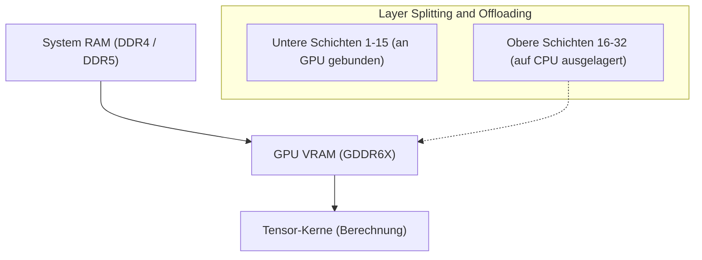
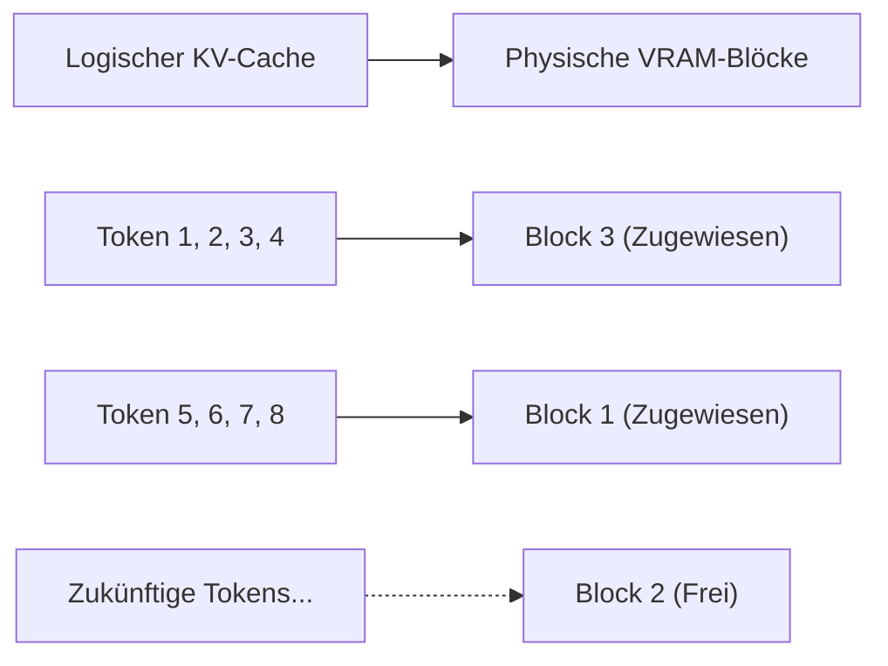
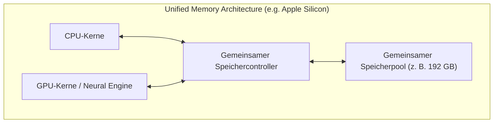
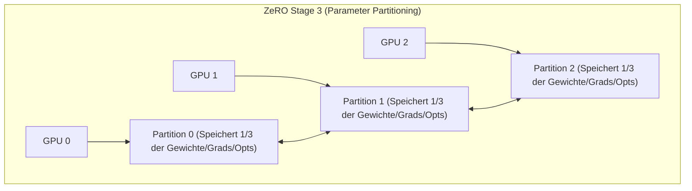

# Einführung: KI-Entwicklung und "Die VRAM-Wand"

In den letzten Jahren hat die generative KI-Technologie, wie große Sprachmodelle (LLMs) und Diffusionsmodelle (Diffusion Models), rasante Fortschritte gemacht. Wenn jedoch Entwickler und Forscher versuchen, diese modernsten KI-Modelle in lokalen Umgebungen zu trainieren (Fine-Tuning) oder auszuführen (Inference), stoßen viele auf ein sehr physisches Hindernis: **"GPU-Speichermangel (VRAM)"**.

Selbst bei High-End-GPUs für Endverbraucher, wie der NVIDIA GeForce RTX 4090, beträgt der maximale VRAM 24 GB, was es völlig unmöglich macht, ein riesiges Modell wie Llama 3 70B direkt zu laden. GPUs für Rechenzentren wie H100 (80 GB) oder B200 (192 GB) sind extrem teuer und für Einzelpersonen oder kleine Teams nicht leicht zugänglich. Wenn man diese "VRAM-Wand (The Wall of VRAM)" nicht durchbrechen kann, kann man modernste Modelle gar nicht erst berühren.

In diesem Artikel werden wir fortgeschrittene Techniken gründlich erläutern, um diese physische Einschränkung des VRAM-Limits durch software- und hardwarearchitektonische Kniffe sowohl beim Training als auch bei der Inferenz zu überwinden. Wir werden CPU-Offloading, KV-Cache-Optimierung, Gradient Checkpointing und neueste Unified-Memory-Architekturen anhand von mathematischen Formeln und Diagrammen vertiefen. Wenn Sie diesen Artikel lesen, werden Sie das Verhalten von VRAM tiefgreifend verstehen und praktisches Wissen erwerben, um riesige Modelle mit begrenzten Ressourcen zu handhaben.

---

# 1. Anatomie des VRAM-Verbrauchs von KI-Modellen (Inferenz / Training)

Der erste Schritt zur Behebung des VRAM-Mangels besteht darin, aus einer Mikroperspektive genau zu verstehen, "was" und "wie viel" Speicher verbraucht. Anstatt ihn als Blackbox zu behandeln, können wir, wenn wir ihn mit mathematischen Formeln genau abschätzen, die richtigen Optimierungsmethoden auswählen.

## 1.1 Speicherberechnung für Modellparameter (Gewichte)

Die grundlegende Speichermenge, die von den Parametern (Weights), aus denen ein KI-Modell besteht, verbraucht wird, wird durch die Gesamtzahl der Parameter des Modells und den Datentyp (Precision), der zu ihrer Darstellung verwendet wird, bestimmt.

Die im Deep Learning häufig verwendeten Datentypen und die Anzahl der Bytes pro Parameter ($B$) sind wie folgt:
- **FP32 (einfache Genauigkeit):** 4 Bytes (Standardgenauigkeit für Training)
- **FP16 / BF16 (halbe Genauigkeit):** 2 Bytes (allgemeine Inferenz und Mixed-Precision-Training)
- **INT8 (8-Bit-Ganzzahl):** 1 Byte (quantisierte Modelle)
- **INT4 (4-Bit-Ganzzahl-Quantisierung):** 0,5 Bytes (extreme Quantisierung wie GPTQ, AWQ, GGUF)

Wenn die Anzahl der Parameter des gesamten Modells $P$ ist, wird die Basisspeichermenge $M_{weights}$, die von den Gewichten selbst belegt wird, durch die folgende Formel ausgedrückt:

$$ M_{weights} = P \times B $$

Wenn man beispielsweise das von Meta veröffentlichte "Llama 3 8B"-Modell (ca. 8 Milliarden Parameter) in FP16 (halbe Genauigkeit) lädt, sieht die Berechnung wie folgt aus:

$$ M_{weights} = 8,000,000,000 \times 2 \text{ bytes} \approx 16,000,000,000 \text{ bytes} \approx 16 \text{ GB} $$

Das bedeutet, dass allein das Laden der Gewichte des Modells in die GPU 16 GB VRAM verbraucht. Bei einer RTX 3060 (12 GB) tritt an diesem Punkt ein Out-of-Memory (OOM) Fehler auf. Wenn man das Modell jedoch auf INT4 quantisiert, wird es $8 \times 0.5 = 4 \text{ GB}$ groß und kann problemlos geladen werden.

## 1.2 Speicherverbrauch bei der Inferenz: Wachstum des KV-Caches

Bei der LLM-Inferenz (insbesondere bei der autoregressiven Textgenerierung) ist es der **KV-Cache (Key-Value Cache)**, der den VRAM genauso stark oder stärker als die Gewichte beansprucht.
In der Transformer-Architektur werden die Key- und Value-Tensoren in jeder Attention-Schicht kontinuierlich im VRAM gecacht, um eine Neuberechnung der Informationen von Tokens, die in der Vergangenheit generiert und verarbeitet wurden, zu verhindern. Dies verbessert zwar die Berechnungsgeschwindigkeit (Compute), aber die Speichernutzung steigt linear und explosiv an, je länger die Kontextlänge (Eingabeprompt-Länge + generierte Länge) wird.

Die Menge an KV-Cache-Speicher $M_{kv\_token}$, die bei der Verarbeitung von 1 Token verbraucht wird, wird basierend auf der Modellarchitektur mit der folgenden Formel genau berechnet:

$$ M_{kv\_token} = 2 \times N_{layers} \times N_{heads\_kv} \times D_{head} \times B $$

Hier haben die Variablen folgende Bedeutungen:
- $2$ : Weil es zwei Tensoren für Key und Value gibt
- $N_{layers}$ : Anzahl der Transformer-Schichten (Layers)
- $N_{heads\_kv}$ : Anzahl der KV-Attention-Heads (Bei GQA: Grouped Query Attention ist dies geringer als die normale Anzahl der Heads)
- $D_{head}$ : Anzahl der Dimensionen pro Head (normalerweise Anzahl der Dimensionen der verborgenen Schicht $D_{model} / N_{heads}$)
- $B$ : Anzahl der Bytes des Datentyps (2 für FP16)

Die gesamte KV-Cache-Menge $M_{kv\_total}$ wird berechnet, indem dies mit der Sequenzlänge ($L_{seq}$) und der Batch-Größe ($BatchSize$) multipliziert wird.

$$ M_{kv\_total} = M_{kv\_token} \times L_{seq} \times BatchSize $$

**Konkretes Beispiel: Bei Llama 2 7B**
- $N_{layers} = 32$
- $N_{heads\_kv} = 32$ (Bei MHA)
- $D_{head} = 128$
- FP16 ($B=2$)
- Batch-Größe 1, Sequenzlänge 8192 (8K Kontext)

$$ M_{kv\_total} = 2 \times 32 \times 32 \times 128 \times 2 \times 8192 \times 1 = 4,294,967,296 \text{ bytes} \approx 4 \text{ GB} $$

Wenn man den Kontext auf 32K (32768 Token) verlängert, verbraucht allein der KV-Cache etwa 16 GB. Wenn man die Batch-Größe auf 4 erhöht, sind es 64 GB. Es ist eine große Herausforderung bei der Inferenz, dass sie weit mehr VRAM benötigt als das Modell selbst.

## 1.3 Speicherverbrauch beim Training: Optimierer, Gradienten und Aktivierungen

Im Vergleich zur Inferenz verbraucht das Modelltraining (Pre-Training oder Fine-Tuning) weitaus mehr VRAM. Das liegt daran, dass Informationen für die Backpropagation (Rückpropagation) gespeichert werden müssen, nicht nur ein einfacher Forward-Pass (Vorwärtspropagation). Der Speicher für das Training besteht hauptsächlich aus den folgenden 4 Elementen:

1. **Modellgewichte (Model Weights):** Wie bei der Inferenz, aber beim Mixed-Precision-Training können sowohl FP16 als auch FP32 (Master Weights) aufbewahrt werden.
2. **Gradienten (Gradients):** Gradienten pro Parameter, die durch die Backpropagation berechnet werden. Bei FP16 sind das 2 Bytes pro Parameter.
3. **Optimiererzustände (Optimizer States):** Hochfunktionale Optimierer wie AdamW speichern das erste Moment (Momentum) und das zweite Moment (Variance) für jeden Parameter. Um die Trainingsstabilität zu erhalten, werden diese normalerweise in FP32 (4 Bytes) aufbewahrt. Das bedeutet, dass $4 + 4 = 8$ Bytes pro Parameter für die zwei Momente verbraucht werden.
4. **Aktivierungen (Activations):** Um die Gradienten in der Backpropagation zu berechnen, muss die Ausgabe (Zwischenzustand) jeder Schicht während des Forward-Passes im Speicher gehalten werden. Dies hängt stark von der Batch-Größe und der Sequenzlänge ab und wird sehr groß.

Zusammenfassend benötigt das Mixed-Precision-Training (gemischte Genauigkeit) mit einem Standard-Adam-Optimierer **ca. 16 bis 20 Bytes** pro Parameter (Mastergewichte 4 + FP16-Gewichte 2 + Gradienten 2 + Optimierer 8 + α) an Speicher.

$$ M_{train\_param} \approx P \times 16 \text{ bytes} $$

Das Training eines 7B (7 Milliarden Parameter) Modells erfordert $7B \times 16 = 112 \text{ GB}$ allein für Parameterbezogenes, dazu kommen die Aktivierungen, sodass schätzungsweise über 140 GB VRAM benötigt werden. Um dies mit 24 GB VRAM auszuführen, sind die starken Optimierungstechniken unerlässlich, die im nächsten Kapitel erläutert werden.

---

# 2. VRAM-Spartechniken bei der Inferenz

Viele Softwaretechnologien, die Hardwaregrenzen überschreiten, wurden als Ansätze entwickelt, um riesige Modelle bei der Inferenz auszuführen.

## 2.1 CPU-Offloading und Layer-Splitting

Wenn ein riesiges Modell nicht in eine oder mehrere GPUs passt, ist eine Methode, einen Teil des Modells in den Systemspeicher (CPU-RAM) zu platzieren und Berechnungen durchzuführen, während es nur bei Bedarf in die GPU übertragen wird. Dies ist das **CPU-Offloading**. `llama.cpp` und Hugging Face's `Accelerate` unterstützen diese Funktion.



**Mechanismus und Herausforderungen:**
Da das Transformer-Modell eine Struktur aufweist, in der Schichten (Layers) in Reihe geschichtet sind, beginnt die Berechnung der nächsten Schicht erst, wenn die Berechnung einer Schicht abgeschlossen ist. Indem man dies ausnutzt, werden nur die Schichten, die in die GPU passen (z. B. Schicht 1 bis 15), dauerhaft im VRAM gehalten (Pinned), und die restlichen Schichten (Schicht 16 bis 32) werden in den großen, aber langsamen CPU-RAM gelegt. Während der Inferenz, wenn die Berechnung bis Schicht 15 abgeschlossen ist, werden die Gewichte der 16. Schicht vom CPU über den PCIe-Bus zur GPU übertragen (kopiert), und die Berechnung wird auf der GPU ausgeführt.

Die **PCIe-Bandbreite (Bandwidth) ist jedoch ein massiver Flaschenhals**. Die theoretische maximale Bandbreite von PCIe 4.0 x16 beträgt 32 GB/s (in eine Richtung), was zwei Größenordnungen langsamer ist im Vergleich zur internen VRAM-Bandbreite moderner GPUs (z. B. ist der GDDR6X der RTX 4090 1008 GB/s und der HBM3 des H100 mehr als 3 TB/s). Daher sinkt die Inferenzgeschwindigkeit (Tokens per Second) dramatisch, wenn CPU-Offloading stark genutzt wird.
Um den Geschwindigkeitsverlust zu minimieren, ist es in der Praxis entscheidend, so viele Schichten wie möglich auf die GPU zu laden (Maximierung der GPU Layers) und die Anzahl der offloadeten Schichten zu minimieren.

## 2.2 KV-Cache-Quantisierung und PagedAttention

Auch gegen den KV-Cache, den Hauptverursacher des VRAM-Verbrauchs während der Inferenz, werden zwei starke Optimierungen durchgeführt.

**1. KV-Cache-Quantisierung (KV Cache Quantization):**
Eine Methode, bei der nicht nur die Gewichte des Modells, sondern auch der zur Laufzeit dynamisch generierte KV-Cache selbst in INT8, INT4 oder sogar FP8 quantisiert und im VRAM gespeichert wird. Dies reduziert die Größe des KV-Caches auf die Hälfte oder ein Viertel. Neueste Inferenz-Engines (vLLM und llama.cpp) haben diese Funktion integriert und erreichen erhebliche VRAM-Einsparungen, während der Genauigkeitsverlust minimiert wird.

**2. PagedAttention:**
Das Konzept des "Paging" im virtuellen Speicher des Betriebssystems auf den KV-Cache anzuwenden, ist die **PagedAttention**, die durch eine Inferenz-Engine namens vLLM eingeführt wurde. Bei herkömmlichen Inferenz-Engines wurden basierend auf der eingestellten maximalen Sequenzlänge im Voraus zusammenhängende VRAM-Bereiche reserviert (Pre-allocation). Dies führte bei kurzen Eingaben zu Fragmentierung oder einer Verschwendung ungenutzten Speichers, wodurch oft über 60 % des VRAMs verschwendet wurden.

PagedAttention unterteilt den KV-Cache in Blöcke (Pages) fester Größe, die in nicht zusammenhängenden physischen Speicherbereichen verteilt abgelegt werden können. Dadurch wird die Speicherverschwendung nahezu auf Null reduziert (beschränkt auf interne Fragmentierung), und die Batch-Größe kann bei gleicher VRAM-Kapazität erheblich gesteigert werden.



## 2.3 FlashAttention: Überwindung der Speicherkomplexität von Attention-Berechnungen

Der VRAM-Mangel wird nicht nur durch die Speichermenge für Daten verursacht, sondern auch durch den Mangel an "temporärem Arbeitsbereich" während der Berechnung. Der Standard-Self-Attention-Mechanismus des Transformers erfordert, dass eine riesige Attention-Matrix der Größe $N \times N$ im VRAM für eine Sequenzlänge $N$ materialisiert (Materialize) wird. Dies führt zu einer Speicherkomplexität von $O(N^2)$ und ist die Hauptursache für OOM bei langen Kontexten.

Das Problem wurde durch **FlashAttention** (und FlashAttention-2, 3) gelöst.
FlashAttention ist ein Algorithmus, der sich der Hardwarearchitektur der GPU (die hierarchische Struktur aus riesigem, aber langsamem HBM und winzigem, aber extrem schnellem SRAM) bewusst ist. Unter Verwendung einer Technik namens Tiling (Kachelung) werden Daten blockweise in den SRAM geladen und die Attention-Berechnung wird dort abgeschlossen, wodurch der Prozess, eine $N \times N$-Matrix in den HBM (VRAM) zu schreiben, vollständig vermieden wird.

Dadurch sank die Speicherkomplexität der Attention-Schicht drastisch von $O(N^2)$ auf $O(N)$ (proportional zur Sequenzlänge), und die Begrenzungen der Kontextlänge wurden erheblich gelockert.

## 2.4 Der Aufstieg von Unified Memory und Apple Silicon

Ein Ansatz, der dieses Problem grundlegend von der PC-Architektur aus angeht, ist die **Unified Memory Architecture (UMA)**, die von Apple Silicon (Max und Ultra der M1/M2/M3/M4-Serie) und einigen neuesten APUs (wie AMD Strix Point) übernommen wurde.

In diesen Architekturen teilen sich CPU und GPU auf dem Motherboard genau denselben physischen Speicher (z. B. bis zu 192 GB LPDDR5). Daher existiert das Konzept einer "langsamen Datenübertragung von CPU zu GPU über PCIe" physikalisch nicht.



Der größte Vorteil dieser Architektur besteht darin, dass es keine klare Wand namens VRAM gibt und fast der gesamte Systemspeicher direkt zum Laden riesiger LLMs verwendet werden kann. Mit einem Mac Studio, das über 192 GB Unified Memory verfügt, können riesige Modelle der 70B-Klasse oder größer (wie Grok-1) ohne Quantisierung auf ein einziges Gerät geladen und mit hoher Geschwindigkeit interferiert werden. Die Speicherzugriffsbandbreite erreicht beim M2 Ultra 800 GB/s und steht damit herkömmlichen diskreten GPUs für Verbraucher in nichts nach. Es ist ein sehr starker Ansatz, der das Dilemma zwischen "Speicherkapazität" und "Bandbreite" auf Hardwareebene löst.

---

# 3. VRAM-Spartechniken beim Training (Fine-Tuning)

Auch beim Training, das noch mehr VRAM erfordert als die Inferenz, gab es viele Durchbrüche. Um mit begrenzten Ressourcen Fine-Tuning durchzuführen, ist die Kombination der folgenden Technologien unerlässlich.

## 3.1 Gradient Checkpointing

Bei der Backpropagation im Deep Learning müssen die Zwischenausgaben (Activations) aller Schichten aus dem Forward-Pass im Speicher gehalten werden, um Gradienten zu berechnen. Wenn Sequenzlänge oder Batch-Größe ansteigen, beginnt dieser Aktivierungsspeicher den VRAM zu dominieren.

**Gradient Checkpointing (Gradient Checkpointing / Activation Recomputation)** ist eine geniale Technik, die den Kompromiss zwischen Speicherkapazität und Berechnungszeit (Compute) ausnutzt.
Anstatt alle Zwischenausgaben im Speicher zu speichern, werden nur die Ausgaben bestimmter Schichten (Checkpoints) gespeichert. Wenn während der Backpropagation ein Zwischenwert benötigt wird, der nicht gecheckt wurde, **wird der Forward-Pass ab dem nächstgelegenen gespeicherten Checkpoint erneut berechnet (Recomputation), um den Wert wiederherzustellen**.

Der Rechenaufwand steigt um etwa 20 bis 30 %, wodurch die gesamte Trainingszeit länger wird. Der durch Aktivierungen verursachte VRAM-Verbrauch kann jedoch drastisch von $O(N)$ ($N$ ist die Anzahl der Schichten) auf $O(\sqrt{N})$ reduziert werden. Beim aktuellen Training großer Modelle ist dies ein so wesentlicher Parameter, dass man sagen kann, ohne ihn könne man nicht anfangen.

## 3.2 LoRA und QLoRA (Low-Rank Adaptation)

Der Hauptdarsteller, der das VRAM-Problem grundlegend gelöst hat, ist **LoRA**, ein typisches Beispiel für PEFT (Parameter-Efficient Fine-Tuning).

Die ursprüngliche riesige Gewichtsmatrix $W_0 \in \mathbb{R}^{d \times k}$ des Modells wird eingefroren (Frozen) und nicht trainiert. Stattdessen werden zwei sehr kleine Matrizen mit niedrigem Rang $A \in \mathbb{R}^{r \times k}$ und $B \in \mathbb{R}^{d \times r}$ parallel eingeführt, und nur dieses $A$ und $B$ werden trainiert. (Hier ist der Rang $r$ ein sehr kleiner Wert, sodass $r \ll d, k$).

$$ W_{adapted} = W_0 + \Delta W = W_0 + B A $$

Dadurch wird die Anzahl der trainierbaren Parameter auf unter 1 % (manchmal unter 0,1 %) des Originals reduziert, und dementsprechend sinken auch die "Gradienten" und "Optimiererzustände", die sehr viel Speicher gefressen haben, auf unter 1 %.

Eine noch extremere Weiterentwicklung hiervon ist **QLoRA (Quantized LoRA)**.
Bei QLoRA wird das Basisgewicht $W_0$ des Modells extrem auf 4-Bit (NF4: NormalFloat4 Format) quantisiert und in den VRAM geladen. Und die kleinen LoRA-Matrizen $A, B$ werden in BF16 (16-Bit) trainiert, um die Rechengenauigkeit aufrechtzuerhalten.
Die 4-Bit-Quantisierung reduziert die VRAM-Größe des Basismodells auf ein Viertel, während eine Technologie namens **Paged Optimizers** verwendet wird, um den Zustand des Optimierers automatisch vorübergehend in den CPU-RAM zu sichern (offload), falls der VRAM knapp wird. Dadurch ist es nun möglich, selbst superriesige Modelle wie das Llama 3 70B auf einer einzelnen GPU mit 24 GB VRAM (wie einer RTX 4090) zu fine-tunen.

## 3.3 DeepSpeed ZeRO und Offloading

In Umgebungen, in denen mehrere GPUs (Multi-GPU) verwendet werden, löst einfache Datenparallelität (Data Parallelism) das VRAM-Problem nicht. Da jede GPU eine Kopie des gesamten Modells hält, kann das VRAM-Kapazitätslimit der einzelnen GPU nicht überschritten werden.

**ZeRO (Zero Redundancy Optimizer)** der von Microsoft entwickelten **DeepSpeed**-Bibliothek ist eine Technologie, die die Parameter, Gradienten und Optimiererzustände des Modells gründlich über mehrere GPUs verteilt (Shard). Dadurch kann der "Gesamtwert" des VRAMs mehrerer GPUs wie ein riesiger Speicherpool behandelt werden.



- **ZeRO Stage 1:** Aufteilen der Optimiererzustände auf jede GPU
- **ZeRO Stage 2:** Aufteilen der Gradienten auf jede GPU
- **ZeRO Stage 3:** Aufteilen der Modellparameter (Gewichte) selbst auf jede GPU

Wenn zudem die Funktion **ZeRO-Offload** genutzt wird, können die mit ZeRO verteilten Aktualisierungsberechnungen für Optimiererzustände und Gradienten in den **CPU-Speicher ausgelagert (Offload)** werden, anstatt sie auf der GPU auszuführen. Dies reduziert die Belastung des GPU-VRAMs drastisch und ermöglicht das Training großer Modelle selbst auf begrenzter GPU-Hardware. Die Berechnung erfolgt auf der CPU und die Ergebnisse werden über PCIe an die GPU zurückgegeben, sodass die Trainingsgeschwindigkeit sinkt, aber das Worst-Case-Szenario, dass das "Training aufgrund von Speichermangel abstürzt", wird vermieden.

---

# 4. Implementierungsbeispiel: Hugging Face Accelerate und DeepSpeed

Abschließend zeigen wir anhand einfacher Beispiele, wie CPU-Offloading und VRAM-Optimierung tatsächlich im Python-Code implementiert werden.

## 4.1 Automatisches Offloading mit Hugging Face `device_map="auto"`

Die Bibliotheken `transformers` und `accelerate` von Hugging Face teilen die Schichten beim Laden des Modells automatisch zwischen GPU und CPU auf.

```python
from transformers import AutoModelForCausalLM, AutoTokenizer

model_id = "meta-llama/Llama-2-13b-hf"

# Mit device_map="auto" wird alles, was nicht in den VRAM passt, in den CPU-RAM offloadet
# Mit load_in_8bit=True werden die Gewichte auf 8-Bit quantisiert, um noch mehr Speicher zu sparen
model = AutoModelForCausalLM.from_pretrained(
    model_id,
    device_map="auto",
    load_in_8bit=True,
    offload_folder="offload_dir" # Falls der Platz nicht ausreicht, kann sogar auf Festplatte (SSD) ausgelagert werden
)
```

Wenn Sie diesen Code ausführen, analysiert die zugrunde liegende Bibliothek `accelerate` den freien Speicherplatz im VRAM des Systems und im CPU-RAM und ordnet die Schichten (Dispatch) auf die optimale Weise an.

## 4.2 DeepSpeed CPU-Offloading Einstellungen (ZeRO-2)

Hier ist ein Beispiel für eine Konfigurationsdatei (JSON), um CPU-Offloading mit DeepSpeed während des Trainings zu aktivieren.

```json
{
  "fp16": {
    "enabled": true
  },
  "zero_optimization": {
    "stage": 2,
    "offload_optimizer": {
      "device": "cpu",
      "pin_memory": true
    },
    "allgather_partitions": true,
    "allgather_bucket_size": 2e8,
    "overlap_comm": true,
    "reduce_scatter": true,
    "reduce_bucket_size": 2e8,
    "contiguous_gradients": true
  },
  "train_batch_size": 16,
  "gradient_accumulation_steps": 4
}
```
Indem `offload_optimizer` auf `"cpu"` in dieser Konfiguration gesetzt wird, wird die CPU des Host-Systems angewiesen, die Zustandsspeicherung und die Aktualisierungsberechnungen des Optimierers (wie Adam), die viel VRAM verbrauchen, durchzuführen. So kann der VRAM der GPU exklusiv der wichtigsten Aufgabe gewidmet werden: der Forward/Backward-Berechnung des Modells. Indem `pin_memory: true` eingestellt wird, werden Page-Faults verhindert und der PCIe-Transfer zwischen CPU und GPU so weit wie möglich beschleunigt.

---

# Zusammenfassung

GPU-Speichermangel (Out of Memory) in der KI-Entwicklung ist ein ewiges Problem, das Entwickler mit der Zunahme der Modellgröße auch in Zukunft verfolgen wird. Doch durch ein tiefgreifendes Verständnis der in diesem Artikel erläuterten Hardware (Architektur) und einer angemessenen Kombination von Optimierungstechniken auf Software- und Algorithmus-Ebene wird Inferenz und Training riesiger Modelle in lokalen Umgebungen, was zunächst unmöglich erscheint, möglich.

**Zusammenfassung der Maßnahmen für die Inferenz:**
1. **Quantisierung (INT4 / INT8 / FP8):** Komprimiert die Größe des Modells selbst drastisch und reduziert den VRAM-Verbrauch.
2. **CPU-Offloading:** Verschiebt Schichten, die nicht in den VRAM passen, in den Systemspeicher (Kompromiss mit der Geschwindigkeitsreduzierung aufgrund der PCIe-Bandbreite).
3. **KV-Cache-Optimierung:** Sichert die Kontextlänge (Context Length) durch Paging (PagedAttention), Cache-Quantisierung und FlashAttention.
4. **Unified-Memory-Nutzung:** Nutzt UMA wie bei Apple Silicon, um großen Speicher direkt für die Inferenz zu verwenden.

**Zusammenfassung der Maßnahmen für das Training:**
1. **PEFT (LoRA / QLoRA):** Beschränkt die Parameter für das Training und quantisiert das Basismodell extrem.
2. **Gradient Checkpointing (Gradient Checkpointing):** Verwirft Zwischenausgaben im Forward-Pass und berechnet sie im Backward-Pass neu, wodurch der VRAM-Verbrauch im Austausch für Rechenzeit begrenzt wird.
3. **ZeRO & CPU-Offloading (DeepSpeed):** Verteilt Optimiererzustände und Gradienten auf mehrere GPUs oder lagert sie in den CPU-Speicher aus, um die VRAM-Grenze zu durchbrechen.

Lassen Sie uns durch den geschickten Einsatz dieser fortgeschrittenen Technologien die Leistung der KI-Entwicklung innerhalb begrenzter Hardwareressourcen maximieren. Es wird erwartet, dass in diesem sich schnell entwickelnden Bereich in Zukunft weitere speichersparende Algorithmen auftauchen werden. Der Schlüssel wird darin liegen, die Trends bei den neuesten Bibliotheken regelmäßig zu überprüfen und sie in die Implementierung aufzunehmen.

