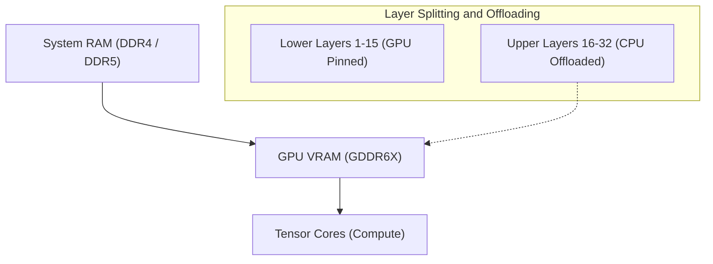
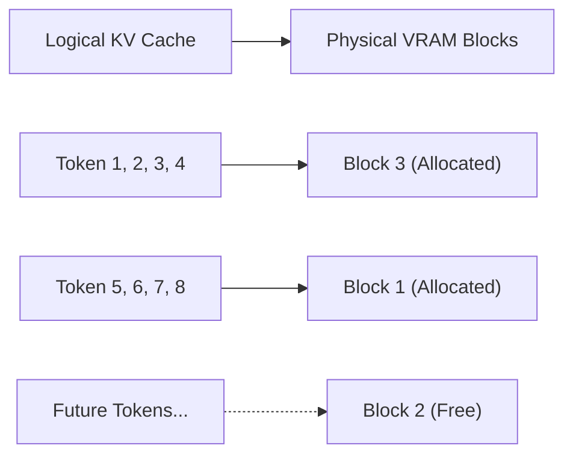
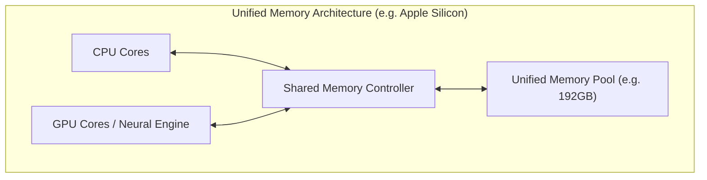
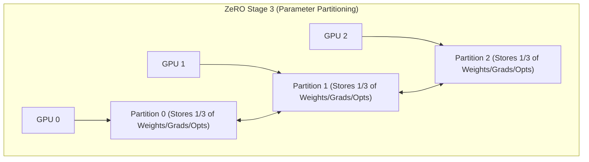

# Introduction: AI Development and "The Wall of VRAM"

In recent years, generative AI technologies such as Large Language Models (LLMs) and Diffusion Models have achieved rapid development. However, when trying to train (fine-tune) or perform inference with these cutting-edge AI models in a local environment, a very physical barrier that many developers and researchers face is the **"shortage of GPU memory (VRAM)"**.

Even a high-end consumer GPU like the NVIDIA GeForce RTX 4090 has a maximum VRAM of 24GB, making it completely impossible to load a massive model like Llama 3 70B as it is. Data center GPUs like the H100 (80GB) or B200 (192GB) are extremely expensive and not easily accessible to individuals or small teams. If we cannot break through this "Wall of VRAM," we cannot even touch the most advanced models.

In this article, we will thoroughly explain advanced techniques from both inference and training perspectives to break down this physical constraint of limited VRAM through software and hardware architectural ingenuity. Let's delve deep into CPU offloading, KV cache optimization, Gradient Checkpointing, and the latest Unified Memory architectures, interspersed with mathematical formulas and diagrams. By reading this article, you will gain a deep understanding of VRAM behavior and practical knowledge for handling massive models with limited resources.

---

# 1. Anatomy of VRAM Consumption by AI Models (Inference & Training)

The first step to resolving VRAM shortages is to accurately grasp "what" is consuming "how much" memory from a micro perspective. By treating it not as a black box, but by accurately estimating it using mathematical formulas, we can select appropriate optimization techniques.

## 1.1 Memory Calculation for Model Parameters (Weights)

The basic amount of memory consumed by the parameters (Weights) that make up an AI model is determined by the total number of parameters in the model and the data type (Precision) used to represent them.

The data types commonly used in deep learning and their byte size per parameter ($B$) are as follows:
- **FP32 (Single Precision Floating-Point):** 4 bytes (Standard precision for training)
- **FP16 / BF16 (Half Precision Floating-Point):** 2 bytes (Common for inference and mixed precision training)
- **INT8 (8-bit Integer):** 1 byte (Quantized models)
- **INT4 (4-bit Integer Quantization):** 0.5 bytes (Extreme quantization like GPTQ, AWQ, GGUF)

Let $P$ be the total number of parameters in the model. The base memory amount $M_{weights}$ occupied by the weights themselves is expressed by the following formula:

$$ M_{weights} = P \times B $$

For example, when loading Meta's "Llama 3 8B" model (approx. 8 billion parameters) in FP16 (half precision), the calculation is as follows:

$$ M_{weights} = 8,000,000,000 \times 2 \text{ bytes} \approx 16,000,000,000 \text{ bytes} \approx 16 \text{ GB} $$

In other words, purely loading the model's weights into the GPU consumes 16GB of VRAM. With an RTX 3060 (12GB), an Out of Memory (OOM) error will occur at this point. However, if the model is quantized to INT4, it becomes $8 \times 0.5 = 4 \text{ GB}$, making it easily loadable.

## 1.2 Memory Consumption During Inference: The Growth of KV Cache

In LLM inference (especially autoregressive text generation), what heavily pressures VRAM as much as or more than the weights is the **KV Cache (Key-Value Cache)**.
In the Transformer architecture, to avoid recalculating information for tokens that were already generated and processed, the Key and Value tensors in each attention layer are continuously cached in VRAM. This improves computational speed (Compute), but as the context length (input prompt length + generated length) grows, memory consumption increases linearly and explosively.

The amount of KV cache memory consumed when processing a single token, $M_{kv\_token}$, is strictly calculated based on the model's architecture by the following formula:

$$ M_{kv\_token} = 2 \times N_{layers} \times N_{heads\_kv} \times D_{head} \times B $$

Here, each variable has the following meaning:
- $2$ : Because there are two tensors, Key and Value
- $N_{layers}$ : Number of Transformer layers
- $N_{heads\_kv}$ : Number of KV attention heads (In GQA: Grouped Query Attention, this is fewer than the standard number of heads)
- $D_{head}$ : Dimensionality of each head (Usually, hidden layer dimension $D_{model} / N_{heads}$)
- $B$ : Number of bytes for the data type (2 for FP16)

The total KV cache amount $M_{kv\_total}$ is this multiplied by the sequence length ($L_{seq}$) and the batch size ($BatchSize$).

$$ M_{kv\_total} = M_{kv\_token} \times L_{seq} \times BatchSize $$

**Example: For Llama 2 7B**
- $N_{layers} = 32$
- $N_{heads\_kv} = 32$ (For MHA)
- $D_{head} = 128$
- FP16 ($B=2$)
- Batch Size 1, Sequence Length 8192 (8K Context)

$$ M_{kv\_total} = 2 \times 32 \times 32 \times 128 \times 2 \times 8192 \times 1 = 4,294,967,296 \text{ bytes} \approx 4 \text{ GB} $$

If we extend the context to 32K (32768 tokens), the KV cache alone will consume about 16GB. If we increase the batch size to 4, it will be 64GB. The fact that it demands significantly more VRAM than the size of the model itself is a major challenge during inference.

## 1.3 Memory Consumption During Training: Optimizers, Gradients, and Activations

Compared to inference, training a model (pre-training or fine-tuning) consumes vastly more VRAM. This is because, in addition to a simple forward pass, it is necessary to hold information for backpropagation. Training memory is primarily composed of the following four elements:

1. **Model Weights:** Similar to inference, but mixed precision training may require holding both FP16 and FP32 (master weights).
2. **Gradients:** The gradients for each parameter calculated during backpropagation. 2 bytes per parameter for FP16.
3. **Optimizer States:** Advanced optimizers like AdamW hold the first moment (Momentum) and second moment (Variance) for each parameter. To maintain training stability, these are typically held in FP32 (4 bytes). Thus, the two moments consume $4 + 4 = 8$ bytes per parameter.
4. **Activations:** To calculate gradients during backpropagation, the output of each layer from the forward pass (intermediate states) must be kept in memory. This heavily depends on the batch size and sequence length, and becomes exceptionally large.

In summary, in Mixed Precision Training using a standard Adam optimizer, **about 16 to 20 bytes** (Master weights 4 + FP16 weights 2 + Gradients 2 + Optimizer 8 + α) of memory is required per parameter.

$$ M_{train\_param} \approx P \times 16 \text{ bytes} $$

To train a 7B (7 billion parameter) model, parameter-related elements alone will require $7B \times 16 = 112 \text{ GB}$, and with activations added, it equates to needing over 140GB of VRAM. Executing this on 24GB of VRAM requires the aggressive optimization techniques explained in the subsequent chapters.

---

# 2. VRAM Saving Techniques During Inference

To run massive models during inference, many software technologies have been developed that transcend hardware boundaries.

## 2.1 CPU Offloading and Layer Splitting

When a massive model cannot entirely fit on a single or multiple GPUs, the technique of placing parts of the model in system memory (CPU RAM) and transferring them to the GPU only when necessary as computation progresses is known as **CPU Offloading**. `llama.cpp` and Hugging Face's `Accelerate` support this feature.



**Mechanism and Challenges:**
Since Transformer models have a structure where layers are stacked in series, the computation of one layer must finish before the next layer's computation can begin. Leveraging this, only the layers that fit in the GPU (e.g., Layers 1-15) are pinned residently in the VRAM, while the remaining layers (Layers 16-32) are placed in the large-capacity but slower CPU RAM. During inference, when the computation for up to layer 15 is complete, the weights for layer 16 are transferred (copied) from the CPU to the GPU via the PCIe bus, and computation is executed on the GPU.

However, **PCIe bandwidth becomes a severe bottleneck**. The theoretical maximum bandwidth of PCIe 4.0 x16 is 32GB/s (unidirectional), but compared to the internal bandwidth of modern GPU VRAM (e.g., RTX 4090's GDDR6X is 1008GB/s, H100's HBM3 is over 3TB/s), it is two orders of magnitude slower. Therefore, heavily relying on CPU offloading dramatically decreases inference speed (Tokens per Second).
To minimize speed degradation, the practical key is to place as many layers as possible on the GPU (maximizing GPU Layers) and minimize the number of offloaded layers.

## 2.2 KV Cache Quantization and PagedAttention

For the KV cache, which is the primary culprit of VRAM consumption during inference, two powerful optimizations have been implemented.

**1. KV Cache Quantization:**
This is a technique where not only the model weights, but the dynamically generated KV cache itself is quantized to INT8, INT4, or even FP8 before being saved in VRAM. This can reduce the size of the KV cache by half to a quarter. Modern inference engines (like vLLM and llama.cpp) have incorporated this feature, achieving significant VRAM savings while minimizing precision loss.

**2. PagedAttention:**
Applying the concept of OS virtual memory "paging" to the KV cache resulted in **PagedAttention**, introduced in the vLLM inference engine. In traditional inference engines, contiguous VRAM regions were pre-allocated based on the set maximum sequence length. As a result, when actual inputs were shorter, fragmentation and wasted memory occurred, sometimes wasting over 60% of VRAM.

PagedAttention divides the KV cache into fixed-size blocks (pages), making it possible to store them distributed across non-contiguous physical memory spaces. This brings memory waste to near zero (limited only to internal fragmentation) and allows the batch size to be significantly increased with the same VRAM capacity.



## 2.3 FlashAttention: Breaking the Memory Complexity of Attention Computation

VRAM shortage is caused not only by the memory needed to store data, but also by the shortage of "temporary workspace" during computation. The standard Transformer Self-Attention mechanism needs to materialize a massive $N \times N$ attention matrix on VRAM for a sequence length $N$. This has a memory complexity of $O(N^2)$ and is a major cause of OOM with long contexts.

What solved this is **FlashAttention** (and FlashAttention-2, 3).
FlashAttention is an algorithm that is aware of the GPU hardware architecture (the hierarchical structure of large but slow HBM and extremely small but ultra-fast SRAM). Using a technique called Tiling, it loads data into SRAM block by block and completes the attention computation there, thereby completely avoiding the process of writing the $N \times N$ matrix to HBM (VRAM).

As a result, the memory complexity of attention layers drops dramatically from $O(N^2)$ to $O(N)$ (proportional to sequence length), significantly easing constraints on context length.

## 2.4 The Rise of Unified Memory and Apple Silicon

Approaching this problem from the very foundation of PC architecture is the **Unified Memory Architecture (UMA)** adopted by Apple Silicon (M1/M2/M3/M4 series Max and Ultra) and some modern APUs (like AMD Strix Point).

In these architectures, the CPU and GPU on the motherboard share the exact same physical memory (e.g., up to 192GB of LPDDR5). Therefore, the concept of "slow data transfer from CPU to GPU via PCIe" physically does not exist.



The greatest advantage of this architecture is that there is no distinct wall of VRAM; almost the entire system memory can be directly used to load massive LLMs. With a Mac Studio possessing 192GB of unified memory, it is possible to load massive models of the 70B class or larger (such as Grok-1) onto a single device without quantization and infer at high speed. The memory access bandwidth also reaches 800GB/s on the M2 Ultra, boasting speeds comparable to consumer discrete GPUs. It is a very powerful approach that solves the dilemma of "memory capacity" and "bandwidth" at the hardware level.

---

# 3. VRAM Saving Techniques During Training (Fine-Tuning)

During training, which demands even more VRAM than inference, many breakthroughs have also been made. To perform fine-tuning with limited resources, combining the following technologies is essential.

## 3.1 Gradient Checkpointing

In deep learning backpropagation, to calculate gradients, the intermediate outputs (Activations) of all layers from the forward pass must be kept in memory. When sequence lengths and batch sizes increase, this activation memory begins to dominate VRAM.

**Gradient Checkpointing (or Activation Recomputation)** is an ingenious technique that trades memory capacity for computation time (Compute).
Instead of saving all intermediate outputs in memory, it saves only the outputs of specific layers (checkpoints). During backpropagation, if an unsaved intermediate value is needed, **it restores the value by recalculating the forward pass from the nearest saved checkpoint**.

Computational overhead increases by about 20-30%, lengthening total training time, but it drastically reduces VRAM consumption by activations from $O(N)$ ($N$ being the number of layers) down to $O(\sqrt{N})$. In current large-scale model training, it is an essential setting to the point where one can say you cannot even start without it.

## 3.2 LoRA and QLoRA (Low-Rank Adaptation)

The star player that fundamentally solved VRAM shortages is **LoRA**, a representative of PEFT (Parameter-Efficient Fine-Tuning).

The original massive weight matrix of the model, $W_0 \in \mathbb{R}^{d \times k}$, is frozen and not trained. Instead, two very small, low-rank matrices $A \in \mathbb{R}^{r \times k}$ and $B \in \mathbb{R}^{d \times r}$ are introduced in parallel, and only this $A$ and $B$ are trained. (Here, the rank $r$ is a small value such that $r \ll d, k$).

$$ W_{adapted} = W_0 + \Delta W = W_0 + B A $$

By doing this, the number of parameters to be trained drops to less than 1% (sometimes less than 0.1%) of the original, and correspondingly, the "gradients" and "optimizer states" that consumed a massive amount of memory decrease sharply to less than 1%.

Taking this to its absolute limit is **QLoRA (Quantized LoRA)**.
In QLoRA, the base model weights $W_0$ are heavily quantized to 4-bit (NF4: NormalFloat4 format) and loaded into VRAM. Then, LoRA's small matrices $A, B$ are trained in BF16 (16-bit) to maintain computational precision.
While reducing the base model's VRAM size to a quarter of its original size through 4-bit quantization, it also uses a technique called **Paged Optimizers** to automatically evict (offload) the optimizer states to CPU RAM temporarily when VRAM is about to be exhausted. Thanks to this, fine-tuning of ultra-massive models like Llama 3 70B became possible even on a single GPU with 24GB VRAM (like an RTX 4090).

## 3.3 DeepSpeed ZeRO and Offloading

In an environment using multiple GPUs (Multi-GPU), simple Data Parallelism does not resolve the VRAM issue. Because each GPU holds a copy of the entire model, the limits of individual VRAM capacities cannot be exceeded.

**ZeRO (Zero Redundancy Optimizer)**, developed by Microsoft's **DeepSpeed** library, is a technique that thoroughly partitions (shards) model parameters, gradients, and optimizer states across multiple GPUs. This allows the "total value" of the VRAM across multiple GPUs to be handled like one massive memory pool.



- **ZeRO Stage 1:** Partitions optimizer states to each GPU.
- **ZeRO Stage 2:** Partitions gradients to each GPU as well.
- **ZeRO Stage 3:** Partitions the model parameters (weights) themselves to each GPU.

Furthermore, using a feature called **ZeRO-Offload**, the update calculations of optimizer states and gradients partitioned by ZeRO can be **offloaded to CPU memory** and executed on the host CPU instead of the GPU. This minimizes the burden on GPU VRAM to the absolute limit, enabling the training of massive models even in constrained GPU environments. Since the calculations are done on the CPU and results are returned to the GPU via PCIe, training speed decreases, but you can avoid the worst-case scenario where "training crashes due to out of memory."

---

# 4. Implementation Example: Hugging Face Accelerate and DeepSpeed

Finally, here are simple examples showing how CPU offloading and VRAM optimization are actually implemented using Python code.

## 4.1 Automatic Offloading with Hugging Face `device_map="auto"`

By using Hugging Face's `transformers` and `accelerate` libraries, layers are automatically partitioned between the GPU and CPU when loading the model.

```python
from transformers import AutoModelForCausalLM, AutoTokenizer

model_id = "meta-llama/Llama-2-13b-hf"

# With device_map="auto", parts that don't fit into VRAM are offloaded to CPU RAM
# load_in_8bit=True quantizes weights to 8-bit, saving even more memory
model = AutoModelForCausalLM.from_pretrained(
    model_id,
    device_map="auto",
    load_in_8bit=True,
    offload_folder="offload_dir" # If even CPU RAM isn't enough, it can offload to disk (SSD)
)
```

When you execute this code, the `accelerate` library behind the scenes analyzes the free capacity of the system's VRAM and CPU RAM, and dispatches the layers in the most optimal configuration.

## 4.2 DeepSpeed CPU Offloading Configuration (ZeRO-2)

This is an example of a configuration file (JSON) to enable CPU offloading with DeepSpeed during training.

```json
{
  "fp16": {
    "enabled": true
  },
  "zero_optimization": {
    "stage": 2,
    "offload_optimizer": {
      "device": "cpu",
      "pin_memory": true
    },
    "allgather_partitions": true,
    "allgather_bucket_size": 2e8,
    "overlap_comm": true,
    "reduce_scatter": true,
    "reduce_bucket_size": 2e8,
    "contiguous_gradients": true
  },
  "train_batch_size": 16,
  "gradient_accumulation_steps": 4
}
```
In this configuration, by setting `offload_optimizer` to `"cpu"`, the state retention and update calculations for optimizers (like Adam) that consume vast amounts of VRAM are executed on the system's CPU. This allows the GPU VRAM to focus exclusively on its most critical task: the forward and backward pass calculations of the model. By setting `pin_memory: true`, page faults are prevented, and PCIe transfers between CPU and GPU are accelerated as much as possible.

---

# Conclusion

GPU memory shortage (Out of Memory) in AI development is an eternal challenge that will continue to follow developers as models scale up. However, by properly combining a deep understanding of hardware (architecture) with software and algorithm optimization techniques—as explained in this article—it becomes possible to perform inference and training for massive models in local environments, which might at first seem impossible.

**Summary of Countermeasures During Inference:**
1. **Quantization (INT4 / INT8 / FP8):** Drastically compress the model's size itself to reduce VRAM footprint.
2. **CPU Offloading:** Escape layers that do not fit in VRAM to system memory (a trade-off with speed drops due to PCIe bandwidth).
3. **KV Cache Optimization:** Secure context length using paging (PagedAttention), cache quantization, and FlashAttention.
4. **Utilizing Unified Memory:** Utilize UMAs like Apple Silicon to use large-capacity memory directly for inference.

**Summary of Countermeasures During Training:**
1. **PEFT (LoRA / QLoRA):** Limit the parameters to be trained and aggressively quantize the base model.
2. **Gradient Checkpointing:** Discard intermediate forward pass outputs and recalculate them during the backward pass to suppress VRAM consumption in exchange for computation time.
3. **ZeRO & CPU Offloading (DeepSpeed):** Partition optimizer states and gradients across multiple GPUs, or offload them to CPU memory to break through VRAM limits.

By fully leveraging these advanced technologies, let's extract the maximum AI development performance within limited hardware resources. In this rapidly advancing field, we can expect the emergence of new memory-saving algorithms in the future. Regularly checking the latest trends in libraries and incorporating them into your implementations will be key.
