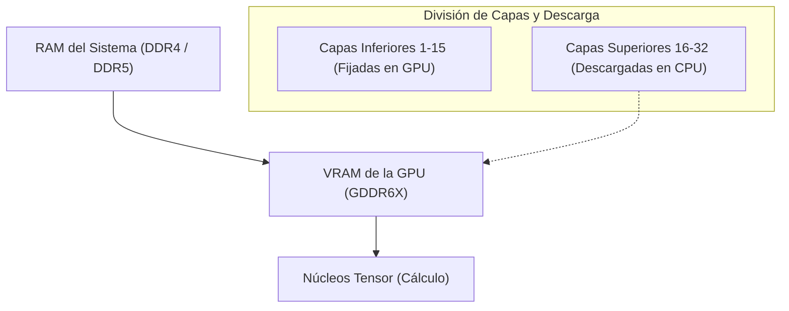
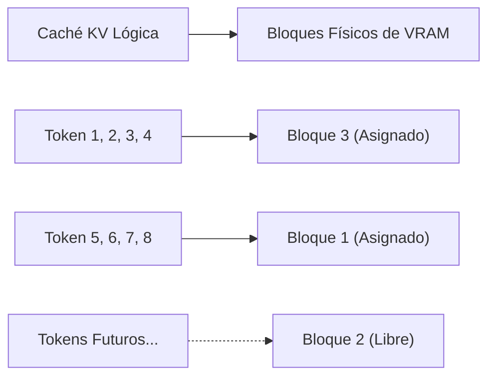
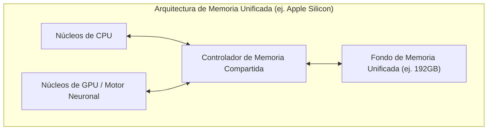
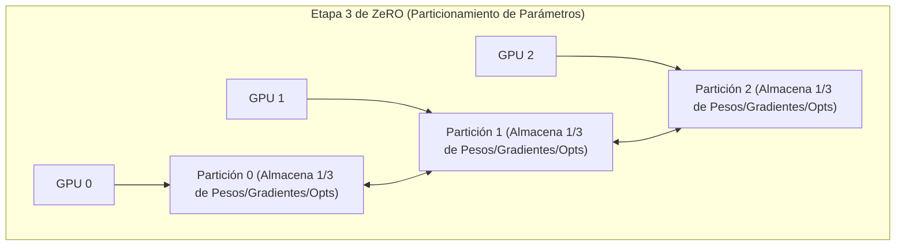

# Introducción: El desarrollo de IA y el "Muro de la VRAM"

En los últimos años, tecnologías de IA generativa como los Grandes Modelos de Lenguaje (LLM) y los Modelos de Difusión (Diffusion Models) han experimentado un rápido desarrollo. Sin embargo, al entrenar (ajuste fino / fine-tuning) o ejecutar la inferencia (Inference) de estos modelos de IA de vanguardia en entornos locales, muchos desarrolladores e investigadores se enfrentan a una barrera extremadamente física: **la falta de memoria de GPU (VRAM)**.

Incluso con las GPUs de gama alta para consumidores, como la NVIDIA GeForce RTX 4090, la VRAM máxima es de 24 GB, lo que hace completamente imposible cargar directamente modelos gigantescos como Llama 3 70B. Las opciones orientadas a centros de datos, como la H100 (80 GB) o la B200 (192 GB), son extremadamente costosas y no están fácilmente al alcance de individuos o equipos pequeños. Si no se puede atravesar este "Muro de la VRAM (The Wall of VRAM)", ni siquiera será posible experimentar con los modelos más avanzados.

En este artículo, explicaremos exhaustivamente desde la perspectiva tanto de la inferencia como del entrenamiento, las técnicas avanzadas para superar esta restricción física de la VRAM mediante ingenios en la arquitectura de software y hardware. Profundizaremos usando fórmulas matemáticas e ilustraciones en temas como la descarga de CPU, la optimización de la caché KV, los puntos de control de gradiente (Gradient Checkpointing) y las arquitecturas más recientes de memoria unificada (Unified Memory). Al leer este artículo, comprenderás profundamente el comportamiento de la VRAM y adquirirás conocimientos prácticos para manejar modelos gigantescos con recursos limitados.

---

# 1. Anatomía del consumo de VRAM de los modelos de IA (Inferencia y Entrenamiento)

El primer paso para resolver la escasez de VRAM es comprender con precisión "qué" y "cuánta" memoria se está consumiendo desde una perspectiva microscópica. Si en lugar de tratarlo como una caja negra podemos estimarlo con precisión utilizando fórmulas matemáticas, podremos seleccionar los métodos de optimización adecuados.

## 1.1 Cálculo de memoria de los parámetros del modelo (pesos)

La cantidad básica de memoria consumida por los parámetros (Weights) que componen un modelo de IA se determina por el número total de parámetros del modelo y el tipo de datos (Precision: precisión) utilizado para representarlos.

Los tipos de datos comúnmente utilizados en el aprendizaje profundo y el número de bytes por parámetro ($B$) son los siguientes:
- **FP32 (Punto flotante de precisión simple):** 4 bytes (precisión estándar durante el entrenamiento)
- **FP16 / BF16 (Punto flotante de media precisión):** 2 bytes (inferencia general y entrenamiento de precisión mixta)
- **INT8 (Entero de 8 bits):** 1 byte (modelos cuantizados)
- **INT4 (Cuantización de enteros de 4 bits):** 0.5 bytes (cuantización extrema como GPTQ, AWQ, GGUF)

Si el número de parámetros de todo el modelo es $P$, la cantidad base de memoria $M_{weights}$ ocupada por los pesos en sí se expresa con la siguiente fórmula:

$$ M_{weights} = P \times B $$

Por ejemplo, si cargamos el modelo "Llama 3 8B" (aproximadamente 8 mil millones de parámetros) publicado por Meta en FP16 (media precisión), el cálculo sería el siguiente:

$$ M_{weights} = 8,000,000,000 \times 2 \text{ bytes} \approx 16,000,000,000 \text{ bytes} \approx 16 \text{ GB} $$

Es decir, simplemente cargar los pesos del modelo en la GPU consume 16 GB de VRAM. En una RTX 3060 (12 GB), se produciría un error de Out of Memory (OOM) en este punto. Sin embargo, si cuantizamos el modelo a INT4, pasaría a ser de $8 \times 0.5 = 4 \text{ GB}$, lo que permitiría cargarlo sin problemas.

## 1.2 Consumo de memoria durante la inferencia: Aumento de la caché KV

En la inferencia de LLMs (especialmente en la generación de texto autorregresiva), lo que presiona la VRAM con tanta o mayor intensidad que los pesos es la **caché KV (Key-Value Cache)**.
En la arquitectura Transformer, para evitar recalcular la información de los tokens generados y procesados en el pasado, los tensores Key y Value de cada capa de atención se mantienen en caché en la VRAM. Esto mejora la velocidad de cálculo (Compute), pero a medida que la longitud del contexto (longitud del prompt de entrada + longitud de generación) aumenta, el consumo de memoria crece linealmente de forma explosiva.

La cantidad de memoria de la caché KV consumida al procesar 1 token, $M_{kv\_token}$, se calcula estrictamente con la siguiente fórmula, basándose en la arquitectura del modelo:

$$ M_{kv\_token} = 2 \times N_{layers} \times N_{heads\_kv} \times D_{head} \times B $$

Aquí, cada variable tiene el siguiente significado:
- $2$ : Porque existen dos tensores, Key y Value
- $N_{layers}$ : Número de capas (layers) del Transformer
- $N_{heads\_kv}$ : Número de cabezales de atención KV (en el caso de GQA: Grouped Query Attention, será menor que el número habitual de cabezales)
- $D_{head}$ : Dimensionalidad de cada cabezal (generalmente, la dimensión de la capa oculta $D_{model} / N_{heads}$)
- $B$ : Número de bytes del tipo de datos (2 en el caso de FP16)

La cantidad total de caché KV, $M_{kv\_total}$, es el resultado de multiplicar esto por la longitud de la secuencia ($L_{seq}$) y el tamaño del lote ($BatchSize$).

$$ M_{kv\_total} = M_{kv\_token} \times L_{seq} \times BatchSize $$

**Ejemplo concreto: En el caso de Llama 2 7B**
- $N_{layers} = 32$
- $N_{heads\_kv} = 32$ (En el caso de MHA)
- $D_{head} = 128$
- FP16 ($B=2$)
- Tamaño del lote 1, longitud de secuencia 8192 (contexto de 8K)

$$ M_{kv\_total} = 2 \times 32 \times 32 \times 128 \times 2 \times 8192 \times 1 = 4,294,967,296 \text{ bytes} \approx 4 \text{ GB} $$

Si ampliáramos el contexto a 32K (32768 tokens), consumiría aproximadamente 16 GB solo en la caché KV. Si aumentáramos el tamaño del lote a 4, serían 64 GB. El hecho de que empiece a exigir mucha más VRAM que el propio tamaño del modelo es uno de los grandes retos durante la inferencia.

## 1.3 Consumo de memoria durante el entrenamiento: Optimizador, gradientes y activaciones

En comparación con la inferencia, el entrenamiento de un modelo (preentrenamiento o ajuste fino) consume mucha más VRAM. Esto se debe a que es necesario retener no solo información del paso hacia adelante (propagación hacia adelante), sino también de la propagación hacia atrás (backpropagation). La memoria durante el entrenamiento se compone principalmente de los siguientes cuatro elementos:

1. **Pesos del modelo (Model Weights):** Similar a la inferencia, pero en el entrenamiento de precisión mixta, se pueden retener tanto los de FP16 como los de FP32 (pesos maestros).
2. **Gradientes (Gradients):** Gradientes calculados en la retropropagación por cada parámetro. En el caso de FP16, son 2 bytes por parámetro.
3. **Estados del optimizador (Optimizer States):** Optimizadores avanzados como AdamW mantienen un primer momento (Momentum) y un segundo momento (Variance) para cada parámetro. Para mantener la estabilidad del entrenamiento, estos se almacenan generalmente en FP32 (4 bytes). Es decir, consumen $4 + 4 = 8$ bytes/parámetro por los dos momentos.
4. **Activaciones (Activations):** Para el cálculo de los gradientes de retropropagación, es necesario conservar en la memoria la salida (estado intermedio) de cada capa obtenida durante la propagación hacia adelante. Esto depende enormemente del tamaño del lote y de la longitud de la secuencia, y puede volverse muy grande.

En resumen, en el entrenamiento de precisión mixta (Mixed Precision Training) utilizando el optimizador estándar de Adam, se requieren **aproximadamente entre 16 y 20 bytes** por parámetro (4 de peso maestro + 2 de peso FP16 + 2 de gradiente + 8 del optimizador + α).

$$ M_{train\_param} \approx P \times 16 \text{ bytes} $$

Para entrenar un modelo de 7B (7 mil millones de parámetros), solo en aspectos relacionados con los parámetros se necesitarían $7B \times 16 = 112 \text{ GB}$, y al sumarle las activaciones, el cálculo arroja un sorprendente requerimiento de más de 140 GB de VRAM. Para ejecutar esto en una VRAM de 24 GB, es indispensable utilizar las agresivas técnicas de optimización que se explican a partir del próximo capítulo.

---

# 2. Técnicas para el ahorro de VRAM en la inferencia

Se han desarrollado muchas técnicas de software que traspasan los límites del hardware como enfoque para ejecutar modelos gigantescos durante la inferencia.

## 2.1 Descarga de CPU (CPU Offloading) y división de capas

Cuando un modelo masivo no cabe en una o varias GPUs, la técnica de colocar una parte del modelo en la memoria del sistema (CPU RAM) y avanzar en los cálculos transfiriendo a la GPU solo cuando es necesario se conoce como **descarga de CPU (CPU Offloading)**. Herramientas como `llama.cpp` y `Accelerate` de Hugging Face soportan esta funcionalidad.



**Mecanismo y desafíos:**
Dado que los modelos Transformer tienen una estructura donde las capas (layers) se apilan en serie, el cálculo de una capa no comienza hasta que termina el de la capa anterior. Aprovechando esto, solo las capas que caben en la GPU (por ejemplo, de la capa 1 a la 15) se mantienen residentes (fijadas) en la VRAM, mientras que el resto de las capas (de la 16 a la 32) se alojan en la RAM de la CPU, que es de gran capacidad pero más lenta. Durante la inferencia, al terminar los cálculos hasta la capa 15, los pesos de la capa 16 se transfieren (copian) desde la CPU a la GPU a través del bus PCIe, y el cálculo se ejecuta en la GPU.

Sin embargo, **el ancho de banda (Bandwidth) del PCIe se convierte en un enorme cuello de botella**. El ancho de banda máximo teórico del PCIe 4.0 x16 es de 32 GB/s (unidireccional), pero en comparación con el ancho de banda interno de la VRAM de las GPUs más recientes (por ejemplo, 1008 GB/s en la GDDR6X de la RTX 4090 y más de 3 TB/s en la HBM3 de la H100), es dos órdenes de magnitud más lento, por lo que el uso intensivo de la descarga de CPU reduce drásticamente la velocidad de inferencia (Tokens por Segundo).
Para minimizar la pérdida de velocidad, el punto práctico clave es colocar tantas capas como sea posible en la GPU (maximizar las capas de GPU) y reducir al mínimo las capas descargadas.

## 2.2 Cuantización de la caché KV y PagedAttention

Contra la caché KV, principal culpable del consumo de VRAM durante la inferencia, también se aplican dos potentes optimizaciones.

**1. Cuantización de la caché KV (KV Cache Quantization):**
Es una técnica donde no solo los pesos del modelo, sino también la propia caché KV generada dinámicamente en tiempo de ejecución, se cuantiza a INT8, INT4 o FP8 para almacenarla en la VRAM. Esto permite reducir el tamaño de la caché KV entre la mitad y la cuarta parte. Los motores de inferencia más recientes (vLLM, llama.cpp) incorporan esta funcionalidad, logrando un ahorro significativo de VRAM mientras mantienen al mínimo la degradación de la precisión.

**2. PagedAttention:**
La aplicación del concepto de "paginación" de la memoria virtual de los sistemas operativos a la caché KV es lo que se conoce como **PagedAttention**, introducido por el motor de inferencia vLLM. En los motores de inferencia convencionales, se reservaba de antemano un área continua de VRAM (Preasignación) de acuerdo con la longitud máxima de secuencia configurada. Por ello, cuando la entrada real era más corta, se producía fragmentación y un desperdicio de la memoria no utilizada, llegando a derrochar más del 60% de la VRAM.

PagedAttention permite dividir la caché KV en bloques (páginas) de tamaño fijo y distribuirlos y almacenarlos en espacios no contiguos de memoria física. Esto reduce casi a cero el desperdicio de memoria (limitándolo solo a la fragmentación interna) y permite aumentar significativamente el tamaño del lote con la misma capacidad de VRAM.



## 2.3 FlashAttention: Superando la complejidad de memoria en el cálculo de atención

La escasez de VRAM no solo se produce por la cantidad de memoria para almacenar datos, sino también por la falta de un "espacio de trabajo temporal" durante los cálculos. El mecanismo de Self-Attention estándar del Transformer requiere materializar (instanciar) una matriz de atención gigante de $N \times N$ en la VRAM para una longitud de secuencia $N$. Esto resulta en una complejidad de memoria de $O(N^2)$, siendo la causa principal del OOM en contextos extensos.

Quien resolvió esto fue **FlashAttention** (y FlashAttention-2, 3).
FlashAttention es un algoritmo diseñado teniendo en cuenta la arquitectura de hardware de la GPU (la estructura jerárquica de la enorme pero lenta HBM y la diminuta pero ultrarrápida SRAM). Utiliza una técnica llamada mosaico (Tiling) que carga los datos en la SRAM por bloques para completar los cálculos de atención, evitando por completo el proceso de escribir la matriz de $N \times N$ en la HBM (VRAM).

Gracias a esto, la complejidad de memoria en las capas de atención se redujo drásticamente de $O(N^2)$ a $O(N)$ (proporcional a la longitud de la secuencia), lo que alivió significativamente los límites en la longitud del contexto.

## 2.4 El ascenso de la Memoria Unificada (Unified Memory) y Apple Silicon

Quienes están abordando este problema desde las raíces de la arquitectura del PC son aquellos que han adoptado la **Arquitectura de Memoria Unificada (Unified Memory Architecture: UMA)**, como Apple Silicon (las series Max y Ultra de M1/M2/M3/M4) y algunas APU recientes (como AMD Strix Point).

En estas arquitecturas, la CPU y la GPU en la placa base comparten exactamente la misma memoria física (por ejemplo, hasta 192 GB de LPDDR5). Por lo tanto, el concepto de una "transferencia lenta de datos desde la CPU a la GPU a través del PCIe" simplemente no existe físicamente.



La mayor ventaja de esta arquitectura es que no hay un límite estricto de VRAM, lo que permite utilizar casi toda la memoria del sistema directamente para cargar LLMs masivos. Con una Mac Studio que cuenta con 192 GB de memoria unificada, es posible cargar modelos gigantescos de la clase 70B o superiores (como Grok-1) sin cuantizar en un solo dispositivo e inferir rápidamente. El ancho de banda de acceso a memoria también alcanza los 800 GB/s en el M2 Ultra, presumiendo de velocidades comparables a las de las GPUs discretas para consumidores. Es un enfoque extremadamente poderoso que resuelve el dilema entre "capacidad de memoria" y "ancho de banda" a nivel de hardware.

---

# 3. Técnicas para el ahorro de VRAM en el entrenamiento (Ajuste fino)

Durante el entrenamiento (Training), que requiere aún más VRAM que la inferencia, también han surgido numerosos avances. Para realizar el ajuste fino con recursos limitados, es fundamental combinar las siguientes tecnologías.

## 3.1 Puntos de control de gradiente (Gradient Checkpointing)

En la retropropagación (backpropagation) del aprendizaje profundo, es necesario retener en la memoria las salidas intermedias (Activations) de todas las capas de la propagación hacia adelante para poder calcular los gradientes. Cuando la longitud de la secuencia o el tamaño del lote aumentan, esta memoria de activaciones comienza a dominar la VRAM.

**Los Puntos de control de gradiente (Gradient Checkpointing / Activation Recomputation)** son una técnica genial que aprovecha el equilibrio entre la capacidad de memoria y el tiempo de cálculo (Compute).
En lugar de guardar todas las salidas intermedias en la memoria, solo se guardan las salidas de capas específicas (puntos de control). Durante la retropropagación, si se necesita un valor intermedio que no fue guardado en un punto de control, **se vuelve a calcular la propagación hacia adelante (recálculo) desde el punto de control guardado más cercano para restaurar ese valor**.

Aunque la cantidad de cálculo aumenta en aproximadamente un 20 a 30% y el tiempo total de entrenamiento se alarga, se logra reducir drásticamente el consumo de VRAM debido a las activaciones, pasando de $O(N)$ (donde $N$ es el número de capas) a $O(\sqrt{N})$. En el entrenamiento de grandes modelos en la actualidad, es un parámetro de configuración tan imprescindible que se podría decir que no se puede empezar sin él.

## 3.2 LoRA y QLoRA (Adaptación de Bajo Rango)

El principal artífice que resolvió el problema de la escasez de VRAM de raíz es **LoRA**, la técnica más representativa de PEFT (Ajuste Fino Eficiente en Parámetros / Parameter-Efficient Fine-Tuning).

Se congela (Frozen) la enorme matriz de pesos original del modelo $W_0 \in \mathbb{R}^{d \times k}$, de modo que no sea entrenada. En su lugar, se introducen en paralelo dos matrices de bajo rango muy pequeñas, $A \in \mathbb{R}^{r \times k}$ y $B \in \mathbb{R}^{d \times r}$, y se entrena únicamente a $A$ y $B$. (Aquí, el rango $r$ es un valor pequeño tal que $r \ll d, k$).

$$ W_{adapted} = W_0 + \Delta W = W_0 + B A $$

Con esto, la cantidad de parámetros a entrenar se reduce a menos del 1% (a veces menos del 0.1%) del original y, consecuentemente, los "gradientes" y los "estados del optimizador" que devoraban memoria también caen de manera drástica a menos del 1%.

Además, **QLoRA (Quantized LoRA)** lleva esto a su máxima evolución.
En QLoRA, los pesos del modelo base $W_0$ se cuantizan al extremo en 4 bits (formato NF4: NormalFloat4) para cargarse en la VRAM. Luego, las pequeñas matrices $A, B$ de LoRA se entrenan en BF16 (16 bits) para conservar la precisión de los cálculos.

Mientras que la cuantización de 4 bits reduce el tamaño en VRAM del modelo base a un cuarto del original, se emplea una técnica llamada **Paged Optimizers** (optimizadores paginados) que, en caso de que la VRAM esté a punto de agotarse, automáticamente resguarda temporalmente (descarga) el estado del optimizador en la RAM de la CPU. De este modo, incluso con una única GPU de 24 GB de VRAM (como la RTX 4090), se hizo posible el ajuste fino de modelos supermasivos como Llama 3 70B.

## 3.3 DeepSpeed ZeRO y la Descarga (Offloading)

En entornos donde se usan múltiples GPUs (Multi-GPU), la mera paralelización de datos (Data Parallelism) no resuelve el problema de la VRAM. Esto se debe a que, como cada GPU conserva una copia entera del modelo, no se puede superar el límite individual de la capacidad de cada VRAM.

**ZeRO (Zero Redundancy Optimizer)**, de la librería **DeepSpeed** desarrollada por Microsoft, es una técnica que divide (fragmenta) exhaustivamente los parámetros, gradientes y estados del optimizador del modelo a lo largo de varias GPUs. Esto permite tratar la "suma total" de la VRAM de múltiples GPUs como un único y gigantesco fondo de memoria.



- **Etapa 1 de ZeRO:** Se dividen los estados del optimizador en cada GPU
- **Etapa 2 de ZeRO:** También se dividen los gradientes en cada GPU
- **Etapa 3 de ZeRO:** Los propios parámetros del modelo (pesos) también se dividen en cada GPU

Además, al emplear una función llamada **ZeRO-Offload**, se puede **descargar (offload) en la memoria de la CPU** el cálculo de actualización de los gradientes y el estado del optimizador particionado por ZeRO, de forma que los ejecute la CPU anfitriona en lugar de la GPU. Gracias a esto, la carga de la VRAM de la GPU se reduce al mínimo, permitiendo el entrenamiento de modelos masivos incluso en entornos con GPUs limitadas. Puesto que los cálculos se realizan en la CPU y los resultados se devuelven a la GPU a través de PCIe, la velocidad de entrenamiento disminuye, pero así se evita la peor situación posible: que el "entrenamiento colapse por falta de memoria".

---

# 4. Ejemplos de implementación: Accelerate de Hugging Face y DeepSpeed

Para concluir, mostraremos un ejemplo sencillo de cómo implementar realmente la descarga de CPU y la optimización de VRAM mediante código en Python.

## 4.1 Descarga automática con `device_map="auto"` en Hugging Face

Con las librerías `transformers` y `accelerate` de Hugging Face, al cargar un modelo, las capas se pueden dividir automáticamente entre la GPU y la CPU.

```python
from transformers import AutoModelForCausalLM, AutoTokenizer

model_id = "meta-llama/Llama-2-13b-hf"

# Mediante device_map="auto", lo que no quepa en la VRAM se descarga en la RAM de la CPU
# Con load_in_8bit=True, se cuantizan los pesos a 8 bits, permitiendo mayor ahorro de memoria
model = AutoModelForCausalLM.from_pretrained(
    model_id,
    device_map="auto",
    load_in_8bit=True,
    offload_folder="offload_dir" # Si hace falta, es posible descargar incluso en disco (SSD)
)
```

Al ejecutar este código, la librería `accelerate` en segundo plano analizará el espacio libre disponible en la VRAM del sistema y en la RAM de la CPU, acomodando (Dispatch) las capas de la forma más óptima.

## 4.2 Configuración de descarga de CPU en DeepSpeed (ZeRO-2)

A continuación, un ejemplo de un archivo de configuración (JSON) para activar la descarga de CPU con DeepSpeed durante el entrenamiento.

```json
{
  "fp16": {
    "enabled": true
  },
  "zero_optimization": {
    "stage": 2,
    "offload_optimizer": {
      "device": "cpu",
      "pin_memory": true
    },
    "allgather_partitions": true,
    "allgather_bucket_size": 2e8,
    "overlap_comm": true,
    "reduce_scatter": true,
    "reduce_bucket_size": 2e8,
    "contiguous_gradients": true
  },
  "train_batch_size": 16,
  "gradient_accumulation_steps": 4
}
```
Con esta configuración, al especificar `"cpu"` en `offload_optimizer`, se obliga a que el mantenimiento del estado y los cálculos de actualización del optimizador (como Adam), que consumen una inmensa cantidad de VRAM, sean ejecutados por la CPU del sistema. Esto permite que la VRAM de la GPU se dedique en exclusiva a la tarea más importante: los cálculos de propagación hacia adelante y hacia atrás del modelo. Al establecer `pin_memory: true`, se previenen los fallos de página (page faults), acelerando al máximo posible las transferencias de PCIe entre la CPU y la GPU.

---

# Resumen

La escasez de memoria de GPU (Out of Memory) en el desarrollo de IA será un desafío eterno que seguirá acompañando a los desarrolladores a medida que los modelos aumenten de escala. Sin embargo, al combinar de forma adecuada una profunda comprensión del hardware (arquitectura) con técnicas de optimización a nivel algorítmico y de software como las explicadas en este artículo, se hace posible la inferencia y el entrenamiento de modelos masivos en un entorno local, algo que a primera vista podría parecer imposible.

**Resumen de contramedidas durante la inferencia:**
1. **Cuantización (INT4 / INT8 / FP8):** Comprime drásticamente el tamaño del modelo en sí y reduce la ocupación de VRAM.
2. **Descarga de CPU (CPU Offloading):** Traslada a la memoria del sistema las capas que no caben en la VRAM (asumiendo un compromiso con la pérdida de velocidad debida al ancho de banda del PCIe).
3. **Optimización de la caché KV:** Se utiliza la paginación (PagedAttention), la cuantización de caché y FlashAttention para asegurar la longitud de contexto (Context Length).
4. **Aprovechamiento de la memoria unificada:** Se utiliza la UMA de arquitecturas como Apple Silicon para emplear grandes capacidades de memoria de forma directa en la inferencia.

**Resumen de contramedidas durante el entrenamiento:**
1. **PEFT (LoRA / QLoRA):** Se limita el número de parámetros a entrenar y se cuantiza el modelo base al máximo.
2. **Puntos de control de gradiente (Gradient Checkpointing):** Se desechan las salidas intermedias de la propagación hacia adelante y se recalculan durante la retropropagación, conteniendo así el consumo de VRAM a cambio de un mayor tiempo de cálculo.
3. **ZeRO y descarga de CPU (DeepSpeed):** Supera los límites de VRAM dividiendo el estado del optimizador y los gradientes en múltiples GPUs, o descargándolos en la memoria de la CPU.

Al aprovechar al máximo estas tecnologías avanzadas, logremos extraer el mayor rendimiento posible en el desarrollo de IA dentro de unos recursos de hardware limitados. En este campo, que avanza a pasos agigantados día con día, es de esperar que en el futuro sigan apareciendo nuevos algoritmos para ahorrar memoria. La clave estará en revisar periódicamente las novedades en las últimas librerías y adoptarlas en nuestras implementaciones.

