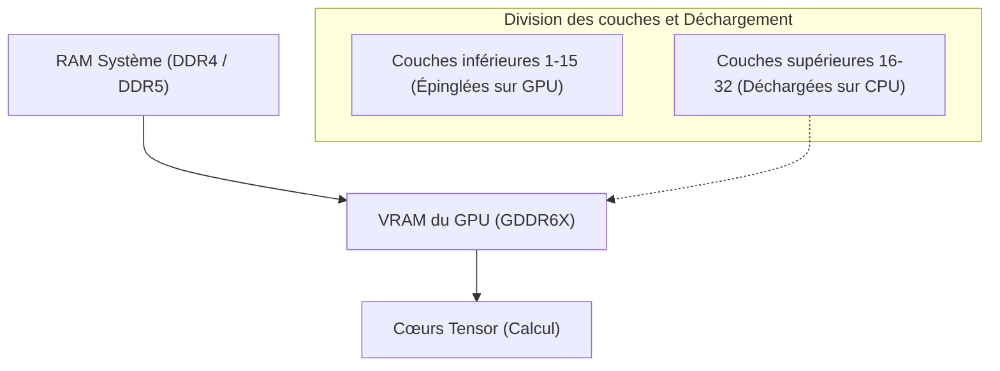
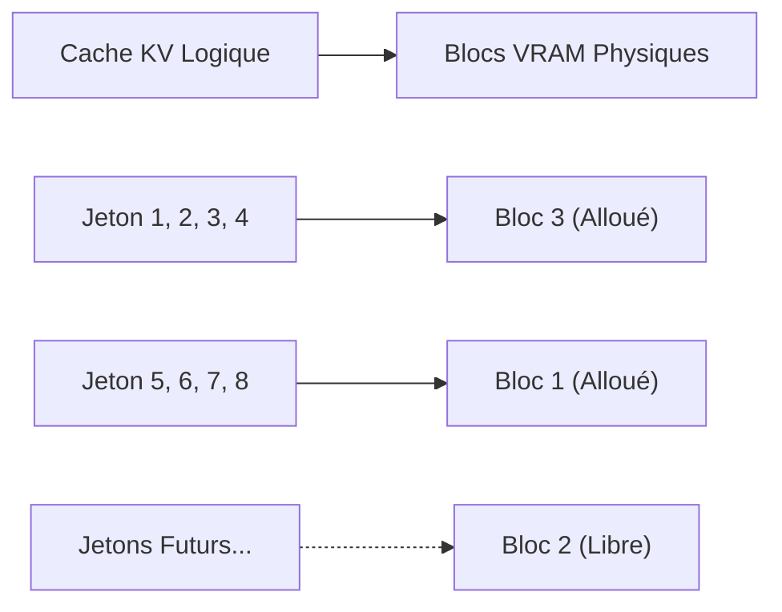
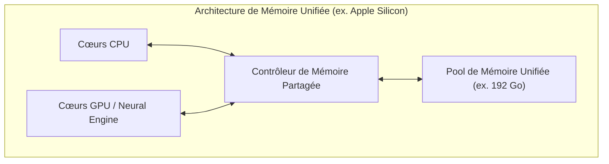
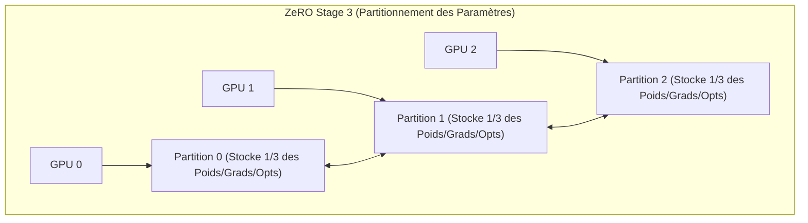

# Introduction : Le développement de l'IA et le "Mur de la VRAM"

Ces dernières années, les technologies d'IA générative telles que les grands modèles de langage (LLM) et les modèles de diffusion (Diffusion Models) ont connu un développement rapide. Cependant, lors de l'apprentissage (fine-tuning) ou de l'exécution de l'inférence (Inference) de ces modèles d'IA de pointe dans un environnement local, de nombreux développeurs et chercheurs sont confrontés à un obstacle extrêmement physique : **le "manque de mémoire GPU (VRAM)"**.

Même avec un GPU haut de gamme grand public comme le NVIDIA GeForce RTX 4090, la VRAM maximale est de 24 Go, ce qui rend impossible le chargement d'un modèle gigantesque comme Llama 3 70B tel quel. Les GPU destinés aux centres de données tels que le H100 (80 Go) ou le B200 (192 Go) sont très coûteux et ne sont pas facilement accessibles aux individus ou aux petites équipes. Si l'on ne parvient pas à franchir ce "Mur de la VRAM (The Wall of VRAM)", il est même impossible de toucher aux modèles de pointe.

Cet article explique en profondeur les techniques avancées, tant du côté de l'inférence que de l'apprentissage, pour surmonter cette contrainte physique de limitation de VRAM grâce à l'ingéniosité de l'architecture matérielle et logicielle. Nous explorerons en détail le déchargement CPU (CPU Offloading), l'optimisation du cache KV, les points de contrôle de gradient (Gradient Checkpointing) et la toute dernière architecture de mémoire unifiée (Unified Memory), le tout illustré par des formules mathématiques et des diagrammes. La lecture de cet article vous permettra de comprendre en profondeur le comportement de la VRAM et d'acquérir des connaissances pratiques pour manipuler des modèles gigantesques avec des ressources limitées.

---

# 1. Anatomie de la consommation de VRAM des modèles d'IA (Inférence et Apprentissage)

La première étape pour résoudre le manque de VRAM consiste à comprendre précisément "ce qui" consomme la mémoire et "dans quelle proportion", d'un point de vue microscopique. Plutôt que de la traiter comme une boîte noire, si nous pouvons l'estimer avec précision à l'aide de formules mathématiques, nous pourrons choisir la méthode d'optimisation appropriée.

## 1.1 Calcul de la mémoire des paramètres du modèle (Poids)

La quantité de mémoire de base consommée par les paramètres (Weights) qui composent un modèle d'IA est déterminée par le nombre total de paramètres du modèle et le type de données (Precision : précision) utilisé pour les représenter.

Les types de données couramment utilisés en Deep Learning et le nombre d'octets par paramètre ($B$) sont les suivants :
- **FP32 (Nombre à virgule flottante simple précision) :** 4 octets (précision standard lors de l'apprentissage)
- **FP16 / BF16 (Nombre à virgule flottante demi-précision) :** 2 octets (inférence générale et apprentissage en précision mixte)
- **INT8 (Entier 8 bits) :** 1 octet (modèles quantifiés)
- **INT4 (Quantification entière 4 bits) :** 0,5 octet (quantification extrême comme GPTQ, AWQ, GGUF)

Si le nombre total de paramètres du modèle est $P$, la quantité de mémoire de base occupée par les poids eux-mêmes $M_{weights}$ est exprimée par la formule suivante :

$$ M_{weights} = P \times B $$

Par exemple, si l'on charge le modèle "Llama 3 8B" publié par Meta (environ 8 milliards de paramètres) en FP16 (demi-précision), le calcul est le suivant :

$$ M_{weights} = 8,000,000,000 \times 2 \text{ octets} \approx 16,000,000,000 \text{ octets} \approx 16 \text{ Go} $$

En d'autres termes, le simple chargement des poids du modèle dans le GPU consomme 16 Go de VRAM. Avec une RTX 3060 (12 Go), une erreur "Out of Memory" (OOM) se produirait à ce stade. Cependant, si le modèle est quantifié en INT4, cela devient $8 \times 0.5 = 4 \text{ Go}$, ce qui permet de le charger avec de la marge.

## 1.2 Consommation de mémoire lors de l'inférence : l'augmentation du cache KV

Lors de l'inférence des LLM (en particulier la génération de texte autorégressive), le **cache KV (Key-Value Cache)** exerce une pression sur la VRAM aussi forte, voire plus forte, que les poids eux-mêmes.
Dans l'architecture Transformer, afin d'éviter de recalculer les informations des jetons (tokens) générés et traités précédemment, les tenseurs Key et Value de chaque couche d'attention continuent d'être mis en cache dans la VRAM. Cela améliore la vitesse de calcul (Compute), mais à mesure que la longueur du contexte (longueur du prompt d'entrée + longueur générée) augmente, la consommation de mémoire augmente de manière linéaire et explosive.

La quantité de mémoire du cache KV consommée lors du traitement d'un jeton $M_{kv\_token}$ est calculée de manière stricte par la formule suivante en fonction de l'architecture du modèle :

$$ M_{kv\_token} = 2 \times N_{layers} \times N_{heads\_kv} \times D_{head} \times B $$

Ici, chaque variable a la signification suivante :
- $2$ : Car il existe deux tenseurs, Key et Value
- $N_{layers}$ : Nombre de couches (layers) du Transformer
- $N_{heads\_kv}$ : Nombre de têtes d'attention KV (Dans le cas du GQA : Grouped Query Attention, ce nombre est inférieur au nombre de têtes normales)
- $D_{head}$ : Nombre de dimensions de chaque tête (généralement, le nombre de dimensions de la couche cachée $D_{model} / N_{heads}$)
- $B$ : Nombre d'octets du type de données (2 pour FP16)

La taille totale du cache KV $M_{kv\_total}$ est obtenue en multipliant cela par la longueur de la séquence ($L_{seq}$) et la taille du lot ($BatchSize$).

$$ M_{kv\_total} = M_{kv\_token} \times L_{seq} \times BatchSize $$

**Exemple concret : Cas de Llama 2 7B**
- $N_{layers} = 32$
- $N_{heads\_kv} = 32$ (Dans le cas du MHA)
- $D_{head} = 128$
- FP16 ($B=2$)
- Taille du lot 1, longueur de la séquence 8192 (contexte 8K)

$$ M_{kv\_total} = 2 \times 32 \times 32 \times 128 \times 2 \times 8192 \times 1 = 4,294,967,296 \text{ octets} \approx 4 \text{ Go} $$

Si l'on allongeait le contexte à 32K (32768 jetons), le cache KV à lui seul consommerait environ 16 Go. Si l'on augmente la taille du lot à 4, cela fait 64 Go. C'est l'un des défis majeurs de l'inférence : l'exigence d'une VRAM bien plus gigantesque que la taille du modèle lui-même.

## 1.3 Consommation de mémoire lors de l'apprentissage : Optimiseur, Gradients et Activations

Comparé à l'inférence, l'apprentissage d'un modèle (pré-entraînement ou fine-tuning) consomme beaucoup plus de VRAM. Cela est dû au fait qu'il est nécessaire de conserver des informations non seulement pour une simple propagation avant (forward pass), mais aussi pour la rétropropagation (backpropagation). La mémoire d'apprentissage est principalement composée des 4 éléments suivants :

1. **Poids du modèle (Model Weights) :** Similaire à l'inférence, mais dans l'apprentissage en précision mixte, on peut conserver à la fois le FP16 et le FP32 (Master Weights).
2. **Gradients (Gradients) :** Les gradients pour chaque paramètre calculés lors de la rétropropagation. 2 octets par paramètre dans le cas du FP16.
3. **États de l'optimiseur (Optimizer States) :** Les optimiseurs avancés comme AdamW maintiennent le premier moment (Momentum) et le deuxième moment (Variance) pour chaque paramètre. Pour maintenir la stabilité de l'apprentissage, ceux-ci sont généralement conservés en FP32 (4 octets). Cela signifie que les deux moments consomment $4 + 4 = 8$ octets par paramètre.
4. **Activations (Activations) :** Afin de calculer les gradients lors de la rétropropagation, la sortie de chaque couche (état intermédiaire) lors de la propagation avant doit être conservée en mémoire. Cela dépend fortement de la taille du lot et de la longueur de la séquence, et devient très volumineux.

En résumé, dans un apprentissage en précision mixte (Mixed Precision Training) utilisant l'optimiseur Adam standard, **environ 16 à 20 octets** (Poids principal 4 + Poids FP16 2 + Gradient 2 + Optimiseur 8 + α) de mémoire sont requis par paramètre.

$$ M_{train\_param} \approx P \times 16 \text{ octets} $$

Pour l'apprentissage d'un modèle de 7B (7 milliards de paramètres), la partie liée aux paramètres consomme à elle seule $7B \times 16 = 112 \text{ Go}$. Avec les activations ajoutées à cela, le calcul montre qu'il faudrait plus de 140 Go de VRAM. Pour exécuter cela avec 24 Go de VRAM, les techniques d'optimisation radicales expliquées dans les chapitres suivants sont indispensables.

---

# 2. Techniques d'économie de VRAM lors de l'inférence

Pour faire fonctionner de gigantesques modèles lors de l'inférence, de nombreuses technologies logicielles franchissant les limites matérielles ont été développées.

## 2.1 Déchargement CPU (CPU Offloading) et division des couches

Lorsqu'un modèle trop volumineux ne tient pas dans un ou plusieurs GPU, la méthode consistant à placer une partie du modèle dans la mémoire système (RAM CPU) et à la transférer vers le GPU pour effectuer les calculs uniquement lorsque cela est nécessaire s'appelle le **déchargement CPU (CPU Offloading)**. `llama.cpp` et `Accelerate` de Hugging Face prennent en charge cette fonctionnalité.



**Mécanismes et Défis :**
Comme le modèle Transformer a une structure où les couches (layers) sont empilées en série, le calcul de la couche suivante ne commencera pas avant que le calcul d'une couche soit terminé. En tirant parti de cela, seules les couches qui rentrent dans le GPU (par exemple, couches 1 à 15) sont rendues résidentes (épinglées) dans la VRAM, tandis que les couches restantes (couches 16 à 32) sont placées dans la RAM CPU de grande capacité mais lente. Pendant l'inférence, une fois les calculs jusqu'à la 15ème couche terminés, les poids de la 16ème couche sont transférés (copiés) du CPU vers le GPU via le bus PCIe, et les calculs sont exécutés sur le GPU.

Cependant, **la bande passante (Bandwidth) du PCIe constitue un goulet d'étranglement sévère**. La bande passante maximale théorique du PCIe 4.0 x16 est de 32 Go/s (unidirectionnelle), mais comparée à la bande passante interne de la VRAM des derniers GPU (par exemple, la GDDR6X de la RTX 4090 est de 1008 Go/s, et la HBM3 de la H100 dépasse les 3 To/s), elle est deux ordres de grandeur plus lente. L'utilisation intensive du déchargement CPU réduit donc drastiquement la vitesse d'inférence (Tokens per Second).
Pour minimiser la perte de vitesse, la clé en pratique est de placer autant de couches que possible dans le GPU (maximisation des GPU Layers) et de minimiser les couches à décharger.

## 2.2 Quantification du cache KV et PagedAttention

Deux puissantes optimisations sont également appliquées au cache KV, qui est le principal coupable de la consommation de VRAM lors de l'inférence.

**1. Quantification du cache KV (KV Cache Quantization) :**
C'est une méthode permettant de quantifier non seulement les poids du modèle, mais aussi le cache KV lui-même, généré dynamiquement à l'exécution, en INT8, INT4 ou FP8 pour le stocker dans la VRAM. Cela permet de réduire la taille du cache KV de moitié, voire au quart. Les moteurs d'inférence récents (vLLM, llama.cpp) intègrent cette fonctionnalité, permettant d'économiser massivement la VRAM tout en minimisant la perte de précision.

**2. PagedAttention :**
L'application du concept de "pagination" de la mémoire virtuelle du système d'exploitation au cache KV est appelée **PagedAttention**, introduite par le moteur d'inférence vLLM. Dans les moteurs d'inférence classiques, des zones de VRAM contiguës étaient préalablement réservées (Pre-allocation) en fonction de la longueur de séquence maximale configurée. En conséquence, si l'entrée réelle était courte, de la fragmentation ou un gaspillage de mémoire inutilisée se produisait, gaspillant parfois plus de 60 % de la VRAM.

PagedAttention divise le cache KV en blocs (pages) de taille fixe, permettant de les stocker de manière distribuée dans un espace mémoire physique non contigu. Cela réduit le gaspillage de mémoire à presque zéro (limité seulement à la fragmentation interne) et permet d'augmenter considérablement la taille du lot avec la même capacité de VRAM.



## 2.3 FlashAttention : Briser la complexité de la mémoire dans le calcul de l'attention

Le manque de VRAM n'est pas seulement causé par la quantité de mémoire pour stocker les données, mais aussi par le manque d'"espace de travail temporaire" pendant le calcul. Le mécanisme Self-Attention standard de Transformer nécessite de matérialiser (Materialize) sur la VRAM une énorme matrice d'attention de $N \times N$ pour une séquence de longueur $N$. Cela entraîne une complexité de mémoire de $O(N^2)$, ce qui est la principale cause des OOM avec de longs contextes.

Ce problème a été résolu par **FlashAttention** (ainsi que FlashAttention-2, 3).
FlashAttention est un algorithme qui tient compte de l'architecture matérielle du GPU (la hiérarchie entre la HBM, immense mais lente, et la SRAM, minuscule mais ultra-rapide). En utilisant une méthode appelée Tiling (pavage), les données sont chargées dans la SRAM par blocs pour y effectuer complètement le calcul de l'attention, ce qui permet d'éviter totalement le processus d'écriture de la matrice $N \times N$ dans la HBM (VRAM).

Grâce à cela, la complexité de la mémoire des couches d'attention a considérablement chuté de $O(N^2)$ à $O(N)$ (proportionnelle à la longueur de la séquence), relâchant considérablement les restrictions sur la longueur du contexte.

## 2.4 L'essor de la mémoire unifiée (Unified Memory) et Apple Silicon

**L'architecture de mémoire unifiée (Unified Memory Architecture : UMA)**, adoptée par Apple Silicon (séries M1/M2/M3/M4 Max et Ultra) ou par certains APU récents (comme AMD Strix Point), s'attaque à ce problème à la base même de l'architecture PC.

Dans ces architectures, le CPU et le GPU sur la carte mère partagent exactement la même mémoire physique (par exemple, jusqu'à 192 Go de LPDDR5). Par conséquent, le concept même de "transfert de données lent du CPU vers le GPU via PCIe" n'existe physiquement pas.



Le plus grand avantage de cette architecture est l'absence de frontière distincte comme la VRAM, ce qui permet d'utiliser la quasi-totalité de la mémoire système telle quelle pour charger des LLM gigantesques. Avec un Mac Studio disposant de 192 Go de mémoire unifiée, il est possible de charger des modèles colossaux de la classe des 70B ou plus (comme Grok-1) sur un seul appareil sans quantification, et de réaliser des inférences rapides. La bande passante d'accès à la mémoire atteint 800 Go/s sur le M2 Ultra, rivalisant avec les vitesses des GPU discrets grand public. C'est une approche extrêmement puissante qui résout le dilemme entre "capacité de mémoire" et "bande passante" au niveau matériel.

---

# 3. Techniques d'économie de VRAM lors de l'apprentissage (Fine-Tuning)

De nombreuses percées ont également été réalisées lors de l'apprentissage (Training), qui nécessite encore plus de VRAM que l'inférence. Pour effectuer un fine-tuning avec des ressources limitées, il est indispensable de combiner les technologies suivantes.

## 3.1 Points de contrôle de gradient (Gradient Checkpointing)

Dans la rétropropagation (backpropagation) du Deep Learning, afin de calculer les gradients, il est nécessaire de conserver en mémoire toutes les sorties intermédiaires (Activations) de toutes les couches lors de la propagation avant (forward pass). Si la longueur de la séquence ou la taille du lot augmente, cette mémoire d'activation commence à dominer la VRAM.

Le **Gradient Checkpointing (Points de contrôle de gradient / Activation Recomputation)** est une technique géniale qui exploite le compromis entre la capacité de mémoire et le temps de calcul (Compute).
Plutôt que de sauvegarder toutes les sorties intermédiaires en mémoire, seules les sorties de certaines couches spécifiques (points de contrôle) sont sauvegardées. Lors de la rétropropagation, si une valeur intermédiaire non sauvegardée est nécessaire, **la propagation avant est recalculée à partir du point de contrôle le plus proche sauvegardé pour restaurer la valeur**.

Bien que la quantité de calcul augmente d'environ 20 à 30 % et que le temps total d'apprentissage s'allonge, la consommation de VRAM due aux activations peut être drastiquement réduite de $O(N)$ ($N$ étant le nombre de couches) à $O(\sqrt{N})$. C'est un paramètre tellement essentiel que l'on pourrait dire que l'apprentissage des modèles à grande échelle actuels ne pourrait même pas commencer sans lui.

## 3.2 LoRA et QLoRA (Low-Rank Adaptation)

L'acteur principal qui a résolu fondamentalement le manque de VRAM est **LoRA**, le représentant phare du PEFT (Parameter-Efficient Fine-Tuning).

La gigantesque matrice de poids d'origine $W_0 \in \mathbb{R}^{d \times k}$ du modèle est gelée (Frozen) et n'est pas entraînée. À la place, deux très petites matrices de rang faible $A \in \mathbb{R}^{r \times k}$ et $B \in \mathbb{R}^{d \times r}$ sont introduites en parallèle, et seuls ces $A$ et $B$ sont entraînés. (Ici, le rang $r$ est une petite valeur telle que $r \ll d, k$).

$$ W_{adapted} = W_0 + \Delta W = W_0 + B A $$

Cela permet de réduire le nombre de paramètres à entraîner à moins de 1 % (parfois moins de 0,1 %) de l'original, ce qui réduit considérablement les "gradients" et les "états de l'optimiseur" qui engloutissaient massivement la mémoire à moins de 1 %.

De plus, **QLoRA (Quantized LoRA)** a poussé ce concept à l'extrême.
Dans QLoRA, les poids du modèle de base $W_0$ sont quantifiés à l'extrême en 4 bits (format NF4 : NormalFloat4) et chargés dans la VRAM. Ensuite, les petites matrices de LoRA $A, B$ sont entraînées en BF16 (16 bits) afin de préserver la précision des calculs.
Tout en réduisant la taille VRAM du modèle de base au quart grâce à la quantification 4 bits, QLoRA utilise une technologie appelée **Paged Optimizers** (Optimiseurs paginés), qui sauvegarde automatiquement les états de l'optimiseur vers la RAM CPU de manière temporaire lorsque la VRAM est sur le point de s'épuiser. Cela a rendu possible le fine-tuning de modèles hyper-gigantesques comme le Llama 3 70B, même sur un seul GPU disposant de 24 Go de VRAM (comme une RTX 4090).

## 3.3 DeepSpeed ZeRO et le Déchargement (Offloading)

Dans les environnements utilisant plusieurs GPU (Multi-GPU), une simple parallélisation des données (Data Parallelism) ne résout pas le problème de VRAM. Car chaque GPU conserve une copie complète du modèle, ce qui fait que la limite de la capacité VRAM individuelle ne peut être dépassée.

**ZeRO (Zero Redundancy Optimizer)** de la bibliothèque **DeepSpeed** développée par Microsoft est une technologie qui divise (shard) minutieusement les paramètres du modèle, les gradients et les états de l'optimiseur entre plusieurs GPU. Ainsi, la "somme totale" de la VRAM de plusieurs GPU peut être traitée comme un seul gigantesque pool de mémoire.



- **ZeRO Stage 1 :** Répartit les états de l'optimiseur sur chaque GPU
- **ZeRO Stage 2 :** Répartit également les gradients sur chaque GPU
- **ZeRO Stage 3 :** Répartit même les paramètres du modèle (poids) sur chaque GPU

De plus, en utilisant la fonction **ZeRO-Offload**, il est possible de décharger (offload) les calculs de mise à jour des états de l'optimiseur et des gradients répartis par ZeRO vers **la mémoire du CPU** au lieu du GPU, pour les faire exécuter par le processeur hôte. Cela allège à l'extrême la charge sur la VRAM du GPU, permettant l'apprentissage de modèles géants même dans des environnements GPU limités. Comme les calculs sont effectués sur le CPU et les résultats renvoyés au GPU via PCIe, la vitesse d'apprentissage diminue, mais cela permet d'éviter le pire des scénarios : "un plantage de l'apprentissage dû à un manque de mémoire".

---

# 4. Exemples d'Implémentation : Hugging Face Accelerate et DeepSpeed

Pour finir, voici des exemples simples de la façon dont on implémente concrètement le déchargement CPU et l'optimisation VRAM en code Python.

## 4.1 Déchargement automatique avec device_map="auto" de Hugging Face

L'utilisation des bibliothèques `transformers` et `accelerate` de Hugging Face permet de répartir automatiquement les couches entre le GPU et le CPU lors du chargement du modèle.

```python
from transformers import AutoModelForCausalLM, AutoTokenizer

model_id = "meta-llama/Llama-2-13b-hf"

# Avec device_map="auto", ce qui ne rentre pas dans la VRAM est déchargé vers la RAM CPU
# load_in_8bit=True quantifie les poids en 8 bits pour encore plus d'économies de mémoire
model = AutoModelForCausalLM.from_pretrained(
    model_id,
    device_map="auto",
    load_in_8bit=True,
    offload_folder="offload_dir" # Si insuffisant, il est même possible de décharger sur disque (SSD)
)
```

En exécutant ce code, la bibliothèque sous-jacente `accelerate` analyse la capacité libre de la VRAM du système et de la RAM du CPU, puis organise (Dispatch) le placement des couches de la manière la plus optimale.

## 4.2 Configuration du déchargement CPU de DeepSpeed (ZeRO-2)

Voici un exemple de fichier de configuration (JSON) pour activer le déchargement CPU avec DeepSpeed pendant l'apprentissage.

```json
{
  "fp16": {
    "enabled": true
  },
  "zero_optimization": {
    "stage": 2,
    "offload_optimizer": {
      "device": "cpu",
      "pin_memory": true
    },
    "allgather_partitions": true,
    "allgather_bucket_size": 2e8,
    "overlap_comm": true,
    "reduce_scatter": true,
    "reduce_bucket_size": 2e8,
    "contiguous_gradients": true
  },
  "train_batch_size": 16,
  "gradient_accumulation_steps": 4
}
```
Dans cette configuration, en assignant `"cpu"` à `offload_optimizer`, la conservation de l'état et les calculs de mise à jour de l'optimiseur (comme Adam), qui consomment massivement de la VRAM, sont exécutés par le CPU côté système. Cela permet à la VRAM du GPU de se consacrer exclusivement à la tâche la plus importante : les calculs forward/backward du modèle. En paramétrant `pin_memory: true`, on empêche les défauts de page (page faults) et on accélère au maximum les transferts PCIe entre CPU et GPU.

---

# Conclusion

Dans le développement de l'IA, le manque de mémoire GPU (Out of Memory) est un problème éternel qui continuera de hanter les développeurs à mesure que l'échelle des modèles s'agrandit. Cependant, en combinant intelligemment une compréhension approfondie du matériel (architecture) et des techniques d'optimisation au niveau logiciel et algorithmique, telles que présentées dans cet article, il devient possible de réaliser des inférences et des apprentissages de modèles géants en environnement local, chose qui pourrait sembler impossible à première vue.

**Résumé des mesures pour l'inférence :**
1. **Quantification (INT4 / INT8 / FP8) :** Compresser de manière drastique la taille du modèle lui-même et réduire l'occupation de la VRAM.
2. **Déchargement CPU :** Évacuer vers la mémoire système les couches qui ne rentrent pas dans la VRAM (au prix d'un compromis avec la baisse de vitesse due à la bande passante PCIe).
3. **Optimisation du cache KV :** Assurer la longueur du contexte (Context Length) grâce à la pagination (PagedAttention), la quantification du cache ou FlashAttention.
4. **Utilisation de la mémoire unifiée :** Exploiter les UMA, comme Apple Silicon, pour utiliser directement une mémoire de grande capacité pour l'inférence.

**Résumé des mesures pour l'apprentissage :**
1. **PEFT (LoRA / QLoRA) :** Limiter les paramètres à entraîner et quantifier à l'extrême le modèle de base.
2. **Points de contrôle de gradient (Gradient Checkpointing) :** Éviter de conserver les sorties intermédiaires de la propagation avant et les recalculer lors de la rétropropagation, afin de limiter la consommation VRAM en échange de temps de calcul.
3. **ZeRO & Déchargement CPU (DeepSpeed) :** Répartir les états de l'optimiseur et les gradients sur plusieurs GPU, ou les décharger sur la mémoire CPU pour dépasser les limites de la VRAM.

En maîtrisant ces technologies avancées, maximisons les performances de développement de l'IA dans les limites de nos ressources matérielles. Dans ce domaine qui évolue à pas de géant, de nouveaux algorithmes d'économie de mémoire devraient continuer d'apparaître. La clé sera de vérifier régulièrement l'évolution des dernières bibliothèques et de les intégrer dans vos implémentations.

