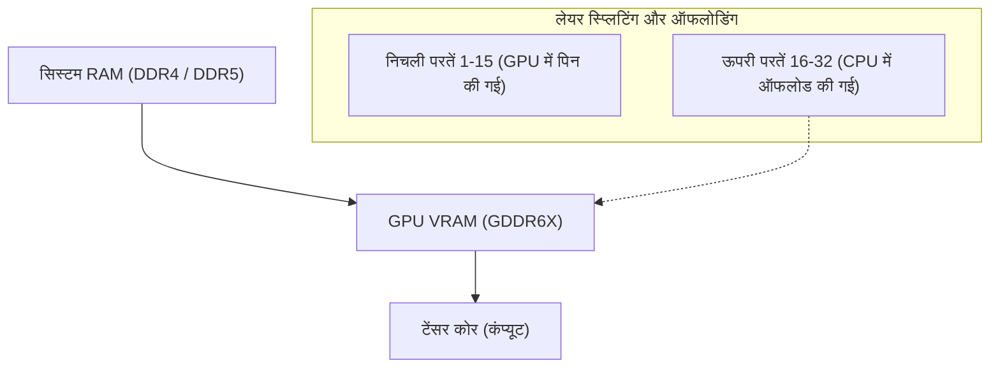
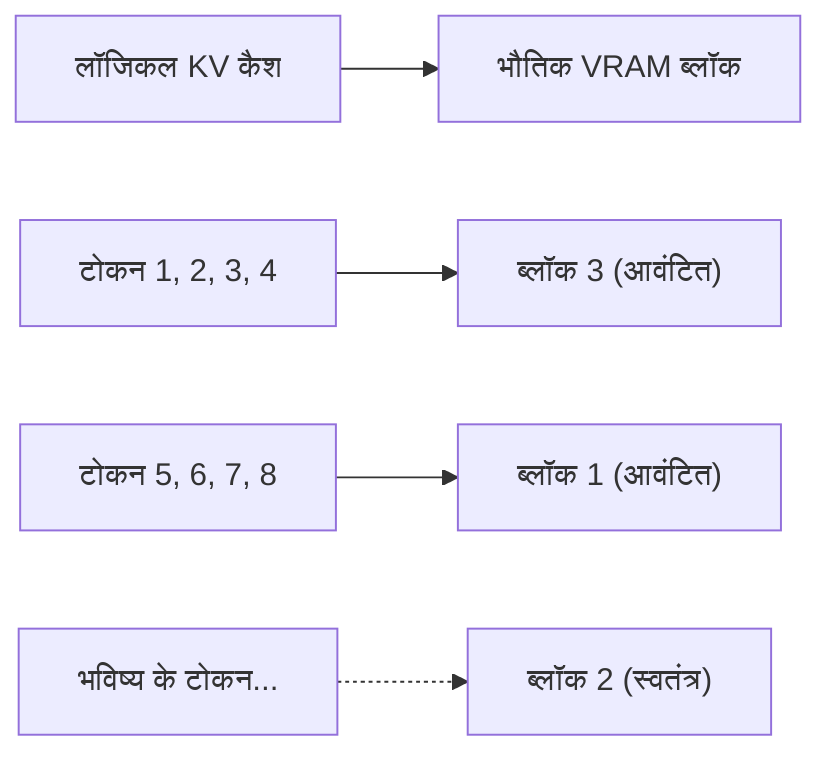
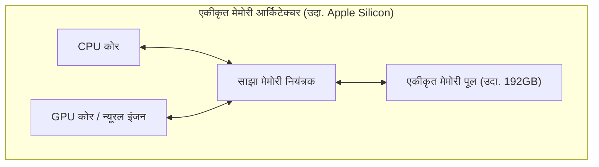
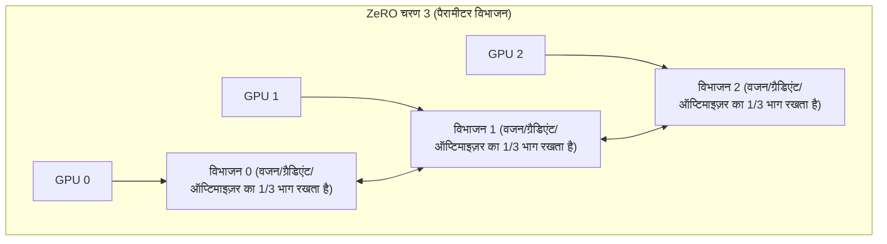

# परिचय: AI विकास और "VRAM की दीवार"

हाल के वर्षों में, बड़े भाषा मॉडल (LLM) और डिफ्यूज़न मॉडल (Diffusion Models) जैसी जनरेटिव AI तकनीकों का तेजी से विकास हुआ है। हालाँकि, इन अत्याधुनिक AI मॉडलों को स्थानीय वातावरण में प्रशिक्षित (फाइन-ट्यूनिंग) करने या अनुमान (Inference) निष्पादित करते समय, कई डेवलपर्स और शोधकर्ताओं को जिस सबसे बड़ी भौतिक बाधा का सामना करना पड़ता है, वह है **"GPU मेमोरी (VRAM) की कमी"**।

NVIDIA GeForce RTX 4090 जैसे हाई-एंड कंज्यूमर GPU में भी अधिकतम 24GB VRAM होता है, जो Llama 3 70B जैसे विशाल मॉडलों को सीधे लोड करना असंभव बना देता है। डेटा सेंटर के लिए H100 (80GB) या B200 (192GB) बहुत महंगे हैं और व्यक्तियों या छोटी टीमों के लिए आसानी से उपलब्ध नहीं हैं। यदि इस "VRAM की दीवार (The Wall of VRAM)" को नहीं तोड़ा गया, तो अत्याधुनिक मॉडलों तक पहुँचना भी असंभव है।

इस लेख में, हम अनुमान और प्रशिक्षण दोनों दृष्टिकोणों से, सॉफ्टवेयर और हार्डवेयर आर्किटेक्चर नवाचारों के माध्यम से VRAM प्रतिबंध की इस भौतिक सीमा को तोड़ने के लिए उन्नत तकनीकों को गहराई से समझाएंगे। CPU ऑफलोडिंग, KV कैश ऑप्टिमाइज़ेशन, ग्रैडिएंट चेकपॉइंटिंग (Gradient Checkpointing) और नवीनतम एकीकृत मेमोरी (Unified Memory) आर्किटेक्चर पर हम गणितीय सूत्रों और आरेखों के साथ चर्चा करेंगे। इस लेख को पढ़कर, आप VRAM के व्यवहार को गहराई से समझ सकेंगे और सीमित संसाधनों के साथ विशाल मॉडलों को संभालने का व्यावहारिक ज्ञान प्राप्त कर सकेंगे।

---

# 1. AI मॉडल में VRAM खपत की शारीरिक रचना (अनुमान/प्रशिक्षण)

VRAM की कमी को दूर करने का पहला कदम सूक्ष्म दृष्टिकोण से यह समझना है कि "क्या" और "कितनी" मेमोरी की खपत हो रही है। इसे ब्लैक बॉक्स के रूप में मानने के बजाय, यदि हम गणितीय सूत्रों का उपयोग करके सटीक रूप से इसका अनुमान लगा सकते हैं, तो हम उचित अनुकूलन विधियों का चयन कर सकते हैं।

## 1.1 मॉडल पैरामीटर (वजन) की मेमोरी गणना

AI मॉडल को बनाने वाले पैरामीटर (Weights) द्वारा उपभोग की जाने वाली बुनियादी मेमोरी की मात्रा मॉडल के कुल मापदंडों की संख्या और उन्हें दर्शाने के लिए उपयोग किए जाने वाले डेटा प्रकार (Precision: सटीकता) द्वारा निर्धारित की जाती है।

डीप लर्निंग में आम तौर पर उपयोग किए जाने वाले डेटा प्रकार और प्रति पैरामीटर बाइट्स की संख्या ($B$) नीचे दी गई है:
- **FP32 (सिंगल-प्रिसिजन फ्लोटिंग-पॉइंट नंबर):** 4 बाइट्स (मानक प्रशिक्षण सटीकता)
- **FP16 / BF16 (हाफ-प्रिसिजन फ्लोटिंग-पॉइंट नंबर):** 2 बाइट्स (सामान्य अनुमान और मिश्रित सटीकता प्रशिक्षण)
- **INT8 (8-बिट इंटिजर):** 1 बाइट (क्वांटिज़्ड मॉडल)
- **INT4 (4-बिट इंटिजर क्वांटिज़ेशन):** 0.5 बाइट्स (GPTQ, AWQ, GGUF जैसे चरम क्वांटिज़ेशन)

यदि हम मॉडल के कुल मापदंडों की संख्या को $P$ मानते हैं, तो वजन द्वारा घेरी गई बुनियादी मेमोरी मात्रा $M_{weights}$ को निम्नलिखित सूत्र द्वारा व्यक्त किया जा सकता है:

$$ M_{weights} = P \times B $$

उदाहरण के लिए, यदि हम Meta द्वारा जारी किए गए "Llama 3 8B" मॉडल (लगभग 8 बिलियन पैरामीटर) को FP16 (हाफ-प्रिसिजन) में लोड करते हैं, तो गणना कुछ इस प्रकार होगी:

$$ M_{weights} = 8,000,000,000 \times 2 \text{ bytes} \approx 16,000,000,000 \text{ bytes} \approx 16 \text{ GB} $$

अर्थात, केवल मॉडल के वजन को GPU में लोड करने से ही 16GB VRAM की खपत होती है। RTX 3060 (12GB) में इस स्तर पर ही आउट ऑफ मेमोरी (OOM) त्रुटि उत्पन्न होगी। हालाँकि, यदि मॉडल को INT4 में क्वांटिज़्ड किया जाता है, तो यह $8 \times 0.5 = 4 \text{ GB}$ हो जाता है और आसानी से लोड हो सकता है।

## 1.2 अनुमान के दौरान मेमोरी की खपत: KV कैश का बढ़ना

LLM अनुमान (विशेष रूप से ऑटोरिग्र्रेसिव टेक्स्ट जेनरेशन) के दौरान, जो चीज़ वजन के समान या उससे भी अधिक VRAM पर अत्यधिक दबाव डालती है, वह है **KV कैश (Key-Value Cache)**।
ट्रांसफॉर्मर आर्किटेक्चर में, पिछले जनरेटेड और प्रोसेस्ड टोकन की जानकारी की पुनर्गणना से बचने के लिए, प्रत्येक अटेंशन लेयर पर Key और Value के टेंसर्स को लगातार VRAM में कैश किया जाता है। यह गणना की गति (Compute) में सुधार करता है, लेकिन जैसे-जैसे संदर्भ की लंबाई (इनपुट प्रॉम्प्ट लंबाई + जनरेटेड लंबाई) बढ़ती है, मेमोरी की खपत रैखिक रूप से विस्फोटक रूप से बढ़ती है।

1 टोकन को प्रोसेस करते समय उपभोग किए जाने वाले KV कैश मेमोरी की मात्रा $M_{kv\_token}$ की गणना मॉडल आर्किटेक्चर के आधार पर निम्नलिखित सूत्र द्वारा कड़ाई से की जाती है:

$$ M_{kv\_token} = 2 \times N_{layers} \times N_{heads\_kv} \times D_{head} \times B $$

यहाँ प्रत्येक चर का अर्थ है:
- $2$ : Key और Value के दो टेंसर मौजूद होने के कारण
- $N_{layers}$ : ट्रांसफॉर्मर की लेयर्स (परतों) की संख्या
- $N_{heads\_kv}$ : KV अटेंशन हेड्स की संख्या (GQA: Grouped Query Attention के मामले में यह सामान्य हेड्स से कम होती है)
- $D_{head}$ : प्रत्येक हेड के आयामों की संख्या (आमतौर पर, छिपी हुई परत के आयामों की संख्या $D_{model} / N_{heads}$)
- $B$ : डेटा प्रकार में बाइट्स की संख्या (FP16 के लिए 2)

कुल KV कैश मात्रा $M_{kv\_total}$ इस मान को अनुक्रम लंबाई ($L_{seq}$) और बैच आकार ($BatchSize$) से गुणा करके प्राप्त की जाती है।

$$ M_{kv\_total} = M_{kv\_token} \times L_{seq} \times BatchSize $$

**विशिष्ट उदाहरण: Llama 2 7B के लिए**
- $N_{layers} = 32$
- $N_{heads\_kv} = 32$ (MHA के मामले में)
- $D_{head} = 128$
- FP16 ($B=2$)
- बैच आकार 1, अनुक्रम लंबाई 8192 (8K संदर्भ)

$$ M_{kv\_total} = 2 \times 32 \times 32 \times 128 \times 2 \times 8192 \times 1 = 4,294,967,296 \text{ bytes} \approx 4 \text{ GB} $$

यदि हम संदर्भ को 32K (32768 टोकन) तक बढ़ाते हैं, तो केवल KV कैश लगभग 16GB खपत करेगा। यदि हम बैच आकार को 4 तक बढ़ाते हैं, तो यह 64GB हो जाएगा। मॉडल के आकार की तुलना में बहुत अधिक VRAM की आवश्यकता अनुमान के दौरान एक बड़ी चुनौती है।

## 1.3 प्रशिक्षण के दौरान मेमोरी की खपत: ऑप्टिमाइज़र, ग्रैडिएंट और एक्टिवेशन

अनुमान की तुलना में, मॉडल प्रशिक्षण (प्री-ट्रेनिंग या फाइन-ट्यूनिंग) बहुत अधिक VRAM खपत करता है। ऐसा इसलिए है क्योंकि इसे केवल एक सरल फॉरवर्ड पास के बजाय बैकप्रोपेगेशन (Backpropagation) के लिए जानकारी बनाए रखने की आवश्यकता होती है। प्रशिक्षण मेमोरी मुख्य रूप से निम्नलिखित 4 तत्वों से बनी होती है:

1. **मॉडल वजन (Model Weights):** अनुमान के समान ही, लेकिन मिश्रित सटीकता प्रशिक्षण में FP16 और FP32 (मास्टर वेट) दोनों को बनाए रखा जा सकता है।
2. **ग्रैडिएंट (Gradients):** बैकप्रोपेगेशन में गणना किए गए प्रति पैरामीटर ग्रैडिएंट। FP16 के मामले में प्रति पैरामीटर 2 बाइट्स।
3. **ऑप्टिमाइज़र स्टेट (Optimizer States):** AdamW जैसे उन्नत ऑप्टिमाइज़र प्रत्येक पैरामीटर के लिए पहला मोमेंट (Momentum) और दूसरा मोमेंट (Variance) रखते हैं। प्रशिक्षण स्थिरता बनाए रखने के लिए, इन्हें आमतौर पर FP32 (4 बाइट्स) में रखा जाता है। अर्थात, दो मोमेंट्स $4 + 4 = 8$ बाइट्स/पैरामीटर की खपत करते हैं।
4. **एक्टिवेशन (Activations):** बैकप्रोपेगेशन के ग्रैडिएंट गणना के लिए, फॉरवर्ड पास के दौरान प्रत्येक परत के आउटपुट (मध्यवर्ती स्थिति) को मेमोरी में बनाए रखना आवश्यक है। यह बैच आकार और अनुक्रम लंबाई पर काफी निर्भर करता है, और बहुत बड़ा हो सकता है।

संक्षेप में, मानक Adam ऑप्टिमाइज़र का उपयोग करते हुए मिश्रित सटीकता प्रशिक्षण (Mixed Precision Training) में, प्रति पैरामीटर **लगभग 16~20 बाइट्स** (मास्टर वेट 4 + FP16 वेट 2 + ग्रैडिएंट 2 + ऑप्टिमाइज़र 8 + α) मेमोरी की आवश्यकता होती है।

$$ M_{train\_param} \approx P \times 16 \text{ bytes} $$

7B (7 बिलियन पैरामीटर) मॉडल के प्रशिक्षण के लिए, अकेले मापदंडों से संबंधित $7B \times 16 = 112 \text{ GB}$ की आवश्यकता होगी, और एक्टिवेशन को जोड़कर, 140GB से अधिक VRAM की आवश्यकता की गणना की जाती है। इसे 24GB VRAM पर निष्पादित करने调करने के लिए, अगली कुछ परतों में बताई गई गहन अनुकूलन तकनीकों की सख्त आवश्यकता है।

---

# 2. अनुमान के दौरान VRAM बचत की तकनीकें

अनुमान के दौरान विशाल मॉडलों को चलाने के लिए हार्डवेयर सीमाओं को पार करने वाली कई सॉफ्टवेयर तकनीकें विकसित की गई हैं।

## 2.1 CPU ऑफलोडिंग (CPU Offloading) और लेयर स्प्लिटिंग

जब एक विशाल मॉडल एक या कई GPU में फिट नहीं होता है, तो मॉडल के एक हिस्से को सिस्टम मेमोरी (CPU RAM) में रखने और गणना के लिए आवश्यकतानुसार इसे GPU में स्थानांतरित करने की तकनीक **CPU ऑफलोडिंग** है। `llama.cpp` और Hugging Face का `Accelerate` इस सुविधा का समर्थन करते हैं।



**प्रणाली और चुनौतियाँ:**
चूँकि ट्रांसफॉर्मर मॉडल में लेयर्स (परतों) की एक शृंखला संरचना होती है, एक परत की गणना पूरी होने तक अगली परत की गणना शुरू नहीं होती है। इसका लाभ उठाते हुए, केवल वे परतें जो GPU में फिट होती हैं (उदा: परत 1 से 15) VRAM में पिन की जाती हैं, और बाकी परतें (परत 16 से 32) बड़ी क्षमता वाले लेकिन धीमे CPU RAM में रखी जाती हैं। अनुमान के दौरान, 15वीं परत तक गणना पूरी होने के बाद, 16वीं परत का वजन PCIe बस के माध्यम से CPU से GPU में स्थानांतरित (कॉपी) किया जाता है, और गणना GPU पर निष्पादित की जाती है।

हालाँकि, **PCIe की बैंडविड्थ (Bandwidth) एक गंभीर अड़चन (Bottleneck)** बन जाती है। यद्यपि PCIe 4.0 x16 की अधिकतम सैद्धांतिक बैंडविड्थ 32GB/s (वन-वे) है, यह नवीनतम GPU की आंतरिक VRAM बैंडविड्थ (उदा: RTX 4090 की GDDR6X में 1008GB/s, H100 की HBM3 में 3TB/s से अधिक) की तुलना में बहुत धीमी है। इसलिए, भारी CPU ऑफलोडिंग का उपयोग करने से अनुमान गति (Tokens per Second) में नाटकीय रूप से गिरावट आती है।
गति में कमी को कम करने के लिए, व्यावहारिक उपाय यह है कि अधिक से अधिक परतों को GPU में रखा जाए (GPU लेयर्स को अधिकतम किया जाए) और कम से कम परतों को ऑफलोड किया जाए।

## 2.2 KV कैश क्वांटिज़ेशन और PagedAttention

अनुमान के दौरान VRAM खपत का मुख्य कारण बनने वाले KV कैश के लिए भी दो शक्तिशाली अनुकूलन लागू किए गए हैं।

**1. KV कैश क्वांटिज़ेशन (KV Cache Quantization):**
न केवल मॉडल वजन, बल्कि रनटाइम के दौरान गतिशील रूप से उत्पन्न होने वाले KV कैश को भी VRAM में सहेजने से पहले INT8, INT4, या FP8 में क्वांटिज़्ड किया जाता है। इससे KV कैश का आकार आधा या चौथाई हो जाता है। नवीनतम अनुमान इंजन (vLLM और llama.cpp) इस सुविधा को एकीकृत कर चुके हैं, जो सटीकता के नुकसान को कम करते हुए VRAM में महत्वपूर्ण बचत प्राप्त करते हैं।

**2. PagedAttention:**
OS वर्चुअल मेमोरी के "पेजिंग" अवधारणा को KV कैश में लागू करने को **PagedAttention** कहा जाता है, जिसे vLLM अनुमान इंजन द्वारा पेश किया गया था। पारंपरिक अनुमान इंजनों में, अधिकतम अनुक्रम लंबाई के अनुसार VRAM के एक निरंतर क्षेत्र को पहले से ही आवंटित (Pre-allocation) किया जाता था। इस वजह से, जब वास्तविक इनपुट छोटा होता था, तो विखंडन (Fragmentation) और अप्रयुक्त मेमोरी की बर्बादी होती थी, जिससे 60% से अधिक VRAM नष्ट हो सकता था।

PagedAttention KV कैश को निश्चित आकार के ब्लॉक (पेज) में विभाजित करता है और उन्हें गैर-निरंतर भौतिक मेमोरी स्पेस में वितरित रूप से संग्रहीत करने की अनुमति देता है। यह मेमोरी की बर्बादी को लगभग शून्य कर देता है (केवल आंतरिक विखंडन तक सीमित) और समान VRAM क्षमता के साथ बैच आकार को काफी बढ़ा सकता है।



## 2.3 FlashAttention: अटेंशन गणना की मेमोरी जटिलता को तोड़ना

VRAM की कमी केवल डेटा स्टोर करने के लिए मेमोरी की मात्रा के कारण नहीं, बल्कि गणना के दौरान "अस्थायी कार्यक्षेत्र" (Temporary Workspace) की कमी के कारण भी होती है। मानक ट्रांसफॉर्मर के सेल्फ-अटेंशन मैकेनिज्म में, अनुक्रम लंबाई $N$ के लिए $N \times N$ के विशाल अटेंशन मैट्रिक्स को VRAM पर साकार (Materialize) करने की आवश्यकता होती है। इससे मेमोरी जटिलता $O(N^2)$ हो जाती है, जो लंबे संदर्भों के लिए OOM का मुख्य कारण बनता है।

इसका समाधान **FlashAttention** (और FlashAttention-2, 3) ने किया।
FlashAttention एक ऐसा एल्गोरिदम है जो GPU के हार्डवेयर आर्किटेक्चर (विशाल लेकिन धीमे HBM और बेहद छोटे लेकिन अल्ट्रा-फास्ट SRAM के पदानुक्रम) का लाभ उठाता है। यह टाइलिंग (Tiling) नामक तकनीक का उपयोग करता है, जहाँ डेटा को ब्लॉक-दर-ब्लॉक SRAM में लोड किया जाता है और अटेंशन की गणना वहीं पूरी की जाती है, जिससे $N \times N$ मैट्रिक्स को HBM (VRAM) में लिखने की आवश्यकता पूरी तरह खत्म हो जाती है।

इससे अटेंशन लेयर की मेमोरी जटिलता $O(N^2)$ से घटकर $O(N)$ (अनुक्रम लंबाई के अनुपात में) हो जाती है, और संदर्भ लंबाई की सीमा काफी हद तक शिथिल हो जाती है।

## 2.4 एकीकृत मेमोरी (Unified Memory) का उदय और Apple Silicon

PC आर्किटेक्चर के मूल स्तर पर इस समस्या से निपटने का काम **एकीकृत मेमोरी आर्किटेक्चर (Unified Memory Architecture: UMA)** कर रहा है, जिसे Apple Silicon (M1/M2/M3/M4 सीरीज के Max या Ultra) और कुछ नवीनतम APU (जैसे AMD Strix Point) में अपनाया गया है।

इन आर्किटेक्चर में, मदरबोर्ड पर CPU और GPU एक ही भौतिक मेमोरी (जैसे कि अधिकतम 192GB की LPDDR5) साझा करते हैं। इसलिए, "PCIe के माध्यम से CPU से GPU में धीमे डेटा स्थानांतरण" की अवधारणा भौतिक रूप से मौजूद ही नहीं है।



इस आर्किटेक्चर का सबसे बड़ा लाभ यह है कि VRAM की कोई स्पष्ट सीमा नहीं है, और सिस्टम मेमोरी के लगभग पूरे क्षेत्र का उपयोग विशाल LLM को सीधे लोड करने के लिए किया जा सकता है। 192GB यूनिफाइड मेमोरी वाले Mac Studio के साथ, 70B क्लास या उससे भी बड़े मॉडल (जैसे Grok-1) को बिना क्वांटिज़ेशन के एकल उपकरण पर लोड करना और उच्च गति पर अनुमान लगाना संभव है। मेमोरी एक्सेस बैंडविड्थ भी M2 Ultra पर 800GB/s तक पहुँच जाती है, जो कंज्यूमर-ग्रेड डिस्क्रीट GPU के बराबर है। यह एक अत्यंत शक्तिशाली दृष्टिकोण है जो हार्डवेयर स्तर पर "मेमोरी क्षमता" और "बैंडविड्थ" की दुविधा को हल करता है।

---

# 3. प्रशिक्षण (फाइन-ट्यूनिंग) के दौरान VRAM बचत की तकनीकें

प्रशिक्षण (Training) के दौरान, जहाँ अनुमान से भी अधिक VRAM की आवश्यकता होती है, कई सफलताएं हासिल की गई हैं। सीमित संसाधनों के साथ फाइन-ट्यूनिंग करने के लिए निम्नलिखित तकनीकों का संयोजन आवश्यक है।

## 3.1 ग्रैडिएंट चेकपॉइंटिंग (Gradient Checkpointing)

डीप लर्निंग के बैकप्रोपेगेशन (Backpropagation) में, ग्रैडिएंट की गणना करने के लिए फॉरवर्ड पास के दौरान सभी लेयर्स के मध्यवर्ती आउटपुट (Activations) को मेमोरी में रखना आवश्यक होता है। जैसे-जैसे अनुक्रम लंबाई या बैच आकार बढ़ता है, यह एक्टिवेशन मेमोरी VRAM पर हावी होने लगती है।

**ग्रैडिएंट चेकपॉइंटिंग (Gradient Checkpointing / Activation Recomputation)** मेमोरी क्षमता और गणना समय (Compute) के ट्रेड-ऑफ का उपयोग करने वाली एक शानदार तकनीक है।
सभी मध्यवर्ती आउटपुट को मेमोरी में सहेजने के बजाय, यह केवल विशिष्ट लेयर्स (चेकपॉइंट्स) के आउटपुट को सहेज कर रखता है। बैकप्रोपेगेशन के दौरान जब गैर-चेकपॉइंटेड मध्यवर्ती मूल्यों की आवश्यकता होती है, तो यह **सहेजे गए निकटतम चेकपॉइंट से फॉरवर्ड पास की फिर से गणना (पुनर्गणना) करके मूल्य को पुनर्प्राप्त करता है**।

इससे गणना की मात्रा में लगभग 20-30% की वृद्धि होती है और कुल प्रशिक्षण समय लंबा हो जाता है, लेकिन एक्टिवेशन द्वारा VRAM खपत को $O(N)$ ($N$ लेयर्स की संख्या है) से घटाकर $O(\sqrt{N})$ तक कम कर दिया जाता है। वर्तमान विशाल मॉडलों के प्रशिक्षण में, यह एक अनिवार्य सेटिंग बन गया है जिसके बिना काम शुरू करना लगभग असंभव है।

## 3.2 LoRA और QLoRA (Low-Rank Adaptation)

VRAM की कमी को बुनियादी स्तर से सुलझाने में मुख्य भूमिका PEFT (Parameter-Efficient Fine-Tuning) के प्रमुख **LoRA** ने निभाई।

मॉडल के मूल विशाल वजन मैट्रिक्स $W_0 \in \mathbb{R}^{d \times k}$ को फ्रीज़ (Frozen) कर दिया जाता है, और इसे प्रशिक्षित नहीं किया जाता। इसके बजाय, दो बहुत छोटे कम-रैंक मैट्रिक्स $A \in \mathbb{R}^{r \times k}$ और $B \in \mathbb{R}^{d \times r}$ को समानांतर में पेश किया जाता है, और केवल इन $A$ और $B$ को प्रशिक्षित किया जाता है। (यहाँ रैंक $r$ एक बहुत छोटा मान है जहाँ $r \ll d, k$)।

$$ W_{adapted} = W_0 + \Delta W = W_0 + B A $$

इसके कारण, प्रशिक्षित किए जाने वाले मापदंडों की संख्या मूल के 1% से भी कम (कभी-कभी 0.1% से भी कम) हो जाती है, जिससे "ग्रैडिएंट" और "ऑप्टिमाइज़र स्टेट्स" जो बहुत अधिक मेमोरी खाते थे, वे भी 1% से कम हो जाते हैं।

इसके अलावा, इसे चरम स्तर तक विकसित करने वाला रूप **QLoRA (Quantized LoRA)** है।
QLoRA में, बेस मॉडल के वजन $W_0$ को चरम स्तर पर 4-बिट (NF4: NormalFloat4 प्रारूप) में क्वांटिज़्ड किया जाता है और VRAM में लोड किया जाता है। फिर, सटीकता बनाए रखने के लिए LoRA के छोटे मैट्रिक्स $A, B$ को BF16 (16-बिट) में प्रशिक्षित किया जाता है।
4-बिट क्वांटिज़ेशन बेस मॉडल के VRAM आकार को मूल के एक-चौथाई तक कम कर देता है, और **Paged Optimizers** (पेज्ड ऑप्टिमाइज़र) तकनीक का उपयोग करके, जब VRAM खत्म होने वाला होता है, तो यह स्वचालित रूप से ऑप्टिमाइज़र स्थितियों को अस्थायी रूप से CPU RAM में ऑफलोड कर देता है। इसके परिणामस्वरूप, 24GB VRAM (RTX 4090 आदि) वाले सिंगल GPU पर भी Llama 3 70B जैसे अति-विशाल मॉडलों की फाइन-ट्यूनिंग संभव हो गई है।

## 3.3 DeepSpeed ZeRO और ऑफलोडिंग

कई GPU (मल्टी-GPU) का उपयोग करने वाले वातावरण में, केवल डेटा पैरेललिज़्म (Data Parallelism) से VRAM समस्या हल नहीं होती है। चूँकि प्रत्येक GPU पूरे मॉडल की एक प्रति रखता है, इसलिए व्यक्तिगत VRAM क्षमता की सीमा को पार नहीं किया जा सकता।

Microsoft द्वारा विकसित **DeepSpeed** लाइब्रेरी का **ZeRO (Zero Redundancy Optimizer)** एक ऐसी तकनीक है जो मॉडल के मापदंडों, ग्रैडिएंट्स और ऑप्टिमाइज़र स्थितियों को कई GPU के बीच पूरी तरह से विभाजित (शार्ड) कर देती है। इससे, एकाधिक GPU की "कुल" VRAM को एक विशाल मेमोरी पूल की तरह माना जा सकता है।



- **ZeRO Stage 1:** ऑप्टिमाइज़र स्थितियों को प्रत्येक GPU में विभाजित करता है
- **ZeRO Stage 2:** ग्रैडिएंट्स को भी प्रत्येक GPU में विभाजित करता है
- **ZeRO Stage 3:** मॉडल के मापदंडों (वजन) को भी प्रत्येक GPU में विभाजित करता है

इसके अतिरिक्त, **ZeRO-Offload** सुविधा का उपयोग करके, ZeRO द्वारा विभाजित ऑप्टिमाइज़र स्थितियों और ग्रैडिएंट्स की अद्यतन गणना को GPU के बजाय **CPU मेमोरी में ऑफलोड** करके होस्ट CPU पर निष्पादित किया जा सकता है। इससे GPU VRAM पर बोझ कम हो जाता है, जिससे सीमित GPU वातावरण में भी विशाल मॉडलों का प्रशिक्षण संभव हो जाता है। चूँकि गणना CPU पर होती है और परिणाम PCIe के माध्यम से GPU पर वापस आते हैं, प्रशिक्षण की गति कम हो जाती है, लेकिन यह "मेमोरी की कमी के कारण प्रशिक्षण के क्रैश होने" जैसी सबसे खराब स्थिति से बचाता है।

---

# 4. कार्यान्वयन उदाहरण: Hugging Face Accelerate और DeepSpeed

अंत में, आइए एक सरल उदाहरण देखें कि Python कोड का उपयोग करके CPU ऑफलोडिंग और VRAM अनुकूलन को वास्तव में कैसे लागू किया जाए।

## 4.1 Hugging Face `device_map="auto"` के साथ स्वचालित ऑफलोडिंग

Hugging Face की `transformers` और `accelerate` लाइब्रेरीज़ का उपयोग करके, मॉडल को लोड करते समय लेयर्स को स्वचालित रूप से GPU और CPU के बीच विभाजित किया जा सकता है।

```python
from transformers import AutoModelForCausalLM, AutoTokenizer

model_id = "meta-llama/Llama-2-13b-hf"

# device_map="auto" के साथ, VRAM में फिट न होने वाले हिस्से को CPU RAM में ऑफलोड कर दिया जाता है
# load_in_8bit=True से वजन को 8-बिट में क्वांटिज़्ड किया जाता है, जिससे मेमोरी और भी बचती है
model = AutoModelForCausalLM.from_pretrained(
    model_id,
    device_map="auto",
    load_in_8bit=True,
    offload_folder="offload_dir" # यदि पर्याप्त नहीं है, तो इसे डिस्क (SSD) में भी ऑफलोड किया जा सकता है
)
```

जब यह कोड निष्पादित होता है, तो पृष्ठभूमि में `accelerate` लाइब्रेरी सिस्टम के VRAM और CPU RAM की उपलब्ध क्षमता का विश्लेषण करती है और लेयर्स को सर्वोत्तम संभव तरीके से व्यवस्थित (Dispatch) करती है।

## 4.2 DeepSpeed का CPU ऑफलोड कॉन्फ़िगरेशन (ZeRO-2)

प्रशिक्षण के दौरान DeepSpeed में CPU ऑफलोडिंग सक्षम करने के लिए कॉन्फ़िगरेशन फ़ाइल (JSON) का एक उदाहरण यहाँ दिया गया है।

```json
{
  "fp16": {
    "enabled": true
  },
  "zero_optimization": {
    "stage": 2,
    "offload_optimizer": {
      "device": "cpu",
      "pin_memory": true
    },
    "allgather_partitions": true,
    "allgather_bucket_size": 2e8,
    "overlap_comm": true,
    "reduce_scatter": true,
    "reduce_bucket_size": 2e8,
    "contiguous_gradients": true
  },
  "train_batch_size": 16,
  "gradient_accumulation_steps": 4
}
```
इस कॉन्फ़िगरेशन में, `offload_optimizer` को `"cpu"` पर सेट करके, भारी मात्रा में VRAM खपत करने वाले ऑप्टिमाइज़र (जैसे Adam) की स्थिति रखरखाव और अद्यतन गणना सिस्टम के CPU पर निष्पादित की जाती है। यह GPU की VRAM को इसके सबसे महत्वपूर्ण कार्य - मॉडल के फॉरवर्ड/बैकवर्ड गणना - पर ध्यान केंद्रित करने की अनुमति देता है। `pin_memory: true` सेट करके, यह पेज फॉल्ट को रोकता है और CPU-GPU के बीच PCIe स्थानांतरण को यथासंभव तेज़ करता है।

---

# निष्कर्ष

AI विकास में GPU मेमोरी (Out of Memory) की कमी एक शाश्वत चुनौती है जो मॉडलों के आकार में वृद्धि के साथ डेवलपर्स के सामने बनी रहेगी। हालाँकि, इस लेख में बताई गई हार्डवेयर (आर्किटेक्चर) की गहरी समझ और सॉफ्टवेयर/एल्गोरिदम अनुकूलन तकनीकों का उचित संयोजन करके, स्थानीय वातावरण में विशाल मॉडलों का अनुमान और प्रशिक्षण संभव हो जाता है जो पहले असंभव लगता था।

**अनुमान के दौरान रणनीतियों का सारांश:**
1. **क्वांटिज़ेशन (INT4 / INT8 / FP8):** मॉडल के आकार को नाटकीय रूप से संपीड़ित करता है और VRAM उपयोग को कम करता है।
2. **CPU ऑफलोडिंग:** उन लेयर्स को सिस्टम मेमोरी में स्थानांतरित करता है जो VRAM में फिट नहीं होते (PCIe बैंडविड्थ के कारण गति में कमी के ट्रेड-ऑफ के साथ)।
3. **KV कैश अनुकूलन:** पेजिंग (PagedAttention), कैश क्वांटिज़ेशन, और FlashAttention का उपयोग करके संदर्भ लंबाई (Context Length) सुनिश्चित करता है।
4. **एकीकृत मेमोरी उपयोग:** बड़ी क्षमता वाली मेमोरी का सीधे अनुमान के लिए उपयोग करने के लिए Apple Silicon जैसी UMA तकनीक का लाभ उठाता है।

**प्रशिक्षण के दौरान रणनीतियों का सारांश:**
1. **PEFT (LoRA / QLoRA):** प्रशिक्षित किए जाने वाले मापदंडों को सीमित करता है और बेस मॉडल को चरम सीमा तक क्वांटिज़्ड करता है।
2. **ग्रैडिएंट चेकपॉइंटिंग (Gradient Checkpointing):** फॉरवर्ड पास के मध्यवर्ती आउटपुट को छोड़ देता है और बैकप्रोपेगेशन के दौरान पुनर्गणना करके गणना समय की कीमत पर VRAM खपत को कम करता है।
3. **ZeRO और CPU ऑफलोडिंग (DeepSpeed):** ऑप्टिमाइज़र स्थितियों और ग्रैडिएंट्स को एकाधिक GPU में विभाजित करता है या VRAM की सीमाओं को पार करने के लिए उन्हें CPU मेमोरी में ऑफलोड करता है।

इन उन्नत तकनीकों का लाभ उठाकर, हम सीमित हार्डवेयर संसाधनों के भीतर अधिकतम AI विकास प्रदर्शन प्राप्त कर सकते हैं। इस तेजी से विकसित होते क्षेत्र में, भविष्य में नई मेमोरी-बचत एल्गोरिदम के उभरने की उम्मीद है। नवीनतम लाइब्रेरी विकासों की नियमित रूप से जांच करना और उन्हें अपने कार्यान्वयन में एकीकृत करना सफलता की कुंजी होगी।

