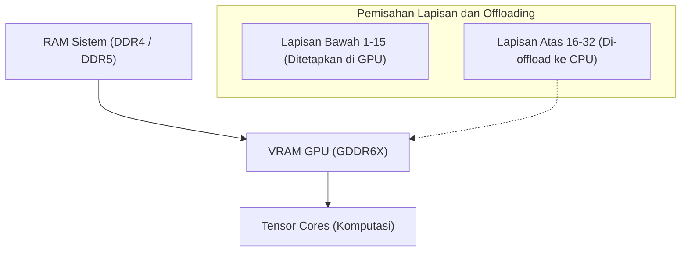
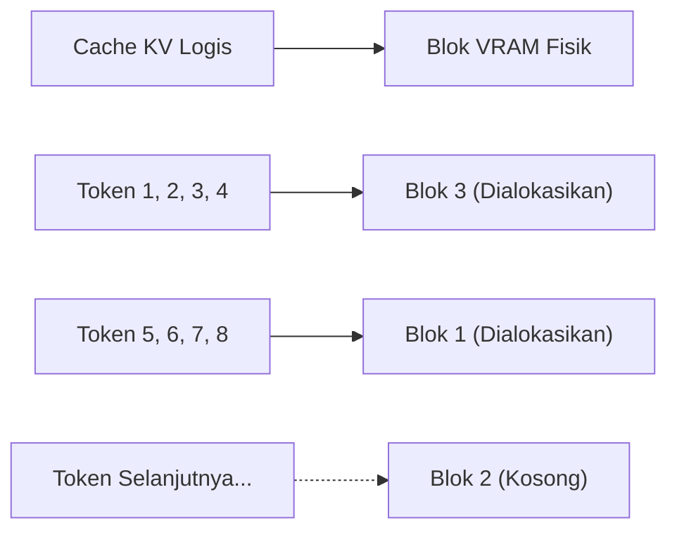
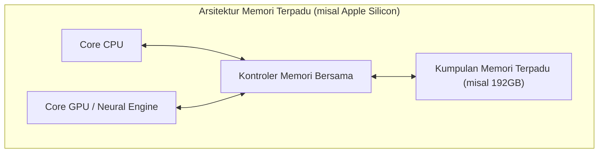
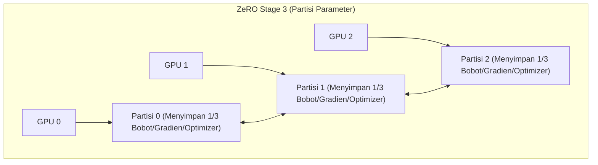

# Pengantar: Pengembangan AI dan 'Tembok VRAM'

Dalam beberapa tahun terakhir, teknologi AI generatif seperti Large Language Models (LLM) dan Diffusion Models telah mengalami perkembangan yang sangat pesat. Namun, ketika melatih (fine-tuning) atau menjalankan inferensi model-model AI mutakhir ini di lingkungan lokal, banyak pengembang dan peneliti menghadapi hambatan fisik yang sangat besar, yaitu **"kekurangan memori GPU (VRAM)"**.

Meskipun menggunakan GPU high-end untuk konsumen seperti NVIDIA GeForce RTX 4090, VRAM maksimal yang tersedia hanyalah 24GB, sehingga mustahil untuk memuat model raksasa seperti Llama 3 70B secara langsung. GPU untuk data center seperti H100 (80GB) dan B200 (192GB) sangatlah mahal, dan tidak mudah dijangkau oleh individu atau tim skala kecil. Jika kita tidak dapat menembus 'Tembok VRAM (The Wall of VRAM)' ini, kita bahkan tidak akan bisa menyentuh model-model mutakhir tersebut.

Dalam artikel ini, kami akan menjelaskan secara mendalam dari sisi inferensi maupun pembelajaran mengenai teknik-teknik canggih untuk mematahkan kendala fisik batasan VRAM ini melalui rekayasa perangkat lunak dan arsitektur perangkat keras. Mari kita bahas lebih dalam menggunakan rumus matematika dan diagram untuk teknik seperti CPU offloading, optimasi cache KV, gradient checkpointing, hingga arsitektur Unified Memory terbaru. Dengan membaca artikel ini, Anda akan memahami perilaku VRAM secara mendalam dan memperoleh pengetahuan praktis untuk menangani model raksasa dengan sumber daya yang terbatas.

---

# 1. Anatomi Konsumsi VRAM Model AI (Inferensi dan Pembelajaran)

Langkah pertama untuk mengatasi kekurangan VRAM adalah memahami secara akurat "apa" dan "berapa banyak" memori yang dikonsumsi dari sudut pandang mikro. Jika kita dapat memperkirakannya secara akurat menggunakan rumus matematika daripada menganggapnya sebagai kotak hitam, kita dapat memilih metode optimasi yang tepat.

## 1.1 Perhitungan Memori Parameter Model (Bobot)

Jumlah memori dasar yang dikonsumsi oleh parameter (Weights) yang membentuk model AI ditentukan oleh total jumlah parameter model dan tipe data (Precision: Presisi) yang digunakan untuk merepresentasikannya.

Tipe data yang umum digunakan dalam deep learning dan jumlah byte per parameter ($B$) adalah sebagai berikut:
- **FP32 (Single-precision floating-point format):** 4 byte (presisi standar saat pembelajaran)
- **FP16 / BF16 (Half-precision floating-point format):** 2 byte (inferensi umum dan mixed-precision training)
- **INT8 (Integer 8-bit):** 1 byte (model yang dikuantisasi)
- **INT4 (Kuantisasi integer 4-bit):** 0.5 byte (kuantisasi ekstrem seperti GPTQ, AWQ, GGUF)

Jika total jumlah parameter dari keseluruhan model adalah $P$, maka jumlah memori dasar yang ditempati oleh bobot itu sendiri, $M_{weights}$, dapat dinyatakan dengan rumus berikut:

$$ M_{weights} = P \times B $$

Sebagai contoh, jika Anda memuat model "Llama 3 8B" (sekitar 8 miliar parameter) yang dirilis oleh Meta dalam format FP16 (setengah presisi), perhitungannya adalah sebagai berikut:

$$ M_{weights} = 8,000,000,000 \times 2 \text{ bytes} \approx 16,000,000,000 \text{ bytes} \approx 16 \text{ GB} $$

Dengan kata lain, sekadar memuat bobot model ke GPU akan mengonsumsi 16GB VRAM. Pada RTX 3060 (12GB), error Out of Memory (OOM) akan terjadi pada titik ini. Namun, jika model dikuantisasi menjadi INT4, memori yang dibutuhkan menjadi $8 \times 0.5 = 4 \text{ GB}$, yang memungkinkannya dimuat dengan mudah.

## 1.2 Konsumsi Memori Saat Inferensi: Peningkatan Cache KV

Dalam inferensi LLM (terutama pembuatan teks autoregresif), hal yang menekan VRAM sama atau bahkan lebih besar daripada bobotnya adalah **Cache KV (Key-Value Cache)**.
Pada arsitektur Transformer, tensor Key dan Value pada setiap lapisan attention terus di-cache dalam VRAM untuk mencegah perhitungan ulang informasi token yang telah diproses di masa lalu. Hal ini meningkatkan kecepatan komputasi (Compute), tetapi seiring dengan bertambahnya panjang konteks (panjang prompt masukan + panjang teks yang dihasilkan), konsumsi memori meningkat secara linear dan eksponensial.

Jumlah memori cache KV yang dikonsumsi saat memproses 1 token, $M_{kv\_token}$, dihitung secara akurat berdasarkan arsitektur model dengan rumus berikut:

$$ M_{kv\_token} = 2 \times N_{layers} \times N_{heads\_kv} \times D_{head} \times B $$

Di sini, setiap variabel memiliki arti sebagai berikut:
- $2$ : Karena ada dua tensor, Key dan Value
- $N_{layers}$ : Jumlah lapisan (layer) Transformer
- $N_{heads\_kv}$ : Jumlah head attention KV (GQA: Grouped Query Attention akan memiliki lebih sedikit dari jumlah head biasa)
- $D_{head}$ : Jumlah dimensi tiap head (biasanya jumlah dimensi hidden layer $D_{model} / N_{heads}$)
- $B$ : Jumlah byte tipe data (2 untuk FP16)

Total kapasitas cache KV, $M_{kv\_total}$, adalah hasil perkalian nilai di atas dengan panjang urutan ($L_{seq}$) dan ukuran batch ($BatchSize$).

$$ M_{kv\_total} = M_{kv\_token} \times L_{seq} \times BatchSize $$

**Contoh Spesifik: Pada Llama 2 7B**
- $N_{layers} = 32$
- $N_{heads\_kv} = 32$ (Dalam kasus MHA)
- $D_{head} = 128$
- FP16 ($B=2$)
- Ukuran Batch 1, Panjang Konteks 8192 (Konteks 8K)

$$ M_{kv\_total} = 2 \times 32 \times 32 \times 128 \times 2 \times 8192 \times 1 = 4,294,967,296 \text{ bytes} \approx 4 \text{ GB} $$

Jika konteks diperpanjang hingga 32K (32768 token), cache KV saja akan menghabiskan sekitar 16GB. Jika ukuran batch ditambah menjadi 4, akan menjadi 64GB. Hal ini menjadikan VRAM yang dibutuhkan jauh lebih besar daripada ukuran model itu sendiri, yang merupakan tantangan besar saat inferensi.

## 1.3 Konsumsi Memori Saat Pembelajaran: Optimizer, Gradien, dan Aktivasi

Dibandingkan dengan inferensi, pembelajaran model (pre-training atau fine-tuning) mengonsumsi VRAM yang jauh lebih banyak. Hal ini karena memori perlu mempertahankan informasi untuk backpropagation (propagasi balik), bukan hanya untuk forward pass (propagasi maju) yang sederhana. Memori saat pembelajaran terutama terdiri dari 4 elemen berikut:

1. **Bobot Model (Model Weights):** Sama seperti saat inferensi, tetapi dalam mixed-precision training, model sering kali menahan baik FP16 maupun FP32 (master weights).
2. **Gradien (Gradients):** Gradien per parameter dihitung dalam backpropagation. Untuk FP16, besarnya 2 byte per parameter.
3. **Status Optimizer (Optimizer States):** Optimizer canggih seperti AdamW menyimpan momen pertama (Momentum) dan momen kedua (Variance) untuk setiap parameter. Demi stabilitas pembelajaran, ini umumnya disimpan di FP32 (4 byte). Dengan kata lain, kedua momen tersebut menghabiskan $4 + 4 = 8$ byte per parameter.
4. **Aktivasi (Activations):** Output (status menengah) dari setiap lapisan saat forward pass harus disimpan di memori untuk menghitung gradien pada backpropagation. Hal ini sangat bergantung pada ukuran batch dan panjang urutan, sehingga ukurannya bisa sangat besar.

Ringkasnya, dalam Mixed Precision Training yang menggunakan optimizer Adam standar, dibutuhkan sekitar **16-20 byte** memori per parameter (master weight 4 + FP16 weight 2 + gradien 2 + optimizer 8 + α).

$$ M_{train\_param} \approx P \times 16 \text{ bytes} $$

Untuk melatih model 7B (7 miliar parameter), dibutuhkan memori sekitar $7B \times 16 = 112 \text{ GB}$ hanya untuk parameter. Jika ditambah dengan aktivasi, total VRAM yang dibutuhkan bisa mencapai lebih dari 140GB. Untuk menjalankannya pada VRAM 24GB, diperlukan teknik optimasi ekstrem yang akan dijelaskan di bab berikutnya.

---

# 2. Teknik Menghemat VRAM Saat Inferensi

Berbagai teknologi perangkat lunak telah dikembangkan untuk melampaui batasan perangkat keras saat menjalankan model raksasa untuk inferensi.

## 2.1 CPU Offloading dan Pembagian Lapisan

Jika model raksasa tidak muat di satu atau beberapa GPU, sebagian model ditempatkan di memori sistem (RAM CPU) dan komputasi dilanjutkan sambil mentransfer data ke GPU hanya saat diperlukan. Pendekatan ini disebut **CPU Offloading**. Alat seperti `llama.cpp` atau `Accelerate` dari Hugging Face mendukung fitur ini.



**Mekanisme dan Tantangan:**
Model Transformer memiliki struktur di mana setiap lapisan ditumpuk secara seri, sehingga perhitungan untuk suatu lapisan tidak akan dimulai sampai perhitungan lapisan sebelumnya selesai. Menggunakan prinsip ini, hanya lapisan yang muat di GPU (misal: lapisan 1 hingga 15) yang dibiarkan menetap (pinned) di VRAM, sedangkan lapisan sisanya (lapisan 16 hingga 32) ditempatkan di RAM CPU yang berkapasitas besar namun lambat. Selama inferensi, setelah perhitungan lapisan 15 selesai, bobot lapisan ke-16 ditransfer (disalin) dari CPU ke GPU melalui bus PCIe untuk dihitung di GPU.

Namun, **bandwidth PCIe menjadi bottleneck (leher botol) yang parah**. Bandwidth maksimal secara teori untuk PCIe 4.0 x16 adalah 32GB/s (satu arah), namun dibandingkan dengan bandwidth internal VRAM GPU terbaru (misalnya GDDR6X pada RTX 4090 yang mencapai 1008GB/s, atau HBM3 pada H100 yang melebihi 3TB/s), kecepatannya dua tingkat besaran lebih lambat. Jadi, jika CPU offloading digunakan terlalu sering, kecepatan inferensi (Tokens per Second) akan menurun drastis.
Untuk meminimalkan penurunan kecepatan, hal praktis yang perlu dilakukan adalah memuat sebanyak mungkin lapisan ke GPU (memaksimalkan Lapisan GPU) dan mengurangi jumlah lapisan yang di-offload sesedikit mungkin.

## 2.2 Kuantisasi Cache KV dan PagedAttention

Untuk Cache KV, yang menjadi penyebab utama tingginya konsumsi VRAM selama inferensi, terdapat dua optimasi kuat:

**1. Kuantisasi Cache KV (KV Cache Quantization):**
Selain bobot model, Cache KV itu sendiri yang dihasilkan secara dinamis saat eksekusi juga dikuantisasi menjadi INT8, INT4, atau FP8 untuk disimpan di VRAM. Hal ini mengurangi ukuran Cache KV hingga setengah atau seperempatnya. Engine inferensi terbaru (seperti vLLM dan llama.cpp) telah menyertakan fitur ini untuk menghasilkan penghematan VRAM yang signifikan sembari meminimalkan penurunan akurasi.

**2. PagedAttention:**
Konsep "paging" dari memori virtual sistem operasi diaplikasikan pada Cache KV, yang diperkenalkan dalam engine inferensi vLLM, dinamakan **PagedAttention**. Dalam engine inferensi tradisional, ruang VRAM yang berdekatan dialokasikan di awal (Pre-allocation) sesuai dengan panjang urutan maksimum yang ditetapkan. Oleh karena itu, jika input yang sebenarnya ternyata lebih pendek, akan terjadi fragmentasi dan pemborosan memori, yang kadang menyebabkan lebih dari 60% VRAM terbuang sia-sia.

PagedAttention membagi Cache KV ke dalam blok-blok ukuran tetap (halaman) dan menyimpannya secara terdistribusi di ruang memori fisik yang tidak bersebelahan. Dengan demikian, pemborosan memori dapat dikurangi menjadi hampir nol (hanya terbatas pada fragmentasi internal), sehingga memungkinkan peningkatan ukuran batch secara signifikan dalam kapasitas VRAM yang sama.



## 2.3 FlashAttention: Memecahkan Kompleksitas Memori Perhitungan Attention

Kekurangan VRAM tidak hanya disebabkan oleh ruang untuk menyimpan data, tetapi juga kekurangan "workspace sementara" saat komputasi dilakukan. Mekanisme Self-Attention Transformer standar mengharuskan kita untuk mematerialisasi matriks attention raksasa $N \times N$ pada VRAM untuk panjang urutan $N$. Kompleksitas memori ini mencapai $O(N^2)$, yang menjadi penyebab utama terjadinya OOM saat menangani konteks panjang.

Hal ini diselesaikan dengan **FlashAttention** (dan FlashAttention-2, 3).
FlashAttention adalah algoritma yang dirancang dengan memperhatikan arsitektur perangkat keras GPU (hierarki antara HBM yang sangat besar namun lambat dan SRAM yang sangat kecil namun super cepat). Algoritma ini menggunakan teknik yang disebut Tiling untuk memuat data per blok ke SRAM dan menyelesaikan perhitungan attention, dengan demikian sepenuhnya menghindari proses penulisan matriks $N \times N$ ke HBM (VRAM).

Akibatnya, kompleksitas memori lapisan attention berkurang drastis dari $O(N^2)$ menjadi $O(N)$ (berbanding lurus dengan panjang urutan), dan batas maksimum panjang konteks pun sangat dilonggarkan.

## 2.4 Kebangkitan Unified Memory dan Apple Silicon

Pendekatan untuk mengatasi masalah ini dari dasar arsitektur PC adalah **Unified Memory Architecture (UMA)** yang diadopsi oleh Apple Silicon (seri Max atau Ultra dari M1/M2/M3/M4) dan beberapa APU modern (seperti AMD Strix Point).

Dalam arsitektur ini, CPU dan GPU di motherboard berbagi ruang memori fisik yang persis sama (misalnya, LPDDR5 hingga 192GB). Oleh karena itu, konsep "transfer data yang lambat via PCIe dari CPU ke GPU" sama sekali tidak ada secara fisik.



Keuntungan terbesar arsitektur ini adalah tidak adanya tembok pasti pemisah VRAM, sehingga hampir seluruh area memori sistem bisa langsung digunakan untuk memuat LLM raksasa. Jika Anda menggunakan Mac Studio dengan memori terpadu sebesar 192GB, Anda bisa memuat model super besar sekelas 70B atau bahkan lebih besar (seperti Grok-1) dalam satu perangkat tanpa kuantisasi, dan menjalankan inferensinya dengan sangat cepat. Kecepatan akses (bandwidth) memorinya mencapai 800GB/s pada M2 Ultra, setara dengan diskrit GPU untuk kalangan konsumen. Ini adalah pendekatan perangkat keras yang sangat kuat dalam memecahkan dilema "kapasitas memori" berbanding "bandwidth".

---

# 3. Teknik Menghemat VRAM Saat Pembelajaran (Fine-Tuning)

Terdapat banyak terobosan yang diciptakan untuk mengatasi masalah penggunaan VRAM saat pembelajaran (Training), yang menuntut VRAM lebih banyak dibandingkan saat inferensi. Untuk menjalankan fine-tuning menggunakan resource yang terbatas, diperlukan kombinasi teknologi berikut:

## 3.1 Gradient Checkpointing

Dalam backpropagation deep learning, output perantara (Activations) pada semua lapisan dalam forward pass harus dipertahankan dalam memori untuk menghitung gradien. Jika panjang urutan dan ukuran batch meningkat, memori aktivasi ini mulai mendominasi konsumsi VRAM.

**Gradient Checkpointing (Activation Recomputation)** adalah teknik jenius yang memanfaatkan pertukaran (trade-off) antara kapasitas memori dan waktu komputasi (Compute).
Alih-alih menyimpan semua output perantara di memori, teknik ini hanya menyimpan output pada lapisan (checkpoint) tertentu. Saat backpropagation membutuhkan nilai perantara yang tidak di-checkpoint, nilai tersebut direstorasi dengan **menghitung ulang forward pass dari checkpoint terdekat yang disimpan**.

Beban komputasi meningkat sekitar 20-30% dan total waktu pembelajaran menjadi lebih lama, tetapi konsumsi VRAM oleh aktivasi bisa ditekan drastis dari $O(N)$ ($N$ = jumlah lapisan) menjadi $O(\sqrt{N})$. Teknik ini sangat krusial; bahkan bisa dikatakan mustahil untuk melatih model skala besar saat ini tanpanya.

## 3.2 LoRA dan QLoRA (Low-Rank Adaptation)

Teknik yang benar-benar memecahkan masalah VRAM dari akarnya adalah **LoRA**, pionir dari metode PEFT (Parameter-Efficient Fine-Tuning).

Metode ini membekukan (freeze) matriks bobot besar awal model $W_0 \in \mathbb{R}^{d \times k}$ sehingga tidak dilatih. Sebagai gantinya, dua matriks berpangkat rendah (low-rank) berukuran sangat kecil $A \in \mathbb{R}^{r \times k}$ dan $B \in \mathbb{R}^{d \times r}$ ditambahkan secara paralel, dan hanya parameter $A$ dan $B$ ini saja yang dilatih. (Di mana rank $r$ adalah nilai kecil $r \ll d, k$).

$$ W_{adapted} = W_0 + \Delta W = W_0 + B A $$

Dengan demikian, jumlah parameter yang dilatih menjadi kurang dari 1% dari aslinya (kadang kurang dari 0.1%), dan memori "gradien" beserta "status optimizer" yang tadinya rakus memori juga berkurang drastis di bawah 1%.

Evolusi ekstrem dari metode ini adalah **QLoRA (Quantized LoRA)**.
Di QLoRA, bobot model dasar $W_0$ dikuantisasi hingga sekecil mungkin ke dalam 4-bit (format NF4: NormalFloat4) lalu dimuat ke VRAM. Kemudian matriks kecil LoRA $A, B$ dilatih dalam BF16 (16-bit) untuk mempertahankan akurasi perhitungan.
Dengan mengurangi ukuran VRAM model dasar menjadi seperempat menggunakan kuantisasi 4-bit, ditambah teknik **Paged Optimizers**, metode ini secara otomatis memindahkan (offload) status optimizer sementara ke RAM CPU jika VRAM berpotensi habis. Ini memungkinkan fine-tuning model raksasa seperti Llama 3 70B hanya dengan satu GPU dengan VRAM 24GB (seperti RTX 4090).

## 3.3 DeepSpeed ZeRO dan Offloading

Dalam lingkungan dengan banyak GPU (Multi-GPU), Data Parallelism belaka tidak cukup untuk menyelesaikan masalah VRAM. Karena setiap GPU menyimpan salinan seluruh model, batas kapasitas VRAM dari masing-masing GPU tidak akan pernah dapat dilampaui.

**ZeRO (Zero Redundancy Optimizer)**, sebuah pustaka buatan Microsoft bernama **DeepSpeed**, adalah teknologi yang secara masif membagi (shard) parameter model, gradien, dan status optimizer ke berbagai GPU. Hal ini membuat "jumlah total" VRAM dari beberapa GPU bisa ditangani seolah-olah layaknya satu kolam memori yang sangat besar.



- **ZeRO Stage 1:** Membagi status optimizer ke masing-masing GPU
- **ZeRO Stage 2:** Gradien juga dibagi ke masing-masing GPU
- **ZeRO Stage 3:** Parameter (bobot) dari model itu sendiri juga dibagi ke masing-masing GPU

Selain itu, jika menggunakan fitur **ZeRO-Offload**, perhitungan untuk memperbarui gradien dan status optimizer yang telah dibagi dengan ZeRO dapat dijalankan di memori CPU host (**offloaded to CPU memory**) dan bukan pada GPU. Ini akan mengurangi beban pada GPU VRAM secara signifikan, sehingga pembelajaran model besar dimungkinkan walau dengan sumber daya GPU terbatas. Karena komputasinya dilakukan di CPU dan hasilnya dikirim balik ke GPU melalui PCIe, kecepatan pembelajaran akan menurun, namun hal ini dapat menghindari kondisi terburuk yaitu "error crash akibat memori penuh" (OOM).

---

# 4. Contoh Implementasi: Hugging Face Accelerate dan DeepSpeed

Sebagai penutup, berikut ditunjukkan contoh sederhana mengenai cara mengimplementasikan CPU offloading dan optimasi VRAM ke dalam kode Python yang sebenarnya.

## 4.1 Offloading Otomatis dengan Hugging Face `device_map="auto"`

Jika Anda menggunakan pustaka `transformers` dan `accelerate` dari Hugging Face, alat tersebut dapat mendistribusikan layer secara otomatis antara GPU dan RAM CPU saat Anda memuat model.

```python
from transformers import AutoModelForCausalLM, AutoTokenizer

model_id = "meta-llama/Llama-2-13b-hf"

# Menggunakan device_map="auto", bagian yang tidak muat dalam VRAM akan di-offload ke RAM CPU
# load_in_8bit=True mengkuantisasi bobot dalam 8-bit untuk penghematan memori ekstra
model = AutoModelForCausalLM.from_pretrained(
    model_id,
    device_map="auto",
    load_in_8bit=True,
    offload_folder="offload_dir" # Jika masih kurang, Anda bisa melakukan offload hingga ke disk (SSD)
)
```

Saat kode ini dieksekusi, pustaka `accelerate` di baliknya akan menganalisis kapasitas VRAM dan RAM CPU yang tersedia, kemudian menempatkan (Dispatch) lapisan model dengan cara yang paling optimal.

## 4.2 Pengaturan CPU Offload pada DeepSpeed (ZeRO-2)

Berikut adalah contoh file konfigurasi (JSON) untuk mengaktifkan CPU offloading di DeepSpeed saat proses pembelajaran.

```json
{
  "fp16": {
    "enabled": true
  },
  "zero_optimization": {
    "stage": 2,
    "offload_optimizer": {
      "device": "cpu",
      "pin_memory": true
    },
    "allgather_partitions": true,
    "allgather_bucket_size": 2e8,
    "overlap_comm": true,
    "reduce_scatter": true,
    "reduce_bucket_size": 2e8,
    "contiguous_gradients": true
  },
  "train_batch_size": 16,
  "gradient_accumulation_steps": 4
}
```
Dalam konfigurasi ini, dengan mengatur `offload_optimizer` ke `"cpu"`, perhitungan pembaruan dan penyimpanan status dari optimizer (seperti Adam) yang boros VRAM akan dieksekusi di sisi CPU sistem. VRAM GPU pun dapat dikhususkan untuk tugas terpenting, yaitu komputasi perhitungan forward/backward dari model. Dengan mengatur `pin_memory: true`, masalah page fault dapat dicegah, dan transfer PCIe antara CPU-GPU dimaksimalkan secepat mungkin.

---

# Kesimpulan

Kekurangan memori GPU (Out of Memory) dalam pengembangan AI merupakan masalah abadi yang akan terus menghantui pengembang seiring dengan ukuran model yang semakin membesar. Meskipun demikian, dengan menggabungkan pemahaman yang mendalam tentang arsitektur perangkat keras seperti yang dijelaskan pada artikel ini dengan teknik-teknik optimasi algoritma perangkat lunak, inferensi dan pembelajaran model raksasa yang sekilas terlihat mustahil pada lingkungan lokal menjadi memungkinkan.

**Ringkasan Solusi Saat Inferensi:**
1. **Kuantisasi (INT4 / INT8 / FP8):** Secara drastis mengompresi ukuran model itu sendiri, sehingga mengurangi ruang yang terpakai di VRAM.
2. **CPU Offloading:** Memindahkan lapisan model yang tak muat dalam VRAM ke dalam memori sistem (trade-off berupa penurunan kecepatan karena keterbatasan bandwidth PCIe).
3. **Optimasi Cache KV:** Mengamankan panjang konteks (Context Length) dengan menggunakan metode Paging (PagedAttention), kuantisasi cache, atau FlashAttention.
4. **Pemanfaatan Unified Memory:** Memanfaatkan UMA (seperti Apple Silicon) untuk langsung menggunakan memori berkapasitas besar saat inferensi.

**Ringkasan Solusi Saat Pembelajaran:**
1. **PEFT (LoRA / QLoRA):** Membatasi ukuran parameter yang ingin dilatih, dan mengkuantisasi model dasar secara ekstrem.
2. **Gradient Checkpointing:** Menghapus hasil aktivasi perantara dari forward pass dan menghitungnya kembali saat backpropagation demi menghemat konsumsi VRAM (ditukar dengan waktu komputasi tambahan).
3. **ZeRO & CPU Offloading (DeepSpeed):** Menembus batas VRAM dengan membagi status optimizer dan gradien ke berbagai GPU, atau dengan melakukan offload ke dalam memori CPU.

Mari manfaatkan sepenuhnya teknologi mutakhir ini untuk mendapatkan kinerja pengembangan AI semaksimal mungkin dalam keterbatasan sumber daya perangkat keras. Pada bidang yang perubahannya terjadi sangat pesat ini, algoritma penghematan memori baru sangat diharapkan untuk terus bermunculan di masa depan. Secara rutin memantau tren pustaka (library) terbaru serta mengimplementasikannya dalam sistem Anda akan menjadi kunci kesuksesan.
